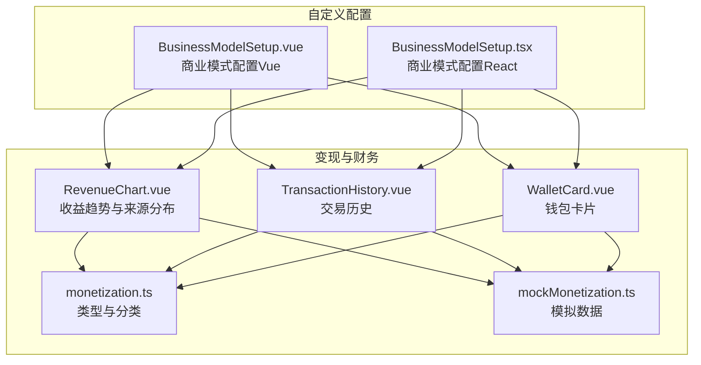
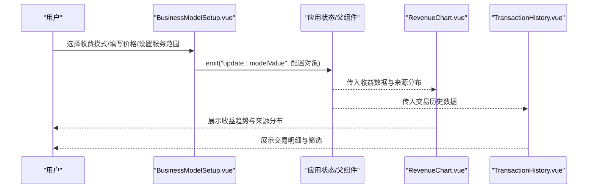
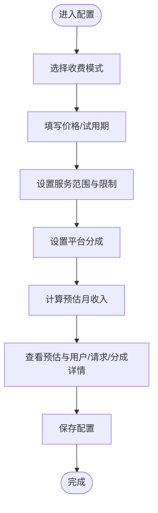
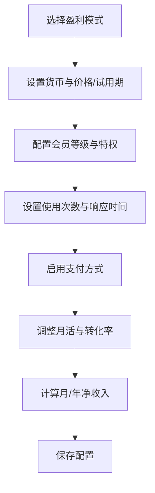
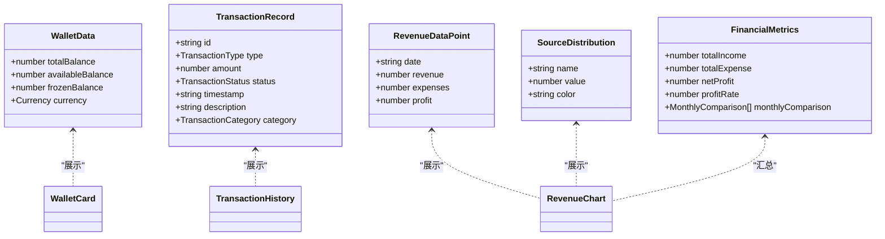
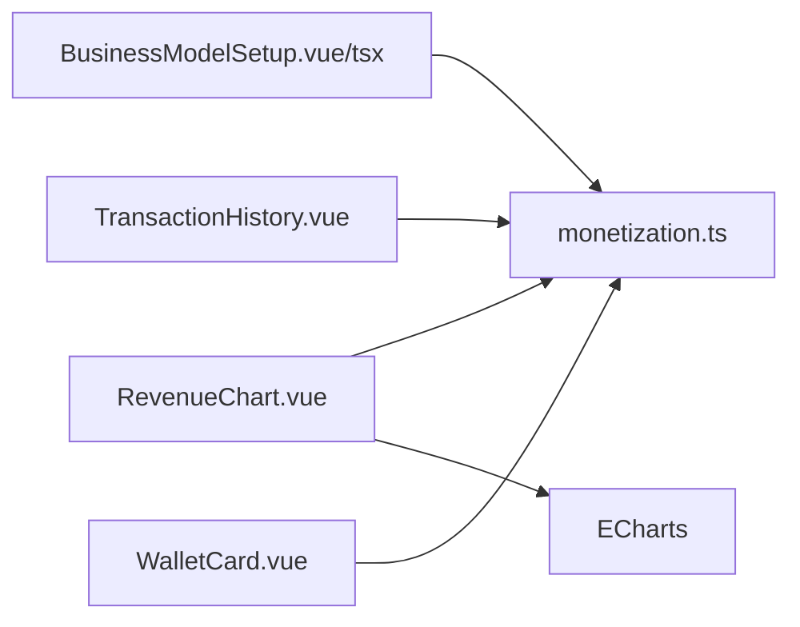

# 商业模式配置

<cite>
**本文引用的文件**
- [BusinessModelSetup.vue](file://apps/AgentPit/src/components/customize/BusinessModelSetup.vue)
- [BusinessModelSetup.tsx](file://apps/AgentPit/src-react-backup-20260410/components/customize/BusinessModelSetup.tsx)
- [mockMonetization.ts](file://apps/AgentPit/src/data/mockMonetization.ts)
- [RevenueChart.vue](file://apps/AgentPit/src/components/monetization/RevenueChart.vue)
- [TransactionHistory.vue](file://apps/AgentPit/src/components/monetization/TransactionHistory.vue)
- [WalletCard.vue](file://apps/AgentPit/src/components/monetization/WalletCard.vue)
- [monetization.ts](file://apps/AgentPit/src/types/monetization.ts)
</cite>

## 目录
1. [简介](#简介)
2. [项目结构](#项目结构)
3. [核心组件](#核心组件)
4. [架构概览](#架构概览)
5. [详细组件分析](#详细组件分析)
6. [依赖关系分析](#依赖关系分析)
7. [性能考量](#性能考量)
8. [故障排查指南](#故障排查指南)
9. [结论](#结论)
10. [附录](#附录)

## 简介
本指南围绕 AgentPit 应用中的“商业模式配置”能力展开，重点基于 BusinessModelSetup 组件（Vue 版本与 React 版本并存），系统讲解如何配置收费模式、服务条款与收益分配，并结合收益可视化与交易流水等模块，帮助你完成从定价策略到合规风控的全链路设计。文档同时提供不同商业模式的适用场景、配置步骤、成本核算方法、切换影响与迁移注意事项，以及实际案例与最佳实践建议。

## 项目结构
与“商业模式配置”直接相关的前端代码主要位于 AgentPit 应用的 customize 与 monetization 子目录中，分别负责商业模式配置与收益展示；monetization 数据模型与模拟数据位于 types 与 data 目录中，支撑收益图表与交易历史展示。

**图表来源**
- [BusinessModelSetup.vue:1-330](file://apps/AgentPit/src/components/customize/BusinessModelSetup.vue#L1-L330)
- [BusinessModelSetup.tsx:1-544](file://apps/AgentPit/src-react-backup-20260410/components/customize/BusinessModelSetup.tsx#L1-L544)
- [RevenueChart.vue:1-336](file://apps/AgentPit/src/components/monetization/RevenueChart.vue#L1-L336)
- [TransactionHistory.vue:1-253](file://apps/AgentPit/src/components/monetization/TransactionHistory.vue#L1-L253)
- [WalletCard.vue:1-116](file://apps/AgentPit/src/components/monetization/WalletCard.vue#L1-L116)
- [monetization.ts:1-135](file://apps/AgentPit/src/types/monetization.ts#L1-L135)
- [mockMonetization.ts:1-145](file://apps/AgentPit/src/data/mockMonetization.ts#L1-L145)

**章节来源**
- [BusinessModelSetup.vue:1-330](file://apps/AgentPit/src/components/customize/BusinessModelSetup.vue#L1-L330)
- [BusinessModelSetup.tsx:1-544](file://apps/AgentPit/src-react-backup-20260410/components/customize/BusinessModelSetup.tsx#L1-L544)
- [mockMonetization.ts:1-145](file://apps/AgentPit/src/data/mockMonetization.ts#L1-L145)

## 核心组件
本节聚焦 BusinessModelSetup 组件的商业模式配置能力，涵盖收费模式、服务范围、平台分成与试用设置，并给出定价策略与成本核算建议。

- 收费模式设置
  - 免费模式：无限制但带水印（Vue 版本）
  - 订阅制：月付/季付/年付（Vue 版本）
  - 按次付费：单次价格设置（Vue 版本）
  - 会员等级：普通/VIP/SVIP 三档（Vue 版本）
  - 增值服务/广告分成（React 版本）

- 服务范围与限制
  - 可用时段：支持添加/删除时间段
  - 并发用户上限、每日请求限额、API 频率限制（分钟）
  - 响应时间承诺（React 版本）

- 收益分配与试用
  - 平台抽成比例（0%-50%）
  - 试用期天数（0 表示无试用）
  - 会员等级与功能列表（Vue 版本）
  - 支付方式开关（React 版本）

- 预估月收入
  - Vue 版本内置预估函数，结合并发用户、日请求量与平台分成计算
  - React 版本提供“收益预估计算器”，可调整预计月活与付费转化率

**章节来源**
- [BusinessModelSetup.vue:29-120](file://apps/AgentPit/src/components/customize/BusinessModelSetup.vue#L29-L120)
- [BusinessModelSetup.tsx:33-114](file://apps/AgentPit/src-react-backup-20260410/components/customize/BusinessModelSetup.tsx#L33-L114)

## 架构概览
下图展示了商业模式配置与收益展示之间的数据流与交互关系：配置变更通过 emit/update 传播到上层，收益图表与交易历史消费这些数据并进行可视化呈现。

**图表来源**
- [BusinessModelSetup.vue:107-120](file://apps/AgentPit/src/components/customize/BusinessModelSetup.vue#L107-L120)
- [RevenueChart.vue:26-31](file://apps/AgentPit/src/components/monetization/RevenueChart.vue#L26-L31)
- [TransactionHistory.vue:5-9](file://apps/AgentPit/src/components/monetization/TransactionHistory.vue#L5-L9)

## 详细组件分析

### Vue 版本：BusinessModelSetup.vue
该组件提供直观的图形化界面，支持多种收费模式与服务限制配置，并内置预估月收入计算。

- 关键特性
  - 收费模式选择：免费、订阅制、按次付费、会员等级
  - 会员等级管理：增删等级、设置价格、编辑功能列表
  - 服务范围：可用时段、并发用户上限、日请求限额、API 频率限制
  - 平台分成与试用：滑块调节抽成比例，输入试用天数
  - 实时预估：根据并发用户、日请求数与平台分成计算预估月收入

- 数据结构要点
  - 模式字段：free/subscription/payPerUse/membership
  - 价格字段：monthlyPrice/quartelyPrice/yearlyPrice/perUsePrice/trialDays
  - 服务限制：availableSlots/maxConcurrentUsers/dailyRequestLimit/apiRateLimit
  - 分成与试用：platformCommission/trialSettings

- 预估月收入公式（简化说明）
  - 订阅制：基准用户 × 月单价 × （1 - 平台抽成）
  - 按次付费：日均用户 × 日均请求 × 单次价格 × （1 - 平台抽成）
  - 会员等级：平均等级价格 × 基准用户 × 0.6 × （1 - 平台抽成）
  - 免费模式：默认为 0

**图表来源**
- [BusinessModelSetup.vue:36-56](file://apps/AgentPit/src/components/customize/BusinessModelSetup.vue#L36-L56)

**章节来源**
- [BusinessModelSetup.vue:1-330](file://apps/AgentPit/src/components/customize/BusinessModelSetup.vue#L1-L330)

### React 版本：BusinessModelSetup.tsx
该组件提供更丰富的模式与支付方式配置，强调收益预估与服务范围定义。

- 关键特性
  - 盈利模式：免费、付费订阅、按次付费、增值服务、广告分成
  - 定价策略：货币类型、月/年价格、免费试用天数、会员等级体系
  - 服务范围：日/月使用次数限制、响应时间承诺
  - 支付方式：支付宝、微信、信用卡、加密货币开关
  - 收益预估：预计月活用户、付费转化率、月/年净收入

- 数据结构要点
  - 模式字段：free/subscription/payPerUse/freemium/adRevenue
  - 价格字段：currency/monthlyPrice/yearlyPrice/perUsePrice/trialDays
  - 会员等级：name/price/features
  - 服务限制：dailyLimit/monthlyLimit/responseTime
  - 支付方式：alipay/wechat/creditcard/crypto

- 收益预估流程（简化说明）
  - 订阅制：月活 × 转化率 × 月单价
  - 按次付费：月活 × 转化率 × 每用户使用次数 × 单次价格
  - 增值服务：付费用户 × 月单价
  - 广告分成：月活 × 每用户广告收益
  - 扣除平台抽成后得到净收入

**图表来源**
- [BusinessModelSetup.tsx:80-114](file://apps/AgentPit/src-react-backup-20260410/components/customize/BusinessModelSetup.tsx#L80-L114)

**章节来源**
- [BusinessModelSetup.tsx:1-544](file://apps/AgentPit/src-react-backup-20260410/components/customize/BusinessModelSetup.tsx#L1-L544)

### 收益与交易可视化
- 收益趋势与来源分布：支持折线/柱状图切换、时间范围选择、收入来源饼图
- 交易历史：支持搜索、类型筛选、状态筛选、分页与状态标识
- 钱包卡片：总余额、可用余额、冻结金额、多币种切换与充值/提现入口

**图表来源**
- [WalletCard.vue:1-116](file://apps/AgentPit/src/components/monetization/WalletCard.vue#L1-L116)
- [TransactionHistory.vue:1-253](file://apps/AgentPit/src/components/monetization/TransactionHistory.vue#L1-L253)
- [RevenueChart.vue:1-336](file://apps/AgentPit/src/components/monetization/RevenueChart.vue#L1-L336)
- [monetization.ts:16-135](file://apps/AgentPit/src/types/monetization.ts#L16-L135)

**章节来源**
- [RevenueChart.vue:1-336](file://apps/AgentPit/src/components/monetization/RevenueChart.vue#L1-L336)
- [TransactionHistory.vue:1-253](file://apps/AgentPit/src/components/monetization/TransactionHistory.vue#L1-L253)
- [WalletCard.vue:1-116](file://apps/AgentPit/src/components/monetization/WalletCard.vue#L1-L116)
- [monetization.ts:1-135](file://apps/AgentPit/src/types/monetization.ts#L1-L135)
- [mockMonetization.ts:1-145](file://apps/AgentPit/src/data/mockMonetization.ts#L1-L145)

## 依赖关系分析
- 组件耦合
  - BusinessModelSetup.vue/tsx 作为配置入口，向上游 emit 配置对象，下游由收益图表与交易历史消费
  - 收益图表与交易历史依赖统一的数据类型定义（monetization.ts）
- 外部依赖
  - 图表渲染：ECharts（RevenueChart.vue 引入）
  - 国际化与格式化：Intl.NumberFormat（WalletCard.vue）

**图表来源**
- [BusinessModelSetup.vue:1-12](file://apps/AgentPit/src/components/customize/BusinessModelSetup.vue#L1-L12)
- [BusinessModelSetup.tsx:1-27](file://apps/AgentPit/src-react-backup-20260410/components/customize/BusinessModelSetup.tsx#L1-L27)
- [RevenueChart.vue:1-24](file://apps/AgentPit/src/components/monetization/RevenueChart.vue#L1-L24)
- [monetization.ts:1-135](file://apps/AgentPit/src/types/monetization.ts#L1-L135)

**章节来源**
- [BusinessModelSetup.vue:1-12](file://apps/AgentPit/src/components/customize/BusinessModelSetup.vue#L1-L12)
- [BusinessModelSetup.tsx:1-27](file://apps/AgentPit/src-react-backup-20260410/components/customize/BusinessModelSetup.tsx#L1-L27)
- [RevenueChart.vue:1-24](file://apps/AgentPit/src/components/monetization/RevenueChart.vue#L1-L24)
- [monetization.ts:1-135](file://apps/AgentPit/src/types/monetization.ts#L1-L135)

## 性能考量
- 配置更新频率
  - Vue 版本通过深度监听与 emitUpdate 同步配置，建议在批量修改时减少触发次数
  - React 版本通过 onChange 合并更新，避免频繁重渲染
- 图表渲染
  - RevenueChart 使用 ECharts，建议在大数据量时启用 autoresize 并控制 series 数量
- 交易历史分页
  - TransactionHistory 采用分页与过滤，建议在移动端优化滚动体验

[本节为通用指导，无需特定文件引用]

## 故障排查指南
- 配置未生效
  - 确认 emit 或 onChange 是否正确传递到父组件
  - 检查是否遗漏关键字段（如价格、试用天数、服务限制）
- 收益预估异常
  - 核对并发用户、日请求量与平台分成比例
  - 确认模式选择与对应的价格字段是否填写
- 图表显示异常
  - 检查 ECharts 初始化与容器尺寸
  - 确认传入数据格式与类型一致
- 交易历史为空
  - 检查筛选条件与搜索关键词
  - 确认数据源是否为空或格式错误

**章节来源**
- [BusinessModelSetup.vue:107-120](file://apps/AgentPit/src/components/customize/BusinessModelSetup.vue#L107-L120)
- [BusinessModelSetup.tsx:116-128](file://apps/AgentPit/src-react-backup-20260410/components/customize/BusinessModelSetup.tsx#L116-L128)
- [RevenueChart.vue:251-253](file://apps/AgentPit/src/components/monetization/RevenueChart.vue#L251-L253)
- [TransactionHistory.vue:58-65](file://apps/AgentPit/src/components/monetization/TransactionHistory.vue#L58-L65)

## 结论
通过 BusinessModelSetup 组件，你可以灵活地配置多种商业模式，结合收益图表与交易历史实现闭环的财务可观测性。建议在正式上线前完成定价策略校准、合规审查与风险评估，并建立定期复盘机制以持续优化收益模型。

[本节为总结性内容，无需特定文件引用]

## 附录

### 商业模式特点与适用场景
- 免费模式
  - 特点：零门槛获取，提升用户规模
  - 适用：拉新、教育类产品、开源生态
- 订阅制
  - 特点：稳定现金流，提升用户粘性
  - 适用：SaaS、工具类、内容付费
- 按次付费
  - 特点：低频高价值，成本可控
  - 适用：AI 推理、查询服务、一次性任务
- 会员等级
  - 特点：分层权益，提高 ARPU
  - 适用：社区、内容平台、会员制服务
- 增值服务/广告分成
  - 特点：免费吸引流量，通过高级功能或广告变现
  - 适用：媒体、社交、资讯平台

### 定价策略制定与成本核算建议
- 定价策略
  - 成本导向：以单位成本 + 目标利润率确定基础价格
  - 竞争导向：参考竞品价格区间，结合差异化价值定位
  - 价值导向：依据用户感知价值设定价格，配合试用与升级策略
- 成本核算
  - 直接成本：算力、存储、网络、第三方服务
  - 间接成本：运营、客服、市场、合规与风控
  - 折旧摊销：设备、软件许可、基础设施
- 收益目标
  - 设定月/年收入目标，分解到各模式与用户层级
  - 通过预估月收入与实际对比，动态调整价格与资源投入

### 商业合规性检查清单与风险控制
- 合规检查
  - 明码标价：清晰标注价格、周期、退费规则
  - 用户协议：明确使用范围、隐私政策、免责条款
  - 支付安全：保障支付通道合规、数据加密与风控
  - 数据保护：遵循最小必要原则，提供访问与删除权
- 风险控制
  - 价格与促销：避免价格歧视与误导宣传
  - 退款与争议：建立清晰的退款流程与争议解决机制
  - 合同与税务：确保发票与税务合规，保留交易凭证
  - 审计与报告：定期生成财务与合规报告，留存证据链

### 商业模式切换影响分析与迁移注意事项
- 切换影响
  - 用户侧：价格变化、功能权限调整、试用期过渡
  - 财务侧：收入曲线变化、分成比例调整、报表口径统一
  - 运营侧：营销活动、客户沟通、客服话术更新
- 迁移步骤
  - 预热通知：提前公告切换计划与过渡期安排
  - 渐进式迁移：灰度放量、回滚预案、监控告警
  - 对账与核销：统一计费口径、清理历史欠费、对齐报表
  - 复盘与优化：收集反馈、优化定价与服务策略

### 实际案例与最佳实践
- 案例一：从免费到订阅制
  - 步骤：免费基础版引流 → 试用期引导升级 → 会员等级分层 → 订阅自动续费
  - 关键：降低升级门槛、突出高阶价值、完善续费提醒
- 案例二：按次付费与会员组合
  - 步骤：低单价高频次满足日常需求 → 会员折扣提升复购
  - 关键：区分使用场景、设置合理限额、避免滥用
- 最佳实践
  - 以数据驱动：通过 A/B 测试验证不同模式与价格
  - 以用户为中心：关注生命周期价值与满意度
  - 以合规为准：建立内审与法务协同机制

[本节为概念性内容，无需特定文件引用]