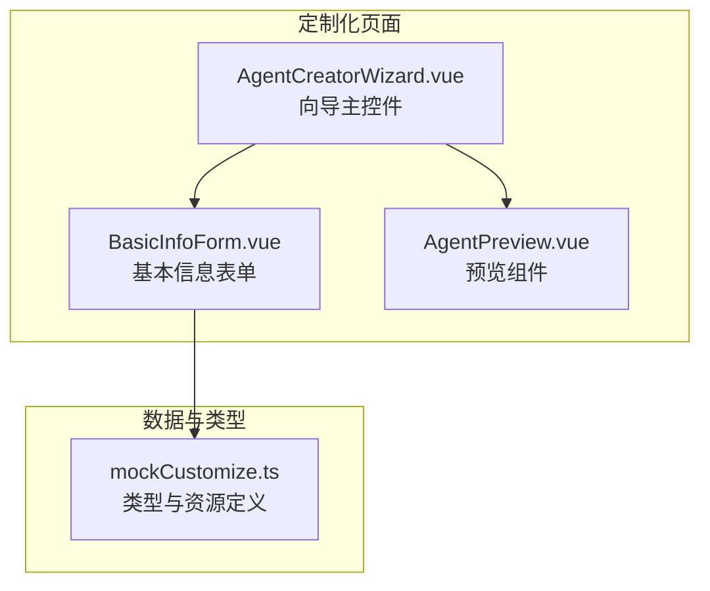
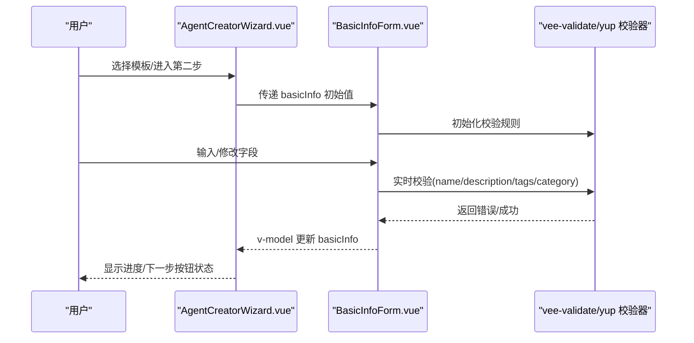
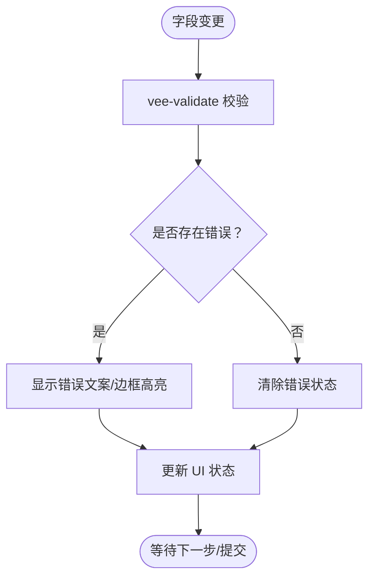
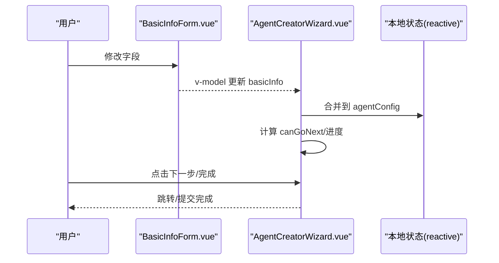
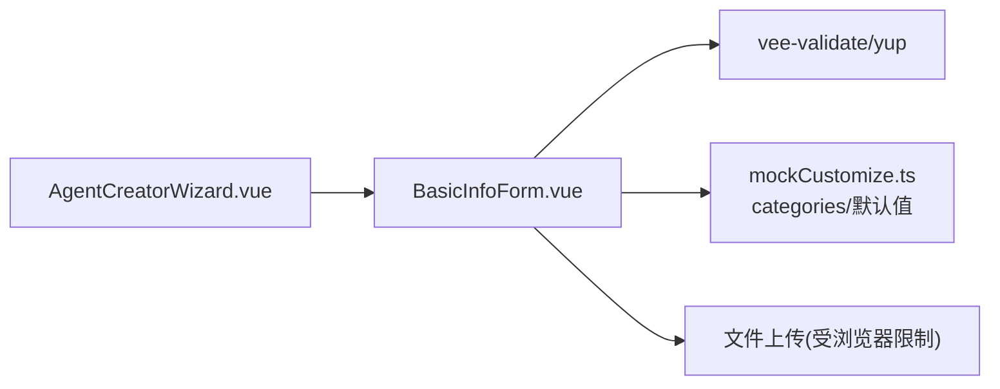

# 基本信息配置

<cite>
**本文引用的文件**
- [BasicInfoForm.vue](file://apps/AgentPit/src/components/customize/BasicInfoForm.vue)
- [mockCustomize.ts](file://apps/AgentPit/src/data/mockCustomize.ts)
- [AgentCreatorWizard.vue](file://apps/AgentPit/src/components/customize/AgentCreatorWizard.vue)
</cite>

## 目录
1. [引言](#引言)
2. [项目结构](#项目结构)
3. [核心组件](#核心组件)
4. [架构总览](#架构总览)
5. [详细组件分析](#详细组件分析)
6. [依赖关系分析](#依赖关系分析)
7. [性能与可维护性](#性能与可维护性)
8. [故障排查指南](#故障排查指南)
9. [结论](#结论)
10. [附录](#附录)

## 引言
本指南围绕“基本信息配置”功能展开，聚焦于 Vue 版本的 BasicInfoForm 组件。该组件用于收集智能体的核心元数据，包括名称、描述、头像、标签、分类等字段，并通过 vee-validate/yup 实现强约束的实时校验与错误反馈。文档将逐项说明各字段的验证规则、长度限制、格式要求与必填状态；解释实时校验与错误提示机制；给出填写最佳实践与 SEO 优化建议；梳理数据提交流程、状态管理与错误处理；并提供重置、保存草稿与批量编辑的使用方法及常见错误诊断。

## 项目结构
BasicInfoForm 位于 AgentPit 应用的定制化页面模块中，作为“创建智能体”向导的第二步被消费。其数据来源与类型定义来自 mockCustomize.ts，后者提供了头像库、分类列表、模板与默认配置等资源。

图表来源
- [AgentCreatorWizard.vue:1-300](file://apps/AgentPit/src/components/customize/AgentCreatorWizard.vue#L1-L300)
- [BasicInfoForm.vue:1-284](file://apps/AgentPit/src/components/customize/BasicInfoForm.vue#L1-L284)
- [mockCustomize.ts:1-911](file://apps/AgentPit/src/data/mockCustomize.ts#L1-L911)

章节来源
- [AgentCreatorWizard.vue:1-300](file://apps/AgentPit/src/components/customize/AgentCreatorWizard.vue#L1-L300)
- [BasicInfoForm.vue:1-284](file://apps/AgentPit/src/components/customize/BasicInfoForm.vue#L1-L284)
- [mockCustomize.ts:1-911](file://apps/AgentPit/src/data/mockCustomize.ts#L1-L911)

## 核心组件
- BasicInfoForm.vue：负责收集与校验智能体基本信息，提供头像选择、标签管理、分类选择等功能，并通过 v-model 向父组件回传更新后的 basicInfo 数据。
- AgentCreatorWizard.vue：向导主控件，协调步骤流转与全局配置状态，第二步即挂载 BasicInfoForm。
- mockCustomize.ts：提供 AgentConfig 类型、categories 列表、avatarLibrary、agentTemplates 等资源，支撑表单渲染与默认值。

章节来源
- [BasicInfoForm.vue:1-284](file://apps/AgentPit/src/components/customize/BasicInfoForm.vue#L1-L284)
- [AgentCreatorWizard.vue:1-300](file://apps/AgentPit/src/components/customize/AgentCreatorWizard.vue#L1-L300)
- [mockCustomize.ts:868-876](file://apps/AgentPit/src/data/mockCustomize.ts#L868-L876)

## 架构总览
下图展示向导与表单之间的数据流与交互关系：

图表来源
- [AgentCreatorWizard.vue:20-98](file://apps/AgentPit/src/components/customize/AgentCreatorWizard.vue#L20-L98)
- [BasicInfoForm.vue:16-115](file://apps/AgentPit/src/components/customize/BasicInfoForm.vue#L16-L115)

## 详细组件分析

### 字段清单与验证规则
以下为 BasicInfoForm 的核心字段及其验证策略、长度限制、格式要求与必填状态说明（来源于 vee-validate/yup schema 与模板默认值）：

- 智能体名称（必填）
  - 必填：是
  - 最短：2
  - 最长：50
  - 错误提示：当为空、少于2字符或多于50字符时显示相应错误
  - 实时反馈：显示当前字符数/上限，错误时边框变红
  - 建议：简洁易记，体现智能体特点

- 描述信息（选填）
  - 必填：否
  - 最长：500
  - 支持：Markdown 预览切换
  - 实时反馈：显示当前字符数/上限，错误时边框变红
  - 建议：清晰说明功能与价值主张，便于检索与展示

- 头像设置（选填）
  - 选项：预设头像库（emoji）或上传自定义图片
  - 上传限制：JPG/PNG/WebP，≤2MB
  - 实时反馈：点击头像时高亮选中，上传后即时预览
  - 建议：选择与角色定位相符的视觉元素

- 标签（选填，最多10个）
  - 最大数量：10
  - 输入方式：输入后按回车或逗号分隔添加
  - 删除：点击标签右侧“×”
  - 实时反馈：达到上限禁用输入框
  - 建议：使用与业务相关性强、区分度高的关键词

- 分类（必填）
  - 必填：是
  - 选项：助手/创作/分析/客服/娱乐/教育/其他
  - 实时反馈：错误时边框变红
  - 建议：与智能体核心能力匹配，利于市场归类与检索

章节来源
- [BasicInfoForm.vue:16-115](file://apps/AgentPit/src/components/customize/BasicInfoForm.vue#L16-L115)
- [mockCustomize.ts:868-876](file://apps/AgentPit/src/data/mockCustomize.ts#L868-L876)

### 实时验证与错误提示机制
- 初始化：组件加载时根据 schema 对初始值进行一次校验。
- 实时校验：字段变更时触发校验，错误对象 errors 由 vee-validate 管理，表单项动态高亮与错误文案显示。
- 用户体验：
  - 文本字段显示当前字符数/上限。
  - Markdown 预览开关，便于检查排版。
  - 头像选择采用分组与过渡动画，降低认知负担。
- 提交时机：向导在第二步校验通过后才允许进入下一步。

图表来源
- [BasicInfoForm.vue:24-115](file://apps/AgentPit/src/components/customize/BasicInfoForm.vue#L24-L115)

章节来源
- [BasicInfoForm.vue:24-115](file://apps/AgentPit/src/components/customize/BasicInfoForm.vue#L24-L115)

### 表单数据提交流程与状态管理
- 数据绑定：v-model 双向绑定 basicInfo，父组件（向导）持有完整 AgentConfig 并在每步更新对应子域。
- 步骤控制：向导根据当前步骤与校验结果计算 canGoNext，确保第二步（基本信息）通过后才能前进。
- 提交完成：最后一步点击“完成创建”，向导发出 complete 事件，携带完整配置对象。

图表来源
- [AgentCreatorWizard.vue:32-98](file://apps/AgentPit/src/components/customize/AgentCreatorWizard.vue#L32-L98)
- [BasicInfoForm.vue:11-14](file://apps/AgentPit/src/components/customize/BasicInfoForm.vue#L11-L14)

章节来源
- [AgentCreatorWizard.vue:32-98](file://apps/AgentPit/src/components/customize/AgentCreatorWizard.vue#L32-L98)
- [BasicInfoForm.vue:11-14](file://apps/AgentPit/src/components/customize/BasicInfoForm.vue#L11-L14)

### 字段配置与最佳实践
- 名称
  - 长度：2–50 字符
  - 建议：避免与现有热门名称重复，突出差异化定位
- 描述
  - 长度：≤500 字符
  - 建议：包含核心能力、适用场景与价值主张，便于搜索与推荐
- 头像
  - 建议：与角色定位一致，避免过于复杂或含糊不清的图标
- 标签
  - 数量：≤10 个
  - 建议：高频词优先，避免堆砌无意义标签
- 分类
  - 建议：与实际能力最贴近的一级分类，利于平台归类与用户检索

### SEO 优化建议
- 标题与描述：名称与描述应包含目标用户常搜索的关键词，提升平台内搜索可见性。
- 标签：使用与业务高度相关的标签，增强二次分发与推荐系统的识别度。
- 结构化表达：在描述中使用简短句式与要点列举，便于摘要与卡片展示。

### 重置、保存草稿与批量编辑
- 重置
  - 当前实现：表单未内置“重置为默认值”按钮。可在父组件（向导）中对 agentConfig.basicInfo 进行重置，从而清空表单并重新初始化。
- 保存草稿
  - 当前实现：表单未内置“保存草稿”按钮。可在父组件中监听 v-model 变更并持久化 basicInfo，结合路由或本地存储实现草稿保存。
- 批量编辑
  - 当前实现：表单未内置批量编辑入口。可在父组件中引入列表视图，批量选择多个智能体后统一进入编辑流程，逐项应用相同规则（如统一分类、批量加标签）。

章节来源
- [AgentCreatorWizard.vue:32-98](file://apps/AgentPit/src/components/customize/AgentCreatorWizard.vue#L32-L98)
- [BasicInfoForm.vue:11-14](file://apps/AgentPit/src/components/customize/BasicInfoForm.vue#L11-L14)

## 依赖关系分析
- 组件依赖
  - AgentCreatorWizard 依赖 BasicInfoForm 作为第二步内容。
  - BasicInfoForm 依赖 vee-validate/yup 进行校验，依赖 mockCustomize 中的 categories 与默认值。
- 数据依赖
  - 表单字段与默认值来自 AgentConfig.basicInfo；分类选项来自 categories。
- 外部依赖
  - vee-validate/yup：声明式校验与错误管理。
  - 文件上传：受控于浏览器文件类型与大小限制。

图表来源
- [AgentCreatorWizard.vue:1-300](file://apps/AgentPit/src/components/customize/AgentCreatorWizard.vue#L1-L300)
- [BasicInfoForm.vue:1-284](file://apps/AgentPit/src/components/customize/BasicInfoForm.vue#L1-L284)
- [mockCustomize.ts:868-876](file://apps/AgentPit/src/data/mockCustomize.ts#L868-L876)

章节来源
- [AgentCreatorWizard.vue:1-300](file://apps/AgentPit/src/components/customize/AgentCreatorWizard.vue#L1-L300)
- [BasicInfoForm.vue:1-284](file://apps/AgentPit/src/components/customize/BasicInfoForm.vue#L1-L284)
- [mockCustomize.ts:868-876](file://apps/AgentPit/src/data/mockCustomize.ts#L868-L876)

## 性能与可维护性
- 性能
  - 实时校验基于 vee-validate，开销可控；避免在高频输入中进行昂贵计算。
  - 头像选择采用分组与过渡动画，提升交互流畅度。
- 可维护性
  - 校验规则集中于 schema，便于统一维护与扩展。
  - 字段与默认值集中在 mockCustomize.ts，便于跨组件共享与测试。

## 故障排查指南
- 常见错误与修复
  - 名称为空/长度不合规：确保输入 2–50 字符，避免空白或超长。
  - 描述超长：控制在 500 字符以内，必要时精简表述。
  - 标签过多：删除多余标签至 ≤10 个，或合并相近标签。
  - 分类未选择：从下拉菜单中选择合适分类。
  - 头像上传失败：确认文件类型为 JPG/PNG/WebP，大小不超过 2MB。
- 调试建议
  - 在父组件中打印 agentConfig.basicInfo，核对字段值与类型。
  - 使用浏览器开发者工具查看 vee-validate 的 errors 对象，定位具体字段。
  - 若出现样式异常，检查 Tailwind 类名与深色模式主题变量。

章节来源
- [BasicInfoForm.vue:16-115](file://apps/AgentPit/src/components/customize/BasicInfoForm.vue#L16-L115)
- [mockCustomize.ts:868-876](file://apps/AgentPit/src/data/mockCustomize.ts#L868-L876)

## 结论
BasicInfoForm 通过严格的字段约束与实时反馈，确保智能体基本信息的质量与一致性。配合向导的步骤化流程与 vee-validate 的声明式校验，用户能够高效地完成创建任务。建议在实际落地中补充“重置/保存草稿/批量编辑”能力，并持续优化校验规则与用户体验。

## 附录
- 关键字段与默认值来源
  - categories：分类选项集合
  - defaultAgentConfig.basicInfo：默认基础信息
- 相关资源
  - avatarLibrary：头像库（emoji 分类）
  - agentTemplates：模板与推荐能力

章节来源
- [mockCustomize.ts:868-876](file://apps/AgentPit/src/data/mockCustomize.ts#L868-L876)
- [mockCustomize.ts:878-910](file://apps/AgentPit/src/data/mockCustomize.ts#L878-L910)
- [mockCustomize.ts:143-177](file://apps/AgentPit/src/data/mockCustomize.ts#L143-L177)