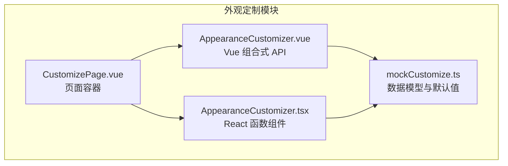
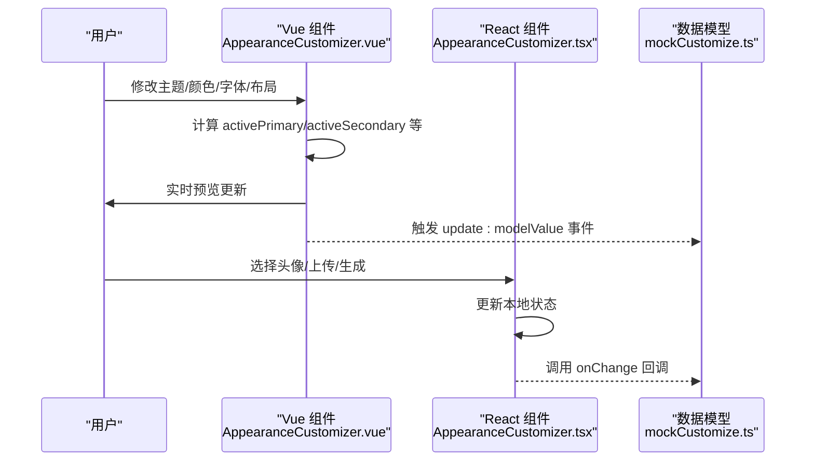
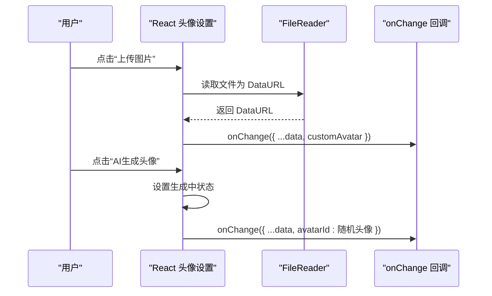
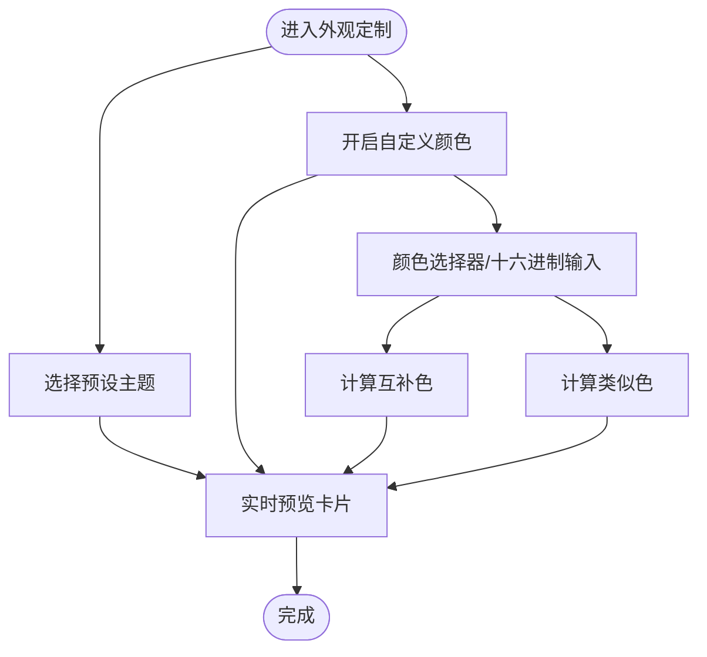
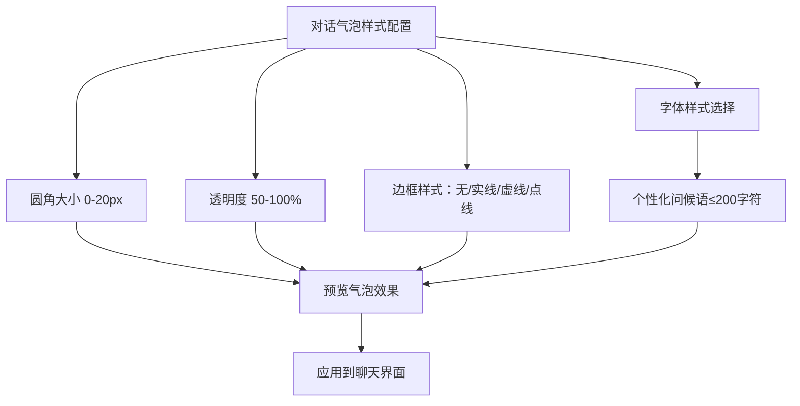
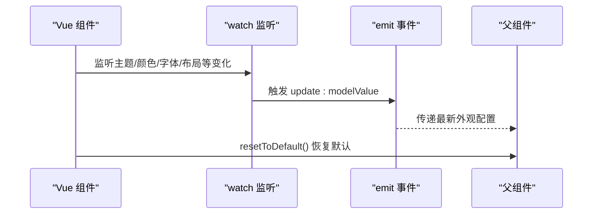
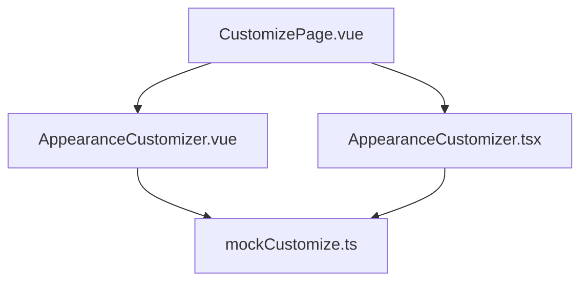

# 外观定制功能

<cite>
**本文引用的文件**
- [AppearanceCustomizer.vue](file://apps/AgentPit/src/components/customize/AppearanceCustomizer.vue)
- [AppearanceCustomizer.tsx](file://apps/AgentPit/src-react-backup-20260410/components/customize/AppearanceCustomizer.tsx)
- [mockCustomize.ts](file://apps/AgentPit/src/data/mockCustomize.ts)
- [CustomizePage.vue](file://apps/AgentPit/src/views/CustomizePage.vue)
</cite>

## 目录
1. [简介](#简介)
2. [项目结构](#项目结构)
3. [核心组件](#核心组件)
4. [架构概览](#架构概览)
5. [详细组件分析](#详细组件分析)
6. [依赖关系分析](#依赖关系分析)
7. [性能考虑](#性能考虑)
8. [故障排除指南](#故障排除指南)
9. [结论](#结论)
10. [附录](#附录)

## 简介
本指南聚焦于外观定制功能，围绕 AppearanceCustomizer 组件展开，系统性阐述以下定制维度：
- 头像设置：头像库浏览、分类筛选、自定义上传、AI 生成
- 主题配色系统：预设主题选择、自定义颜色配置、实时颜色预览
- 对话气泡样式：圆角大小调节、透明度控制、边框样式选择
- 字体与问候语：字体族选择、字号调节、个性化问候语设置
- 配置保存与恢复：双向绑定、深度监听、默认值重置
- 文件格式与尺寸规范：头像上传的格式要求与最佳实践
- 颜色输入格式：RGB 十六进制支持与互补/类似色计算
- 常见问题排查：典型配置问题与解决方案

## 项目结构
外观定制功能位于 AgentPit 应用中，采用 Vue 3 + TypeScript 的 Composition API 设计，并配套 React 版本组件作为参考实现。相关文件组织如下：
- Vue 版本：AppearanceCustomizer.vue（负责外观定制的交互与状态管理）
- React 版本：AppearanceCustomizer.tsx（提供更丰富的头像上传与 AI 生成流程）
- 数据模型：mockCustomize.ts（包含头像库、主题色板、字体选项、默认配置等）
- 页面容器：CustomizePage.vue（承载外观定制页的导航与布局）

**图表来源**
- [AppearanceCustomizer.vue:1-332](file://apps/AgentPit/src/components/customize/AppearanceCustomizer.vue#L1-L332)
- [AppearanceCustomizer.tsx:1-514](file://apps/AgentPit/src-react-backup-20260410/components/customize/AppearanceCustomizer.tsx#L1-L514)
- [mockCustomize.ts:1-911](file://apps/AgentPit/src/data/mockCustomize.ts#L1-L911)
- [CustomizePage.vue:1-191](file://apps/AgentPit/src/views/CustomizePage.vue#L1-L191)

**章节来源**
- [AppearanceCustomizer.vue:1-332](file://apps/AgentPit/src/components/customize/AppearanceCustomizer.vue#L1-L332)
- [AppearanceCustomizer.tsx:1-514](file://apps/AgentPit/src-react-backup-20260410/components/customize/AppearanceCustomizer.tsx#L1-L514)
- [mockCustomize.ts:1-911](file://apps/AgentPit/src/data/mockCustomize.ts#L1-L911)
- [CustomizePage.vue:1-191](file://apps/AgentPit/src/views/CustomizePage.vue#L1-L191)

## 核心组件
本功能的核心是 AppearanceCustomizer 组件，分别在 Vue 和 React 中实现。两者共享统一的数据模型与配置接口，但在交互细节上有所差异。

- Vue 版本（AppearanceCustomizer.vue）
  - 使用 ref/computed/watch 管理状态与响应式更新
  - 提供主题色选择、自定义颜色开关、实时预览、字体与字号调节、布局风格、样式细节（圆角、阴影、深色模式）
  - 默认值通过深度监听触发更新事件，支持一键重置为默认

- React 版本（AppearanceCustomizer.tsx）
  - 使用 useState 管理本地状态
  - 提供头像库分类筛选、头像网格选择、自定义上传、AI 生成头像（模拟）
  - 支持自定义颜色输入（颜色选择器与文本框），并提供主题色预览
  - 对话气泡样式（圆角、透明度、边框样式）与字体、问候语设置

**章节来源**
- [AppearanceCustomizer.vue:1-332](file://apps/AgentPit/src/components/customize/AppearanceCustomizer.vue#L1-L332)
- [AppearanceCustomizer.tsx:1-514](file://apps/AgentPit/src-react-backup-20260410/components/customize/AppearanceCustomizer.tsx#L1-L514)

## 架构概览
外观定制功能采用“组件-数据模型”分离设计：
- 组件层：负责用户交互与状态变更
- 数据层：提供头像库、主题色板、字体选项、默认配置等静态数据
- 事件层：通过 emit/update 事件向上游传递配置变更

**图表来源**
- [AppearanceCustomizer.vue:66-86](file://apps/AgentPit/src/components/customize/AppearanceCustomizer.vue#L66-L86)
- [AppearanceCustomizer.tsx:25-230](file://apps/AgentPit/src-react-backup-20260410/components/customize/AppearanceCustomizer.tsx#L25-L230)
- [mockCustomize.ts:39-93](file://apps/AgentPit/src/data/mockCustomize.ts#L39-L93)

## 详细组件分析

### 头像设置（Vue 版本）
- 头像库浏览与分类筛选
  - 通过主题色数组渲染预览色块，点击切换主题
  - 在使用自定义颜色时，禁用主题选中高亮
- 自定义上传
  - Vue 版本未提供头像上传功能；如需上传，请参考 React 版本
- AI 生成
  - Vue 版本未提供 AI 生成头像功能；如需生成，请参考 React 版本

**章节来源**
- [AppearanceCustomizer.vue:109-122](file://apps/AgentPit/src/components/customize/AppearanceCustomizer.vue#L109-L122)
- [AppearanceCustomizer.vue:138-174](file://apps/AgentPit/src/components/customize/AppearanceCustomizer.vue#L138-L174)

### 头像设置（React 版本）
- 头像库浏览与分类筛选
  - 提供“全部/人物/动物/抽象/科技”等分类标签
  - 过滤后的头像网格支持点击选择
- 自定义上传
  - 通过文件输入接收图片，使用 FileReader 读取为 DataURL 并回传给父组件
  - 支持移除自定义头像
- AI 生成
  - 模拟 AI 生成过程，随机选择一个头像并回传

**图表来源**
- [AppearanceCustomizer.tsx:60-69](file://apps/AgentPit/src-react-backup-20260410/components/customize/AppearanceCustomizer.tsx#L60-L69)
- [AppearanceCustomizer.tsx:51-58](file://apps/AgentPit/src-react-backup-20260410/components/customize/AppearanceCustomizer.tsx#L51-L58)

**章节来源**
- [AppearanceCustomizer.tsx:31-42](file://apps/AgentPit/src-react-backup-20260410/components/customize/AppearanceCustomizer.tsx#L31-L42)
- [AppearanceCustomizer.tsx:102-118](file://apps/AgentPit/src-react-backup-20260410/components/customize/AppearanceCustomizer.tsx#L102-L118)
- [AppearanceCustomizer.tsx:121-149](file://apps/AgentPit/src-react-backup-20260410/components/customize/AppearanceCustomizer.tsx#L121-L149)
- [AppearanceCustomizer.tsx:151-166](file://apps/AgentPit/src-react-backup-20260410/components/customize/AppearanceCustomizer.tsx#L151-L166)

### 主题配色系统
- 预设主题选择
  - 渲染多个主题色板，点击切换当前主题
  - 当启用自定义颜色时，禁用主题选中高亮
- 自定义颜色配置
  - 开关“使用自定义颜色”，启用后可独立配置主色、辅色、强调色
  - Vue 版本提供颜色选择器与十六进制输入，实时计算互补色与类似色
- 实时颜色预览
  - 展示主色、辅色、互补色、类似色的视觉效果
  - 预览卡片支持圆角与阴影强度联动

**图表来源**
- [AppearanceCustomizer.vue:109-174](file://apps/AgentPit/src/components/customize/AppearanceCustomizer.vue#L109-L174)
- [AppearanceCustomizer.vue:31-50](file://apps/AgentPit/src/components/customize/AppearanceCustomizer.vue#L31-L50)

**章节来源**
- [AppearanceCustomizer.vue:109-174](file://apps/AgentPit/src/components/customize/AppearanceCustomizer.vue#L109-L174)
- [AppearanceCustomizer.vue:138-174](file://apps/AgentPit/src/components/customize/AppearanceCustomizer.vue#L138-L174)

### 对话气泡样式
- 圆角大小调节
  - 范围 0-20px，影响智能体与用户消息气泡的圆角半径
- 透明度控制
  - 范围 50%-100%，影响智能体消息气泡的透明度
- 边框样式选择
  - 无边框、实线、虚线、点线四种样式
- 字体与问候语
  - 字体样式：系统默认、微软雅黑、苹方、Arial、Georgia、Courier New
  - 个性化问候语：最多 200 字，实时字数统计

**图表来源**
- [AppearanceCustomizer.tsx:404-464](file://apps/AgentPit/src-react-backup-20260410/components/customize/AppearanceCustomizer.tsx#L404-L464)
- [AppearanceCustomizer.tsx:467-505](file://apps/AgentPit/src-react-backup-20260410/components/customize/AppearanceCustomizer.tsx#L467-L505)

**章节来源**
- [AppearanceCustomizer.tsx:404-464](file://apps/AgentPit/src-react-backup-20260410/components/customize/AppearanceCustomizer.tsx#L404-L464)
- [AppearanceCustomizer.tsx:467-505](file://apps/AgentPit/src-react-backup-20260410/components/customize/AppearanceCustomizer.tsx#L467-L505)

### 字体与问候语设置
- 标题字体与正文字体
  - 通过下拉菜单选择，支持系统默认与多种中英文字体
  - 实时预览区展示当前字体与字号的实际效果
- 字号大小
  - 12-24px 范围，步进 1px
  - 预览区同步展示标题与正文的排版效果
- 深色模式
  - 切换深色背景与浅色文字，适配不同阅读环境

**章节来源**
- [AppearanceCustomizer.vue:181-234](file://apps/AgentPit/src/components/customize/AppearanceCustomizer.vue#L181-L234)
- [AppearanceCustomizer.vue:220-233](file://apps/AgentPit/src/components/customize/AppearanceCustomizer.vue#L220-L233)
- [AppearanceCustomizer.vue:303-319](file://apps/AgentPit/src/components/customize/AppearanceCustomizer.vue#L303-L319)

### 布局风格与样式细节
- 布局风格
  - 卡片式、列表式、时间线式、仪表盘式四类布局
  - 通过图标与标签直观展示，点击切换当前布局
- 样式细节
  - 圆角大小：0-20px
  - 阴影强度：无/轻/中/重
  - 深色模式：开关切换

**章节来源**
- [AppearanceCustomizer.vue:52-57](file://apps/AgentPit/src/components/customize/AppearanceCustomizer.vue#L52-L57)
- [AppearanceCustomizer.vue:241-258](file://apps/AgentPit/src/components/customize/AppearanceCustomizer.vue#L241-L258)
- [AppearanceCustomizer.vue:265-320](file://apps/AgentPit/src/components/customize/AppearanceCustomizer.vue#L265-L320)

### 配置保存与恢复
- Vue 版本
  - 使用 watch 监听多个响应式引用，触发 emit('update:modelValue', payload)
  - 提供 resetToDefault 方法，一键恢复默认外观配置
- React 版本
  - 通过 onChange 回调将当前配置回传给父组件
  - 支持自定义头像与 AI 生成头像的状态回传

**图表来源**
- [AppearanceCustomizer.vue:84-86](file://apps/AgentPit/src/components/customize/AppearanceCustomizer.vue#L84-L86)
- [AppearanceCustomizer.vue:88-99](file://apps/AgentPit/src/components/customize/AppearanceCustomizer.vue#L88-L99)

**章节来源**
- [AppearanceCustomizer.vue:66-86](file://apps/AgentPit/src/components/customize/AppearanceCustomizer.vue#L66-L86)
- [AppearanceCustomizer.vue:88-99](file://apps/AgentPit/src/components/customize/AppearanceCustomizer.vue#L88-L99)
- [AppearanceCustomizer.tsx:25-230](file://apps/AgentPit/src-react-backup-20260410/components/customize/AppearanceCustomizer.tsx#L25-L230)

## 依赖关系分析
外观定制功能的依赖关系清晰，遵循“组件-数据模型”分层：
- AppearanceCustomizer.vue 依赖 mockCustomize.ts 中的主题色板、字体选项与默认配置
- AppearanceCustomizer.tsx 同样依赖 mockCustomize.ts 的头像库与主题色板
- CustomizePage.vue 作为页面容器，承载两个版本的外观定制组件

**图表来源**
- [AppearanceCustomizer.vue:1-12](file://apps/AgentPit/src/components/customize/AppearanceCustomizer.vue#L1-L12)
- [AppearanceCustomizer.tsx:1-23](file://apps/AgentPit/src-react-backup-20260410/components/customize/AppearanceCustomizer.tsx#L1-L23)
- [mockCustomize.ts:1-911](file://apps/AgentPit/src/data/mockCustomize.ts#L1-L911)
- [CustomizePage.vue:1-51](file://apps/AgentPit/src/views/CustomizePage.vue#L1-L51)

**章节来源**
- [AppearanceCustomizer.vue:1-12](file://apps/AgentPit/src/components/customize/AppearanceCustomizer.vue#L1-L12)
- [AppearanceCustomizer.tsx:1-23](file://apps/AgentPit/src-react-backup-20260410/components/customize/AppearanceCustomizer.tsx#L1-L23)
- [mockCustomize.ts:1-911](file://apps/AgentPit/src/data/mockCustomize.ts#L1-L911)
- [CustomizePage.vue:1-51](file://apps/AgentPit/src/views/CustomizePage.vue#L1-L51)

## 性能考虑
- 响应式更新
  - Vue 版本通过 watch 深度监听多项配置，确保每次变更即时触发更新事件
  - React 版本通过 useState 管理局部状态，onChange 回调按需回传
- 实时预览
  - 颜色与样式的实时预览通过内联样式实现，避免额外渲染开销
  - 字体预览区仅在字号或字体变化时更新
- 图像处理
  - 头像上传使用 FileReader 异步读取，避免阻塞主线程
  - AI 生成头像为前端模拟，不涉及网络请求

[本节为通用性能建议，无需特定文件引用]

## 故障排除指南
- 头像上传无效
  - 确认文件类型为图片（image/*），并检查文件大小是否合理
  - 若使用 Vue 版本，需改用 React 版本的上传逻辑
- 自定义颜色不生效
  - 确认已开启“使用自定义颜色”开关
  - 检查颜色值格式是否为合法的十六进制（如 #RRGGBB）
- 预设主题无法选中
  - 若启用了自定义颜色，主题选中高亮会被禁用
- 阴影或圆角显示异常
  - 检查数值范围是否在允许范围内（圆角 0-20，透明度 50-100）
- 字体预览不正确
  - 确认所选字体已在系统可用或通过 CSS 加载
- 配置未持久化
  - Vue 版本需监听 update:modelValue 事件并保存至存储
  - React 版本需在 onChange 回调中处理保存逻辑

**章节来源**
- [AppearanceCustomizer.tsx:60-69](file://apps/AgentPit/src-react-backup-20260410/components/customize/AppearanceCustomizer.tsx#L60-L69)
- [AppearanceCustomizer.vue:124-136](file://apps/AgentPit/src/components/customize/AppearanceCustomizer.vue#L124-L136)
- [AppearanceCustomizer.tsx:404-464](file://apps/AgentPit/src-react-backup-20260410/components/customize/AppearanceCustomizer.tsx#L404-L464)
- [AppearanceCustomizer.vue:181-234](file://apps/AgentPit/src/components/customize/AppearanceCustomizer.vue#L181-L234)

## 结论
外观定制功能提供了从头像到主题、从字体到气泡样式的全方位个性化能力。Vue 与 React 两套实现满足不同技术栈需求，配合统一的数据模型与事件机制，既保证了易用性，也便于扩展与维护。建议在生产环境中结合业务需求，完善配置持久化与权限控制，并持续优化实时预览与上传体验。

[本节为总结性内容，无需特定文件引用]

## 附录

### 配置项与参数范围对照表
- 主题配色
  - 预设主题：多组主题色板（主色、辅色、强调色、背景、文本）
  - 自定义颜色：十六进制格式（#RRGGBB）
- 头像设置
  - 头像库：支持分类筛选（全部/人物/动物/抽象/科技）
  - 自定义上传：图片文件（image/*），建议尺寸 200x200 像素以上
  - AI 生成：前端模拟，随机选择头像
- 字体与字号
  - 字体：系统默认、微软雅黑、苹方、Arial、Georgia、Courier New
  - 字号：12-24px
- 布局风格
  - 卡片式、列表式、时间线式、仪表盘式
- 样式细节
  - 圆角：0-20px
  - 透明度：50-100%
  - 阴影强度：无/轻/中/重
  - 深色模式：布尔开关

**章节来源**
- [mockCustomize.ts:179-309](file://apps/AgentPit/src/data/mockCustomize.ts#L179-L309)
- [AppearanceCustomizer.tsx:31-42](file://apps/AgentPit/src-react-backup-20260410/components/customize/AppearanceCustomizer.tsx#L31-L42)
- [AppearanceCustomizer.tsx:404-464](file://apps/AgentPit/src-react-backup-20260410/components/customize/AppearanceCustomizer.tsx#L404-L464)
- [AppearanceCustomizer.vue:181-234](file://apps/AgentPit/src/components/customize/AppearanceCustomizer.vue#L181-L234)
- [AppearanceCustomizer.vue:265-320](file://apps/AgentPit/src/components/customize/AppearanceCustomizer.vue#L265-L320)