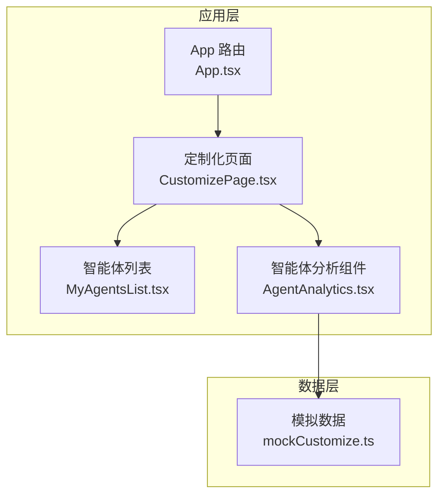
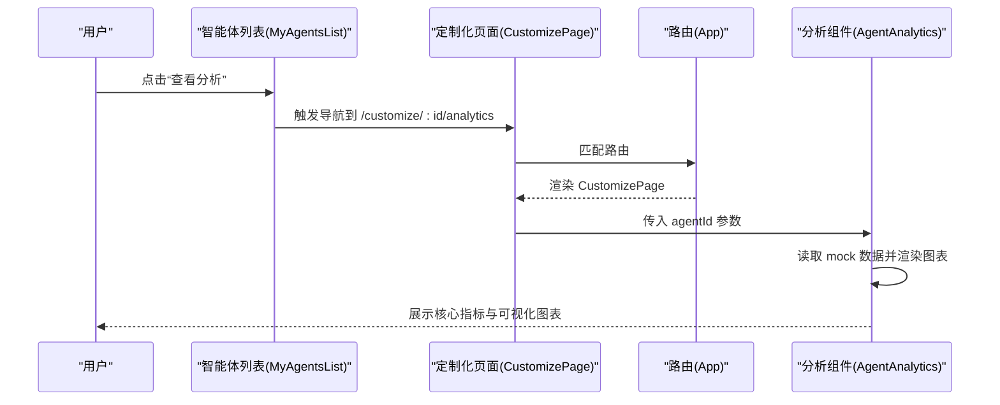
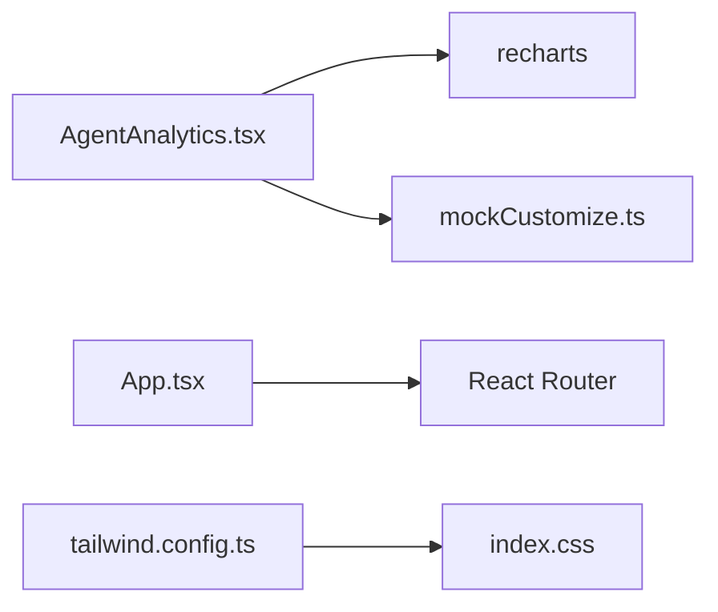

# 智能体分析功能

<cite>
**本文引用的文件**
- [AgentAnalytics.tsx](file://apps/AgentPit/src/components/customize/AgentAnalytics.tsx)
- [mockCustomize.ts](file://apps/AgentPit/src/data/mockCustomize.ts)
- [CustomizePage.tsx](file://apps/AgentPit/src/pages/CustomizePage.tsx)
- [App.tsx](file://apps/AgentPit/src/App.tsx)
- [MyAgentsList.tsx](file://apps/AgentPit/src/components/customize/MyAgentsList.tsx)
- [tailwind.config.ts](file://apps/AgentPit/tailwind.config.ts)
- [index.css](file://apps/AgentPit/src/index.css)
- [package.json](file://apps/AgentPit/package.json)
</cite>

## 目录
1. [简介](#简介)
2. [项目结构](#项目结构)
3. [核心组件](#核心组件)
4. [架构总览](#架构总览)
5. [详细组件分析](#详细组件分析)
6. [依赖分析](#依赖分析)
7. [性能考虑](#性能考虑)
8. [故障排查指南](#故障排查指南)
9. [结论](#结论)
10. [附录](#附录)

## 简介
本指南面向智能体分析功能的使用者与维护者，系统性介绍 AgentAnalytics 组件的数据统计与可视化能力，涵盖智能体使用情况统计、交互频率分析、用户满意度指标、性能表现监控等关键维度；并说明折线图、柱状图、饼图等图表类型的含义与解读方法；给出数据采集范围与精度说明（如活跃用户数、会话时长、响应时间、成功率等），提供数据导出、报告生成与分享机制的使用说明，并结合行业基准与最佳实践给出优化建议。

## 项目结构
AgentAnalytics 组件位于 AgentPit 应用中，采用 React + TypeScript + Tailwind CSS 构建，通过路由在“我的智能体”页面中触发进入分析页。组件内部使用 recharts 进行数据可视化，数据来源于本地 mock 文件。

**图表来源**
- [App.tsx:15-37](file://apps/AgentPit/src/App.tsx#L15-L37)
- [CustomizePage.tsx:15-26](file://apps/AgentPit/src/pages/CustomizePage.tsx#L15-L26)
- [MyAgentsList.tsx:180-220](file://apps/AgentPit/src/components/customize/MyAgentsList.tsx#L180-L220)
- [AgentAnalytics.tsx:27-389](file://apps/AgentPit/src/components/customize/AgentAnalytics.tsx#L27-L389)
- [mockCustomize.ts:613-676](file://apps/AgentPit/src/data/mockCustomize.ts#L613-L676)

**章节来源**
- [App.tsx:15-37](file://apps/AgentPit/src/App.tsx#L15-L37)
- [CustomizePage.tsx:15-26](file://apps/AgentPit/src/pages/CustomizePage.tsx#L15-L26)
- [MyAgentsList.tsx:180-220](file://apps/AgentPit/src/components/customize/MyAgentsList.tsx#L180-L220)
- [AgentAnalytics.tsx:27-389](file://apps/AgentPit/src/components/customize/AgentAnalytics.tsx#L27-L389)
- [mockCustomize.ts:613-676](file://apps/AgentPit/src/data/mockCustomize.ts#L613-L676)

## 核心组件
- AgentAnalytics：负责渲染核心指标卡、趋势图、能力使用、热门问题与用户画像，并提供数据导出入口。
- mockCustomize：提供用户增长、收入趋势、对话统计、能力使用、用户画像等模拟数据。
- CustomizePage：根据路由参数决定渲染智能体列表或分析页，并提供跳转至分析页的能力。
- App：全局路由配置，包含分析页路由。
- MyAgentsList：智能体列表页，提供“查看分析”入口。

**章节来源**
- [AgentAnalytics.tsx:27-389](file://apps/AgentPit/src/components/customize/AgentAnalytics.tsx#L27-L389)
- [mockCustomize.ts:613-676](file://apps/AgentPit/src/data/mockCustomize.ts#L613-L676)
- [CustomizePage.tsx:15-26](file://apps/AgentPit/src/pages/CustomizePage.tsx#L15-L26)
- [App.tsx:28-31](file://apps/AgentPit/src/App.tsx#L28-L31)
- [MyAgentsList.tsx:180-220](file://apps/AgentPit/src/components/customize/MyAgentsList.tsx#L180-L220)

## 架构总览
AgentAnalytics 的数据流从 mockCustomize 中抽取，经组件内部状态管理与 recharts 渲染，最终形成可视化报表。页面通过路由参数传递 agentId，组件据此定位目标智能体并加载对应数据。

**图表来源**
- [MyAgentsList.tsx:180-220](file://apps/AgentPit/src/components/customize/MyAgentsList.tsx#L180-L220)
- [CustomizePage.tsx:15-26](file://apps/AgentPit/src/pages/CustomizePage.tsx#L15-L26)
- [App.tsx:28-31](file://apps/AgentPit/src/App.tsx#L28-L31)
- [AgentAnalytics.tsx:31-32](file://apps/AgentPit/src/components/customize/AgentAnalytics.tsx#L31-L32)

## 详细组件分析

### 数据统计与可视化概览
- 核心指标卡：总用户数、活跃用户、总收入、满意度（星评）。
- 趋势图表：用户增长趋势（折线图）、收入趋势（柱状图）。
- 交互分析：对话统计（总对话数、平均对话时长、高峰时段）。
- 能力使用：能力使用频率 TOP 8（垂直柱状图）。
- 用户画像：地域分布（饼图）、年龄分布（百分比条形图）。
- 导出功能：导出报告（PDF）、导出数据（CSV）。

**章节来源**
- [AgentAnalytics.tsx:72-160](file://apps/AgentPit/src/components/customize/AgentAnalytics.tsx#L72-L160)
- [AgentAnalytics.tsx:163-220](file://apps/AgentPit/src/components/customize/AgentAnalytics.tsx#L163-L220)
- [AgentAnalytics.tsx:222-280](file://apps/AgentPit/src/components/customize/AgentAnalytics.tsx#L222-L280)
- [AgentAnalytics.tsx:282-376](file://apps/AgentPit/src/components/customize/AgentAnalytics.tsx#L282-L376)
- [AgentAnalytics.tsx:378-386](file://apps/AgentPit/src/components/customize/AgentAnalytics.tsx#L378-L386)

### 图表类型与解读方法
- 折线图（用户增长趋势）
  - 含义：展示总用户数与活跃用户的日/月度变化趋势。
  - 解读：上升趋势表示用户规模扩大；波动可能反映营销活动或节假日影响。
- 柱状图（收入趋势）
  - 含义：展示订阅收入与按次付费收入的构成与变化。
  - 解读：订阅收入稳定增长代表用户粘性强；按次付费波动大需关注促销与单价策略。
- 垂直柱状图（能力使用频率）
  - 含义：展示各能力的调用次数排名。
  - 解读：高频能力可作为推广重点；低频能力评估是否下架或优化。
- 饼图（地域分布）
  - 含义：展示用户所在地区占比。
  - 解读：高占比地区可加强本地化运营；其他地区可探索新渠道。
- 百分比条形图（年龄分布）
  - 含义：展示不同年龄段用户占比。
  - 解读：主力年龄段决定内容与交互设计方向。

**章节来源**
- [AgentAnalytics.tsx:164-220](file://apps/AgentPit/src/components/customize/AgentAnalytics.tsx#L164-L220)
- [AgentAnalytics.tsx:256-278](file://apps/AgentPit/src/components/customize/AgentAnalytics.tsx#L256-L278)
- [AgentAnalytics.tsx:328-374](file://apps/AgentPit/src/components/customize/AgentAnalytics.tsx#L328-L374)

### 关键指标与数据精度
- 活跃用户数：日活跃用户数量，用于衡量用户粘性与运营效果。
- 会话时长：平均对话时长，反映内容质量与交互体验。
- 响应时间：组件未直接展示响应时间，但可通过后端埋点或服务端指标补充。
- 成功率：组件未直接展示成功率，建议结合服务端埋点与错误率进行综合评估。
- 满意度：星评分数，直观反映用户体验质量。
- 收入构成：订阅收入与按次付费收入，用于评估商业模式健康度。

**章节来源**
- [mockCustomize.ts:613-676](file://apps/AgentPit/src/data/mockCustomize.ts#L613-L676)
- [AgentAnalytics.tsx:136-159](file://apps/AgentPit/src/components/customize/AgentAnalytics.tsx#L136-L159)

### 数据导出、报告生成与分享
- 导出报告（PDF）：一键生成包含核心指标与图表的 PDF 报告，便于归档与汇报。
- 导出数据（CSV）：导出原始统计数据，便于二次分析与交叉比对。
- 分享机制：当前组件未内置分享链接生成，可在后续版本中增加“复制链接”或“生成分享快照”功能。

**章节来源**
- [AgentAnalytics.tsx:378-386](file://apps/AgentPit/src/components/customize/AgentAnalytics.tsx#L378-L386)

### 基于数据分析的优化建议
- 提升用户留存：关注用户增长趋势与活跃用户变化，结合高峰时段优化客服与内容投放。
- 优化能力矩阵：依据能力使用频率调整能力优先级与定价策略，淘汰低效能力。
- 改善用户体验：结合满意度与对话时长，优化提示词与交互流程。
- 收入结构优化：提升订阅收入占比，降低对促销的依赖；按次付费需控制成本与单价平衡。

**章节来源**
- [AgentAnalytics.tsx:164-220](file://apps/AgentPit/src/components/customize/AgentAnalytics.tsx#L164-L220)
- [AgentAnalytics.tsx:256-278](file://apps/AgentPit/src/components/customize/AgentAnalytics.tsx#L256-L278)
- [AgentAnalytics.tsx:136-159](file://apps/AgentPit/src/components/customize/AgentAnalytics.tsx#L136-L159)

## 依赖分析
- 可视化库：recharts（折线图、柱状图、饼图、面积图）。
- 样式框架：Tailwind CSS，主题色通过 tailwind.config.ts 扩展。
- 路由：React Router，支持动态路由参数传递 agentId。
- 数据来源：mockCustomize.ts 提供模拟数据，便于前端独立开发与演示。

**图表来源**
- [AgentAnalytics.tsx:1-18](file://apps/AgentPit/src/components/customize/AgentAnalytics.tsx#L1-L18)
- [mockCustomize.ts:613-676](file://apps/AgentPit/src/data/mockCustomize.ts#L613-L676)
- [App.tsx:15-37](file://apps/AgentPit/src/App.tsx#L15-L37)
- [tailwind.config.ts:1-27](file://apps/AgentPit/tailwind.config.ts#L1-L27)
- [index.css:1-18](file://apps/AgentPit/src/index.css#L1-L18)

**章节来源**
- [AgentAnalytics.tsx:1-18](file://apps/AgentPit/src/components/customize/AgentAnalytics.tsx#L1-L18)
- [mockCustomize.ts:613-676](file://apps/AgentPit/src/data/mockCustomize.ts#L613-L676)
- [App.tsx:15-37](file://apps/AgentPit/src/App.tsx#L15-L37)
- [tailwind.config.ts:1-27](file://apps/AgentPit/tailwind.config.ts#L1-L27)
- [index.css:1-18](file://apps/AgentPit/src/index.css#L1-L18)

## 性能考虑
- 图表渲染：合理设置图表尺寸与数据量，避免一次性渲染过多数据导致卡顿。
- 响应式设计：使用 ResponsiveContainer 适配不同屏幕尺寸，确保移动端体验。
- 主题与样式：通过 Tailwind CSS 控制样式体积，避免冗余类名。
- 路由懒加载：在生产环境中可结合路由懒加载减少首屏负担。

**章节来源**
- [AgentAnalytics.tsx:80-90](file://apps/AgentPit/src/components/customize/AgentAnalytics.tsx#L80-L90)
- [AgentAnalytics.tsx:170-189](file://apps/AgentPit/src/components/customize/AgentAnalytics.tsx#L170-L189)
- [AgentAnalytics.tsx:200-218](file://apps/AgentPit/src/components/customize/AgentAnalytics.tsx#L200-L218)
- [AgentAnalytics.tsx:256-278](file://apps/AgentPit/src/components/customize/AgentAnalytics.tsx#L256-L278)
- [AgentAnalytics.tsx:328-374](file://apps/AgentPit/src/components/customize/AgentAnalytics.tsx#L328-L374)
- [tailwind.config.ts:1-27](file://apps/AgentPit/tailwind.config.ts#L1-L27)

## 故障排查指南
- 路由无法进入分析页
  - 检查路由配置是否包含 /customize/:id/analytics。
  - 确认点击“查看分析”后导航路径正确。
- 数据为空或异常
  - 确认 agentId 是否匹配 mock 数据中的智能体 ID。
  - 检查 mockCustomize.ts 中 analyticsData 结构是否完整。
- 图表显示异常
  - 检查 recharts 版本与依赖是否一致。
  - 确认数据字段名称与图表映射一致（如 date、users、activeUsers、revenue 等）。
- 样式错乱
  - 检查 Tailwind CSS 是否正确引入与构建。
  - 确认主题色配置未被覆盖。

**章节来源**
- [App.tsx:28-31](file://apps/AgentPit/src/App.tsx#L28-L31)
- [CustomizePage.tsx:15-26](file://apps/AgentPit/src/pages/CustomizePage.tsx#L15-L26)
- [mockCustomize.ts:613-676](file://apps/AgentPit/src/data/mockCustomize.ts#L613-L676)
- [AgentAnalytics.tsx:170-189](file://apps/AgentPit/src/components/customize/AgentAnalytics.tsx#L170-L189)
- [tailwind.config.ts:1-27](file://apps/AgentPit/tailwind.config.ts#L1-L27)

## 结论
AgentAnalytics 组件提供了从用户增长、收入趋势、对话统计到用户画像的全链路可视化分析能力。通过折线图、柱状图、饼图等图表类型，能够快速定位业务问题与优化方向。建议在后续版本中接入真实后端埋点数据，完善响应时间、成功率等关键指标，并增强报告分享与自动化导出能力，以支撑更高效的运营决策。

## 附录

### 行业基准与参考
- 用户增长：月环比增长率 5%-15% 为健康区间，需结合获客成本与生命周期价值评估。
- 活跃用户：日活/月活比值在 20%-40% 之间较为常见，需关注节假日与季节性波动。
- 会话时长：不同场景差异较大，建议设定分场景基准并持续追踪。
- 满意度：4.5 星以上为优秀，4.0-4.5 为良好，低于 4.0 需立即优化。
- 收入结构：订阅收入占比超过 60% 通常表明商业模式稳健；按次付费需控制边际成本。

### 使用清单
- 查看分析：在“我的智能体”列表中选择任意智能体，点击“查看分析”进入分析页。
- 切换时间范围：顶部提供“近7天/近30天/近90天”切换，观察不同周期的趋势变化。
- 导出报告：点击“导出报告（PDF）”与“导出数据（CSV）”，保存分析结果。
- 优化建议：结合图表与指标，制定能力优化、内容运营与用户增长策略。