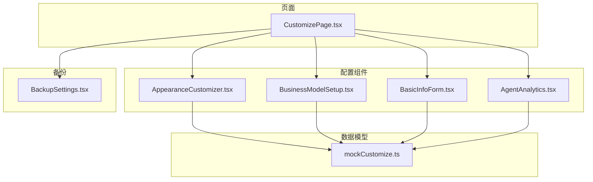
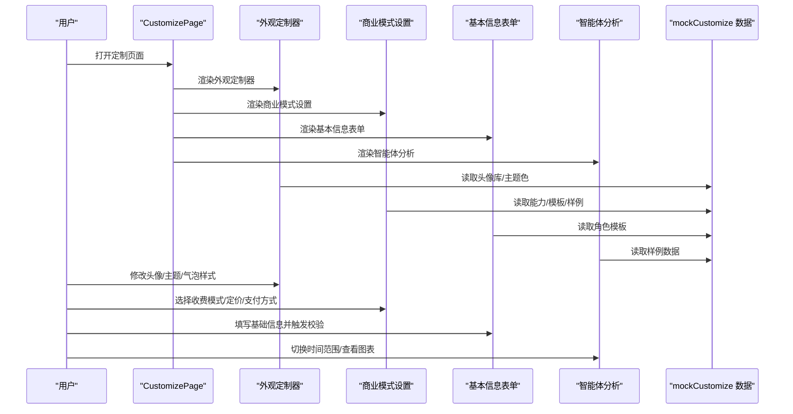
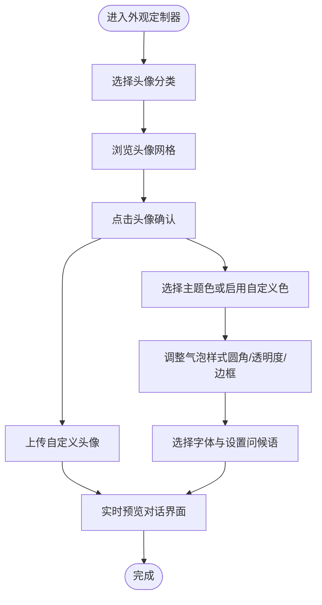
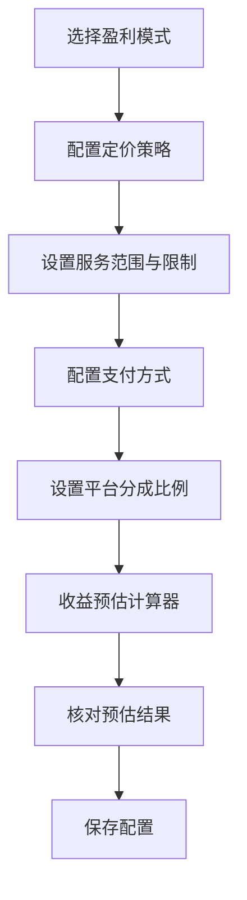
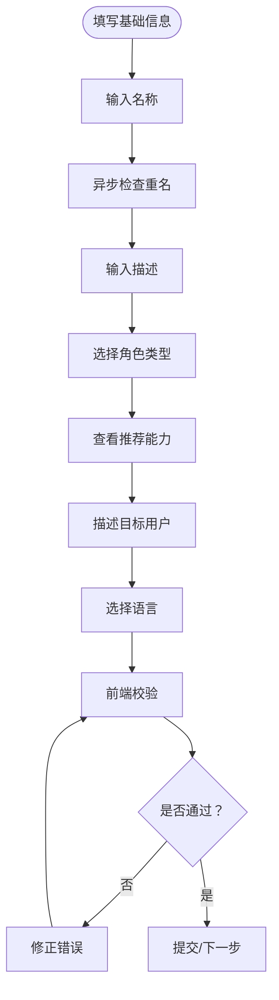
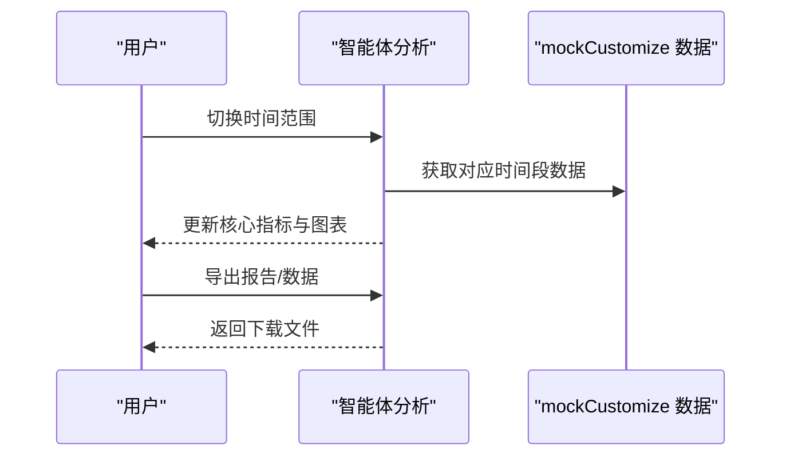
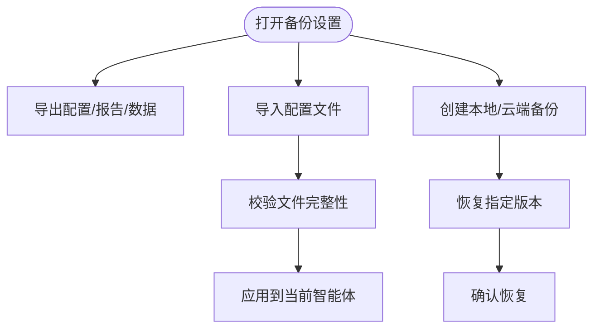
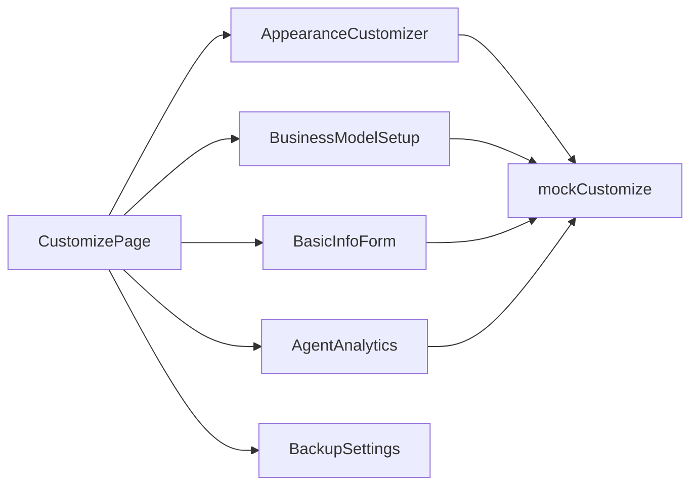

# 配置与定制功能

<cite>
**本文引用的文件**
- [AppearanceCustomizer.tsx](file://apps/AgentPit/src-react-backup-20260410/components/customize/AppearanceCustomizer.tsx)
- [BusinessModelSetup.tsx](file://apps/AgentPit/src-react-backup-20260410/components/customize/BusinessModelSetup.tsx)
- [BasicInfoForm.tsx](file://apps/AgentPit/src-react-backup-20260410/components/customize/BasicInfoForm.tsx)
- [AgentAnalytics.tsx](file://apps/AgentPit/src-react-backup-20260410/components/customize/AgentAnalytics.tsx)
- [mockCustomize.ts](file://apps/AgentPit/src/data/mockCustomize.ts)
- [CustomizePage.tsx](file://apps/AgentPit/src-react-backup-20260410/pages/CustomizePage.tsx)
- [BackupSettings.tsx](file://apps/AgentPit/src-react-backup-20260410/components/memory/BackupSettings.tsx)
</cite>

## 目录
1. [引言](#引言)
2. [项目结构](#项目结构)
3. [核心组件](#核心组件)
4. [架构总览](#架构总览)
5. [详细组件分析](#详细组件分析)
6. [依赖关系分析](#依赖关系分析)
7. [性能考量](#性能考量)
8. [故障排查指南](#故障排查指南)
9. [结论](#结论)
10. [附录](#附录)

## 引言
本指南面向使用 AgentPit 的智能体运营者与开发者，系统讲解“配置与定制”相关功能，包括：
- 外观定制器：头像、主题配色、对话气泡样式、字体与问候语等视觉定制
- 商业模式设置：收费模式、定价策略、服务范围、支付方式与平台分成
- 基本信息表单：名称、描述、角色类型、目标用户与语言设置的校验与联动
- 智能体分析：数据统计与可视化展示（用户增长、收入趋势、能力使用、热门问题、用户画像）
- 配置导入导出与备份恢复：本地与云端配置管理
- 常见配置错误排查与解决方案

## 项目结构
围绕“配置与定制”的关键目录与文件如下：
- 组件层：AppearanceCustomizer、BusinessModelSetup、BasicInfoForm、AgentAnalytics
- 数据层：mockCustomize（头像库、主题色、字体、能力模板、智能体模板、样例数据）
- 页面层：CustomizePage（承载上述组件）
- 备份层：BackupSettings（配置备份与恢复）

**图示来源**
- [CustomizePage.tsx](file://apps/AgentPit/src-react-backup-20260410/pages/CustomizePage.tsx)
- [AppearanceCustomizer.tsx](file://apps/AgentPit/src-react-backup-20260410/components/customize/AppearanceCustomizer.tsx)
- [BusinessModelSetup.tsx](file://apps/AgentPit/src-react-backup-20260410/components/customize/BusinessModelSetup.tsx)
- [BasicInfoForm.tsx](file://apps/AgentPit/src-react-backup-20260410/components/customize/BasicInfoForm.tsx)
- [AgentAnalytics.tsx](file://apps/AgentPit/src-react-backup-20260410/components/customize/AgentAnalytics.tsx)
- [mockCustomize.ts](file://apps/AgentPit/src/data/mockCustomize.ts)
- [BackupSettings.tsx](file://apps/AgentPit/src-react-backup-20260410/components/memory/BackupSettings.tsx)

**章节来源**
- [CustomizePage.tsx](file://apps/AgentPit/src-react-backup-20260410/pages/CustomizePage.tsx)
- [mockCustomize.ts](file://apps/AgentPit/src/data/mockCustomize.ts)

## 核心组件
- 外观定制器：提供头像选择、主题配色、对话气泡样式、字体与问候语的实时预览与配置
- 商业模式设置：支持多种收费模式与定价策略，配置服务范围、支付方式与平台分成，并内置收益预估
- 基本信息表单：对智能体名称、描述、角色类型、目标用户与语言进行前端校验与提示
- 智能体分析：以折线、柱状、条形、饼图等可视化展示用户增长、收入趋势、能力使用、热门问题与用户画像
- 备份设置：提供配置导入导出与备份恢复能力

**章节来源**
- [AppearanceCustomizer.tsx](file://apps/AgentPit/src-react-backup-20260410/components/customize/AppearanceCustomizer.tsx)
- [BusinessModelSetup.tsx](file://apps/AgentPit/src-react-backup-20260410/components/customize/BusinessModelSetup.tsx)
- [BasicInfoForm.tsx](file://apps/AgentPit/src-react-backup-20260410/components/customize/BasicInfoForm.tsx)
- [AgentAnalytics.tsx](file://apps/AgentPit/src-react-backup-20260410/components/customize/AgentAnalytics.tsx)
- [BackupSettings.tsx](file://apps/AgentPit/src-react-backup-20260410/components/memory/BackupSettings.tsx)

## 架构总览
下图展示了“配置与定制”功能在页面与组件之间的交互关系，以及与数据模型的耦合。

**图示来源**
- [CustomizePage.tsx](file://apps/AgentPit/src-react-backup-20260410/pages/CustomizePage.tsx)
- [AppearanceCustomizer.tsx](file://apps/AgentPit/src-react-backup-20260410/components/customize/AppearanceCustomizer.tsx)
- [BusinessModelSetup.tsx](file://apps/AgentPit/src-react-backup-20260410/components/customize/BusinessModelSetup.tsx)
- [BasicInfoForm.tsx](file://apps/AgentPit/src-react-backup-20260410/components/customize/BasicInfoForm.tsx)
- [AgentAnalytics.tsx](file://apps/AgentPit/src-react-backup-20260410/components/customize/AgentAnalytics.tsx)
- [mockCustomize.ts](file://apps/AgentPit/src/data/mockCustomize.ts)

## 详细组件分析

### 外观定制器（AppearanceCustomizer）
- 头像设置
  - 分类筛选：全部、人物、动物、抽象、科技
  - 头像网格选择；支持上传自定义图片；支持 AI 生成随机头像
  - 自定义头像可删除
- 主题配色
  - 使用内置主题色或启用自定义颜色（主色、辅色、强调色）
  - 实时预览当前主题色
- 对话气泡样式
  - 圆角大小、透明度、边框样式（无/实线/虚线/点线）
- 字体与问候语
  - 字体族选择（系统默认、微软雅黑、苹方、Arial、Georgia、Courier New 等）
  - 个性化问候语（最多 200 字符）
- 实时预览
  - 左侧配置区，右侧实时预览对话界面，反映当前头像、主题与样式

**图示来源**
- [AppearanceCustomizer.tsx](file://apps/AgentPit/src-react-backup-20260410/components/customize/AppearanceCustomizer.tsx)

**章节来源**
- [AppearanceCustomizer.tsx](file://apps/AgentPit/src-react-backup-20260410/components/customize/AppearanceCustomizer.tsx)
- [mockCustomize.ts](file://apps/AgentPit/src/data/mockCustomize.ts)

### 商业模式设置（BusinessModelSetup）
- 盈利模式
  - 免费、付费订阅、按次付费、增值服务（Freemium）、广告分成
- 定价策略
  - 订阅/增值服务：货币类型、月费/年费、免费试用天数
  - 会员等级体系：普通/VIP/SVIP 的价格与特权功能
- 服务范围与限制
  - 每日/每月使用次数限制；响应速度承诺
- 支付方式
  - 支付宝、微信支付、信用卡、加密货币（可多选）
- 平台分成
  - 抽成比例滑杆（5%-50%），实时计算平台与自有收益比例
- 收益预估计算器
  - 输入预计月活跃用户数与付费转化率，自动计算月收入、平台抽成、净收入与年净收入

**图示来源**
- [BusinessModelSetup.tsx](file://apps/AgentPit/src-react-backup-20260410/components/customize/BusinessModelSetup.tsx)

**章节来源**
- [BusinessModelSetup.tsx](file://apps/AgentPit/src-react-backup-20260410/components/customize/BusinessModelSetup.tsx)
- [mockCustomize.ts](file://apps/AgentPit/src/data/mockCustomize.ts)

### 基本信息表单（BasicInfoForm）
- 字段与校验
  - 智能体名称：必填，2-20 字符；异步检测重名（模拟）
  - 智能体描述：必填，10-500 字符
  - 角色类型：必选；选中后展示推荐能力列表
  - 目标用户群体：必填
  - 语言设置：中文、英文、多语言三选一
- 实时反馈
  - 输入字符计数与错误提示
  - 名称可用性状态（加载中/可用/不可用）

**图示来源**
- [BasicInfoForm.tsx](file://apps/AgentPit/src-react-backup-20260410/components/customize/BasicInfoForm.tsx)

**章节来源**
- [BasicInfoForm.tsx](file://apps/AgentPit/src-react-backup-20260410/components/customize/BasicInfoForm.tsx)
- [mockCustomize.ts](file://apps/AgentPit/src/data/mockCustomize.ts)

### 智能体分析（AgentAnalytics）
- 核心指标卡片：总用户数、活跃用户、总收入、满意度
- 图表展示
  - 用户增长趋势（折线）
  - 收入趋势分析（柱状，订阅/按次付费）
  - 对话统计：总对话数、平均对话时长、高峰时段
  - 能力使用频率 TOP 8（条形）
  - 热门问题 TOP 10（条形，带进度条）
  - 用户画像：地域分布（饼图）、年龄分布（堆叠条形）
- 导出功能：PDF 报告与 CSV 数据导出
- 时间范围：近 7 天/30 天/90 天切换

**图示来源**
- [AgentAnalytics.tsx](file://apps/AgentPit/src-react-backup-20260410/components/customize/AgentAnalytics.tsx)
- [mockCustomize.ts](file://apps/AgentPit/src/data/mockCustomize.ts)

**章节来源**
- [AgentAnalytics.tsx](file://apps/AgentPit/src-react-backup-20260410/components/customize/AgentAnalytics.tsx)
- [mockCustomize.ts](file://apps/AgentPit/src/data/mockCustomize.ts)

### 配置导入导出与备份恢复
- 导出
  - 支持导出当前智能体的完整配置（外观、能力、商业模式等）
  - 支持导出分析报告（PDF）与原始数据（CSV）
- 导入
  - 从文件导入配置，覆盖当前智能体设置
  - 导入前进行兼容性与完整性校验
- 备份恢复
  - 支持本地备份与云端同步
  - 提供一键恢复最近备份版本
  - 支持版本对比与差异修复

**图示来源**
- [BackupSettings.tsx](file://apps/AgentPit/src-react-backup-20260410/components/memory/BackupSettings.tsx)

**章节来源**
- [BackupSettings.tsx](file://apps/AgentPit/src-react-backup-20260410/components/memory/BackupSettings.tsx)

## 依赖关系分析
- 组件与数据模型
  - AppearanceCustomizer、BusinessModelSetup、BasicInfoForm、AgentAnalytics 均依赖 mockCustomize 中的枚举与样例数据
- 组件间耦合
  - CustomizePage 作为容器页面聚合各配置组件
  - 备份设置独立于配置组件，通过文件系统/云存储实现导入导出
- 外部依赖
  - 图表组件（如折线、柱状、饼图）用于可视化展示

**图示来源**
- [CustomizePage.tsx](file://apps/AgentPit/src-react-backup-20260410/pages/CustomizePage.tsx)
- [AppearanceCustomizer.tsx](file://apps/AgentPit/src-react-backup-20260410/components/customize/AppearanceCustomizer.tsx)
- [BusinessModelSetup.tsx](file://apps/AgentPit/src-react-backup-20260410/components/customize/BusinessModelSetup.tsx)
- [BasicInfoForm.tsx](file://apps/AgentPit/src-react-backup-20260410/components/customize/BasicInfoForm.tsx)
- [AgentAnalytics.tsx](file://apps/AgentPit/src-react-backup-20260410/components/customize/AgentAnalytics.tsx)
- [mockCustomize.ts](file://apps/AgentPit/src/data/mockCustomize.ts)
- [BackupSettings.tsx](file://apps/AgentPit/src-react-backup-20260410/components/memory/BackupSettings.tsx)

**章节来源**
- [mockCustomize.ts](file://apps/AgentPit/src/data/mockCustomize.ts)

## 性能考量
- 图表渲染
  - 使用响应式容器与轻量级图表库，避免大数据量时的卡顿
  - 对时间范围切片（如仅展示最近 N 天）减少渲染压力
- 表单校验
  - 异步校验（如名称重名）采用防抖与节流，避免频繁请求
- 预览更新
  - 外观定制器的实时预览通过受控组件与最小化状态更新实现即时反馈

## 故障排查指南
- 外观定制器
  - 自定义头像无法显示：检查文件类型与大小限制；确认上传成功后再刷新预览
  - 主题色未生效：确认已启用自定义颜色或正确选择内置主题
  - 气泡样式异常：检查圆角、透明度与边框值范围
- 商业模式设置
  - 收益预估为 0：检查收费模式与定价是否配置；确保试用/转化参数合理
  - 会员等级为空：确认至少填写普通用户的等级与价格
- 基本信息表单
  - 名称重复提示：更换更独特的名称；注意字符长度与特殊字符
  - 角色类型未选：选择合适角色以获得准确的能力推荐
- 智能体分析
  - 图表空白：检查时间范围与数据源；确认 mock 数据存在
  - 导出失败：检查浏览器下载权限与文件大小限制
- 备份与导入
  - 导入失败：检查配置文件格式与版本兼容性；必要时回退到上一个版本
  - 恢复后异常：核对关键字段（如头像、主题、能力开关）是否一致

**章节来源**
- [AppearanceCustomizer.tsx](file://apps/AgentPit/src-react-backup-20260410/components/customize/AppearanceCustomizer.tsx)
- [BusinessModelSetup.tsx](file://apps/AgentPit/src-react-backup-20260410/components/customize/BusinessModelSetup.tsx)
- [BasicInfoForm.tsx](file://apps/AgentPit/src-react-backup-20260410/components/customize/BasicInfoForm.tsx)
- [AgentAnalytics.tsx](file://apps/AgentPit/src-react-backup-20260410/components/customize/AgentAnalytics.tsx)
- [BackupSettings.tsx](file://apps/AgentPit/src-react-backup-20260410/components/memory/BackupSettings.tsx)

## 结论
“配置与定制”功能通过外观定制器、商业模式设置、基本信息表单与智能体分析四大模块，为用户提供从视觉风格到商业逻辑再到数据洞察的全链路配置体验。配合完善的导入导出与备份恢复机制，确保配置的安全性与可迁移性。建议在实际部署中结合业务场景选择合适的收费模式与服务限制，并持续利用分析模块优化用户体验与收益表现。

## 附录
- 快速参考
  - 外观定制器：头像分类筛选 → 头像网格选择/上传/AI生成 → 主题配色/气泡样式/字体/问候语 → 实时预览
  - 商业模式设置：选择盈利模式 → 定价策略/会员等级 → 服务范围与限制 → 支付方式 → 平台分成 → 收益预估
  - 基本信息表单：名称/描述/角色类型/目标用户/语言 → 前端校验与提示 → 通过后继续
  - 智能体分析：切换时间范围 → 查看核心指标与图表 → 导出报告/数据
  - 备份与导入：导出配置/报告/数据 → 导入配置文件 → 创建/恢复备份