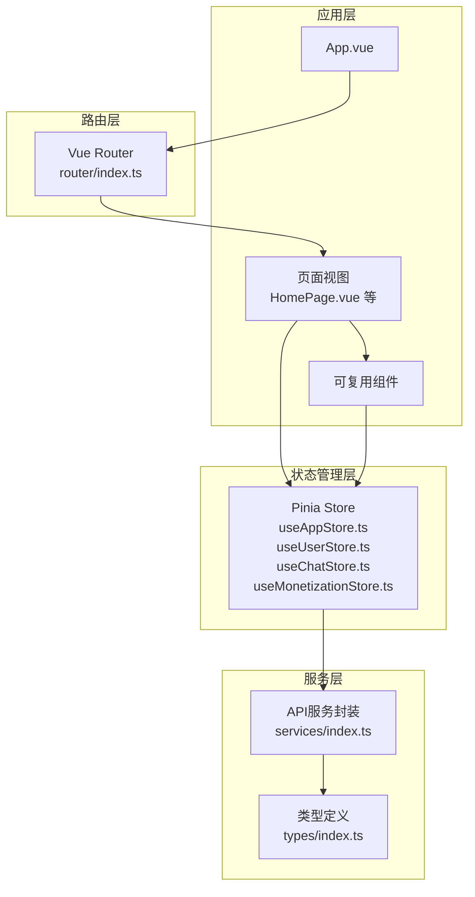
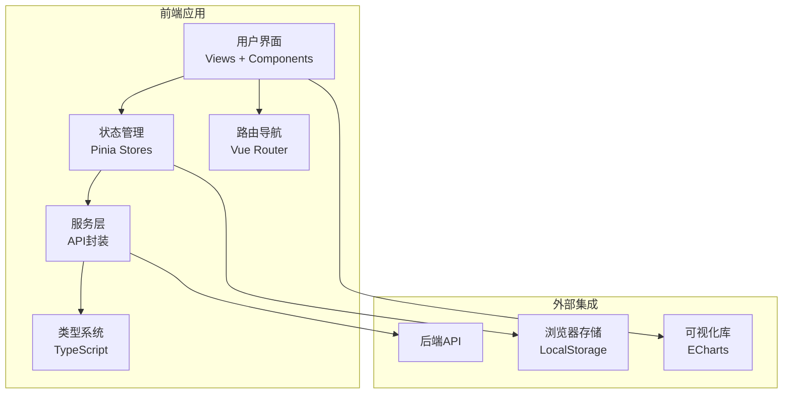
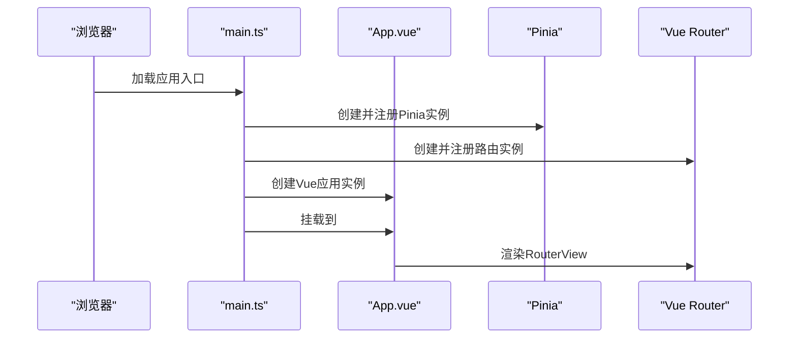
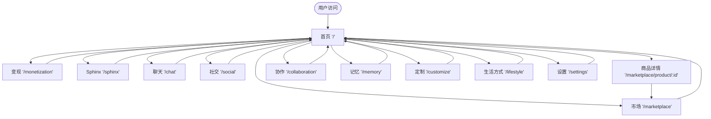
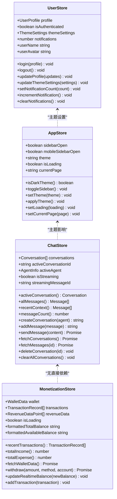
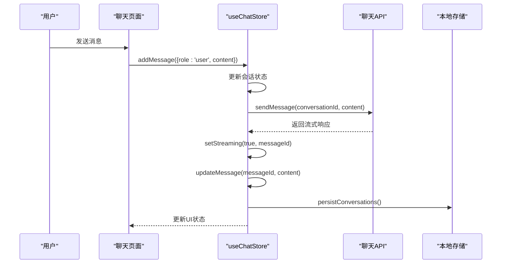
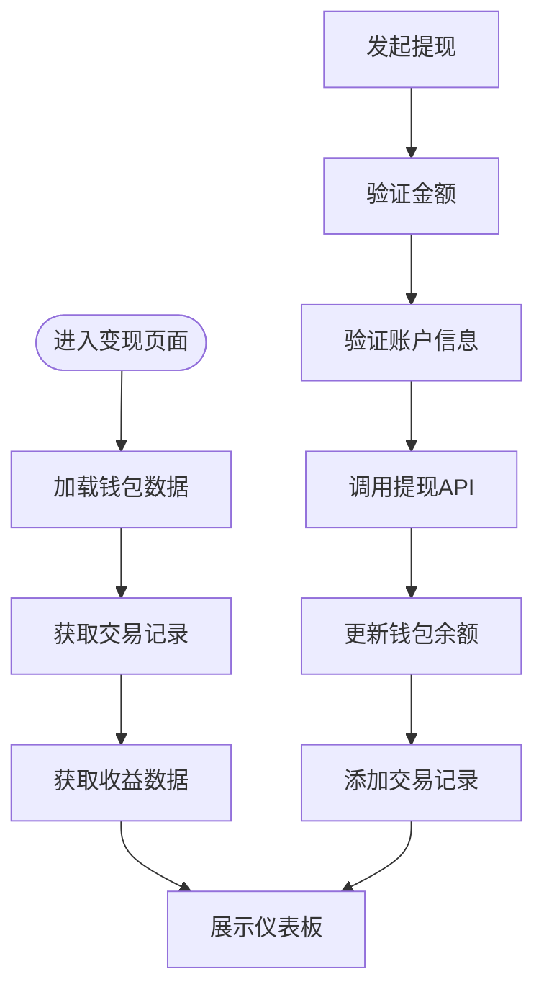
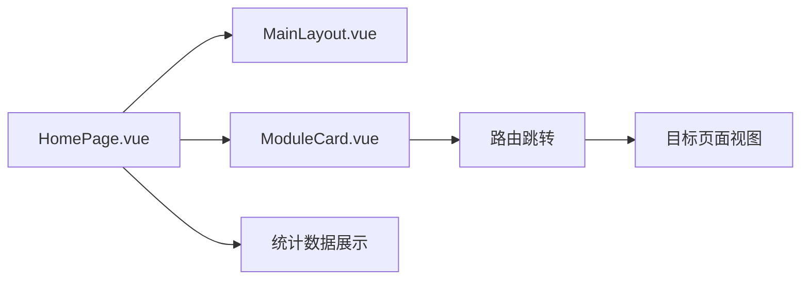
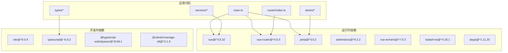

# AgentPit智能体平台

<cite>
**本文档引用的文件**
- [package.json](file://apps/AgentPit/package.json)
- [main.ts](file://apps/AgentPit/src/main.ts)
- [App.vue](file://apps/AgentPit/src/App.vue)
- [router/index.ts](file://apps/AgentPit/src/router/index.ts)
- [stores/index.ts](file://apps/AgentPit/src/stores/index.ts)
- [stores/useAppStore.ts](file://apps/AgentPit/src/stores/useAppStore.ts)
- [stores/useUserStore.ts](file://apps/AgentPit/src/stores/useUserStore.ts)
- [stores/useChatStore.ts](file://apps/AgentPit/src/stores/useChatStore.ts)
- [stores/useMonetizationStore.ts](file://apps/AgentPit/src/stores/useMonetizationStore.ts)
- [services/index.ts](file://apps/AgentPit/src/services/index.ts)
- [types/index.ts](file://apps/AgentPit/src/types/index.ts)
- [types/chat.ts](file://apps/AgentPit/src/types/chat.ts)
- [types/monetization.ts](file://apps/AgentPit/src/types/monetization.ts)
- [types/user.ts](file://apps/AgentPit/src/types/user.ts)
- [views/HomePage.vue](file://apps/AgentPit/src/views/HomePage.vue)
</cite>

## 目录
1. [引言](#引言)
2. [项目结构](#项目结构)
3. [核心组件](#核心组件)
4. [架构总览](#架构总览)
5. [详细组件分析](#详细组件分析)
6. [依赖关系分析](#依赖关系分析)
7. [性能考虑](#性能考虑)
8. [故障排除指南](#故障排除指南)
9. [结论](#结论)
10. [附录](#附录)

## 引言
AgentPit智能体平台是一个基于Vue 3 + TypeScript构建的现代化前端应用，旨在为用户提供一个集聊天交互、变现管理、社交连接、市场交易与协作于一体的综合智能体服务平台。平台采用模块化设计，通过Pinia进行状态管理，Vue Router实现页面路由，TailwindCSS提供样式基础，并集成多种第三方库以增强用户体验。

该平台的核心目标是：
- 提供流畅的智能体交互体验（聊天系统）
- 构建完善的变现体系（钱包、交易、收益）
- 实现社交化功能（关注、互动、动态）
- 支持市场交易（商品展示、购买、订单）
- 促进多智能体协作（任务分配、进度同步）

## 项目结构
AgentPit项目遵循清晰的分层组织方式，主要目录包括：
- apps/AgentPit：主应用代码
  - src：源码目录
    - components：可复用组件
    - views：页面视图
    - stores：Pinia状态管理
    - services：API封装与工具
    - types：TypeScript类型定义
    - router：路由配置
  - public：静态资源
- packages/ui：UI组件库
- 其他子应用：DaoMind、config-center等

**图表来源**
- [App.vue:1-8](file://apps/AgentPit/src/App.vue#L1-L8)
- [router/index.ts:1-73](file://apps/AgentPit/src/router/index.ts#L1-L73)
- [stores/index.ts:1-15](file://apps/AgentPit/src/stores/index.ts#L1-L15)
- [services/index.ts:1-10](file://apps/AgentPit/src/services/index.ts#L1-L10)
- [types/index.ts:1-29](file://apps/AgentPit/src/types/index.ts#L1-L29)

**章节来源**
- [package.json:1-74](file://apps/AgentPit/package.json#L1-L74)
- [main.ts:1-13](file://apps/AgentPit/src/main.ts#L1-L13)
- [router/index.ts:1-73](file://apps/AgentPit/src/router/index.ts#L1-L73)

## 核心组件
平台的核心组件围绕状态管理、路由系统和类型定义展开，确保各功能模块之间的解耦与可维护性。

- 状态管理（Pinia）
  - useAppStore：应用全局状态（主题、侧边栏、加载状态、当前页面）
  - useUserStore：用户状态（登录态、个人资料、主题设置、通知）
  - useChatStore：聊天状态（会话列表、消息、流式输出、代理信息）
  - useMonetizationStore：变现状态（钱包、交易记录、收益数据）

- 路由系统（Vue Router）
  - 定义了首页、变现、Sphinx、聊天、社交、市场、协作、记忆、定制、生活方式、设置等页面路由
  - 支持动态参数（如商品详情页）

- 类型系统（TypeScript）
  - chat.ts：聊天消息、会话、代理、快捷指令等类型
  - monetization.ts：钱包、交易、收益、提现等财务相关类型
  - user.ts：用户资料、主题设置、通知、安全设置等类型

**章节来源**
- [stores/index.ts:1-15](file://apps/AgentPit/src/stores/index.ts#L1-L15)
- [stores/useAppStore.ts:1-89](file://apps/AgentPit/src/stores/useAppStore.ts#L1-L89)
- [stores/useUserStore.ts:1-72](file://apps/AgentPit/src/stores/useUserStore.ts#L1-L72)
- [stores/useChatStore.ts:1-218](file://apps/AgentPit/src/stores/useChatStore.ts#L1-L218)
- [stores/useMonetizationStore.ts:1-153](file://apps/AgentPit/src/stores/useMonetizationStore.ts#L1-L153)
- [router/index.ts:1-73](file://apps/AgentPit/src/router/index.ts#L1-L73)
- [types/chat.ts:1-151](file://apps/AgentPit/src/types/chat.ts#L1-L151)
- [types/monetization.ts:1-135](file://apps/AgentPit/src/types/monetization.ts#L1-L135)
- [types/user.ts:1-200](file://apps/AgentPit/src/types/user.ts#L1-L200)

## 架构总览
AgentPit采用典型的前端单页应用架构，结合模块化组件设计与集中式状态管理，形成清晰的职责分离：

**图表来源**
- [main.ts:1-13](file://apps/AgentPit/src/main.ts#L1-L13)
- [stores/index.ts:1-15](file://apps/AgentPit/src/stores/index.ts#L1-L15)
- [services/index.ts:1-10](file://apps/AgentPit/src/services/index.ts#L1-L10)
- [types/index.ts:1-29](file://apps/AgentPit/src/types/index.ts#L1-L29)

## 详细组件分析

### 应用启动与初始化
应用通过main.ts完成初始化，注册Pinia、Vue Router，并挂载到DOM节点。

**图表来源**
- [main.ts:1-13](file://apps/AgentPit/src/main.ts#L1-L13)
- [App.vue:1-8](file://apps/AgentPit/src/App.vue#L1-L8)

**章节来源**
- [main.ts:1-13](file://apps/AgentPit/src/main.ts#L1-L13)
- [App.vue:1-8](file://apps/AgentPit/src/App.vue#L1-L8)

### 路由系统与页面导航
路由系统定义了完整的页面导航结构，支持懒加载组件以优化首屏性能。

**图表来源**
- [router/index.ts:4-64](file://apps/AgentPit/src/router/index.ts#L4-L64)

**章节来源**
- [router/index.ts:1-73](file://apps/AgentPit/src/router/index.ts#L1-L73)

### 状态管理架构
平台采用Pinia进行状态管理，四个核心store分别负责不同业务域的状态维护。

**图表来源**
- [stores/useAppStore.ts:3-88](file://apps/AgentPit/src/stores/useAppStore.ts#L3-L88)
- [stores/useUserStore.ts:4-71](file://apps/AgentPit/src/stores/useUserStore.ts#L4-L71)
- [stores/useChatStore.ts:5-218](file://apps/AgentPit/src/stores/useChatStore.ts#L5-L218)
- [stores/useMonetizationStore.ts:13-153](file://apps/AgentPit/src/stores/useMonetizationStore.ts#L13-L153)

**章节来源**
- [stores/index.ts:1-15](file://apps/AgentPit/src/stores/index.ts#L1-L15)
- [stores/useAppStore.ts:1-89](file://apps/AgentPit/src/stores/useAppStore.ts#L1-L89)
- [stores/useUserStore.ts:1-72](file://apps/AgentPit/src/stores/useUserStore.ts#L1-L72)
- [stores/useChatStore.ts:1-218](file://apps/AgentPit/src/stores/useChatStore.ts#L1-L218)
- [stores/useMonetizationStore.ts:1-153](file://apps/AgentPit/src/stores/useMonetizationStore.ts#L1-L153)

### 聊天系统实现
聊天系统是平台的核心功能之一，支持多会话管理、消息流式输出、代理切换等功能。

**图表来源**
- [stores/useChatStore.ts:96-215](file://apps/AgentPit/src/stores/useChatStore.ts#L96-L215)

**章节来源**
- [stores/useChatStore.ts:1-218](file://apps/AgentPit/src/stores/useChatStore.ts#L1-L218)
- [types/chat.ts:38-76](file://apps/AgentPit/src/types/chat.ts#L38-L76)

### 变现系统实现
变现系统提供钱包管理、交易记录查询、收益统计和提现功能。

**图表来源**
- [stores/useMonetizationStore.ts:66-151](file://apps/AgentPit/src/stores/useMonetizationStore.ts#L66-L151)

**章节来源**
- [stores/useMonetizationStore.ts:1-153](file://apps/AgentPit/src/stores/useMonetizationStore.ts#L1-L153)
- [types/monetization.ts:15-55](file://apps/AgentPit/src/types/monetization.ts#L15-L55)

### 主页与模块化布局
主页采用模块化设计，通过ModuleCard组件展示核心功能模块，配合动画效果提升用户体验。

**图表来源**
- [views/HomePage.vue:1-469](file://apps/AgentPit/src/views/HomePage.vue#L1-L469)

**章节来源**
- [views/HomePage.vue:1-469](file://apps/AgentPit/src/views/HomePage.vue#L1-L469)

## 依赖关系分析
平台的依赖关系体现了清晰的分层架构，各模块之间保持低耦合高内聚。

**图表来源**
- [package.json:20-62](file://apps/AgentPit/package.json#L20-L62)

**章节来源**
- [package.json:1-74](file://apps/AgentPit/package.json#L1-L74)

## 性能考虑
- 代码分割与懒加载：路由采用动态导入，按需加载页面组件，减少初始包体积
- 状态持久化：Pinia插件持久化关键状态，提升用户体验
- 本地存储：聊天记录本地缓存，避免重复网络请求
- 动画优化：合理使用CSS动画，避免过度重绘
- 类型安全：TypeScript提供编译期检查，降低运行时错误

## 故障排除指南
- 路由跳转失效
  - 检查router/index.ts中的路由配置是否正确
  - 确认组件导入路径是否有效
  - 验证RouterView是否正确渲染

- 状态不同步
  - 检查Pinia store的定义和使用
  - 确认状态变更是否通过actions触发
  - 验证持久化配置是否正确

- API请求失败
  - 查看services层的错误处理
  - 检查网络请求超时和重试机制
  - 确认类型定义与API响应一致

- 样式异常
  - 检查Tailwind配置和自定义样式
  - 验证主题切换逻辑
  - 确认响应式断点设置

**章节来源**
- [stores/useChatStore.ts:176-215](file://apps/AgentPit/src/stores/useChatStore.ts#L176-L215)
- [stores/useMonetizationStore.ts:107-141](file://apps/AgentPit/src/stores/useMonetizationStore.ts#L107-L141)

## 结论
AgentPit智能体平台通过模块化的架构设计、清晰的分层组织和完善的类型系统，构建了一个功能丰富且易于扩展的智能体服务平台。平台在用户体验、性能优化和可维护性方面都体现了良好的工程实践。未来可以进一步完善测试覆盖、增强错误处理机制，并持续优化交互细节。

## 附录
- 开发环境搭建：安装Node.js版本要求、依赖安装、开发服务器启动
- 构建与部署：生产环境构建、静态资源优化、Docker容器化部署
- 贡献指南：代码规范、提交规范、分支管理策略
- API参考：各模块的接口定义、参数说明、返回值格式