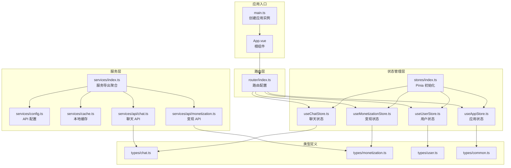
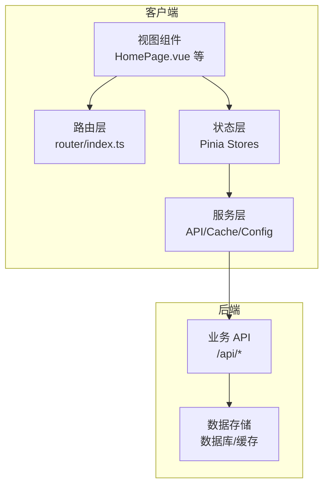
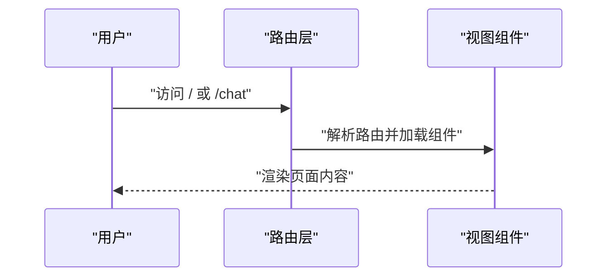
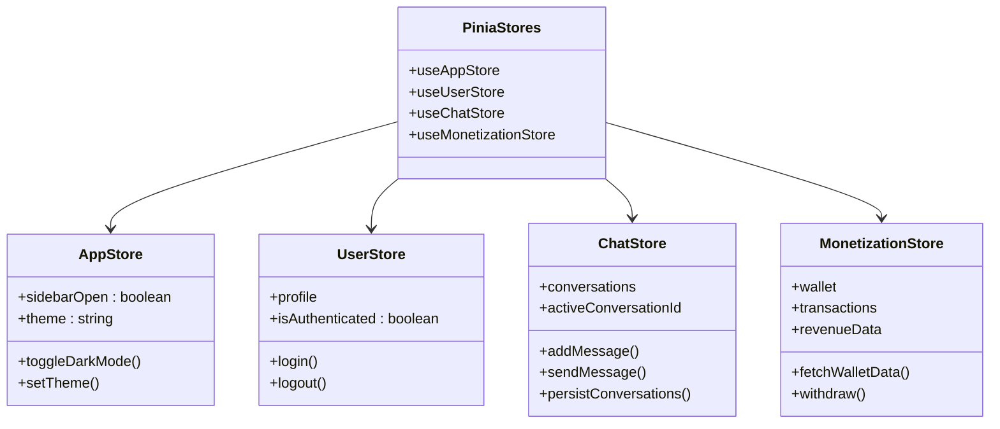
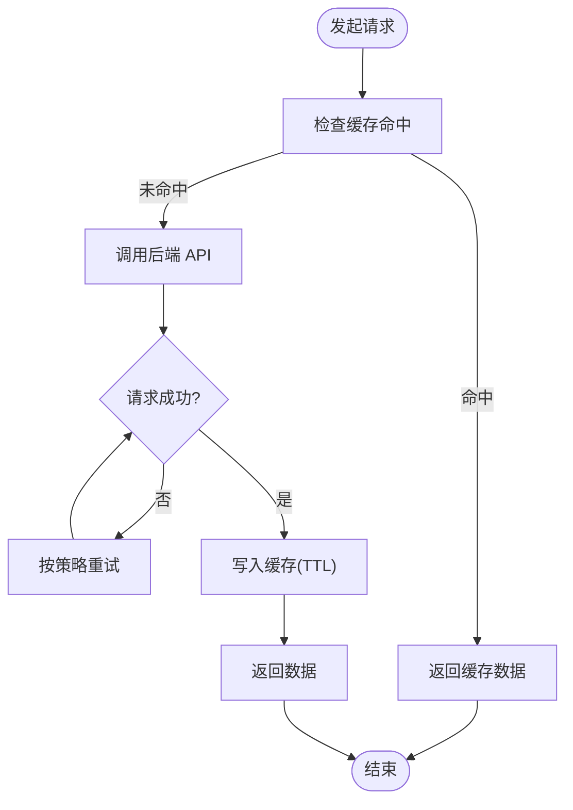
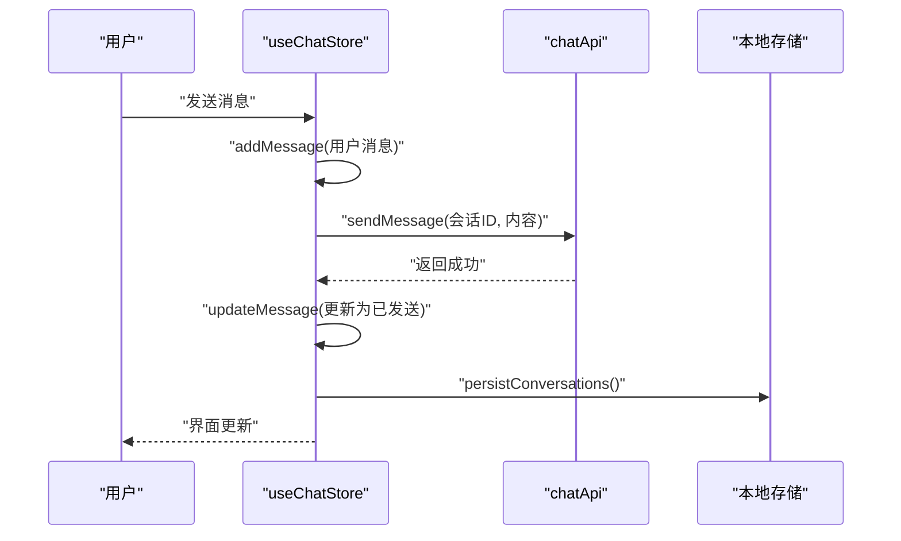
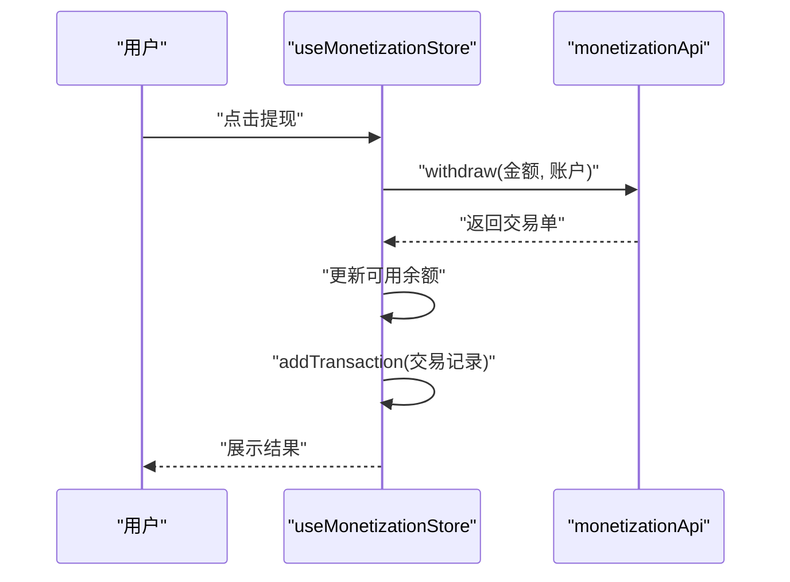
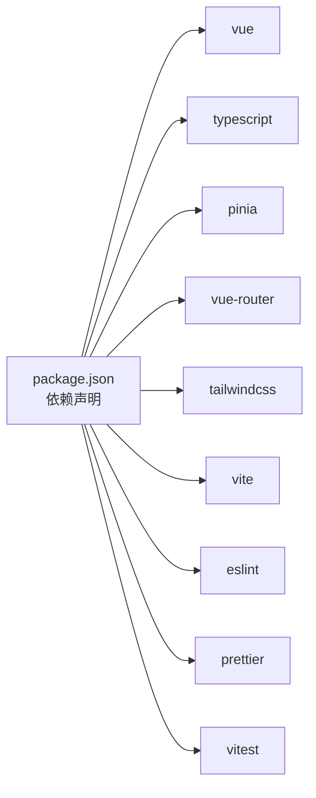

# 平台架构设计

<cite>
**本文档引用的文件**
- [package.json](file://apps/AgentPit/package.json)
- [main.ts](file://apps/AgentPit/src/main.ts)
- [App.vue](file://apps/AgentPit/src/App.vue)
- [router/index.ts](file://apps/AgentPit/src/router/index.ts)
- [services/index.ts](file://apps/AgentPit/src/services/index.ts)
- [services/config.ts](file://apps/AgentPit/src/services/config.ts)
- [services/cache.ts](file://apps/AgentPit/src/services/cache.ts)
- [stores/index.ts](file://apps/AgentPit/src/stores/index.ts)
- [stores/useAppStore.ts](file://apps/AgentPit/src/stores/useAppStore.ts)
- [stores/useUserStore.ts](file://apps/AgentPit/src/stores/useUserStore.ts)
- [stores/useChatStore.ts](file://apps/AgentPit/src/stores/useChatStore.ts)
- [stores/useMonetizationStore.ts](file://apps/AgentPit/src/stores/useMonetizationStore.ts)
- [services/api/chat.ts](file://apps/AgentPit/src/services/api/chat.ts)
- [services/api/monetization.ts](file://apps/AgentPit/src/services/api/monetization.ts)
- [types/chat.ts](file://apps/AgentPit/src/types/chat.ts)
- [types/monetization.ts](file://apps/AgentPit/src/types/monetization.ts)
- [types/user.ts](file://apps/AgentPit/src/types/user.ts)
- [types/common.ts](file://apps/AgentPit/src/types/common.ts)
</cite>

## 目录
1. [引言](#引言)
2. [项目结构](#项目结构)
3. [核心组件](#核心组件)
4. [架构总览](#架构总览)
5. [详细组件分析](#详细组件分析)
6. [依赖关系分析](#依赖关系分析)
7. [性能考量](#性能考量)
8. [故障排查指南](#故障排查指南)
9. [结论](#结论)
10. [附录](#附录)

## 引言
本文件为 AgentPit 平台的架构设计文档，面向平台的整体架构模式、设计原则与系统边界进行深入阐述。文档聚焦于前端应用层的模块化组织、组件交互、数据流向与集成模式，解释技术决策与权衡，并给出基础设施需求、可扩展性考虑与部署拓扑建议。同时覆盖安全、监控与灾难恢复等横切关注点，记录技术栈、第三方依赖及版本兼容性。

## 项目结构
AgentPit 采用基于功能域的前端单页应用（SPA）架构，围绕 Vue 3 + TypeScript 技术栈构建，通过 Pinia 实现状态管理，Vue Router 管理页面路由，TailwindCSS/TW v4 提供样式基础，Vite 作为构建与开发工具链。项目按功能域划分目录，包含聊天、变现、社交、市场、协作、记忆、定制、生活、设置等页面模块；类型定义集中于 types 目录，服务层封装 API 与缓存，状态层通过 Pinia Store 组织业务状态。

图表来源
- [main.ts:1-13](file://apps/AgentPit/src/main.ts#L1-L13)
- [App.vue:1-8](file://apps/AgentPit/src/App.vue#L1-L8)
- [router/index.ts:1-73](file://apps/AgentPit/src/router/index.ts#L1-L73)
- [stores/index.ts:1-15](file://apps/AgentPit/src/stores/index.ts#L1-L15)
- [services/index.ts:1-10](file://apps/AgentPit/src/services/index.ts#L1-L10)
- [services/config.ts:1-11](file://apps/AgentPit/src/services/config.ts#L1-L11)
- [services/cache.ts:1-50](file://apps/AgentPit/src/services/cache.ts#L1-L50)
- [services/api/chat.ts:1-18](file://apps/AgentPit/src/services/api/chat.ts#L1-L18)
- [services/api/monetization.ts:1-59](file://apps/AgentPit/src/services/api/monetization.ts#L1-L59)
- [types/chat.ts:1-151](file://apps/AgentPit/src/types/chat.ts#L1-L151)
- [types/monetization.ts:1-135](file://apps/AgentPit/src/types/monetization.ts#L1-L135)
- [types/user.ts:1-200](file://apps/AgentPit/src/types/user.ts#L1-L200)
- [types/common.ts:1-157](file://apps/AgentPit/src/types/common.ts#L1-L157)

章节来源
- [package.json:1-74](file://apps/AgentPit/package.json#L1-L74)
- [main.ts:1-13](file://apps/AgentPit/src/main.ts#L1-L13)
- [router/index.ts:1-73](file://apps/AgentPit/src/router/index.ts#L1-L73)

## 核心组件
- 应用入口与初始化：创建 Vue 应用实例，挂载 Pinia 与路由，统一注入到根组件。
- 路由系统：基于 Vue Router 的 History 模式，按功能域划分页面路由，支持动态导入实现懒加载。
- 状态管理：Pinia 作为单一事实源，提供应用状态、用户状态、聊天状态与变现状态的持久化存储。
- 服务层：集中导出配置、缓存与各业务 API，便于模块间解耦与测试替换。
- 类型体系：统一的类型定义，覆盖聊天、用户、变现与通用场景，确保跨模块契约一致。

章节来源
- [main.ts:1-13](file://apps/AgentPit/src/main.ts#L1-L13)
- [router/index.ts:1-73](file://apps/AgentPit/src/router/index.ts#L1-L73)
- [stores/index.ts:1-15](file://apps/AgentPit/src/stores/index.ts#L1-L15)
- [services/index.ts:1-10](file://apps/AgentPit/src/services/index.ts#L1-L10)
- [types/chat.ts:1-151](file://apps/AgentPit/src/types/chat.ts#L1-L151)
- [types/user.ts:1-200](file://apps/AgentPit/src/types/user.ts#L1-L200)
- [types/monetization.ts:1-135](file://apps/AgentPit/src/types/monetization.ts#L1-L135)
- [types/common.ts:1-157](file://apps/AgentPit/src/types/common.ts#L1-L157)

## 架构总览
AgentPit 采用“前端单页应用 + 后端 API”架构，前端通过服务层抽象与 API 交互，状态层负责业务状态与持久化，类型层保证契约一致性。系统边界清晰：前端负责视图渲染与用户交互，后端负责业务数据与计算，二者通过 REST 风格 API 通信。当前仓库包含模拟数据与 API 封装，便于开发与测试阶段快速迭代。

图表来源
- [router/index.ts:1-73](file://apps/AgentPit/src/router/index.ts#L1-L73)
- [stores/index.ts:1-15](file://apps/AgentPit/src/stores/index.ts#L1-L15)
- [services/index.ts:1-10](file://apps/AgentPit/src/services/index.ts#L1-L10)
- [services/api/chat.ts:1-18](file://apps/AgentPit/src/services/api/chat.ts#L1-L18)
- [services/api/monetization.ts:1-59](file://apps/AgentPit/src/services/api/monetization.ts#L1-L59)

## 详细组件分析

### 路由与页面导航
- 路由配置：采用 History 模式，定义首页、聊天、社交、市场、协作、记忆、定制、生活、设置等路由，支持动态导入提升首屏性能。
- 页面职责：每个视图对应一个功能域页面，通过 RouterView 渲染，保持页面级别的高内聚与低耦合。

图表来源
- [router/index.ts:1-73](file://apps/AgentPit/src/router/index.ts#L1-L73)
- [App.vue:1-8](file://apps/AgentPit/src/App.vue#L1-L8)

章节来源
- [router/index.ts:1-73](file://apps/AgentPit/src/router/index.ts#L1-L73)
- [App.vue:1-8](file://apps/AgentPit/src/App.vue#L1-L8)

### 状态管理与持久化
- Pinia 初始化：集中注册持久化插件，确保关键状态在刷新后仍可用。
- 应用状态（useAppStore）：管理主题、侧边栏、页面切换与加载态，支持系统主题检测与本地持久化。
- 用户状态（useUserStore）：维护用户档案、认证状态与主题设置，支持本地持久化。
- 聊天状态（useChatStore）：管理会话、消息、流式输出与本地持久化，提供上下文提取与消息统计。
- 变现状态（useMonetizationStore）：管理钱包、交易与收益数据，提供格式化展示与实时余额更新。

图表来源
- [stores/index.ts:1-15](file://apps/AgentPit/src/stores/index.ts#L1-L15)
- [stores/useAppStore.ts:1-89](file://apps/AgentPit/src/stores/useAppStore.ts#L1-L89)
- [stores/useUserStore.ts:1-72](file://apps/AgentPit/src/stores/useUserStore.ts#L1-L72)
- [stores/useChatStore.ts:1-218](file://apps/AgentPit/src/stores/useChatStore.ts#L1-L218)
- [stores/useMonetizationStore.ts:1-153](file://apps/AgentPit/src/stores/useMonetizationStore.ts#L1-L153)

章节来源
- [stores/index.ts:1-15](file://apps/AgentPit/src/stores/index.ts#L1-L15)
- [stores/useAppStore.ts:1-89](file://apps/AgentPit/src/stores/useAppStore.ts#L1-L89)
- [stores/useUserStore.ts:1-72](file://apps/AgentPit/src/stores/useUserStore.ts#L1-L72)
- [stores/useChatStore.ts:1-218](file://apps/AgentPit/src/stores/useChatStore.ts#L1-L218)
- [stores/useMonetizationStore.ts:1-153](file://apps/AgentPit/src/stores/useMonetizationStore.ts#L1-L153)

### 服务层与数据流
- 配置中心：统一管理 API 基础地址、超时、重试策略与 Mock 开关，便于环境切换与调试。
- 缓存管理：提供 TTL 缓存、批量清理与正则匹配清理能力，降低重复请求与提升响应速度。
- API 封装：聊天与变现模块分别提供 getConversations、getMessages、sendMessage、getWallet、getTransactions、getRevenue、withdraw 等方法，当前返回模拟数据，便于前后端并行开发。

图表来源
- [services/cache.ts:1-50](file://apps/AgentPit/src/services/cache.ts#L1-L50)
- [services/config.ts:1-11](file://apps/AgentPit/src/services/config.ts#L1-L11)
- [services/api/chat.ts:1-18](file://apps/AgentPit/src/services/api/chat.ts#L1-L18)
- [services/api/monetization.ts:1-59](file://apps/AgentPit/src/services/api/monetization.ts#L1-L59)

章节来源
- [services/config.ts:1-11](file://apps/AgentPit/src/services/config.ts#L1-L11)
- [services/cache.ts:1-50](file://apps/AgentPit/src/services/cache.ts#L1-L50)
- [services/api/chat.ts:1-18](file://apps/AgentPit/src/services/api/chat.ts#L1-L18)
- [services/api/monetization.ts:1-59](file://apps/AgentPit/src/services/api/monetization.ts#L1-L59)

### 聊天系统流程
- 会话管理：创建会话、设置激活会话、删除会话与清空历史；消息管理支持新增、更新与流式状态标记。
- 上下文提取：按最近 N 轮完整对话轮次（user+assistant）提取上下文，便于提示词工程与模型推理。
- 本地持久化：会话与消息在本地存储中持久化，避免刷新丢失。

图表来源
- [stores/useChatStore.ts:199-215](file://apps/AgentPit/src/stores/useChatStore.ts#L199-L215)
- [services/api/chat.ts:14-16](file://apps/AgentPit/src/services/api/chat.ts#L14-L16)
- [stores/useChatStore.ts:161-174](file://apps/AgentPit/src/stores/useChatStore.ts#L161-L174)

章节来源
- [stores/useChatStore.ts:1-218](file://apps/AgentPit/src/stores/useChatStore.ts#L1-L218)
- [services/api/chat.ts:1-18](file://apps/AgentPit/src/services/api/chat.ts#L1-L18)

### 变现系统流程
- 钱包数据：从 API 获取总余额、可用余额与货币单位，映射为钱包对象。
- 交易与收益：获取交易历史与收益曲线，格式化展示与统计。
- 提现流程：提交提现请求，更新可用余额并添加交易记录。

图表来源
- [stores/useMonetizationStore.ts:114-142](file://apps/AgentPit/src/stores/useMonetizationStore.ts#L114-L142)
- [services/api/monetization.ts:35-58](file://apps/AgentPit/src/services/api/monetization.ts#L35-L58)

章节来源
- [stores/useMonetizationStore.ts:1-153](file://apps/AgentPit/src/stores/useMonetizationStore.ts#L1-L153)
- [services/api/monetization.ts:1-59](file://apps/AgentPit/src/services/api/monetization.ts#L1-L59)

## 依赖关系分析
- 技术栈：Vue 3、TypeScript、Pinia、Vue Router、TailwindCSS、Vite、ESLint/Prettier、Vitest。
- 第三方库：@vueuse/core、lodash-es、marked、echarts、vee-validate、yup、dayjs 等。
- 构建与质量：Vite 提供开发与构建，ESLint/Prettier 保障代码风格，Vitest 提供单元测试与覆盖率。

图表来源
- [package.json:20-62](file://apps/AgentPit/package.json#L20-L62)

章节来源
- [package.json:1-74](file://apps/AgentPit/package.json#L1-L74)

## 性能考量
- 路由懒加载：通过动态导入减少首屏体积，提升初始加载性能。
- 本地持久化：Pinia 持久化与本地存储结合，降低重复请求与状态重建成本。
- 缓存策略：TTL 缓存与批量清理，平衡数据新鲜度与性能。
- 图表与富文本：按需引入 echarts 与 marked，避免不必要的包体积。
- 构建优化：Vite 的原生 ESM 与快速热更新，适合开发体验与生产构建。

## 故障排查指南
- 环境变量：确认 API 基础地址与 Mock 开关配置，避免请求指向错误或未生效。
- 状态异常：检查 Pinia 持久化键名与存储位置，确保主题与用户设置正确恢复。
- 聊天异常：验证会话 ID 与消息状态流转，确认本地持久化是否成功。
- 变现异常：核对提现金额与账户信息，检查交易状态与余额更新。
- 缓存问题：使用缓存清理与模式清理功能，定位过期或污染数据。

章节来源
- [services/config.ts:1-11](file://apps/AgentPit/src/services/config.ts#L1-L11)
- [stores/useAppStore.ts:83-87](file://apps/AgentPit/src/stores/useAppStore.ts#L83-L87)
- [stores/useUserStore.ts:66-70](file://apps/AgentPit/src/stores/useUserStore.ts#L66-L70)
- [stores/useChatStore.ts:161-174](file://apps/AgentPit/src/stores/useChatStore.ts#L161-L174)
- [stores/useMonetizationStore.ts:148-150](file://apps/AgentPit/src/stores/useMonetizationStore.ts#L148-L150)
- [services/cache.ts:39-46](file://apps/AgentPit/src/services/cache.ts#L39-L46)

## 结论
AgentPit 采用清晰的前端分层架构，通过路由、状态与服务三层抽象实现高内聚低耦合。类型体系确保跨模块契约稳定，缓存与持久化策略兼顾性能与可靠性。当前以模拟数据驱动开发，具备良好的扩展性与可测试性，可平滑过渡至真实后端 API。建议在后续阶段完善安全认证、监控告警与灾备方案，持续优化用户体验与系统韧性。

## 附录
- 技术栈与版本兼容性：Vue 3、TypeScript ~6.0、Pinia、Vue Router、TailwindCSS、Vite、ESLint、Prettier、Vitest。
- 基础设施需求：Node.js 运行时、现代浏览器支持（ESM）、可选容器化部署（Docker/Podman）与反向代理（Nginx）。
- 部署拓扑：前端静态资源部署于 CDN/NAS，通过反向代理暴露 API；生产环境建议启用 HTTPS、缓存与压缩。
- 安全与合规：建议引入鉴权中间件、CORS 策略、输入校验与敏感信息脱敏；监控与日志采集覆盖关键路径；制定备份与回滚策略。