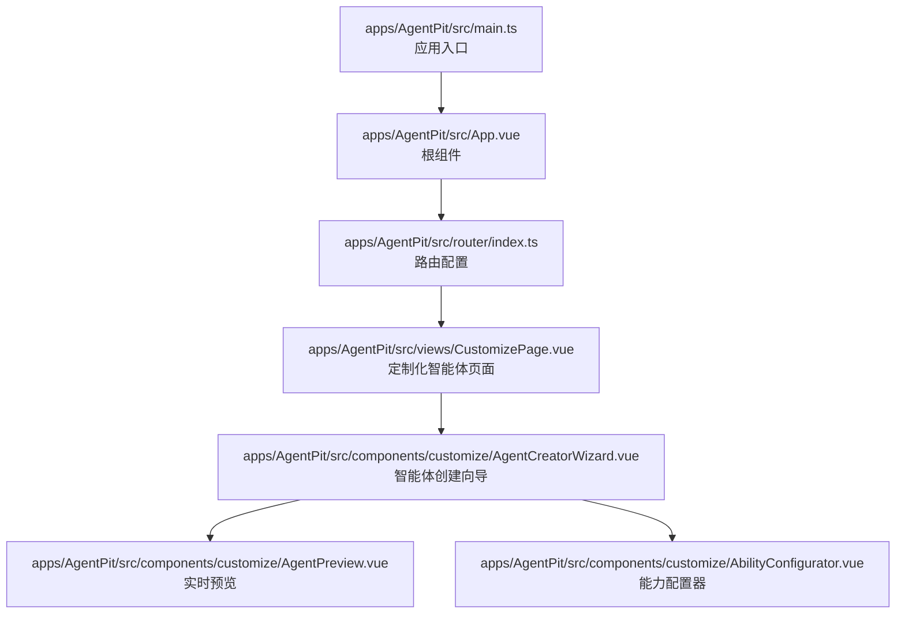
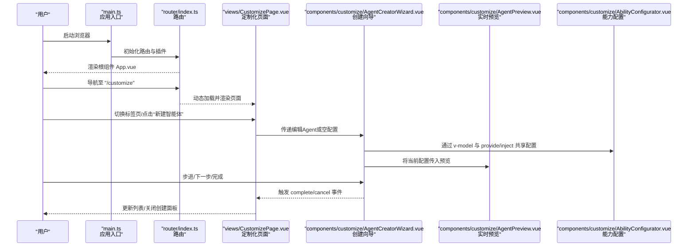
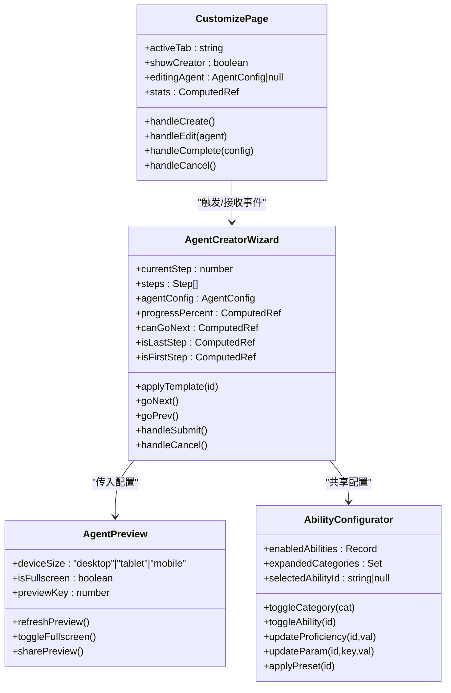
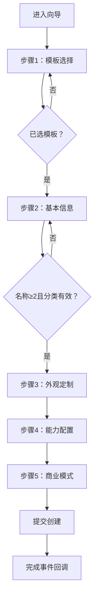
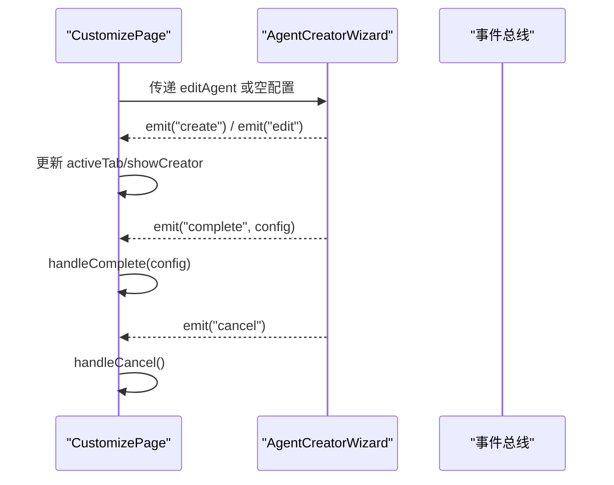
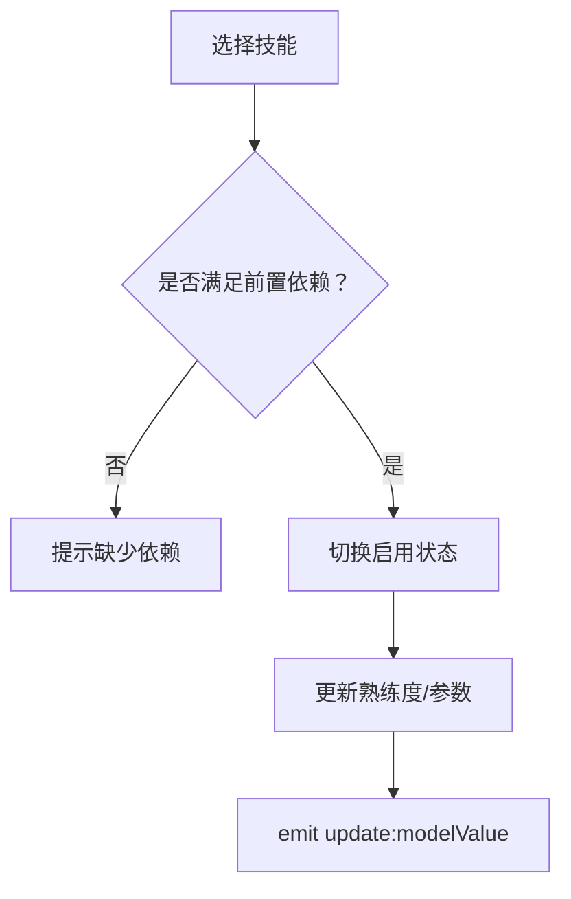
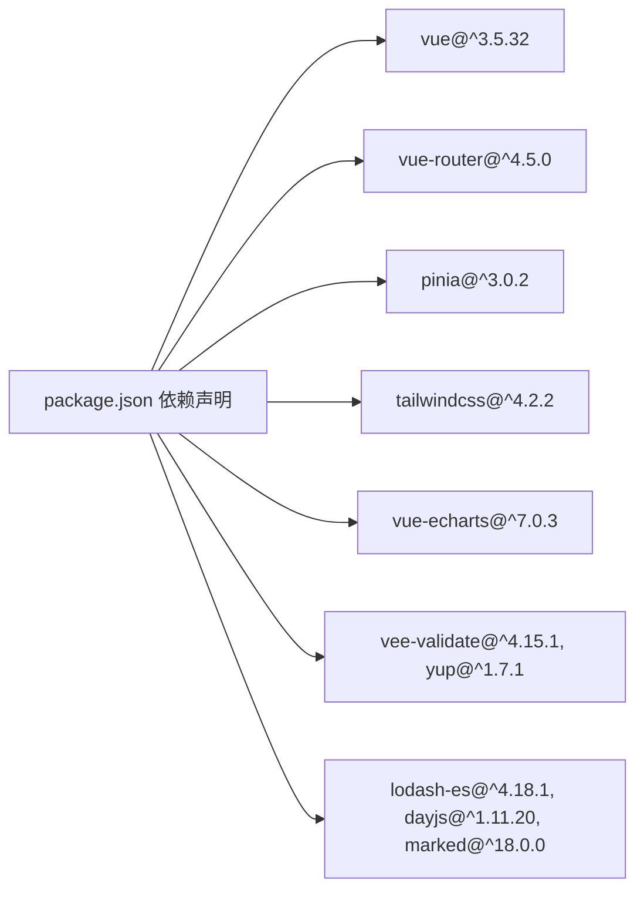

# AI站点构建器

<cite>
**本文引用的文件**
- [apps/AgentPit/src/main.ts](file://apps/AgentPit/src/main.ts)
- [apps/AgentPit/src/App.vue](file://apps/AgentPit/src/App.vue)
- [apps/AgentPit/src/router/index.ts](file://apps/AgentPit/src/router/index.ts)
- [apps/AgentPit/src/views/CustomizePage.vue](file://apps/AgentPit/src/views/CustomizePage.vue)
- [apps/AgentPit/src/components/customize/AgentCreatorWizard.vue](file://apps/AgentPit/src/components/customize/AgentCreatorWizard.vue)
- [apps/AgentPit/src/components/customize/AgentPreview.vue](file://apps/AgentPit/src/components/customize/AgentPreview.vue)
- [apps/AgentPit/src/components/customize/AbilityConfigurator.vue](file://apps/AgentPit/src/components/customize/AbilityConfigurator.vue)
- [apps/AgentPit/package.json](file://apps/AgentPit/package.json)
</cite>

## 目录
1. [简介](#简介)
2. [项目结构](#项目结构)
3. [核心组件](#核心组件)
4. [架构总览](#架构总览)
5. [详细组件分析](#详细组件分析)
6. [依赖分析](#依赖分析)
7. [性能考虑](#性能考虑)
8. [故障排查指南](#故障排查指南)
9. [结论](#结论)
10. [附录](#附录)

## 简介
本文件面向“AgentPit AI站点构建器”的“定制化智能体”子系统，聚焦于“拖拽编辑器”“发布面板”“站点预览”“站点向导”“模板画廊”等关键功能的实现细节与调用关系。文档以Vue 3 + TypeScript为基础，结合组件化架构与Pinia状态管理，提供从入口到视图、从路由到组件的数据流与交互流程说明，并给出可操作的排障建议与最佳实践。

## 项目结构
AgentPit前端采用单页应用（SPA）架构，入口在根应用组件，通过Vue Router进行页面级路由分发；“定制化智能体”页面作为核心工作台，内部集成“向导式创建器”“实时预览”“能力配置”等子组件，形成完整的“所见即所得”的智能体构建体验。

图表来源
- [apps/AgentPit/src/main.ts:1-13](file://apps/AgentPit/src/main.ts#L1-L13)
- [apps/AgentPit/src/App.vue:1-8](file://apps/AgentPit/src/App.vue#L1-L8)
- [apps/AgentPit/src/router/index.ts:1-73](file://apps/AgentPit/src/router/index.ts#L1-L73)
- [apps/AgentPit/src/views/CustomizePage.vue:1-217](file://apps/AgentPit/src/views/CustomizePage.vue#L1-L217)
- [apps/AgentPit/src/components/customize/AgentCreatorWizard.vue:1-355](file://apps/AgentPit/src/components/customize/AgentCreatorWizard.vue#L1-L355)
- [apps/AgentPit/src/components/customize/AgentPreview.vue:1-413](file://apps/AgentPit/src/components/customize/AgentPreview.vue#L1-L413)
- [apps/AgentPit/src/components/customize/AbilityConfigurator.vue:1-447](file://apps/AgentPit/src/components/customize/AbilityConfigurator.vue#L1-L447)

章节来源
- [apps/AgentPit/src/main.ts:1-13](file://apps/AgentPit/src/main.ts#L1-L13)
- [apps/AgentPit/src/App.vue:1-8](file://apps/AgentPit/src/App.vue#L1-L8)
- [apps/AgentPit/src/router/index.ts:1-73](file://apps/AgentPit/src/router/index.ts#L1-L73)

## 核心组件
- 应用入口与根组件：负责挂载Vue实例、注册路由与状态管理插件，并通过RouterView渲染当前路由视图。
- 路由系统：集中定义页面级路由，包含“定制化智能体”在内的多个业务页面。
- 定制化智能体页面：作为工作台容器，承载“智能体列表/创建/统计”三大标签页，并在标签切换时通过动态组件与KeepAlive优化渲染。
- 智能体创建向导：提供“模板选择—基本信息—外观定制—能力配置—商业模式”五步流程，内置进度条、校验与提交逻辑。
- 实时预览：根据配置动态计算主题色、字体、阴影、边框圆角等样式，支持桌面/平板/手机三端尺寸与全屏预览。
- 能力配置器：按类别聚合技能，支持开关、熟练度调节、参数编辑与预设一键应用，具备依赖关系检查。

章节来源
- [apps/AgentPit/src/views/CustomizePage.vue:1-217](file://apps/AgentPit/src/views/CustomizePage.vue#L1-L217)
- [apps/AgentPit/src/components/customize/AgentCreatorWizard.vue:1-355](file://apps/AgentPit/src/components/customize/AgentCreatorWizard.vue#L1-L355)
- [apps/AgentPit/src/components/customize/AgentPreview.vue:1-413](file://apps/AgentPit/src/components/customize/AgentPreview.vue#L1-L413)
- [apps/AgentPit/src/components/customize/AbilityConfigurator.vue:1-447](file://apps/AgentPit/src/components/customize/AbilityConfigurator.vue#L1-L447)

## 架构总览
下图展示从应用启动到“定制化智能体”页面的控制流与组件协作关系：

图表来源
- [apps/AgentPit/src/main.ts:1-13](file://apps/AgentPit/src/main.ts#L1-L13)
- [apps/AgentPit/src/router/index.ts:1-73](file://apps/AgentPit/src/router/index.ts#L1-L73)
- [apps/AgentPit/src/views/CustomizePage.vue:1-217](file://apps/AgentPit/src/views/CustomizePage.vue#L1-L217)
- [apps/AgentPit/src/components/customize/AgentCreatorWizard.vue:1-355](file://apps/AgentPit/src/components/customize/AgentCreatorWizard.vue#L1-L355)
- [apps/AgentPit/src/components/customize/AgentPreview.vue:1-413](file://apps/AgentPit/src/components/customize/AgentPreview.vue#L1-L413)
- [apps/AgentPit/src/components/customize/AbilityConfigurator.vue:1-447](file://apps/AgentPit/src/components/customize/AbilityConfigurator.vue#L1-L447)

## 详细组件分析

### 组件类图：定制化智能体工作台

图表来源
- [apps/AgentPit/src/views/CustomizePage.vue:1-217](file://apps/AgentPit/src/views/CustomizePage.vue#L1-L217)
- [apps/AgentPit/src/components/customize/AgentCreatorWizard.vue:1-355](file://apps/AgentPit/src/components/customize/AgentCreatorWizard.vue#L1-L355)
- [apps/AgentPit/src/components/customize/AgentPreview.vue:1-413](file://apps/AgentPit/src/components/customize/AgentPreview.vue#L1-L413)
- [apps/AgentPit/src/components/customize/AbilityConfigurator.vue:1-447](file://apps/AgentPit/src/components/customize/AbilityConfigurator.vue#L1-L447)

章节来源
- [apps/AgentPit/src/views/CustomizePage.vue:1-217](file://apps/AgentPit/src/views/CustomizePage.vue#L1-L217)
- [apps/AgentPit/src/components/customize/AgentCreatorWizard.vue:1-355](file://apps/AgentPit/src/components/customize/AgentCreatorWizard.vue#L1-L355)
- [apps/AgentPit/src/components/customize/AgentPreview.vue:1-413](file://apps/AgentPit/src/components/customize/AgentPreview.vue#L1-L413)
- [apps/AgentPit/src/components/customize/AbilityConfigurator.vue:1-447](file://apps/AgentPit/src/components/customize/AbilityConfigurator.vue#L1-L447)

### 流程图：创建向导的步骤流转与校验

图表来源
- [apps/AgentPit/src/components/customize/AgentCreatorWizard.vue:47-104](file://apps/AgentPit/src/components/customize/AgentCreatorWizard.vue#L47-L104)

章节来源
- [apps/AgentPit/src/components/customize/AgentCreatorWizard.vue:1-355](file://apps/AgentPit/src/components/customize/AgentCreatorWizard.vue#L1-L355)

### API/事件序列：页面与向导的交互

图表来源
- [apps/AgentPit/src/views/CustomizePage.vue:27-52](file://apps/AgentPit/src/views/CustomizePage.vue#L27-L52)
- [apps/AgentPit/src/components/customize/AgentCreatorWizard.vue:20-23](file://apps/AgentPit/src/components/customize/AgentCreatorWizard.vue#L20-L23)

章节来源
- [apps/AgentPit/src/views/CustomizePage.vue:1-217](file://apps/AgentPit/src/views/CustomizePage.vue#L1-L217)
- [apps/AgentPit/src/components/customize/AgentCreatorWizard.vue:1-355](file://apps/AgentPit/src/components/customize/AgentCreatorWizard.vue#L1-L355)

### 复杂逻辑组件：能力配置器的依赖与参数更新

图表来源
- [apps/AgentPit/src/components/customize/AbilityConfigurator.vue:75-150](file://apps/AgentPit/src/components/customize/AbilityConfigurator.vue#L75-L150)

章节来源
- [apps/AgentPit/src/components/customize/AbilityConfigurator.vue:1-447](file://apps/AgentPit/src/components/customize/AbilityConfigurator.vue#L1-L447)

## 依赖分析
- 运行时依赖：Vue 3、Vue Router、Pinia、TailwindCSS v4、ECharts、vee-validate、yup、marked、dayjs、lodash-es、vue-echarts 等。
- 开发依赖：Vite、TypeScript、ESLint、Prettier、Vitest 等。
- 关键耦合点：
  - 路由与视图：通过动态导入实现按需加载。
  - 页面与组件：通过事件与v-model双向绑定实现数据流。
  - 向导与配置：通过provide/inject共享AgentConfig，避免深层传参。

图表来源
- [apps/AgentPit/package.json:20-40](file://apps/AgentPit/package.json#L20-L40)

章节来源
- [apps/AgentPit/package.json:1-74](file://apps/AgentPit/package.json#L1-L74)

## 性能考虑
- 懒加载与按需路由：路由采用动态导入，减少首屏体积。
- KeepAlive缓存：在标签切换时缓存列表与统计组件，避免重复渲染。
- 组件拆分：将“向导”“预览”“能力配置”解耦，仅在需要时渲染对应步骤。
- 预览样式计算：通过computed组合样式属性，减少重复计算；全屏预览时仅重绘必要区域。
- 输入与参数更新：能力配置器使用局部状态与防抖式emit，降低频繁重渲染。

## 故障排查指南
- 路由无法跳转
  - 检查路由配置与路径是否匹配，确认页面组件存在且可动态导入。
  - 参考：[apps/AgentPit/src/router/index.ts:4-64](file://apps/AgentPit/src/router/index.ts#L4-L64)
- 向导无法前进
  - 校验每步校验条件：模板选择、名称长度与分类、以及最后步骤的提交状态。
  - 参考：[apps/AgentPit/src/components/customize/AgentCreatorWizard.vue:47-58](file://apps/AgentPit/src/components/customize/AgentCreatorWizard.vue#L47-L58)
- 能力配置不生效
  - 确认技能启用状态、熟练度与参数已通过v-model同步回父组件。
  - 若出现依赖未满足，检查前置技能是否已启用。
  - 参考：[apps/AgentPit/src/components/customize/AbilityConfigurator.vue:95-150](file://apps/AgentPit/src/components/customize/AbilityConfigurator.vue#L95-L150)
- 预览样式异常
  - 检查appearance/themeId/customColors等字段是否完整；确认设备尺寸与深色模式切换逻辑。
  - 参考：[apps/AgentPit/src/components/customize/AgentPreview.vue:21-37](file://apps/AgentPit/src/components/customize/AgentPreview.vue#L21-L37)
- 提交后无响应
  - 确认向导完成事件已正确触发并回到页面处理函数；页面应弹窗提示并重置状态。
  - 参考：[apps/AgentPit/src/components/customize/AgentCreatorWizard.vue:99-108](file://apps/AgentPit/src/components/customize/AgentCreatorWizard.vue#L99-L108)，[apps/AgentPit/src/views/CustomizePage.vue:39-52](file://apps/AgentPit/src/views/CustomizePage.vue#L39-L52)

章节来源
- [apps/AgentPit/src/router/index.ts:1-73](file://apps/AgentPit/src/router/index.ts#L1-L73)
- [apps/AgentPit/src/components/customize/AgentCreatorWizard.vue:1-355](file://apps/AgentPit/src/components/customize/AgentCreatorWizard.vue#L1-L355)
- [apps/AgentPit/src/components/customize/AgentPreview.vue:1-413](file://apps/AgentPit/src/components/customize/AgentPreview.vue#L1-L413)
- [apps/AgentPit/src/components/customize/AbilityConfigurator.vue:1-447](file://apps/AgentPit/src/components/customize/AbilityConfigurator.vue#L1-L447)
- [apps/AgentPit/src/views/CustomizePage.vue:1-217](file://apps/AgentPit/src/views/CustomizePage.vue#L1-L217)

## 结论
AgentPit的“定制化智能体”子系统以清晰的组件边界与事件驱动的交互方式，实现了从“模板画廊”到“能力配置”，再到“实时预览”的完整闭环。通过向导化的步骤设计与可复用的配置器，用户可在低门槛下完成复杂智能体的构建与发布准备。建议在生产环境中进一步完善真实API对接、持久化存储与权限控制，并扩展模板市场与发布流程。

## 附录
- 关键配置与类型参考
  - AgentConfig 结构与默认值：见“向导”组件中的默认配置与模板应用逻辑。
    - 参考：[apps/AgentPit/src/components/customize/AgentCreatorWizard.vue:37-44](file://apps/AgentPit/src/components/customize/AgentCreatorWizard.vue#L37-L44)
  - 主题与字体映射：用于预览样式计算。
    - 参考：[apps/AgentPit/src/components/customize/AgentPreview.vue:3-9](file://apps/AgentPit/src/components/customize/AgentPreview.vue#L3-L9)
  - 技能分类与依赖：用于能力配置器的分组与启用校验。
    - 参考：[apps/AgentPit/src/components/customize/AbilityConfigurator.vue:40-85](file://apps/AgentPit/src/components/customize/AbilityConfigurator.vue#L40-L85)