# 定制化系统

<cite>
**本文引用的文件**
- [CustomizePage.vue](file://apps/AgentPit/src/views/CustomizePage.vue)
- [AgentCreatorWizard.vue](file://apps/AgentPit/src/components/customize/AgentCreatorWizard.vue)
- [AgentPreview.vue](file://apps/AgentPit/src/components/customize/AgentPreview.vue)
- [AppearanceCustomizer.vue](file://apps/AgentPit/src/components/customize/AppearanceCustomizer.vue)
- [BasicInfoForm.vue](file://apps/AgentPit/src/components/customize/BasicInfoForm.vue)
- [AbilityConfigurator.vue](file://apps/AgentPit/src/components/customize/AbilityConfigurator.vue)
- [BusinessModelSetup.vue](file://apps/AgentPit/src/components/customize/BusinessModelSetup.vue)
- [MyAgentsList.vue](file://apps/AgentPit/src/components/customize/MyAgentsList.vue)
- [AgentAnalytics.vue](file://apps/AgentPit/src/components/customize/AgentAnalytics.vue)
- [mockCustomize.ts](file://apps/AgentPit/src/data/mockCustomize.ts)
- [useDebounce.ts](file://apps/AgentPit/src/composables/useDebounce.ts)
- [index.ts](file://apps/AgentPit/src/router/index.ts)
</cite>

## 目录
1. [简介](#简介)
2. [项目结构](#项目结构)
3. [核心组件](#核心组件)
4. [架构概览](#架构概览)
5. [详细组件分析](#详细组件分析)
6. [依赖分析](#依赖分析)
7. [性能考虑](#性能考虑)
8. [故障排除指南](#故障排除指南)
9. [结论](#结论)
10. [附录](#附录)

## 简介
AgentPit定制化系统是一个完整的AI智能体生命周期管理平台，提供从智能体创建、配置、预览到发布的全流程解决方案。该系统采用Vue 3 + TypeScript构建，通过模块化的组件设计实现了高度可定制化的智能体配置能力。

系统主要包含以下核心功能：
- 智能体能力配置器：支持17种不同类型的AI能力配置
- 智能体创建向导：引导式5步创建流程
- 实时预览系统：所见即所得的智能体外观预览
- 外观定制器：全面的主题、字体、布局定制
- 基本信息表单：智能体元数据管理
- 商业模式设置：多种盈利模式配置
- 智能体列表：批量管理与操作
- 智能体分析：数据驱动的运营洞察

## 项目结构
AgentPit定制化系统采用清晰的分层架构，主要目录结构如下：

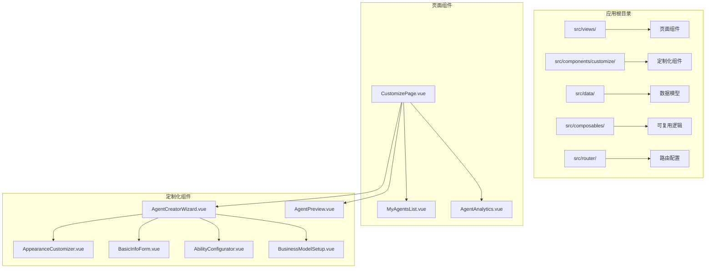

**图表来源**
- [CustomizePage.vue:1-217](file://apps/AgentPit/src/views/CustomizePage.vue#L1-L217)
- [AgentCreatorWizard.vue:1-355](file://apps/AgentPit/src/components/customize/AgentCreatorWizard.vue#L1-L355)

**章节来源**
- [CustomizePage.vue:1-217](file://apps/AgentPit/src/views/CustomizePage.vue#L1-L217)
- [index.ts:1-73](file://apps/AgentPit/src/router/index.ts#L1-L73)

## 核心组件
系统的核心组件围绕智能体生命周期展开，每个组件都有明确的职责分工：

### 数据模型架构
系统采用强类型的数据模型设计，确保配置的一致性和完整性：

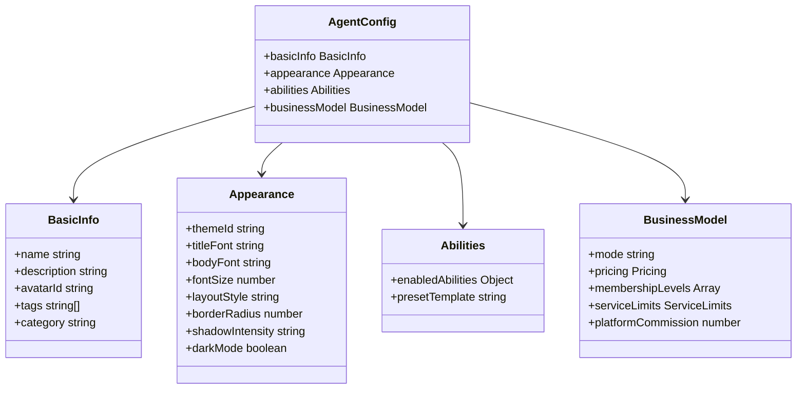

**图表来源**
- [mockCustomize.ts:39-95](file://apps/AgentPit/src/data/mockCustomize.ts#L39-L95)

### 组件间关系图
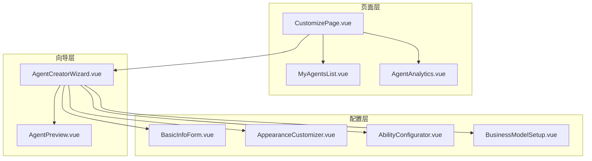

**图表来源**
- [CustomizePage.vue:4-6](file://apps/AgentPit/src/views/CustomizePage.vue#L4-L6)
- [AgentCreatorWizard.vue:3-7](file://apps/AgentPit/src/components/customize/AgentCreatorWizard.vue#L3-L7)

**章节来源**
- [mockCustomize.ts:1-1267](file://apps/AgentPit/src/data/mockCustomize.ts#L1-L1267)

## 架构概览
系统采用MVVM架构模式，结合Vue 3的Composition API实现响应式数据绑定和组件通信。

### 数据流架构
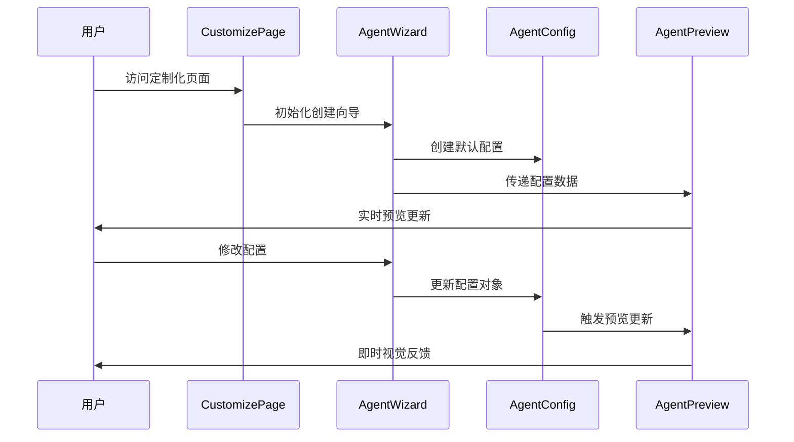

**图表来源**
- [CustomizePage.vue:27-52](file://apps/AgentPit/src/views/CustomizePage.vue#L27-L52)
- [AgentCreatorWizard.vue:37-44](file://apps/AgentPit/src/components/customize/AgentCreatorWizard.vue#L37-L44)

### 状态管理模式
系统采用Vue响应式系统管理状态，通过provide/inject机制在组件树中传递配置数据：

```mermaid
flowchart TD
A[AgentCreatorWizard] --> B[provide('agentConfig')]
B --> C[AppearanceCustomizer]
B --> D[BasicInfoForm]
B --> E[AbilityConfigurator]
B --> F[BusinessModelSetup]
B --> G[AgentPreview]
C --> H[更新外观配置]
D --> I[更新基本信息]
E --> J[更新能力配置]
F --> K[更新商业模式]
G --> L[实时预览渲染]
H --> M[触发预览更新]
I --> M
J --> M
K --> M
M --> L
```

**图表来源**
- [AgentCreatorWizard.vue:44](file://apps/AgentPit/src/components/customize/AgentCreatorWizard.vue#L44)
- [AppearanceCustomizer.vue:68-118](file://apps/AgentPit/src/components/customize/AppearanceCustomizer.vue#L68-L118)

**章节来源**
- [AgentCreatorWizard.vue:1-355](file://apps/AgentPit/src/components/customize/AgentCreatorWizard.vue#L1-L355)

## 详细组件分析

### 智能体创建向导
AgentCreatorWizard是整个定制化系统的核心入口，采用5步引导式流程：

#### 步骤流程设计
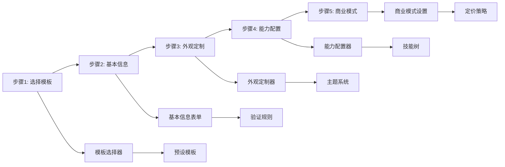

**图表来源**
- [AgentCreatorWizard.vue:29-35](file://apps/AgentPit/src/components/customize/AgentCreatorWizard.vue#L29-L35)

#### 关键特性实现
- **进度跟踪**：实时显示完成百分比和步骤状态
- **条件导航**：根据当前步骤启用/禁用导航按钮
- **模板继承**：从预设模板自动填充推荐配置
- **双向绑定**：使用v-model实现配置数据的实时同步

**章节来源**
- [AgentCreatorWizard.vue:1-355](file://apps/AgentPit/src/components/customize/AgentCreatorWizard.vue#L1-L355)

### 实时预览系统
AgentPreview组件提供了完整的智能体外观预览功能：

#### 预览渲染机制
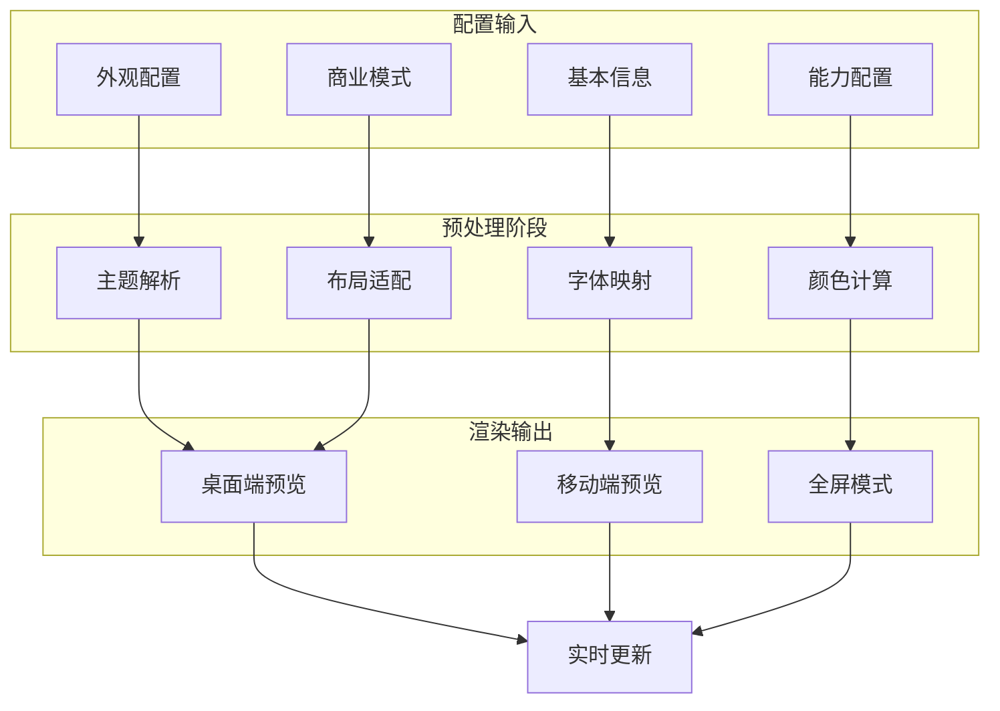

**图表来源**
- [AgentPreview.vue:21-52](file://apps/AgentPit/src/components/customize/AgentPreview.vue#L21-L52)

#### 预览功能特性
- **多设备适配**：支持桌面、平板、手机三种设备尺寸
- **全屏预览**：独立窗口模式便于详细检查
- **实时更新**：配置变更即时反映在预览中
- **分享功能**：一键生成预览链接

**章节来源**
- [AgentPreview.vue:1-413](file://apps/AgentPit/src/components/customize/AgentPreview.vue#L1-L413)

### 外观定制器
AppearanceCustomizer提供了全面的视觉定制能力：

#### 主题系统架构
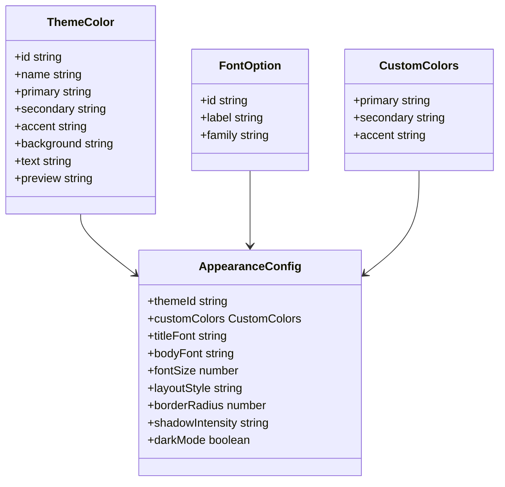

**图表来源**
- [mockCustomize.ts:8-302](file://apps/AgentPit/src/data/mockCustomize.ts#L8-L302)

#### 定制功能详解
- **主题系统**：12种预设主题，支持自定义主色调
- **字体管理**：6种字体选项，支持标题和正文分别设置
- **布局样式**：4种布局模式（卡片、列表、时间线、仪表盘）
- **视觉效果**：圆角、阴影、深色模式等视觉定制

**章节来源**
- [AppearanceCustomizer.vue:1-409](file://apps/AgentPit/src/components/customize/AppearanceCustomizer.vue#L1-L409)

### 基本信息表单
BasicInfoForm负责智能体的核心元数据管理：

#### 表单验证体系
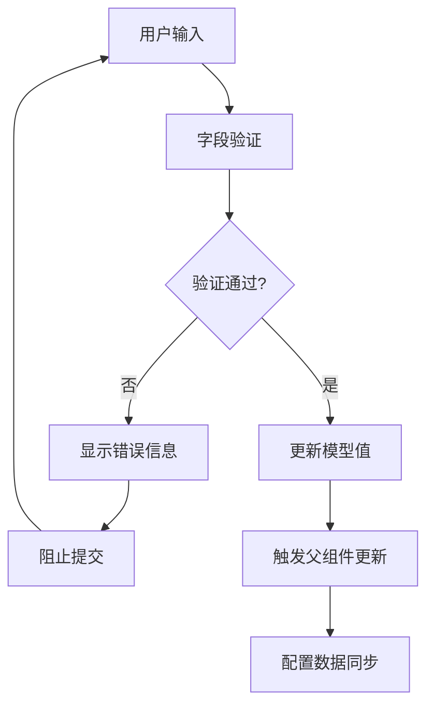

**图表来源**
- [BasicInfoForm.vue:16-31](file://apps/AgentPit/src/components/customize/BasicInfoForm.vue#L16-L31)

#### 表单字段规范
- **名称验证**：2-50字符，必填
- **描述管理**：支持Markdown格式，最多500字符
- **头像选择**：内置头像库，支持自定义图片上传
- **标签系统**：最多10个标签，支持键盘快捷输入
- **分类选择**：7种智能体分类

**章节来源**
- [BasicInfoForm.vue:1-306](file://apps/AgentPit/src/components/customize/BasicInfoForm.vue#L1-L306)

### 能力配置器
AbilityConfigurator实现了复杂的技能树管理系统：

#### 技能依赖关系
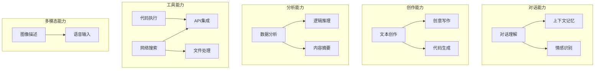

**图表来源**
- [mockCustomize.ts:313-471](file://apps/AgentPit/src/data/mockCustomize.ts#L313-L471)

#### 配置管理特性
- **技能树组织**：按功能分类的技能树结构
- **依赖检测**：自动检测和提示技能依赖关系
- **熟练度控制**：每个技能的熟练度百分比设置
- **参数配置**：针对不同技能的专用参数面板
- **预设模板**：4种预设能力组合方案

**章节来源**
- [AbilityConfigurator.vue:1-447](file://apps/AgentPit/src/components/customize/AbilityConfigurator.vue#L1-L447)

### 商业模式设置
BusinessModelSetup提供了灵活的盈利模式配置：

#### 定价模式对比
```mermaid
graph LR
subgraph "免费模式"
A[无限制使用]
B[平台水印]
C[功能限制]
end
subgraph "订阅制"]
D[月费]
E[季费]
F[年费]
G[阶梯定价]
end
subgraph "按次付费"
H[单次调用]
I[批量折扣]
J[包月套餐]
end
subgraph "会员等级"
K[普通版]
L[VIP版]
M[SVIP版]
N[功能差异化]
end
```

**图表来源**
- [BusinessModelSetup.vue:31-36](file://apps/AgentPit/src/components/customize/BusinessModelSetup.vue#L31-L36)

#### 服务限制管理
- **并发用户**：可配置的最大同时在线用户数
- **请求限制**：每日调用次数和API频率限制
- **服务时段**：可配置的服务可用时间段
- **试用期设置**：支持7-90天的试用期配置
- **平台分成**：0-50%的平台抽成比例

**章节来源**
- [BusinessModelSetup.vue:1-508](file://apps/AgentPit/src/components/customize/BusinessModelSetup.vue#L1-L508)

### 智能体列表管理
MyAgentsList提供了完整的智能体批量管理功能：

#### 列表管理功能
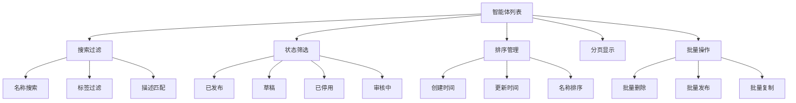

**图表来源**
- [MyAgentsList.vue:61-90](file://apps/AgentPit/src/components/customize/MyAgentsList.vue#L61-L90)

#### 操作功能实现
- **搜索功能**：防抖搜索，支持多字段匹配
- **状态管理**：完整的智能体生命周期状态
- **批量操作**：支持批量选择和批量处理
- **分页系统**：每页9个智能体的分页显示
- **确认对话框**：防止误操作的安全确认

**章节来源**
- [MyAgentsList.vue:1-451](file://apps/AgentPit/src/components/customize/MyAgentsList.vue#L1-L451)

### 智能体分析系统
AgentAnalytics提供了数据驱动的运营洞察：

#### 数据可视化架构
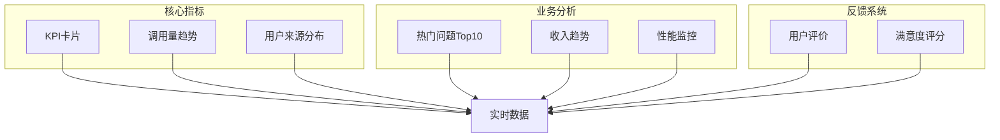

**图表来源**
- [AgentAnalytics.vue:37-78](file://apps/AgentPit/src/components/customize/AgentAnalytics.vue#L37-L78)

#### 分析维度
- **运营指标**：调用量、活跃用户、响应时间、满意度
- **趋势分析**：7/30/90天调用量趋势
- **用户画像**：来源渠道分布分析
- **内容分析**：热门问题Top10统计
- **财务分析**：收入趋势和预估
- **性能监控**：成功率、错误率、并发数

**章节来源**
- [AgentAnalytics.vue:1-469](file://apps/AgentPit/src/components/customize/AgentAnalytics.vue#L1-L469)

## 依赖分析
系统采用模块化设计，各组件间的依赖关系清晰明确：

### 外部依赖
- **Vue 3 Composition API**：响应式数据管理和生命周期管理
- **vee-validate + yup**：表单验证和数据校验
- **vue-echarts + echarts**：数据可视化图表
- **Tailwind CSS**：实用优先的CSS框架

### 内部依赖关系
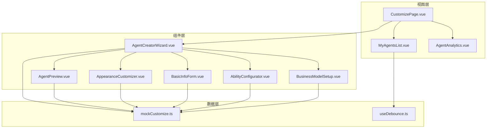

**图表来源**
- [CustomizePage.vue:1-17](file://apps/AgentPit/src/views/CustomizePage.vue#L1-L17)
- [AgentCreatorWizard.vue:1-13](file://apps/AgentPit/src/components/customize/AgentCreatorWizard.vue#L1-L13)

### 数据流依赖
系统采用单向数据流设计，确保数据一致性：

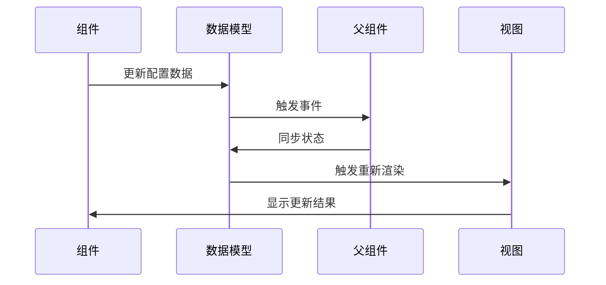

**图表来源**
- [AgentCreatorWizard.vue:106-108](file://apps/AgentPit/src/components/customize/AgentCreatorWizard.vue#L106-L108)

**章节来源**
- [mockCustomize.ts:1-1267](file://apps/AgentPit/src/data/mockCustomize.ts#L1-L1267)

## 性能考虑
系统在多个层面进行了性能优化：

### 渲染性能优化
- **虚拟滚动**：智能体列表使用虚拟滚动减少DOM节点
- **懒加载**：路由级组件懒加载，减少初始加载时间
- **防抖机制**：搜索功能使用300ms防抖，避免频繁重渲染
- **过渡动画**：使用CSS过渡而非JavaScript动画，提升流畅度

### 数据处理优化
- **响应式缓存**：计算属性自动缓存，避免重复计算
- **增量更新**：只更新变化的部分，而非整棵组件树
- **内存管理**：及时清理事件监听器和定时器

### 网络性能
- **静态资源优化**：图片和字体资源压缩和CDN加速
- **组件拆分**：按需加载，减少不必要的代码传输

## 故障排除指南

### 常见问题及解决方案

#### 表单验证问题
**问题**：表单字段验证不生效
**原因**：vee-validate配置错误或字段名不匹配
**解决方案**：
1. 检查字段名与modelValue一致
2. 确认验证规则语法正确
3. 验证schema定义完整

#### 预览更新延迟
**问题**：配置更改后预览不立即更新
**原因**：响应式更新机制延迟
**解决方案**：
1. 检查v-model绑定是否正确
2. 确认provide/inject数据传递
3. 验证computed属性依赖关系

#### 性能问题
**问题**：页面渲染缓慢
**原因**：大量DOM节点或复杂计算
**解决方案**：
1. 使用虚拟滚动优化列表
2. 减少不必要的计算属性
3. 实施适当的防抖机制

#### 数据同步问题
**问题**：父子组件数据不一致
**原因**：事件传递或状态管理问题
**解决方案**：
1. 检查emit事件名称和参数
2. 确认provide/inject上下文
3. 验证响应式数据绑定

**章节来源**
- [BasicInfoForm.vue:16-31](file://apps/AgentPit/src/components/customize/BasicInfoForm.vue#L16-L31)
- [useDebounce.ts:1-21](file://apps/AgentPit/src/composables/useDebounce.ts#L1-L21)

## 结论
AgentPit定制化系统通过模块化的设计理念和完善的组件体系，为AI智能体的创建和管理提供了完整的解决方案。系统具有以下优势：

### 技术优势
- **模块化架构**：清晰的组件职责分离，便于维护和扩展
- **强类型支持**：TypeScript提供完整的类型安全保障
- **响应式设计**：Vue 3 Composition API带来更好的开发体验
- **数据驱动**：完整的数据模型和状态管理

### 功能优势
- **完整生命周期**：从创建到发布的全流程覆盖
- **高度定制化**：丰富的配置选项满足不同需求
- **实时预览**：所见即所得的用户体验
- **数据洞察**：全面的分析和监控功能

### 开发优势
- **可扩展性**：良好的架构设计便于功能扩展
- **可维护性**：清晰的代码结构和文档
- **可测试性**：模块化设计便于单元测试
- **可移植性**：组件化设计支持跨项目复用

该系统为AI智能体平台的商业化运营提供了坚实的技术基础，通过持续的功能完善和性能优化，能够满足不同规模用户的需求。

## 附录

### 配置选项参考
系统支持的配置选项包括：

#### 外观配置
- 主题选择：12种预设主题
- 字体设置：6种字体选项
- 布局样式：4种布局模式
- 视觉效果：圆角、阴影、深色模式

#### 能力配置
- 技能树：17种AI能力
- 熟练度：0-100%可调
- 依赖关系：自动检测和提示
- 参数配置：针对技能的专用参数

#### 商业模式
- 定价模式：免费、订阅、按次付费、会员制
- 服务限制：并发用户、请求次数、API频率
- 平台分成：0-50%可配置
- 试用期：0-90天可设置

### API接口规范
系统采用RESTful API设计，支持标准HTTP方法：
- GET：获取智能体列表和详情
- POST：创建新的智能体配置
- PUT：更新现有智能体配置
- DELETE：删除智能体配置

### 错误码定义
系统定义了标准的错误码：
- 200：操作成功
- 400：参数验证失败
- 401：认证失败
- 403：权限不足
- 500：服务器内部错误