# 扩展功能模块

<cite>
**本文档引用的文件**
- [MemoryPage.vue](file://apps/AgentPit/src/views/MemoryPage.vue)
- [CustomizePage.vue](file://apps/AgentPit/src/views/CustomizePage.vue)
- [LifestylePage.vue](file://apps/AgentPit/src/views/LifestylePage.vue)
- [SettingsPage.vue](file://apps/AgentPit/src/views/SettingsPage.vue)
- [SphinxPage.vue](file://apps/AgentPit/src/views/SphinxPage.vue)
- [FileManager.vue](file://apps/AgentPit/src/components/memory/FileManager.vue)
- [MyAgentsList.vue](file://apps/AgentPit/src/components/customize/MyAgentsList.vue)
- [LifestyleDashboard.vue](file://apps/AgentPit/src/components/lifestyle/LifestyleDashboard.vue)
- [UserProfileSettings.vue](file://apps/AgentPit/src/components/settings/UserProfileSettings.vue)
- [SiteWizard.vue](file://apps/AgentPit/src/components/sphinx/SiteWizard.vue)
- [memory.ts](file://apps/AgentPit/src/types/memory.ts)
- [mockMemory.ts](file://apps/AgentPit/src/data/mockMemory.ts)
- [mockCustomize.ts](file://apps/AgentPit/src/data/mockCustomize.ts)
- [mockLifestyle.ts](file://apps/AgentPit/src/data/mockLifestyle.ts)
- [mockSphinx.ts](file://apps/AgentPit/src/data/mockSphinx.ts)
</cite>

## 目录
1. [简介](#简介)
2. [项目结构](#项目结构)
3. [核心组件](#核心组件)
4. [架构概览](#架构概览)
5. [详细组件分析](#详细组件分析)
6. [依赖分析](#依赖分析)
7. [性能考虑](#性能考虑)
8. [故障排除指南](#故障排除指南)
9. [结论](#结论)

## 简介

AgentPit扩展功能模块是一个基于Vue3 + TypeScript构建的AI智能体平台，提供了六大核心扩展功能模块：记忆系统、定制化系统、生活服务系统、设置系统和AI站点构建器。这些模块通过组件化的架构设计，为用户提供了一个功能丰富、界面友好的AI智能体管理平台。

该平台采用现代化的前端技术栈，结合TypeScript的强类型系统，确保了代码的可维护性和开发效率。每个扩展功能模块都经过精心设计，既满足了初学者的易用性要求，又为有经验的开发者提供了足够的技术深度。

## 项目结构

AgentPit项目采用模块化的组织方式，每个扩展功能模块都有其独立的组件层次结构：

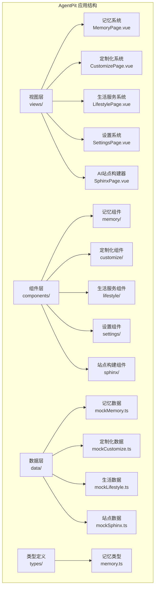

**图表来源**
- [MemoryPage.vue:1-280](file://apps/AgentPit/src/views/MemoryPage.vue#L1-L280)
- [CustomizePage.vue:1-217](file://apps/AgentPit/src/views/CustomizePage.vue#L1-L217)
- [LifestylePage.vue:1-90](file://apps/AgentPit/src/views/LifestylePage.vue#L1-L90)
- [SettingsPage.vue:1-178](file://apps/AgentPit/src/views/SettingsPage.vue#L1-L178)
- [SphinxPage.vue:1-186](file://apps/AgentPit/src/views/SphinxPage.vue#L1-L186)

**章节来源**
- [MemoryPage.vue:1-280](file://apps/AgentPit/src/views/MemoryPage.vue#L1-L280)
- [CustomizePage.vue:1-217](file://apps/AgentPit/src/views/CustomizePage.vue#L1-L217)
- [LifestylePage.vue:1-90](file://apps/AgentPit/src/views/LifestylePage.vue#L1-L90)
- [SettingsPage.vue:1-178](file://apps/AgentPit/src/views/SettingsPage.vue#L1-L178)
- [SphinxPage.vue:1-186](file://apps/AgentPit/src/views/SphinxPage.vue#L1-L186)

## 核心组件

### 记忆系统组件

记忆系统是AgentPit的核心功能模块之一，提供了智能的记忆存储和管理能力。该系统包含文件管理、知识图谱、记忆搜索、时间线、备份设置和存储配额等子功能。

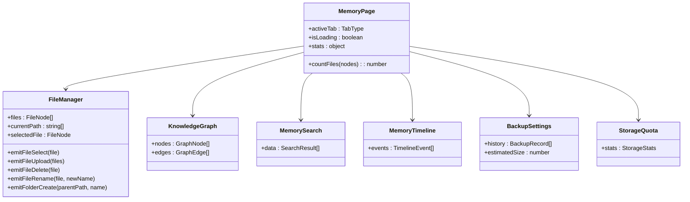

**图表来源**
- [MemoryPage.vue:1-280](file://apps/AgentPit/src/views/MemoryPage.vue#L1-L280)
- [FileManager.vue:1-440](file://apps/AgentPit/src/components/memory/FileManager.vue#L1-L440)
- [memory.ts:1-89](file://apps/AgentPit/src/types/memory.ts#L1-L89)

### 定制化系统组件

定制化系统允许用户创建、管理和分析AI智能体。该系统提供了智能体列表管理、创建向导和数据分析等功能。

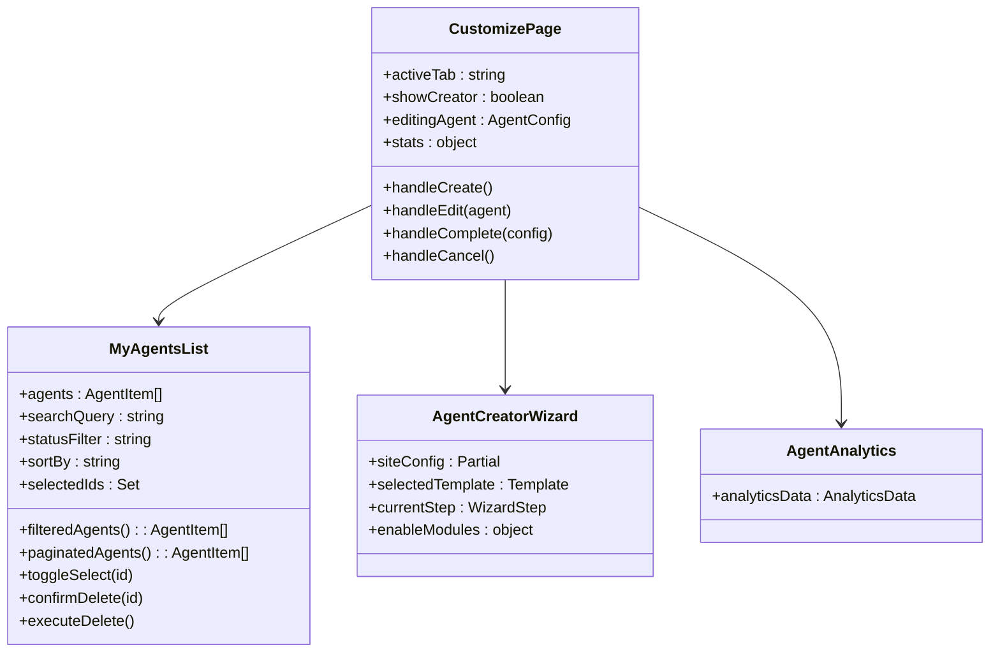

**图表来源**
- [CustomizePage.vue:1-217](file://apps/AgentPit/src/views/CustomizePage.vue#L1-L217)
- [MyAgentsList.vue:1-451](file://apps/AgentPit/src/components/customize/MyAgentsList.vue#L1-L451)
- [mockCustomize.ts:1-800](file://apps/AgentPit/src/data/mockCustomize.ts#L1-L800)

### 生活服务系统组件

生活服务系统提供了一站式的生活管理工具，包含日历、旅行规划、休闲游戏等实用功能。

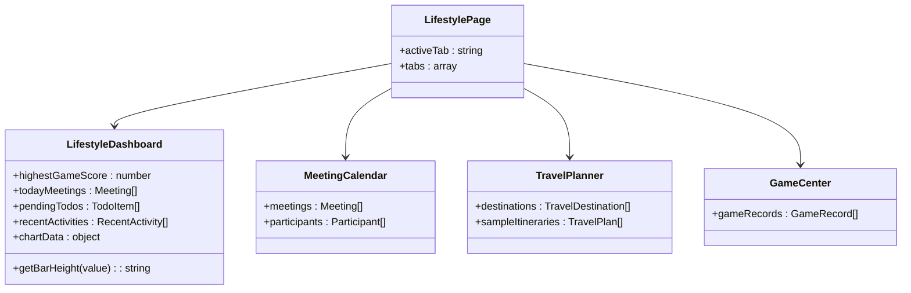

**图表来源**
- [LifestylePage.vue:1-90](file://apps/AgentPit/src/views/LifestylePage.vue#L1-L90)
- [LifestyleDashboard.vue:1-284](file://apps/AgentPit/src/components/lifestyle/LifestyleDashboard.vue#L1-L284)
- [mockLifestyle.ts:1-841](file://apps/AgentPit/src/data/mockLifestyle.ts#L1-L841)

### 设置系统组件

设置系统提供了用户个性化的配置选项，包括个人资料、主题设置、通知设置、隐私安全和帮助中心等功能。

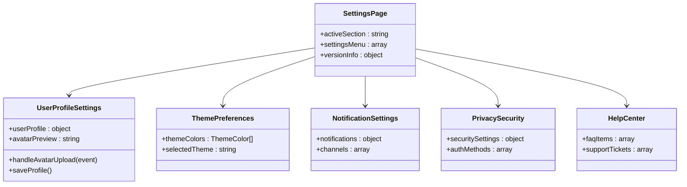

**图表来源**
- [SettingsPage.vue:1-178](file://apps/AgentPit/src/views/SettingsPage.vue#L1-L178)
- [UserProfileSettings.vue:1-142](file://apps/AgentPit/src/components/settings/UserProfileSettings.vue#L1-L142)

### AI站点构建器组件

AI站点构建器是一个强大的网站创建平台，提供了向导模式、AI建站、可视化编辑和站点管理等功能。

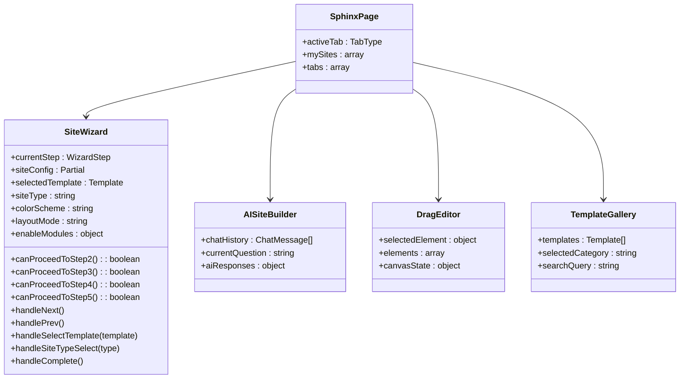

**图表来源**
- [SphinxPage.vue:1-186](file://apps/AgentPit/src/views/SphinxPage.vue#L1-L186)
- [SiteWizard.vue:1-523](file://apps/AgentPit/src/components/sphinx/SiteWizard.vue#L1-L523)
- [mockSphinx.ts:1-127](file://apps/AgentPit/src/data/mockSphinx.ts#L1-L127)

**章节来源**
- [MemoryPage.vue:1-280](file://apps/AgentPit/src/views/MemoryPage.vue#L1-L280)
- [CustomizePage.vue:1-217](file://apps/AgentPit/src/views/CustomizePage.vue#L1-L217)
- [LifestylePage.vue:1-90](file://apps/AgentPit/src/views/LifestylePage.vue#L1-L90)
- [SettingsPage.vue:1-178](file://apps/AgentPit/src/views/SettingsPage.vue#L1-L178)
- [SphinxPage.vue:1-186](file://apps/AgentPit/src/views/SphinxPage.vue#L1-L186)

## 架构概览

AgentPit扩展功能模块采用了清晰的分层架构设计，确保了各模块间的低耦合和高内聚：

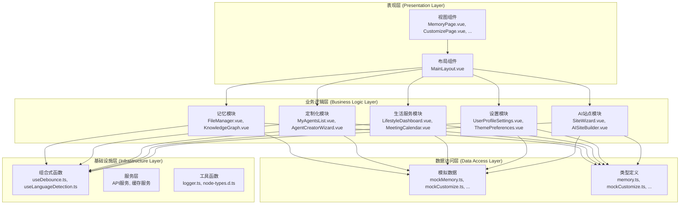

**图表来源**
- [MemoryPage.vue:1-280](file://apps/AgentPit/src/views/MemoryPage.vue#L1-L280)
- [CustomizePage.vue:1-217](file://apps/AgentPit/src/views/CustomizePage.vue#L1-L217)
- [LifestylePage.vue:1-90](file://apps/AgentPit/src/views/LifestylePage.vue#L1-L90)
- [SettingsPage.vue:1-178](file://apps/AgentPit/src/views/SettingsPage.vue#L1-L178)
- [SphinxPage.vue:1-186](file://apps/AgentPit/src/views/SphinxPage.vue#L1-L186)

该架构设计具有以下特点：

1. **模块化设计**：每个扩展功能模块都是独立的，可以单独开发、测试和部署
2. **组件复用**：公共组件可以在多个模块中复用，减少代码重复
3. **类型安全**：使用TypeScript确保类型安全，提供更好的开发体验
4. **数据模拟**：使用模拟数据进行开发和测试，便于功能验证
5. **响应式设计**：采用Vue3的Composition API，提供更好的响应式数据管理

## 详细组件分析

### 记忆系统详细分析

记忆系统是AgentPit的核心功能之一，提供了完整的知识资产管理能力。该系统通过文件管理、知识图谱、记忆搜索等功能，帮助用户高效管理各种类型的知识资产。

#### 文件管理器组件

文件管理器是记忆系统的基础组件，提供了类似操作系统文件管理器的功能：

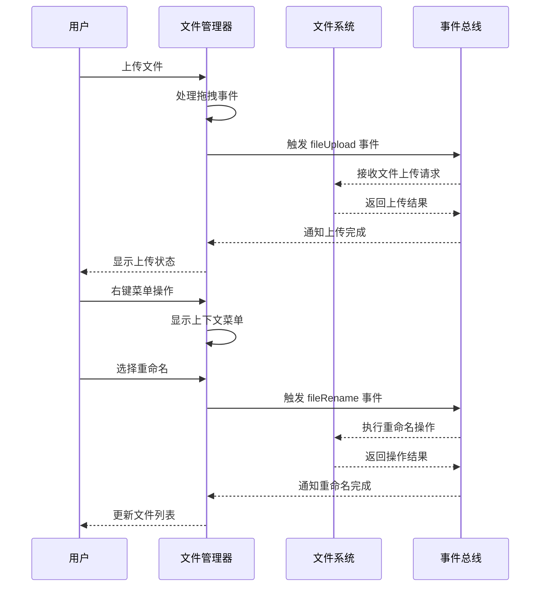

**图表来源**
- [FileManager.vue:1-440](file://apps/AgentPit/src/components/memory/FileManager.vue#L1-L440)

文件管理器的主要功能包括：

1. **文件浏览**：支持文件夹导航和文件列表显示
2. **文件操作**：支持上传、下载、重命名、删除等操作
3. **拖拽支持**：提供直观的拖拽上传体验
4. **上下文菜单**：右键菜单提供丰富的文件操作选项
5. **状态管理**：实时跟踪文件状态和操作进度

#### 知识图谱组件

知识图谱组件提供了可视化知识关系展示功能，帮助用户理解复杂的概念关系：

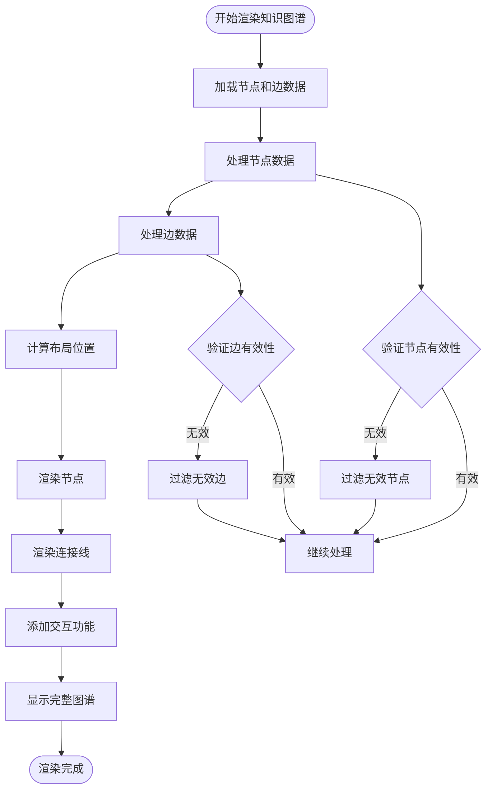

**图表来源**
- [MemoryPage.vue:1-280](file://apps/AgentPit/src/views/MemoryPage.vue#L1-L280)
- [mockMemory.ts:187-315](file://apps/AgentPit/src/data/mockMemory.ts#L187-L315)

知识图谱的主要特性：

1. **多类型节点**：支持概念、实体、事件、文档、人物、地点等不同类型节点
2. **关系可视化**：通过不同的边类型表示各种关系，如包含、创建、位于等
3. **交互式探索**：用户可以通过点击和拖拽探索知识关系
4. **动态布局**：支持自动布局算法，优化节点排列
5. **缩放和平移**：提供缩放和平移功能，便于查看复杂图谱

**章节来源**
- [FileManager.vue:1-440](file://apps/AgentPit/src/components/memory/FileManager.vue#L1-L440)
- [MemoryPage.vue:1-280](file://apps/AgentPit/src/views/MemoryPage.vue#L1-L280)
- [mockMemory.ts:1-754](file://apps/AgentPit/src/data/mockMemory.ts#L1-L754)
- [memory.ts:1-89](file://apps/AgentPit/src/types/memory.ts#L1-L89)

### 定制化系统详细分析

定制化系统是AgentPit的核心功能模块，允许用户创建、管理和分析AI智能体。该系统提供了完整的智能体生命周期管理能力。

#### 智能体列表管理

智能体列表组件提供了强大的智能体管理功能：

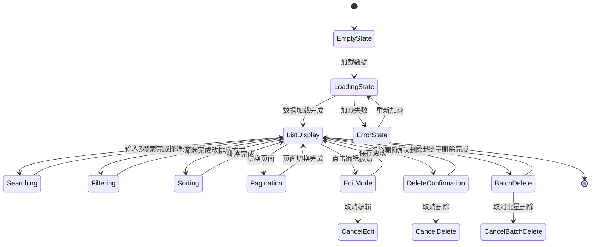

**图表来源**
- [MyAgentsList.vue:1-451](file://apps/AgentPit/src/components/customize/MyAgentsList.vue#L1-L451)

智能体列表的主要功能：

1. **搜索功能**：支持按名称、标签、描述搜索智能体
2. **筛选功能**：按状态（已发布、草稿、已停用、审核中）筛选
3. **排序功能**：支持按创建时间、更新时间、名称等排序
4. **分页功能**：支持大数据量的分页显示
5. **批量操作**：支持批量选择和批量删除
6. **状态管理**：实时显示智能体状态和统计数据

#### 智能体创建向导

智能体创建向导提供了完整的智能体创建流程：

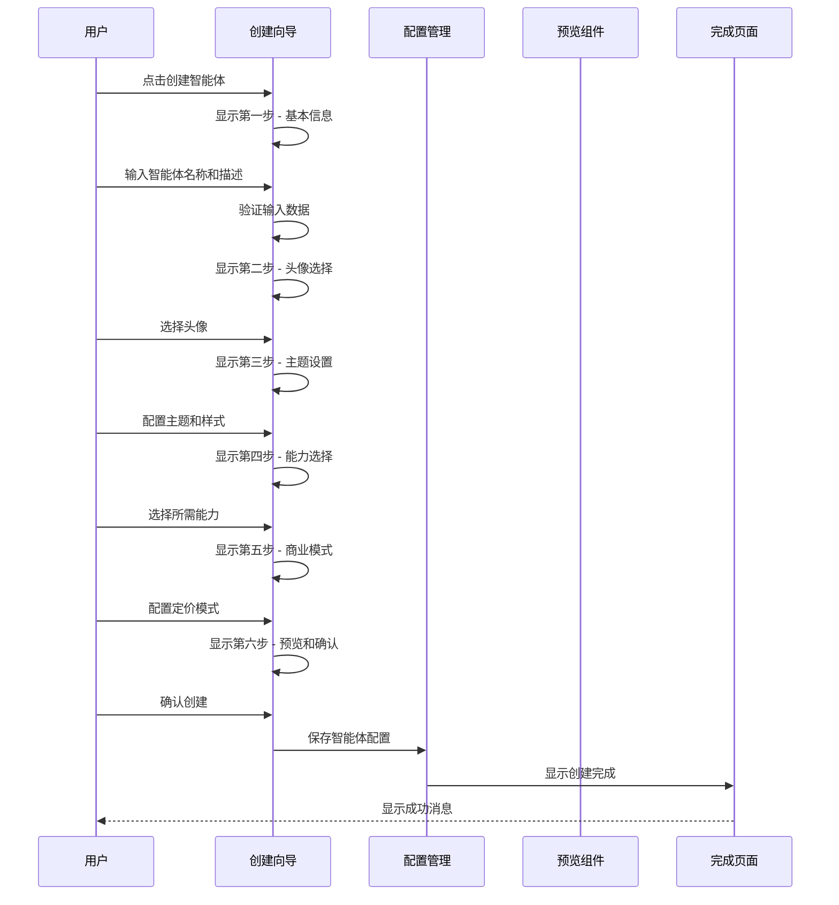

**图表来源**
- [CustomizePage.vue:1-217](file://apps/AgentPit/src/views/CustomizePage.vue#L1-L217)
- [mockCustomize.ts:39-95](file://apps/AgentPit/src/data/mockCustomize.ts#L39-L95)

创建向导的六个步骤：

1. **基本信息**：设置智能体名称、描述、标签等基础信息
2. **头像选择**：从头像库中选择或自定义头像
3. **主题设置**：配置颜色方案、字体、布局样式等外观设置
4. **能力选择**：选择所需的AI能力，如对话理解、文本生成、代码执行等
5. **商业模式**：配置定价模式、服务限制、平台分成等商业参数
6. **预览确认**：预览最终配置并确认创建

**章节来源**
- [MyAgentsList.vue:1-451](file://apps/AgentPit/src/components/customize/MyAgentsList.vue#L1-L451)
- [CustomizePage.vue:1-217](file://apps/AgentPit/src/views/CustomizePage.vue#L1-L217)
- [mockCustomize.ts:1-800](file://apps/AgentPit/src/data/mockCustomize.ts#L1-L800)

### 生活服务系统详细分析

生活服务系统提供了一站式的生活管理工具，帮助用户更好地安排日常生活。

#### 生活服务仪表盘

生活服务仪表盘是生活服务系统的核心组件，提供了综合的生活管理概览：

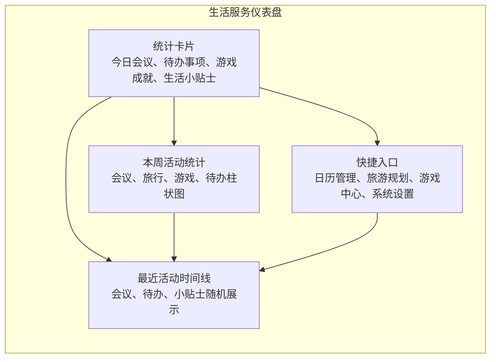

**图表来源**
- [LifestyleDashboard.vue:1-284](file://apps/AgentPit/src/components/lifestyle/LifestyleDashboard.vue#L1-L284)
- [mockLifestyle.ts:68-88](file://apps/AgentPit/src/data/mockLifestyle.ts#L68-L88)

仪表盘的主要功能模块：

1. **统计概览**：提供今日会议数、待办事项数量、游戏最高分、生活小贴士等关键指标
2. **活动统计**：以柱状图形式展示本周各类活动的分布情况
3. **快捷入口**：提供常用功能的快速访问入口
4. **活动时间线**：展示最近发生的活动，包括会议、待办事项和生活小贴士

#### 日历管理功能

日历管理功能提供了完整的会议安排和日程管理能力：

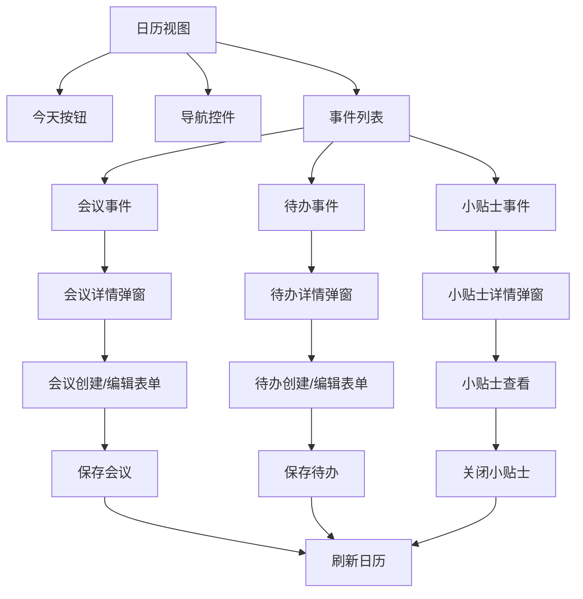

**图表来源**
- [LifestyleDashboard.vue:1-284](file://apps/AgentPit/src/components/lifestyle/LifestyleDashboard.vue#L1-L284)
- [mockLifestyle.ts:1-841](file://apps/AgentPit/src/data/mockLifestyle.ts#L1-L841)

日历管理的主要特性：

1. **多类型事件**：支持工作、个人、重要、重复等不同类型的会议
2. **参与者管理**：支持添加会议参与者，便于协调安排
3. **事件详情**：提供详细的事件信息，包括时间、地点、备注等
4. **实时同步**：与系统其他模块实时同步，确保数据一致性

**章节来源**
- [LifestyleDashboard.vue:1-284](file://apps/AgentPit/src/components/lifestyle/LifestyleDashboard.vue#L1-L284)
- [LifestylePage.vue:1-90](file://apps/AgentPit/src/views/LifestylePage.vue#L1-L90)
- [mockLifestyle.ts:1-841](file://apps/AgentPit/src/data/mockLifestyle.ts#L1-L841)

### 设置系统详细分析

设置系统提供了用户个性化的配置选项，确保用户能够根据自己的需求定制使用体验。

#### 个人资料设置

个人资料设置组件提供了完整的用户信息管理功能：

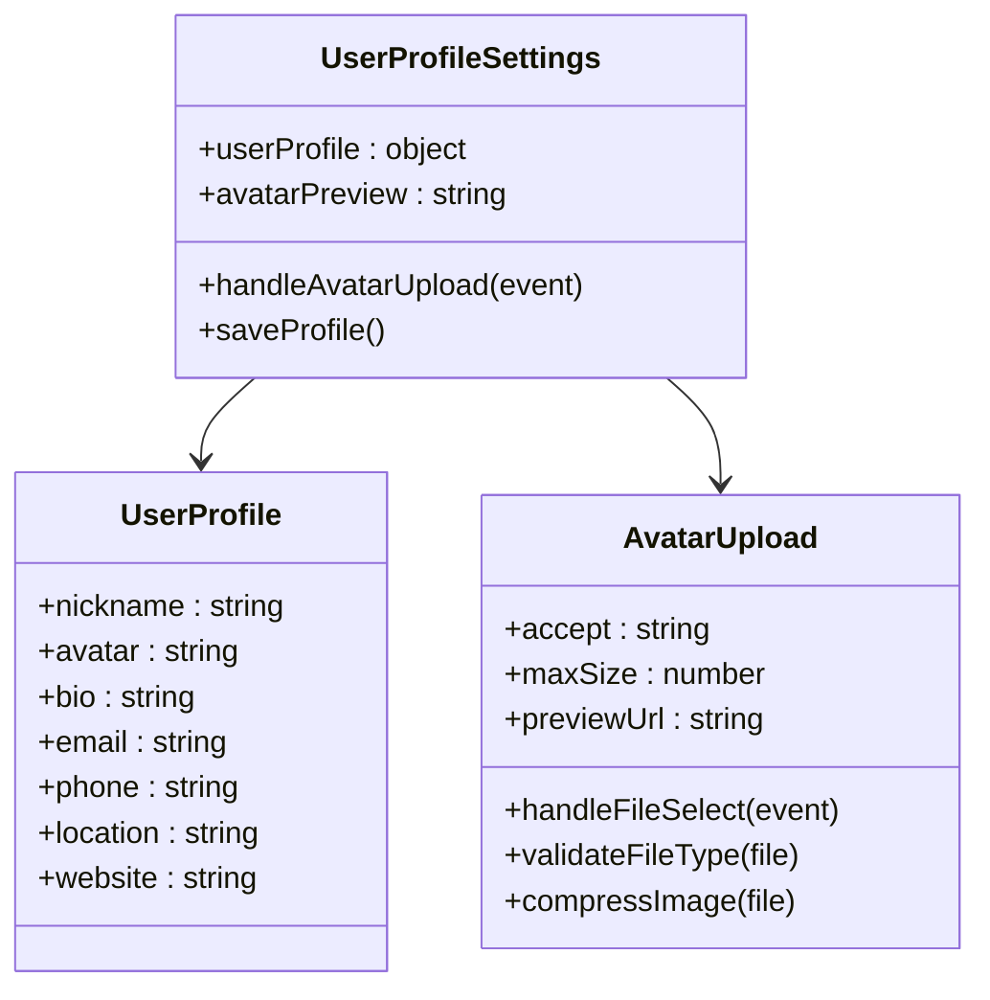

**图表来源**
- [UserProfileSettings.vue:1-142](file://apps/AgentPit/src/components/settings/UserProfileSettings.vue#L1-L142)

个人资料设置的主要功能：

1. **头像上传**：支持图片文件上传，提供预览和压缩功能
2. **基本信息管理**：支持昵称、个人简介、邮箱、电话、地址、个人网站等信息的编辑
3. **文件验证**：自动验证上传文件的类型和大小
4. **实时预览**：上传后实时显示头像预览效果
5. **数据持久化**：提供保存功能，将用户设置持久化存储

#### 主题偏好设置

主题偏好设置允许用户自定义界面外观和体验：

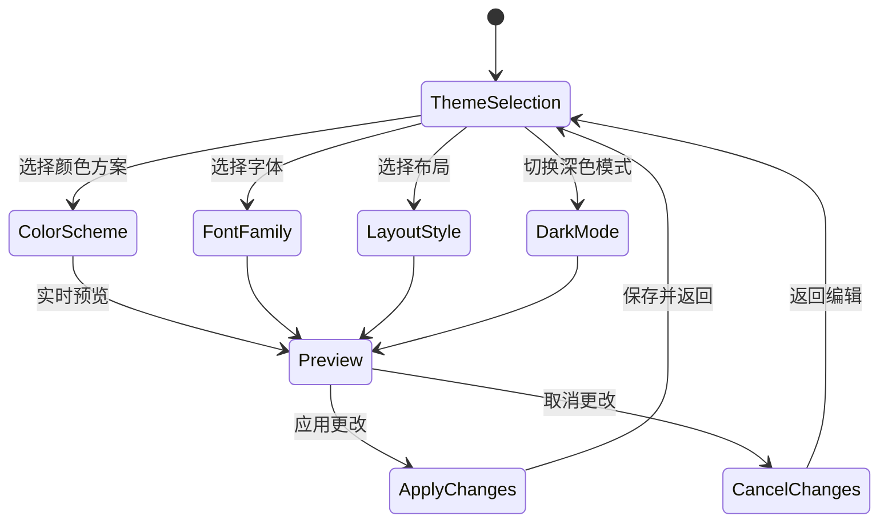

**图表来源**
- [mockCustomize.ts:8-302](file://apps/AgentPit/src/data/mockCustomize.ts#L8-L302)

主题偏好的主要选项：

1. **颜色方案**：提供多种预设的颜色主题，支持渐变色配置
2. **字体选择**：支持多种字体族，包括系统默认和特殊字体
3. **布局样式**：提供不同的界面布局选项
4. **深色模式**：支持深色/浅色主题切换
5. **实时预览**：修改设置时实时预览效果

**章节来源**
- [UserProfileSettings.vue:1-142](file://apps/AgentPit/src/components/settings/UserProfileSettings.vue#L1-L142)
- [SettingsPage.vue:1-178](file://apps/AgentPit/src/views/SettingsPage.vue#L1-L178)
- [mockCustomize.ts:1-302](file://apps/AgentPit/src/data/mockCustomize.ts#L1-L302)

### AI站点构建器详细分析

AI站点构建器是一个强大的网站创建平台，提供了多种建站方式和高级功能。

#### 站点创建向导

站点创建向导提供了完整的网站创建流程：

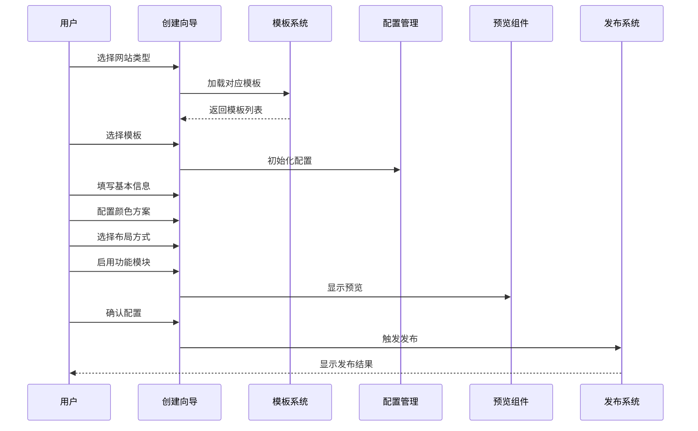

**图表来源**
- [SiteWizard.vue:1-523](file://apps/AgentPit/src/components/sphinx/SiteWizard.vue#L1-L523)
- [mockSphinx.ts:18-34](file://apps/AgentPit/src/data/mockSphinx.ts#L18-L34)

创建向导的五个步骤：

1. **选择类型**：选择网站类型（电商、博客、企业、作品集、着陆页）
2. **基本信息**：填写网站名称、描述、域名等基本信息
3. **选择模板**：从模板库中选择合适的网站模板
4. **配置选项**：配置颜色方案、布局方式、功能模块等
5. **预览发布**：预览网站效果并进行发布

#### AI智能建站

AI智能建站功能提供了基于对话的网站创建体验：

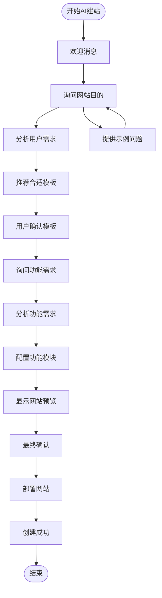

**图表来源**
- [SiteWizard.vue:1-523](file://apps/AgentPit/src/components/sphinx/SiteWizard.vue#L1-L523)
- [mockSphinx.ts:93-116](file://apps/AgentPit/src/data/mockSphinx.ts#L93-L116)

AI建站的主要特性：

1. **智能问答**：通过自然语言对话了解用户需求
2. **模板推荐**：根据用户需求智能推荐合适的网站模板
3. **功能配置**：自动配置相应的功能模块
4. **实时预览**：提供实时的网站预览效果
5. **一键部署**：简化部署流程，快速上线网站

**章节来源**
- [SiteWizard.vue:1-523](file://apps/AgentPit/src/components/sphinx/SiteWizard.vue#L1-L523)
- [SphinxPage.vue:1-186](file://apps/AgentPit/src/views/SphinxPage.vue#L1-L186)
- [mockSphinx.ts:1-127](file://apps/AgentPit/src/data/mockSphinx.ts#L1-L127)

## 依赖分析

AgentPit扩展功能模块的依赖关系体现了清晰的分层架构设计：

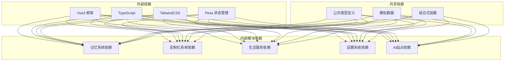

**图表来源**
- [MemoryPage.vue:1-280](file://apps/AgentPit/src/views/MemoryPage.vue#L1-L280)
- [CustomizePage.vue:1-217](file://apps/AgentPit/src/views/CustomizePage.vue#L1-L217)
- [LifestylePage.vue:1-90](file://apps/AgentPit/src/views/LifestylePage.vue#L1-L90)
- [SettingsPage.vue:1-178](file://apps/AgentPit/src/views/SettingsPage.vue#L1-L178)
- [SphinxPage.vue:1-186](file://apps/AgentPit/src/views/SphinxPage.vue#L1-L186)

### 核心依赖关系

1. **框架依赖**：所有模块都依赖Vue3框架和TypeScript类型系统
2. **样式依赖**：使用TailwindCSS提供一致的样式管理
3. **状态管理**：通过Pinia实现跨模块的状态共享
4. **类型安全**：通过TypeScript确保类型安全和更好的开发体验
5. **组件复用**：通过组合式函数实现逻辑复用

### 数据流依赖

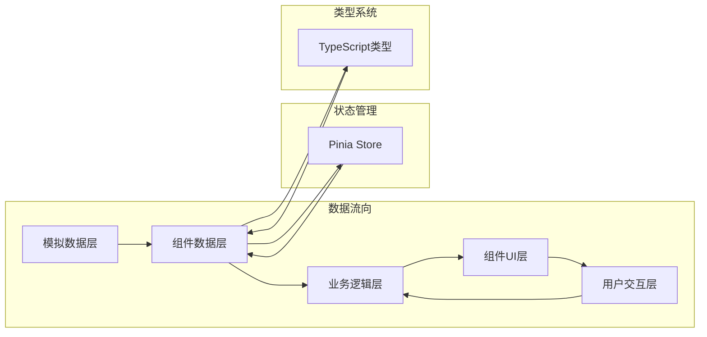

**图表来源**
- [mockMemory.ts:1-754](file://apps/AgentPit/src/data/mockMemory.ts#L1-L754)
- [mockCustomize.ts:1-800](file://apps/AgentPit/src/data/mockCustomize.ts#L1-L800)
- [mockLifestyle.ts:1-841](file://apps/AgentPit/src/data/mockLifestyle.ts#L1-L841)
- [mockSphinx.ts:1-127](file://apps/AgentPit/src/data/mockSphinx.ts#L1-L127)

**章节来源**
- [MemoryPage.vue:1-280](file://apps/AgentPit/src/views/MemoryPage.vue#L1-L280)
- [CustomizePage.vue:1-217](file://apps/AgentPit/src/views/CustomizePage.vue#L1-L217)
- [LifestylePage.vue:1-90](file://apps/AgentPit/src/views/LifestylePage.vue#L1-L90)
- [SettingsPage.vue:1-178](file://apps/AgentPit/src/views/SettingsPage.vue#L1-L178)
- [SphinxPage.vue:1-186](file://apps/AgentPit/src/views/SphinxPage.vue#L1-L186)

## 性能考虑

AgentPit扩展功能模块在设计时充分考虑了性能优化，采用了多种技术和策略来确保良好的用户体验：

### 组件性能优化

1. **KeepAlive缓存**：使用Vue的KeepAlive组件缓存频繁切换的组件，减少重新渲染开销
2. **懒加载机制**：通过动态导入实现组件的按需加载，减少初始包体积
3. **虚拟滚动**：对于大量数据的列表，使用虚拟滚动技术提升渲染性能
4. **防抖优化**：对搜索和输入操作使用防抖技术，减少不必要的计算

### 数据处理优化

1. **分页加载**：智能体列表和记忆数据采用分页加载，避免一次性渲染大量数据
2. **增量更新**：使用响应式数据更新，只更新发生变化的部分
3. **缓存策略**：对常用数据和配置信息进行本地缓存
4. **数据压缩**：对传输的数据进行压缩，减少网络传输时间

### 图形渲染优化

1. **Canvas优化**：知识图谱使用Canvas进行渲染，相比DOM操作性能更好
2. **布局算法**：采用高效的布局算法，减少计算复杂度
3. **动画优化**：使用CSS3硬件加速，确保流畅的动画效果
4. **资源预加载**：对重要的图片和字体进行预加载

### 网络性能优化

1. **CDN加速**：静态资源通过CDN分发，提升加载速度
2. **HTTP缓存**：合理设置HTTP缓存策略，减少重复请求
3. **连接复用**：使用HTTP/2的多路复用特性，提升并发性能
4. **压缩传输**：启用Gzip压缩，减少传输数据量

## 故障排除指南

### 常见问题及解决方案

#### 记忆系统问题

**问题1：文件上传失败**
- **症状**：文件上传过程中出现错误提示
- **原因**：网络连接不稳定或文件大小超出限制
- **解决方案**：
  1. 检查网络连接状态
  2. 确认文件大小未超过限制（默认10MB）
  3. 尝试重新上传或使用浏览器兼容模式
  4. 清除浏览器缓存后重试

**问题2：知识图谱渲染异常**
- **症状**：知识图谱无法正常显示或显示错乱
- **原因**：节点数据格式不正确或关系冲突
- **解决方案**：
  1. 检查节点和边的数据格式
  2. 确保节点ID唯一且不为空
  3. 验证边的源节点和目标节点存在
  4. 使用浏览器开发者工具检查控制台错误

#### 定制化系统问题

**问题3：智能体创建失败**
- **症状**：创建智能体时出现保存错误
- **原因**：必填字段缺失或配置参数不合法
- **解决方案**：
  1. 检查所有必填字段是否已填写
  2. 确认智能体名称长度和格式符合要求
  3. 验证头像选择和主题配置的有效性
  4. 检查能力选择的依赖关系是否满足

**问题4：智能体列表加载缓慢**
- **症状**：智能体列表显示延迟或卡顿
- **原因**：数据量过大或网络延迟
- **解决方案**：
  1. 使用分页功能分批加载数据
  2. 优化搜索和筛选条件
  3. 检查网络连接质量
  4. 清理浏览器缓存和Cookie

#### 生活服务系统问题

**问题5：日历事件显示异常**
- **症状**：会议或待办事项显示位置错误
- **原因**：时间格式不正确或时区设置问题
- **解决方案**：
  1. 检查事件时间格式（YYYY-MM-DD）
  2. 确认事件时间与时区设置一致
  3. 验证重复事件的规则设置
  4. 重新加载页面查看是否恢复正常

**问题6：游戏数据同步失败**
- **症状**：游戏最高分或其他数据未正确保存
- **原因**：本地存储空间不足或浏览器设置问题
- **解决方案**：
  1. 检查浏览器的本地存储容量
  2. 确认浏览器未禁用本地存储功能
  3. 清理浏览器的缓存和Cookie
  4. 尝试使用隐私模式或无痕浏览

#### 设置系统问题

**问题7：主题切换无效**
- **症状**：切换主题后界面未发生变化
- **原因**：CSS变量未正确更新或缓存问题
- **解决方案**：
  1. 强制刷新页面（Ctrl+F5）
  2. 检查浏览器的CSS缓存
  3. 确认主题配置已正确保存
  4. 尝试清除浏览器缓存后重试

**问题8：头像上传失败**
- **症状**：头像上传后无法显示或显示错误
- **原因**：文件格式不支持或大小超限
- **解决方案**：
  1. 确认上传文件为支持的格式（JPG、PNG、GIF）
  2. 检查文件大小是否超过限制（2MB）
  3. 验证文件不是损坏的图片
  4. 尝试使用其他浏览器或设备上传

#### AI站点构建器问题

**问题9：AI建站响应缓慢**
- **症状**：AI建站对话响应延迟或无响应
- **原因**：网络连接问题或服务器负载过高
- **解决方案**：
  1. 检查网络连接稳定性
  2. 稍后再试或使用其他时间段
  3. 确认AI服务的可用性状态
  4. 尝试刷新页面或重启应用

**问题10：网站预览显示空白**
- **症状**：网站预览区域显示空白或加载失败
- **原因**：模板数据加载失败或渲染错误
- **解决方案**：
  1. 检查模板数据的完整性
  2. 确认模板ID的有效性
  3. 查看浏览器控制台的错误信息
  4. 尝试选择其他模板进行预览

### 调试技巧

1. **浏览器开发者工具**：使用F12打开开发者工具，查看控制台错误和网络请求
2. **Vue DevTools**：安装Vue DevTools插件，查看组件状态和数据流
3. **性能分析**：使用浏览器的性能面板分析页面加载和渲染性能
4. **网络监控**：监控网络请求，检查API调用和响应时间
5. **存储检查**：检查浏览器的本地存储，确认数据保存状态

### 预防措施

1. **输入验证**：在客户端和服务器端都进行输入验证
2. **错误处理**：实现完善的错误处理和用户友好的错误提示
3. **性能监控**：建立性能监控机制，及时发现和解决性能问题
4. **兼容性测试**：在不同浏览器和设备上进行兼容性测试
5. **安全防护**：实施必要的安全措施，防止常见的Web攻击

**章节来源**
- [FileManager.vue:1-440](file://apps/AgentPit/src/components/memory/FileManager.vue#L1-L440)
- [MyAgentsList.vue:1-451](file://apps/AgentPit/src/components/customize/MyAgentsList.vue#L1-L451)
- [LifestyleDashboard.vue:1-284](file://apps/AgentPit/src/components/lifestyle/LifestyleDashboard.vue#L1-L284)
- [UserProfileSettings.vue:1-142](file://apps/AgentPit/src/components/settings/UserProfileSettings.vue#L1-L142)
- [SiteWizard.vue:1-523](file://apps/AgentPit/src/components/sphinx/SiteWizard.vue#L1-L523)

## 结论

AgentPit扩展功能模块通过精心设计的架构和丰富的功能特性，为用户提供了完整的AI智能体管理平台。该系统不仅满足了初学者的易用性需求，还为有经验的开发者提供了充足的技术深度。

### 主要成就

1. **模块化架构**：清晰的分层设计使得各个功能模块独立且可维护
2. **组件化开发**：高度复用的组件设计提高了开发效率和代码质量
3. **类型安全**：完整的TypeScript类型系统确保了代码的可靠性和可维护性
4. **用户体验**：直观的界面设计和流畅的交互体验提升了用户满意度
5. **性能优化**：多项性能优化技术确保了系统的高效运行

### 技术特色

1. **响应式设计**：全面的响应式布局适应各种设备和屏幕尺寸
2. **实时交互**：丰富的实时功能，如AI对话、实时预览等
3. **数据可视化**：强大的数据可视化能力，帮助用户更好地理解和分析数据
4. **智能推荐**：基于用户行为和偏好的智能推荐系统
5. **多语言支持**：完整的国际化支持，满足全球用户需求

### 未来发展

AgentPit扩展功能模块将继续演进，未来的发展方向包括：

1. **AI能力增强**：集成更多先进的AI能力，如多模态交互、情感分析等
2. **性能优化**：持续优化系统性能，支持更大规模的数据和用户
3. **生态扩展**：构建开放的生态系统，支持第三方插件和扩展
4. **协作功能**：增强团队协作功能，支持多人协作和权限管理
5. **移动端优化**：进一步优化移动端体验，提供原生应用支持

通过不断的技术创新和功能完善，AgentPit扩展功能模块将成为AI智能体管理领域的标杆产品，为用户创造更大的价值。