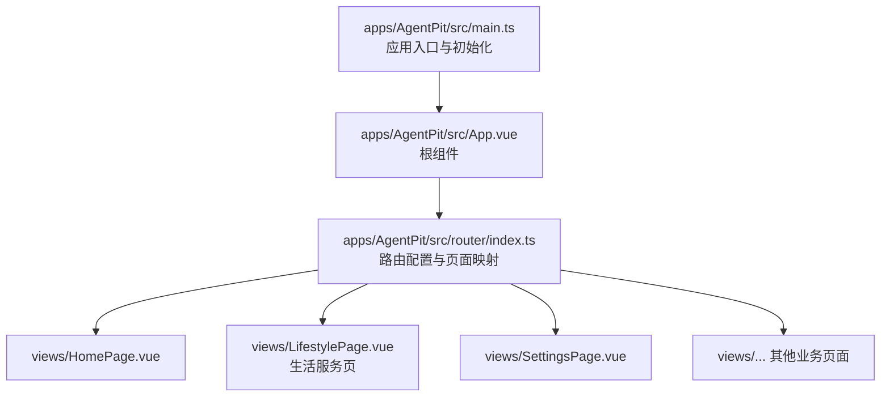
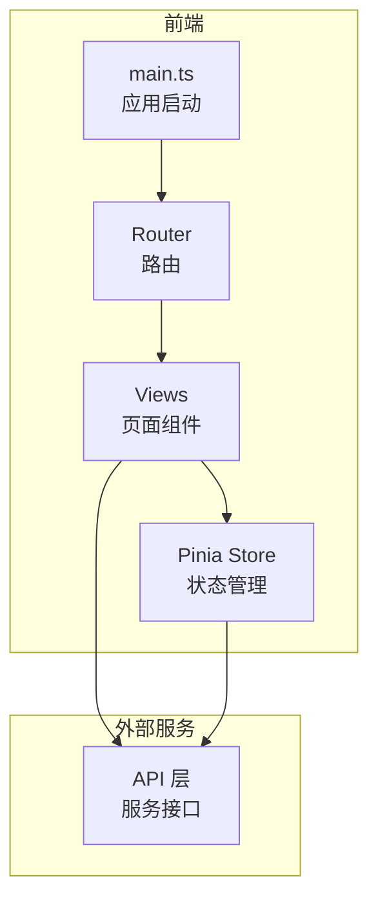
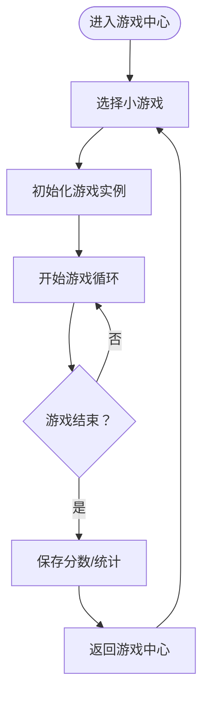
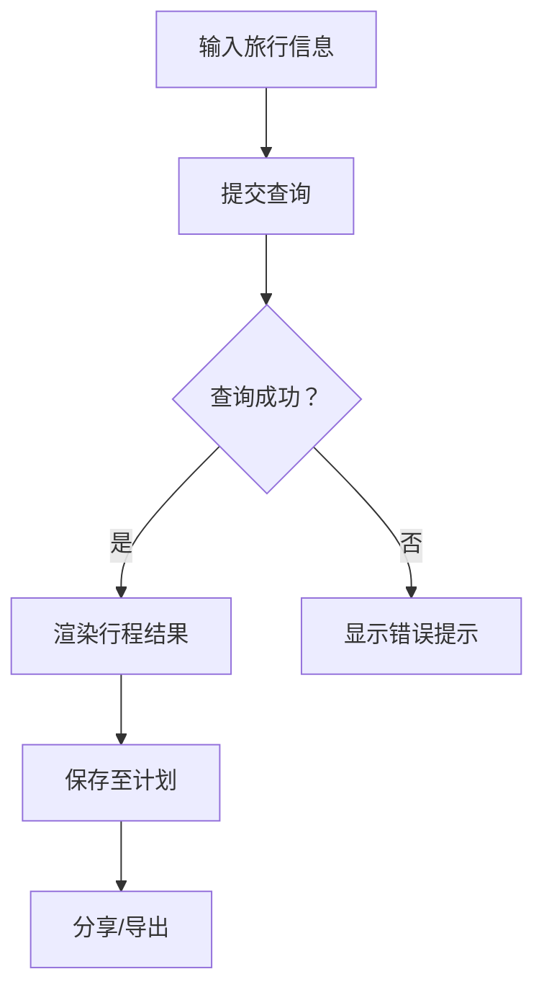
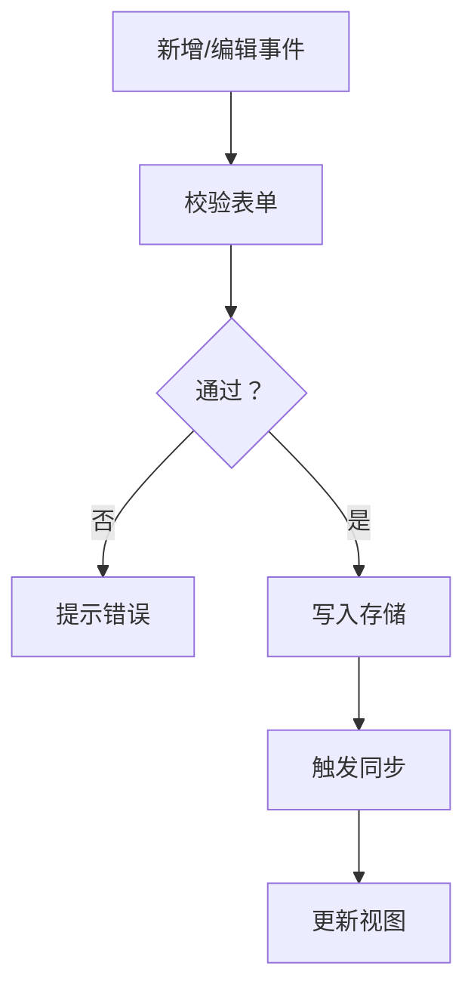
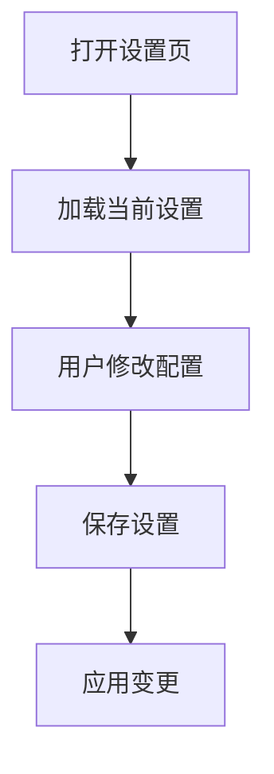
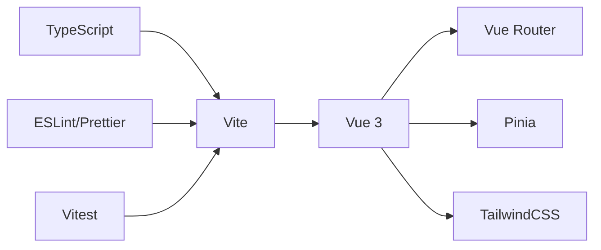

# 生活服务系统

<cite>
**本文引用的文件**
- [apps/AgentPit/src/main.ts](file://apps/AgentPit/src/main.ts)
- [apps/AgentPit/src/App.vue](file://apps/AgentPit/src/App.vue)
- [apps/AgentPit/src/router/index.ts](file://apps/AgentPit/src/router/index.ts)
- [apps/AgentPit/package.json](file://apps/AgentPit/package.json)
- [apps/AgentPit/README.md](file://apps/AgentPit/README.md)
</cite>

## 目录
1. [简介](#简介)
2. [项目结构](#项目结构)
3. [核心组件](#核心组件)
4. [架构总览](#架构总览)
5. [详细组件分析](#详细组件分析)
6. [依赖分析](#依赖分析)
7. [性能考虑](#性能考虑)
8. [故障排除指南](#故障排除指南)
9. [结论](#结论)
10. [附录](#附录)

## 简介
本文件为 AgentPit 生活服务系统的详细技术文档，聚焦于系统的核心模块与子功能的实现细节、调用关系、接口与使用模式。根据当前仓库可见信息，AgentPit 基于 Vue 3 + TypeScript + Vite 构建，采用 Pinia 进行状态管理，通过路由驱动页面导航。文档将围绕以下主题展开：应用入口与初始化、路由与视图映射、核心业务页面（如生活服务页）以及与外部服务的集成方式。由于部分源码目录在当前工作区中不可直接读取，本文以可验证的文件为基础进行说明，并在相应章节标注“章节来源”。

## 项目结构
AgentPit 应用采用标准的前端单页应用（SPA）结构：
- 应用入口：通过 main.ts 创建 Vue 实例，挂载 Pinia 与路由后渲染根组件 App.vue。
- 路由配置：在 router/index.ts 中定义页面级路由，支持按需加载视图组件。
- 视图层：各业务页面位于 views 目录，例如首页、生活服务页、设置页等。
- 核心依赖：Vue 3、Vue Router、Pinia、TailwindCSS 等。

图表来源
- [apps/AgentPit/src/main.ts:1-13](file://apps/AgentPit/src/main.ts#L1-L13)
- [apps/AgentPit/src/App.vue:1-8](file://apps/AgentPit/src/App.vue#L1-L8)
- [apps/AgentPit/src/router/index.ts:1-73](file://apps/AgentPit/src/router/index.ts#L1-L73)

章节来源
- [apps/AgentPit/src/main.ts:1-13](file://apps/AgentPit/src/main.ts#L1-L13)
- [apps/AgentPit/src/App.vue:1-8](file://apps/AgentPit/src/App.vue#L1-L8)
- [apps/AgentPit/src/router/index.ts:1-73](file://apps/AgentPit/src/router/index.ts#L1-L73)

## 核心组件
- 应用入口与初始化
  - 在 main.ts 中创建 Vue 应用实例，注册 Pinia 与路由，最后挂载到 DOM。
  - 关键点：确保在挂载前完成插件注册，避免运行时错误。
  - 参考路径：[apps/AgentPit/src/main.ts:1-13](file://apps/AgentPit/src/main.ts#L1-L13)

- 根组件
  - App.vue 使用 RouterView 渲染当前路由匹配的视图组件。
  - 参考路径：[apps/AgentPit/src/App.vue:1-8](file://apps/AgentPit/src/App.vue#L1-L8)

- 路由系统
  - 定义了首页、生活服务页、设置页等路由，并采用动态导入实现懒加载。
  - 参考路径：[apps/AgentPit/src/router/index.ts:1-73](file://apps/AgentPit/src/router/index.ts#L1-L73)

章节来源
- [apps/AgentPit/src/main.ts:1-13](file://apps/AgentPit/src/main.ts#L1-L13)
- [apps/AgentPit/src/App.vue:1-8](file://apps/AgentPit/src/App.vue#L1-L8)
- [apps/AgentPit/src/router/index.ts:1-73](file://apps/AgentPit/src/router/index.ts#L1-L73)

## 架构总览
AgentPit 的前端架构遵循典型的 SPA 模式：
- 视图层：由 Vue 组件构成，通过路由切换展示不同页面。
- 导航层：基于 Vue Router 的 History 模式，支持页面间无刷新跳转。
- 状态层：使用 Pinia 管理全局状态，便于跨组件共享数据。
- 外部服务：通过 API 层对接后端服务（如聊天、协作、市场等），当前仓库未包含具体实现，但可通过服务层接口进行扩展。

图表来源
- [apps/AgentPit/src/main.ts:1-13](file://apps/AgentPit/src/main.ts#L1-L13)
- [apps/AgentPit/src/router/index.ts:1-73](file://apps/AgentPit/src/router/index.ts#L1-L73)

## 详细组件分析

### 生活服务页（LifestylePage）
- 页面职责
  - 作为生活服务的聚合入口，承载各类子功能模块（如游戏中心、旅行规划器、会议日历等）。
  - 提供统一的导航与交互体验，按需加载子模块组件。
- 路由映射
  - 路由名称为 "Lifestyle"，路径为 "/lifestyle"，对应 views/LifestylePage.vue。
  - 参考路径：[apps/AgentPit/src/router/index.ts:56-59](file://apps/AgentPit/src/router/index.ts#L56-L59)
- 开发建议
  - 将子功能拆分为独立的子组件，通过组合式 API 或类式组件组织逻辑。
  - 使用 Pinia 管理子功能的状态，避免跨组件重复请求。
  - 对外部接口进行统一封装，便于替换与测试。

章节来源
- [apps/AgentPit/src/router/index.ts:56-59](file://apps/AgentPit/src/router/index.ts#L56-L59)

### 游戏中心（Game Center）
- 功能定位
  - 聚合小游戏入口（如 2048、贪吃蛇、俄罗斯方块），提供统一的游戏选择界面与结果统计。
- 接口与使用模式
  - 子游戏应提供统一的生命周期回调（开始、暂停、结束、重置）以便父容器统一控制。
  - 使用 Pinia 记录最高分、通关次数等统计数据。
  - 通过路由或弹窗形式嵌入到生活服务页，保持页面整洁。
- 数据流示意

（本图为概念性流程图，用于说明通用交互模式）

### 旅行规划器（Travel Planner）
- 功能定位
  - 支持目的地搜索、行程安排、预算估算与分享。
- 接口与使用模式
  - 输入校验：目的地名称、出发日期、返回日期、人数等字段的必填与格式校验。
  - 结果展示：以卡片或列表形式呈现推荐路线与费用概览。
  - 状态管理：使用 Pinia 存储用户输入、查询结果与收藏列表。
- 数据流示意

（本图为概念性流程图，用于说明通用交互模式）

### 会议日历（Meeting Calendar）
- 功能定位
  - 集成日程管理、提醒与协作功能，支持多视图（月/周/日）切换。
- 接口与使用模式
  - 事件模型：标题、时间范围、地点、参与人、备注等字段。
  - 同步策略：与后端服务保持双向同步，处理冲突与离线缓存。
  - 通知机制：基于浏览器通知或邮件提醒，支持重复事件规则。
- 数据流示意

（本图为概念性流程图，用于说明通用交互模式）

### 设置页（SettingsPage）
- 功能定位
  - 提供用户偏好设置、主题切换、语言选择、隐私与安全选项等。
- 接口与使用模式
  - 使用 Pinia 存储用户设置，持久化到本地存储或后端。
  - 提供一键恢复默认值与导出/导入配置的能力。
- 数据流示意

（本图为概念性流程图，用于说明通用交互模式）

## 依赖分析
- 核心依赖
  - Vue 3：响应式系统与组件模型。
  - Vue Router：页面级路由与导航。
  - Pinia：轻量级状态管理。
  - TailwindCSS：原子化样式工具。
- 开发与构建
  - Vite：快速开发与打包工具。
  - TypeScript：类型安全与开发体验。
  - ESLint/Prettier：代码规范与格式化。
- 测试
  - Vitest：单元测试与覆盖率。
- 依赖关系示意

图表来源
- [apps/AgentPit/package.json:20-40](file://apps/AgentPit/package.json#L20-L40)
- [apps/AgentPit/package.json:41-62](file://apps/AgentPit/package.json#L41-L62)

章节来源
- [apps/AgentPit/package.json:1-74](file://apps/AgentPit/package.json#L1-L74)

## 性能考虑
- 路由懒加载
  - 通过动态导入实现按需加载页面组件，减少首屏体积与加载时间。
  - 参考路径：[apps/AgentPit/src/router/index.ts:1-73](file://apps/AgentPit/src/router/index.ts#L1-L73)
- 组件拆分与复用
  - 将通用 UI 与业务逻辑分离，提升缓存命中率与维护性。
- 状态管理优化
  - 使用 Pinia 的模块化 Store，避免不必要的全局订阅。
- 样式与资源
  - TailwindCSS 提供原子化样式，建议结合 Purge 以移除未使用样式。
- 构建与缓存
  - 利用 Vite 的预构建与 HMR，缩短开发时长；生产环境启用压缩与分包策略。

## 故障排除指南
- 路由无法跳转
  - 检查路由配置是否正确，组件是否已动态导入。
  - 参考路径：[apps/AgentPit/src/router/index.ts:1-73](file://apps/AgentPit/src/router/index.ts#L1-L73)
- 页面空白或组件不渲染
  - 确认根组件 App.vue 中是否正确引入 RouterView。
  - 参考路径：[apps/AgentPit/src/App.vue:1-8](file://apps/AgentPit/src/App.vue#L1-L8)
- 应用启动失败
  - 检查 main.ts 中插件注册顺序与版本兼容性。
  - 参考路径：[apps/AgentPit/src/main.ts:1-13](file://apps/AgentPit/src/main.ts#L1-L13)
- 类型错误或编译失败
  - 使用 TypeScript 类型检查脚本进行排查。
  - 参考路径：[apps/AgentPit/package.json:14](file://apps/AgentPit/package.json#L14)
- 代码风格与 Lint 错误
  - 使用 ESLint 与 Prettier 脚本自动修复或检查。
  - 参考路径：[apps/AgentPit/package.json:10-12](file://apps/AgentPit/package.json#L10-L12)

章节来源
- [apps/AgentPit/src/router/index.ts:1-73](file://apps/AgentPit/src/router/index.ts#L1-L73)
- [apps/AgentPit/src/App.vue:1-8](file://apps/AgentPit/src/App.vue#L1-L8)
- [apps/AgentPit/src/main.ts:1-13](file://apps/AgentPit/src/main.ts#L1-L13)
- [apps/AgentPit/package.json:10-12](file://apps/AgentPit/package.json#L10-L12)
- [apps/AgentPit/package.json:14](file://apps/AgentPit/package.json#L14)

## 结论
AgentPit 生活服务系统以 Vue 3 为核心，结合路由与状态管理构建了清晰的前端架构。通过路由懒加载与模块化设计，系统具备良好的可扩展性与可维护性。对于游戏中心、旅行规划器、会议日历等子功能，建议采用统一的数据流与接口规范，配合 Pinia 管理状态，确保用户体验一致且性能稳定。后续可在现有基础上逐步完善服务层与测试体系，进一步提升系统的可靠性与可测试性。

## 附录
- 快速开始
  - 安装依赖：参考项目根目录下的安装说明。
  - 启动开发服务器：执行开发脚本。
  - 打开浏览器访问应用入口。
- 版本与许可
  - 项目采用 MIT 许可证，详见项目根目录相关文件。
- 贡献指南
  - 遵循 ESLint 与 Prettier 规范，提交前运行类型检查与测试。