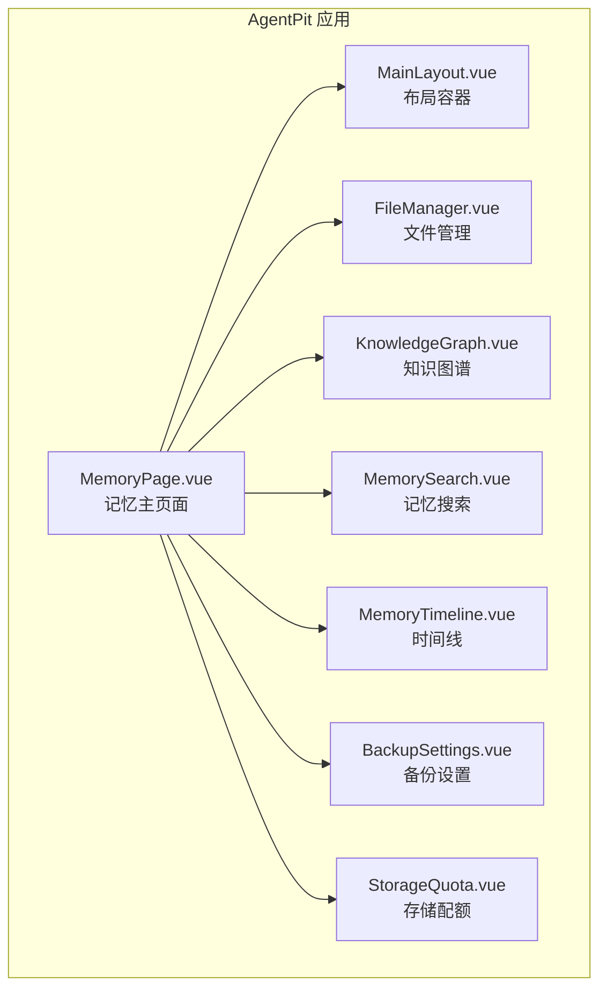
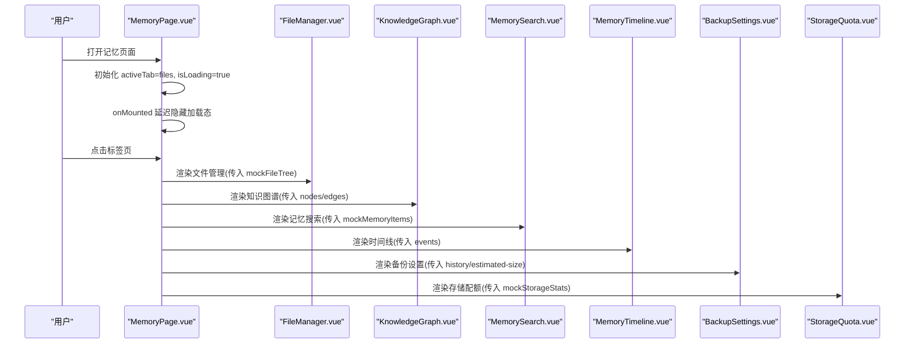
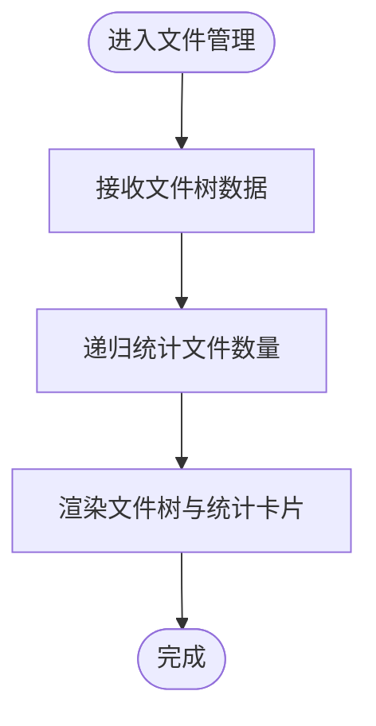
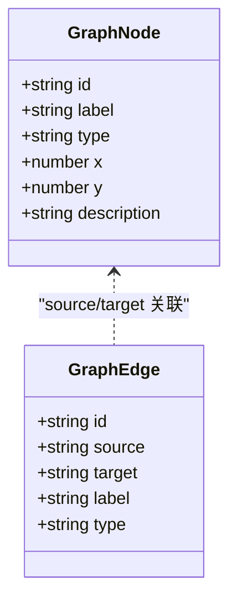
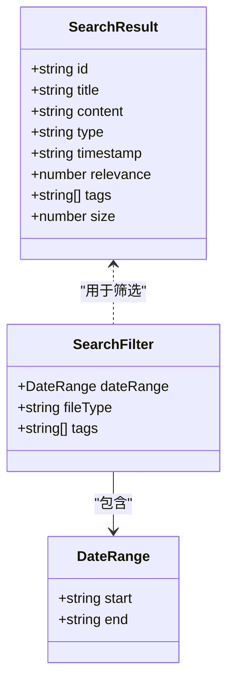
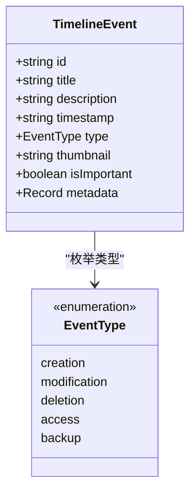
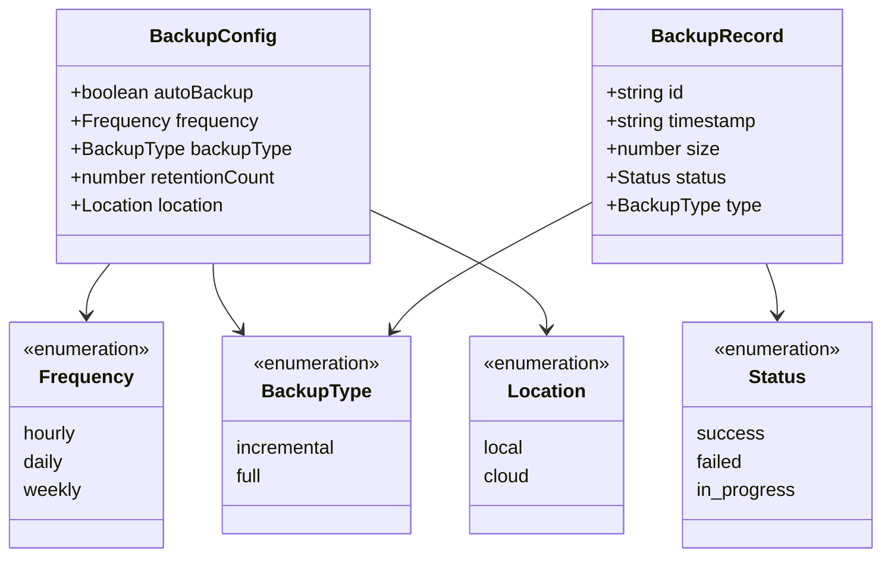
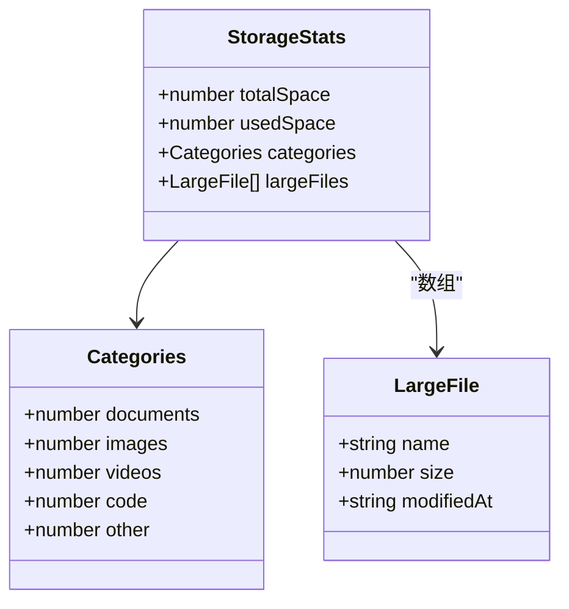
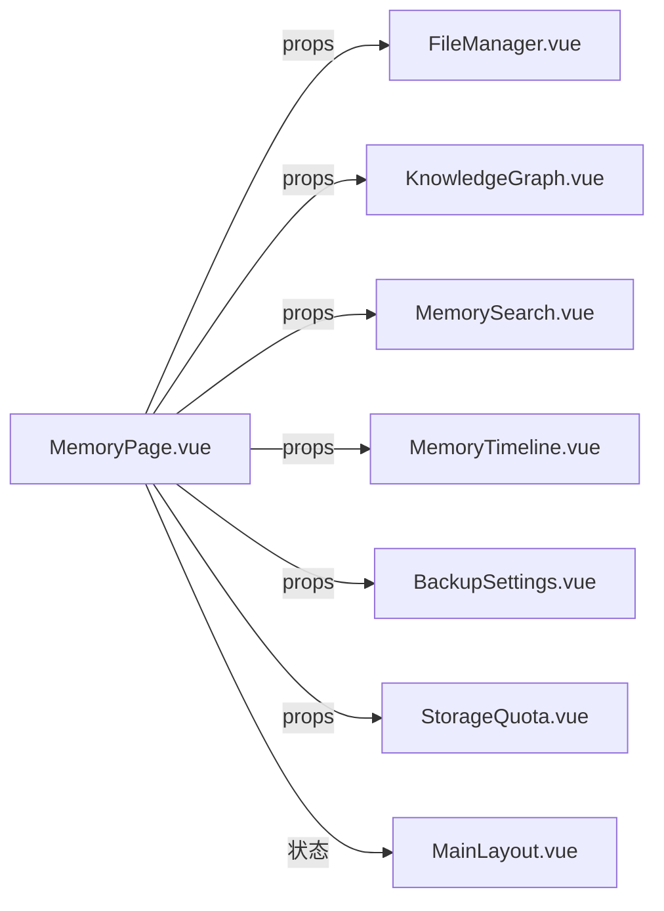

# 记忆系统

<cite>
**本文引用的文件**
- [MemoryPage.vue](file://apps/AgentPit/src/views/MemoryPage.vue)
- [memory.ts](file://apps/AgentPit/src/types/memory.ts)
- [MemoryComponents.spec.ts](file://apps/AgentPit/src/__tests__/components/memory/MemoryComponents.spec.ts)
- [Sidebar.spec.ts](file://apps/AgentPit/src/__tests__/components/layout/Sidebar.spec.ts)
- [package.json](file://apps/AgentPit/package.json)
</cite>

## 目录
1. [简介](#简介)
2. [项目结构](#项目结构)
3. [核心组件](#核心组件)
4. [架构总览](#架构总览)
5. [详细组件分析](#详细组件分析)
6. [依赖分析](#依赖分析)
7. [性能考虑](#性能考虑)
8. [故障排除指南](#故障排除指南)
9. [结论](#结论)
10. [附录](#附录)

## 简介
本文件面向AgentPit的记忆系统，系统性梳理文件管理、知识图谱、记忆搜索、时间线、备份设置、存储配额等子功能的实现细节、调用关系、接口与使用模式，并结合实际代码路径进行说明。文档兼顾初学者易懂与资深开发者所需的技术深度，提供可视化图表、配置项说明、常见问题与解决方案。

## 项目结构
记忆系统的前端页面位于AgentPit应用的视图层，采用Vue 3 + TypeScript开发，通过路由导航到记忆页面，页面内以标签页形式组织多个子功能模块。类型定义集中在统一的类型文件中，测试覆盖了组件行为与数据结构。

**图表来源**
- [MemoryPage.vue:1-280](file://apps/AgentPit/src/views/MemoryPage.vue#L1-L280)

**章节来源**
- [MemoryPage.vue:1-280](file://apps/AgentPit/src/views/MemoryPage.vue#L1-L280)
- [package.json:1-74](file://apps/AgentPit/package.json#L1-L74)

## 核心组件
- 文件管理：以树形结构展示文件与文件夹，支持统计总文件数、上下文菜单操作等。
- 知识图谱：以节点与边的形式呈现概念、实体、事件等知识关系。
- 记忆搜索：基于标题、内容、标签、时间戳等维度进行检索，返回相关度排序结果。
- 时间线：按时间顺序展示创建、修改、删除、访问、备份等事件。
- 备份设置：配置自动备份开关、频率、增量/全量、保留份数与备份位置。
- 存储配额：展示总空间、已用空间、分类用量、大文件列表等统计信息。

**章节来源**
- [MemoryPage.vue:19-53](file://apps/AgentPit/src/views/MemoryPage.vue#L19-L53)
- [MemoryPage.vue:175-229](file://apps/AgentPit/src/views/MemoryPage.vue#L175-L229)

## 架构总览
记忆页面作为入口，负责：
- 状态管理：当前激活标签页、加载状态
- 数据聚合：计算统计指标（总文件数、知识节点数、搜索次数、存储使用率）
- 子组件调度：根据标签页切换渲染对应子组件
- Mock数据注入：向各子组件传递模拟数据

**图表来源**
- [MemoryPage.vue:19-53](file://apps/AgentPit/src/views/MemoryPage.vue#L19-L53)
- [MemoryPage.vue:175-229](file://apps/AgentPit/src/views/MemoryPage.vue#L175-L229)

## 详细组件分析

### 文件管理（FileManager）
职责
- 展示文件树结构，支持递归统计文件数量
- 提供上下文菜单动作（重命名、复制、移动、下载、删除、属性）

接口与数据流
- 输入：文件树节点数组（mockFileTree）
- 计算：countFiles 递归遍历统计文件数
- 输出：渲染文件树与统计卡片

**图表来源**
- [MemoryPage.vue:40-47](file://apps/AgentPit/src/views/MemoryPage.vue#L40-L47)

**章节来源**
- [MemoryPage.vue:40-47](file://apps/AgentPit/src/views/MemoryPage.vue#L40-L47)

### 知识图谱（KnowledgeGraph）
职责
- 可视化知识节点与边的关系
- 支持节点类型（概念、实体、事件、文档、人物、地点）与边类型（关联、包含、创建者、地点、引用、归属）

接口与数据流
- 输入：nodes（GraphNodes）、edges（GraphEdges）
- 输出：图谱渲染与交互

**图表来源**
- [memory.ts:12-27](file://apps/AgentPit/src/types/memory.ts#L12-L27)

**章节来源**
- [memory.ts:12-27](file://apps/AgentPit/src/types/memory.ts#L12-L27)

### 记忆搜索（MemorySearch）
职责
- 对记忆条目进行检索，支持按日期范围、文件类型、标签过滤
- 返回带相关度评分的结果集

接口与数据流
- 输入：记忆条目数组（mockMemoryItems）
- 过滤：SearchFilter（日期范围、文件类型、标签）
- 输出：SearchResult 列表（含标题、内容、类型、时间戳、相关度、标签、可选大小）

**图表来源**
- [memory.ts:29-44](file://apps/AgentPit/src/types/memory.ts#L29-L44)

**章节来源**
- [memory.ts:29-44](file://apps/AgentPit/src/types/memory.ts#L29-L44)

### 时间线（MemoryTimeline）
职责
- 按时间顺序展示事件，支持重要事件标记与元数据扩展

接口与数据流
- 输入：事件数组（TimelineEvent），由记忆条目映射生成
- 输出：时间线渲染与交互

**图表来源**
- [memory.ts:46-55](file://apps/AgentPit/src/types/memory.ts#L46-L55)

**章节来源**
- [memory.ts:46-55](file://apps/AgentPit/src/types/memory.ts#L46-L55)

### 备份设置（BackupSettings）
职责
- 配置自动备份策略与保留策略，展示备份历史

接口与数据流
- 输入：备份历史（BackupRecord[]）、估算备份大小
- 输出：备份配置界面与历史列表

**图表来源**
- [memory.ts:57-71](file://apps/AgentPit/src/types/memory.ts#L57-L71)

**章节来源**
- [memory.ts:57-71](file://apps/AgentPit/src/types/memory.ts#L57-L71)

### 存储配额（StorageQuota）
职责
- 展示总空间、已用空间、各类别用量、大文件列表

接口与数据流
- 输入：StorageStats
- 输出：配额卡片与详情列表

**图表来源**
- [memory.ts:73-88](file://apps/AgentPit/src/types/memory.ts#L73-L88)

**章节来源**
- [memory.ts:73-88](file://apps/AgentPit/src/types/memory.ts#L73-L88)

## 依赖分析
- 组件耦合
  - MemoryPage.vue 作为父容器，耦合度低，仅负责状态与数据传递
  - 各子组件独立性强，通过 props 接收数据，便于替换与扩展
- 外部依赖
  - Vue 3 生态（组合式API、响应式、生命周期）
  - Pinia（状态管理，持久化插件）
  - 路由（页面导航）
  - 测试框架（Vitest + Vue Test Utils）

**图表来源**
- [MemoryPage.vue:175-229](file://apps/AgentPit/src/views/MemoryPage.vue#L175-L229)

**章节来源**
- [package.json:20-40](file://apps/AgentPit/package.json#L20-L40)
- [MemoryPage.vue:175-229](file://apps/AgentPit/src/views/MemoryPage.vue#L175-L229)

## 性能考虑
- KeepAlive缓存：MemoryPage.vue 使用 KeepAlive 对六个标签页组件进行缓存，减少重复渲染与初始化成本。
- 懒加载与延迟：onMounted 中设置短暂延时隐藏加载态，改善首屏体验。
- 递归统计：countFiles 采用递归遍历，注意大数据量时的栈深与性能，必要时可改为迭代或分页。
- 图谱渲染：节点与边数量增长时，建议采用虚拟化或采样策略降低渲染压力。
- 搜索过滤：在大量记忆条目场景下，建议引入索引与分页，避免全量扫描。

**章节来源**
- [MemoryPage.vue:175-229](file://apps/AgentPit/src/views/MemoryPage.vue#L175-L229)
- [MemoryPage.vue:49-53](file://apps/AgentPit/src/views/MemoryPage.vue#L49-L53)
- [MemoryPage.vue:40-47](file://apps/AgentPit/src/views/MemoryPage.vue#L40-L47)

## 故障排除指南
- 标签页不显示内容
  - 检查 activeTab 是否正确切换，确认子组件是否被 KeepAlive 缓存
  - 参考：[MemoryPage.vue:175-229](file://apps/AgentPit/src/views/MemoryPage.vue#L175-L229)
- 文件统计异常
  - 确认 countFiles 的递归逻辑与 mockFileTree 结构一致
  - 参考：[MemoryPage.vue:40-47](file://apps/AgentPit/src/views/MemoryPage.vue#L40-L47)
- 搜索无结果
  - 检查 SearchFilter 参数（日期范围、文件类型、标签）是否与 mockMemoryItems 匹配
  - 参考：[memory.ts:40-44](file://apps/AgentPit/src/types/memory.ts#L40-L44)
- 备份历史为空
  - 确认传入的 backup history 数据是否正确，以及估算大小计算逻辑
  - 参考：[MemoryPage.vue:213-219](file://apps/AgentPit/src/views/MemoryPage.vue#L213-L219)
- 存储配额显示异常
  - 检查 totalSpace/usedSpace 与 categories 字段是否完整
  - 参考：[memory.ts:73-88](file://apps/AgentPit/src/types/memory.ts#L73-L88)

**章节来源**
- [MemoryPage.vue:175-229](file://apps/AgentPit/src/views/MemoryPage.vue#L175-L229)
- [MemoryPage.vue:40-47](file://apps/AgentPit/src/views/MemoryPage.vue#L40-L47)
- [memory.ts:40-44](file://apps/AgentPit/src/types/memory.ts#L40-L44)
- [MemoryPage.vue:213-219](file://apps/AgentPit/src/views/MemoryPage.vue#L213-L219)
- [memory.ts:73-88](file://apps/AgentPit/src/types/memory.ts#L73-L88)

## 结论
记忆系统通过统一的页面容器与清晰的类型定义，实现了文件管理、知识图谱、记忆搜索、时间线、备份设置与存储配额六大功能模块。其设计具备良好的可扩展性与可维护性，适合在后续接入真实后端服务与持久化存储。建议优先完善数据层与真实API对接，再逐步优化性能与交互体验。

## 附录

### 配置选项与参数清单
- 文件节点（FileNode）
  - id: string
  - name: string
  - type: 'file' | 'folder'
  - size?: number
  - modifiedAt?: string
  - children?: FileNode[]
- 上下文菜单动作（ContextMenuAction）
  - 'rename' | 'copy' | 'move' | 'download' | 'delete' | 'properties'
- 知识图谱节点（GraphNode）
  - id: string
  - label: string
  - type: 'concept' | 'entity' | 'event' | 'document' | 'person' | 'location'
  - x?: number
  - y?: number
  - description?: string
- 知识图谱边（GraphEdge）
  - id: string
  - source: string
  - target: string
  - label: string
  - type: 'related_to' | 'contains' | 'created_by' | 'located_at' | 'references' | 'belongs_to'
- 搜索结果（SearchResult）
  - id: string
  - title: string
  - content: string
  - type: string
  - timestamp: string
  - relevance: number
  - tags: string[]
  - size?: number
- 搜索过滤（SearchFilter）
  - dateRange?: { start: string; end: string }
  - fileType?: string
  - tags?: string[]
- 时间线事件（TimelineEvent）
  - id: string
  - title: string
  - description: string
  - timestamp: string
  - type: 'creation' | 'modification' | 'deletion' | 'access' | 'backup'
  - thumbnail?: string
  - isImportant?: boolean
  - metadata?: Record<string, unknown>
- 备份配置（BackupConfig）
  - autoBackup: boolean
  - frequency: 'hourly' | 'daily' | 'weekly'
  - backupType: 'incremental' | 'full'
  - retentionCount: number
  - location: 'local' | 'cloud'
- 备份记录（BackupRecord）
  - id: string
  - timestamp: string
  - size: number
  - status: 'success' | 'failed' | 'in_progress'
  - type: 'incremental' | 'full'
- 存储统计（StorageStats）
  - totalSpace: number
  - usedSpace: number
  - categories: { documents: number; images: number; videos: number; code: number; other: number }
  - largeFiles: { name: string; size: number; modifiedAt: string }[]

**章节来源**
- [memory.ts:1-89](file://apps/AgentPit/src/types/memory.ts#L1-L89)

### 使用模式与最佳实践
- 组件复用：将子组件抽象为通用模块，通过 props 传参，便于在其他页面复用
- 类型驱动：严格使用类型定义，确保数据结构一致性
- 性能优先：对大数据量场景采用分页、索引与虚拟化策略
- 可测试性：为每个子组件编写单元测试，覆盖主要分支与边界条件
- 可观测性：在关键流程埋点，记录用户行为与性能指标

**章节来源**
- [MemoryComponents.spec.ts:1-200](file://apps/AgentPit/src/__tests__/components/memory/MemoryComponents.spec.ts#L1-L200)
- [Sidebar.spec.ts:1-50](file://apps/AgentPit/src/__tests__/components/layout/Sidebar.spec.ts#L1-L50)