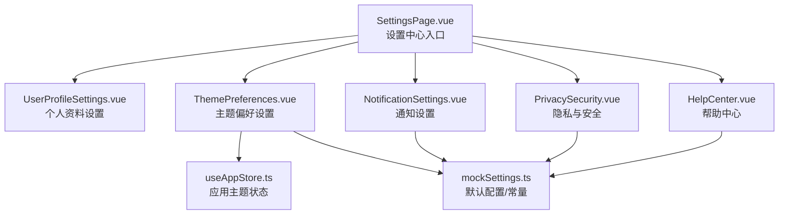
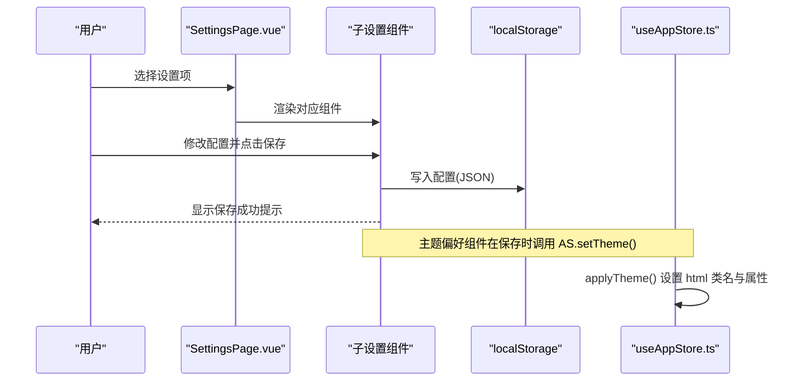
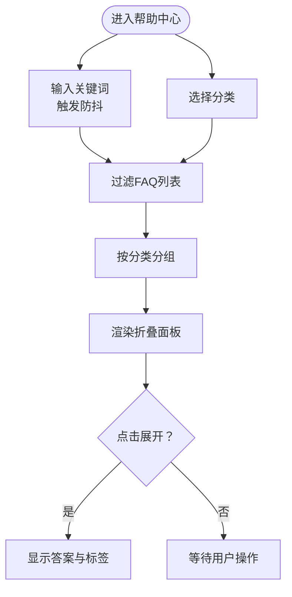
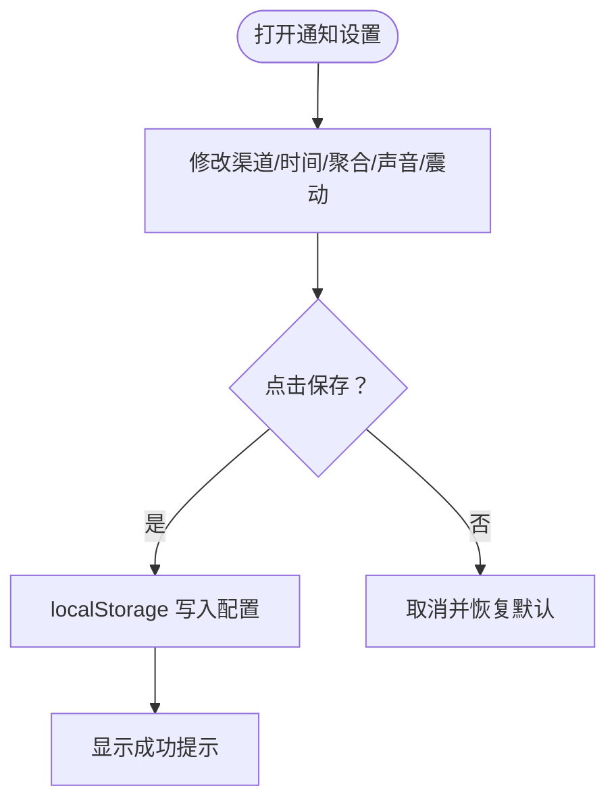
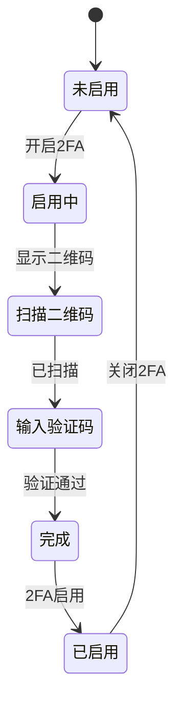
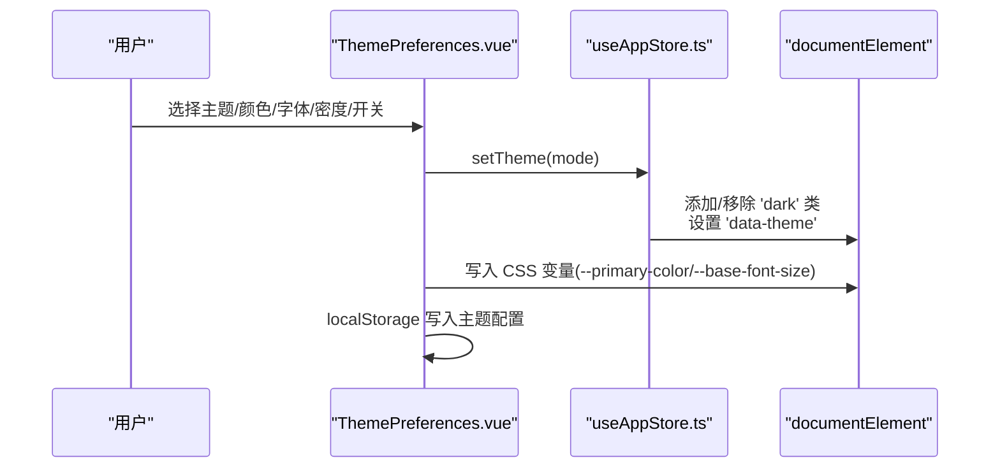
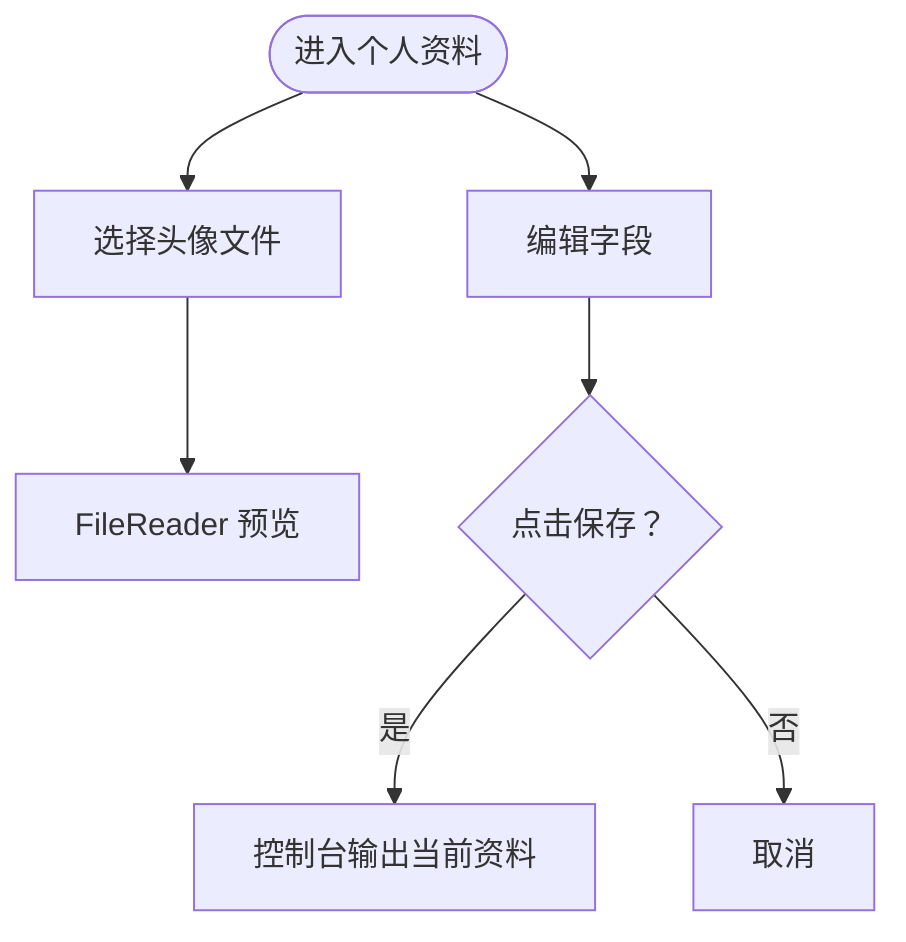
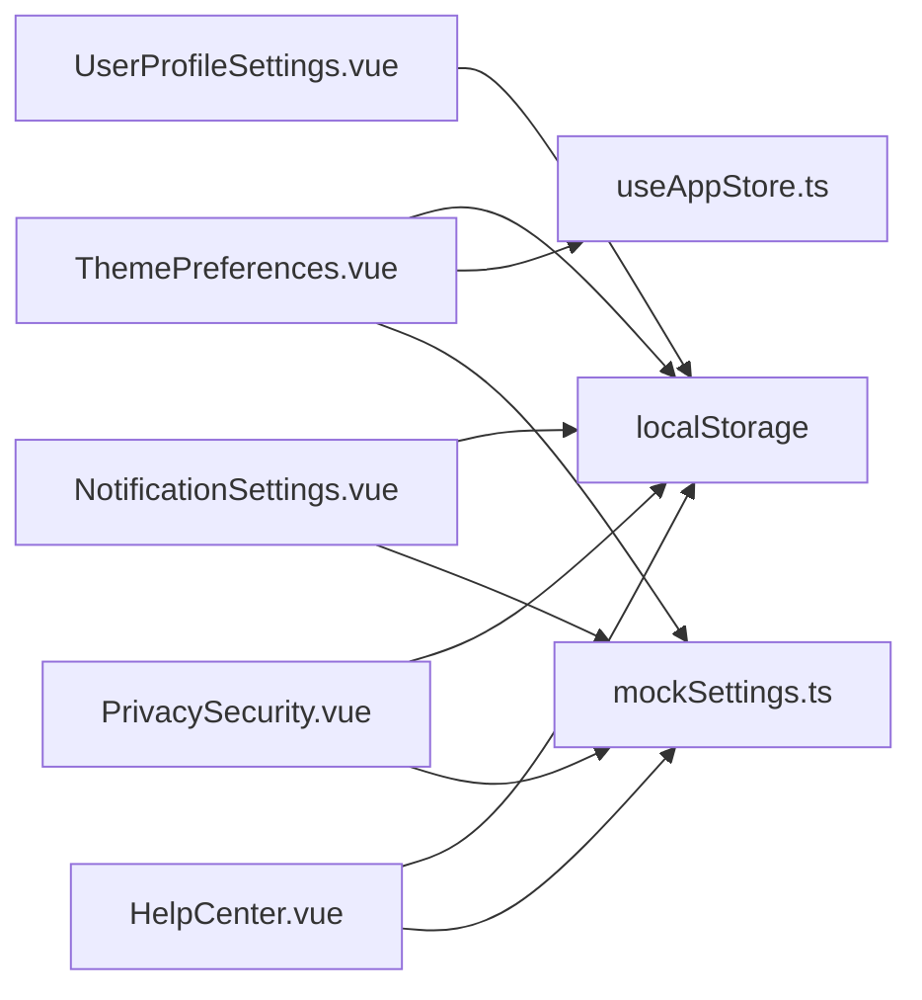

# 设置系统

<cite>
**本文引用的文件**
- [SettingsPage.vue](file://apps/AgentPit/src/views/SettingsPage.vue)
- [UserProfileSettings.vue](file://apps/AgentPit/src/components/settings/UserProfileSettings.vue)
- [ThemePreferences.vue](file://apps/AgentPit/src/components/settings/ThemePreferences.vue)
- [NotificationSettings.vue](file://apps/AgentPit/src/components/settings/NotificationSettings.vue)
- [PrivacySecurity.vue](file://apps/AgentPit/src/components/settings/PrivacySecurity.vue)
- [HelpCenter.vue](file://apps/AgentPit/src/components/settings/HelpCenter.vue)
- [mockSettings.ts](file://apps/AgentPit/src/data/mockSettings.ts)
- [useAppStore.ts](file://apps/AgentPit/src/stores/useAppStore.ts)
</cite>

## 目录
1. [引言](#引言)
2. [项目结构](#项目结构)
3. [核心组件](#核心组件)
4. [架构总览](#架构总览)
5. [详细组件分析](#详细组件分析)
6. [依赖分析](#依赖分析)
7. [性能考虑](#性能考虑)
8. [故障排除指南](#故障排除指南)
9. [结论](#结论)
10. [附录](#附录)

## 引言
本文件面向 AgentPit 的“设置系统”，系统性梳理并解释以下子功能的实现细节、调用关系、接口与使用模式：
- 帮助中心（FAQ 搜索、分类筛选、折叠面板）
- 通知设置（渠道开关、免打扰、聚合模式、提示音）
- 隐私与安全（修改密码、双因素认证、会话管理、数据导出与注销）
- 主题偏好（明暗模式、强调色、字体大小、布局密度、高对比度、动画）
- 用户资料设置（头像上传、字段编辑、保存）

文档同时给出配置项、参数与返回值说明，以及与应用状态管理、本地存储、UI 组件之间的关系，并提供常见问题与解决方案。

## 项目结构
设置系统由一个入口视图与多个设置子组件构成，配合数据层与状态管理共同完成配置持久化与主题应用。

图表来源
- [SettingsPage.vue:1-178](file://apps/AgentPit/src/views/SettingsPage.vue#L1-L178)
- [UserProfileSettings.vue:1-142](file://apps/AgentPit/src/components/settings/UserProfileSettings.vue#L1-L142)
- [ThemePreferences.vue:1-385](file://apps/AgentPit/src/components/settings/ThemePreferences.vue#L1-L385)
- [NotificationSettings.vue:1-329](file://apps/AgentPit/src/components/settings/NotificationSettings.vue#L1-L329)
- [PrivacySecurity.vue:1-580](file://apps/AgentPit/src/components/settings/PrivacySecurity.vue#L1-L580)
- [HelpCenter.vue:1-333](file://apps/AgentPit/src/components/settings/HelpCenter.vue#L1-L333)
- [mockSettings.ts:1-452](file://apps/AgentPit/src/data/mockSettings.ts#L1-L452)
- [useAppStore.ts:1-89](file://apps/AgentPit/src/stores/useAppStore.ts#L1-L89)

章节来源
- [SettingsPage.vue:1-178](file://apps/AgentPit/src/views/SettingsPage.vue#L1-L178)

## 核心组件
- 设置中心入口页负责路由式渲染各子设置组件，并提供面包屑与版本信息展示。
- 各子组件通过本地状态与本地存储完成配置持久化；主题偏好还与全局应用状态联动。

章节来源
- [SettingsPage.vue:1-178](file://apps/AgentPit/src/views/SettingsPage.vue#L1-L178)
- [UserProfileSettings.vue:1-142](file://apps/AgentPit/src/components/settings/UserProfileSettings.vue#L1-L142)
- [ThemePreferences.vue:1-385](file://apps/AgentPit/src/components/settings/ThemePreferences.vue#L1-L385)
- [NotificationSettings.vue:1-329](file://apps/AgentPit/src/components/settings/NotificationSettings.vue#L1-L329)
- [PrivacySecurity.vue:1-580](file://apps/AgentPit/src/components/settings/PrivacySecurity.vue#L1-L580)
- [HelpCenter.vue:1-333](file://apps/AgentPit/src/components/settings/HelpCenter.vue#L1-L333)

## 架构总览
设置系统的运行链路如下：
- 用户在设置中心选择某个设置项，对应组件被渲染。
- 子组件内部通过响应式状态管理配置项，保存时写入 localStorage 或 Pinia Store。
- 主题偏好组件通过 useAppStore 控制全局主题类名与 data-theme 属性，同时将配置写入 localStorage 供下次启动读取。

图表来源
- [SettingsPage.vue:1-178](file://apps/AgentPit/src/views/SettingsPage.vue#L1-L178)
- [ThemePreferences.vue:1-385](file://apps/AgentPit/src/components/settings/ThemePreferences.vue#L1-L385)
- [useAppStore.ts:1-89](file://apps/AgentPit/src/stores/useAppStore.ts#L1-L89)

## 详细组件分析

### 帮助中心（HelpCenter）
- 功能要点
  - 搜索：基于防抖的关键词检索，支持标题、内容与标签匹配。
  - 分类：按“快速入门/功能使用/计费与支付/安全与隐私/故障排除”分类过滤。
  - 展示：折叠面板逐条展开，支持 Markdown 简易渲染（加粗、换行、列表）。
  - 交互：展开/收起、分类切换、快捷键提示、联系客服入口。
- 关键数据
  - FAQ 列表、分类计数、版本信息。
- 性能与体验
  - 防抖降低频繁搜索带来的计算压力。
  - 分组渲染减少 DOM 重组成本。
- 常见问题
  - 搜索无结果：检查关键词拼写或切换分类。
  - 折叠面板不展开：确认点击的是按钮区域而非文本。

图表来源
- [HelpCenter.vue:1-333](file://apps/AgentPit/src/components/settings/HelpCenter.vue#L1-L333)
- [mockSettings.ts:198-439](file://apps/AgentPit/src/data/mockSettings.ts#L198-L439)

章节来源
- [HelpCenter.vue:1-333](file://apps/AgentPit/src/components/settings/HelpCenter.vue#L1-L333)
- [mockSettings.ts:198-439](file://apps/AgentPit/src/data/mockSettings.ts#L198-L439)

### 通知设置（NotificationSettings）
- 功能要点
  - 通知渠道矩阵：系统公告、智能体消息、社交互动、交易提醒、安全警报。
  - 渠道开关：浏览器推送、应用内、邮件、短信（部分类型支持）。
  - 免打扰：起止时间设置，显示当前时间段。
  - 聚合模式：即时推送、每小时摘要、每天摘要。
  - 提示音：多音效选择。
  - 震动：移动端震动反馈开关。
- 保存策略
  - 点击保存后写入 localStorage，显示短暂成功提示。
- 参数与返回
  - 无显式函数返回值；通过本地存储持久化配置。

图表来源
- [NotificationSettings.vue:1-329](file://apps/AgentPit/src/components/settings/NotificationSettings.vue#L1-L329)
- [mockSettings.ts:32-103](file://apps/AgentPit/src/data/mockSettings.ts#L32-L103)

章节来源
- [NotificationSettings.vue:1-329](file://apps/AgentPit/src/components/settings/NotificationSettings.vue#L1-L329)
- [mockSettings.ts:32-103](file://apps/AgentPit/src/data/mockSettings.ts#L32-L103)

### 隐私与安全（PrivacySecurity）
- 功能要点
  - 修改密码：当前密码、新密码、确认密码，密码强度指示与一致性校验。
  - 双因素认证（2FA）：TOTP 流程（二维码扫描 -> 验证码 -> 完成），生成/重新生成备用码。
  - 会话管理：列出设备（桌面/移动/平板），标记当前设备，强制下线非当前设备。
  - 数据与账户：导出个人数据（模拟）、注销账户（二次确认弹窗）。
- 参数与返回
  - 表单字段通过响应式对象管理；2FA 步骤通过内部状态机推进。
- 安全建议
  - 启用 2FA 并妥善保存备用码。
  - 定期检查登录设备，及时强制下线未知设备。

图表来源
- [PrivacySecurity.vue:1-580](file://apps/AgentPit/src/components/settings/PrivacySecurity.vue#L1-L580)
- [mockSettings.ts:41-57](file://apps/AgentPit/src/data/mockSettings.ts#L41-L57)

章节来源
- [PrivacySecurity.vue:1-580](file://apps/AgentPit/src/components/settings/PrivacySecurity.vue#L1-L580)
- [mockSettings.ts:41-57](file://apps/AgentPit/src/data/mockSettings.ts#L41-L57)

### 主题偏好（ThemePreferences）
- 功能要点
  - 主题模式：亮色、暗色、跟随系统；实时预览。
  - 强调色：预设颜色与自定义色相环；写入 CSS 变量 --primary-color。
  - 字体大小：小/中/大/特大；写入 CSS 变量 --base-font-size。
  - 布局密度：舒适/紧凑/极简；用于组件间距控制。
  - 开关：动画开关（减少动画）、高对比度模式。
  - 保存：写入 localStorage；提供重置默认。
- 与应用状态联动
  - 通过 useAppStore.setTheme() 应用主题并持久化；applyTheme() 设置 html 的类名与 data-theme。
- 参数与返回
  - 无显式返回值；通过 DOM 属性与 CSS 变量生效。

图表来源
- [ThemePreferences.vue:1-385](file://apps/AgentPit/src/components/settings/ThemePreferences.vue#L1-L385)
- [useAppStore.ts:1-89](file://apps/AgentPit/src/stores/useAppStore.ts#L1-L89)

章节来源
- [ThemePreferences.vue:1-385](file://apps/AgentPit/src/components/settings/ThemePreferences.vue#L1-L385)
- [useAppStore.ts:1-89](file://apps/AgentPit/src/stores/useAppStore.ts#L1-L89)

### 用户资料设置（UserProfileSettings）
- 功能要点
  - 头像上传：FileReader 预览，支持图片格式。
  - 个人资料表单：昵称、简介、邮箱、电话、所在地、个人网站等。
  - 保存：控制台输出当前资料（模拟保存）。
- 参数与返回
  - 无显式返回值；可通过扩展接入后端 API 完成真实保存。

图表来源
- [UserProfileSettings.vue:1-142](file://apps/AgentPit/src/components/settings/UserProfileSettings.vue#L1-L142)

章节来源
- [UserProfileSettings.vue:1-142](file://apps/AgentPit/src/components/settings/UserProfileSettings.vue#L1-L142)

## 依赖分析
- 组件耦合
  - SettingsPage.vue 作为容器，仅负责路由式渲染，低耦合。
  - ThemePreferences.vue 与 useAppStore.ts 存在直接依赖，用于主题应用。
  - 其余组件主要依赖 mockSettings.ts 中的默认配置与常量。
- 数据流
  - 本地存储：localStorage 用于持久化主题、通知、个人资料等配置。
  - 状态管理：Pinia useAppStore.ts 管理全局主题状态与应用行为。
- 外部依赖
  - Composition API（Vue 3）与 TypeScript。
  - TailwindCSS 样式体系。
  - 本地化（localStorage）与浏览器环境（FileReader、时间选择器）。

图表来源
- [ThemePreferences.vue:1-385](file://apps/AgentPit/src/components/settings/ThemePreferences.vue#L1-L385)
- [NotificationSettings.vue:1-329](file://apps/AgentPit/src/components/settings/NotificationSettings.vue#L1-L329)
- [PrivacySecurity.vue:1-580](file://apps/AgentPit/src/components/settings/PrivacySecurity.vue#L1-L580)
- [HelpCenter.vue:1-333](file://apps/AgentPit/src/components/settings/HelpCenter.vue#L1-L333)
- [mockSettings.ts:1-452](file://apps/AgentPit/src/data/mockSettings.ts#L1-L452)
- [useAppStore.ts:1-89](file://apps/AgentPit/src/stores/useAppStore.ts#L1-L89)

章节来源
- [mockSettings.ts:1-452](file://apps/AgentPit/src/data/mockSettings.ts#L1-L452)
- [useAppStore.ts:1-89](file://apps/AgentPit/src/stores/useAppStore.ts#L1-L89)

## 性能考虑
- 防抖搜索：HelpCenter 对搜索输入使用防抖，避免高频计算。
- 虚拟滚动/分页：若 FAQ 数据增长，可考虑分页或虚拟滚动以降低渲染压力。
- CSS 变量与类名切换：主题切换通过 CSS 变量与类名切换，避免重排风暴。
- 本地存储写入：批量变更后一次性写入 localStorage，减少 IO 次数。
- 图片上传：头像上传使用 FileReader，建议限制文件大小与格式，避免阻塞主线程。

## 故障排除指南
- 主题切换无效
  - 现象：切换主题后样式未变化。
  - 排查：确认浏览器允许 JavaScript；刷新页面（强制刷新）；检查是否处于“跟随系统”模式；确认 localStorage 中的主题配置。
  - 参考
    - [ThemePreferences.vue:31-53](file://apps/AgentPit/src/components/settings/ThemePreferences.vue#L31-L53)
    - [useAppStore.ts:60-72](file://apps/AgentPit/src/stores/useAppStore.ts#L60-L72)
- 通知未收到
  - 现象：开启渠道后仍无推送。
  - 排查：检查浏览器通知权限；确认免打扰时间段；核对聚合模式；刷新页面重新授权。
  - 参考
    - [NotificationSettings.vue:8-18](file://apps/AgentPit/src/components/settings/NotificationSettings.vue#L8-L18)
- 密码修改失败
  - 现象：点击修改无反应或提示不一致。
  - 排查：确认新密码与确认密码一致；满足长度与复杂度要求；当前密码必填。
  - 参考
    - [PrivacySecurity.vue:39-52](file://apps/AgentPit/src/components/settings/PrivacySecurity.vue#L39-L52)
- 2FA 启用卡住
  - 现象：TOTP 验证码输入后无法完成。
  - 排查：确保输入6位验证码；若失败可重新生成备用码；检查设备时间同步。
  - 参考
    - [PrivacySecurity.vue:65-71](file://apps/AgentPit/src/components/settings/PrivacySecurity.vue#L65-L71)
- 头像上传无预览
  - 现象：选择文件后无头像显示。
  - 排查：确认文件为图片格式；检查 FileReader 是否成功读取；刷新页面重试。
  - 参考
    - [UserProfileSettings.vue:16-25](file://apps/AgentPit/src/components/settings/UserProfileSettings.vue#L16-L25)

章节来源
- [ThemePreferences.vue:31-53](file://apps/AgentPit/src/components/settings/ThemePreferences.vue#L31-L53)
- [useAppStore.ts:60-72](file://apps/AgentPit/src/stores/useAppStore.ts#L60-L72)
- [NotificationSettings.vue:8-18](file://apps/AgentPit/src/components/settings/NotificationSettings.vue#L8-L18)
- [PrivacySecurity.vue:39-52](file://apps/AgentPit/src/components/settings/PrivacySecurity.vue#L39-L52)
- [PrivacySecurity.vue:65-71](file://apps/AgentPit/src/components/settings/PrivacySecurity.vue#L65-L71)
- [UserProfileSettings.vue:16-25](file://apps/AgentPit/src/components/settings/UserProfileSettings.vue#L16-L25)

## 结论
设置系统以“低耦合、高内聚”的组件化设计实现，结合本地存储与 Pinia 状态管理，提供了从主题到通知、从资料到隐私安全的完整配置能力。通过防抖搜索、CSS 变量与类名切换等手段，兼顾了性能与体验。后续可进一步引入后端 API、分页与虚拟滚动、更细粒度的权限控制与审计日志，以满足更高阶的业务需求。

## 附录

### 配置项与数据模型概览
- 用户资料（UserProfile）
  - 字段：昵称、实名、性别、生日、地点、邮箱、电话、简介、兴趣、头像、个人网站
  - 默认值：参考默认用户资料
- 主题设置（ThemeSettings）
  - 字段：主题模式、强调色、字体大小、布局密度、减少动画、高对比度
  - 默认值：系统默认主题设置
- 通知配置（NotificationConfig）
  - 字段：渠道矩阵、免打扰起止时间、聚合模式、提示音、震动
  - 默认值：系统默认通知配置
- 设备与2FA（SecuritySettings）
  - 字段：2FA 开关与方式、设备列表、备用码
  - 默认值：空设备列表与空备用码数组
- FAQ（FAQItem）
  - 字段：ID、分类、标题、内容、标签
  - 数据：内置 FAQ 列表

章节来源
- [mockSettings.ts:1-452](file://apps/AgentPit/src/data/mockSettings.ts#L1-L452)