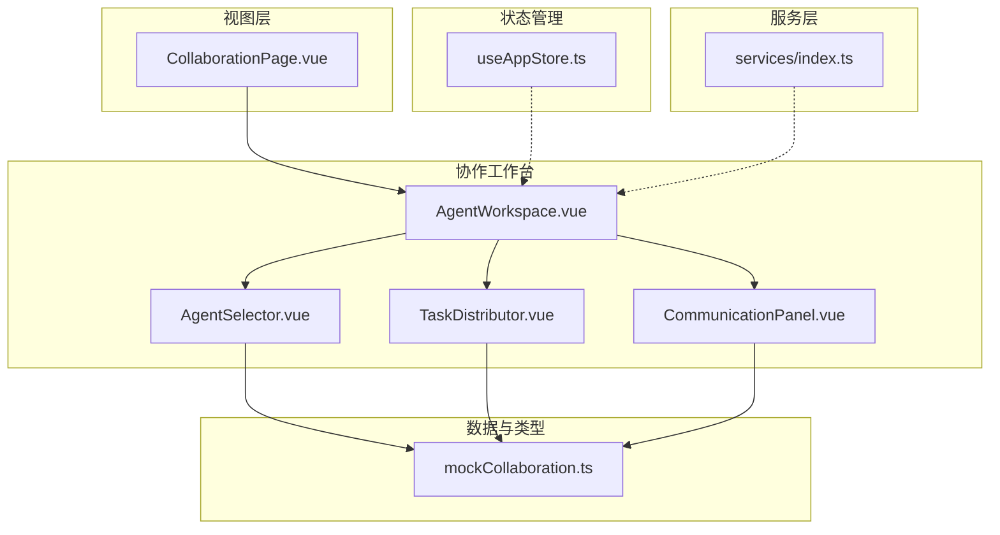
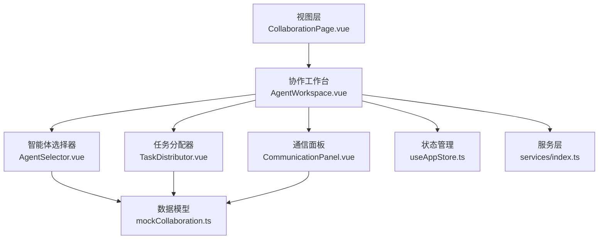
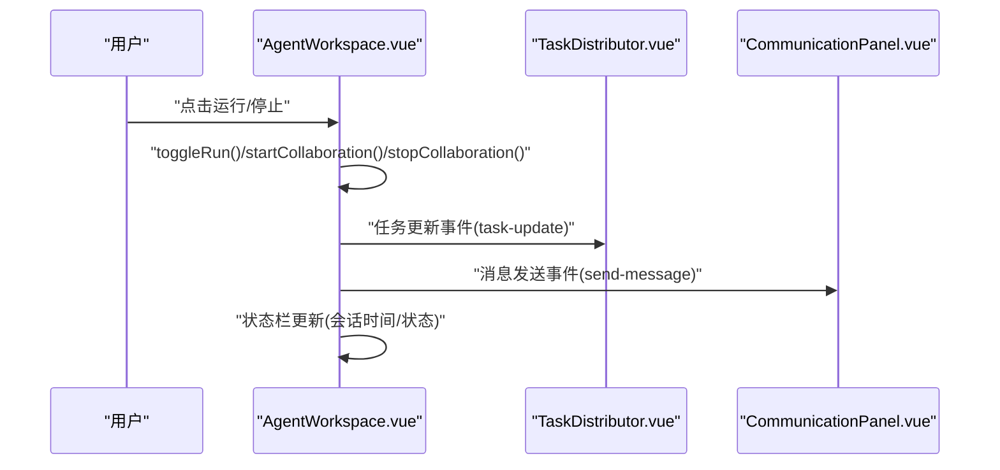
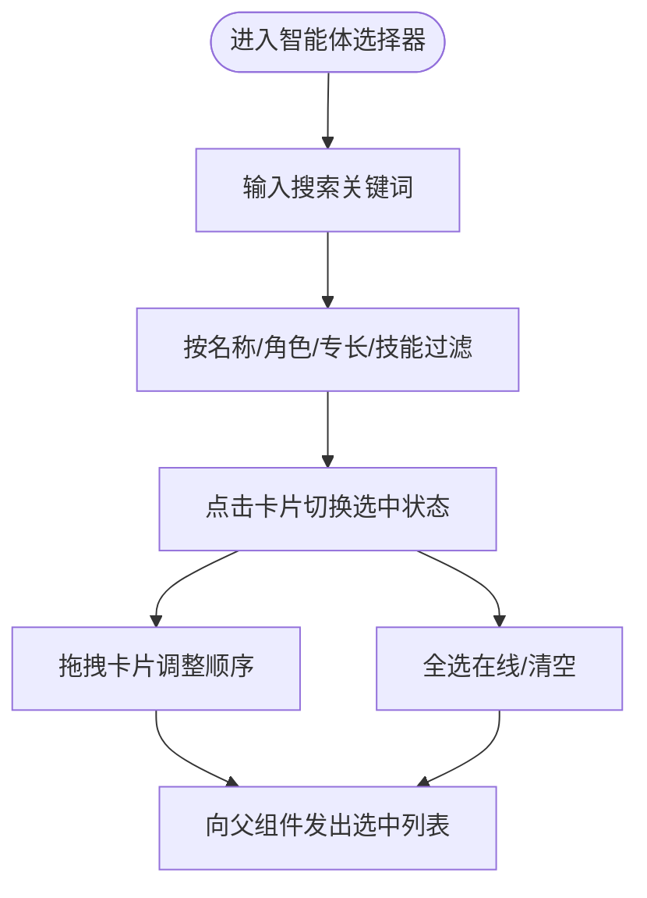
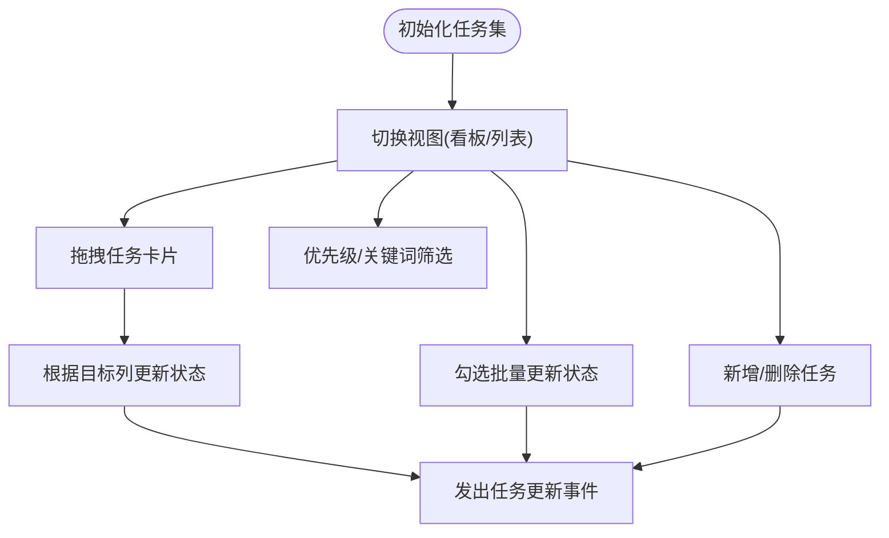
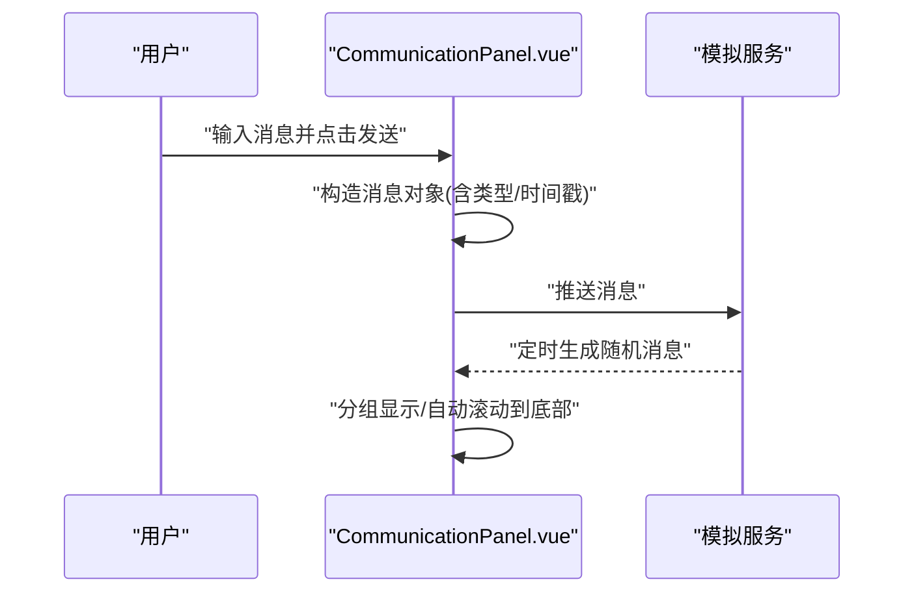
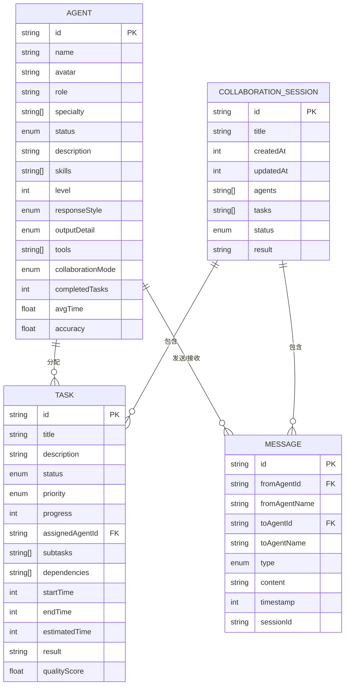
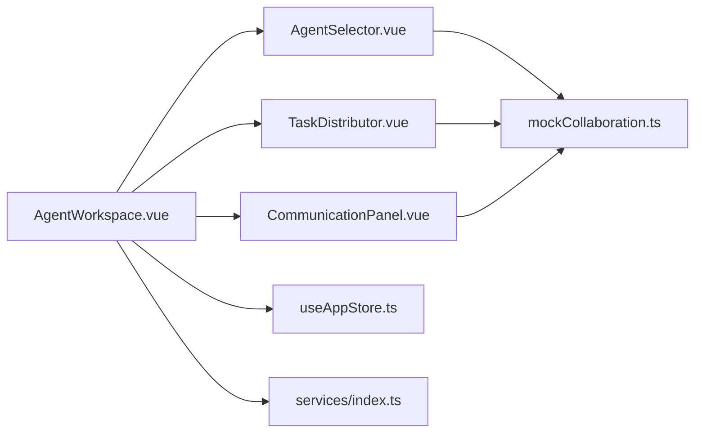

# 协作系统

<cite>
**本文档引用的文件**
- [CollaborationPage.vue](file://apps/AgentPit/src/views/CollaborationPage.vue)
- [AgentWorkspace.vue](file://apps/AgentPit/src/components/collaboration/AgentWorkspace.vue)
- [AgentSelector.vue](file://apps/AgentPit/src/components/collaboration/AgentSelector.vue)
- [TaskDistributor.vue](file://apps/AgentPit/src/components/collaboration/TaskDistributor.vue)
- [CommunicationPanel.vue](file://apps/AgentPit/src/components/collaboration/CommunicationPanel.vue)
- [mockCollaboration.ts](file://apps/AgentPit/src/data/mockCollaboration.ts)
- [useRealtimeData.ts](file://apps/AgentPit/src/composables/useRealtimeData.ts)
- [useAppStore.ts](file://apps/AgentPit/src/stores/useAppStore.ts)
- [index.ts](file://apps/AgentPit/src/services/index.ts)
</cite>

## 目录
1. [简介](#简介)
2. [项目结构](#项目结构)
3. [核心组件](#核心组件)
4. [架构总览](#架构总览)
5. [详细组件分析](#详细组件分析)
6. [依赖分析](#依赖分析)
7. [性能考虑](#性能考虑)
8. [故障排查指南](#故障排查指南)
9. [结论](#结论)
10. [附录](#附录)

## 简介
本文件为 AgentPit 协作系统的技术文档，聚焦于多智能体工作空间、任务分配器、通信面板与协作结果展示等核心功能模块。文档从系统架构、组件关系、数据流与处理逻辑、集成点、错误处理与性能特征等方面进行深入解析，并结合实际源码路径提供可追溯的“章节来源”与“图表来源”。同时，针对分布式任务调度、智能体间通信协议、协作状态同步与冲突解决机制提出实现建议与最佳实践，帮助在大规模协作场景下提升扩展性与实时通信质量。

## 项目结构
AgentPit 的协作系统以 Vue 3 + TypeScript 为核心，采用分层与按功能域组织的结构：
- 视图层：页面入口与布局容器，负责路由与页面装配
- 组件层：协作工作台及其子组件（智能体选择、任务分配、通信面板、结果展示）
- 数据层：类型定义与模拟数据，支撑前端演示与交互
- 状态层：Pinia Store 管理应用状态与主题持久化
- 服务层：统一导出 API 与工具服务，便于扩展接入真实后端

**图表来源**
- [CollaborationPage.vue:1-13](file://apps/AgentPit/src/views/CollaborationPage.vue#L1-L13)
- [AgentWorkspace.vue:1-354](file://apps/AgentPit/src/components/collaboration/AgentWorkspace.vue#L1-L354)
- [AgentSelector.vue:1-230](file://apps/AgentPit/src/components/collaboration/AgentSelector.vue#L1-L230)
- [TaskDistributor.vue:1-601](file://apps/AgentPit/src/components/collaboration/TaskDistributor.vue#L1-L601)
- [CommunicationPanel.vue:1-415](file://apps/AgentPit/src/components/collaboration/CommunicationPanel.vue#L1-L415)
- [mockCollaboration.ts:1-331](file://apps/AgentPit/src/data/mockCollaboration.ts#L1-L331)
- [useAppStore.ts:1-89](file://apps/AgentPit/src/stores/useAppStore.ts#L1-L89)
- [index.ts:1-10](file://apps/AgentPit/src/services/index.ts#L1-L10)

**章节来源**
- [CollaborationPage.vue:1-13](file://apps/AgentPit/src/views/CollaborationPage.vue#L1-L13)
- [AgentWorkspace.vue:1-354](file://apps/AgentPit/src/components/collaboration/AgentWorkspace.vue#L1-L354)
- [AgentSelector.vue:1-230](file://apps/AgentPit/src/components/collaboration/AgentSelector.vue#L1-L230)
- [TaskDistributor.vue:1-601](file://apps/AgentPit/src/components/collaboration/TaskDistributor.vue#L1-L601)
- [CommunicationPanel.vue:1-415](file://apps/AgentPit/src/components/collaboration/CommunicationPanel.vue#L1-L415)
- [mockCollaboration.ts:1-331](file://apps/AgentPit/src/data/mockCollaboration.ts#L1-L331)
- [useAppStore.ts:1-89](file://apps/AgentPit/src/stores/useAppStore.ts#L1-L89)
- [index.ts:1-10](file://apps/AgentPit/src/services/index.ts#L1-L10)

## 核心组件
- 多智能体工作台（AgentWorkspace）：作为协作主容器，协调智能体选择、任务分配、通信与结果展示，提供键盘快捷键与状态栏信息。
- 智能体选择器（AgentSelector）：支持搜索、批量选择、拖拽排序与配置触发。
- 任务分配器（TaskDistributor）：看板/列表双视图，支持拖拽变更任务状态、批量操作、优先级与筛选。
- 通信面板（CommunicationPanel）：模拟 WebSocket 连接与消息流，支持消息类型过滤、分组显示与发送。
- 数据模型与模拟数据（mockCollaboration）：定义 Agent、Task、Message、CollaborationSession 等类型及示例数据。
- 应用状态（useAppStore）：主题、侧边栏、页面与加载态管理，支持持久化。
- 实时数据组合式函数（useRealtimeData）：用于演示实时监控与告警（如余额波动）。

**章节来源**
- [AgentWorkspace.vue:1-354](file://apps/AgentPit/src/components/collaboration/AgentWorkspace.vue#L1-L354)
- [AgentSelector.vue:1-230](file://apps/AgentPit/src/components/collaboration/AgentSelector.vue#L1-L230)
- [TaskDistributor.vue:1-601](file://apps/AgentPit/src/components/collaboration/TaskDistributor.vue#L1-L601)
- [CommunicationPanel.vue:1-415](file://apps/AgentPit/src/components/collaboration/CommunicationPanel.vue#L1-L415)
- [mockCollaboration.ts:1-331](file://apps/AgentPit/src/data/mockCollaboration.ts#L1-L331)
- [useAppStore.ts:1-89](file://apps/AgentPit/src/stores/useAppStore.ts#L1-L89)
- [useRealtimeData.ts:1-117](file://apps/AgentPit/src/composables/useRealtimeData.ts#L1-L117)

## 架构总览
协作系统采用“视图-组件-数据-状态-服务”的分层架构：
- 视图层负责页面装配与路由
- 组件层承担业务交互与状态聚合
- 数据层提供类型与示例数据
- 状态层集中管理 UI 与应用行为状态
- 服务层统一导出 API 与工具，便于替换为真实后端

**图表来源**
- [CollaborationPage.vue:1-13](file://apps/AgentPit/src/views/CollaborationPage.vue#L1-L13)
- [AgentWorkspace.vue:1-354](file://apps/AgentPit/src/components/collaboration/AgentWorkspace.vue#L1-L354)
- [AgentSelector.vue:1-230](file://apps/AgentPit/src/components/collaboration/AgentSelector.vue#L1-L230)
- [TaskDistributor.vue:1-601](file://apps/AgentPit/src/components/collaboration/TaskDistributor.vue#L1-L601)
- [CommunicationPanel.vue:1-415](file://apps/AgentPit/src/components/collaboration/CommunicationPanel.vue#L1-L415)
- [mockCollaboration.ts:1-331](file://apps/AgentPit/src/data/mockCollaboration.ts#L1-L331)
- [useAppStore.ts:1-89](file://apps/AgentPit/src/stores/useAppStore.ts#L1-L89)
- [index.ts:1-10](file://apps/AgentPit/src/services/index.ts#L1-L10)

## 详细组件分析

### 多智能体工作台（AgentWorkspace）
- 职责：协调三个区域（左侧智能体选择、中间任务分配与通信、右侧配置/结果），提供运行/停止、新建会话、快捷键与状态栏。
- 关键交互：键盘事件绑定、运行状态切换、会话时间计算、右侧面板切换。
- 扩展点：事件透传（任务更新、消息发送）、自动切换到结果面板、会话标识与状态持久化。

**图表来源**
- [AgentWorkspace.vue:50-86](file://apps/AgentPit/src/components/collaboration/AgentWorkspace.vue#L50-L86)
- [AgentWorkspace.vue:108-118](file://apps/AgentPit/src/components/collaboration/AgentWorkspace.vue#L108-L118)
- [TaskDistributor.vue:10-14](file://apps/AgentPit/src/components/collaboration/TaskDistributor.vue#L10-L14)
- [CommunicationPanel.vue:6-8](file://apps/AgentPit/src/components/collaboration/CommunicationPanel.vue#L6-L8)

**章节来源**
- [AgentWorkspace.vue:1-354](file://apps/AgentPit/src/components/collaboration/AgentWorkspace.vue#L1-L354)

### 智能体选择器（AgentSelector）
- 职责：提供智能体搜索、批量选择、全选在线、清空、拖拽排序与配置触发。
- 关键逻辑：过滤算法、拖拽事件处理、选中集合维护、初始化预选。
- 交互细节：搜索关键词匹配名称/角色/专长/技能；拖拽改变选中顺序。

**图表来源**
- [AgentSelector.vue:23-72](file://apps/AgentPit/src/components/collaboration/AgentSelector.vue#L23-L72)
- [AgentSelector.vue:74-113](file://apps/AgentPit/src/components/collaboration/AgentSelector.vue#L74-L113)

**章节来源**
- [AgentSelector.vue:1-230](file://apps/AgentPit/src/components/collaboration/AgentSelector.vue#L1-L230)

### 任务分配器（TaskDistributor）
- 职责：看板与列表双视图，支持拖拽变更任务状态、批量操作、优先级筛选、搜索与统计。
- 关键逻辑：列状态映射、拖拽状态变更、批量更新、新增/删除任务、统计指标。
- 交互细节：拖拽到不同列改变任务状态；列表模式支持勾选批量更新。

**图表来源**
- [TaskDistributor.vue:24-56](file://apps/AgentPit/src/components/collaboration/TaskDistributor.vue#L24-L56)
- [TaskDistributor.vue:91-132](file://apps/AgentPit/src/components/collaboration/TaskDistributor.vue#L91-L132)
- [TaskDistributor.vue:143-161](file://apps/AgentPit/src/components/collaboration/TaskDistributor.vue#L143-L161)
- [TaskDistributor.vue:163-183](file://apps/AgentPit/src/components/collaboration/TaskDistributor.vue#L163-L183)

**章节来源**
- [TaskDistributor.vue:1-601](file://apps/AgentPit/src/components/collaboration/TaskDistributor.vue#L1-L601)

### 通信面板（CommunicationPanel）
- 职责：模拟 WebSocket 连接与消息流，支持消息类型过滤、分组显示、发送消息与自动滚动。
- 关键逻辑：消息分组（按日期）、消息类型样式与图标、定时模拟消息、发送消息并触发回执。
- 交互细节：选择接收者、输入框回车发送、清空消息记录。

**图表来源**
- [CommunicationPanel.vue:173-202](file://apps/AgentPit/src/components/collaboration/CommunicationPanel.vue#L173-L202)
- [CommunicationPanel.vue:40-92](file://apps/AgentPit/src/components/collaboration/CommunicationPanel.vue#L40-L92)
- [CommunicationPanel.vue:216-231](file://apps/AgentPit/src/components/collaboration/CommunicationPanel.vue#L216-L231)

**章节来源**
- [CommunicationPanel.vue:1-415](file://apps/AgentPit/src/components/collaboration/CommunicationPanel.vue#L1-L415)

### 数据模型与模拟数据（mockCollaboration）
- 职责：定义 Agent、Task、Message、CollaborationSession、CollaborationResult 等类型与示例数据。
- 关键点：任务优先级、状态机、依赖关系、推荐智能体映射、消息类型与会话关联。

**图表来源**
- [mockCollaboration.ts:1-76](file://apps/AgentPit/src/data/mockCollaboration.ts#L1-L76)
- [mockCollaboration.ts:268-284](file://apps/AgentPit/src/data/mockCollaboration.ts#L268-L284)

**章节来源**
- [mockCollaboration.ts:1-331](file://apps/AgentPit/src/data/mockCollaboration.ts#L1-L331)

### 应用状态（useAppStore）
- 职责：管理侧边栏开关、移动端侧边栏、主题（亮/暗/系统）、加载态与当前页面，支持主题持久化。
- 关键点：主题切换与 DOM 属性设置、状态持久化键值。

**章节来源**
- [useAppStore.ts:1-89](file://apps/AgentPit/src/stores/useAppStore.ts#L1-L89)

### 实时数据组合式函数（useRealtimeData）
- 职责：演示实时监控与告警（如余额波动），支持阈值检测、通知队列与自动移除。
- 关键点：定时器管理、通知入队与去重、阈值告警策略。

**章节来源**
- [useRealtimeData.ts:1-117](file://apps/AgentPit/src/composables/useRealtimeData.ts#L1-L117)

## 依赖分析
- 组件耦合：AgentWorkspace 作为协调者，向下依赖 AgentSelector、TaskDistributor、CommunicationPanel；向上通过事件与状态管理解耦。
- 数据依赖：各组件通过 mockCollaboration.ts 的类型与示例数据进行渲染与交互。
- 状态依赖：useAppStore 提供全局主题与布局状态；服务层统一导出 API，便于替换为真实后端。

**图表来源**
- [AgentWorkspace.vue:1-354](file://apps/AgentPit/src/components/collaboration/AgentWorkspace.vue#L1-L354)
- [AgentSelector.vue:1-230](file://apps/AgentPit/src/components/collaboration/AgentSelector.vue#L1-L230)
- [TaskDistributor.vue:1-601](file://apps/AgentPit/src/components/collaboration/TaskDistributor.vue#L1-L601)
- [CommunicationPanel.vue:1-415](file://apps/AgentPit/src/components/collaboration/CommunicationPanel.vue#L1-L415)
- [mockCollaboration.ts:1-331](file://apps/AgentPit/src/data/mockCollaboration.ts#L1-L331)
- [useAppStore.ts:1-89](file://apps/AgentPit/src/stores/useAppStore.ts#L1-L89)
- [index.ts:1-10](file://apps/AgentPit/src/services/index.ts#L1-L10)

**章节来源**
- [AgentWorkspace.vue:1-354](file://apps/AgentPit/src/components/collaboration/AgentWorkspace.vue#L1-L354)
- [index.ts:1-10](file://apps/AgentPit/src/services/index.ts#L1-L10)

## 性能考虑
- 渲染优化
  - 使用虚拟滚动或分页处理大量任务与消息列表，避免一次性渲染过多节点。
  - 对高频更新的状态使用防抖/节流（如搜索、滚动、窗口尺寸变化）。
- 计算优化
  - 任务与消息的过滤/分组在计算属性中缓存，减少重复计算。
  - 优先级与状态映射使用常量配置，避免运行时拼装。
- 通信优化
  - 通信面板模拟消息采用定时器与条件触发，避免频繁渲染；可引入消息池与增量更新。
  - 主题切换与 DOM 类名操作仅在必要时执行，避免主线程阻塞。
- 存储与持久化
  - Pinia 持久化仅保留必要字段（如主题、侧边栏），减少存储开销。
- 扩展性建议
  - 将 mock 数据替换为真实 API，使用 SSE/WebSocket 实现实时订阅。
  - 引入任务队列与工作窃取策略，支持跨节点的任务调度与负载均衡。
  - 在通信协议中加入消息去重、序列号与确认机制，确保有序与可靠传输。

[本节为通用指导，不直接分析具体文件，故无“章节来源”]

## 故障排查指南
- 通信面板无法显示消息
  - 检查模拟连接状态与定时器是否正常启动。
  - 确认消息过滤条件与分组逻辑未误判。
- 任务状态无法拖拽变更
  - 检查拖拽事件绑定与列目标区是否正确。
  - 确认任务状态枚举与列 ID 匹配。
- 主题切换无效
  - 检查主题持久化与 DOM 属性设置逻辑。
  - 确认系统主题监听与手动切换分支均覆盖。
- 实时数据告警不生效
  - 检查阈值配置与通知入队逻辑。
  - 确认定时器清理与组件卸载钩子。

**章节来源**
- [CommunicationPanel.vue:19-38](file://apps/AgentPit/src/components/collaboration/CommunicationPanel.vue#L19-L38)
- [TaskDistributor.vue:91-132](file://apps/AgentPit/src/components/collaboration/TaskDistributor.vue#L91-L132)
- [useAppStore.ts:49-72](file://apps/AgentPit/src/stores/useAppStore.ts#L49-L72)
- [useRealtimeData.ts:74-106](file://apps/AgentPit/src/composables/useRealtimeData.ts#L74-L106)

## 结论
AgentPit 协作系统以清晰的组件边界与数据契约实现了多智能体工作空间的核心能力：智能体选择、任务分配、通信与结果展示。通过 mock 数据与组合式函数，系统具备良好的可扩展性与可测试性。建议在后续版本中对接真实后端与实时通信协议，完善分布式任务调度与协作状态同步机制，以满足大规模协作场景下的性能与可靠性要求。

[本节为总结性内容，不直接分析具体文件，故无“章节来源”]

## 附录
- API 接口与权限管理
  - 当前服务层统一导出多个模块（聊天、货币化、Sphinx、首页），可用于扩展协作相关的 API。
  - 建议在真实后端中引入鉴权中间件与 RBAC 权限矩阵，对任务读写、消息可见性与会话访问进行细粒度控制。
- 协作状态同步与冲突解决
  - 引入 CRDT 或操作转换（OT）机制，保证多客户端并发编辑的一致性。
  - 在通信协议中增加冲突检测与仲裁规则（如优先级、时间戳、投票机制）。
- 性能优化与扩展性
  - 引入任务优先级队列与资源配额控制，避免热点资源争用。
  - 在通信层采用二进制协议与压缩策略，降低带宽占用。
  - 通过微服务拆分与事件驱动架构，支持水平扩展与弹性伸缩。

**章节来源**
- [index.ts:1-10](file://apps/AgentPit/src/services/index.ts#L1-L10)