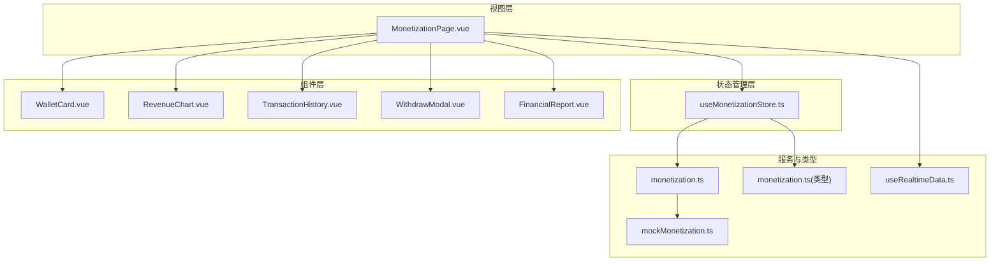
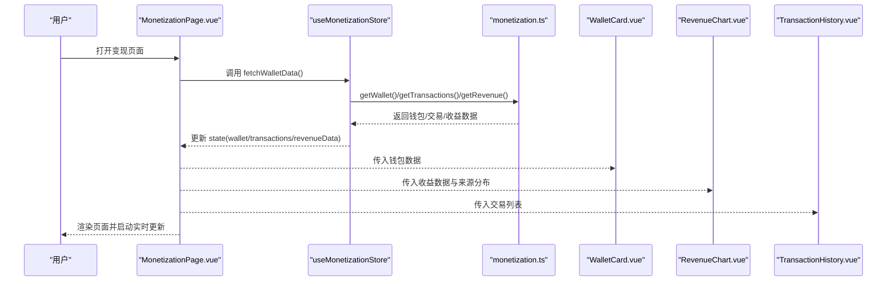
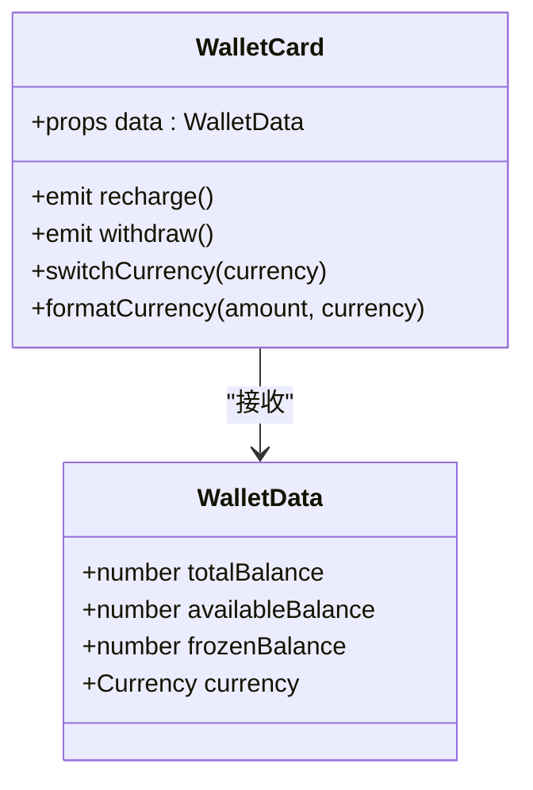
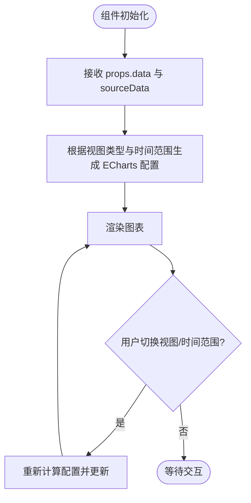
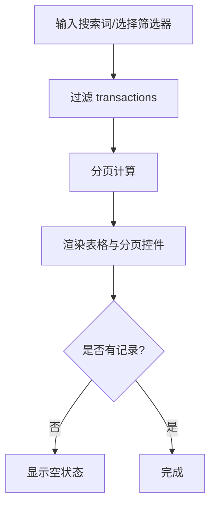
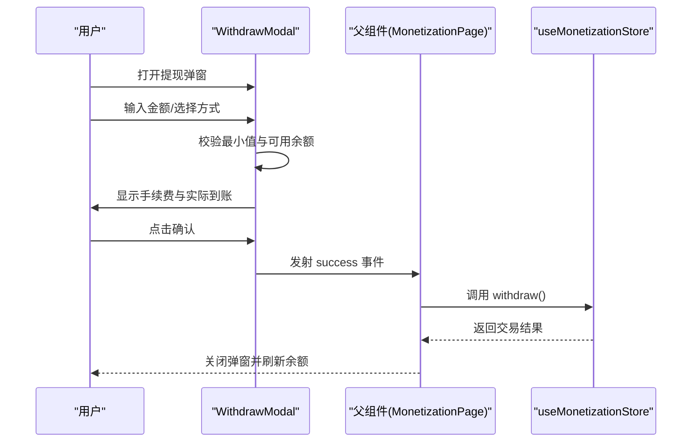
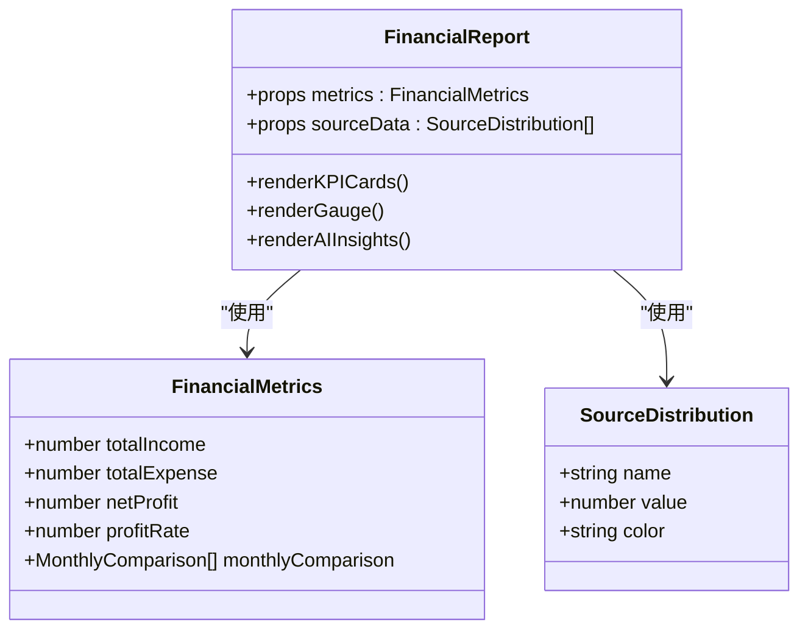
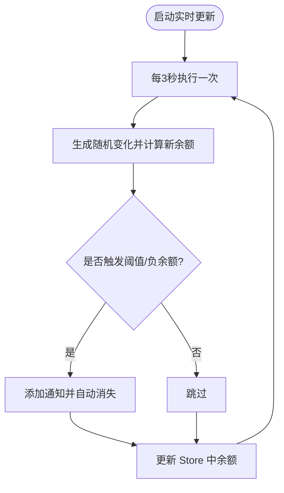
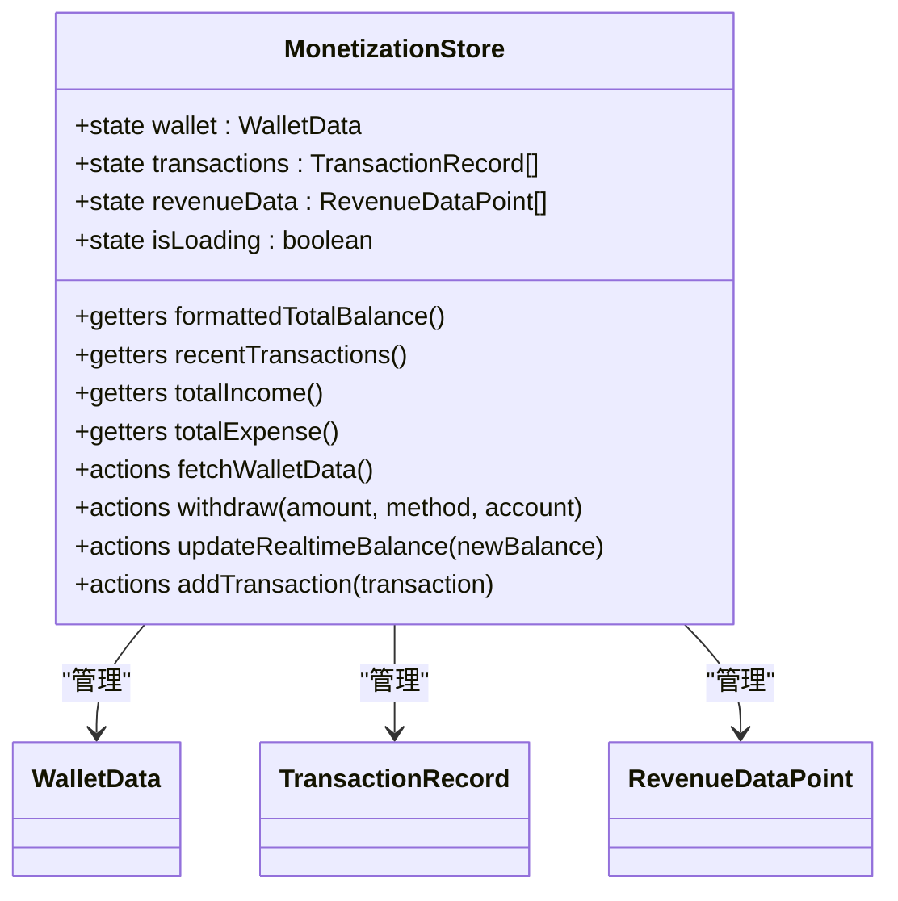
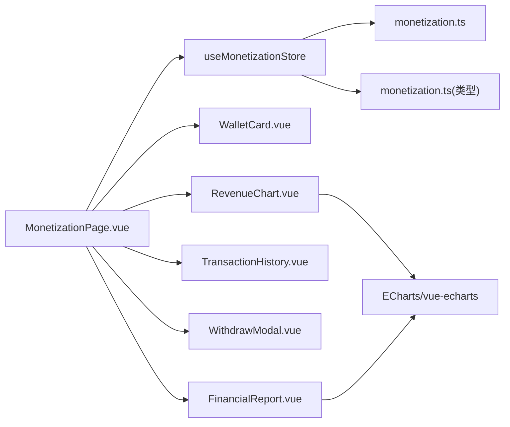

# 变现系统

<cite>
**本文引用的文件**
- [apps/AgentPit/src/stores/useMonetizationStore.ts](file://apps/AgentPit/src/stores/useMonetizationStore.ts)
- [apps/AgentPit/src/types/monetization.ts](file://apps/AgentPit/src/types/monetization.ts)
- [apps/AgentPit/src/data/mockMonetization.ts](file://apps/AgentPit/src/data/mockMonetization.ts)
- [apps/AgentPit/src/services/api/monetization.ts](file://apps/AgentPit/src/services/api/monetization.ts)
- [apps/AgentPit/src/views/MonetizationPage.vue](file://apps/AgentPit/src/views/MonetizationPage.vue)
- [apps/AgentPit/src/composables/useRealtimeData.ts](file://apps/AgentPit/src/composables/useRealtimeData.ts)
- [apps/AgentPit/src/components/monetization/WalletCard.vue](file://apps/AgentPit/src/components/monetization/WalletCard.vue)
- [apps/AgentPit/src/components/monetization/RevenueChart.vue](file://apps/AgentPit/src/components/monetization/RevenueChart.vue)
- [apps/AgentPit/src/components/monetization/TransactionHistory.vue](file://apps/AgentPit/src/components/monetization/TransactionHistory.vue)
- [apps/AgentPit/src/components/monetization/WithdrawModal.vue](file://apps/AgentPit/src/components/monetization/WithdrawModal.vue)
- [apps/AgentPit/src/components/monetization/FinancialReport.vue](file://apps/AgentPit/src/components/monetization/FinancialReport.vue)
</cite>

## 目录
1. [简介](#简介)
2. [项目结构](#项目结构)
3. [核心组件](#核心组件)
4. [架构总览](#架构总览)
5. [详细组件分析](#详细组件分析)
6. [依赖关系分析](#依赖关系分析)
7. [性能考量](#性能考量)
8. [故障排查指南](#故障排查指南)
9. [结论](#结论)
10. [附录](#附录)

## 简介
本文件为 AgentPit 变现系统的技术文档，聚焦于智能体收益管理、钱包系统、收入图表分析、交易历史记录等核心功能。文档涵盖状态管理、数据流、组件架构与 API 集成，并对钱包余额管理、收益计算算法、交易记录查询等关键接口进行说明。同时提供可扩展的集成指引、与外部支付系统的对接思路与安全注意事项，以及常见问题与性能优化策略。

## 项目结构
AgentPit 的变现系统采用前端单页应用架构，围绕 Pinia Store 管理全局状态，通过 Vue 组合式 API 与 ECharts 图表库构建可视化界面；服务层通过模拟 API 提供数据，便于开发与测试。

**图表来源**
- [apps/AgentPit/src/views/MonetizationPage.vue:1-92](file://apps/AgentPit/src/views/MonetizationPage.vue#L1-L92)
- [apps/AgentPit/src/stores/useMonetizationStore.ts:1-153](file://apps/AgentPit/src/stores/useMonetizationStore.ts#L1-L153)
- [apps/AgentPit/src/services/api/monetization.ts:1-59](file://apps/AgentPit/src/services/api/monetization.ts#L1-L59)
- [apps/AgentPit/src/data/mockMonetization.ts:1-145](file://apps/AgentPit/src/data/mockMonetization.ts#L1-L145)
- [apps/AgentPit/src/composables/useRealtimeData.ts:1-117](file://apps/AgentPit/src/composables/useRealtimeData.ts#L1-L117)
- [apps/AgentPit/src/types/monetization.ts:1-135](file://apps/AgentPit/src/types/monetization.ts#L1-L135)

**章节来源**
- [apps/AgentPit/src/views/MonetizationPage.vue:1-92](file://apps/AgentPit/src/views/MonetizationPage.vue#L1-L92)
- [apps/AgentPit/src/stores/useMonetizationStore.ts:1-153](file://apps/AgentPit/src/stores/useMonetizationStore.ts#L1-L153)
- [apps/AgentPit/src/services/api/monetization.ts:1-59](file://apps/AgentPit/src/services/api/monetization.ts#L1-L59)
- [apps/AgentPit/src/data/mockMonetization.ts:1-145](file://apps/AgentPit/src/data/mockMonetization.ts#L1-L145)
- [apps/AgentPit/src/composables/useRealtimeData.ts:1-117](file://apps/AgentPit/src/composables/useRealtimeData.ts#L1-L117)
- [apps/AgentPit/src/types/monetization.ts:1-135](file://apps/AgentPit/src/types/monetization.ts#L1-L135)

## 核心组件
- 钱包卡片组件：展示总余额、可用余额、冻结金额与货币切换，并触发充值/提现事件。
- 收益趋势图表：支持折线/柱状图与收入来源饼图，支持时间范围选择。
- 交易历史：支持筛选、分页、搜索与状态高亮显示。
- 提现弹窗：输入金额、选择提现方式、费用计算与二次确认流程。
- 财务报表：KPI 卡片、仪表盘与 AI 分析建议。
- 实时数据组合式函数：周期性模拟余额变化并生成通知。
- Pinia Store：统一管理钱包、交易、收益数据与加载状态，封装提现与余额更新逻辑。
- 类型定义：统一的钱包、交易、收益、财务指标与提现方法等类型。
- 模拟 API：提供钱包、交易、收益与提现的模拟接口。

**章节来源**
- [apps/AgentPit/src/components/monetization/WalletCard.vue:1-124](file://apps/AgentPit/src/components/monetization/WalletCard.vue#L1-L124)
- [apps/AgentPit/src/components/monetization/RevenueChart.vue:1-333](file://apps/AgentPit/src/components/monetization/RevenueChart.vue#L1-L333)
- [apps/AgentPit/src/components/monetization/TransactionHistory.vue:1-273](file://apps/AgentPit/src/components/monetization/TransactionHistory.vue#L1-L273)
- [apps/AgentPit/src/components/monetization/WithdrawModal.vue:1-261](file://apps/AgentPit/src/components/monetization/WithdrawModal.vue#L1-L261)
- [apps/AgentPit/src/components/monetization/FinancialReport.vue:1-208](file://apps/AgentPit/src/components/monetization/FinancialReport.vue#L1-L208)
- [apps/AgentPit/src/composables/useRealtimeData.ts:1-117](file://apps/AgentPit/src/composables/useRealtimeData.ts#L1-L117)
- [apps/AgentPit/src/stores/useMonetizationStore.ts:1-153](file://apps/AgentPit/src/stores/useMonetizationStore.ts#L1-L153)
- [apps/AgentPit/src/types/monetization.ts:1-135](file://apps/AgentPit/src/types/monetization.ts#L1-L135)
- [apps/AgentPit/src/services/api/monetization.ts:1-59](file://apps/AgentPit/src/services/api/monetization.ts#L1-L59)

## 架构总览
变现系统采用“视图-组件-状态-服务”分层架构：
- 视图层负责页面布局与交互编排。
- 组件层负责具体业务 UI 与用户交互。
- 状态管理层集中管理钱包、交易、收益与加载状态。
- 服务层提供数据获取与模拟接口，未来可替换为真实后端。

**图表来源**
- [apps/AgentPit/src/views/MonetizationPage.vue:18-21](file://apps/AgentPit/src/views/MonetizationPage.vue#L18-L21)
- [apps/AgentPit/src/stores/useMonetizationStore.ts:66-112](file://apps/AgentPit/src/stores/useMonetizationStore.ts#L66-L112)
- [apps/AgentPit/src/services/api/monetization.ts:3-34](file://apps/AgentPit/src/services/api/monetization.ts#L3-L34)

**章节来源**
- [apps/AgentPit/src/views/MonetizationPage.vue:1-92](file://apps/AgentPit/src/views/MonetizationPage.vue#L1-L92)
- [apps/AgentPit/src/stores/useMonetizationStore.ts:1-153](file://apps/AgentPit/src/stores/useMonetizationStore.ts#L1-L153)
- [apps/AgentPit/src/services/api/monetization.ts:1-59](file://apps/AgentPit/src/services/api/monetization.ts#L1-L59)

## 详细组件分析

### 钱包系统（WalletCard）
- 功能要点
  - 展示总余额、可用余额、冻结金额，支持货币切换。
  - 提供充值与提现事件发射，交由父组件处理。
- 数据与交互
  - 使用类型定义中的 WalletData 与 Currency。
  - 通过计算属性格式化金额，保持一致的本地化显示。
- 扩展建议
  - 增加“充值”按钮的回调处理，接入真实充值通道。
  - 支持多币种实时汇率换算与展示。

**图表来源**
- [apps/AgentPit/src/components/monetization/WalletCard.vue:1-124](file://apps/AgentPit/src/components/monetization/WalletCard.vue#L1-L124)
- [apps/AgentPit/src/types/monetization.ts:16-25](file://apps/AgentPit/src/types/monetization.ts#L16-L25)

**章节来源**
- [apps/AgentPit/src/components/monetization/WalletCard.vue:1-124](file://apps/AgentPit/src/components/monetization/WalletCard.vue#L1-L124)
- [apps/AgentPit/src/types/monetization.ts:6-25](file://apps/AgentPit/src/types/monetization.ts#L6-L25)

### 收益图表（RevenueChart）
- 功能要点
  - 折线/柱状图切换，支持 7/30/90/365 天时间范围。
  - 收入来源饼图与数值分布展示。
  - ECharts 配置化渲染，支持 Tooltip、Legend、Grid 等组件。
- 数据与交互
  - 接收 RevenueDataPoint 数组与 SourceDistribution 数组。
  - 通过计算属性动态生成折线/柱状/饼图配置。
- 扩展建议
  - 支持更多图表类型（面积图、堆叠柱状图）。
  - 增加导出图片与分享能力。

**图表来源**
- [apps/AgentPit/src/components/monetization/RevenueChart.vue:26-253](file://apps/AgentPit/src/components/monetization/RevenueChart.vue#L26-L253)

**章节来源**
- [apps/AgentPit/src/components/monetization/RevenueChart.vue:1-333](file://apps/AgentPit/src/components/monetization/RevenueChart.vue#L1-L333)

### 交易历史（TransactionHistory）
- 功能要点
  - 支持按类型与状态筛选、关键词搜索与分页。
  - 表格列包含交易 ID、描述、类型、金额、状态、时间。
  - 状态使用颜色标识，金额正负区分。
- 数据与交互
  - 通过计算属性过滤与分页，减少渲染压力。
  - 支持展开/折叠以节省空间。
- 扩展建议
  - 增加分页大小选择与排序。
  - 支持批量导出交易明细。

**图表来源**
- [apps/AgentPit/src/components/monetization/TransactionHistory.vue:43-62](file://apps/AgentPit/src/components/monetization/TransactionHistory.vue#L43-L62)

**章节来源**
- [apps/AgentPit/src/components/monetization/TransactionHistory.vue:1-273](file://apps/AgentPit/src/components/monetization/TransactionHistory.vue#L1-L273)

### 提现流程（WithdrawModal）
- 功能要点
  - 输入金额、选择提现方式（银行卡/支付宝/微信），计算手续费与实际到账。
  - 二次确认弹窗，展示手续费与到账金额。
  - 提交后模拟处理状态，完成后回调父组件。
- 业务规则
  - 最低提现额度与费率固定，金额需在可用余额范围内。
- 扩展建议
  - 加入风控校验（单日限额、频率限制）。
  - 支持多种提现方式与账户绑定。

**图表来源**
- [apps/AgentPit/src/components/monetization/WithdrawModal.vue:52-63](file://apps/AgentPit/src/components/monetization/WithdrawModal.vue#L52-L63)
- [apps/AgentPit/src/stores/useMonetizationStore.ts:114-142](file://apps/AgentPit/src/stores/useMonetizationStore.ts#L114-L142)

**章节来源**
- [apps/AgentPit/src/components/monetization/WithdrawModal.vue:1-261](file://apps/AgentPit/src/components/monetization/WithdrawModal.vue#L1-L261)
- [apps/AgentPit/src/stores/useMonetizationStore.ts:114-142](file://apps/AgentPit/src/stores/useMonetizationStore.ts#L114-L142)

### 财务报表（FinancialReport）
- 功能要点
  - KPI 卡片：今日收益、本月收益、总资产、收益率。
  - 收益率仪表盘：彩色渐变指示器。
  - AI 智能分析：收益建议、风险提示、趋势预测。
- 数据与交互
  - 使用 FinancialMetrics 与 SourceDistribution 类型。
  - 通过 ECharts 渲染仪表盘与提示信息。
- 扩展建议
  - 增加更多 KPI 与对比维度（同比/环比）。
  - 支持自定义时间段与导出报告。

**图表来源**
- [apps/AgentPit/src/components/monetization/FinancialReport.vue:12-17](file://apps/AgentPit/src/components/monetization/FinancialReport.vue#L12-L17)
- [apps/AgentPit/src/types/monetization.ts:89-111](file://apps/AgentPit/src/types/monetization.ts#L89-L111)
- [apps/AgentPit/src/types/monetization.ts:79-87](file://apps/AgentPit/src/types/monetization.ts#L79-L87)

**章节来源**
- [apps/AgentPit/src/components/monetization/FinancialReport.vue:1-208](file://apps/AgentPit/src/components/monetization/FinancialReport.vue#L1-L208)
- [apps/AgentPit/src/types/monetization.ts:79-111](file://apps/AgentPit/src/types/monetization.ts#L79-L111)

### 实时数据与通知（useRealtimeData）
- 功能要点
  - 每 3 秒随机扰动余额，模拟实时波动。
  - 超阈值与负余额触发通知，支持自动消失。
  - 生命周期内自动清理定时器。
- 扩展建议
  - 支持 SSE 或 WebSocket 接入真实推送。
  - 增加通知去重与静默时段设置。

**图表来源**
- [apps/AgentPit/src/composables/useRealtimeData.ts:74-81](file://apps/AgentPit/src/composables/useRealtimeData.ts#L74-L81)

**章节来源**
- [apps/AgentPit/src/composables/useRealtimeData.ts:1-117](file://apps/AgentPit/src/composables/useRealtimeData.ts#L1-L117)

### Pinia Store（useMonetizationStore）
- 状态与数据
  - wallet、transactions、revenueData、isLoading。
  - getters：格式化余额、最近交易、收入/支出统计。
  - actions：拉取钱包/交易/收益数据、提现、更新实时余额、追加交易。
- 扩展建议
  - 增加分页加载与缓存策略。
  - 支持多账户/多币种聚合视图。

**图表来源**
- [apps/AgentPit/src/stores/useMonetizationStore.ts:13-151](file://apps/AgentPit/src/stores/useMonetizationStore.ts#L13-L151)
- [apps/AgentPit/src/types/monetization.ts:16-55](file://apps/AgentPit/src/types/monetization.ts#L16-L55)

**章节来源**
- [apps/AgentPit/src/stores/useMonetizationStore.ts:1-153](file://apps/AgentPit/src/stores/useMonetizationStore.ts#L1-L153)
- [apps/AgentPit/src/types/monetization.ts:1-135](file://apps/AgentPit/src/types/monetization.ts#L1-L135)

### 类型与模拟数据
- 类型定义
  - Currency、TransactionType、TransactionStatus、WalletData、RevenueDataPoint、TransactionRecord、SourceDistribution、FinancialMetrics、MonthlyComparison、WithdrawRequest、WithdrawMethod、WalletActionType。
- 模拟数据
  - 钱包、收益、交易历史、收入来源分布与财务指标的模拟数据，便于开发与演示。

**章节来源**
- [apps/AgentPit/src/types/monetization.ts:1-135](file://apps/AgentPit/src/types/monetization.ts#L1-L135)
- [apps/AgentPit/src/data/mockMonetization.ts:1-145](file://apps/AgentPit/src/data/mockMonetization.ts#L1-L145)

### API 集成（模拟）
- 接口定义
  - getWallet：返回余额与币种。
  - getTransactions：返回交易列表（含 id、amount、type、description、timestamp、status）。
  - getRevenue：返回 30 天收益数组。
  - withdraw：提交提现请求，返回模拟交易结果。
- 扩展建议
  - 替换为真实后端接口，增加鉴权与错误处理。
  - 支持分页与条件筛选的交易查询。

**章节来源**
- [apps/AgentPit/src/services/api/monetization.ts:3-58](file://apps/AgentPit/src/services/api/monetization.ts#L3-L58)

## 依赖关系分析
- 组件依赖
  - MonetizationPage.vue 依赖 WalletCard、RevenueChart、TransactionHistory、WithdrawModal、FinancialReport。
  - Store 依赖 API 与类型定义。
  - 图表组件依赖 ECharts 与 vue-echarts。
- 数据流向
  - 页面挂载后调用 Store 的 fetchWalletData，Store 通过 API 获取数据并更新状态。
  - 实时数据组合式函数周期性更新余额并触发通知。
- 外部依赖
  - ECharts：图表渲染。
  - vue-echarts：Vue 封装的 ECharts 组件。

**图表来源**
- [apps/AgentPit/src/views/MonetizationPage.vue:1-92](file://apps/AgentPit/src/views/MonetizationPage.vue#L1-L92)
- [apps/AgentPit/src/stores/useMonetizationStore.ts:1-153](file://apps/AgentPit/src/stores/useMonetizationStore.ts#L1-L153)
- [apps/AgentPit/src/services/api/monetization.ts:1-59](file://apps/AgentPit/src/services/api/monetization.ts#L1-L59)
- [apps/AgentPit/src/components/monetization/RevenueChart.vue:1-333](file://apps/AgentPit/src/components/monetization/RevenueChart.vue#L1-L333)
- [apps/AgentPit/src/components/monetization/FinancialReport.vue:1-208](file://apps/AgentPit/src/components/monetization/FinancialReport.vue#L1-L208)

**章节来源**
- [apps/AgentPit/src/views/MonetizationPage.vue:1-92](file://apps/AgentPit/src/views/MonetizationPage.vue#L1-L92)
- [apps/AgentPit/src/stores/useMonetizationStore.ts:1-153](file://apps/AgentPit/src/stores/useMonetizationStore.ts#L1-L153)
- [apps/AgentPit/src/services/api/monetization.ts:1-59](file://apps/AgentPit/src/services/api/monetization.ts#L1-L59)
- [apps/AgentPit/src/components/monetization/RevenueChart.vue:1-333](file://apps/AgentPit/src/components/monetization/RevenueChart.vue#L1-L333)
- [apps/AgentPit/src/components/monetization/FinancialReport.vue:1-208](file://apps/AgentPit/src/components/monetization/FinancialReport.vue#L1-L208)

## 性能考量
- 渲染优化
  - 交易历史采用分页与计算属性过滤，避免全量渲染。
  - 图表使用计算属性生成配置，减少重复计算。
- 状态管理
  - Store 中仅保存必要字段，避免冗余数据。
  - 实时更新间隔可控，避免频繁重渲染。
- 数据获取
  - API 采用一次性批量拉取，减少多次请求。
  - 可引入缓存与节流策略，降低网络压力。
- 图表性能
  - 合理设置图表尺寸与自动适配，避免过度绘制。
  - 对大数据集可考虑采样或懒加载。

[本节为通用指导，无需列出具体文件来源]

## 故障排查指南
- 提现失败或异常
  - 检查提现金额是否低于最低额度或高于可用余额。
  - 确认提现方式与账户信息是否正确。
  - 查看 Store 中的错误日志与通知栏提示。
- 余额异常
  - 实时更新是否正常运行，是否存在负余额通知。
  - 检查 Store 中 updateRealtimeBalance 是否被正确调用。
- 图表不显示或异常
  - 确认 ECharts 初始化与依赖注入是否正确。
  - 检查传入数据格式是否符合 RevenueDataPoint/SourceDistribution。
- 交易历史为空
  - 确认 API 是否返回了交易数据。
  - 检查筛选条件与搜索关键词是否过于严格。

**章节来源**
- [apps/AgentPit/src/components/monetization/WithdrawModal.vue:36-38](file://apps/AgentPit/src/components/monetization/WithdrawModal.vue#L36-L38)
- [apps/AgentPit/src/composables/useRealtimeData.ts:40-46](file://apps/AgentPit/src/composables/useRealtimeData.ts#L40-L46)
- [apps/AgentPit/src/stores/useMonetizationStore.ts:114-142](file://apps/AgentPit/src/stores/useMonetizationStore.ts#L114-L142)

## 结论
AgentPit 变现系统通过清晰的分层架构与模块化组件，实现了钱包余额管理、收益可视化、交易历史与提现流程的完整闭环。Pinia Store 统一管理状态，ECharts 提供丰富的可视化能力，模拟 API 保障开发效率。后续可重点增强真实支付对接、风控与合规、多币种与多账户支持，以及性能与稳定性优化。

[本节为总结性内容，无需列出具体文件来源]

## 附录

### 关键接口与数据结构速览
- 钱包数据：WalletData（总余额、可用余额、冻结余额、币种）
- 交易记录：TransactionRecord（id、type、amount、status、timestamp、description、category）
- 收益数据：RevenueDataPoint（date、revenue、expenses、profit）
- 财务指标：FinancialMetrics（totalIncome、totalExpense、netProfit、profitRate、monthlyComparison）
- 提现请求：WithdrawRequest（amount、method、accountInfo、note）

**章节来源**
- [apps/AgentPit/src/types/monetization.ts:16-135](file://apps/AgentPit/src/types/monetization.ts#L16-L135)

### 集成与扩展指引
- 集成真实支付系统
  - 替换模拟 API 为真实后端接口，增加鉴权与加密传输。
  - 在 Store 的 withdraw 中接入真实支付网关回调与状态同步。
- 安全考虑
  - 对提现金额与方式做严格校验与风控。
  - 保护敏感数据（账户信息、交易凭证）存储与传输。
- 性能优化
  - 引入分页与懒加载，减少一次性渲染压力。
  - 对高频更新的数据进行去抖与节流处理。

[本节为通用指导，无需列出具体文件来源]