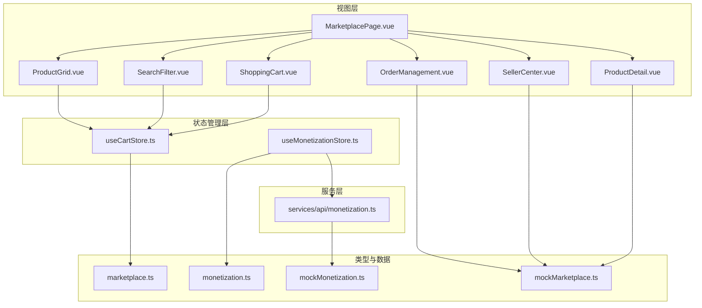
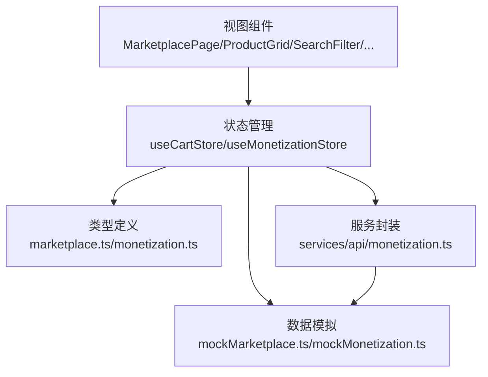
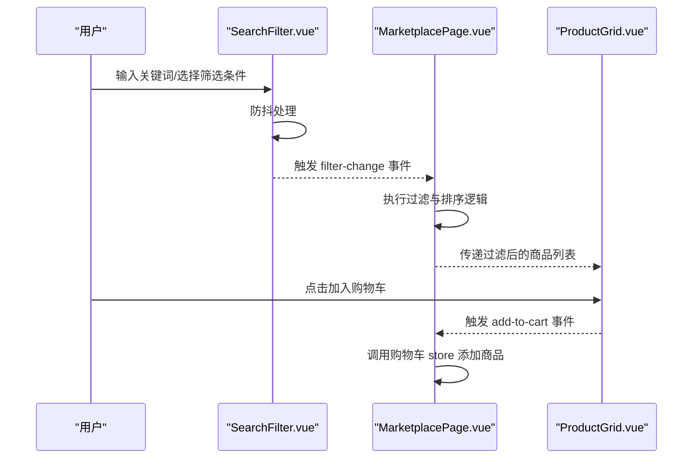
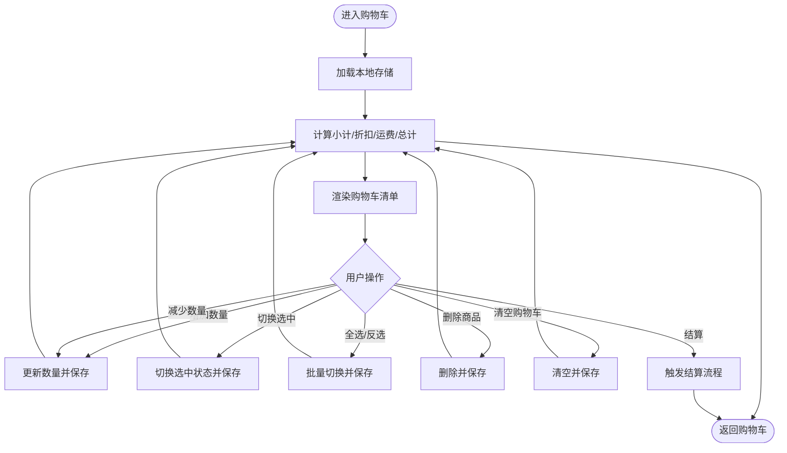
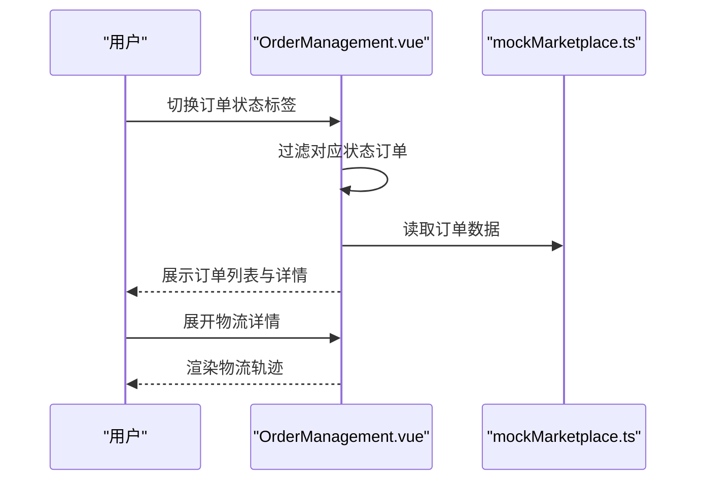
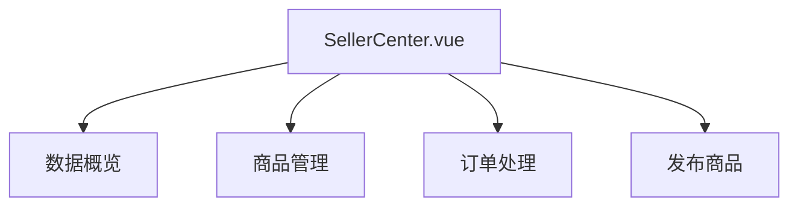
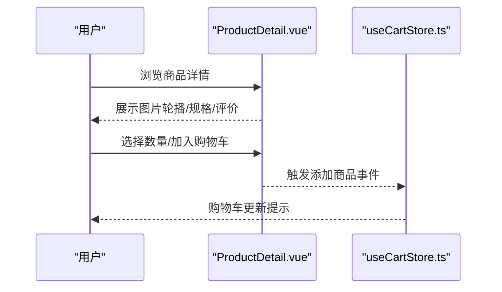
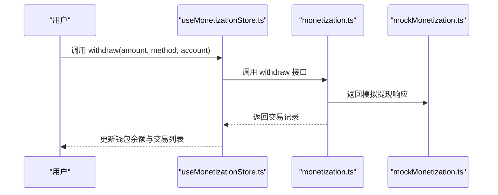
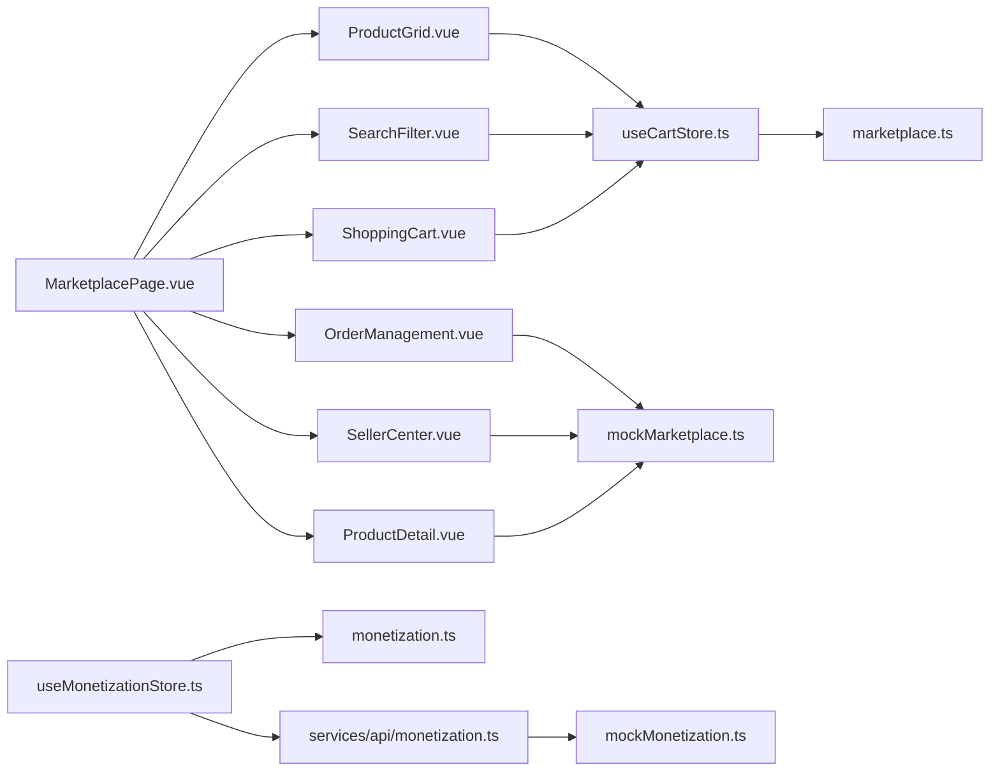

# 市场交易系统

<cite>
**本文档引用的文件**
- [MarketplacePage.vue](file://apps/AgentPit/src/views/MarketplacePage.vue)
- [ProductGrid.vue](file://apps/AgentPit/src/components/marketplace/ProductGrid.vue)
- [SearchFilter.vue](file://apps/AgentPit/src/components/marketplace/SearchFilter.vue)
- [ShoppingCart.vue](file://apps/AgentPit/src/components/marketplace/ShoppingCart.vue)
- [OrderManagement.vue](file://apps/AgentPit/src/components/marketplace/OrderManagement.vue)
- [SellerCenter.vue](file://apps/AgentPit/src/components/marketplace/SellerCenter.vue)
- [ProductDetail.vue](file://apps/AgentPit/src/components/marketplace/ProductDetail.vue)
- [useCartStore.ts](file://apps/AgentPit/src/stores/useCartStore.ts)
- [useMonetizationStore.ts](file://apps/AgentPit/src/stores/useMonetizationStore.ts)
- [marketplace.ts](file://apps/AgentPit/src/types/marketplace.ts)
- [monetization.ts](file://apps/AgentPit/src/types/monetization.ts)
- [mockMarketplace.ts](file://apps/AgentPit/src/data/mockMarketplace.ts)
- [mockMonetization.ts](file://apps/AgentPit/src/data/mockMonetization.ts)
- [monetization.ts](file://apps/AgentPit/src/services/api/monetization.ts)
- [useDebounce.ts](file://apps/AgentPit/src/composables/useDebounce.ts)
</cite>

## 目录
1. [引言](#引言)
2. [项目结构](#项目结构)
3. [核心组件](#核心组件)
4. [架构总览](#架构总览)
5. [详细组件分析](#详细组件分析)
6. [依赖关系分析](#依赖关系分析)
7. [性能考虑](#性能考虑)
8. [故障排除指南](#故障排除指南)
9. [结论](#结论)
10. [附录](#附录)

## 引言
本文件为 AgentPit 市场交易系统的深度技术文档，覆盖商品展示、搜索过滤、购物车管理、订单处理、评价系统、变现与支付、物流跟踪等核心功能模块。文档以代码级分析为基础，结合可视化图表与流程说明，帮助开发者快速理解系统架构与实现细节，并提供性能优化与高并发场景下的实践建议。

## 项目结构
AgentPit 采用前端单页应用架构，核心交易页面位于 Marketplace 页面，通过多个子组件协同完成商品浏览、筛选、购物车、订单管理与卖家中心功能；状态管理由 Pinia Store 提供，类型定义集中在 types 目录，数据模拟位于 data 目录，API 封装位于 services/api 目录。

**图表来源**
- [MarketplacePage.vue:1-221](file://apps/AgentPit/src/views/MarketplacePage.vue#L1-L221)
- [ProductGrid.vue:1-234](file://apps/AgentPit/src/components/marketplace/ProductGrid.vue#L1-L234)
- [SearchFilter.vue:1-580](file://apps/AgentPit/src/components/marketplace/SearchFilter.vue#L1-L580)
- [ShoppingCart.vue:1-305](file://apps/AgentPit/src/components/marketplace/ShoppingCart.vue#L1-L305)
- [OrderManagement.vue:1-389](file://apps/AgentPit/src/components/marketplace/OrderManagement.vue#L1-L389)
- [SellerCenter.vue:1-785](file://apps/AgentPit/src/components/marketplace/SellerCenter.vue#L1-L785)
- [ProductDetail.vue:1-536](file://apps/AgentPit/src/components/marketplace/ProductDetail.vue#L1-L536)
- [useCartStore.ts:1-138](file://apps/AgentPit/src/stores/useCartStore.ts#L1-L138)
- [useMonetizationStore.ts:1-153](file://apps/AgentPit/src/stores/useMonetizationStore.ts#L1-L153)
- [marketplace.ts:1-239](file://apps/AgentPit/src/types/marketplace.ts#L1-L239)
- [monetization.ts:1-135](file://apps/AgentPit/src/types/monetization.ts#L1-L135)
- [mockMarketplace.ts:1-248](file://apps/AgentPit/src/data/mockMarketplace.ts#L1-L248)
- [mockMonetization.ts:1-145](file://apps/AgentPit/src/data/mockMonetization.ts#L1-L145)
- [monetization.ts:1-59](file://apps/AgentPit/src/services/api/monetization.ts#L1-L59)

**章节来源**
- [MarketplacePage.vue:1-221](file://apps/AgentPit/src/views/MarketplacePage.vue#L1-L221)
- [marketplace.ts:1-239](file://apps/AgentPit/src/types/marketplace.ts#L1-L239)
- [monetization.ts:1-135](file://apps/AgentPit/src/types/monetization.ts#L1-L135)

## 核心组件
- 商品展示与筛选：MarketplacePage 作为入口，组合 SearchFilter 与 ProductGrid 完成搜索、分类、价格、评分、类型等多维筛选与排序。
- 购物车管理：ShoppingCart 展示购物车清单，useCartStore 提供本地持久化存储、选中状态、数量变更、小计与运费计算。
- 订单管理：OrderManagement 展示订单列表与详情，支持按状态筛选与展开查看物流信息。
- 卖家中心：SellerCenter 提供概览、商品管理、订单处理与发布商品表单。
- 产品详情：ProductDetail 展示商品详情、规格参数、评价系统与相关推荐。
- 变现与支付：useMonetizationStore 管理钱包、交易记录与收益数据，monetization API 提供模拟接口。

**章节来源**
- [MarketplacePage.vue:1-221](file://apps/AgentPit/src/views/MarketplacePage.vue#L1-L221)
- [ShoppingCart.vue:1-305](file://apps/AgentPit/src/components/marketplace/ShoppingCart.vue#L1-L305)
- [useCartStore.ts:1-138](file://apps/AgentPit/src/stores/useCartStore.ts#L1-L138)
- [OrderManagement.vue:1-389](file://apps/AgentPit/src/components/marketplace/OrderManagement.vue#L1-L389)
- [SellerCenter.vue:1-785](file://apps/AgentPit/src/components/marketplace/SellerCenter.vue#L1-L785)
- [ProductDetail.vue:1-536](file://apps/AgentPit/src/components/marketplace/ProductDetail.vue#L1-L536)
- [useMonetizationStore.ts:1-153](file://apps/AgentPit/src/stores/useMonetizationStore.ts#L1-L153)
- [monetization.ts:1-59](file://apps/AgentPit/src/services/api/monetization.ts#L1-L59)

## 架构总览
系统采用“视图组件 + 状态管理 + 类型定义 + 数据模拟 + 服务封装”的分层架构。视图组件负责交互与渲染，Pinia Store 负责状态与业务逻辑，类型定义确保数据结构一致性，数据模拟支撑前端开发与测试，服务封装隔离外部接口。

**图表来源**
- [MarketplacePage.vue:1-221](file://apps/AgentPit/src/views/MarketplacePage.vue#L1-L221)
- [useCartStore.ts:1-138](file://apps/AgentPit/src/stores/useCartStore.ts#L1-L138)
- [useMonetizationStore.ts:1-153](file://apps/AgentPit/src/stores/useMonetizationStore.ts#L1-L153)
- [marketplace.ts:1-239](file://apps/AgentPit/src/types/marketplace.ts#L1-L239)
- [monetization.ts:1-135](file://apps/AgentPit/src/types/monetization.ts#L1-L135)
- [mockMarketplace.ts:1-248](file://apps/AgentPit/src/data/mockMarketplace.ts#L1-L248)
- [mockMonetization.ts:1-145](file://apps/AgentPit/src/data/mockMonetization.ts#L1-L145)
- [monetization.ts:1-59](file://apps/AgentPit/src/services/api/monetization.ts#L1-L59)

## 详细组件分析

### 商品展示与搜索过滤
- 搜索与筛选：SearchFilter 提供关键词、分类、价格区间、最低评分、商品类型与排序选项，使用防抖 composable 降低输入压力。
- 商品网格：ProductGrid 展示商品卡片，支持加入购物车、切换收藏、查看折扣与标签。
- 价格计算：ProductGrid 计算折扣百分比，用于界面展示。

**图表来源**
- [SearchFilter.vue:1-580](file://apps/AgentPit/src/components/marketplace/SearchFilter.vue#L1-L580)
- [MarketplacePage.vue:52-118](file://apps/AgentPit/src/views/MarketplacePage.vue#L52-L118)
- [ProductGrid.vue:1-234](file://apps/AgentPit/src/components/marketplace/ProductGrid.vue#L1-L234)
- [useDebounce.ts:1-21](file://apps/AgentPit/src/composables/useDebounce.ts#L1-L21)

**章节来源**
- [SearchFilter.vue:1-580](file://apps/AgentPit/src/components/marketplace/SearchFilter.vue#L1-L580)
- [ProductGrid.vue:1-234](file://apps/AgentPit/src/components/marketplace/ProductGrid.vue#L1-L234)
- [MarketplacePage.vue:52-118](file://apps/AgentPit/src/views/MarketplacePage.vue#L52-L118)
- [useDebounce.ts:1-21](file://apps/AgentPit/src/composables/useDebounce.ts#L1-L21)

### 购物车管理
- 状态管理：useCartStore 使用持久化存储，支持添加、移除、更新数量、切换选中、全选/反选与清空。
- 价格计算：小计、折扣、运费与最终金额计算逻辑清晰，满足满减免邮策略。
- UI 交互：ShoppingCart 展示购物车清单、数量输入框、删除按钮与结算按钮。

**图表来源**
- [useCartStore.ts:1-138](file://apps/AgentPit/src/stores/useCartStore.ts#L1-L138)
- [ShoppingCart.vue:1-305](file://apps/AgentPit/src/components/marketplace/ShoppingCart.vue#L1-L305)

**章节来源**
- [useCartStore.ts:1-138](file://apps/AgentPit/src/stores/useCartStore.ts#L1-L138)
- [ShoppingCart.vue:1-305](file://apps/AgentPit/src/components/marketplace/ShoppingCart.vue#L1-L305)

### 订单处理与物流跟踪
- 订单列表：OrderManagement 支持按状态筛选与展开详情，展示收货地址、支付方式与物流轨迹。
- 物流信息：支持展示物流节点与当前状态，便于用户跟踪包裹动态。
- 订单状态：统一的状态枚举与样式配置，提升用户体验。

**图表来源**
- [OrderManagement.vue:1-389](file://apps/AgentPit/src/components/marketplace/OrderManagement.vue#L1-L389)
- [mockMarketplace.ts:66-83](file://apps/AgentPit/src/data/mockMarketplace.ts#L66-L83)

**章节来源**
- [OrderManagement.vue:1-389](file://apps/AgentPit/src/components/marketplace/OrderManagement.vue#L1-L389)
- [mockMarketplace.ts:66-83](file://apps/AgentPit/src/data/mockMarketplace.ts#L66-L83)

### 卖家中心
- 数据概览：展示总销售额、订单数、在售商品与访客数等关键指标。
- 商品管理：支持商品上下架、编辑与删除操作。
- 订单处理：按状态筛选待发货、待收货与已完成订单。
- 发布商品：提供表单收集商品标题、描述、价格、库存、分类、类型与图片。

**图表来源**
- [SellerCenter.vue:1-785](file://apps/AgentPit/src/components/marketplace/SellerCenter.vue#L1-L785)

**章节来源**
- [SellerCenter.vue:1-785](file://apps/AgentPit/src/components/marketplace/SellerCenter.vue#L1-L785)

### 产品详情与评价系统
- 详情展示：ProductDetail 展示商品主图轮播、评分、标签、价格与规格参数。
- 评价系统：通过 ReviewSystem 组件集成评价展示与交互（具体实现位于组件内部）。
- 相关推荐：随机展示相关商品，提升交叉销售机会。

**图表来源**
- [ProductDetail.vue:1-536](file://apps/AgentPit/src/components/marketplace/ProductDetail.vue#L1-L536)
- [useCartStore.ts:1-138](file://apps/AgentPit/src/stores/useCartStore.ts#L1-L138)

**章节来源**
- [ProductDetail.vue:1-536](file://apps/AgentPit/src/components/marketplace/ProductDetail.vue#L1-L536)
- [marketplace.ts:102-126](file://apps/AgentPit/src/types/marketplace.ts#L102-L126)

### 变现与支付
- 钱包与交易：useMonetizationStore 管理钱包余额、交易记录与收益数据，提供格式化货币显示与统计。
- 提现流程：通过 monetization API 的 withdraw 方法发起提现，更新本地状态与交易记录。
- 数据模拟：mockMonetization 提供钱包、交易与收益数据的生成器，便于前端开发与测试。

**图表来源**
- [useMonetizationStore.ts:1-153](file://apps/AgentPit/src/stores/useMonetizationStore.ts#L1-L153)
- [monetization.ts:1-59](file://apps/AgentPit/src/services/api/monetization.ts#L1-L59)
- [mockMonetization.ts:1-145](file://apps/AgentPit/src/data/mockMonetization.ts#L1-L145)

**章节来源**
- [useMonetizationStore.ts:1-153](file://apps/AgentPit/src/stores/useMonetizationStore.ts#L1-L153)
- [monetization.ts:1-59](file://apps/AgentPit/src/services/api/monetization.ts#L1-L59)
- [mockMonetization.ts:1-145](file://apps/AgentPit/src/data/mockMonetization.ts#L1-L145)

## 依赖关系分析
- 组件耦合：MarketplacePage 作为容器组件，聚合多个子组件；子组件之间通过事件与 props 解耦。
- 状态耦合：useCartStore 与 useMonetizationStore 分别管理购物车与变现状态，避免跨域状态污染。
- 类型耦合：所有业务数据均通过 types 中的接口约束，保证前后端一致的数据结构。
- 外部依赖：服务层通过 API 封装隔离外部接口，便于替换与扩展。

**图表来源**
- [MarketplacePage.vue:1-221](file://apps/AgentPit/src/views/MarketplacePage.vue#L1-L221)
- [ProductGrid.vue:1-234](file://apps/AgentPit/src/components/marketplace/ProductGrid.vue#L1-L234)
- [SearchFilter.vue:1-580](file://apps/AgentPit/src/components/marketplace/SearchFilter.vue#L1-L580)
- [ShoppingCart.vue:1-305](file://apps/AgentPit/src/components/marketplace/ShoppingCart.vue#L1-L305)
- [OrderManagement.vue:1-389](file://apps/AgentPit/src/components/marketplace/OrderManagement.vue#L1-L389)
- [SellerCenter.vue:1-785](file://apps/AgentPit/src/components/marketplace/SellerCenter.vue#L1-L785)
- [ProductDetail.vue:1-536](file://apps/AgentPit/src/components/marketplace/ProductDetail.vue#L1-L536)
- [useCartStore.ts:1-138](file://apps/AgentPit/src/stores/useCartStore.ts#L1-L138)
- [useMonetizationStore.ts:1-153](file://apps/AgentPit/src/stores/useMonetizationStore.ts#L1-L153)
- [marketplace.ts:1-239](file://apps/AgentPit/src/types/marketplace.ts#L1-L239)
- [monetization.ts:1-135](file://apps/AgentPit/src/types/monetization.ts#L1-L135)
- [mockMarketplace.ts:1-248](file://apps/AgentPit/src/data/mockMarketplace.ts#L1-L248)
- [mockMonetization.ts:1-145](file://apps/AgentPit/src/data/mockMonetization.ts#L1-L145)
- [monetization.ts:1-59](file://apps/AgentPit/src/services/api/monetization.ts#L1-L59)

**章节来源**
- [marketplace.ts:1-239](file://apps/AgentPit/src/types/marketplace.ts#L1-L239)
- [monetization.ts:1-135](file://apps/AgentPit/src/types/monetization.ts#L1-L135)

## 性能考虑
- 防抖搜索：SearchFilter 使用防抖 composable，降低频繁输入导致的计算与渲染压力。
- 本地存储：购物车使用本地持久化，减少重复请求与网络开销。
- 虚拟滚动与懒加载：在商品列表规模扩大时，可引入虚拟滚动与图片懒加载优化首屏性能。
- 状态最小化：Pinia Store 将计算属性拆分为独立 getter，避免不必要的重渲染。
- 缓存策略：对静态数据（如分类、商品列表）可在 store 中增加缓存层，减少重复解析。

[本节为通用指导，无需特定文件引用]

## 故障排除指南
- 购物车无法持久化：检查浏览器本地存储权限与存储容量限制，确认持久化配置生效。
- 价格计算异常：核对 useCartStore 中的小计、折扣与运费计算逻辑，确保边界值处理正确。
- 订单状态不更新：确认 OrderManagement 中状态映射与 UI 样式配置一致，检查 mock 数据中的状态字段。
- 提现失败：useMonetizationStore 的 withdraw 方法会抛出异常，需在调用处捕获并提示用户。

**章节来源**
- [useCartStore.ts:1-138](file://apps/AgentPit/src/stores/useCartStore.ts#L1-L138)
- [OrderManagement.vue:1-389](file://apps/AgentPit/src/components/marketplace/OrderManagement.vue#L1-L389)
- [useMonetizationStore.ts:1-153](file://apps/AgentPit/src/stores/useMonetizationStore.ts#L1-L153)

## 结论
AgentPit 市场交易系统通过清晰的组件划分、完善的类型定义与状态管理，实现了从商品展示、搜索过滤、购物车管理到订单处理与卖家中心的完整闭环。配合防抖、本地存储与模拟数据，系统具备良好的开发体验与可扩展性。后续可在高并发场景下引入缓存、限流与分布式锁等机制，进一步提升稳定性与一致性。

## 附录
- 交易流程示例（下单到完成）
  1) 用户在商品详情页选择数量并加入购物车。
  2) 进入购物车页面，确认商品与价格，点击结算。
  3) 进入订单确认页面，填写收货地址与支付方式。
  4) 提交订单后，订单状态为“待发货”，卖家中心同步显示待处理订单。
  5) 卖家发货后，订单状态更新为“待收货”，物流信息展示轨迹。
  6) 用户确认收货后，订单状态变为“已完成”，可进行评价。

- 价格计算与费用
  - 小计 = Σ(单价 × 数量)
  - 折扣 = Σ(原价 − 现价) × 数量
  - 运费：满 299 元免邮，否则收取固定运费
  - 实付 = 小计 − 折扣 + 运费

- 退款流程
  - 用户在订单详情中申请售后，订单状态变更为“退款中”
  - 卖家同意退款后，系统触发退款操作，状态更新为“已完成”或“已取消”

[本节为概念性说明，无需特定文件引用]