# 核心功能模块

<cite>
**本文档引用的文件**
- [README.md](file://apps/AgentPit/README.md)
- [API集成方案.md](file://apps/AgentPit/docs/API_INTEGRATION_PLAN.md)
- [组件库架构设计.md](file://apps/AgentPit/docs/COMPONENT_LIBRARY_ARCHITECTURE.md)
- [React业务逻辑分析.md](file://apps/AgentPit/docs/REACT_BUSINESS_LOGIC_ANALYSIS.md)
- [useMonetizationStore.ts](file://apps/AgentPit/src/stores/useMonetizationStore.ts)
- [useUserStore.ts](file://apps/AgentPit/src/stores/useUserStore.ts)
- [useCartStore.ts](file://apps/AgentPit/src/stores/useCartStore.ts)
- [useChatStore.ts](file://apps/AgentPit/src/stores/useChatStore.ts)
- [monetization.ts](file://apps/AgentPit/src/services/api/monetization.ts)
- [chat.ts](file://apps/AgentPit/src/services/api/chat.ts)
- [config.ts](file://apps/AgentPit/src/services/config.ts)
- [cache.ts](file://apps/AgentPit/src/services/cache.ts)
- [errors.ts](file://apps/AgentPit/src/services/errors.ts)
- [index.ts](file://apps/AgentPit/src/services/index.ts)
- [mockMonetization.ts](file://apps/AgentPit/src/data/mockMonetization.ts)
- [mockMarketplace.ts](file://apps/AgentPit/src/data/mockMarketplace.ts)
- [mockChat.ts](file://apps/AgentPit/src/data/mockChat.ts)
</cite>

## 目录
1. [简介](#简介)
2. [项目结构](#项目结构)
3. [核心组件](#核心组件)
4. [架构概览](#架构概览)
5. [详细组件分析](#详细组件分析)
6. [依赖分析](#依赖分析)
7. [性能考虑](#性能考虑)
8. [故障排除指南](#故障排除指南)
9. [结论](#结论)
10. [附录](#附录)

## 简介
AgentPit 是一个基于 Vue 3 + TypeScript + Vite 的智能体生态平台，旨在帮助用户创建和定制 AI 智能体、通过智能体实现自动变现、使用 Sphinx 快速构建变现网站，以及实现人与人、人与智能体、智能体与智能体之间的协作。本文档聚焦于核心功能模块的技术实现，包括变现系统、社交连接系统、市场交易系统、协作系统等，并提供详细的架构说明、调用关系、接口定义和使用模式。

## 项目结构
AgentPit 采用模块化的前端架构，主要分为以下层次：
- 视图层：Vue 3 组件和页面
- 状态管理层：Pinia Store
- 服务层：API 客户端封装、错误处理、缓存管理
- 数据层：Mock 数据和类型定义
- UI 组件库：可复用的 Vue 组件

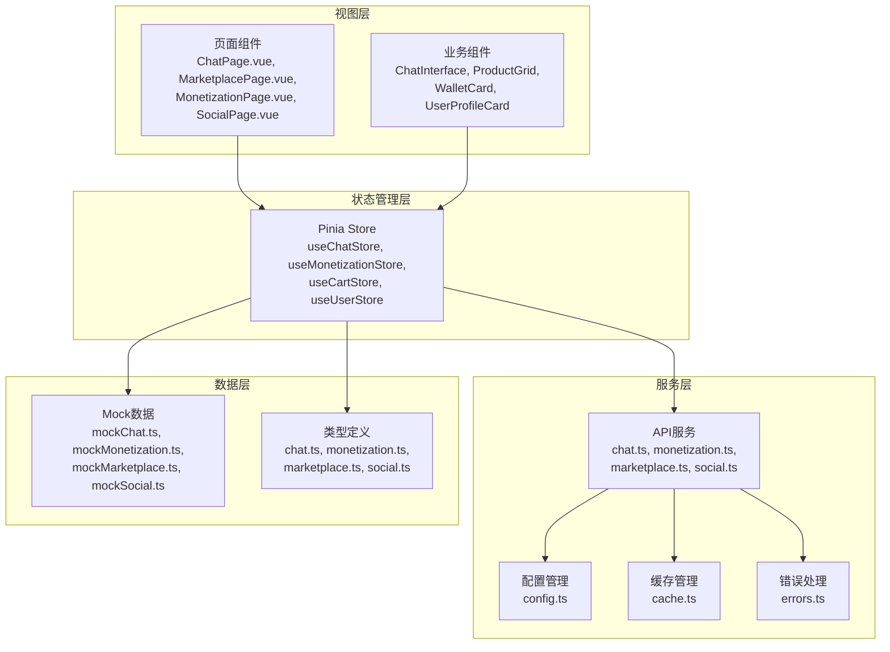

**图表来源**
- [API集成方案.md:64-88](file://apps/AgentPit/docs/API_INTEGRATION_PLAN.md#L64-L88)
- [COMPONENT_LIBRARY_ARCHITECTURE.md:28-93](file://apps/AgentPit/docs/COMPONENT_LIBRARY_ARCHITECTURE.md#L28-L93)

**章节来源**
- [README.md:1-6](file://apps/AgentPit/README.md#L1-L6)
- [API集成方案.md:1-50](file://apps/AgentPit/docs/API_INTEGRATION_PLAN.md#L1-L50)

## 核心组件
本节介绍 AgentPit 的四大核心功能模块及其关键组件：

### 变现系统
变现系统负责管理用户的资产、交易记录和收益分析。核心组件包括：
- 钱包数据管理：总余额、可用余额、冻结余额
- 交易记录追踪：收入/支出分类、状态管理
- 收益数据分析：月度收入曲线、收支统计
- 提现流程：提现申请、状态更新

### 市场交易系统
市场交易系统提供商品浏览、购物车管理和订单处理功能：
- 商品目录：多品类分类、详细规格参数
- 购物车功能：商品添加、数量调整、价格计算
- 订单状态管理：支付、发货、收货、完成状态流转
- 评价系统：评分、评论、图片展示

### 协作系统
协作系统支持多智能体间的任务分配和通信：
- 智能体能力模型：专业领域、技能等级、响应风格
- 任务分解：主任务+子任务的树形结构
- 实时通信：请求/响应/通知/警告消息类型
- 质量评估：完成度评分、报告导出

### 社交连接系统
社交连接系统管理用户资料、推荐算法和社交动态：
- 用户档案：基本信息、兴趣标签、社交账户绑定
- 推荐匹配：基于兴趣和行为的智能推荐
- 社交互动：动态分享、点赞评论、私信功能
- 关系网络：关注列表、粉丝统计、互动历史

**章节来源**
- [API集成方案.md:310-344](file://apps/AgentPit/docs/API_INTEGRATION_PLAN.md#L310-L344)
- [useMonetizationStore.ts:13-63](file://apps/AgentPit/src/stores/useMonetizationStore.ts#L13-L63)
- [useCartStore.ts:6-47](file://apps/AgentPit/src/stores/useCartStore.ts#L6-L47)

## 架构概览
AgentPit 采用分层架构设计，确保各层职责清晰、耦合度低：

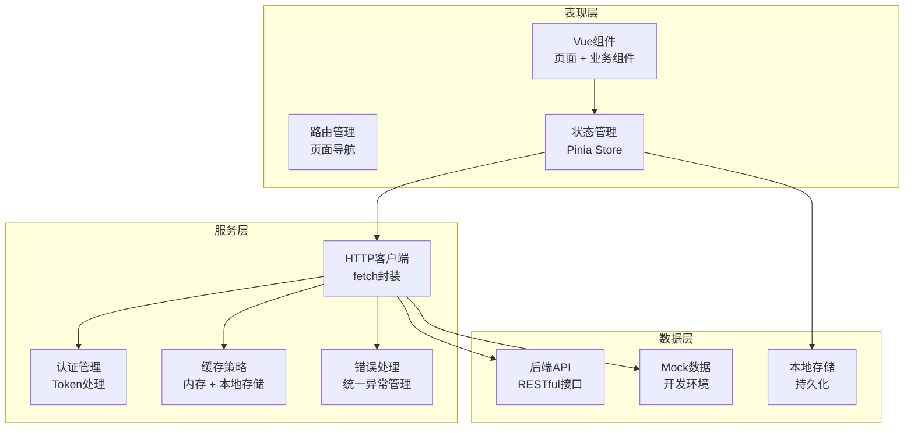

**图表来源**
- [API集成方案.md:90-105](file://apps/AgentPit/docs/API_INTEGRATION_PLAN.md#L90-L105)
- [config.ts:96-104](file://apps/AgentPit/src/services/config.ts#L96-L104)

### 状态管理模式
AgentPit 使用 Pinia 作为状态管理库，提供响应式状态管理和动作方法：

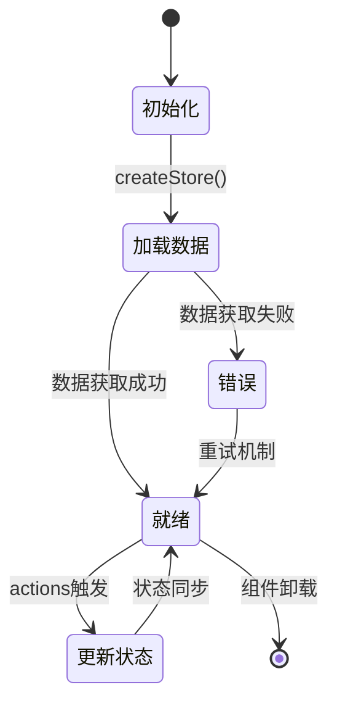

**图表来源**
- [useChatStore.ts:13-21](file://apps/AgentPit/src/stores/useChatStore.ts#L13-L21)
- [useMonetizationStore.ts:20-31](file://apps/AgentPit/src/stores/useMonetizationStore.ts#L20-L31)

## 详细组件分析

### 变现系统组件分析

#### 钱包状态管理
钱包状态管理是变现系统的核心，负责维护用户的财务信息：

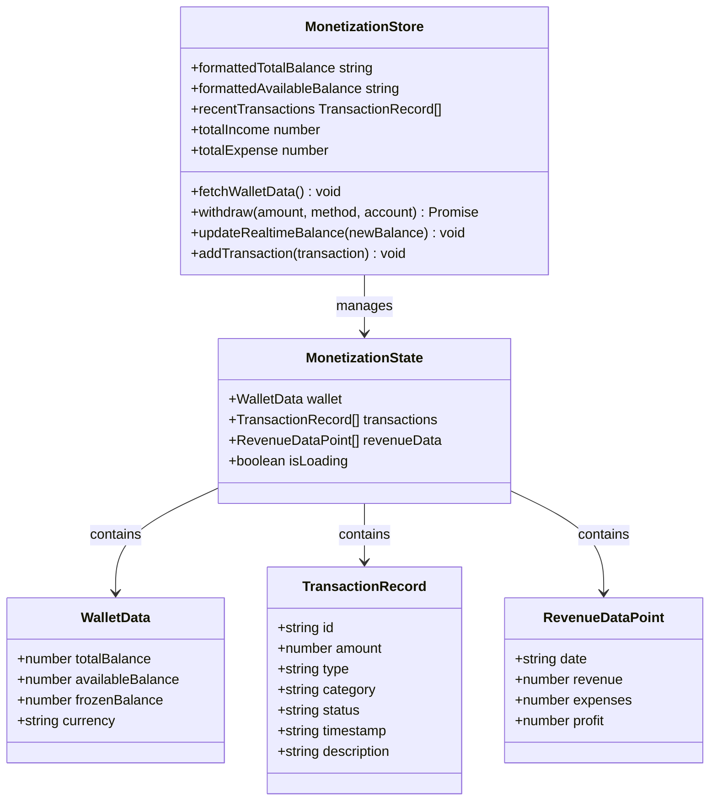

**图表来源**
- [useMonetizationStore.ts:13-18](file://apps/AgentPit/src/stores/useMonetizationStore.ts#L13-L18)
- [useMonetizationStore.ts:65-151](file://apps/AgentPit/src/stores/useMonetizationStore.ts#L65-L151)

#### 提现流程
提现流程涉及用户输入、API 调用和状态更新：

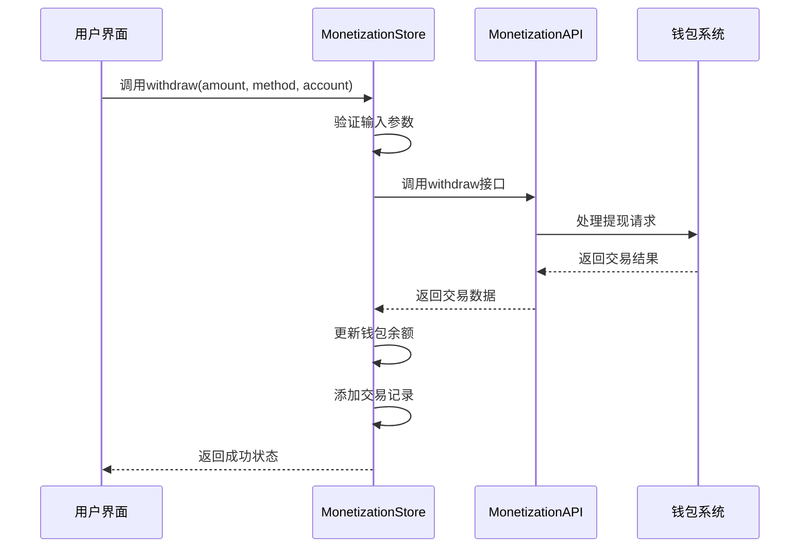

**图表来源**
- [useMonetizationStore.ts:114-142](file://apps/AgentPit/src/stores/useMonetizationStore.ts#L114-L142)
- [monetization.ts](file://apps/AgentPit/src/services/api/monetization.ts)

**章节来源**
- [useMonetizationStore.ts:1-153](file://apps/AgentPit/src/stores/useMonetizationStore.ts#L1-L153)

### 市场交易系统组件分析

#### 购物车状态管理
购物车系统提供完整的电商购物体验：

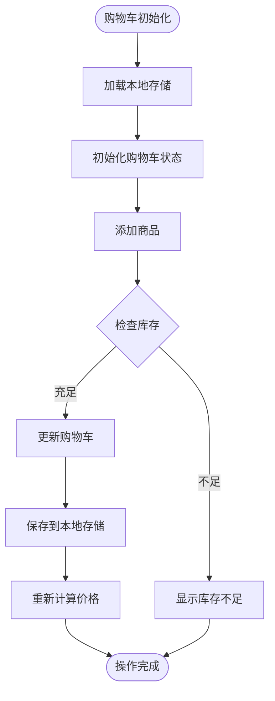

**图表来源**
- [useCartStore.ts:64-92](file://apps/AgentPit/src/stores/useCartStore.ts#L64-L92)

#### 商品数据模型
市场交易系统的核心数据结构：

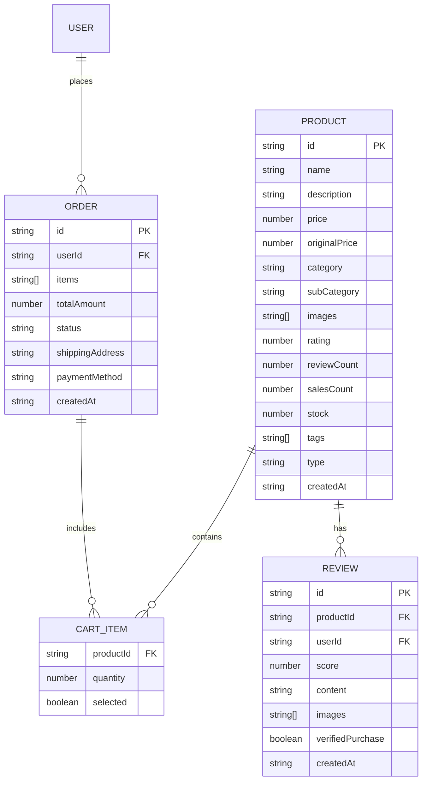

**图表来源**
- [useCartStore.ts:117-132](file://apps/AgentPit/src/stores/useCartStore.ts#L117-L132)
- [React业务逻辑分析.md:339-357](file://apps/AgentPit/docs/REACT_BUSINESS_LOGIC_ANALYSIS.md#L339-L357)

**章节来源**
- [useCartStore.ts:1-138](file://apps/AgentPit/src/stores/useCartStore.ts#L1-L138)

### 协作系统组件分析

#### 智能体协作流程
协作系统支持多智能体间的复杂任务处理：

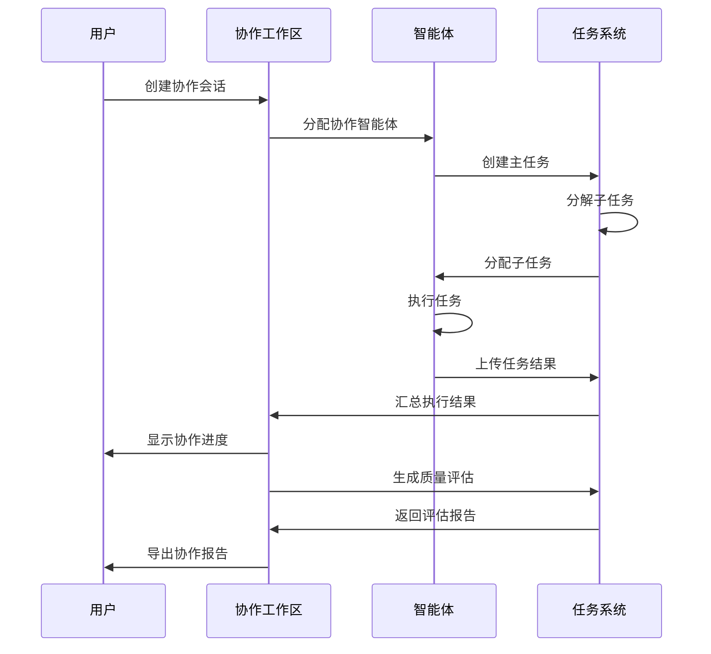

**图表来源**
- [React业务逻辑分析.md:424-430](file://apps/AgentPit/docs/REACT_BUSINESS_LOGIC_ANALYSIS.md#L424-L430)

#### 消息通信协议
智能体间的消息传递采用统一的协议格式：

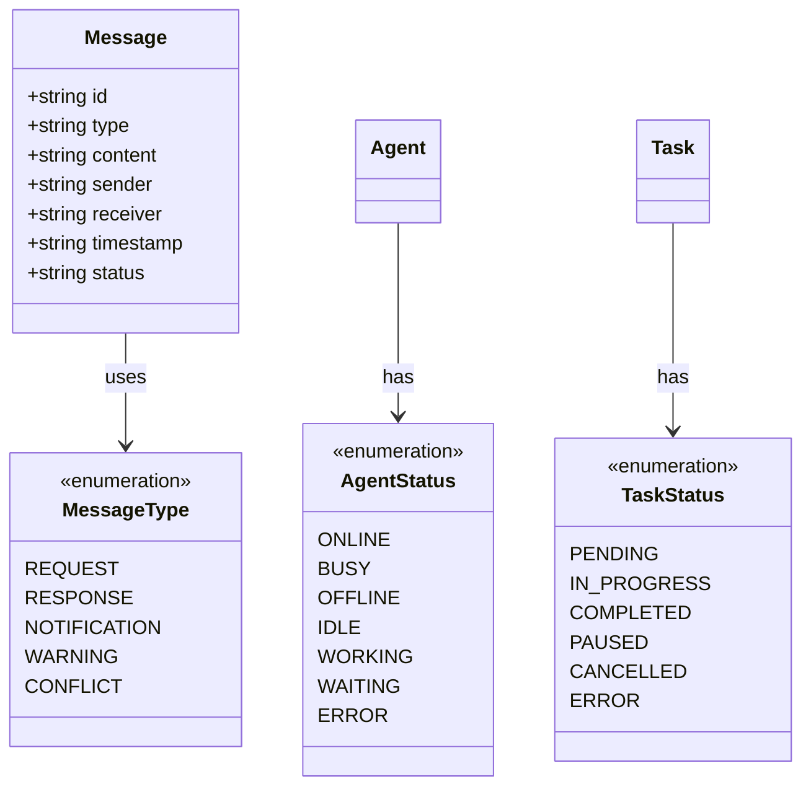

**图表来源**
- [React业务逻辑分析.md:434-441](file://apps/AgentPit/docs/REACT_BUSINESS_LOGIC_ANALYSIS.md#L434-L441)
- [React业务逻辑分析.md:383-401](file://apps/AgentPit/docs/REACT_BUSINESS_LOGIC_ANALYSIS.md#L383-L401)

**章节来源**
- [React业务逻辑分析.md:377-442](file://apps/AgentPit/docs/REACT_BUSINESS_LOGIC_ANALYSIS.md#L377-L442)

### 聊天系统组件分析

#### 会话管理流程
聊天系统提供完整的对话管理功能：

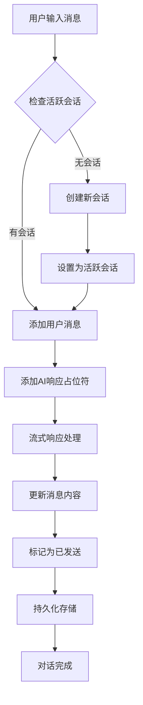

**图表来源**
- [useChatStore.ts:199-215](file://apps/AgentPit/src/stores/useChatStore.ts#L199-L215)

#### 消息状态机
消息在整个生命周期中的状态变化：

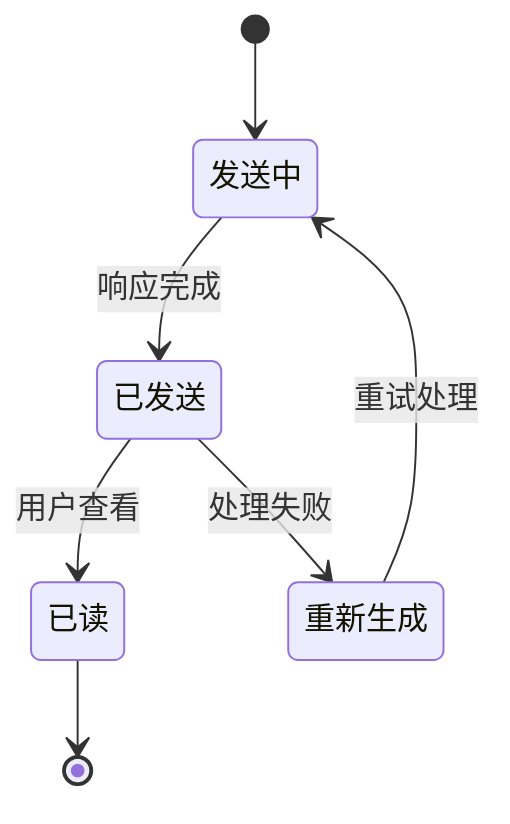

**图表来源**
- [useChatStore.ts:34-62](file://apps/AgentPit/src/stores/useChatStore.ts#L34-L62)

**章节来源**
- [useChatStore.ts:1-218](file://apps/AgentPit/src/stores/useChatStore.ts#L1-L218)

## 依赖分析
AgentPit 的依赖关系体现了清晰的分层架构：

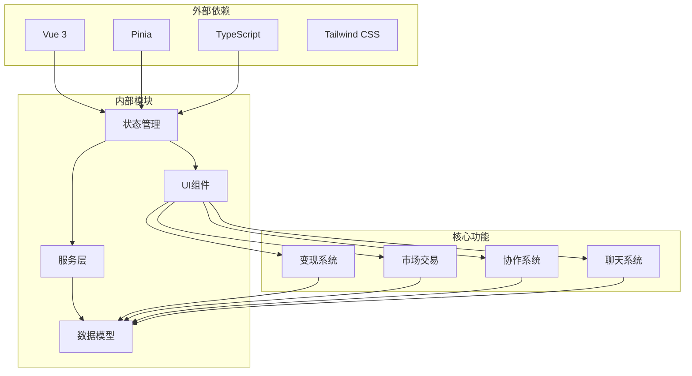

**图表来源**
- [COMPONENT_LIBRARY_ARCHITECTURE.md:15-24](file://apps/AgentPit/docs/COMPONENT_LIBRARY_ARCHITECTURE.md#L15-L24)

### 组件耦合度分析
- **低耦合设计**：各功能模块通过统一的服务接口交互
- **高内聚特性**：每个 Store 负责单一业务领域的状态管理
- **可替换性**：服务层可以轻松替换为真实 API 或 Mock 数据

**章节来源**
- [API集成方案.md:19-50](file://apps/AgentPit/docs/API_INTEGRATION_PLAN.md#L19-L50)

## 性能考虑
AgentPit 在性能方面采用了多项优化策略：

### 缓存策略
系统实现了多层次的缓存机制：
- **内存缓存**：Pinia Store 内部状态缓存
- **本地存储缓存**：localStorage 持久化缓存
- **HTTP 缓存**：服务层统一的请求缓存管理

### 性能优化技术
- **懒加载**：按需加载大型组件和数据
- **虚拟滚动**：大数据量列表的性能优化
- **防抖节流**：输入事件和窗口 resize 的性能保护
- **组件缓存**：Vue 组件的 keep-alive 缓存机制

### 错误处理机制
系统建立了完善的错误处理体系：
- **统一错误类型**：ApiError、NetworkError、ServerError、ValidationError
- **错误边界**：组件级别的错误捕获和处理
- **重试机制**：网络请求的自动重试策略
- **降级方案**：Mock 数据作为 API 失败时的回退选项

## 故障排除指南

### 常见问题及解决方案

#### API 集成问题
**问题**：API 请求失败或响应异常
**解决方案**：
1. 检查 API 基础配置是否正确
2. 验证认证 Token 是否有效
3. 查看网络连接状态
4. 检查服务端错误日志

#### 状态同步问题
**问题**：状态不同步或数据丢失
**解决方案**：
1. 检查 localStorage 权限设置
2. 验证 Pinia 持久化配置
3. 确认组件卸载时的状态清理
4. 检查并发操作的锁机制

#### 性能问题
**问题**：页面加载缓慢或响应迟滞
**解决方案**：
1. 分析组件渲染性能瓶颈
2. 优化大数据量的渲染逻辑
3. 检查内存泄漏问题
4. 实施适当的缓存策略

**章节来源**
- [API集成方案.md:404-412](file://apps/AgentPit/docs/API_INTEGRATION_PLAN.md#L404-L412)
- [errors.ts:209-251](file://apps/AgentPit/src/services/errors.ts#L209-L251)

## 结论
AgentPit 的核心功能模块展现了现代前端应用的最佳实践。通过清晰的分层架构、完善的错误处理机制和优化的性能策略，系统为用户提供了流畅的智能体生态系统体验。四个核心模块（变现系统、市场交易系统、协作系统、聊天系统）相互配合，形成了完整的业务闭环。

未来的发展方向包括：
- 完成从 Mock 数据到真实 API 的迁移
- 扩展更多智能体能力和协作模式
- 增强个性化推荐和智能匹配算法
- 优化移动端用户体验和离线功能

## 附录

### 配置选项参考
系统支持多种环境配置，可通过环境变量进行控制：

| 配置项 | 类型 | 默认值 | 说明 |
|--------|------|--------|------|
| VITE_API_BASE_URL | string | http://localhost:8080/api | API 服务基础地址 |
| VITE_USE_MOCK_API | boolean | true | 是否使用 Mock 数据 |
| VITE_API_TIMEOUT | number | 30000 | API 请求超时时间(ms) |
| VITE_DEEP_RESEARCH_PATH | string | 空 | DeepResearch 工具路径 |
| VITE_FLEXLOOP_PATH | string | 空 | Flexloop 工具路径 |

### API 接口规范
系统采用 RESTful API 设计，支持标准的 CRUD 操作和流式数据传输。

### 错误码定义
系统定义了统一的错误码体系，便于前端进行针对性的错误处理和用户提示。