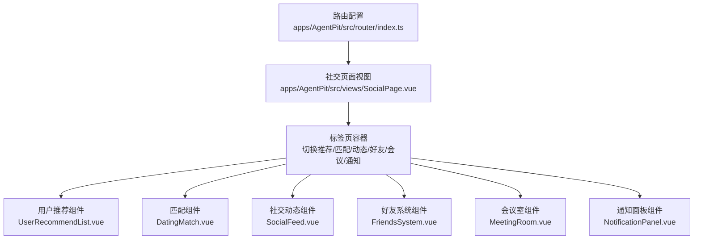
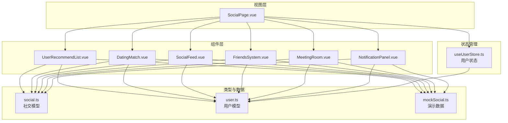
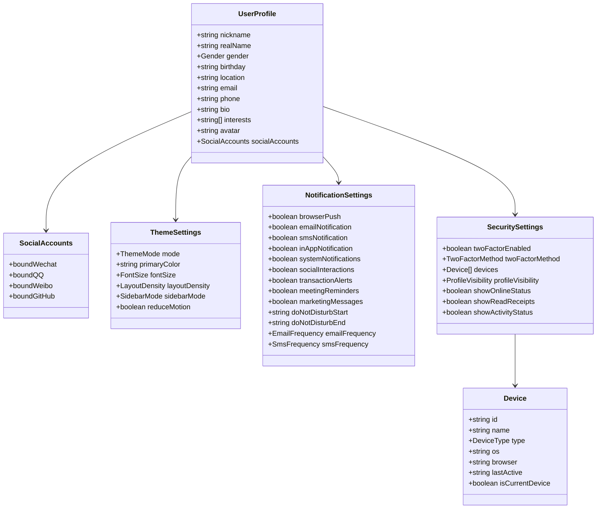
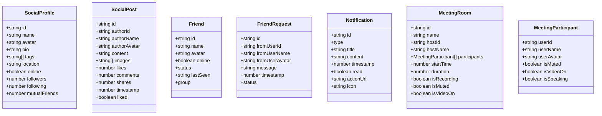
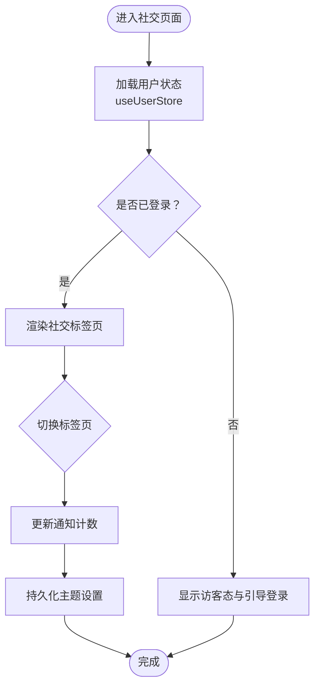
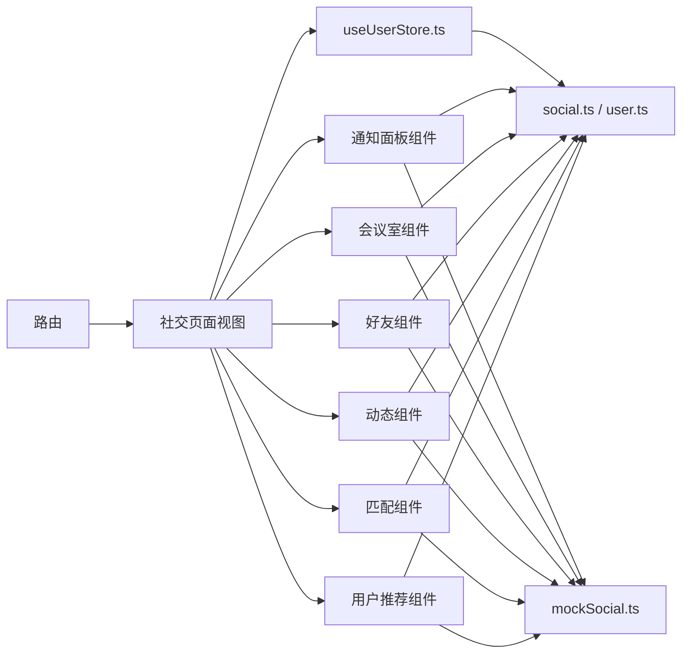

# 社交连接系统

<cite>
**本文引用的文件**
- [apps/AgentPit/src/types/social.ts](file://apps/AgentPit/src/types/social.ts)
- [apps/AgentPit/src/types/user.ts](file://apps/AgentPit/src/types/user.ts)
- [apps/AgentPit/src/data/mockSocial.ts](file://apps/AgentPit/src/data/mockSocial.ts)
- [apps/AgentPit/src/stores/useUserStore.ts](file://apps/AgentPit/src/stores/useUserStore.ts)
- [apps/AgentPit/src/views/SocialPage.vue](file://apps/AgentPit/src/views/SocialPage.vue)
- [apps/AgentPit/src/router/index.ts](file://apps/AgentPit/src/router/index.ts)
</cite>

## 目录
1. [引言](#引言)
2. [项目结构](#项目结构)
3. [核心组件](#核心组件)
4. [架构总览](#架构总览)
5. [详细组件分析](#详细组件分析)
6. [依赖分析](#依赖分析)
7. [性能考虑](#性能考虑)
8. [故障排查指南](#故障排查指南)
9. [结论](#结论)
10. [附录](#附录)

## 引言
本文件为 AgentPit 社交连接系统的全面技术文档，聚焦于用户关系网络、好友系统、个人资料与隐私设置、社交动态 feed、会议室功能等模块的实现与集成。文档从架构、组件关系、数据流、处理逻辑、权限与隐私控制、API 接口设计、实时通信、性能与扩展性等方面进行系统化梳理，并提供可视化图示与实践建议，帮助开发者快速理解并扩展该社交功能。

## 项目结构
AgentPit 应用采用前端单页应用架构，社交功能以页面视图 + 组件 + 类型定义 + 状态存储的方式组织。社交页面作为入口，通过路由挂载，内部包含多个功能子组件：用户推荐、动态 feed、好友系统、会议室、通知面板等。

图表来源
- [apps/AgentPit/src/router/index.ts:1-73](file://apps/AgentPit/src/router/index.ts#L1-L73)
- [apps/AgentPit/src/views/SocialPage.vue:1-138](file://apps/AgentPit/src/views/SocialPage.vue#L1-L138)

章节来源
- [apps/AgentPit/src/router/index.ts:1-73](file://apps/AgentPit/src/router/index.ts#L1-L73)
- [apps/AgentPit/src/views/SocialPage.vue:1-138](file://apps/AgentPit/src/views/SocialPage.vue#L1-L138)

## 核心组件
- 用户资料与隐私设置类型：定义用户档案、主题设置、通知设置、安全设置、设备与FAQ等类型，支撑个人资料管理与隐私控制。
- 社交数据模型：定义社交资料、社交动态、好友、好友请求、通知、会议室及参与者等数据结构，用于前后端交互与本地展示。
- Mock 数据：提供社交模块的演示数据，覆盖用户、动态、好友、请求、通知、会议室等场景，便于开发与联调。
- 用户状态存储：Pinia 用户状态管理，包含登录态、头像昵称派生、主题设置持久化、通知计数等。
- 社交页面视图：聚合社交功能的入口页面，负责标签页切换与功能区域渲染。

章节来源
- [apps/AgentPit/src/types/user.ts:1-200](file://apps/AgentPit/src/types/user.ts#L1-L200)
- [apps/AgentPit/src/types/social.ts:1-80](file://apps/AgentPit/src/types/social.ts#L1-L80)
- [apps/AgentPit/src/data/mockSocial.ts:1-375](file://apps/AgentPit/src/data/mockSocial.ts#L1-L375)
- [apps/AgentPit/src/stores/useUserStore.ts:1-72](file://apps/AgentPit/src/stores/useUserStore.ts#L1-L72)

## 架构总览
社交系统围绕“页面视图 + 功能组件 + 类型模型 + 状态存储”的分层设计展开。页面负责导航与布局，组件负责具体业务展示与交互，类型定义确保数据一致性，状态存储负责用户上下文与主题偏好等跨组件共享的数据。

图表来源
- [apps/AgentPit/src/views/SocialPage.vue:1-138](file://apps/AgentPit/src/views/SocialPage.vue#L1-L138)
- [apps/AgentPit/src/types/social.ts:1-80](file://apps/AgentPit/src/types/social.ts#L1-L80)
- [apps/AgentPit/src/types/user.ts:1-200](file://apps/AgentPit/src/types/user.ts#L1-L200)
- [apps/AgentPit/src/data/mockSocial.ts:1-375](file://apps/AgentPit/src/data/mockSocial.ts#L1-L375)
- [apps/AgentPit/src/stores/useUserStore.ts:1-72](file://apps/AgentPit/src/stores/useUserStore.ts#L1-L72)

## 详细组件分析

### 用户资料与隐私设置
- 用户资料：包含昵称、真实姓名、性别、生日、地区、邮箱、手机、个人简介、兴趣标签、头像、社交账号绑定等字段，支撑完整的个人档案展示与编辑。
- 主题设置：支持明暗主题、主色调、字体大小、布局密度、侧边栏模式、是否减少动画等，便于个性化体验。
- 通知设置：涵盖浏览器推送、邮件通知、短信通知、应用内通知、系统通知、社交互动通知、交易提醒、会议提醒、营销消息以及免打扰时段与频率控制。
- 安全设置：支持双因素认证开关与方式、已登录设备列表、资料可见性、在线状态显示、已读回执与活动状态显示等，保障账户安全与隐私可控。
- 设备信息：记录设备唯一标识、设备名称、类型、操作系统、浏览器、最后活跃时间、是否当前设备等，便于会话管理与审计。
- FAQ 与帮助文章：提供分类、标签、更新时间、阅读时长等元数据，便于知识服务集成。

图表来源
- [apps/AgentPit/src/types/user.ts:1-200](file://apps/AgentPit/src/types/user.ts#L1-L200)

章节来源
- [apps/AgentPit/src/types/user.ts:1-200](file://apps/AgentPit/src/types/user.ts#L1-L200)

### 社交数据模型
- 社交资料：包含用户 ID、名称、头像、简介、标签、位置、在线状态、粉丝数、关注数、共同好友数等，用于社交主页与推荐场景。
- 社交动态：包含动态 ID、作者 ID/名称/头像、内容、图片数组、点赞数、评论数、分享数、时间戳、是否已点赞等，支撑动态 feed 展示与交互。
- 好友：包含好友 ID、名称、头像、在线状态、状态（在线/离线/忙碌）、最后在线时间、分组（家庭/同事/其他）等，用于好友列表与状态展示。
- 好友请求：包含请求 ID、发起用户 ID/名称/头像、留言、时间戳、状态（待处理/已接受/已拒绝）等，支撑好友关系建立流程。
- 通知：包含通知 ID、类型（系统/互动/消息）、标题、内容、时间戳、是否已读、动作链接、图标等，用于消息中心与提醒。
- 会议室：包含房间 ID、名称、主持人 ID/名称、参与者列表、开始时间、持续时间、是否录制、是否静音、摄像头状态等，支撑视频会议功能。
- 会议室参与者：包含用户 ID/名称/头像、是否静音、摄像头状态、是否正在说话等，用于会议界面的状态指示。

图表来源
- [apps/AgentPit/src/types/social.ts:1-80](file://apps/AgentPit/src/types/social.ts#L1-L80)

章节来源
- [apps/AgentPit/src/types/social.ts:1-80](file://apps/AgentPit/src/types/social.ts#L1-L80)

### Mock 数据与演示
- 演示用户：包含多个社交资料样本，覆盖不同城市、职业、在线状态与社交指标，便于界面与交互测试。
- 演示动态：包含多条社交动态，覆盖技术、设计、数据、开发、内容创作等主题，支持点赞/评论/分享等交互模拟。
- 演示好友：包含好友列表与状态，支持按分组筛选与状态展示。
- 演示好友请求：包含待处理请求，支持接受/拒绝流程演示。
- 演示通知：包含互动、消息、系统三类通知，支持已读/未读状态与图标展示。
- 演示会议室：包含一次会议的参与者、录制、音频/视频状态与说话人指示。

章节来源
- [apps/AgentPit/src/data/mockSocial.ts:1-375](file://apps/AgentPit/src/data/mockSocial.ts#L1-L375)

### 用户状态存储（Pinia）
- 状态结构：包含用户档案、登录态、主题设置、通知计数；主题设置持久化到本地存储。
- 派生属性：提供用户名与头像的派生值，简化模板渲染。
- 行为方法：登录、登出、更新资料、更新主题设置、设置/增加/清空通知计数等。

图表来源
- [apps/AgentPit/src/stores/useUserStore.ts:1-72](file://apps/AgentPit/src/stores/useUserStore.ts#L1-L72)

章节来源
- [apps/AgentPit/src/stores/useUserStore.ts:1-72](file://apps/AgentPit/src/stores/useUserStore.ts#L1-L72)

### 社交页面视图与路由
- 路由：社交页面路由注册，支持懒加载组件，便于按需加载。
- 视图：社交页面作为容器，包含顶部导航与内容区，使用过渡与 KeepAlive 提升切换体验；底部统计卡片展示在线好友、新匹配、活跃会议等指标。

章节来源
- [apps/AgentPit/src/router/index.ts:1-73](file://apps/AgentPit/src/router/index.ts#L1-L73)
- [apps/AgentPit/src/views/SocialPage.vue:1-138](file://apps/AgentPit/src/views/SocialPage.vue#L1-L138)

## 依赖分析
- 页面到组件：社交页面通过标签页切换依赖各功能组件，组件间通过类型模型与状态存储解耦。
- 组件到类型：所有组件依赖 social.ts 与 user.ts 中的类型定义，保证数据结构一致。
- 组件到数据：组件可直接或间接使用 mockSocial.ts 中的演示数据进行开发与联调。
- 组件到状态：组件通过 useUserStore 获取用户上下文与主题设置，实现跨组件共享。
- 路由到视图：路由懒加载社交页面视图，降低首屏负载。

图表来源
- [apps/AgentPit/src/router/index.ts:1-73](file://apps/AgentPit/src/router/index.ts#L1-L73)
- [apps/AgentPit/src/views/SocialPage.vue:1-138](file://apps/AgentPit/src/views/SocialPage.vue#L1-L138)
- [apps/AgentPit/src/types/social.ts:1-80](file://apps/AgentPit/src/types/social.ts#L1-L80)
- [apps/AgentPit/src/types/user.ts:1-200](file://apps/AgentPit/src/types/user.ts#L1-L200)
- [apps/AgentPit/src/data/mockSocial.ts:1-375](file://apps/AgentPit/src/data/mockSocial.ts#L1-L375)
- [apps/AgentPit/src/stores/useUserStore.ts:1-72](file://apps/AgentPit/src/stores/useUserStore.ts#L1-L72)

章节来源
- [apps/AgentPit/src/router/index.ts:1-73](file://apps/AgentPit/src/router/index.ts#L1-L73)
- [apps/AgentPit/src/views/SocialPage.vue:1-138](file://apps/AgentPit/src/views/SocialPage.vue#L1-L138)
- [apps/AgentPit/src/types/social.ts:1-80](file://apps/AgentPit/src/types/social.ts#L1-L80)
- [apps/AgentPit/src/types/user.ts:1-200](file://apps/AgentPit/src/types/user.ts#L1-L200)
- [apps/AgentPit/src/data/mockSocial.ts:1-375](file://apps/AgentPit/src/data/mockSocial.ts#L1-L375)
- [apps/AgentPit/src/stores/useUserStore.ts:1-72](file://apps/AgentPit/src/stores/useUserStore.ts#L1-L72)

## 性能考虑
- 组件懒加载与缓存：路由懒加载与 KeepAlive 结合，减少重复渲染开销，提升标签页切换性能。
- 状态持久化：主题设置持久化到本地存储，避免每次刷新重建，降低初始化成本。
- 数据结构简洁：类型定义字段明确、数量适中，有利于前端渲染与序列化传输。
- 图片与媒体：动态图片数组与头像 URL 字段存在，建议在实际实现中引入懒加载与尺寸裁剪策略，减少带宽与内存占用。
- 通知计数：通过状态存储统一维护通知计数，避免频繁 DOM 查询与重排。

## 故障排查指南
- 登录态异常：检查用户状态存储的登录标记与持久化键，确认登出时清理本地存储。
- 主题设置不生效：确认主题设置持久化的键名与存储对象，检查派生属性是否正确读取。
- 标签页切换闪烁：检查过渡动画与 KeepAlive 使用，确保组件 key 与激活状态一致。
- 数据不一致：核对组件使用的类型定义与演示数据，确保字段命名与默认值一致。
- 路由无法跳转：检查路由配置与组件懒加载路径，确认路径与名称无误。

章节来源
- [apps/AgentPit/src/stores/useUserStore.ts:1-72](file://apps/AgentPit/src/stores/useUserStore.ts#L1-L72)
- [apps/AgentPit/src/views/SocialPage.vue:1-138](file://apps/AgentPit/src/views/SocialPage.vue#L1-L138)
- [apps/AgentPit/src/router/index.ts:1-73](file://apps/AgentPit/src/router/index.ts#L1-L73)

## 结论
AgentPit 社交连接系统以清晰的分层架构与强类型模型为基础，结合 Pinia 状态管理与路由懒加载，实现了用户资料、好友系统、动态 feed、会议室与通知等核心功能的模块化组织。通过 Mock 数据与演示组件，开发者可以快速搭建与验证社交功能。后续可在真实 API 对接、实时通信、推荐算法、统计分析与社区治理方面进一步扩展，同时关注性能与可扩展性优化。

## 附录
- 组件使用示例与集成指南
  - 在社交页面中添加新功能组件：在标签页数组中新增一项，指向新组件，并在页面中渲染该组件。
  - 使用类型模型：在组件中导入 social.ts 与 user.ts 的类型，确保数据结构与字段一致。
  - 使用状态存储：在组件中调用 useUserStore，获取用户上下文与主题设置，必要时更新通知计数。
  - 集成 Mock 数据：在开发阶段使用 mockSocial.ts 的数据进行联调，确保 UI 与交互符合预期。
- 权限控制与隐私设置
  - 通过安全设置中的资料可见性与在线状态控制，实现不同粒度的隐私保护。
  - 通知设置中的免打扰时段与频率控制，平衡信息接收与干扰。
- 社交 API 接口与实时通信（建议）
  - 用户资料接口：GET/PUT 用户资料，支持分页与过滤。
  - 好友接口：GET 好友列表，POST/DELETE 好友请求，PATCH 更新状态。
  - 动态接口：GET 动态 feed，POST 发布动态，PUT/DELETE 点赞/取消点赞。
  - 会议室接口：GET 会议室列表，POST 创建会议，PATCH 更新状态，DELETE 结束会议。
  - 实时通信：建议采用 WebSocket 或 Server-Sent Events 实现实时消息与会议状态同步。
- 用户推荐算法与统计分析（建议）
  - 推荐算法：基于兴趣标签、共同好友、互动历史与地理位置进行协同过滤或向量相似度计算。
  - 统计分析：记录动态互动、好友增长、会议参与等指标，支持仪表盘与报表生成。
- 社区治理机制（建议）
  - 举报与审核：提供举报入口与审核流程，支持内容屏蔽与封禁。
  - 权限分级：区分普通用户、版主与管理员，赋予不同治理权限。
  - 规则与公告：通过系统通知与公告板发布社区规则与重要事项。