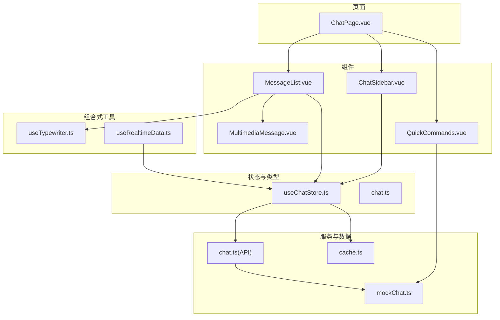
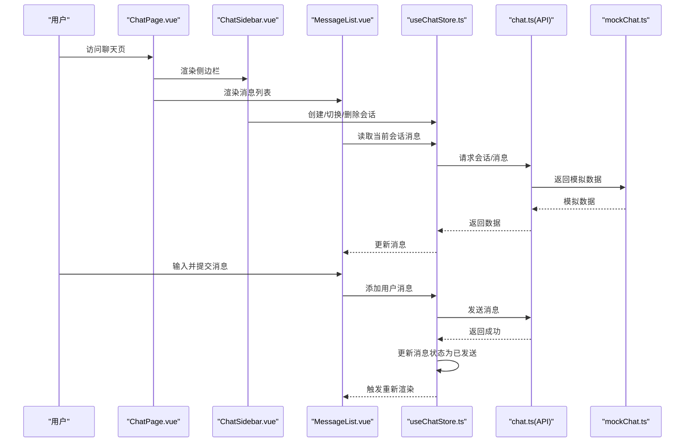
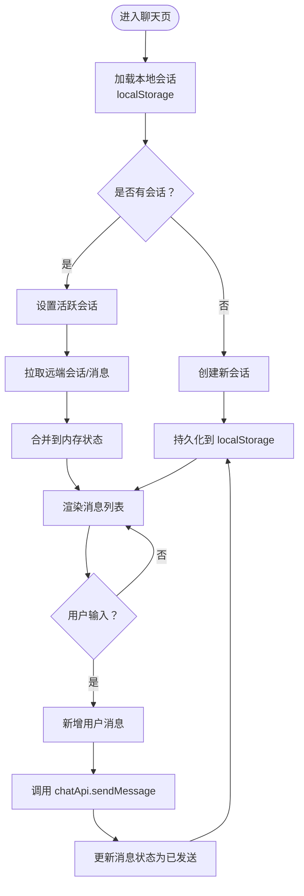
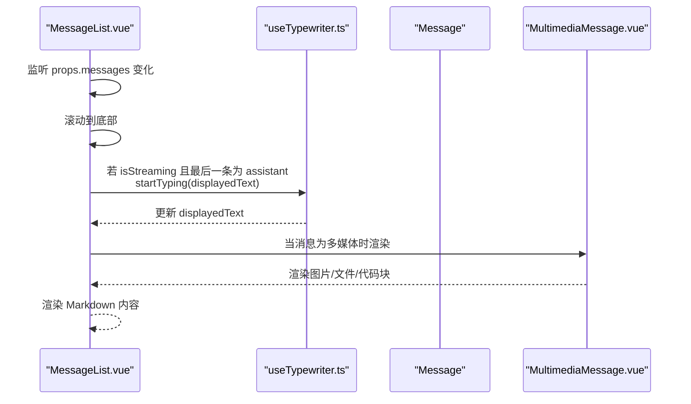
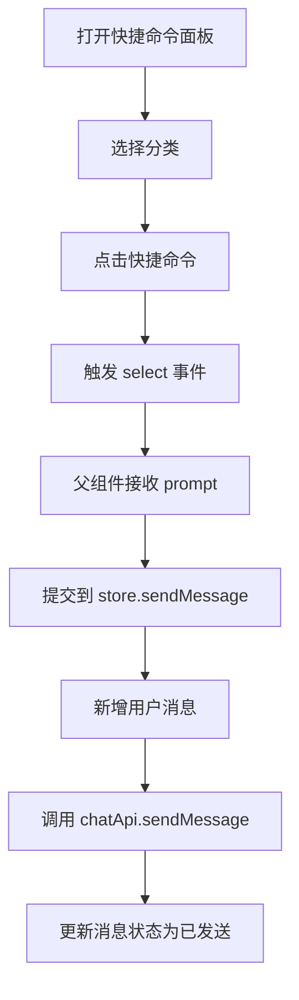
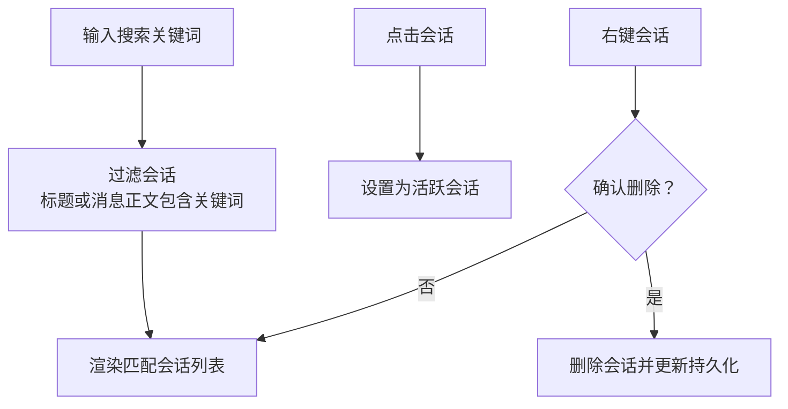
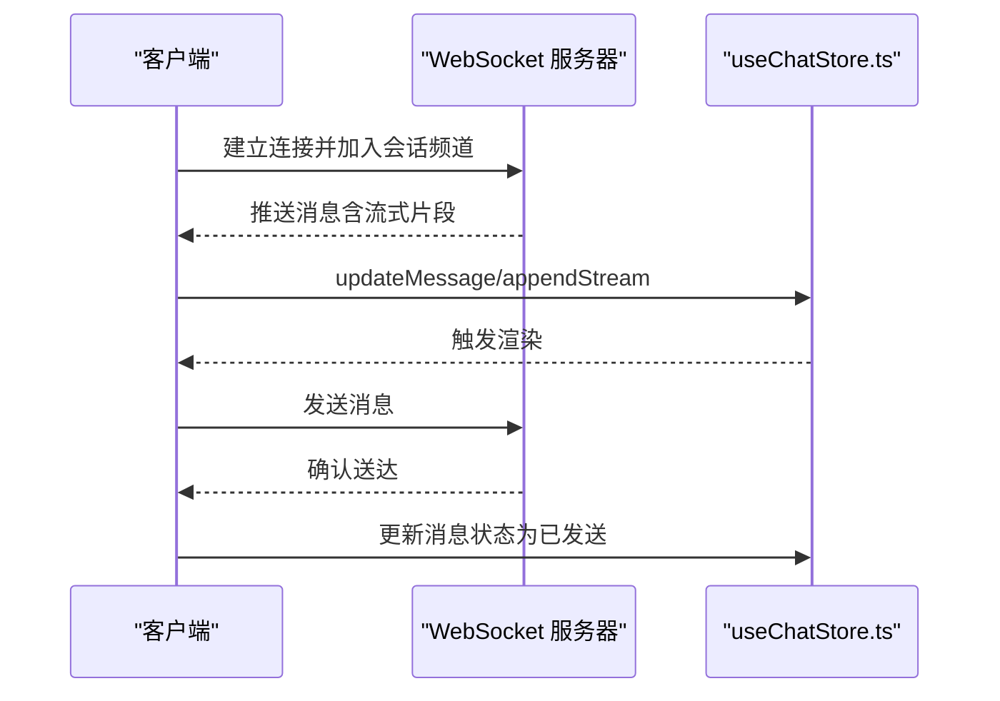
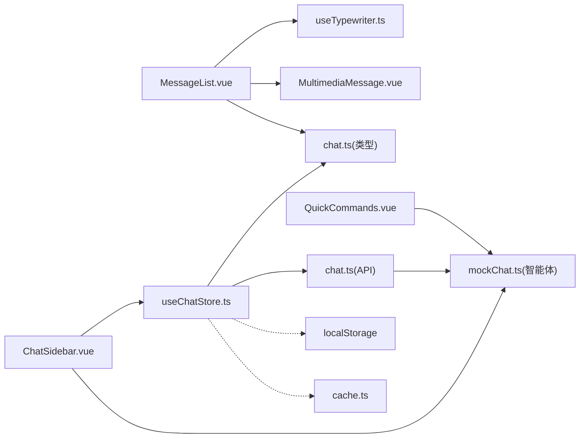

# 聊天系统

<cite>
**本文引用的文件**
- [apps/AgentPit/src/stores/useChatStore.ts](file://apps/AgentPit/src/stores/useChatStore.ts)
- [apps/AgentPit/src/types/chat.ts](file://apps/AgentPit/src/types/chat.ts)
- [apps/AgentPit/src/services/api/chat.ts](file://apps/AgentPit/src/services/api/chat.ts)
- [apps/AgentPit/src/data/mockChat.ts](file://apps/AgentPit/src/data/mockChat.ts)
- [apps/AgentPit/src/components/chat/MessageList.vue](file://apps/AgentPit/src/components/chat/MessageList.vue)
- [apps/AgentPit/src/components/chat/MultimediaMessage.vue](file://apps/AgentPit/src/components/chat/MultimediaMessage.vue)
- [apps/AgentPit/src/components/chat/QuickCommands.vue](file://apps/AgentPit/src/components/chat/QuickCommands.vue)
- [apps/AgentPit/src/components/chat/ChatSidebar.vue](file://apps/AgentPit/src/components/chat/ChatSidebar.vue)
- [apps/AgentPit/src/composables/useTypewriter.ts](file://apps/AgentPit/src/composables/useTypewriter.ts)
- [apps/AgentPit/src/composables/useRealtimeData.ts](file://apps/AgentPit/src/composables/useRealtimeData.ts)
- [apps/AgentPit/src/services/cache.ts](file://apps/AgentPit/src/services/cache.ts)
- [apps/AgentPit/src/views/ChatPage.vue](file://apps/AgentPit/src/views/ChatPage.vue)
</cite>

## 目录
1. [简介](#简介)
2. [项目结构](#项目结构)
3. [核心组件](#核心组件)
4. [架构总览](#架构总览)
5. [详细组件分析](#详细组件分析)
6. [依赖关系分析](#依赖关系分析)
7. [性能考量](#性能考量)
8. [故障排查指南](#故障排查指南)
9. [结论](#结论)
10. [附录](#附录)

## 简介
本文件面向 AgentPit 聊天系统，提供从架构到实现细节的完整技术文档。重点覆盖实时消息传递、消息列表渲染、输入处理、快捷命令、WebSocket 连接管理现状与替代方案、消息持久化、离线消息处理与消息同步机制、聊天 API 接口与消息格式规范、消息组件使用示例与扩展方法、消息搜索与历史记录管理、消息通知能力，以及在高并发场景下的性能优化与消息丢失规避策略。

## 项目结构
AgentPit 聊天系统采用 Vue 3 + Pinia 架构，核心位于 apps/AgentPit 目录，包含类型定义、状态管理、服务层、UI 组件与页面入口。聊天相关的模块分布如下：
- 类型与状态：types/chat.ts、stores/useChatStore.ts
- 服务与 API：services/api/chat.ts、services/cache.ts
- 数据与模拟：data/mockChat.ts
- UI 组件：components/chat/*（消息列表、多媒体消息、快捷命令、侧边栏）
- 组合式工具：composables/useTypewriter.ts、useRealtimeData.ts
- 页面入口：views/ChatPage.vue

**图表来源**
- [apps/AgentPit/src/views/ChatPage.vue:1-8](file://apps/AgentPit/src/views/ChatPage.vue#L1-L8)
- [apps/AgentPit/src/components/chat/ChatSidebar.vue:1-226](file://apps/AgentPit/src/components/chat/ChatSidebar.vue#L1-L226)
- [apps/AgentPit/src/components/chat/MessageList.vue:1-313](file://apps/AgentPit/src/components/chat/MessageList.vue#L1-L313)
- [apps/AgentPit/src/components/chat/MultimediaMessage.vue:1-167](file://apps/AgentPit/src/components/chat/MultimediaMessage.vue#L1-L167)
- [apps/AgentPit/src/components/chat/QuickCommands.vue:1-92](file://apps/AgentPit/src/components/chat/QuickCommands.vue#L1-L92)
- [apps/AgentPit/src/stores/useChatStore.ts:1-218](file://apps/AgentPit/src/stores/useChatStore.ts#L1-L218)
- [apps/AgentPit/src/types/chat.ts:1-151](file://apps/AgentPit/src/types/chat.ts#L1-L151)
- [apps/AgentPit/src/services/api/chat.ts:1-18](file://apps/AgentPit/src/services/api/chat.ts#L1-L18)
- [apps/AgentPit/src/data/mockChat.ts:1-192](file://apps/AgentPit/src/data/mockChat.ts#L1-L192)
- [apps/AgentPit/src/services/cache.ts:1-50](file://apps/AgentPit/src/services/cache.ts#L1-L50)
- [apps/AgentPit/src/composables/useTypewriter.ts:1-53](file://apps/AgentPit/src/composables/useTypewriter.ts#L1-L53)
- [apps/AgentPit/src/composables/useRealtimeData.ts:1-117](file://apps/AgentPit/src/composables/useRealtimeData.ts#L1-L117)

**章节来源**
- [apps/AgentPit/src/views/ChatPage.vue:1-8](file://apps/AgentPit/src/views/ChatPage.vue#L1-L8)
- [apps/AgentPit/src/components/chat/ChatSidebar.vue:1-226](file://apps/AgentPit/src/components/chat/ChatSidebar.vue#L1-L226)
- [apps/AgentPit/src/components/chat/MessageList.vue:1-313](file://apps/AgentPit/src/components/chat/MessageList.vue#L1-L313)
- [apps/AgentPit/src/components/chat/MultimediaMessage.vue:1-167](file://apps/AgentPit/src/components/chat/MultimediaMessage.vue#L1-L167)
- [apps/AgentPit/src/components/chat/QuickCommands.vue:1-92](file://apps/AgentPit/src/components/chat/QuickCommands.vue#L1-L92)
- [apps/AgentPit/src/stores/useChatStore.ts:1-218](file://apps/AgentPit/src/stores/useChatStore.ts#L1-L218)
- [apps/AgentPit/src/types/chat.ts:1-151](file://apps/AgentPit/src/types/chat.ts#L1-L151)
- [apps/AgentPit/src/services/api/chat.ts:1-18](file://apps/AgentPit/src/services/api/chat.ts#L1-L18)
- [apps/AgentPit/src/data/mockChat.ts:1-192](file://apps/AgentPit/src/data/mockChat.ts#L1-L192)
- [apps/AgentPit/src/services/cache.ts:1-50](file://apps/AgentPit/src/services/cache.ts#L1-L50)
- [apps/AgentPit/src/composables/useTypewriter.ts:1-53](file://apps/AgentPit/src/composables/useTypewriter.ts#L1-L53)
- [apps/AgentPit/src/composables/useRealtimeData.ts:1-117](file://apps/AgentPit/src/composables/useRealtimeData.ts#L1-L117)

## 核心组件
- 状态管理（Pinia Store）
  - useChatStore：负责会话与消息的增删改查、本地持久化、远程同步、流式状态管理与最近上下文提取。
- 类型系统
  - chat.ts：定义消息、会话、智能体、快捷命令、事件类型与流式配置等类型。
- 服务层
  - chat.ts(API)：当前为模拟实现，提供会话与消息获取、消息发送占位。
  - cache.ts：通用缓存管理器，支持 TTL、键模式清理。
- UI 组件
  - MessageList：渲染消息列表、Markdown 渲染、滚动到底部、打字机动画与流式指示器。
  - MultimediaMessage：渲染图片、文件、代码块消息。
  - QuickCommands：快捷命令面板，按分类筛选与触发。
  - ChatSidebar：会话历史列表、搜索、重命名、删除、智能体切换。
- 组合式工具
  - useTypewriter：打字机效果实现。
  - useRealtimeData：演示性实时数据通知（与聊天业务相关但可迁移复用）。

**章节来源**
- [apps/AgentPit/src/stores/useChatStore.ts:1-218](file://apps/AgentPit/src/stores/useChatStore.ts#L1-L218)
- [apps/AgentPit/src/types/chat.ts:1-151](file://apps/AgentPit/src/types/chat.ts#L1-L151)
- [apps/AgentPit/src/services/api/chat.ts:1-18](file://apps/AgentPit/src/services/api/chat.ts#L1-L18)
- [apps/AgentPit/src/services/cache.ts:1-50](file://apps/AgentPit/src/services/cache.ts#L1-L50)
- [apps/AgentPit/src/components/chat/MessageList.vue:1-313](file://apps/AgentPit/src/components/chat/MessageList.vue#L1-L313)
- [apps/AgentPit/src/components/chat/MultimediaMessage.vue:1-167](file://apps/AgentPit/src/components/chat/MultimediaMessage.vue#L1-L167)
- [apps/AgentPit/src/components/chat/QuickCommands.vue:1-92](file://apps/AgentPit/src/components/chat/QuickCommands.vue#L1-L92)
- [apps/AgentPit/src/components/chat/ChatSidebar.vue:1-226](file://apps/AgentPit/src/components/chat/ChatSidebar.vue#L1-L226)
- [apps/AgentPit/src/composables/useTypewriter.ts:1-53](file://apps/AgentPit/src/composables/useTypewriter.ts#L1-L53)
- [apps/AgentPit/src/composables/useRealtimeData.ts:1-117](file://apps/AgentPit/src/composables/useRealtimeData.ts#L1-L117)

## 架构总览
AgentPit 聊天系统采用“页面 -> 组件 -> 状态/服务 -> 类型”的分层设计。页面 ChatPage.vue 作为入口，承载 ChatSidebar、MessageList、QuickCommands 等子组件。状态由 useChatStore 统一管理，消息持久化通过 localStorage，服务层目前为模拟实现，后续可替换为真实 API 与 WebSocket。

**图表来源**
- [apps/AgentPit/src/views/ChatPage.vue:1-8](file://apps/AgentPit/src/views/ChatPage.vue#L1-L8)
- [apps/AgentPit/src/components/chat/ChatSidebar.vue:1-226](file://apps/AgentPit/src/components/chat/ChatSidebar.vue#L1-L226)
- [apps/AgentPit/src/components/chat/MessageList.vue:1-313](file://apps/AgentPit/src/components/chat/MessageList.vue#L1-L313)
- [apps/AgentPit/src/stores/useChatStore.ts:1-218](file://apps/AgentPit/src/stores/useChatStore.ts#L1-L218)
- [apps/AgentPit/src/services/api/chat.ts:1-18](file://apps/AgentPit/src/services/api/chat.ts#L1-L18)
- [apps/AgentPit/src/data/mockChat.ts:1-192](file://apps/AgentPit/src/data/mockChat.ts#L1-L192)

## 详细组件分析

### 状态管理与消息持久化
- 会话与消息管理
  - 创建会话、设置活跃会话、新增/更新消息、删除会话、清空所有会话。
  - 最近上下文提取（默认最近 10 轮），用于提示词构造。
- 持久化策略
  - 本地存储：localStorage 存储 conversations，初始化时加载，变更时保存。
  - 远程同步：fetchConversations/fetchMessages 通过 chatApi 获取数据并落盘。
- 流式状态
  - setStreaming/isStreaming/streamingMessageId 用于控制流式渲染与 UI 指示。

**图表来源**
- [apps/AgentPit/src/stores/useChatStore.ts:1-218](file://apps/AgentPit/src/stores/useChatStore.ts#L1-L218)
- [apps/AgentPit/src/services/api/chat.ts:1-18](file://apps/AgentPit/src/services/api/chat.ts#L1-L18)
- [apps/AgentPit/src/data/mockChat.ts:1-192](file://apps/AgentPit/src/data/mockChat.ts#L1-L192)

**章节来源**
- [apps/AgentPit/src/stores/useChatStore.ts:65-218](file://apps/AgentPit/src/stores/useChatStore.ts#L65-L218)
- [apps/AgentPit/src/services/api/chat.ts:4-17](file://apps/AgentPit/src/services/api/chat.ts#L4-L17)
- [apps/AgentPit/src/data/mockChat.ts:84-109](file://apps/AgentPit/src/data/mockChat.ts#L84-L109)

### 消息列表渲染与多媒体支持
- Markdown 渲染与安全净化
  - 使用 marked 与 DOMPurify 渲染 Markdown，并限定允许标签与属性，避免 XSS。
- 自动滚动到底部
  - 监听消息长度变化与 mounted 生命周期，确保新消息可见。
- 打字机动画
  - useTypewriter 提供随机字符增量与定时器，配合 isStreaming 控制渲染。
- 流式指示器
  - 在 assistant 最后一条消息且 isStreaming 时显示“跳动点”指示器。
- 多媒体消息
  - 图片：点击放大、懒加载、悬停遮罩。
  - 文件：图标识别、大小格式化、下载提示。
  - 代码块：语言标签、复制代码。

**图表来源**
- [apps/AgentPit/src/components/chat/MessageList.vue:1-313](file://apps/AgentPit/src/components/chat/MessageList.vue#L1-L313)
- [apps/AgentPit/src/composables/useTypewriter.ts:1-53](file://apps/AgentPit/src/composables/useTypewriter.ts#L1-L53)
- [apps/AgentPit/src/components/chat/MultimediaMessage.vue:1-167](file://apps/AgentPit/src/components/chat/MultimediaMessage.vue#L1-L167)

**章节来源**
- [apps/AgentPit/src/components/chat/MessageList.vue:32-105](file://apps/AgentPit/src/components/chat/MessageList.vue#L32-L105)
- [apps/AgentPit/src/components/chat/MultimediaMessage.vue:15-62](file://apps/AgentPit/src/components/chat/MultimediaMessage.vue#L15-L62)
- [apps/AgentPit/src/composables/useTypewriter.ts:9-32](file://apps/AgentPit/src/composables/useTypewriter.ts#L9-L32)

### 快捷命令与输入处理
- 快捷命令
  - 支持分类筛选（全部/通用/创意/分析/编程），点击触发对应 prompt。
- 输入处理
  - 当前通过 store.sendMessage 触发，后续可接入输入区域组件（如 InputArea.vue）统一处理回车、粘贴、快捷键等。
  - 建议在输入组件中增加：防抖、输入校验、表情/附件插入、自动补全等。

**图表来源**
- [apps/AgentPit/src/components/chat/QuickCommands.vue:1-92](file://apps/AgentPit/src/components/chat/QuickCommands.vue#L1-L92)
- [apps/AgentPit/src/stores/useChatStore.ts:199-215](file://apps/AgentPit/src/stores/useChatStore.ts#L199-L215)

**章节来源**
- [apps/AgentPit/src/components/chat/QuickCommands.vue:18-37](file://apps/AgentPit/src/components/chat/QuickCommands.vue#L18-L37)
- [apps/AgentPit/src/stores/useChatStore.ts:199-215](file://apps/AgentPit/src/stores/useChatStore.ts#L199-L215)

### 会话历史与搜索
- 侧边栏提供会话列表、搜索、重命名、删除、智能体切换。
- 搜索逻辑：标题或消息正文包含关键词即命中。
- 时间格式化：相对时间（刚刚/分钟/小时前/天前/日期）。

**图表来源**
- [apps/AgentPit/src/components/chat/ChatSidebar.vue:10-70](file://apps/AgentPit/src/components/chat/ChatSidebar.vue#L10-L70)

**章节来源**
- [apps/AgentPit/src/components/chat/ChatSidebar.vue:10-70](file://apps/AgentPit/src/components/chat/ChatSidebar.vue#L10-L70)

### WebSocket 连接管理与实时通信
- 现状
  - 当前 chatApi 为模拟实现，未集成 WebSocket。
- 建议方案
  - 引入 WebSocket 客户端，建立连接后订阅当前会话频道。
  - 服务端推送消息时，store.updateMessage 更新状态并触发渲染。
  - 断线重连：指数退避 + 最大重试次数；离线期间客户端缓存待发送队列，重连后顺序发送。
  - 心跳：定期发送 ping，超时判定断线。
  - 事件驱动：定义消息到达、流式开始/结束、会话切换等事件，统一在 store 中派发。

[本图为概念性流程，不直接映射具体源码文件，故不附“图表来源”]

### 消息格式规范与 API 接口
- 消息字段
  - 必填：id、role、content、timestamp
  - 可选：status、isStreaming、messageType、fileMeta/imageMeta/codeMeta
- 会话字段
  - id、title、messages、agentId、createdAt、updatedAt
- 快捷命令字段
  - id、label、prompt、category、icon
- API 接口（当前模拟）
  - GET /conversations -> Conversation[]
  - GET /conversations/:id/messages -> Message[]
  - POST /conversations/:id/messages -> void（当前为空实现）

**章节来源**
- [apps/AgentPit/src/types/chat.ts:38-76](file://apps/AgentPit/src/types/chat.ts#L38-L76)
- [apps/AgentPit/src/types/chat.ts:93-105](file://apps/AgentPit/src/types/chat.ts#L93-L105)
- [apps/AgentPit/src/services/api/chat.ts:4-17](file://apps/AgentPit/src/services/api/chat.ts#L4-L17)

### 离线消息处理与消息同步
- 离线策略
  - 本地缓存：localStorage 存储 conversations；网络恢复后优先同步远端最新数据。
  - 待发送队列：WebSocket 未就绪时，将用户消息暂存，连接后按序发送。
- 同步策略
  - 首次加载：先读本地，再拉取远端，合并去重并保留最新时间戳。
  - 增量更新：服务端推送或轮询对比 updatedAt，增量刷新。

**章节来源**
- [apps/AgentPit/src/stores/useChatStore.ts:161-184](file://apps/AgentPit/src/stores/useChatStore.ts#L161-L184)

### 消息通知功能
- useRealtimeData.ts 展示了通知机制：生成通知、自动消失、阈值告警。
- 聊天场景可借鉴：消息发送状态（发送中/已发送/已读）、流式开始/结束、会话创建/删除、智能体切换等事件通知。

**章节来源**
- [apps/AgentPit/src/composables/useRealtimeData.ts:4-116](file://apps/AgentPit/src/composables/useRealtimeData.ts#L4-L116)

## 依赖关系分析
- 组件依赖
  - MessageList 依赖 useTypewriter、MultimediaMessage、chat.ts 类型。
  - ChatSidebar 依赖 useChatStore、mockChat 的智能体列表。
  - QuickCommands 依赖 mockChat 的快捷命令集。
- 状态与服务
  - useChatStore 依赖 chat.ts 类型、chat.ts(API)、localStorage。
  - chat.ts(API) 依赖 mockChat.ts 提供模拟数据。
- 工具与缓存
  - cache.ts 为通用缓存，可复用至消息/会话元数据缓存。

**图表来源**
- [apps/AgentPit/src/components/chat/MessageList.vue:1-313](file://apps/AgentPit/src/components/chat/MessageList.vue#L1-L313)
- [apps/AgentPit/src/components/chat/MultimediaMessage.vue:1-167](file://apps/AgentPit/src/components/chat/MultimediaMessage.vue#L1-L167)
- [apps/AgentPit/src/components/chat/ChatSidebar.vue:1-226](file://apps/AgentPit/src/components/chat/ChatSidebar.vue#L1-L226)
- [apps/AgentPit/src/components/chat/QuickCommands.vue:1-92](file://apps/AgentPit/src/components/chat/QuickCommands.vue#L1-L92)
- [apps/AgentPit/src/stores/useChatStore.ts:1-218](file://apps/AgentPit/src/stores/useChatStore.ts#L1-L218)
- [apps/AgentPit/src/services/api/chat.ts:1-18](file://apps/AgentPit/src/services/api/chat.ts#L1-L18)
- [apps/AgentPit/src/data/mockChat.ts:1-192](file://apps/AgentPit/src/data/mockChat.ts#L1-L192)
- [apps/AgentPit/src/services/cache.ts:1-50](file://apps/AgentPit/src/services/cache.ts#L1-L50)

**章节来源**
- [apps/AgentPit/src/stores/useChatStore.ts:1-218](file://apps/AgentPit/src/stores/useChatStore.ts#L1-L218)
- [apps/AgentPit/src/services/api/chat.ts:1-18](file://apps/AgentPit/src/services/api/chat.ts#L1-L18)
- [apps/AgentPit/src/data/mockChat.ts:1-192](file://apps/AgentPit/src/data/mockChat.ts#L1-L192)

## 性能考量
- 渲染性能
  - MessageList 使用虚拟滚动（长列表）与按需渲染（仅渲染文本/多媒体组件），减少 DOM 节点数量。
  - 打字机动画采用定时器节流，避免高频重绘。
- 网络与缓存
  - 使用 cache.ts 缓存会话/消息元数据，降低重复请求。
  - localStorage 作为兜底，避免频繁网络请求。
- 并发与一致性
  - 高并发下，建议引入消息去重（基于幂等键）、乐观更新与回滚策略。
  - WebSocket 断线重连采用指数退避，避免雪崩效应。
- 资源释放
  - 组件卸载时停止定时器与 WebSocket，防止内存泄漏。

[本节为通用性能建议，不直接分析具体文件，故不附“章节来源”]

## 故障排查指南
- 消息未显示
  - 检查 store.activeConversationId 是否正确，确认 fetchConversations/fetchMessages 是否成功。
  - 查看 localStorage 是否存在 agentpit-conversations。
- Markdown 渲染异常
  - 确认 DOMPurify 白名单配置与 marked 版本兼容性。
- 打字机动画不生效
  - 确认 isStreaming 与最后一条消息 isStreaming 同时为真。
- 快捷命令无效
  - 确认父组件监听 select 事件并调用 store.sendMessage。
- WebSocket 未接入
  - 当前 chatApi 为模拟实现，需替换为真实 API 并接入 WebSocket。

**章节来源**
- [apps/AgentPit/src/stores/useChatStore.ts:161-184](file://apps/AgentPit/src/stores/useChatStore.ts#L161-L184)
- [apps/AgentPit/src/components/chat/MessageList.vue:78-100](file://apps/AgentPit/src/components/chat/MessageList.vue#L78-L100)
- [apps/AgentPit/src/components/chat/QuickCommands.vue:35-37](file://apps/AgentPit/src/components/chat/QuickCommands.vue#L35-L37)
- [apps/AgentPit/src/services/api/chat.ts:14-16](file://apps/AgentPit/src/services/api/chat.ts#L14-L16)

## 结论
AgentPit 聊天系统已具备清晰的状态管理、消息渲染与多媒体支持、快捷命令与历史管理能力。当前 API 为模拟实现，WebSocket 与实时通信尚未接入。建议按“WebSocket 接入 -> 事件驱动 -> 缓存与离线 -> 并发与一致性 -> 性能优化”的路线推进，逐步完善实时消息传递、消息持久化与高并发下的稳定性。

## 附录
- 消息组件使用示例（路径）
  - 渲染消息列表：[apps/AgentPit/src/components/chat/MessageList.vue:135-215](file://apps/AgentPit/src/components/chat/MessageList.vue#L135-L215)
  - 渲染多媒体消息：[apps/AgentPit/src/components/chat/MultimediaMessage.vue:66-165](file://apps/AgentPit/src/components/chat/MultimediaMessage.vue#L66-L165)
  - 快捷命令面板：[apps/AgentPit/src/components/chat/QuickCommands.vue:40-91](file://apps/AgentPit/src/components/chat/QuickCommands.vue#L40-L91)
  - 侧边栏历史与搜索：[apps/AgentPit/src/components/chat/ChatSidebar.vue:73-225](file://apps/AgentPit/src/components/chat/ChatSidebar.vue#L73-L225)
- 状态与类型（路径）
  - 状态管理：[apps/AgentPit/src/stores/useChatStore.ts:13-63](file://apps/AgentPit/src/stores/useChatStore.ts#L13-L63)
  - 类型定义：[apps/AgentPit/src/types/chat.ts:38-151](file://apps/AgentPit/src/types/chat.ts#L38-L151)
- 服务与缓存（路径）
  - API 模拟：[apps/AgentPit/src/services/api/chat.ts:4-17](file://apps/AgentPit/src/services/api/chat.ts#L4-L17)
  - 通用缓存：[apps/AgentPit/src/services/cache.ts:8-47](file://apps/AgentPit/src/services/cache.ts#L8-L47)
- 页面入口（路径）
  - 聊天页面：[apps/AgentPit/src/views/ChatPage.vue:1-8](file://apps/AgentPit/src/views/ChatPage.vue#L1-L8)