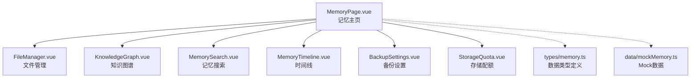
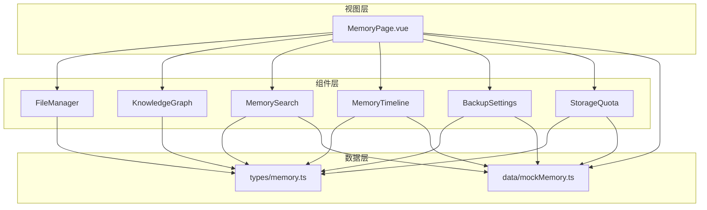
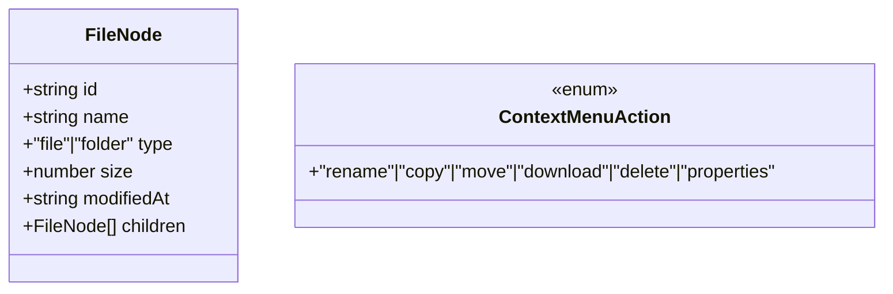
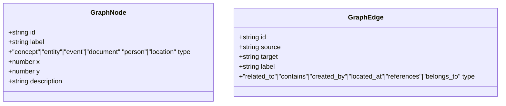
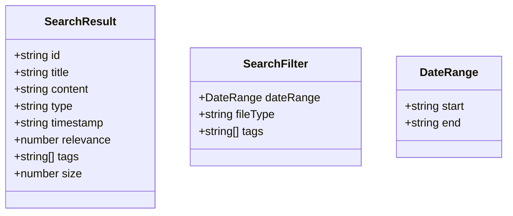
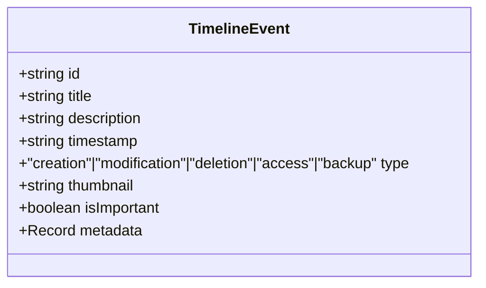
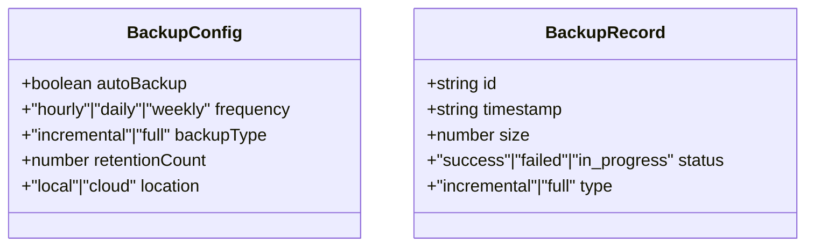
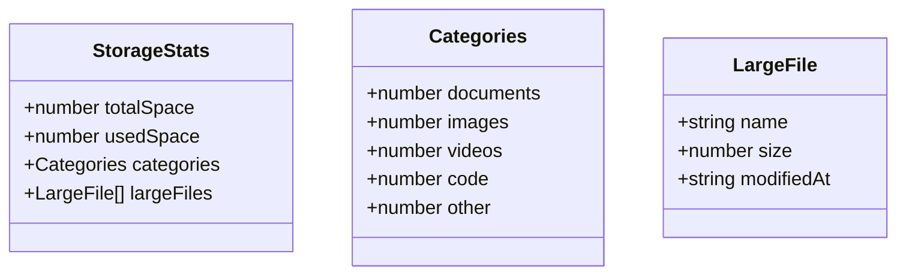
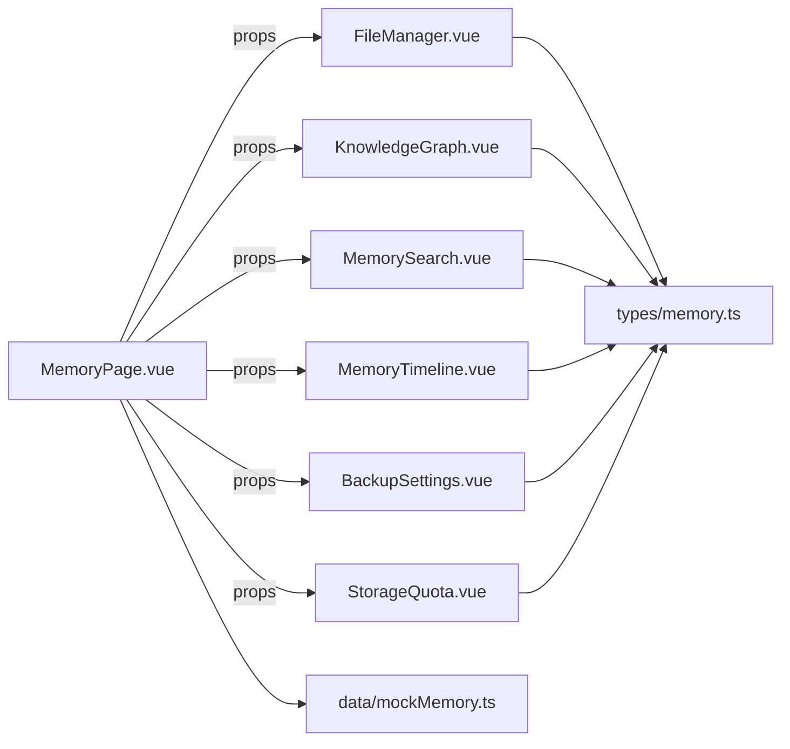

# 记忆系统

<cite>
**本文引用的文件**
- [apps/AgentPit/src/views/MemoryPage.vue](file://apps/AgentPit/src/views/MemoryPage.vue)
- [apps/AgentPit/src/data/mockMemory.ts](file://apps/AgentPit/src/data/mockMemory.ts)
- [apps/AgentPit/src/types/memory.ts](file://apps/AgentPit/src/types/memory.ts)
- [apps/AgentPit/src/components/memory/FileManager.vue](file://apps/AgentPit/src/components/memory/FileManager.vue)
- [apps/AgentPit/src/components/memory/KnowledgeGraph.vue](file://apps/AgentPit/src/components/memory/KnowledgeGraph.vue)
- [apps/AgentPit/src/components/memory/MemorySearch.vue](file://apps/AgentPit/src/components/memory/MemorySearch.vue)
- [apps/AgentPit/src/components/memory/MemoryTimeline.vue](file://apps/AgentPit/src/components/memory/MemoryTimeline.vue)
- [apps/AgentPit/src/components/memory/BackupSettings.vue](file://apps/AgentPit/src/components/memory/BackupSettings.vue)
- [apps/AgentPit/src/components/memory/StorageQuota.vue](file://apps/AgentPit/src/components/memory/StorageQuota.vue)
- [apps/AgentPit/src/stores/index.ts](file://apps/AgentPit/src/stores/index.ts)
</cite>

## 目录
1. [简介](#简介)
2. [项目结构](#项目结构)
3. [核心组件](#核心组件)
4. [架构总览](#架构总览)
5. [详细组件分析](#详细组件分析)
6. [依赖关系分析](#依赖关系分析)
7. [性能考量](#性能考量)
8. [故障排查指南](#故障排查指南)
9. [结论](#结论)
10. [附录](#附录)

## 简介
本文件面向AgentPit记忆系统，围绕文件管理、知识图谱、记忆搜索、存储配额、备份与恢复等核心能力，系统化梳理前端展示层与数据模型，并给出可扩展到真实后端的架构建议与优化策略。当前仓库中记忆系统以视图页与Mock数据为主，本文在不直接展示代码内容的前提下，基于现有源码路径与类型定义，提供可落地的实现蓝图与最佳实践。

## 项目结构
AgentPit记忆系统位于前端应用中，采用视图页聚合多个子组件的方式组织功能：
- 视图页负责Tab导航、统计概览与子组件的按需渲染与缓存
- 子组件分别承载文件管理、知识图谱、记忆搜索、时间线、备份设置、存储配额等能力
- 数据模型与Mock数据集中于types与data目录，便于组件间共享与测试

图表来源
- [apps/AgentPit/src/views/MemoryPage.vue:1-280](file://apps/AgentPit/src/views/MemoryPage.vue#L1-L280)
- [apps/AgentPit/src/components/memory/FileManager.vue](file://apps/AgentPit/src/components/memory/FileManager.vue)
- [apps/AgentPit/src/components/memory/KnowledgeGraph.vue](file://apps/AgentPit/src/components/memory/KnowledgeGraph.vue)
- [apps/AgentPit/src/components/memory/MemorySearch.vue](file://apps/AgentPit/src/components/memory/MemorySearch.vue)
- [apps/AgentPit/src/components/memory/MemoryTimeline.vue](file://apps/AgentPit/src/components/memory/MemoryTimeline.vue)
- [apps/AgentPit/src/components/memory/BackupSettings.vue](file://apps/AgentPit/src/components/memory/BackupSettings.vue)
- [apps/AgentPit/src/components/memory/StorageQuota.vue](file://apps/AgentPit/src/components/memory/StorageQuota.vue)
- [apps/AgentPit/src/types/memory.ts:1-89](file://apps/AgentPit/src/types/memory.ts#L1-L89)
- [apps/AgentPit/src/data/mockMemory.ts:1-754](file://apps/AgentPit/src/data/mockMemory.ts#L1-L754)

章节来源
- [apps/AgentPit/src/views/MemoryPage.vue:1-280](file://apps/AgentPit/src/views/MemoryPage.vue#L1-L280)

## 核心组件
- 文件管理：树形文件结构展示、上下文菜单、文件属性与批量操作
- 知识图谱：概念/实体/事件/文档/人物/地点等节点与关系边的可视化
- 记忆搜索：全文检索、时间范围/类型/标签过滤、结果高亮与排序
- 时间线：按时间轴展示创建/修改/删除/访问/备份等事件
- 备份设置：自动备份开关、频率、全量/增量、保留份数、本地/云端
- 存储配额：总容量、已用量、分类统计、大文件清单

章节来源
- [apps/AgentPit/src/views/MemoryPage.vue:19-31](file://apps/AgentPit/src/views/MemoryPage.vue#L19-L31)
- [apps/AgentPit/src/data/mockMemory.ts:10-185](file://apps/AgentPit/src/data/mockMemory.ts#L10-L185)
- [apps/AgentPit/src/data/mockMemory.ts:187-315](file://apps/AgentPit/src/data/mockMemory.ts#L187-L315)
- [apps/AgentPit/src/data/mockMemory.ts:317-670](file://apps/AgentPit/src/data/mockMemory.ts#L317-L670)
- [apps/AgentPit/src/data/mockMemory.ts:672-753](file://apps/AgentPit/src/data/mockMemory.ts#L672-L753)
- [apps/AgentPit/src/types/memory.ts:1-89](file://apps/AgentPit/src/types/memory.ts#L1-L89)

## 架构总览
记忆系统采用“视图页聚合+组件化”的前端架构，数据流自上而下传递，组件职责清晰：
- 视图页负责状态与Tab切换、统计计算、子组件缓存
- 子组件消费types定义的数据结构，渲染UI并与用户交互
- Mock数据用于演示与测试，便于后续替换为真实API

图表来源
- [apps/AgentPit/src/views/MemoryPage.vue:1-280](file://apps/AgentPit/src/views/MemoryPage.vue#L1-L280)
- [apps/AgentPit/src/types/memory.ts:1-89](file://apps/AgentPit/src/types/memory.ts#L1-L89)
- [apps/AgentPit/src/data/mockMemory.ts:1-754](file://apps/AgentPit/src/data/mockMemory.ts#L1-L754)

## 详细组件分析

### 文件管理组件
- 功能要点
  - 展示树形文件结构，支持文件夹与文件节点
  - 上下文菜单动作：重命名、复制、移动、下载、删除、属性
  - 支持文件大小、修改时间等元信息显示
- 数据模型
  - FileNode：id/name/type/size/modifiedAt/children
  - ContextMenuAction：动作枚举
- 性能与体验
  - 使用虚拟滚动或分页处理大量文件
  - 异步加载子节点，避免一次性渲染整棵树
  - 增加加载态与骨架屏

图表来源
- [apps/AgentPit/src/types/memory.ts:1-8](file://apps/AgentPit/src/types/memory.ts#L1-L8)
- [apps/AgentPit/src/types/memory.ts:10-10](file://apps/AgentPit/src/types/memory.ts#L10-L10)

章节来源
- [apps/AgentPit/src/types/memory.ts:1-8](file://apps/AgentPit/src/types/memory.ts#L1-L8)
- [apps/AgentPit/src/data/mockMemory.ts:10-185](file://apps/AgentPit/src/data/mockMemory.ts#L10-L185)

### 知识图谱组件
- 功能要点
  - 可视化节点与边，支持拖拽、缩放、点击高亮
  - 节点类型：概念、实体、事件、文档、人物、地点
  - 边类型：相关、包含、创建者、所在地、引用、归属
- 数据模型
  - GraphNode：id/label/type/x/y/description
  - GraphEdge：id/source/target/label/type
- 可扩展性
  - 后端返回节点/边集合，前端渲染引擎（如D3/ForceGraph）驱动
  - 支持图算法（社区发现、中心性分析）增强检索

图表来源
- [apps/AgentPit/src/types/memory.ts:12-27](file://apps/AgentPit/src/types/memory.ts#L12-L27)

章节来源
- [apps/AgentPit/src/types/memory.ts:12-27](file://apps/AgentPit/src/types/memory.ts#L12-L27)
- [apps/AgentPit/src/data/mockMemory.ts:187-315](file://apps/AgentPit/src/data/mockMemory.ts#L187-L315)

### 记忆搜索组件
- 功能要点
  - 搜索输入、过滤器（日期范围、文件类型、标签）、结果列表
  - 结果项包含标题、摘要、时间戳、相关度、标签、大小
- 数据模型
  - SearchResult：id/title/content/type/timestamp/relevance/tags/size
  - SearchFilter：dateRange/fileType/tags
- 检索策略建议
  - 前端：关键词分词、模糊匹配、相关度评分、分页加载
  - 后端：向量检索（嵌入相似度）、BM25混合、倒排索引、缓存热点

图表来源
- [apps/AgentPit/src/types/memory.ts:29-44](file://apps/AgentPit/src/types/memory.ts#L29-L44)

章节来源
- [apps/AgentPit/src/types/memory.ts:29-44](file://apps/AgentPit/src/types/memory.ts#L29-L44)
- [apps/AgentPit/src/data/mockMemory.ts:317-670](file://apps/AgentPit/src/data/mockMemory.ts#L317-L670)

### 时间线组件
- 功能要点
  - 按时间轴展示事件，支持重要事件标记与缩略图
  - 事件类型：创建、修改、删除、访问、备份
- 数据模型
  - TimelineEvent：id/title/description/timestamp/type/thumbnail/isImportant/metadata

图表来源
- [apps/AgentPit/src/types/memory.ts:46-55](file://apps/AgentPit/src/types/memory.ts#L46-L55)

章节来源
- [apps/AgentPit/src/types/memory.ts:46-55](file://apps/AgentPit/src/types/memory.ts#L46-L55)
- [apps/AgentPit/src/data/mockMemory.ts:317-670](file://apps/AgentPit/src/data/mockMemory.ts#L317-L670)

### 备份设置组件
- 功能要点
  - 自动备份开关、备份频率（小时/日/周）、备份类型（增量/全量）
  - 保留份数、备份位置（本地/云端）
  - 备份历史记录：时间戳、大小、状态、类型
- 数据模型
  - BackupConfig：autoBackup/frequency/backupType/retentionCount/location
  - BackupRecord：id/timestamp/size/status/type

图表来源
- [apps/AgentPit/src/types/memory.ts:57-71](file://apps/AgentPit/src/types/memory.ts#L57-L71)

章节来源
- [apps/AgentPit/src/types/memory.ts:57-71](file://apps/AgentPit/src/types/memory.ts#L57-L71)
- [apps/AgentPit/src/data/mockMemory.ts:672-729](file://apps/AgentPit/src/data/mockMemory.ts#L672-L729)

### 存储配额组件
- 功能要点
  - 总容量、已用空间、使用率统计
  - 分类统计：文档/图片/视频/代码/其他
  - 大文件清单：名称、大小、修改时间
- 数据模型
  - StorageStats：totalSpace/usedSpace/categories/largeFiles

图表来源
- [apps/AgentPit/src/types/memory.ts:73-88](file://apps/AgentPit/src/types/memory.ts#L73-L88)

章节来源
- [apps/AgentPit/src/types/memory.ts:73-88](file://apps/AgentPit/src/types/memory.ts#L73-L88)
- [apps/AgentPit/src/data/mockMemory.ts:731-753](file://apps/AgentPit/src/data/mockMemory.ts#L731-L753)

### 记忆API接口与数据导入导出
- 接口建议
  - 文件管理：获取树形结构、创建/删除/移动/重命名、批量操作
  - 知识图谱：查询节点/边、图快照、图更新
  - 记忆搜索：关键词搜索、过滤器、分页、相关度排序
  - 时间线：事件查询、时间范围筛选
  - 备份：创建备份任务、查询备份历史、恢复
  - 存储配额：统计信息、分类与大文件清单
- 数据导入导出
  - 导入：支持批量上传、结构化数据（JSON/CSV）解析
  - 导出：按筛选条件导出、压缩打包
- 备份与恢复
  - 增量/全量策略、保留策略、跨云/本地存储
  - 恢复校验、冲突处理、回滚机制

[本节为概念性说明，不直接分析具体文件，故无章节来源]

## 依赖关系分析
- 组件耦合
  - MemoryPage作为聚合层，通过props向下传递数据，降低组件间耦合
  - 子组件依赖types定义的数据契约，便于替换实现
- 数据依赖
  - Mock数据集中于data/mockMemory.ts，便于测试与演示
  - Store层使用Pinia持久化插件，适合短期状态持久化
- 外部依赖
  - 图表渲染可选D3/ForceGraph等；搜索可结合向量库或全文检索引擎

图表来源
- [apps/AgentPit/src/views/MemoryPage.vue:1-280](file://apps/AgentPit/src/views/MemoryPage.vue#L1-L280)
- [apps/AgentPit/src/types/memory.ts:1-89](file://apps/AgentPit/src/types/memory.ts#L1-L89)
- [apps/AgentPit/src/data/mockMemory.ts:1-754](file://apps/AgentPit/src/data/mockMemory.ts#L1-L754)

章节来源
- [apps/AgentPit/src/stores/index.ts:1-15](file://apps/AgentPit/src/stores/index.ts#L1-L15)

## 性能考量
- 渲染性能
  - 文件树与搜索结果列表使用虚拟滚动或分页
  - KeepAlive缓存Tab组件，减少重复渲染
- 搜索性能
  - 前端：关键词分词、相关度评分、结果缓存
  - 后端：向量检索、倒排索引、布隆过滤器预筛
- 存储与IO
  - 大文件分块上传/断点续传
  - 分类存储与冷热分层
- 并发与一致性
  - 请求去抖与节流
  - 乐观更新与失败重试

[本节提供通用指导，不直接分析具体文件，故无章节来源]

## 故障排查指南
- 常见问题
  - Tab切换闪烁：确认KeepAlive与过渡动画配置
  - 搜索无结果：检查过滤器与Mock数据是否匹配
  - 备份失败：核对备份类型、保留策略与存储位置
- 调试建议
  - 打开浏览器开发者工具，观察网络请求与组件状态
  - 使用Pinia DevTools检查store状态
  - 对接后端时开启请求日志与错误捕获

[本节为通用指导，不直接分析具体文件，故无章节来源]

## 结论
AgentPit记忆系统以视图页聚合组件的方式，清晰划分了文件管理、知识图谱、记忆搜索、时间线、备份与存储配额等模块。当前以Mock数据与类型定义为主，具备良好的扩展性。建议后续对接真实后端，完善搜索与图谱的算法能力，并在性能与可靠性方面持续优化。

## 附录
- 知识图谱构建示例
  - 节点：概念（如“机器学习”）、实体（如“TensorFlow”）、事件（如“AlphaGo”）、文档（如“ImageNet”）、人物（如“Geoffrey Hinton”）、地点（如“多伦多大学”）
  - 边：包含、相关、创建者、所在地、引用、归属等
- 搜索查询优化方法
  - 关键词分词与同义词扩展
  - 时间与标签过滤组合
  - 相关度评分与结果重排
- 文件分类管理与元数据提取
  - 基于扩展名与MIME类型分类
  - 提取修改时间、大小、标签等元数据
  - 智能标签：关键词抽取、命名实体识别
- 大规模知识存储的性能瓶颈与检索效率
  - 索引与缓存双层优化
  - 向量化检索与混合检索
  - 分布式存储与读写分离

[本节为概念性说明，不直接分析具体文件，故无章节来源]