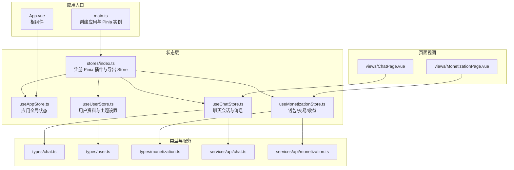
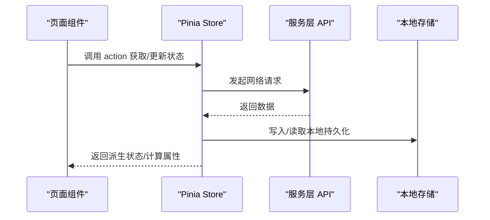
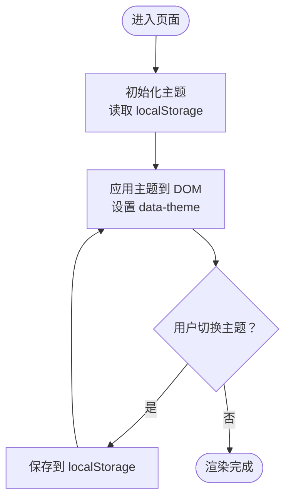
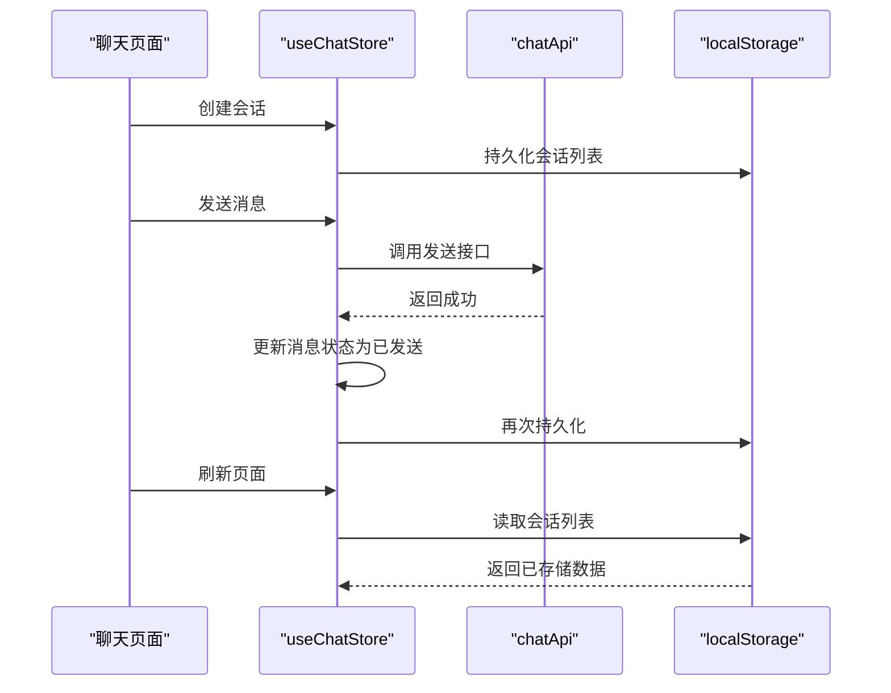
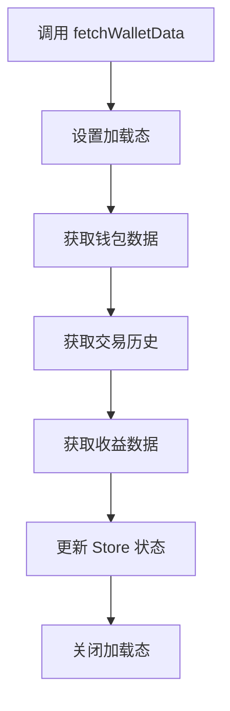
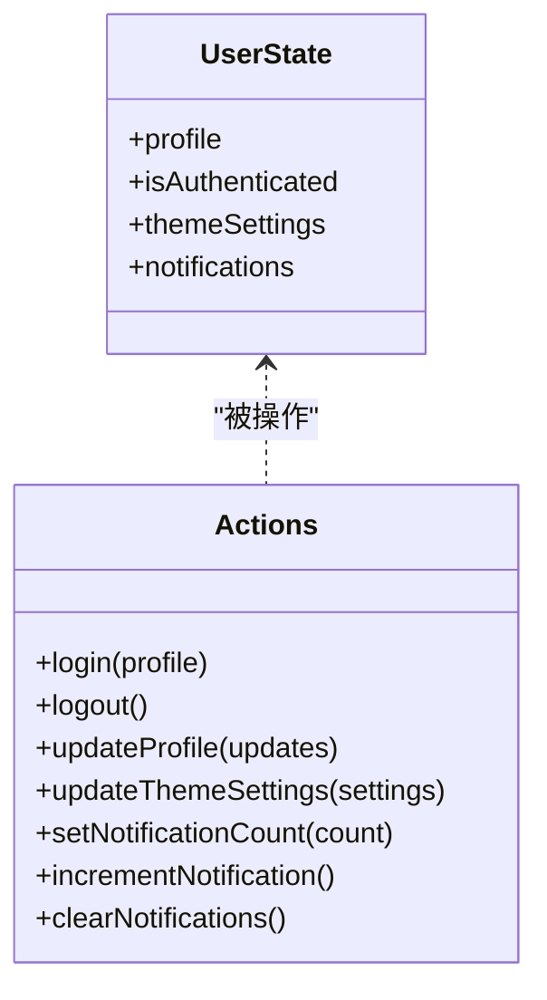
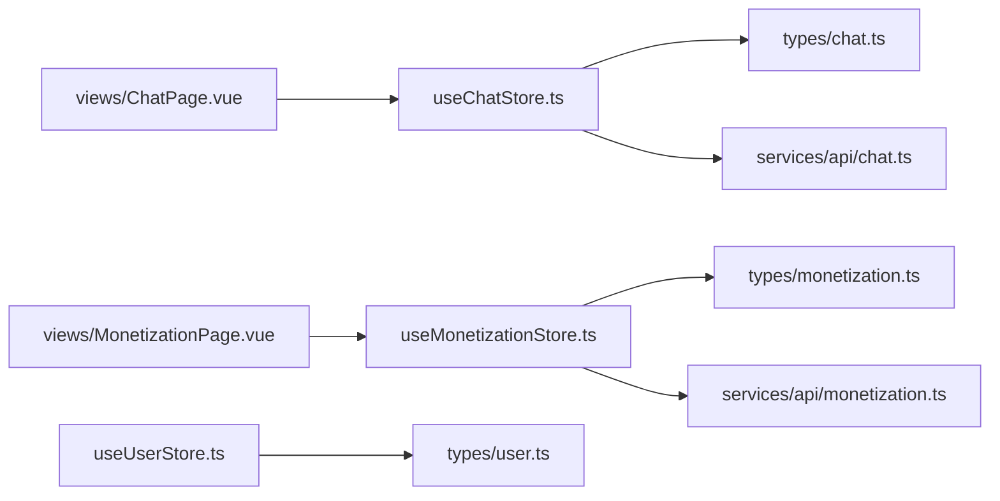

# 状态管理系统

<cite>
**本文引用的文件**
- [apps/AgentPit/src/main.ts](file://apps/AgentPit/src/main.ts)
- [apps/AgentPit/src/stores/index.ts](file://apps/AgentPit/src/stores/index.ts)
- [apps/AgentPit/src/stores/useAppStore.ts](file://apps/AgentPit/src/stores/useAppStore.ts)
- [apps/AgentPit/src/stores/useChatStore.ts](file://apps/AgentPit/src/stores/useChatStore.ts)
- [apps/AgentPit/src/stores/useMonetizationStore.ts](file://apps/AgentPit/src/stores/useMonetizationStore.ts)
- [apps/AgentPit/src/stores/useUserStore.ts](file://apps/AgentPit/src/stores/useUserStore.ts)
- [apps/AgentPit/src/types/chat.ts](file://apps/AgentPit/src/types/chat.ts)
- [apps/AgentPit/src/types/user.ts](file://apps/AgentPit/src/types/user.ts)
- [apps/AgentPit/src/types/monetization.ts](file://apps/AgentPit/src/types/monetization.ts)
- [apps/AgentPit/src/services/api/chat.ts](file://apps/AgentPit/src/services/api/chat.ts)
- [apps/AgentPit/src/services/api/monetization.ts](file://apps/AgentPit/src/services/api/monetization.ts)
- [apps/AgentPit/src/views/ChatPage.vue](file://apps/AgentPit/src/views/ChatPage.vue)
- [apps/AgentPit/src/views/MonetizationPage.vue](file://apps/AgentPit/src/views/MonetizationPage.vue)
- [apps/AgentPit/src/App.vue](file://apps/AgentPit/src/App.vue)
</cite>

## 目录
1. [引言](#引言)
2. [项目结构](#项目结构)
3. [核心组件](#核心组件)
4. [架构总览](#架构总览)
5. [详细组件分析](#详细组件分析)
6. [依赖关系分析](#依赖关系分析)
7. [性能考量](#性能考量)
8. [故障排除指南](#故障排除指南)
9. [结论](#结论)
10. [附录](#附录)

## 引言
本文件面向 AgentPit 的状态管理系统，围绕 Pinia Store 的设计与实现进行深入解析，覆盖应用状态、聊天状态、变现状态、用户状态等核心 Store 的职责边界、数据结构、状态持久化策略与状态同步机制。文档同时提供数据流控制、组件间通信方式、最佳实践、性能优化建议以及调试与故障排除指南，帮助开发者快速理解并高效维护该状态体系。

## 项目结构
AgentPit 的前端采用 Vue 3 + Pinia 架构，状态管理集中于 src/stores 目录，配合 src/types 定义类型约束，通过 src/services/api 封装外部数据访问。应用入口在 src/main.ts 中初始化 Pinia，并在各页面视图中按需注入与使用 Store。

图表来源
- [apps/AgentPit/src/main.ts:1-13](file://apps/AgentPit/src/main.ts#L1-L13)
- [apps/AgentPit/src/stores/index.ts:1-15](file://apps/AgentPit/src/stores/index.ts#L1-L15)
- [apps/AgentPit/src/stores/useAppStore.ts:1-89](file://apps/AgentPit/src/stores/useAppStore.ts#L1-L89)
- [apps/AgentPit/src/stores/useChatStore.ts:1-218](file://apps/AgentPit/src/stores/useChatStore.ts#L1-L218)
- [apps/AgentPit/src/stores/useMonetizationStore.ts:1-153](file://apps/AgentPit/src/stores/useMonetizationStore.ts#L1-L153)
- [apps/AgentPit/src/stores/useUserStore.ts:1-72](file://apps/AgentPit/src/stores/useUserStore.ts#L1-L72)
- [apps/AgentPit/src/types/chat.ts:1-151](file://apps/AgentPit/src/types/chat.ts#L1-L151)
- [apps/AgentPit/src/types/user.ts:1-200](file://apps/AgentPit/src/types/user.ts#L1-L200)
- [apps/AgentPit/src/types/monetization.ts:1-135](file://apps/AgentPit/src/types/monetization.ts#L1-L135)
- [apps/AgentPit/src/services/api/chat.ts:1-18](file://apps/AgentPit/src/services/api/chat.ts#L1-L18)
- [apps/AgentPit/src/services/api/monetization.ts:1-59](file://apps/AgentPit/src/services/api/monetization.ts#L1-L59)
- [apps/AgentPit/src/views/ChatPage.vue:1-8](file://apps/AgentPit/src/views/ChatPage.vue#L1-L8)
- [apps/AgentPit/src/views/MonetizationPage.vue:1-92](file://apps/AgentPit/src/views/MonetizationPage.vue#L1-L92)

章节来源
- [apps/AgentPit/src/main.ts:1-13](file://apps/AgentPit/src/main.ts#L1-L13)
- [apps/AgentPit/src/stores/index.ts:1-15](file://apps/AgentPit/src/stores/index.ts#L1-L15)

## 核心组件
本节概述四个核心 Store 的职责与关键能力：
- 应用状态 Store（useAppStore）
  - 负责全局 UI 状态（侧边栏、移动端侧边栏、主题）、加载态与当前页面路径。
  - 提供主题切换与应用级持久化（仅持久化部分字段）。
- 聊天状态 Store（useChatStore）
  - 管理会话列表、当前会话、消息列表、流式输出状态与最近上下文提取。
  - 提供会话 CRUD、消息增删改、本地持久化与远程数据拉取。
- 变现状态 Store（useMonetizationStore）
  - 管理钱包余额、交易记录、收益曲线与加载态。
  - 提供钱包数据拉取、提现流程与实时余额更新。
- 用户状态 Store（useUserStore）
  - 管理用户资料、认证状态、主题设置与通知计数。
  - 提供登录/登出、资料更新与主题设置更新。

章节来源
- [apps/AgentPit/src/stores/useAppStore.ts:1-89](file://apps/AgentPit/src/stores/useAppStore.ts#L1-L89)
- [apps/AgentPit/src/stores/useChatStore.ts:1-218](file://apps/AgentPit/src/stores/useChatStore.ts#L1-L218)
- [apps/AgentPit/src/stores/useMonetizationStore.ts:1-153](file://apps/AgentPit/src/stores/useMonetizationStore.ts#L1-L153)
- [apps/AgentPit/src/stores/useUserStore.ts:1-72](file://apps/AgentPit/src/stores/useUserStore.ts#L1-L72)

## 架构总览
下图展示状态管理在运行时的整体交互：页面组件通过组合式函数获取 Store 实例，Store 在内部调用服务层 API 获取或写入数据，同时维护本地状态与持久化。

图表来源
- [apps/AgentPit/src/views/ChatPage.vue:1-8](file://apps/AgentPit/src/views/ChatPage.vue#L1-L8)
- [apps/AgentPit/src/views/MonetizationPage.vue:1-92](file://apps/AgentPit/src/views/MonetizationPage.vue#L1-L92)
- [apps/AgentPit/src/stores/useChatStore.ts:176-216](file://apps/AgentPit/src/stores/useChatStore.ts#L176-L216)
- [apps/AgentPit/src/stores/useMonetizationStore.ts:66-112](file://apps/AgentPit/src/stores/useMonetizationStore.ts#L66-L112)
- [apps/AgentPit/src/services/api/chat.ts:1-18](file://apps/AgentPit/src/services/api/chat.ts#L1-L18)
- [apps/AgentPit/src/services/api/monetization.ts:1-59](file://apps/AgentPit/src/services/api/monetization.ts#L1-L59)

## 详细组件分析

### 应用状态 Store（useAppStore）
- 数据结构
  - 字段：侧边栏开关、移动端侧边栏开关、主题模式、加载态、当前页面路径。
  - 主题模式支持“浅色/深色/系统”，系统模式根据系统配色偏好动态切换。
- 关键能力
  - 主题切换与应用：提供切换与设置方法，并在 DOM 上应用 data-theme 属性。
  - 加载态与页面路径：统一管理全局加载态与当前路由路径。
- 持久化策略
  - 使用 Pinia 插件持久化，仅持久化部分字段（如侧边栏与主题），避免冗余存储。

图表来源
- [apps/AgentPit/src/stores/useAppStore.ts:11-88](file://apps/AgentPit/src/stores/useAppStore.ts#L11-L88)

章节来源
- [apps/AgentPit/src/stores/useAppStore.ts:1-89](file://apps/AgentPit/src/stores/useAppStore.ts#L1-L89)

### 聊天状态 Store（useChatStore）
- 数据结构
  - 会话数组、当前会话 ID、当前智能体、流式输出标记与消息 ID。
  - 类型定义涵盖消息、会话、智能体信息与快捷指令等。
- 关键能力
  - 会话管理：创建、激活、删除、清空；本地持久化与远程拉取。
  - 消息管理：新增、更新、流式状态标记；自动设置会话标题。
  - 上下文提取：按最近 N 轮完整对话轮次提取上下文。
  - 远程同步：通过 API 获取会话与消息列表，失败时保留本地数据并记录错误。
- 持久化策略
  - 本地持久化：将会话列表写入 localStorage，启动时尝试恢复。
  - Pinia 持久化：未启用插件持久化，因此不跨刷新持久化 Store 内容。

图表来源
- [apps/AgentPit/src/stores/useChatStore.ts:66-216](file://apps/AgentPit/src/stores/useChatStore.ts#L66-L216)
- [apps/AgentPit/src/services/api/chat.ts:1-18](file://apps/AgentPit/src/services/api/chat.ts#L1-L18)

章节来源
- [apps/AgentPit/src/stores/useChatStore.ts:1-218](file://apps/AgentPit/src/stores/useChatStore.ts#L1-L218)
- [apps/AgentPit/src/types/chat.ts:1-151](file://apps/AgentPit/src/types/chat.ts#L1-L151)

### 变现状态 Store（useMonetizationStore）
- 数据结构
  - 钱包数据（总余额、可用余额、冻结余额、货币）、交易记录、收益曲线与加载态。
  - 类型定义涵盖货币、交易类型/状态、交易分类、提现方式等。
- 关键能力
  - 钱包数据：从 API 拉取钱包、交易与收益数据，映射为 Store 结构。
  - 提现流程：提交提现请求，更新可用余额并添加交易记录。
  - 实时更新：提供实时余额更新方法，便于外部驱动。
- 持久化策略
  - 未启用 Pinia 持久化；钱包与交易数据主要来自远端 API，本地不持久化。

图表来源
- [apps/AgentPit/src/stores/useMonetizationStore.ts:66-112](file://apps/AgentPit/src/stores/useMonetizationStore.ts#L66-L112)
- [apps/AgentPit/src/services/api/monetization.ts:1-59](file://apps/AgentPit/src/services/api/monetization.ts#L1-L59)

章节来源
- [apps/AgentPit/src/stores/useMonetizationStore.ts:1-153](file://apps/AgentPit/src/stores/useMonetizationStore.ts#L1-L153)
- [apps/AgentPit/src/types/monetization.ts:1-135](file://apps/AgentPit/src/types/monetization.ts#L1-L135)

### 用户状态 Store（useUserStore）
- 数据结构
  - 用户资料、认证状态、主题设置、通知计数。
  - 主题设置包含模式、主色、字号、布局密度、侧边栏模式与动效设置。
- 关键能力
  - 登录/登出：设置认证状态与用户资料；登出清理用户持久化。
  - 资料与主题设置更新：支持部分字段更新。
  - 通知管理：计数、递增与清空。
- 持久化策略
  - 使用 Pinia 插件持久化，仅持久化主题设置，避免存储敏感信息。

图表来源
- [apps/AgentPit/src/stores/useUserStore.ts:11-71](file://apps/AgentPit/src/stores/useUserStore.ts#L11-L71)

章节来源
- [apps/AgentPit/src/stores/useUserStore.ts:1-72](file://apps/AgentPit/src/stores/useUserStore.ts#L1-L72)
- [apps/AgentPit/src/types/user.ts:1-200](file://apps/AgentPit/src/types/user.ts#L1-L200)

## 依赖关系分析
- Store 与类型
  - useChatStore 依赖 chat.ts 类型，确保消息、会话、智能体等结构一致。
  - useMonetizationStore 依赖 monetization.ts 类型，保证钱包、交易、收益模型稳定。
  - useUserStore 依赖 user.ts 类型，规范用户资料与主题设置。
- Store 与服务
  - useChatStore 通过 chat.ts 的 chatApi 访问会话与消息数据。
  - useMonetizationStore 通过 monetization.ts 的 monetizationApi 访问钱包、交易与收益数据。
- 页面与 Store
  - ChatPage.vue 与 MonetizationPage.vue 分别注入对应 Store，实现数据驱动渲染与交互。

图表来源
- [apps/AgentPit/src/stores/useChatStore.ts:1-218](file://apps/AgentPit/src/stores/useChatStore.ts#L1-L218)
- [apps/AgentPit/src/stores/useMonetizationStore.ts:1-153](file://apps/AgentPit/src/stores/useMonetizationStore.ts#L1-L153)
- [apps/AgentPit/src/stores/useUserStore.ts:1-72](file://apps/AgentPit/src/stores/useUserStore.ts#L1-L72)
- [apps/AgentPit/src/types/chat.ts:1-151](file://apps/AgentPit/src/types/chat.ts#L1-L151)
- [apps/AgentPit/src/types/monetization.ts:1-135](file://apps/AgentPit/src/types/monetization.ts#L1-L135)
- [apps/AgentPit/src/types/user.ts:1-200](file://apps/AgentPit/src/types/user.ts#L1-L200)
- [apps/AgentPit/src/services/api/chat.ts:1-18](file://apps/AgentPit/src/services/api/chat.ts#L1-L18)
- [apps/AgentPit/src/services/api/monetization.ts:1-59](file://apps/AgentPit/src/services/api/monetization.ts#L1-L59)
- [apps/AgentPit/src/views/ChatPage.vue:1-8](file://apps/AgentPit/src/views/ChatPage.vue#L1-L8)
- [apps/AgentPit/src/views/MonetizationPage.vue:1-92](file://apps/AgentPit/src/views/MonetizationPage.vue#L1-L92)

章节来源
- [apps/AgentPit/src/stores/useChatStore.ts:1-218](file://apps/AgentPit/src/stores/useChatStore.ts#L1-L218)
- [apps/AgentPit/src/stores/useMonetizationStore.ts:1-153](file://apps/AgentPit/src/stores/useMonetizationStore.ts#L1-L153)
- [apps/AgentPit/src/stores/useUserStore.ts:1-72](file://apps/AgentPit/src/stores/useUserStore.ts#L1-L72)

## 性能考量
- 状态粒度与响应式开销
  - 将大对象拆分为多个 Store（应用、聊天、变现、用户），降低无关状态变更对渲染的影响。
- 持久化策略
  - useAppStore 与 useUserStore 使用 Pinia 持久化，仅持久化必要字段，避免存储敏感或冗余数据。
  - useChatStore 采用 localStorage 本地持久化，注意序列化/反序列化成本与存储上限。
- 异步与加载态
  - 变现 Store 在数据拉取期间设置加载态，避免重复请求与闪烁。
- 渲染优化
  - 页面组件通过计算属性与派生状态（如聊天上下文、用户名称/头像）减少重复计算。
- 建议
  - 对高频更新的状态（如聊天流式输出）可考虑分页或节流策略。
  - 对聊天消息列表过长场景，建议引入虚拟滚动与懒加载。

## 故障排除指南
- 聊天会话无法恢复
  - 检查本地存储键名与序列化格式，确认异常捕获与降级逻辑。
  - 参考路径：[apps/AgentPit/src/stores/useChatStore.ts:165-174](file://apps/AgentPit/src/stores/useChatStore.ts#L165-L174)
- 提现失败或余额不同步
  - 确认提现接口返回与余额更新顺序，检查异常抛出与错误日志。
  - 参考路径：[apps/AgentPit/src/stores/useMonetizationStore.ts:114-142](file://apps/AgentPit/src/stores/useMonetizationStore.ts#L114-L142)
- 主题切换无效
  - 确认 DOM 上 data-theme 设置与样式适配，检查系统主题监听与本地存储读取。
  - 参考路径：[apps/AgentPit/src/stores/useAppStore.ts:49-72](file://apps/AgentPit/src/stores/useAppStore.ts#L49-L72)
- 登录后主题设置丢失
  - 确认 Pinia 持久化插件生效与 pick 字段正确。
  - 参考路径：[apps/AgentPit/src/stores/index.ts:1-15](file://apps/AgentPit/src/stores/index.ts#L1-L15), [apps/AgentPit/src/stores/useUserStore.ts:66-71](file://apps/AgentPit/src/stores/useUserStore.ts#L66-L71)

章节来源
- [apps/AgentPit/src/stores/useChatStore.ts:165-174](file://apps/AgentPit/src/stores/useChatStore.ts#L165-L174)
- [apps/AgentPit/src/stores/useMonetizationStore.ts:114-142](file://apps/AgentPit/src/stores/useMonetizationStore.ts#L114-L142)
- [apps/AgentPit/src/stores/useAppStore.ts:49-72](file://apps/AgentPit/src/stores/useAppStore.ts#L49-L72)
- [apps/AgentPit/src/stores/index.ts:1-15](file://apps/AgentPit/src/stores/index.ts#L1-L15)
- [apps/AgentPit/src/stores/useUserStore.ts:66-71](file://apps/AgentPit/src/stores/useUserStore.ts#L66-L71)

## 结论
AgentPit 的状态管理体系以 Pinia 为核心，结合类型约束与服务封装，实现了清晰的职责划分与良好的扩展性。通过局部持久化与加载态管理，兼顾了用户体验与性能表现。建议在后续迭代中进一步完善聊天消息的虚拟化与缓存策略，并加强错误监控与埋点，以提升系统的稳定性与可观测性。

## 附录
- 状态管理模式与数据流控制
  - 页面组件通过组合式函数获取 Store 实例，Store 内部协调服务层与本地存储，最终驱动视图更新。
- 组件间通信
  - 通过共享 Store 实现跨组件状态共享；聊天与变现页面分别持有独立 Store，避免耦合。
- 最佳实践
  - 优先使用 getters 与计算属性，减少重复计算；对异步操作统一设置加载态；对本地持久化做好异常处理与降级。
- 状态调试
  - 使用浏览器开发工具查看 Pinia Store 状态快照；在关键 action 中添加日志；对异常分支补充错误提示。