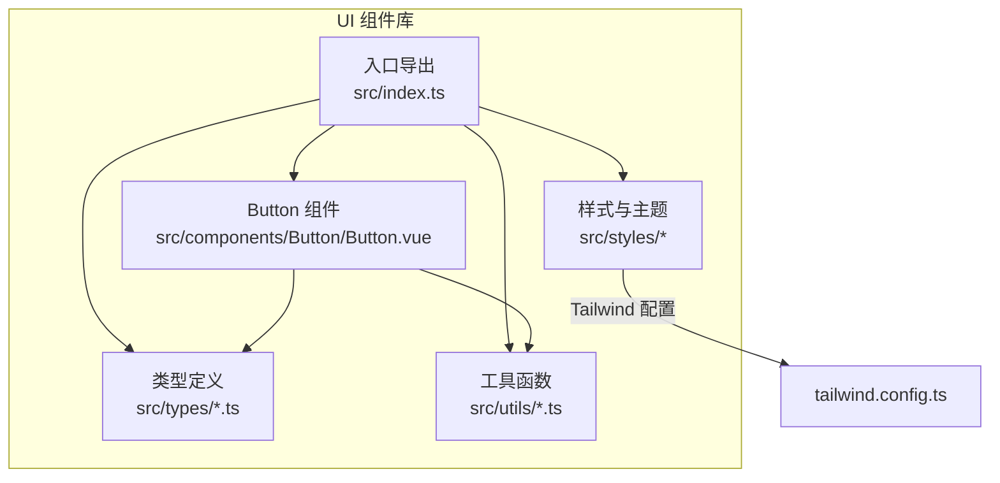
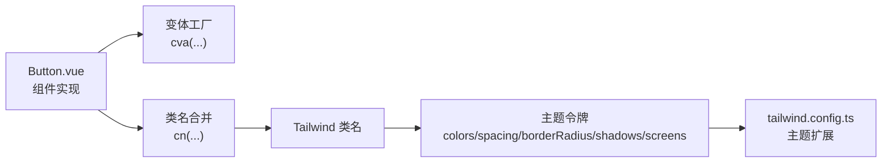
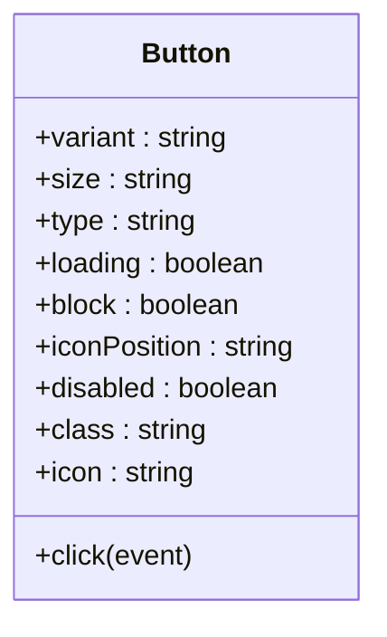
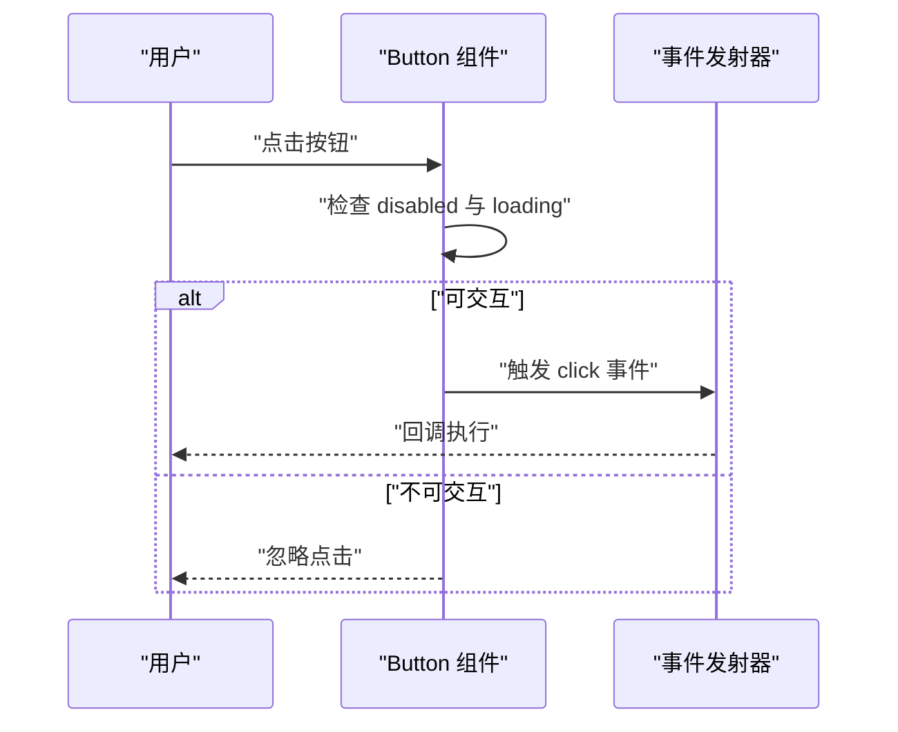
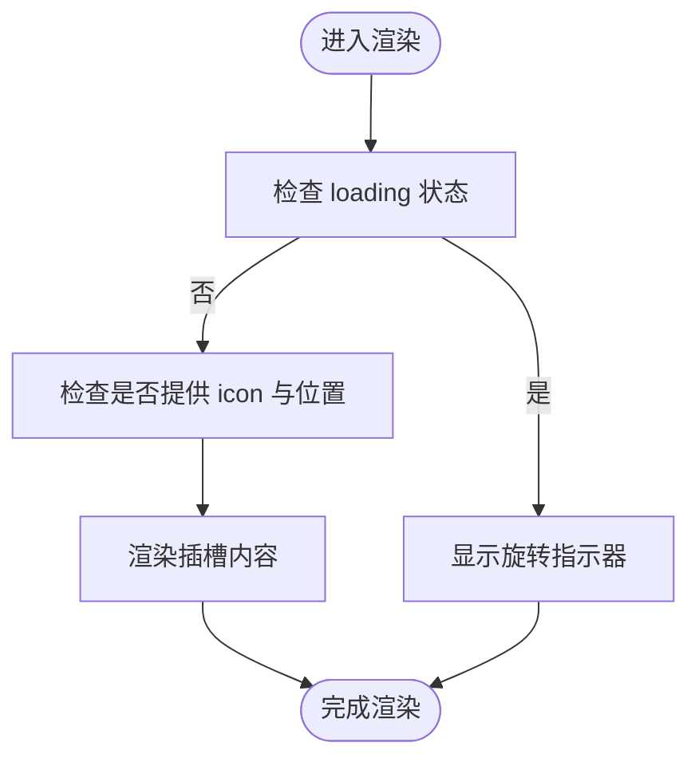
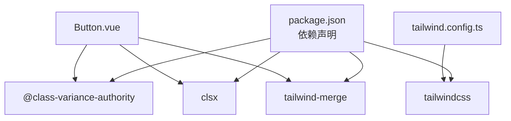

# UI组件库

<cite>
**本文引用的文件**
- [package.json](file://apps/AgentPit/packages/ui/package.json)
- [README.md](file://apps/AgentPit/packages/ui/README.md)
- [index.ts](file://apps/AgentPit/packages/ui/src/index.ts)
- [Button.vue](file://apps/AgentPit/packages/ui/src/components/Button/Button.vue)
- [tailwind.config.ts](file://apps/AgentPit/packages/ui/tailwind.config.ts)
</cite>

## 目录
1. [简介](#简介)
2. [项目结构](#项目结构)
3. [核心组件](#核心组件)
4. [架构总览](#架构总览)
5. [组件详细分析](#组件详细分析)
6. [依赖关系分析](#依赖关系分析)
7. [性能考虑](#性能考虑)
8. [故障排除指南](#故障排除指南)
9. [结论](#结论)
10. [附录](#附录)

## 简介
本文件为 AgentPit UI 组件库的技术文档，聚焦于按钮（Button）组件的视觉外观、行为与交互模式，系统性地记录其属性（Props）、事件、插槽与可定制选项，并提供响应式设计与无障碍访问的实践建议。同时覆盖组件状态、动画与过渡效果、样式自定义与主题支持、跨浏览器兼容性与性能优化策略。文档内容基于仓库中实际实现进行整理，确保与源码一致。

## 项目结构
AgentPit UI 组件库采用模块化组织方式，核心入口导出组件、组合式工具、类型与样式资源。Button 组件位于组件目录下，通过变体（variant）与尺寸（size）控制外观与布局，结合 Tailwind 主题令牌实现统一风格。

图表来源
- [index.ts:1-6](file://apps/AgentPit/packages/ui/src/index.ts#L1-L6)
- [Button.vue:1-81](file://apps/AgentPit/packages/ui/src/components/Button/Button/Button.vue#L1-L81)
- [tailwind.config.ts:1-20](file://apps/AgentPit/packages/ui/tailwind.config.ts#L1-L20)

章节来源
- [package.json:1-58](file://apps/AgentPit/packages/ui/package.json#L1-L58)
- [README.md:1-31](file://apps/AgentPit/packages/ui/README.md#L1-L31)
- [index.ts:1-6](file://apps/AgentPit/packages/ui/src/index.ts#L1-L6)

## 核心组件
本节聚焦 Button 组件，说明其视觉外观、行为与交互模式，并给出使用示例路径与最佳实践。

- 视觉外观
  - 通过变体（variant）控制主色系与边框/背景样式，支持默认、主要、次要、成功、警告、危险、描边、幽灵等八种变体。
  - 通过尺寸（size）控制内边距与文字大小，支持五档尺寸（xs、sm、md、lg、xl）。
  - 支持块级（block）宽度铺满容器，适配栅格布局。
  - 支持前置/后置图标（iconPosition），图标与文本间距由组件内部控制。
  - 加载态（loading）时显示旋转指示器，禁用态（disabled）与加载态均阻止点击事件。

- 行为与交互
  - 默认触发 click 事件；当 disabled 或 loading 为真时，点击被忽略。
  - 聚焦态具备可访问的焦点环（focus ring），提升键盘导航体验。
  - 过渡与动画：统一的过渡属性与持续时间，确保交互反馈一致。

- 插槽与自定义
  - 默认插槽承载按钮文本或内容。
  - 通过 class 属性透传额外样式类，实现细粒度定制。
  - 通过 icon 属性与 iconPosition 控制图标位置，满足多种场景。

- 使用示例
  - 基础用法与样式引入参见包说明中的示例路径。
  - 更多示例可在组件库文档站点查阅。

章节来源
- [Button.vue:1-81](file://apps/AgentPit/packages/ui/src/components/Button/Button.vue#L1-L81)
- [README.md:11-22](file://apps/AgentPit/packages/ui/README.md#L11-L22)

## 架构总览
Button 组件的实现遵循“变体驱动 + 工具函数”的设计模式：使用变体工厂生成基础样式，再通过工具函数合并类名，最终渲染到 DOM。Tailwind 主题令牌集中管理颜色、间距、圆角、阴影与断点，保证全局一致性。

图表来源
- [Button.vue:21-54](file://apps/AgentPit/packages/ui/src/components/Button/Button.vue#L21-L54)
- [tailwind.config.ts:9-16](file://apps/AgentPit/packages/ui/tailwind.config.ts#L9-L16)

## 组件详细分析

### Button 组件 API 与行为
- 属性（Props）
  - variant: 变体类型，默认值为主色；可选值包括 default、primary、secondary、success、warning、danger、outline、ghost。
  - size: 尺寸，默认中等；可选值包括 xs、sm、md、lg、xl。
  - type: 按钮类型，默认为 button；可选值包括 button、submit、reset。
  - loading: 是否处于加载态，默认 false。
  - block: 是否为块级按钮，默认 false。
  - iconPosition: 图标位置，默认左侧；可选值包括 left、right。
  - disabled: 是否禁用，默认 false。
  - class: 透传额外样式类名。
  - icon: 图标内容（字符串形式），与 iconPosition 配合决定显示位置。
  - 插槽: 默认插槽承载按钮内容。

- 事件（Events）
  - click: 点击事件，仅在非禁用且非加载状态下触发。

- 样式与主题
  - 基于变体工厂生成的类名集合，包含颜色、边框、背景、悬停与聚焦态。
  - 尺寸变体控制内边距与字体大小，确保在不同断点下的可读性与可点击区域。
  - 块级按钮通过全宽类名实现流式布局占满容器。

- 动画与过渡
  - 统一的过渡属性与持续时间，保证交互一致性。
  - 加载态使用旋转动画指示器，避免用户误操作。

- 可访问性（无障碍）
  - 聚焦态具备可见焦点环，便于键盘导航。
  - 禁用态与加载态明确反馈不可交互状态。
  - 文本与图标组合时，建议提供语义化标签或 aria-label 以增强屏幕阅读器可用性。

- 响应式设计
  - 尺寸变体与断点配置由主题令牌统一管理，确保在小屏与大屏设备上保持一致的可点击区域与可读性。
  - 建议在复杂布局中配合容器类名与网格系统使用，避免按钮过窄或过宽。

- 性能与兼容性
  - 使用计算属性缓存类名结果，减少重复计算。
  - 事件处理在点击时进行条件判断，避免无效调用。
  - 通过 Tailwind 的原子类与主题令牌，降低运行时样式计算成本。
  - 兼容性方面，现代浏览器对 SVG 与 CSS 动画支持良好；如需兼容旧版浏览器，建议在构建阶段启用必要的 polyfill 与转译。

- 使用示例
  - 基础按钮与样式引入示例参见包说明中的示例路径。
  - 更多示例与变体组合可在组件库文档站点查阅。

章节来源
- [Button.vue:7-15](file://apps/AgentPit/packages/ui/src/components/Button/Button.vue#L7-L15)
- [Button.vue:17-19](file://apps/AgentPit/packages/ui/src/components/Button/Button.vue#L17-L19)
- [Button.vue:21-48](file://apps/AgentPit/packages/ui/src/components/Button/Button.vue#L21-L48)
- [Button.vue:50-54](file://apps/AgentPit/packages/ui/src/components/Button/Button.vue#L50-L54)
- [Button.vue:56-60](file://apps/AgentPit/packages/ui/src/components/Button/Button.vue#L56-L60)
- [Button.vue:63-80](file://apps/AgentPit/packages/ui/src/components/Button/Button.vue#L63-L80)
- [README.md:11-22](file://apps/AgentPit/packages/ui/README.md#L11-L22)

### Button 组件类关系图

图表来源
- [Button.vue:7-15](file://apps/AgentPit/packages/ui/src/components/Button/Button.vue#L7-L15)
- [Button.vue:17-19](file://apps/AgentPit/packages/ui/src/components/Button/Button.vue#L17-L19)

### Button 组件交互序列图

图表来源
- [Button.vue:56-60](file://apps/AgentPit/packages/ui/src/components/Button/Button.vue#L56-L60)

### Button 组件渲染流程图

图表来源
- [Button.vue:63-80](file://apps/AgentPit/packages/ui/src/components/Button/Button.vue#L63-L80)

## 依赖关系分析
- 组件依赖
  - Vue 3 响应式系统与脚本组合式 API。
  - class-variance-authority 提供变体工厂能力，实现类名的条件组合。
  - clsx 与 tailwind-merge 提供类名合并与冲突消解。
  - Tailwind CSS 作为原子样式系统，提供主题令牌与断点支持。

- 外部集成点
  - Tailwind 配置通过主题令牌扩展颜色、间距、圆角、阴影与断点，确保组件风格与应用一致。
  - 包导出入口统一暴露组件、类型与样式资源，便于按需引入与打包优化。

图表来源
- [package.json:34-38](file://apps/AgentPit/packages/ui/package.json#L34-L38)
- [Button.vue:3-4](file://apps/AgentPit/packages/ui/src/components/Button/Button.vue#L3-L4)
- [tailwind.config.ts:1-20](file://apps/AgentPit/packages/ui/tailwind.config.ts#L1-L20)

章节来源
- [package.json:31-38](file://apps/AgentPit/packages/ui/package.json#L31-L38)
- [tailwind.config.ts:1-20](file://apps/AgentPit/packages/ui/tailwind.config.ts#L1-L20)

## 性能考虑
- 渲染优化
  - 使用计算属性缓存类名结果，避免每次渲染重复计算。
  - 条件渲染图标与加载指示器，减少不必要的 DOM 更新。
- 样式优化
  - 通过原子类与主题令牌，减少自定义样式的体积与复杂度。
  - 合理使用过渡与动画，避免过度复杂的 CSS 动画影响帧率。
- 打包与分发
  - 通过包导出字段区分运行时与类型声明，支持 Tree Shaking。
  - Tailwind 内容扫描路径明确，避免无用样式进入产物。

## 故障排除指南
- 点击事件未触发
  - 检查 disabled 与 loading 状态，两者任一为真时点击会被忽略。
  - 确认事件监听器绑定正确，且未被父级拦截。
- 图标不显示
  - 确认 icon 属性已传入，且 iconPosition 设置为 left 或 right。
  - 检查外部样式是否覆盖了图标容器的显示规则。
- 样式异常
  - 确认已引入组件库样式资源。
  - 检查 Tailwind 配置的主题令牌是否正确扩展。
- 无障碍问题
  - 确保在禁用或加载态下仍保持可聚焦状态，以便键盘用户感知。
  - 为图标提供语义化替代文本或 aria-label。

章节来源
- [Button.vue:56-60](file://apps/AgentPit/packages/ui/src/components/Button/Button.vue#L56-L60)
- [Button.vue:63-80](file://apps/AgentPit/packages/ui/src/components/Button/Button.vue#L63-L80)
- [README.md:11-22](file://apps/AgentPit/packages/ui/README.md#L11-L22)

## 结论
AgentPit UI 组件库的 Button 组件以变体驱动为核心，结合 Tailwind 主题令牌与原子类，实现了高可定制、可访问、跨浏览器友好的按钮控件。通过清晰的 API 设计与合理的性能策略，能够满足多样化的业务场景需求。建议在实际项目中遵循本文档的样式与无障碍指导，结合组件库文档站点进一步探索更多组件与示例。

## 附录
- 安装与基础使用
  - 参考包说明中的安装与基础示例路径。
- 主题与样式
  - 通过 Tailwind 配置扩展主题令牌，确保组件风格与应用一致。
- 更多组件
  - 通过入口导出统一访问组件、类型与样式资源，按需引入以优化打包体积。

章节来源
- [README.md:5-26](file://apps/AgentPit/packages/ui/README.md#L5-L26)
- [index.ts:1-6](file://apps/AgentPit/packages/ui/src/index.ts#L1-L6)
- [tailwind.config.ts:1-20](file://apps/AgentPit/packages/ui/tailwind.config.ts#L1-L20)