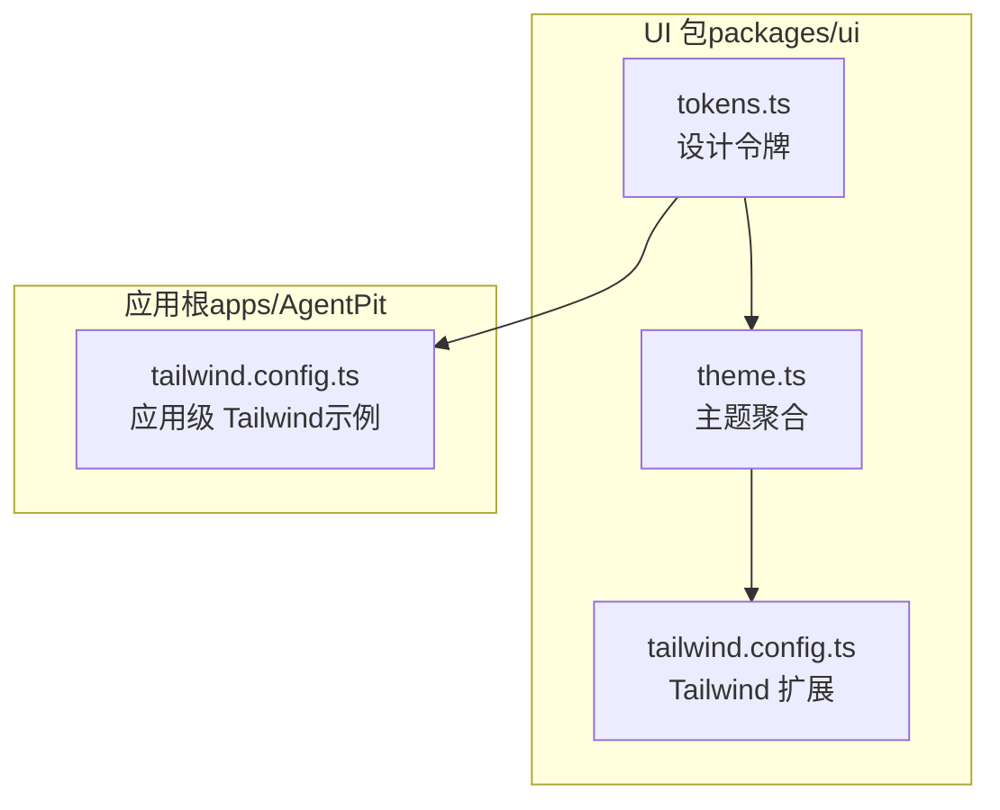
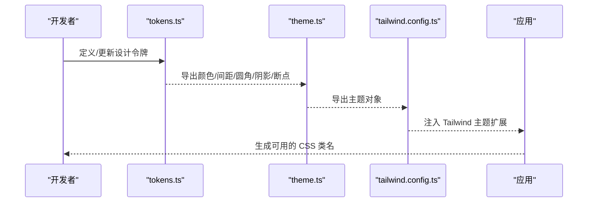
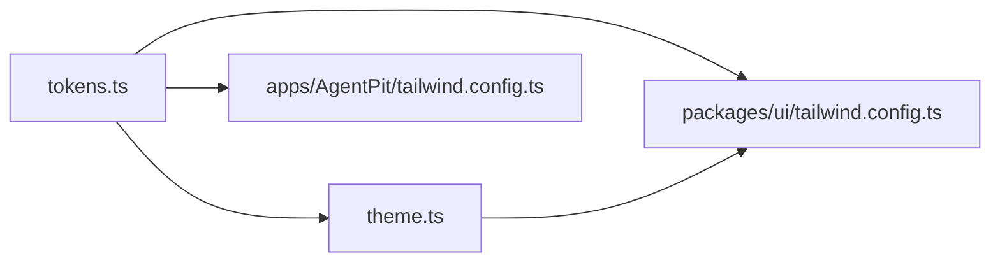

# 主题系统

<cite>
**本文引用的文件**
- [apps/AgentPit/packages/ui/src/styles/theme.ts](file://apps/AgentPit/packages/ui/src/styles/theme.ts)
- [apps/AgentPit/packages/ui/src/styles/tokens.ts](file://apps/AgentPit/packages/ui/src/styles/tokens.ts)
- [apps/AgentPit/packages/ui/tailwind.config.ts](file://apps/AgentPit/packages/ui/tailwind.config.ts)
- [apps/AgentPit/tailwind.config.ts](file://apps/AgentPit/tailwind.config.ts)
</cite>

## 目录
1. [简介](#简介)
2. [项目结构](#项目结构)
3. [核心组件](#核心组件)
4. [架构总览](#架构总览)
5. [详细组件分析](#详细组件分析)
6. [依赖关系分析](#依赖关系分析)
7. [性能考量](#性能考量)
8. [故障排查指南](#故障排查指南)
9. [结论](#结论)
10. [附录](#附录)

## 简介
本文件面向 AgentPit 主题系统，系统性阐述其架构设计、样式变量体系与主题切换机制。重点覆盖以下内容：
- 主题配置：theme.ts 中的主题聚合导出
- 设计令牌：tokens.ts 中的颜色、间距、圆角、阴影与断点
- TailwindCSS 集成：如何通过 tokens 将设计令牌注入 Tailwind 主题扩展
- 自定义主题创建流程与样式覆盖最佳实践
- 响应式主题适配与暗色模式支持的实现建议

## 项目结构
AgentPit 的主题系统主要由两部分组成：
- 设计令牌层：集中于 tokens.ts，定义颜色、间距、圆角、阴影与断点等基础变量
- 主题聚合层：通过 theme.ts 聚合 tokens 并统一导出，供应用与 Tailwind 使用

图表来源
- [apps/AgentPit/packages/ui/src/styles/tokens.ts:1-121](file://apps/AgentPit/packages/ui/src/styles/tokens.ts#L1-L121)
- [apps/AgentPit/packages/ui/src/styles/theme.ts:1-12](file://apps/AgentPit/packages/ui/src/styles/theme.ts#L1-L12)
- [apps/AgentPit/packages/ui/tailwind.config.ts:1-20](file://apps/AgentPit/packages/ui/tailwind.config.ts#L1-L20)
- [apps/AgentPit/tailwind.config.ts:1-27](file://apps/AgentPit/tailwind.config.ts#L1-L27)

章节来源
- [apps/AgentPit/packages/ui/src/styles/tokens.ts:1-121](file://apps/AgentPit/packages/ui/src/styles/tokens.ts#L1-L121)
- [apps/AgentPit/packages/ui/src/styles/theme.ts:1-12](file://apps/AgentPit/packages/ui/src/styles/theme.ts#L1-L12)
- [apps/AgentPit/packages/ui/tailwind.config.ts:1-20](file://apps/AgentPit/packages/ui/tailwind.config.ts#L1-L20)
- [apps/AgentPit/tailwind.config.ts:1-27](file://apps/AgentPit/tailwind.config.ts#L1-L27)

## 核心组件
- 设计令牌（tokens.ts）
  - 颜色：primary、accent、success、warning、danger、gray 等语义化色阶
  - 间距：以步进值定义的像素映射
  - 圆角：sm、md、lg、xl 等常用半径
  - 阴影：sm、md、lg、xl、2xl 等层级阴影
  - 断点：sm、md、lg、xl、2xl 对应的屏幕宽度
- 主题聚合（theme.ts）
  - 将 colors、spacing、borderRadius、shadows、breakpoints 聚合为 theme 对象并默认导出
- Tailwind 集成（packages/ui/tailwind.config.ts）
  - 从 tokens 导入上述变量，通过 theme.extend 注入到 Tailwind
- 应用级 Tailwind（apps/AgentPit/tailwind.config.ts）
  - 示例中展示了在应用层对 primary 颜色进行扩展的方式（用于对比）

章节来源
- [apps/AgentPit/packages/ui/src/styles/tokens.ts:1-121](file://apps/AgentPit/packages/ui/src/styles/tokens.ts#L1-L121)
- [apps/AgentPit/packages/ui/src/styles/theme.ts:1-12](file://apps/AgentPit/packages/ui/src/styles/theme.ts#L1-L12)
- [apps/AgentPit/packages/ui/tailwind.config.ts:1-20](file://apps/AgentPit/packages/ui/tailwind.config.ts#L1-L20)
- [apps/AgentPit/tailwind.config.ts:1-27](file://apps/AgentPit/tailwind.config.ts#L1-L27)

## 架构总览
主题系统采用“令牌—聚合—扩展”的分层架构：
- 令牌层：集中管理设计变量，确保一致性与可维护性
- 聚合层：将令牌组合为主题对象，便于跨模块复用
- 扩展层：通过 Tailwind 的 theme.extend 将主题变量注入到 CSS 类名体系

图表来源
- [apps/AgentPit/packages/ui/src/styles/tokens.ts:1-121](file://apps/AgentPit/packages/ui/src/styles/tokens.ts#L1-L121)
- [apps/AgentPit/packages/ui/src/styles/theme.ts:1-12](file://apps/AgentPit/packages/ui/src/styles/theme.ts#L1-L12)
- [apps/AgentPit/packages/ui/tailwind.config.ts:1-20](file://apps/AgentPit/packages/ui/tailwind.config.ts#L1-L20)

## 详细组件分析

### 组件一：设计令牌（tokens.ts）
- 数据结构
  - 颜色：每个语义色包含 50 到 900 的多级色阶，便于在不同明暗场景下选择
  - 间距：以整数键表示步进，值为像素字符串，保证与 UI 比例一致
  - 圆角：提供从 none 到 full 的常用半径
  - 阴影：按层级定义，满足卡片、浮层等视觉层次
  - 断点：标准响应式断点，便于在不同设备上适配布局
- 复杂度与性能
  - 令牌为纯静态常量，导入与使用均为 O(1)，无运行时开销
- 优化建议
  - 保持键值命名一致性，避免重复与冗余
  - 在新增语义色时，遵循现有色阶规范，确保可访问性与对比度

章节来源
- [apps/AgentPit/packages/ui/src/styles/tokens.ts:1-121](file://apps/AgentPit/packages/ui/src/styles/tokens.ts#L1-L121)

### 组件二：主题聚合（theme.ts）
- 作用
  - 将 tokens.ts 中的各变量集合为一个主题对象，统一导出
  - 作为中间层，降低直接耦合度，便于后续扩展或替换
- 依赖关系
  - 依赖 tokens.ts 的导出项
- 错误处理
  - 若 tokens.ts 缺失任一导出，此处会触发构建期错误

章节来源
- [apps/AgentPit/packages/ui/src/styles/theme.ts:1-12](file://apps/AgentPit/packages/ui/src/styles/theme.ts#L1-L12)

### 组件三：Tailwind 集成（packages/ui/tailwind.config.ts）
- 关键点
  - 从 tokens.ts 导入颜色、间距、圆角、阴影与断点
  - 通过 theme.extend 将这些变量注入 Tailwind 主题
- 使用方式
  - 在组件中可直接使用如 text-primary-500、bg-accent-200、rounded-lg 等类名
- 注意事项
  - content 路径需覆盖实际源码目录，确保按需生成样式
  - 如需应用级扩展（例如覆盖特定颜色），可在应用根 tailwind.config.ts 中进行局部扩展

章节来源
- [apps/AgentPit/packages/ui/tailwind.config.ts:1-20](file://apps/AgentPit/packages/ui/tailwind.config.ts#L1-L20)

### 组件四：应用级 Tailwind（apps/AgentPit/tailwind.config.ts）
- 说明
  - 示例中展示了在应用层对 primary 颜色进行扩展的方式
  - 可用于品牌定制或临时覆盖，但不建议长期替代 tokens.ts
- 最佳实践
  - 优先在 tokens.ts 中统一修改，再通过 theme.ts/tailwind.config.ts 同步生效
  - 仅在特殊场景使用应用层扩展，避免与令牌层产生冲突

章节来源
- [apps/AgentPit/tailwind.config.ts:1-27](file://apps/AgentPit/tailwind.config.ts#L1-L27)

### 主题切换机制（概念性说明）
- 建议方案
  - 使用 CSS 变量作为主题开关的桥梁，通过根元素类名切换（如 data-theme="dark" 或 data-theme="light"）
  - 在 tokens.ts 中为每组语义色提供明/暗两套色阶，或通过 CSS 变量动态计算
  - 在应用入口处监听用户偏好或手动切换，更新根元素属性
- 实施要点
  - 保持 tokens 的双态一致性，避免遗漏
  - 在 Tailwind 类名中配合 data-theme 属性使用，实现条件化样式
  - 结合媒体查询与用户设置，自动适配系统深浅模式

（本节为概念性说明，不直接分析具体文件，故无章节来源）

## 依赖关系分析
- 组件耦合
  - theme.ts 依赖 tokens.ts 的导出
  - tailwind.config.ts 依赖 theme.ts（或直接依赖 tokens.ts）来扩展主题
- 外部依赖
  - TailwindCSS 作为样式生成引擎，依赖 theme.extend 注入的变量
- 潜在风险
  - 若 tokens.ts 字段缺失或命名变更，theme.ts 与 tailwind.config.ts 需同步更新
  - 应用层 tailwind.config.ts 与 UI 包层存在同名扩展时可能产生冲突

图表来源
- [apps/AgentPit/packages/ui/src/styles/tokens.ts:1-121](file://apps/AgentPit/packages/ui/src/styles/tokens.ts#L1-L121)
- [apps/AgentPit/packages/ui/src/styles/theme.ts:1-12](file://apps/AgentPit/packages/ui/src/styles/theme.ts#L1-L12)
- [apps/AgentPit/packages/ui/tailwind.config.ts:1-20](file://apps/AgentPit/packages/ui/tailwind.config.ts#L1-L20)
- [apps/AgentPit/tailwind.config.ts:1-27](file://apps/AgentPit/tailwind.config.ts#L1-L27)

章节来源
- [apps/AgentPit/packages/ui/src/styles/tokens.ts:1-121](file://apps/AgentPit/packages/ui/src/styles/tokens.ts#L1-L121)
- [apps/AgentPit/packages/ui/src/styles/theme.ts:1-12](file://apps/AgentPit/packages/ui/src/styles/theme.ts#L1-L12)
- [apps/AgentPit/packages/ui/tailwind.config.ts:1-20](file://apps/AgentPit/packages/ui/tailwind.config.ts#L1-L20)
- [apps/AgentPit/tailwind.config.ts:1-27](file://apps/AgentPit/tailwind.config.ts#L1-L27)

## 性能考量
- 令牌为静态常量，导入与使用均为 O(1)，无额外运行时成本
- Tailwind 按需扫描 content 路径生成样式，建议保持 content 覆盖范围合理，避免生成冗余样式
- 在应用层尽量减少对 tokens 的重复扩展，避免重复注入导致的体积膨胀

（本节提供通用指导，不直接分析具体文件）

## 故障排查指南
- Tailwind 无法识别新颜色/间距/断点
  - 检查 tailwind.config.ts 是否正确从 tokens 导入并注入 theme.extend
  - 确认 content 路径是否包含当前组件文件
- 主题切换无效
  - 确认根元素类名或 data-theme 属性已正确切换
  - 检查 tokens 中是否存在对应的明/暗两套色阶
- 构建报错
  - 检查 theme.ts 是否完整导出所需字段
  - 确保 tokens.ts 字段命名与引用一致

（本节提供通用指导，不直接分析具体文件）

## 结论
AgentPit 主题系统通过“令牌—聚合—扩展”三层结构实现了设计变量的集中管理与 Tailwind 的无缝集成。建议在日常开发中优先维护 tokens.ts，通过 theme.ts 统一导出，并在 tailwind.config.ts 中完成扩展；在需要定制时，优先考虑在令牌层进行扩展，而非直接在应用层覆盖，以保持一致性与可维护性。

（本节为总结性内容，不直接分析具体文件）

## 附录

### 自定义主题创建步骤（基于现有结构）
- 步骤一：在 tokens.ts 中新增或调整设计令牌
  - 例如添加新的语义色阶或调整现有色阶
- 步骤二：在 theme.ts 中确认聚合导出
  - 确保新增字段被纳入主题对象
- 步骤三：在 tailwind.config.ts 中注入扩展
  - 通过 theme.extend 将新令牌映射为 Tailwind 类名
- 步骤四：在组件中使用新类名
  - 例如使用 text-new-color-500、bg-new-color-200 等
- 步骤五：验证与回归
  - 运行构建并检查样式是否按预期生成

章节来源
- [apps/AgentPit/packages/ui/src/styles/tokens.ts:1-121](file://apps/AgentPit/packages/ui/src/styles/tokens.ts#L1-L121)
- [apps/AgentPit/packages/ui/src/styles/theme.ts:1-12](file://apps/AgentPit/packages/ui/src/styles/theme.ts#L1-L12)
- [apps/AgentPit/packages/ui/tailwind.config.ts:1-20](file://apps/AgentPit/packages/ui/tailwind.config.ts#L1-L20)

### 样式覆盖最佳实践
- 优先在令牌层统一修改，避免分散覆盖
- 使用语义化类名（如 text-primary、bg-accent），而非硬编码颜色值
- 在应用层仅做必要覆盖，且保持与令牌层的一致性
- 通过 data-theme 或根元素类名实现主题切换，避免内联样式的滥用

（本节提供通用指导，不直接分析具体文件）

### 响应式主题适配与暗色模式支持（实现方案）
- 响应式适配
  - 使用断点令牌（sm、md、lg、xl、2xl）控制布局与间距
  - 在组件中结合 Tailwind 断点前缀实现多端一致体验
- 暗色模式支持
  - 在 tokens.ts 中为每组语义色提供明/暗两套色阶
  - 通过根元素类名切换（如 data-theme="dark"）配合 CSS 变量或 Tailwind 条件类实现
  - 在应用入口处监听系统偏好与用户设置，动态更新主题状态

（本节为概念性说明，不直接分析具体文件）