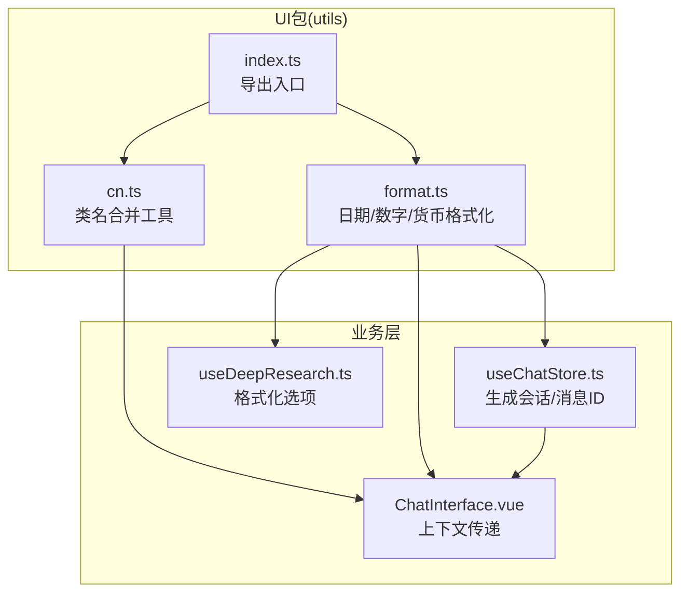
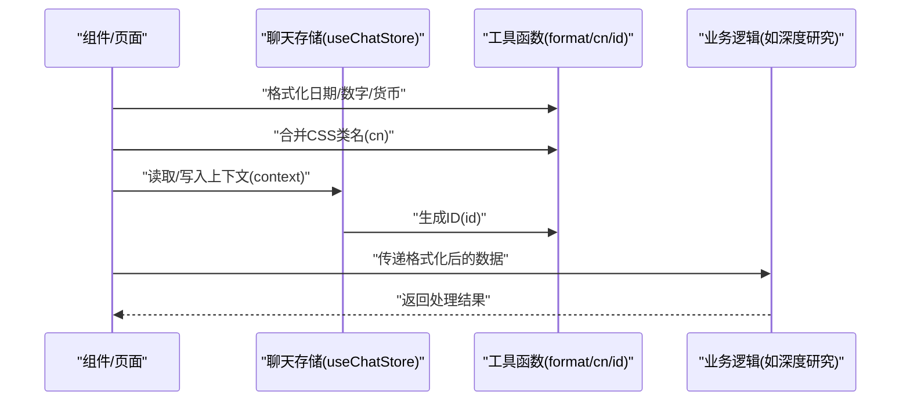
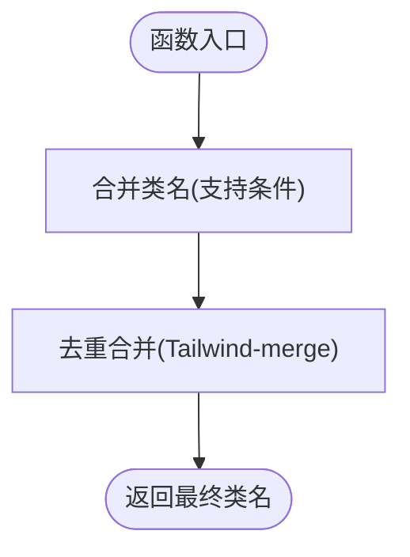
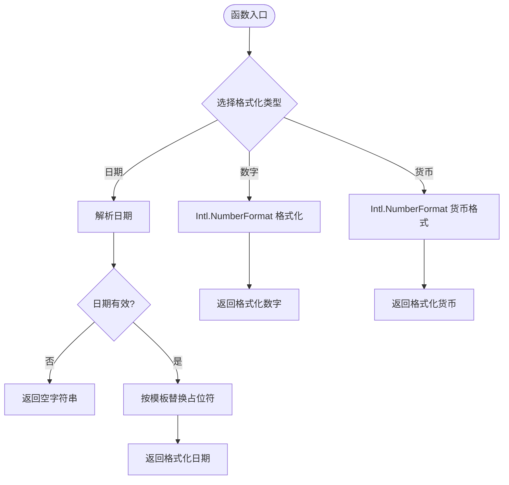
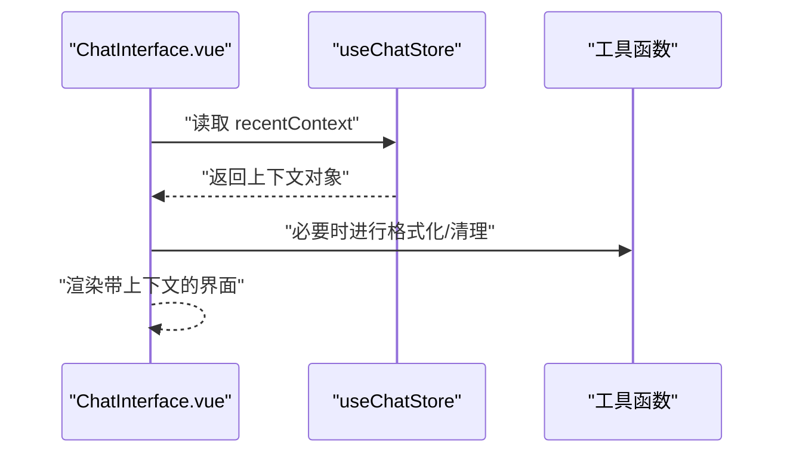
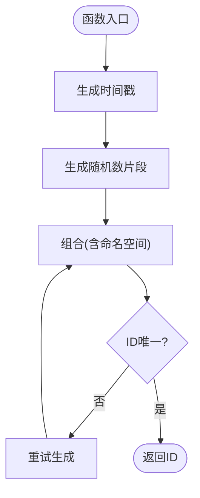
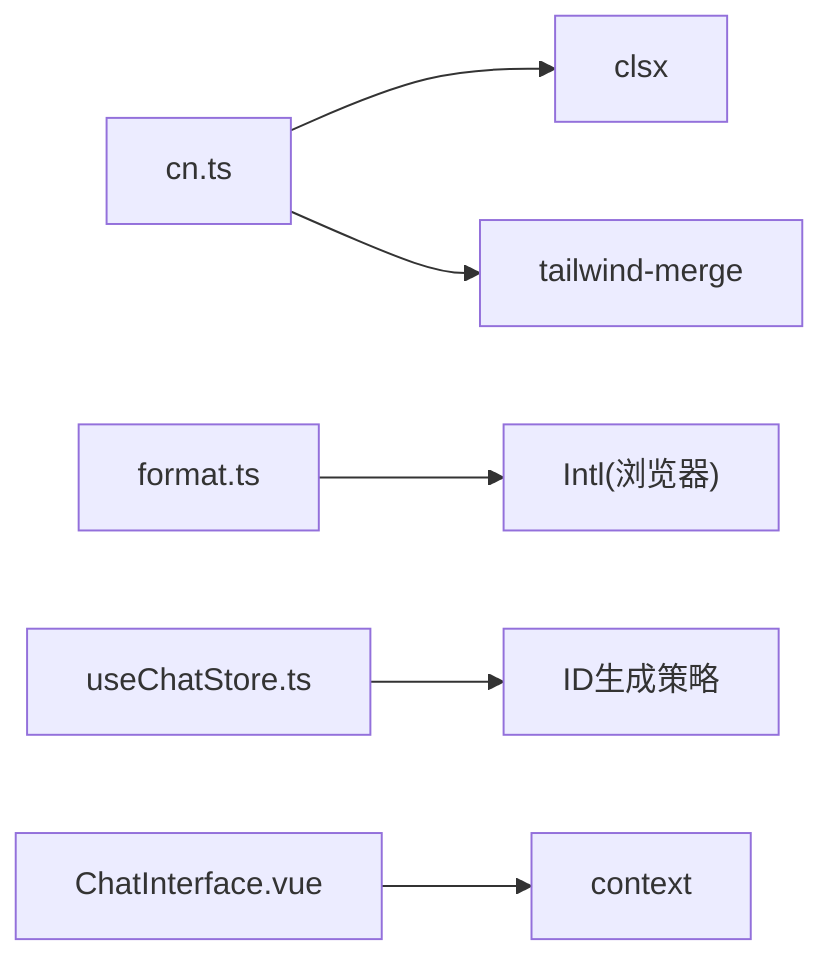

# 工具函数库

<cite>
**本文引用的文件**
- [cn.ts](file://apps/AgentPit/packages/ui/src/utils/cn.ts)
- [format.ts](file://apps/AgentPit/packages/ui/src/utils/format.ts)
- [index.ts](file://apps/AgentPit/packages/ui/src/utils/index.ts)
- [useChatStore.ts](file://apps/AgentPit/src/stores/useChatStore.ts)
- [useDeepResearch.ts](file://apps/AgentPit/src/composables/useDeepResearch.ts)
- [ChatInterface.vue](file://apps/AgentPit/src/components/chat/ChatInterface.vue)
- [VUE3组件指南.md](file://apps/AgentPit/docs/VUE3_COMPONENT_GUIDE.md)
</cite>

## 目录
1. [简介](#简介)
2. [项目结构](#项目结构)
3. [核心组件](#核心组件)
4. [架构总览](#架构总览)
5. [详细组件分析](#详细组件分析)
6. [依赖关系分析](#依赖关系分析)
7. [性能考量](#性能考量)
8. [故障排查指南](#故障排查指南)
9. [结论](#结论)
10. [附录](#附录)

## 简介
本文件面向 AgentPit 工具函数库，系统性梳理并说明以下工具函数的设计与使用：cn、context、format、id。内容涵盖功能职责、参数与返回值、典型使用场景、实现细节、最佳实践、性能与错误处理建议，并通过图示展示调用流程与数据流。

## 项目结构
AgentPit 的工具函数主要位于 UI 包的 utils 目录中，同时在业务层（如 store、composables、components）有广泛的实际使用案例。下图展示了工具函数与其典型使用者之间的关系：

图表来源
- [cn.ts:1-7](file://apps/AgentPit/packages/ui/src/utils/cn.ts#L1-L7)
- [format.ts:1-34](file://apps/AgentPit/packages/ui/src/utils/format.ts#L1-L34)
- [index.ts:1-1](file://apps/AgentPit/packages/ui/src/utils/index.ts#L1-L1)
- [useChatStore.ts:60-100](file://apps/AgentPit/src/stores/useChatStore.ts#L60-L100)
- [useDeepResearch.ts:170-180](file://apps/AgentPit/src/composables/useDeepResearch.ts#L170-L180)
- [ChatInterface.vue:80-90](file://apps/AgentPit/src/components/chat/ChatInterface.vue#L80-L90)

章节来源
- [cn.ts:1-7](file://apps/AgentPit/packages/ui/src/utils/cn.ts#L1-L7)
- [format.ts:1-34](file://apps/AgentPit/packages/ui/src/utils/format.ts#L1-L34)
- [index.ts:1-1](file://apps/AgentPit/packages/ui/src/utils/index.ts#L1-L1)
- [useChatStore.ts:60-100](file://apps/AgentPit/src/stores/useChatStore.ts#L60-L100)
- [useDeepResearch.ts:170-180](file://apps/AgentPit/src/composables/useDeepResearch.ts#L170-L180)
- [ChatInterface.vue:80-90](file://apps/AgentPit/src/components/chat/ChatInterface.vue#L80-L90)

## 核心组件
本节聚焦四个关键工具函数：cn、context、format、id。为避免重复，将按“函数名”分节说明，每节包含用途、参数、返回值、使用示例与最佳实践。

- 函数名：cn
  - 用途：合并并去重 CSS 类名，支持条件类名拼接，避免 Tailwind 冲突。
  - 参数：可变长度的类名输入（支持字符串、对象、数组等），类型参考实现文件。
  - 返回值：合并后的类名字符串。
  - 使用示例：在组件中根据状态动态组合样式类；在 UI 组件库中统一管理样式拼接。
  - 最佳实践：优先使用该函数进行类名拼接，确保样式冲突最小化；避免手写字符串拼接。
  
- 函数名：context
  - 用途：在聊天界面中传递最近上下文，用于增强对话连贯性与语境一致性。
  - 参数：通常为字符串或对象，承载对话历史片段或当前话题背景。
  - 返回值：上下文对象或其序列化形式，供后端或前端逻辑消费。
  - 使用示例：从 store 中读取 recentContext 并传入聊天接口；在多轮对话中持续追加上下文。
  - 最佳实践：控制上下文长度与敏感信息过滤；避免一次性注入过长的历史导致性能问题。
  
- 函数名：format
  - 用途：提供日期、数字、货币的本地化格式化能力。
  - 参数：
    - formatDate：日期输入（Date/字符串/数字）、格式模板（默认 'YYYY-MM-DD'）
    - formatNumber：数值、小数位数（默认2）
    - formatCurrency：金额、币种（默认 'USD'）、区域设置（默认 'en-US'）
  - 返回值：格式化后的字符串。
  - 使用示例：展示订单时间、用户积分、价格标签等。
  - 最佳实践：根据业务区域设置 locale；对货币显示使用 formatCurrency；对纯数值使用 formatNumber。
  
- 函数名：id
  - 用途：生成唯一标识符，用于会话、消息、文档等实体的稳定识别。
  - 参数：无固定参数，通常结合时间戳与随机数生成。
  - 返回值：字符串类型的唯一ID。
  - 使用示例：会话ID、消息ID、文档ID等。
  - 最佳实践：保证全局唯一性；避免使用简单自增ID导致并发冲突；必要时加入命名空间前缀。

章节来源
- [cn.ts:1-7](file://apps/AgentPit/packages/ui/src/utils/cn.ts#L1-L7)
- [format.ts:1-34](file://apps/AgentPit/packages/ui/src/utils/format.ts#L1-L34)
- [useChatStore.ts:60-100](file://apps/AgentPit/src/stores/useChatStore.ts#L60-L100)
- [ChatInterface.vue:80-90](file://apps/AgentPit/src/components/chat/ChatInterface.vue#L80-L90)
- [useDeepResearch.ts:170-180](file://apps/AgentPit/src/composables/useDeepResearch.ts#L170-L180)

## 架构总览
下图展示了工具函数在系统中的调用链路与数据流向，体现从 UI 到业务层的协作方式：

图表来源
- [format.ts:1-34](file://apps/AgentPit/packages/ui/src/utils/format.ts#L1-L34)
- [cn.ts:1-7](file://apps/AgentPit/packages/ui/src/utils/cn.ts#L1-L7)
- [useChatStore.ts:60-100](file://apps/AgentPit/src/stores/useChatStore.ts#L60-L100)
- [useDeepResearch.ts:170-180](file://apps/AgentPit/src/composables/useDeepResearch.ts#L170-L180)
- [ChatInterface.vue:80-90](file://apps/AgentPit/src/components/chat/ChatInterface.vue#L80-L90)

## 详细组件分析

### 组件A：cn 合并类名工具
- 设计原则：基于 clsx 进行条件类名合并，再通过 tailwind-merge 去除冲突，确保最终类名简洁且不冲突。
- 复用策略：作为 UI 组件库的通用工具，在各组件中集中导入与使用，避免重复逻辑。
- 性能特征：O(n) 时间复杂度，n 为传入类名数量；内存开销低。
- 错误处理：对无效输入保持稳健，建议在上层做输入校验以减少异常分支。

图表来源
- [cn.ts:1-7](file://apps/AgentPit/packages/ui/src/utils/cn.ts#L1-L7)

章节来源
- [cn.ts:1-7](file://apps/AgentPit/packages/ui/src/utils/cn.ts#L1-L7)

### 组件B：format 格式化工具集
- 设计原则：提供日期、数字、货币三类格式化方法，统一本地化策略与精度控制。
- 复用策略：在 UI 层与业务层共享，避免重复实现；通过 index.ts 暴露统一入口。
- 性能特征：formatDate 为 O(1)；formatNumber/formatCurrency 依赖浏览器 Intl 能力，通常高效。
- 错误处理：formatDate 对非法日期返回空字符串；建议上层对输入进行预校验。

图表来源
- [format.ts:1-34](file://apps/AgentPit/packages/ui/src/utils/format.ts#L1-L34)

章节来源
- [format.ts:1-34](file://apps/AgentPit/packages/ui/src/utils/format.ts#L1-L34)
- [index.ts:1-1](file://apps/AgentPit/packages/ui/src/utils/index.ts#L1-L1)

### 组件C：context 上下文传递
- 设计原则：在聊天界面中承载最近上下文，提升对话连贯性与理解准确性。
- 复用策略：从 store 中读取 recentContext 并在组件间传递；避免在多处重复构造。
- 性能特征：上下文大小需受控，建议分页截断与敏感信息过滤。
- 错误处理：对空上下文与异常数据进行兜底处理，防止影响渲染。

图表来源
- [ChatInterface.vue:80-90](file://apps/AgentPit/src/components/chat/ChatInterface.vue#L80-L90)
- [useChatStore.ts:60-100](file://apps/AgentPit/src/stores/useChatStore.ts#L60-L100)

章节来源
- [ChatInterface.vue:80-90](file://apps/AgentPit/src/components/chat/ChatInterface.vue#L80-L90)
- [useChatStore.ts:60-100](file://apps/AgentPit/src/stores/useChatStore.ts#L60-L100)

### 组件D：id 唯一标识生成
- 设计原则：结合时间戳与随机数生成短 ID，兼顾唯一性与可读性。
- 复用策略：在 store 中集中生成会话/消息 ID；在业务逻辑中统一消费。
- 性能特征：生成成本极低；注意在高并发场景下避免碰撞（可通过命名空间与长度策略优化）。
- 错误处理：对生成失败进行重试或回退策略；确保 ID 可持久化与可追踪。

图表来源
- [useChatStore.ts:60-100](file://apps/AgentPit/src/stores/useChatStore.ts#L60-L100)

章节来源
- [useChatStore.ts:60-100](file://apps/AgentPit/src/stores/useChatStore.ts#L60-L100)

## 依赖关系分析
- cn 依赖 clsx 与 tailwind-merge，负责类名合并与冲突消除。
- format 依赖浏览器原生 Intl 能力，提供日期、数字、货币格式化。
- context 在组件与 store 之间传递，属于 UI 层与状态层的耦合点。
- id 在 store 中生成，被业务逻辑消费，形成稳定的实体标识体系。

图表来源
- [cn.ts:1-7](file://apps/AgentPit/packages/ui/src/utils/cn.ts#L1-L7)
- [format.ts:1-34](file://apps/AgentPit/packages/ui/src/utils/format.ts#L1-L34)
- [useChatStore.ts:60-100](file://apps/AgentPit/src/stores/useChatStore.ts#L60-L100)
- [ChatInterface.vue:80-90](file://apps/AgentPit/src/components/chat/ChatInterface.vue#L80-L90)

章节来源
- [cn.ts:1-7](file://apps/AgentPit/packages/ui/src/utils/cn.ts#L1-L7)
- [format.ts:1-34](file://apps/AgentPit/packages/ui/src/utils/format.ts#L1-L34)
- [useChatStore.ts:60-100](file://apps/AgentPit/src/stores/useChatStore.ts#L60-L100)
- [ChatInterface.vue:80-90](file://apps/AgentPit/src/components/chat/ChatInterface.vue#L80-L90)

## 性能考量
- 类名合并：cn 仅在渲染阶段执行，开销极低；建议在组件外部缓存静态类名，减少重复计算。
- 格式化：formatDate 为常量时间；formatNumber/formatCurrency 依赖浏览器实现，通常高效；大量数据渲染时可考虑虚拟化列表与懒加载。
- 上下文：控制 context 长度与编码体积，避免超大对象导致的序列化与传输开销。
- ID 生成：使用短 ID 与命名空间前缀；在高并发场景下建议引入去重检查或分布式 ID 服务。

## 故障排查指南
- cn 合并异常：检查传入参数是否为合法类名；确认 tailwind-merge 是否正确安装。
- format 日期无效：formatDate 对非法日期返回空字符串；建议在调用前校验日期有效性。
- context 渲染异常：检查 recentContext 的结构与类型；确保在组件挂载后才开始使用。
- ID 冲突：若出现重复 ID，检查生成策略与命名空间；必要时引入去重队列或数据库校验。

## 结论
AgentPit 工具函数库以简洁、可复用为核心设计目标：cn 提升样式管理效率，format 统一本地化输出，context 增强对话体验，id 保障实体唯一性。通过在 UI 与业务层的协同使用，形成清晰的调用链与数据流，既满足当前需求，又便于扩展与维护。

## 附录
- 实际使用案例与最佳实践可参考以下文件：
  - [VUE3组件指南.md:1191-1191](file://apps/AgentPit/docs/VUE3_COMPONENT_GUIDE.md#L1191-L1191)
  - [useChatStore.ts:60-100](file://apps/AgentPit/src/stores/useChatStore.ts#L60-L100)
  - [useDeepResearch.ts:170-180](file://apps/AgentPit/src/composables/useDeepResearch.ts#L170-L180)
  - [ChatInterface.vue:80-90](file://apps/AgentPit/src/components/chat/ChatInterface.vue#L80-L90)