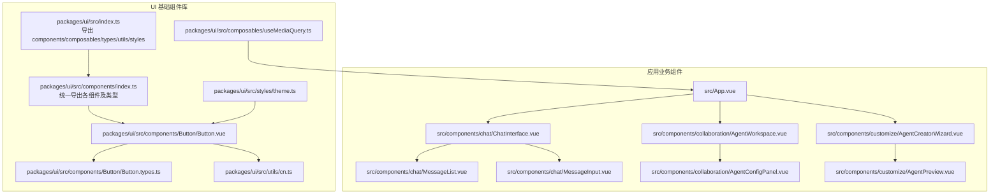
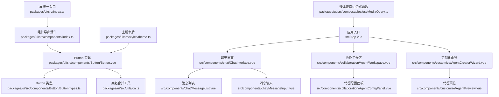
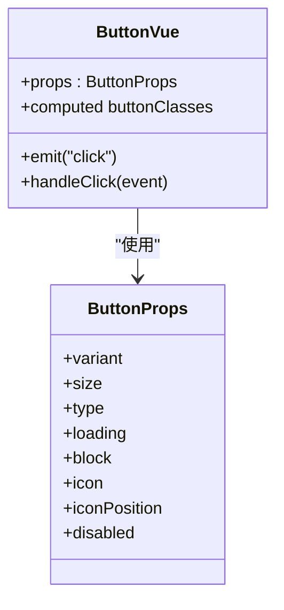
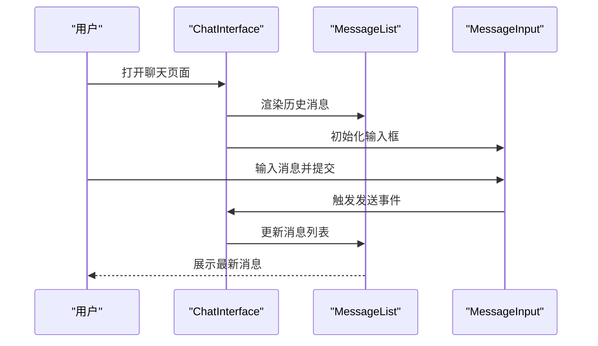
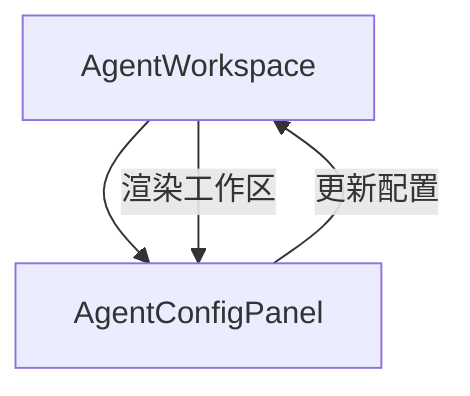
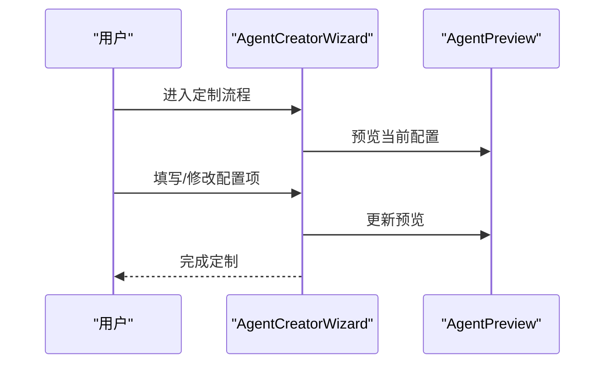
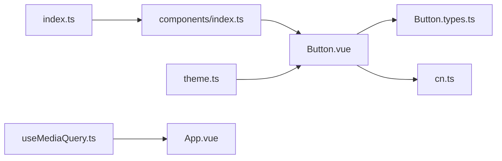

# 组件系统架构

<cite>
**本文引用的文件**
- [apps/AgentPit/packages/ui/src/index.ts](file://apps/AgentPit/packages/ui/src/index.ts)
- [apps/AgentPit/packages/ui/src/components/index.ts](file://apps/AgentPit/packages/ui/src/components/index.ts)
- [apps/AgentPit/packages/ui/src/components/Button/Button.vue](file://apps/AgentPit/packages/ui/src/components/Button/Button.vue)
- [apps/AgentPit/packages/ui/src/components/Button/Button.types.ts](file://apps/AgentPit/packages/ui/src/components/Button/Button.types.ts)
- [apps/AgentPit/packages/ui/src/types/component.ts](file://apps/AgentPit/packages/ui/src/types/component.ts)
- [apps/AgentPit/packages/ui/src/utils/cn.ts](file://apps/AgentPit/packages/ui/src/utils/cn.ts)
- [apps/AgentPit/packages/ui/src/styles/theme.ts](file://apps/AgentPit/packages/ui/src/styles/theme.ts)
- [apps/AgentPit/packages/ui/src/composables/useMediaQuery.ts](file://apps/AgentPit/packages/ui/src/composables/useMediaQuery.ts)
- [apps/AgentPit/src/App.vue](file://apps/AgentPit/src/App.vue)
- [apps/AgentPit/src/components/chat/ChatInterface.vue](file://apps/AgentPit/src/components/chat/ChatInterface.vue)
- [apps/AgentPit/src/components/chat/MessageList.vue](file://apps/AgentPit/src/components/chat/MessageList.vue)
- [apps/AgentPit/src/components/chat/MessageInput.vue](file://apps/AgentPit/src/components/chat/MessageInput.vue)
- [apps/AgentPit/src/components/collaboration/AgentWorkspace.vue](file://apps/AgentPit/src/components/collaboration/AgentWorkspace.vue)
- [apps/AgentPit/src/components/collaboration/AgentConfigPanel.vue](file://apps/AgentPit/src/components/collaboration/AgentConfigPanel.vue)
- [apps/AgentPit/src/components/customize/AgentCreatorWizard.vue](file://apps/AgentPit/src/components/customize/AgentCreatorWizard.vue)
- [apps/AgentPit/src/components/customize/AgentPreview.vue](file://apps/AgentPit/src/components/customize/AgentPreview.vue)
- [apps/AgentPit/e2e/responsive-layout.spec.ts](file://apps/AgentPit/e2e/responsive-layout.spec.ts)
- [apps/AgentPit/e2e/theme-switching.spec.ts](file://apps/AgentPit/e2e/theme-switching.spec.ts)
</cite>

## 目录
1. [引言](#引言)
2. [项目结构](#项目结构)
3. [核心组件](#核心组件)
4. [架构总览](#架构总览)
5. [详细组件分析](#详细组件分析)
6. [依赖关系分析](#依赖关系分析)
7. [性能考虑](#性能考虑)
8. [故障排查指南](#故障排查指南)
9. [结论](#结论)
10. [附录](#附录)

## 引言
本技术文档聚焦于 AgentPit 的组件系统架构，系统性阐述组件的视觉外观、行为与用户交互模式；记录 props（属性）、事件、插槽与自定义选项；提供可定位到源码路径的使用示例；给出响应式设计与无障碍访问合规性建议；说明组件状态、动画与过渡；覆盖样式自定义与主题支持；并提出跨浏览器兼容性与性能优化策略，以及组件组合模式与与其他 UI 元素的集成方式。

## 项目结构
AgentPit 的组件体系分为两层：
- UI 基础组件库：位于 packages/ui，提供 Button、Card、Input、Avatar、Badge、Modal、Dropdown、Tabs、Loader、Toast 等基础 UI 组件及其类型、样式与工具函数。
- 应用业务组件：位于 src/components 下，围绕聊天、协作、定制化等场景构建复合组件，并通过 UI 基础组件进行组合。

图表来源
- [apps/AgentPit/packages/ui/src/index.ts:1-6](file://apps/AgentPit/packages/ui/src/index.ts#L1-L6)
- [apps/AgentPit/packages/ui/src/components/index.ts:1-30](file://apps/AgentPit/packages/ui/src/components/index.ts#L1-L30)
- [apps/AgentPit/packages/ui/src/components/Button/Button.vue:1-81](file://apps/AgentPit/packages/ui/src/components/Button/Button.vue#L1-L81)
- [apps/AgentPit/packages/ui/src/components/Button/Button.types.ts:1-16](file://apps/AgentPit/packages/ui/src/components/Button/Button.types.ts#L1-L16)
- [apps/AgentPit/packages/ui/src/utils/cn.ts:1-7](file://apps/AgentPit/packages/ui/src/utils/cn.ts#L1-L7)
- [apps/AgentPit/packages/ui/src/styles/theme.ts:1-12](file://apps/AgentPit/packages/ui/src/styles/theme.ts#L1-L12)
- [apps/AgentPit/packages/ui/src/composables/useMediaQuery.ts:1-28](file://apps/AgentPit/packages/ui/src/composables/useMediaQuery.ts#L1-L28)
- [apps/AgentPit/src/App.vue:1-200](file://apps/AgentPit/src/App.vue#L1-L200)
- [apps/AgentPit/src/components/chat/ChatInterface.vue:1-200](file://apps/AgentPit/src/components/chat/ChatInterface.vue#L1-L200)
- [apps/AgentPit/src/components/chat/MessageList.vue:1-200](file://apps/AgentPit/src/components/chat/MessageList.vue#L1-L200)
- [apps/AgentPit/src/components/chat/MessageInput.vue:1-200](file://apps/AgentPit/src/components/chat/MessageInput.vue#L1-L200)
- [apps/AgentPit/src/components/collaboration/AgentWorkspace.vue:1-200](file://apps/AgentPit/src/components/collaboration/AgentWorkspace.vue#L1-L200)
- [apps/AgentPit/src/components/collaboration/AgentConfigPanel.vue:1-200](file://apps/AgentPit/src/components/collaboration/AgentConfigPanel.vue#L1-L200)
- [apps/AgentPit/src/components/customize/AgentCreatorWizard.vue:1-200](file://apps/AgentPit/src/components/customize/AgentCreatorWizard.vue#L1-L200)
- [apps/AgentPit/src/components/customize/AgentPreview.vue:1-200](file://apps/AgentPit/src/components/customize/AgentPreview.vue#L1-L200)

章节来源
- [apps/AgentPit/packages/ui/src/index.ts:1-6](file://apps/AgentPit/packages/ui/src/index.ts#L1-L6)
- [apps/AgentPit/packages/ui/src/components/index.ts:1-30](file://apps/AgentPit/packages/ui/src/components/index.ts#L1-L30)

## 核心组件
本节聚焦 UI 基础组件库的核心能力与扩展点，重点以 Button 为例说明组件的外观、行为与交互。

- 外观与变体
  - Button 提供多种变体（如 primary、secondary、success、warning、danger、outline、ghost）与尺寸（xs 到 xl），通过变体与尺寸类组合生成最终样式。
  - 使用 class 变体工厂（cva）与类名合并工具（cn）实现可维护的样式组合。
- 行为与交互
  - 支持 loading 状态显示旋转指示器；禁用态与块级展示；点击事件透传。
  - 支持在按钮内放置图标，并控制图标位置（左/右）。
- 属性（props）
  - 关键属性包括 variant、size、type、loading、block、icon、iconPosition、disabled 等。
- 事件与插槽
  - 触发 click 事件；默认插槽用于承载按钮文本或内容。
- 自定义选项
  - 通过 class 与 style 扩展原生 HTML button 的外观；通过主题 tokens 控制颜色、间距、圆角与阴影等。

章节来源
- [apps/AgentPit/packages/ui/src/components/Button/Button.vue:1-81](file://apps/AgentPit/packages/ui/src/components/Button/Button.vue#L1-L81)
- [apps/AgentPit/packages/ui/src/components/Button/Button.types.ts:1-16](file://apps/AgentPit/packages/ui/src/components/Button/Button.types.ts#L1-L16)
- [apps/AgentPit/packages/ui/src/types/component.ts:1-31](file://apps/AgentPit/packages/ui/src/types/component.ts#L1-L31)
- [apps/AgentPit/packages/ui/src/utils/cn.ts:1-7](file://apps/AgentPit/packages/ui/src/utils/cn.ts#L1-L7)
- [apps/AgentPit/packages/ui/src/styles/theme.ts:1-12](file://apps/AgentPit/packages/ui/src/styles/theme.ts#L1-L12)

## 架构总览
UI 基础组件库采用“统一导出 + 组合式工具”的架构：
- 统一导出：index.ts 将 components、composables、types、utils、styles 模块集中导出，便于上层按需引入。
- 组件导出：components/index.ts 对每个组件进行默认导出与类型导出，形成清晰的 API 表面。
- 工具与样式：cn 工具负责类名合并与冲突修复；theme 提供主题令牌；useMediaQuery 提供响应式查询能力。
- 应用层：业务组件通过组合基础组件实现复杂交互，例如聊天界面由 ChatInterface、MessageList、MessageInput 组成。

图表来源
- [apps/AgentPit/packages/ui/src/index.ts:1-6](file://apps/AgentPit/packages/ui/src/index.ts#L1-L6)
- [apps/AgentPit/packages/ui/src/components/index.ts:1-30](file://apps/AgentPit/packages/ui/src/components/index.ts#L1-L30)
- [apps/AgentPit/packages/ui/src/components/Button/Button.vue:1-81](file://apps/AgentPit/packages/ui/src/components/Button/Button.vue#L1-L81)
- [apps/AgentPit/packages/ui/src/components/Button/Button.types.ts:1-16](file://apps/AgentPit/packages/ui/src/components/Button/Button.types.ts#L1-L16)
- [apps/AgentPit/packages/ui/src/utils/cn.ts:1-7](file://apps/AgentPit/packages/ui/src/utils/cn.ts#L1-L7)
- [apps/AgentPit/packages/ui/src/styles/theme.ts:1-12](file://apps/AgentPit/packages/ui/src/styles/theme.ts#L1-L12)
- [apps/AgentPit/packages/ui/src/composables/useMediaQuery.ts:1-28](file://apps/AgentPit/packages/ui/src/composables/useMediaQuery.ts#L1-L28)
- [apps/AgentPit/src/App.vue:1-200](file://apps/AgentPit/src/App.vue#L1-L200)
- [apps/AgentPit/src/components/chat/ChatInterface.vue:1-200](file://apps/AgentPit/src/components/chat/ChatInterface.vue#L1-L200)
- [apps/AgentPit/src/components/chat/MessageList.vue:1-200](file://apps/AgentPit/src/components/chat/MessageList.vue#L1-L200)
- [apps/AgentPit/src/components/chat/MessageInput.vue:1-200](file://apps/AgentPit/src/components/chat/MessageInput.vue#L1-L200)
- [apps/AgentPit/src/components/collaboration/AgentWorkspace.vue:1-200](file://apps/AgentPit/src/components/collaboration/AgentWorkspace.vue#L1-L200)
- [apps/AgentPit/src/components/collaboration/AgentConfigPanel.vue:1-200](file://apps/AgentPit/src/components/collaboration/AgentConfigPanel.vue#L1-L200)
- [apps/AgentPit/src/components/customize/AgentCreatorWizard.vue:1-200](file://apps/AgentPit/src/components/customize/AgentCreatorWizard.vue#L1-L200)
- [apps/AgentPit/src/components/customize/AgentPreview.vue:1-200](file://apps/AgentPit/src/components/customize/AgentPreview.vue#L1-L200)

## 详细组件分析

### Button 组件
- 视觉外观
  - 通过变体与尺寸生成不同风格的按钮，支持块级宽度与加载态旋转指示器。
- 行为与交互
  - 点击事件在非禁用且非加载状态下触发；支持左右图标插入。
- 属性（props）
  - variant、size、type、loading、block、icon、iconPosition、disabled 等。
- 事件与插槽
  - click 事件；默认插槽承载按钮内容。
- 自定义选项
  - 通过 class 与 style 扩展；主题令牌统一颜色与间距。

图表来源
- [apps/AgentPit/packages/ui/src/components/Button/Button.vue:1-81](file://apps/AgentPit/packages/ui/src/components/Button/Button.vue#L1-L81)
- [apps/AgentPit/packages/ui/src/components/Button/Button.types.ts:1-16](file://apps/AgentPit/packages/ui/src/components/Button/Button.types.ts#L1-L16)

章节来源
- [apps/AgentPit/packages/ui/src/components/Button/Button.vue:1-81](file://apps/AgentPit/packages/ui/src/components/Button/Button.vue#L1-L81)
- [apps/AgentPit/packages/ui/src/components/Button/Button.types.ts:1-16](file://apps/AgentPit/packages/ui/src/components/Button/Button.types.ts#L1-L16)

### 聊天界面组件链路
- ChatInterface 作为容器，协调 MessageList 与 MessageInput 的交互。
- MessageList 负责渲染消息列表；MessageInput 负责输入与发送。
- 该链路体现了“容器-展示-输入”三层职责分离。

图表来源
- [apps/AgentPit/src/components/chat/ChatInterface.vue:1-200](file://apps/AgentPit/src/components/chat/ChatInterface.vue#L1-L200)
- [apps/AgentPit/src/components/chat/MessageList.vue:1-200](file://apps/AgentPit/src/components/chat/MessageList.vue#L1-L200)
- [apps/AgentPit/src/components/chat/MessageInput.vue:1-200](file://apps/AgentPit/src/components/chat/MessageInput.vue#L1-L200)

章节来源
- [apps/AgentPit/src/components/chat/ChatInterface.vue:1-200](file://apps/AgentPit/src/components/chat/ChatInterface.vue#L1-L200)
- [apps/AgentPit/src/components/chat/MessageList.vue:1-200](file://apps/AgentPit/src/components/chat/MessageList.vue#L1-L200)
- [apps/AgentPit/src/components/chat/MessageInput.vue:1-200](file://apps/AgentPit/src/components/chat/MessageInput.vue#L1-L200)

### 协作工作区与配置面板
- AgentWorkspace 作为协作主容器，承载 AgentConfigPanel 等配置相关组件。
- 二者通过 props 传递数据与回调，实现配置变更与状态同步。

图表来源
- [apps/AgentPit/src/components/collaboration/AgentWorkspace.vue:1-200](file://apps/AgentPit/src/components/collaboration/AgentWorkspace.vue#L1-L200)
- [apps/AgentPit/src/components/collaboration/AgentConfigPanel.vue:1-200](file://apps/AgentPit/src/components/collaboration/AgentConfigPanel.vue#L1-L200)

章节来源
- [apps/AgentPit/src/components/collaboration/AgentWorkspace.vue:1-200](file://apps/AgentPit/src/components/collaboration/AgentWorkspace.vue#L1-L200)
- [apps/AgentPit/src/components/collaboration/AgentConfigPanel.vue:1-200](file://apps/AgentPit/src/components/collaboration/AgentConfigPanel.vue#L1-L200)

### 定制化流程组件
- AgentCreatorWizard 作为多步骤向导，串联多个配置步骤。
- AgentPreview 用于实时预览定制结果。

图表来源
- [apps/AgentPit/src/components/customize/AgentCreatorWizard.vue:1-200](file://apps/AgentPit/src/components/customize/AgentCreatorWizard.vue#L1-L200)
- [apps/AgentPit/src/components/customize/AgentPreview.vue:1-200](file://apps/AgentPit/src/components/customize/AgentPreview.vue#L1-L200)

章节来源
- [apps/AgentPit/src/components/customize/AgentCreatorWizard.vue:1-200](file://apps/AgentPit/src/components/customize/AgentCreatorWizard.vue#L1-L200)
- [apps/AgentPit/src/components/customize/AgentPreview.vue:1-200](file://apps/AgentPit/src/components/customize/AgentPreview.vue#L1-L200)

## 依赖关系分析
- 组件导出与聚合
  - UI 统一入口导出 components、composables、types、utils、styles，便于上层按需引入。
  - 组件导出清单对每个组件进行默认导出与类型导出，形成清晰的 API 表面。
- 工具与样式
  - cn 工具负责类名合并与冲突修复；theme 提供主题令牌；useMediaQuery 提供响应式查询能力。
- 应用层依赖
  - 业务组件通过组合基础组件实现复杂交互，形成清晰的分层与职责边界。

图表来源
- [apps/AgentPit/packages/ui/src/index.ts:1-6](file://apps/AgentPit/packages/ui/src/index.ts#L1-L6)
- [apps/AgentPit/packages/ui/src/components/index.ts:1-30](file://apps/AgentPit/packages/ui/src/components/index.ts#L1-L30)
- [apps/AgentPit/packages/ui/src/components/Button/Button.vue:1-81](file://apps/AgentPit/packages/ui/src/components/Button/Button.vue#L1-L81)
- [apps/AgentPit/packages/ui/src/components/Button/Button.types.ts:1-16](file://apps/AgentPit/packages/ui/src/components/Button/Button.types.ts#L1-L16)
- [apps/AgentPit/packages/ui/src/utils/cn.ts:1-7](file://apps/AgentPit/packages/ui/src/utils/cn.ts#L1-L7)
- [apps/AgentPit/packages/ui/src/styles/theme.ts:1-12](file://apps/AgentPit/packages/ui/src/styles/theme.ts#L1-L12)
- [apps/AgentPit/packages/ui/src/composables/useMediaQuery.ts:1-28](file://apps/AgentPit/packages/ui/src/composables/useMediaQuery.ts#L1-L28)
- [apps/AgentPit/src/App.vue:1-200](file://apps/AgentPit/src/App.vue#L1-L200)

章节来源
- [apps/AgentPit/packages/ui/src/index.ts:1-6](file://apps/AgentPit/packages/ui/src/index.ts#L1-L6)
- [apps/AgentPit/packages/ui/src/components/index.ts:1-30](file://apps/AgentPit/packages/ui/src/components/index.ts#L1-L30)

## 性能考虑
- 样式与类名管理
  - 使用 cn 工具合并类名并避免冲突，减少不必要的样式重排与重绘。
- 响应式与媒体查询
  - 使用 useMediaQuery 动态监听断点变化，避免在不必要时执行昂贵的布局计算。
- 组件状态与事件
  - 在 Button 中对 loading 与 disabled 状态进行短路处理，减少无效渲染。
- 主题与样式缓存
  - 通过 theme 令牌集中管理颜色、间距、圆角与阴影，降低重复计算与样式切换成本。

章节来源
- [apps/AgentPit/packages/ui/src/utils/cn.ts:1-7](file://apps/AgentPit/packages/ui/src/utils/cn.ts#L1-L7)
- [apps/AgentPit/packages/ui/src/composables/useMediaQuery.ts:1-28](file://apps/AgentPit/packages/ui/src/composables/useMediaQuery.ts#L1-L28)
- [apps/AgentPit/packages/ui/src/components/Button/Button.vue:1-81](file://apps/AgentPit/packages/ui/src/components/Button/Button.vue#L1-L81)
- [apps/AgentPit/packages/ui/src/styles/theme.ts:1-12](file://apps/AgentPit/packages/ui/src/styles/theme.ts#L1-L12)

## 故障排查指南
- 响应式布局问题
  - 使用 e2e 测试验证响应式布局在不同断点下的表现，确保媒体查询逻辑正确。
- 主题切换问题
  - 使用 e2e 测试验证主题切换后组件外观一致性，检查主题令牌是否正确应用。
- 无障碍访问
  - 确保按钮具备可访问的标签与键盘可达性；在聊天输入中提供清晰的错误提示与占位符。
- 性能问题
  - 检查是否存在过度渲染与不必要的样式计算；利用 cn 工具与主题令牌优化样式层。

章节来源
- [apps/AgentPit/e2e/responsive-layout.spec.ts:1-200](file://apps/AgentPit/e2e/responsive-layout.spec.ts#L1-L200)
- [apps/AgentPit/e2e/theme-switching.spec.ts:1-200](file://apps/AgentPit/e2e/theme-switching.spec.ts#L1-L200)

## 结论
AgentPit 的组件系统通过“统一导出 + 组合式工具 + 主题令牌”的架构，实现了高内聚、低耦合的基础组件库，并以业务组件组合的方式支撑聊天、协作与定制化等场景。该架构在可维护性、可扩展性与可测试性方面均具备良好基础，建议在后续迭代中持续完善类型约束、无障碍访问与性能监控。

## 附录
- 使用示例（路径定位）
  - 基础按钮使用：[apps/AgentPit/packages/ui/src/components/Button/Button.vue:1-81](file://apps/AgentPit/packages/ui/src/components/Button/Button.vue#L1-L81)
  - 按钮类型定义：[apps/AgentPit/packages/ui/src/components/Button/Button.types.ts:1-16](file://apps/AgentPit/packages/ui/src/components/Button/Button.types.ts#L1-L16)
  - 通用组件类型基类：[apps/AgentPit/packages/ui/src/types/component.ts:1-31](file://apps/AgentPit/packages/ui/src/types/component.ts#L1-L31)
  - 类名合并工具：[apps/AgentPit/packages/ui/src/utils/cn.ts:1-7](file://apps/AgentPit/packages/ui/src/utils/cn.ts#L1-L7)
  - 主题令牌：[apps/AgentPit/packages/ui/src/styles/theme.ts:1-12](file://apps/AgentPit/packages/ui/src/styles/theme.ts#L1-L12)
  - 媒体查询组合式函数：[apps/AgentPit/packages/ui/src/composables/useMediaQuery.ts:1-28](file://apps/AgentPit/packages/ui/src/composables/useMediaQuery.ts#L1-L28)
  - 应用入口与业务组件：
    - [apps/AgentPit/src/App.vue:1-200](file://apps/AgentPit/src/App.vue#L1-L200)
    - [apps/AgentPit/src/components/chat/ChatInterface.vue:1-200](file://apps/AgentPit/src/components/chat/ChatInterface.vue#L1-L200)
    - [apps/AgentPit/src/components/chat/MessageList.vue:1-200](file://apps/AgentPit/src/components/chat/MessageList.vue#L1-L200)
    - [apps/AgentPit/src/components/chat/MessageInput.vue:1-200](file://apps/AgentPit/src/components/chat/MessageInput.vue#L1-L200)
    - [apps/AgentPit/src/components/collaboration/AgentWorkspace.vue:1-200](file://apps/AgentPit/src/components/collaboration/AgentWorkspace.vue#L1-L200)
    - [apps/AgentPit/src/components/collaboration/AgentConfigPanel.vue:1-200](file://apps/AgentPit/src/components/collaboration/AgentConfigPanel.vue#L1-L200)
    - [apps/AgentPit/src/components/customize/AgentCreatorWizard.vue:1-200](file://apps/AgentPit/src/components/customize/AgentCreatorWizard.vue#L1-L200)
    - [apps/AgentPit/src/components/customize/AgentPreview.vue:1-200](file://apps/AgentPit/src/components/customize/AgentPreview.vue#L1-L200)