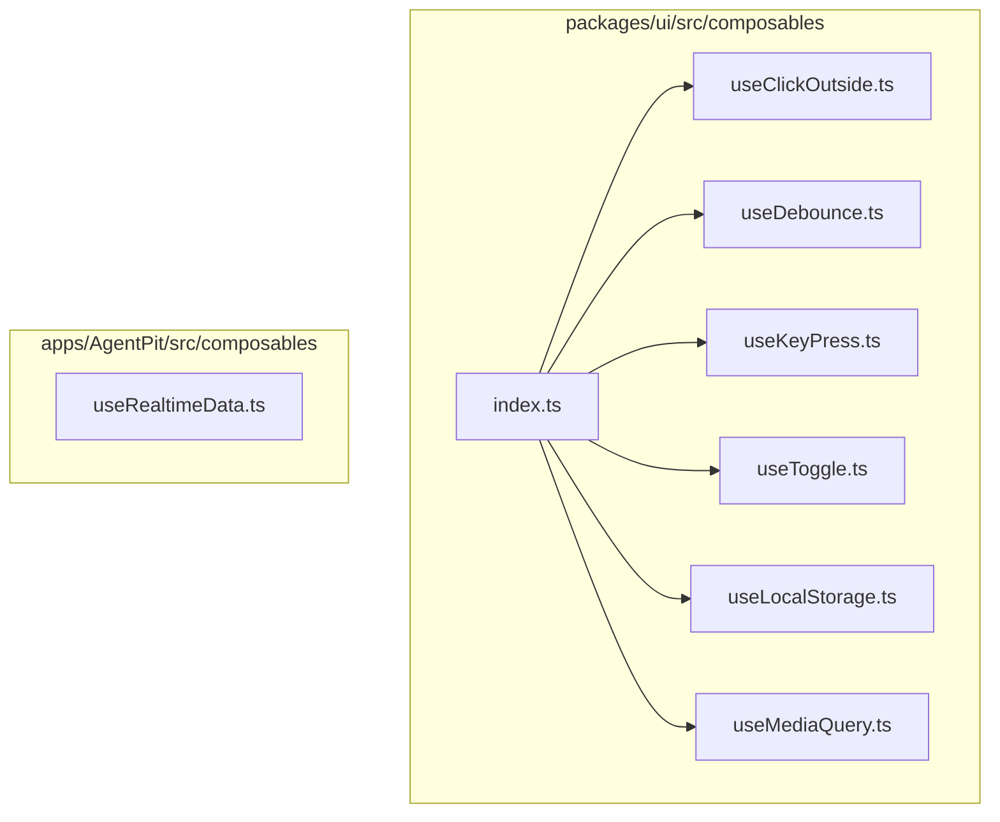
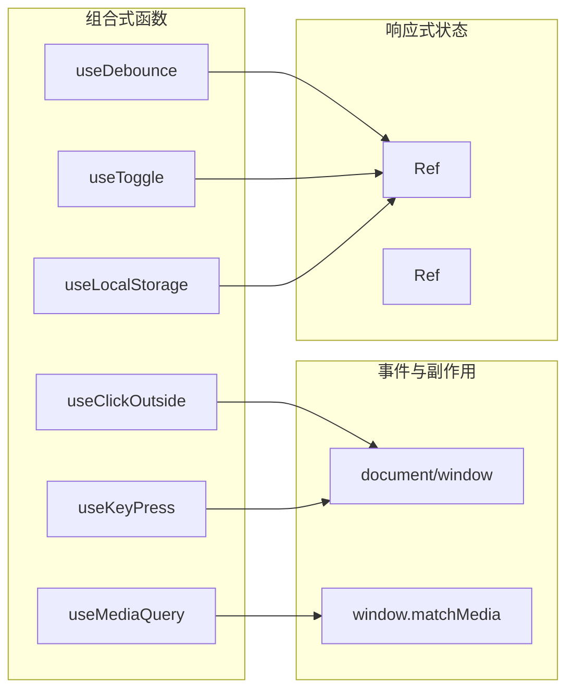
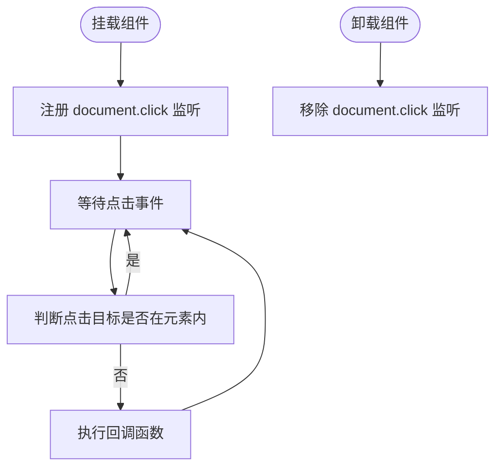
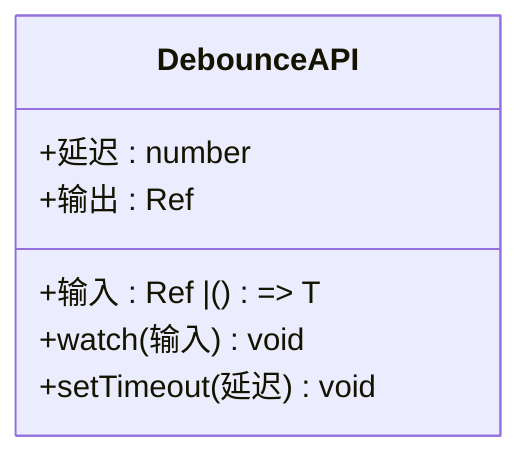
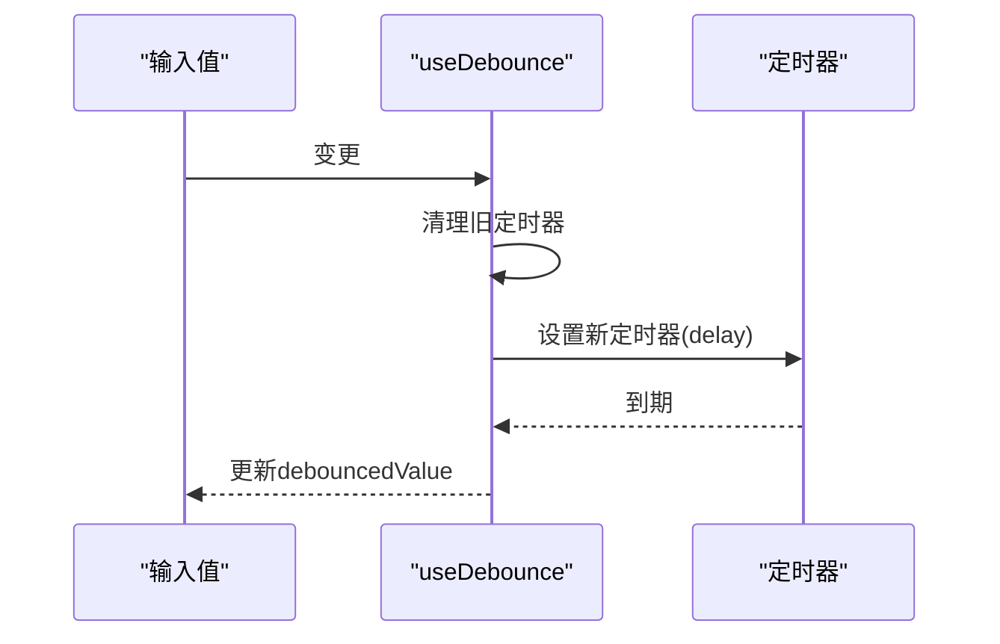
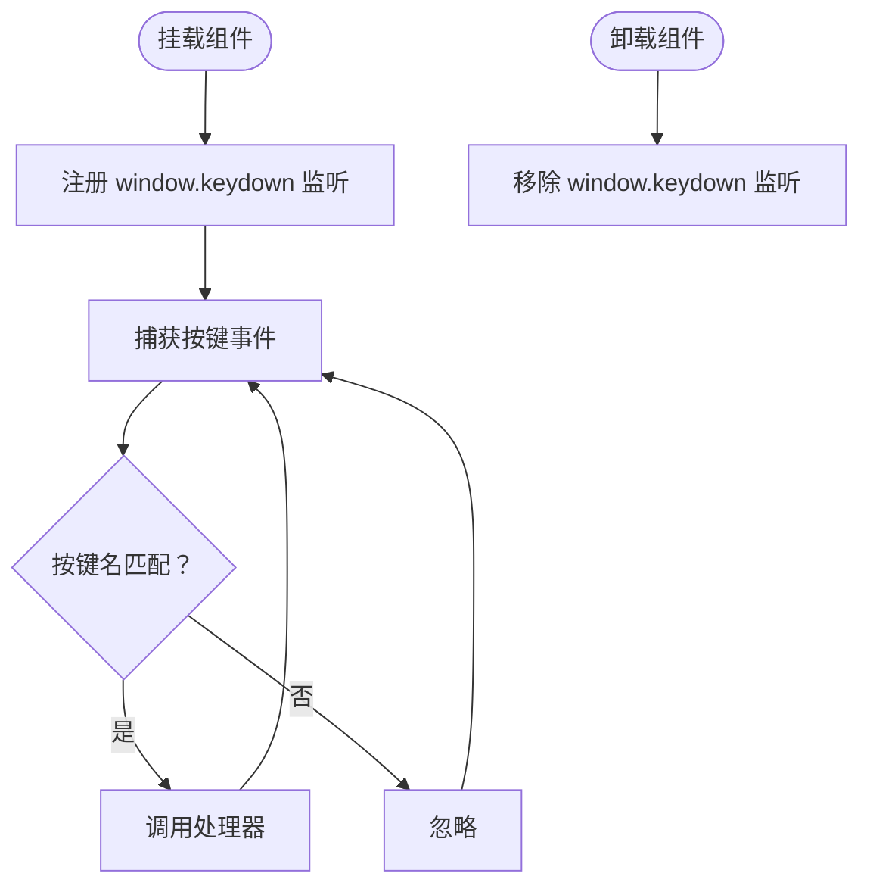
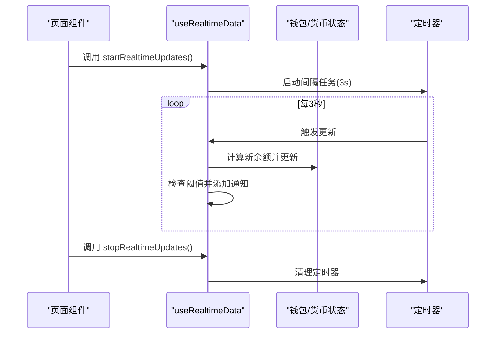
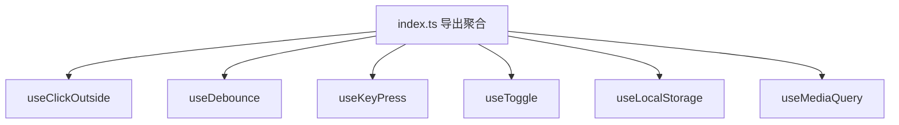

# 组合式API系统

<cite>
**本文引用的文件**
- [useClickOutside.ts](file://apps/AgentPit/packages/ui/src/composables/useClickOutside.ts)
- [useDebounce.ts](file://apps/AgentPit/packages/ui/src/composables/useDebounce.ts)
- [useKeyPress.ts](file://apps/AgentPit/packages/ui/src/composables/useKeyPress.ts)
- [useToggle.ts](file://apps/AgentPit/packages/ui/src/composables/useToggle.ts)
- [useLocalStorage.ts](file://apps/AgentPit/packages/ui/src/composables/useLocalStorage.ts)
- [useMediaQuery.ts](file://apps/AgentPit/packages/ui/src/composables/useMediaQuery.ts)
- [index.ts](file://apps/AgentPit/packages/ui/src/composables/index.ts)
- [useDebounce.ts](file://apps/AgentPit/src/composables/useDebounce.ts)
- [useRealtimeData.ts](file://apps/AgentPit/src/composables/useRealtimeData.ts)
</cite>

## 目录
1. [简介](#简介)
2. [项目结构](#项目结构)
3. [核心组件](#核心组件)
4. [架构总览](#架构总览)
5. [详细组件分析](#详细组件分析)
6. [依赖分析](#依赖分析)
7. [性能考虑](#性能考虑)
8. [故障排查指南](#故障排查指南)
9. [结论](#结论)
10. [附录](#附录)

## 简介
本文件面向AgentPit应用中的组合式API系统，聚焦于UI与通用逻辑层面的可复用组合式函数（Composables）。重点覆盖以下组合式API：useClickOutside、useDebounce、useKeyPress，并补充useToggle、useLocalStorage、useMediaQuery等常用工具型组合式函数。文档从设计模式、参数与返回值、使用场景与示例、性能优化与最佳实践、以及常见问题解决等方面进行系统化说明。

## 项目结构
AgentPit中组合式API主要分布在两个位置：
- packages/ui/src/composables：以UI交互与通用工具为主的组合式函数集合，导出入口位于 index.ts
- apps/AgentPit/src/composables：业务侧组合式函数，如实时数据监控等

图表来源
- [index.ts:1-7](file://apps/AgentPit/packages/ui/src/composables/index.ts#L1-L7)
- [useClickOutside.ts:1-18](file://apps/AgentPit/packages/ui/src/composables/useClickOutside.ts#L1-L18)
- [useDebounce.ts:1-18](file://apps/AgentPit/packages/ui/src/composables/useDebounce.ts#L1-L18)
- [useKeyPress.ts:1-18](file://apps/AgentPit/packages/ui/src/composables/useKeyPress.ts#L1-L18)
- [useToggle.ts:1-25](file://apps/AgentPit/packages/ui/src/composables/useToggle.ts#L1-L25)
- [useLocalStorage.ts:1-15](file://apps/AgentPit/packages/ui/src/composables/useLocalStorage.ts#L1-L15)
- [useMediaQuery.ts:1-28](file://apps/AgentPit/packages/ui/src/composables/useMediaQuery.ts#L1-L28)
- [useRealtimeData.ts:1-117](file://apps/AgentPit/src/composables/useRealtimeData.ts#L1-L117)

章节来源
- [index.ts:1-7](file://apps/AgentPit/packages/ui/src/composables/index.ts#L1-L7)

## 核心组件
本节对关键组合式API进行功能、参数、返回值与典型使用场景的概述。

- useClickOutside
  - 功能：监听全局点击事件，当点击目标不在指定元素内部时触发回调
  - 参数：element（Ref<HTMLElement | null>）、callback（() => void）
  - 返回值：无（副作用注册/清理）
  - 使用场景：下拉菜单、模态框、弹出层的“点击外部关闭”
  - 复杂度：O(1) 事件处理；内存占用低
  - 注意：确保在组件卸载时自动移除监听器（由生命周期钩子保障）

- useDebounce
  - 功能：对输入值进行防抖，延迟更新结果
  - 参数：value（Ref<T> 或 () => T）、delay（number，默认300ms）
  - 返回值：Ref<T>（延迟后的值）
  - 使用场景：搜索框输入、窗口尺寸变化、高频输入处理
  - 复杂度：watch开销与定时器管理；延迟越大，触发频率越低
  - 注意：避免在极短delay下频繁触发；注意清理定时器

- useKeyPress
  - 功能：监听键盘按下事件，匹配目标按键时执行处理器
  - 参数：targetKey（string）、handler（(event: KeyboardEvent) => void）
  - 返回值：无（副作用注册/清理）
  - 使用场景：快捷键、热键、调试模式开关
  - 复杂度：O(1) 事件处理；注意事件冒泡与重复触发

- useToggle
  - 功能：布尔状态的切换与设置
  - 参数：initialValue（boolean，默认false）
  - 返回值：包含 value、toggle、setTrue、setFalse 的对象
  - 使用场景：显示/隐藏、开关控制、多状态轮转
  - 复杂度：O(1) 原子操作

- useLocalStorage
  - 功能：持久化存储与响应式同步
  - 参数：key（string）、defaultValue（T）
  - 返回值：Ref<T>（本地存储同步的响应式值）
  - 使用场景：主题偏好、用户设置、临时配置
  - 复杂度：watch深拷贝写入；注意序列化/反序列化开销

- useMediaQuery
  - 功能：媒体查询匹配状态的响应式封装
  - 参数：query（string，CSS媒体查询表达式）
  - 返回值：Ref<boolean>（是否匹配）
  - 使用场景：响应式布局、暗色模式检测
  - 复杂度：matchMedia监听；变更时更新状态

章节来源
- [useClickOutside.ts:1-18](file://apps/AgentPit/packages/ui/src/composables/useClickOutside.ts#L1-L18)
- [useDebounce.ts:1-18](file://apps/AgentPit/packages/ui/src/composables/useDebounce.ts#L1-L18)
- [useKeyPress.ts:1-18](file://apps/AgentPit/packages/ui/src/composables/useKeyPress.ts#L1-L18)
- [useToggle.ts:1-25](file://apps/AgentPit/packages/ui/src/composables/useToggle.ts#L1-L25)
- [useLocalStorage.ts:1-15](file://apps/AgentPit/packages/ui/src/composables/useLocalStorage.ts#L1-L15)
- [useMediaQuery.ts:1-28](file://apps/AgentPit/packages/ui/src/composables/useMediaQuery.ts#L1-L28)

## 架构总览
组合式API遵循Vue 3 Composition API的“副作用+响应式”范式：
- 在onMounted/onUnmounted中注册/清理DOM事件或定时器
- 使用ref/watch构建响应式状态与派生值
- 将关注点分离为独立的可复用模块，通过导出统一入口聚合

图表来源
- [useClickOutside.ts:1-18](file://apps/AgentPit/packages/ui/src/composables/useClickOutside.ts#L1-L18)
- [useDebounce.ts:1-18](file://apps/AgentPit/packages/ui/src/composables/useDebounce.ts#L1-L18)
- [useKeyPress.ts:1-18](file://apps/AgentPit/packages/ui/src/composables/useKeyPress.ts#L1-L18)
- [useToggle.ts:1-25](file://apps/AgentPit/packages/ui/src/composables/useToggle.ts#L1-L25)
- [useLocalStorage.ts:1-15](file://apps/AgentPit/packages/ui/src/composables/useLocalStorage.ts#L1-L15)
- [useMediaQuery.ts:1-28](file://apps/AgentPit/packages/ui/src/composables/useMediaQuery.ts#L1-L28)

## 详细组件分析

### useClickOutside 分析
- 设计要点
  - 通过Ref持有目标元素引用，在mounted阶段绑定document click事件
  - 利用contains判断点击是否发生在元素内部，非内部则调用回调
  - 卸载时移除监听，避免内存泄漏
- 典型流程图

图表来源
- [useClickOutside.ts:1-18](file://apps/AgentPit/packages/ui/src/composables/useClickOutside.ts#L1-L18)

章节来源
- [useClickOutside.ts:1-18](file://apps/AgentPit/packages/ui/src/composables/useClickOutside.ts#L1-L18)

### useDebounce 分析
- 设计要点
  - 接受Ref或Getter作为输入源，支持动态依赖
  - 使用watch监听输入变化，每次变更前清理上一个定时器
  - 定时器到期后更新debouncedValue，降低渲染与网络请求压力
- 类关系图（概念性）

- 典型时序图（输入到输出）

图表来源
- [useDebounce.ts:1-18](file://apps/AgentPit/packages/ui/src/composables/useDebounce.ts#L1-L18)

章节来源
- [useDebounce.ts:1-18](file://apps/AgentPit/packages/ui/src/composables/useDebounce.ts#L1-L18)

### useKeyPress 分析
- 设计要点
  - 在mounted阶段注册keydown事件，仅在按键名匹配时调用处理器
  - 卸载时移除监听，避免残留事件
- 流程图

图表来源
- [useKeyPress.ts:1-18](file://apps/AgentPit/packages/ui/src/composables/useKeyPress.ts#L1-L18)

章节来源
- [useKeyPress.ts:1-18](file://apps/AgentPit/packages/ui/src/composables/useKeyPress.ts#L1-L18)

### useToggle、useLocalStorage、useMediaQuery
- useToggle
  - 提供value、toggle、setTrue、setFalse，适合二态控制
- useLocalStorage
  - 读取本地存储初始化响应式值，并在变更时深度写回
- useMediaQuery
  - 基于matchMedia监听媒体查询变化，返回匹配状态

章节来源
- [useToggle.ts:1-25](file://apps/AgentPit/packages/ui/src/composables/useToggle.ts#L1-L25)
- [useLocalStorage.ts:1-15](file://apps/AgentPit/packages/ui/src/composables/useLocalStorage.ts#L1-L15)
- [useMediaQuery.ts:1-28](file://apps/AgentPit/packages/ui/src/composables/useMediaQuery.ts#L1-L28)

### useRealtimeData（业务侧组合式API）
- 设计要点
  - 基于store驱动的模拟实时数据流，周期性生成随机变化并触发通知
  - 内置阈值检测与通知队列管理，支持自动消失
  - 在组件卸载时停止定时任务，防止内存泄漏
- 时序图（启动到停止）

图表来源
- [useRealtimeData.ts:1-117](file://apps/AgentPit/src/composables/useRealtimeData.ts#L1-L117)

章节来源
- [useRealtimeData.ts:1-117](file://apps/AgentPit/src/composables/useRealtimeData.ts#L1-L117)

## 依赖分析
- 导出聚合
  - packages/ui/src/composables/index.ts统一导出各组合式函数，便于按需引入
- 内部耦合
  - 各组合式函数均依赖Vue响应式与生命周期API，彼此解耦
  - 业务侧useRealtimeData依赖store与定时器，但不直接依赖UI层组合式函数
- 外部依赖
  - DOM事件、window API、localStorage、matchMedia等浏览器能力

图表来源
- [index.ts:1-7](file://apps/AgentPit/packages/ui/src/composables/index.ts#L1-L7)

章节来源
- [index.ts:1-7](file://apps/AgentPit/packages/ui/src/composables/index.ts#L1-L7)

## 性能考虑
- 防抖策略
  - 合理设置delay，避免过小导致频繁更新；对昂贵操作（如网络请求）建议使用useDebounce包裹
  - 对输入源使用Getter形式可减少不必要的watch触发
- 事件监听
  - 在mounted注册、onUnmounted移除，避免重复绑定与内存泄漏
  - 对高频事件（如scroll、resize）建议配合防抖/节流
- 响应式写入
  - useLocalStorage的深拷贝写入可能带来开销，建议只存储必要字段
- 媒体查询
  - matchMedia监听在移动端设备上可能频繁触发，建议结合节流或业务场景降频

## 故障排查指南
- 事件未触发或重复触发
  - 检查是否正确在mounted注册、onUnmounted移除
  - 确认事件目标与冒泡行为，必要时阻止默认行为或使用捕获阶段
- 防抖无效
  - 确认传入的是Ref而非字面量；检查delay是否过大
  - 若使用Getter输入源，确认依赖的响应式值确实在变化
- 键盘事件不生效
  - 确认targetKey与实际按键一致（大小写敏感）
  - 检查是否有焦点元素拦截了keydown事件
- 本地存储不同步
  - 确认key唯一且类型一致；避免存储不可序列化对象
- 媒体查询不更新
  - 确认CSS媒体查询表达式正确；检查matchMedia实例是否被释放

## 结论
AgentPit的组合式API体系以Vue 3 Composition API为核心，围绕“副作用+响应式”构建，具备高内聚、低耦合、易测试的特点。通过useClickOutside、useDebounce、useKeyPress等基础工具，以及useToggle、useLocalStorage、useMediaQuery等实用函数，能够快速搭建交互与状态管理场景。业务侧如useRealtimeData进一步展示了如何将组合式函数与store、定时器结合，形成可维护的实时数据流方案。

## 附录
- 最佳实践清单
  - 统一在组合式函数中管理副作用，避免在组件中分散处理
  - 对高频事件与昂贵操作使用防抖/节流
  - 明确输入与输出类型，保持组合式函数纯函数式风格
  - 在组合式函数中提供必要的清理逻辑，确保资源释放
  - 对需要跨组件共享的状态，优先使用store或provide/inject，而非全局变量