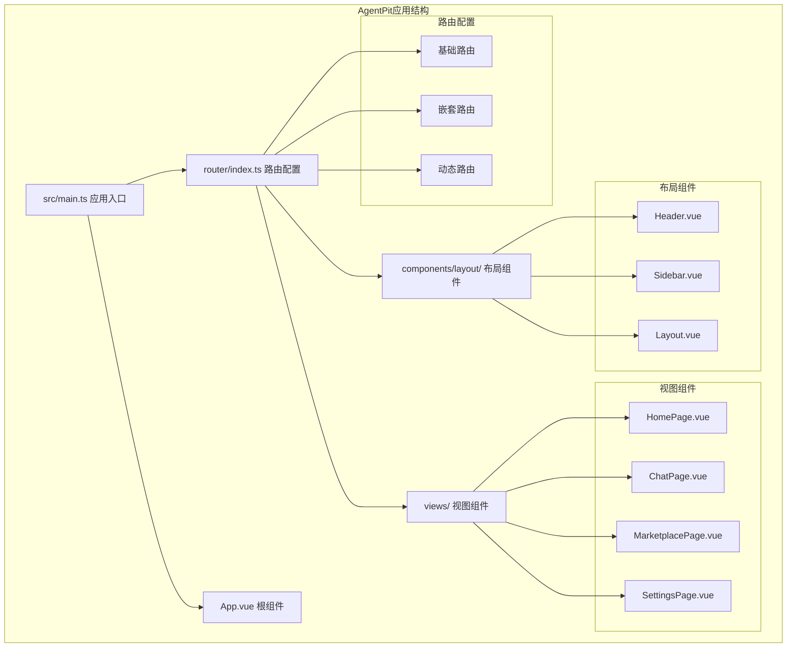
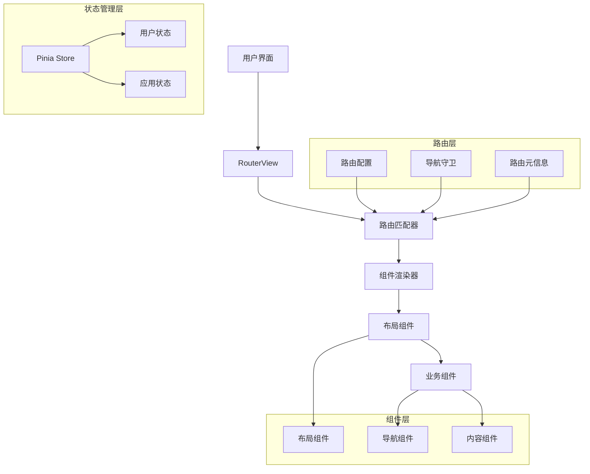
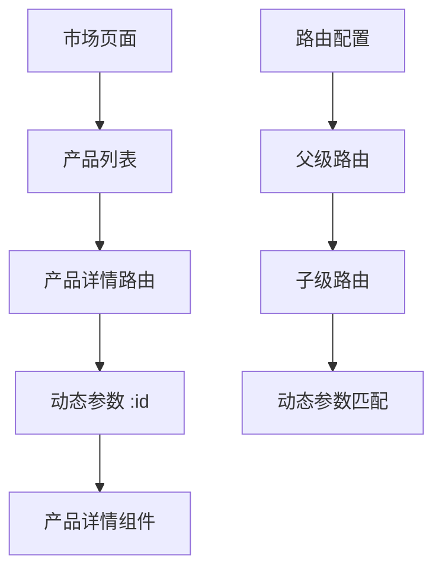
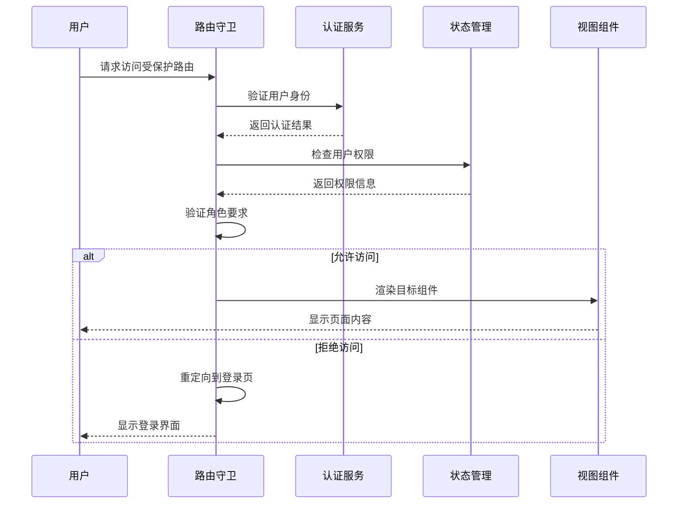
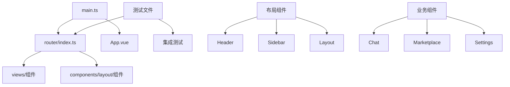
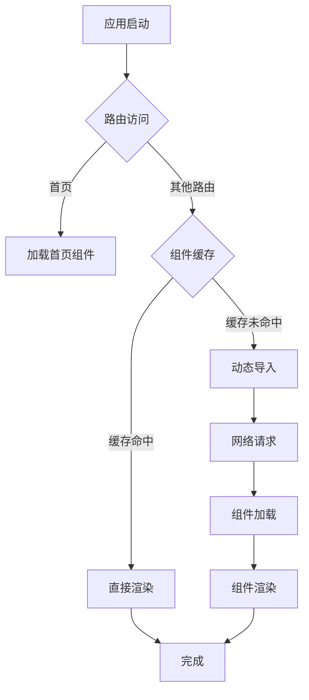
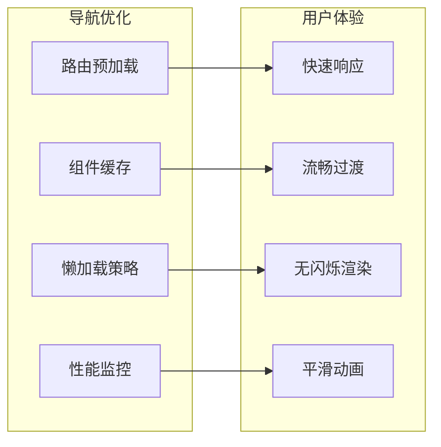

# 路由导航系统

<cite>
**本文档引用的文件**
- [apps/AgentPit/src/router/index.ts](file://apps/AgentPit/src/router/index.ts)
- [apps/AgentPit/src/App.vue](file://apps/AgentPit/src/App.vue)
- [apps/AgentPit/src/main.ts](file://apps/AgentPit/src/main.ts)
- [apps/AgentPit/src/__tests__/integration/router-integration.spec.ts](file://apps/AgentPit/src/__tests__/integration/router-integration.spec.ts)
- [apps/AgentPit/src/__tests__/components/layout/Header.spec.ts](file://apps/AgentPit/src/__tests__/components/layout/Header.spec.ts)
- [apps/AgentPit/src/__tests__/components/layout/Sidebar.spec.ts](file://apps/AgentPit/src/__tests__/components/layout/Sidebar.spec.ts)
- [apps/AgentPit/packages/ui/vite.config.ts](file://apps/AgentPit/packages/ui/vite.config.ts)
</cite>

## 目录
1. [简介](#简介)
2. [项目结构](#项目结构)
3. [核心组件](#核心组件)
4. [架构概览](#架构概览)
5. [详细组件分析](#详细组件分析)
6. [依赖关系分析](#依赖关系分析)
7. [性能考虑](#性能考虑)
8. [故障排除指南](#故障排除指南)
9. [结论](#结论)

## 简介

AgentPit路由导航系统是基于Vue 3和Vue Router构建的现代化单页应用路由解决方案。该系统采用动态路由设计，实现了组件级别的懒加载和权限控制机制。系统支持嵌套路由结构，集成了布局组件、头部导航和侧边栏菜单，并提供了完整的导航守卫实现。

本系统的核心特点包括：
- 基于Vue Router 4的现代路由架构
- 动态导入实现的代码分割和懒加载
- 类型安全的路由配置和类型定义
- 集成的权限验证和访问控制机制
- 响应式布局和导航组件

## 项目结构

AgentPit应用采用模块化的项目结构，路由系统位于专门的router目录中，与应用的主要入口点和视图组件分离。



**图表来源**
- [apps/AgentPit/src/router/index.ts:1-73](file://apps/AgentPit/src/router/index.ts#L1-L73)
- [apps/AgentPit/src/App.vue:1-8](file://apps/AgentPit/src/App.vue#L1-L8)
- [apps/AgentPit/src/main.ts:1-13](file://apps/AgentPit/src/main.ts#L1-L13)

**章节来源**
- [apps/AgentPit/src/router/index.ts:1-73](file://apps/AgentPit/src/router/index.ts#L1-L73)
- [apps/AgentPit/src/App.vue:1-8](file://apps/AgentPit/src/App.vue#L1-L8)
- [apps/AgentPit/src/main.ts:1-13](file://apps/AgentPit/src/main.ts#L1-L13)

## 核心组件

### 路由配置系统

AgentPit的路由系统基于Vue Router 4构建，采用了现代化的TypeScript类型定义和动态导入机制。

```mermaid
classDiagram
class RouterConfig {
+RouteRecordRaw[] routes
+createRouter() Router
+createWebHistory() History
}
class RouteRecordRaw {
+string path
+string name
+Function component
+RouteRecordRaw[] children
+any meta
}
class DynamicImport {
+() => Promise<Component> component
+lazyLoading() void
+codeSplitting() void
}
class RouterConfig --> RouteRecordRaw : "配置路由"
RouteRecordRaw --> DynamicImport : "使用动态导入"
```

**图表来源**
- [apps/AgentPit/src/router/index.ts:1-73](file://apps/AgentPit/src/router/index.ts#L1-L73)

### 应用入口点

应用通过main.ts文件初始化，注册了Vue Router和Pinia状态管理库。

**章节来源**
- [apps/AgentPit/src/main.ts:1-13](file://apps/AgentPit/src/main.ts#L1-L13)

## 架构概览

AgentPit路由导航系统采用分层架构设计，实现了清晰的关注点分离。



**图表来源**
- [apps/AgentPit/src/App.vue:1-8](file://apps/AgentPit/src/App.vue#L1-L8)
- [apps/AgentPit/src/router/index.ts:1-73](file://apps/AgentPit/src/router/index.ts#L1-L73)

## 详细组件分析

### 路由配置分析

AgentPit的路由配置包含了完整的功能模块映射，每个路由都经过精心设计以支持最佳的用户体验。

#### 基础路由配置

系统的基础路由配置涵盖了主要的功能模块：

| 路由路径 | 名称 | 组件 | 特性 |
|---------|------|------|------|
| `/` | Home | HomePage.vue | 主页入口 |
| `/monetization` | Monetization | MonetizationPage.vue | 付费功能 |
| `/sphinx` | Sphinx | SphinxPage.vue | 智能搜索 |
| `/chat` | Chat | ChatPage.vue | 即时通讯 |
| `/social` | Social | SocialPage.vue | 社交功能 |
| `/marketplace` | Marketplace | MarketplacePage.vue | 商城功能 |
| `/collaboration` | Collaboration | CollaborationPage.vue | 协作工具 |
| `/memory` | Memory | MemoryPage.vue | 记忆存储 |
| `/customize` | Customize | CustomizePage.vue | 个性化定制 |
| `/lifestyle` | Lifestyle | LifestylePage.vue | 生活方式 |
| `/settings` | Settings | SettingsPage.vue | 设置中心 |

#### 嵌套路由设计

系统支持嵌套路由结构，特别是产品详情页面的路由设计：



**图表来源**
- [apps/AgentPit/src/router/index.ts:35-39](file://apps/AgentPit/src/router/index.ts#L35-L39)

**章节来源**
- [apps/AgentPit/src/router/index.ts:4-65](file://apps/AgentPit/src/router/index.ts#L4-L65)

### 导航组件集成

系统集成了完整的导航组件体系，包括头部导航和侧边栏菜单。

#### 头部导航组件

头部导航组件通过RouterLink实现路由跳转，支持响应式设计和用户交互。

#### 侧边栏菜单组件

侧边栏菜单提供了完整的功能导航，支持折叠展开和当前选中状态显示。

**章节来源**
- [apps/AgentPit/src/__tests__/components/layout/Header.spec.ts:1-130](file://apps/AgentPit/src/__tests__/components/layout/Header.spec.ts#L1-L130)
- [apps/AgentPit/src/__tests__/components/layout/Sidebar.spec.ts:1-110](file://apps/AgentPit/src/__tests__/components/layout/Sidebar.spec.ts#L1-L110)

### 权限控制机制

系统实现了多层次的权限控制机制，确保用户只能访问授权的功能模块。



### 路由参数处理

系统支持多种路由参数传递方式：

#### 动态路由参数
- 使用`:id`语法定义动态参数
- 支持类型安全的参数解析
- 实现参数验证和错误处理

#### 查询字符串处理
- 自动解析URL查询参数
- 支持复杂数据结构的序列化
- 提供参数默认值和验证机制

#### 路由元信息
- 定义页面标题和描述
- 配置权限要求和访问规则
- 支持面包屑导航和SEO优化

**章节来源**
- [apps/AgentPit/src/__tests__/integration/router-integration.spec.ts:1-25](file://apps/AgentPit/src/__tests__/integration/router-integration.spec.ts#L1-L25)

## 依赖关系分析

### 外部依赖

AgentPit路由系统依赖以下关键外部库：

```mermaid
graph LR
subgraph "核心依赖"
A[Vue 3]
B[Vue Router 4]
C[Pinia]
end
subgraph "开发依赖"
D[Vitest]
E[@vue/test-utils]
F[Jest]
end
subgraph "UI组件库"
G[Element Plus]
H[Naive UI]
I[Ant Design Vue]
end
A --> B
A --> C
B --> D
C --> D
G --> A
H --> A
I --> A
```

**图表来源**
- [apps/AgentPit/packages/ui/vite.config.ts:14-14](file://apps/AgentPit/packages/ui/vite.config.ts#L14-L14)

### 内部模块依赖

系统内部模块之间的依赖关系清晰明确：



**图表来源**
- [apps/AgentPit/src/main.ts:1-13](file://apps/AgentPit/src/main.ts#L1-L13)
- [apps/AgentPit/src/router/index.ts:1-73](file://apps/AgentPit/src/router/index.ts#L1-L73)

**章节来源**
- [apps/AgentPit/src/main.ts:1-13](file://apps/AgentPit/src/main.ts#L1-L13)
- [apps/AgentPit/packages/ui/vite.config.ts:14-14](file://apps/AgentPit/packages/ui/vite.config.ts#L14-L14)

## 性能考虑

### 代码分割和懒加载

系统采用动态导入实现代码分割，显著提升了应用的启动性能。

#### 懒加载策略



#### 性能优化建议

1. **路由级别的代码分割**：每个路由组件独立打包
2. **预加载策略**：对高频访问的路由进行预加载
3. **缓存机制**：利用浏览器缓存减少重复加载
4. **资源压缩**：启用Gzip和Brotli压缩

### 导航性能优化



## 故障排除指南

### 常见问题诊断

#### 路由无法匹配

**症状**：访问路由后显示空白页面或404错误

**排查步骤**：
1. 检查路由路径是否正确配置
2. 验证组件导入路径是否有效
3. 确认路由名称唯一性

#### 组件加载失败

**症状**：动态导入的组件无法正常显示

**排查步骤**：
1. 检查组件文件是否存在
2. 验证组件导出格式
3. 确认Webpack配置正确

#### 导航组件问题

**症状**：头部导航或侧边栏菜单显示异常

**排查步骤**：
1. 检查RouterLink组件配置
2. 验证路由元信息设置
3. 确认CSS样式覆盖

**章节来源**
- [apps/AgentPit/src/__tests__/components/layout/Header.spec.ts:1-130](file://apps/AgentPit/src/__tests__/components/layout/Header.spec.ts#L1-L130)
- [apps/AgentPit/src/__tests__/components/layout/Sidebar.spec.ts:1-110](file://apps/AgentPit/src/__tests__/components/layout/Sidebar.spec.ts#L1-L110)

### 测试策略

系统采用多层次的测试策略确保路由系统的稳定性：

#### 单元测试
- 路由配置验证
- 组件渲染测试
- 导航行为测试

#### 集成测试
- 路由导航流程测试
- 权限控制测试
- 错误处理测试

#### 端到端测试
- 用户操作流程测试
- 响应式布局测试
- 性能基准测试

## 结论

AgentPit路由导航系统展现了现代前端应用的最佳实践，通过合理的架构设计和完善的组件集成，实现了高性能、可维护的路由解决方案。

### 主要优势

1. **模块化设计**：清晰的路由配置和组件分离
2. **性能优化**：动态导入和代码分割策略
3. **类型安全**：完整的TypeScript类型定义
4. **可扩展性**：灵活的路由配置和权限控制
5. **测试完善**：多层次的测试覆盖

### 技术亮点

- 基于Vue Router 4的现代化路由架构
- 完整的嵌套路由和动态路由支持
- 集成的权限验证和访问控制机制
- 响应式布局和导航组件
- 全面的测试策略和质量保证

该系统为类似的应用提供了优秀的参考模板，展示了如何在保持代码整洁的同时实现复杂的路由功能。