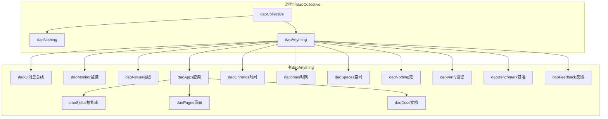
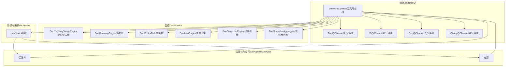
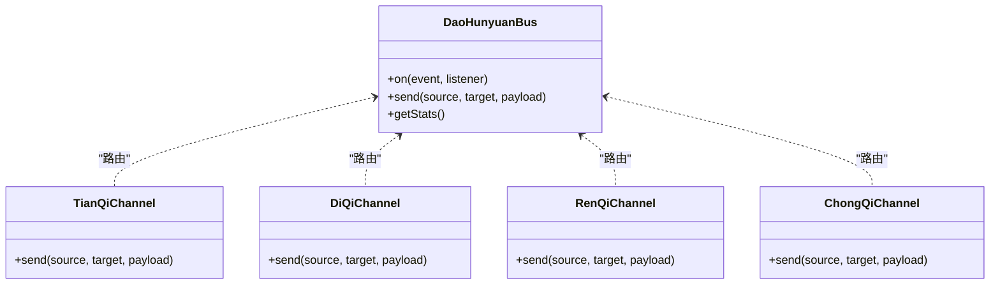
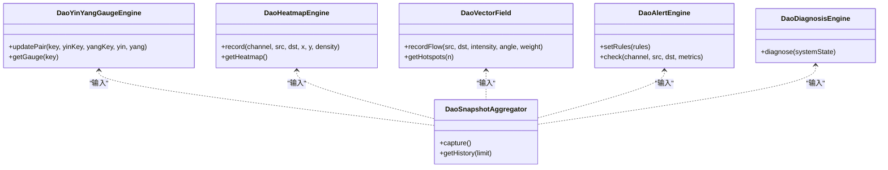
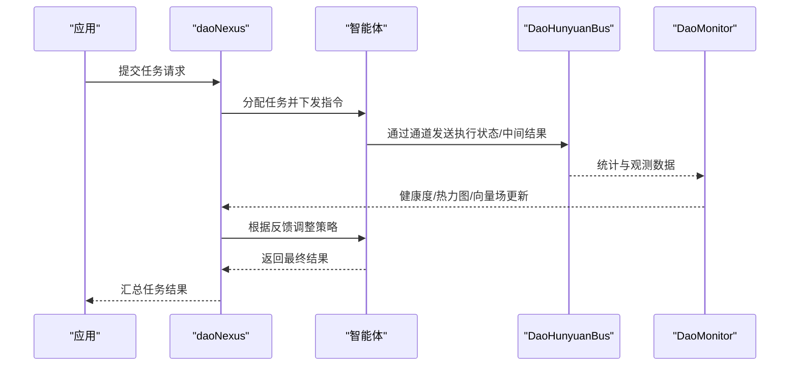
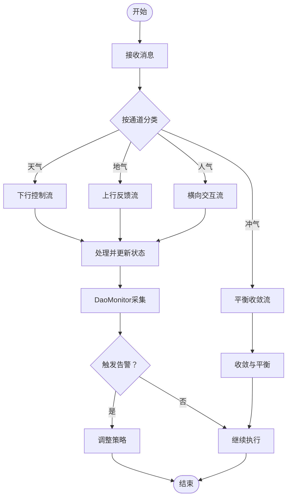
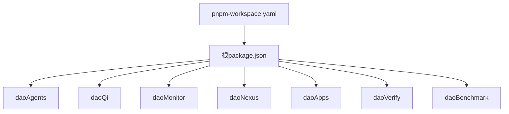

# DaoMind多智能体系统

<cite>
**本文引用的文件**
- [apps/Daomind/README.md](file://apps/Daomind/README.md)
- [apps/Daomind/pnpm-workspace.yaml](file://apps/Daomind/pnpm-workspace.yaml)
- [apps/Daomind/package.json](file://apps/Daomind/package.json)
- [apps/Daomind/packages/daoAgents/README.md](file://apps/Daomind/packages/daoAgents/README.md)
- [apps/Daomind/packages/daoQi/src/DaoHunyuanBus.ts](file://apps/Daomind/packages/daoQi/src/DaoHunyuanBus.ts)
- [apps/Daomind/packages/daoQi/src/TianQiChannel.ts](file://apps/Daomind/packages/daoQi/src/TianQiChannel.ts)
- [apps/Daomind/packages/daoQi/src/DiQiChannel.ts](file://apps/Daomind/packages/daoQi/src/DiQiChannel.ts)
- [apps/Daomind/packages/daoQi/src/RenQiChannel.ts](file://apps/Daomind/packages/daoQi/src/RenQiChannel.ts)
- [apps/Daomind/packages/daoQi/src/ChongQiChannel.ts](file://apps/Daomind/packages/daoQi/src/ChongQiChannel.ts)
- [apps/Daomind/packages/daoMonitor/src/DaoYinYangGaugeEngine.ts](file://apps/Daomind/packages/daoMonitor/src/DaoYinYangGaugeEngine.ts)
- [apps/Daomind/packages/daoMonitor/src/DaoHeatmapEngine.ts](file://apps/Daomind/packages/daoMonitor/src/DaoHeatmapEngine.ts)
- [apps/Daomind/packages/daoMonitor/src/DaoVectorField.ts](file://apps/Daomind/packages/daoMonitor/src/DaoVectorField.ts)
- [apps/Daomind/packages/daoMonitor/src/DaoAlertEngine.ts](file://apps/Daomind/packages/daoMonitor/src/DaoAlertEngine.ts)
- [apps/Daomind/packages/daoMonitor/src/DaoDiagnosisEngine.ts](file://apps/Daomind/packages/daoMonitor/src/DaoDiagnosisEngine.ts)
- [apps/Daomind/packages/daoMonitor/src/DaoSnapshotAggregator.ts](file://apps/Daomind/packages/daoMonitor/src/DaoSnapshotAggregator.ts)
- [apps/Daomind/packages/daoNexus/src/daoNexus.ts](file://apps/Daomind/packages/daoNexus/src/daoNexus.ts)
- [apps/Daomind/packages/daoApps/src/daoApps.ts](file://apps/Daomind/packages/daoApps/src/daoApps.ts)
- [apps/Daomind/packages/daoCollective/src/daoCollective.ts](file://apps/Daomind/packages/daoCollective/src/daoCollective.ts)
- [apps/Daomind/packages/daoAnything/src/daoAnything.ts](file://apps/Daomind/packages/daoAnything/src/daoAnything.ts)
- [apps/Daomind/packages/daoBenchmark/src/daoBenchmark.ts](file://apps/Daomind/packages/daoBenchmark/src/daoBenchmark.ts)
- [apps/Daomind/packages/daoSkilLs/src/daoSkilLs.ts](file://apps/Daomind/packages/daoSkilLs/src/daoSkilLs.ts)
- [apps/Daomind/packages/daoPages/src/daoPages.ts](file://apps/Daomind/packages/daoPages/src/daoPages.ts)
- [apps/Daomind/packages/daoDocs/src/daoDocs.ts](file://apps/Daomind/packages/daoDocs/src/daoDocs.ts)
- [apps/Daomind/packages/daoFeedback/src/daoFeedback.ts](file://apps/Daomind/packages/daoFeedback/src/daoFeedback.ts)
- [apps/Daomind/packages/daoChronos/src/daoChronos.ts](file://apps/Daomind/packages/daoChronos/src/daoChronos.ts)
- [apps/Daomind/packages/daotimes/src/daotimes.ts](file://apps/Daomind/packages/daotimes/src/daotimes.ts)
- [apps/Daomind/packages/daoSpaces/src/daoSpaces.ts](file://apps/Daomind/packages/daoSpaces/src/daoSpaces.ts)
- [apps/Daomind/packages/daoNothing/src/daoNothing.ts](file://apps/Daomind/packages/daoNothing/src/daoNothing.ts)
- [apps/Daomind/packages/daoVerify/src/daoVerify.ts](file://apps/Daomind/packages/daoVerify/src/daoVerify.ts)
- [apps/Daomind/packages/daoApps/src/__tests__/agents-apps-integration.test.ts](file://apps/Daomind/packages/daoApps/src/__tests__/agents-apps-integration.test.ts)
- [apps/Daomind/packages/daoApps/src/__tests__/verify-integration.test.ts](file://apps/Daomind/packages/daoApps/src/__tests__/verify-integration.test.ts)
- [apps/Daomind/packages/daoApps/src/__tests__/full-system.test.ts](file://apps/Daomind/packages/daoApps/src/__tests__/full-system.test.ts)
- [apps/Daomind/packages/daoApps/src/__tests__/test-monitor-system.test.ts](file://apps/Daomind/packages/daoApps/src/__tests__/test-monitor-system.test.ts)
- [apps/Daomind/packages/daoApps/src/__tests__/test-project.js](file://apps/Daomind/packages/daoApps/src/__tests__/test-project.js)
- [apps/Daomind/packages/daoApps/src/__tests__/test-qi-message.js](file://apps/Daomind/packages/daoApps/src/__tests__/test-qi-message.js)
- [apps/AgentPit/README.md](file://apps/AgentPit/README.md)
</cite>

## 目录
1. [引言](#引言)
2. [项目结构](#项目结构)
3. [核心组件](#核心组件)
4. [架构总览](#架构总览)
5. [详细组件分析](#详细组件分析)
6. [依赖分析](#依赖分析)
7. [性能考虑](#性能考虑)
8. [故障排查指南](#故障排查指南)
9. [结论](#结论)
10. [附录](#附录)

## 引言
DaoMind是一个以道家哲学为思想内核的现代化多智能体系统框架，采用monorepo架构组织，强调“自然无为”的去中心化协调、四气通道的消息总线、以及阴阳平衡的反馈调节机制。系统通过“道（daoCollective）—无（daoNothing）—有（daoAnything）”三层哲学基座，结合“反者道之动”的反馈四阶段生命周期，构建从感知、聚合、冲和到归元的闭环控制，并以DaoQi消息总线承载天、地、人、冲四通道的数据流，配合DaoMonitor监控体系实现系统可观测与自适应优化。

DaoMind与AgentPit平台存在紧密的集成关系：AgentPit作为前端应用与业务场景载体，可直接消费DaoMind提供的智能体能力与消息通道；同时，DaoMind的监控与验证模块亦可为AgentPit提供可观测性与质量保障。本文面向开发者，系统阐述多智能体架构设计、分布式计算实现、智能体协调机制、任务编排、通信协议与状态同步，并给出配置与扩展建议。

## 项目结构
DaoMind采用pnpm工作区管理多个子包，核心模块围绕“智能体（daoAgents）—容器（daoAnything）—枢纽（daoNexus）—应用（daoApps）—消息（daoQi）—监控（daoMonitor）—验证（daoVerify）”等维度展开，形成从基础设施到业务应用的完整链路。

图表来源
- [apps/Daomind/README.md:496-511](file://apps/Daomind/README.md#L496-L511)
- [apps/Daomind/pnpm-workspace.yaml:1-3](file://apps/Daomind/pnpm-workspace.yaml#L1-L3)

章节来源
- [apps/Daomind/README.md:323-358](file://apps/Daomind/README.md#L323-L358)
- [apps/Daomind/pnpm-workspace.yaml:1-3](file://apps/Daomind/pnpm-workspace.yaml#L1-L3)
- [apps/Daomind/package.json:1-1](file://apps/Daomind/package.json#L1-L1)

## 核心组件
- 智能体管理（daoAgents）：负责智能体的创建、初始化、激活、执行动作与终止，提供统一生命周期管理与资源调度。
- 消息总线（daoQi）：基于四气通道（天、地、人、冲）的混元气总线，提供跨节点消息路由、统计与可观测性。
- 监控系统（daoMonitor）：包含阴阳仪表盘、热力图、向量场、告警引擎与诊断引擎，以及快照聚合器，支撑系统健康度与性能观测。
- 枢纽中心（daoNexus）：服务协调与任务编排中枢，负责节点发现、任务分发与状态汇聚。
- 应用层（daoApps）：业务应用入口，承载具体业务逻辑并与智能体、枢纽、消息总线协同。
- 验证与基准（daoVerify、daoBenchmark）：提供一致性校验与性能基准测试，保障系统质量与稳定性。
- 基础设施（daoAnything、daoNothing、daoSpaces、daoChronos、daotimes、daoPages、daoDocs、daoFeedback）：提供容器化、类型论根基、空间组织、时间流、页面与文档、反馈闭环等基础设施。

章节来源
- [apps/Daomind/README.md:7-26](file://apps/Daomind/README.md#L7-L26)
- [apps/Daomind/README.md:513-521](file://apps/Daomind/README.md#L513-L521)

## 架构总览
DaoMind的多智能体架构以“道—无—有”为哲学基座，通过“反者道之动”的反馈四阶段（感知→聚合→冲和→归元）实现去中心化协调。系统采用四气通道承载消息流：天气通道（下行）、地气通道（上行）、人气通道（横向）、冲气通道（调和），并在枢纽中心（daoNexus）完成任务编排与状态同步。

图表来源
- [apps/Daomind/packages/daoQi/src/DaoHunyuanBus.ts](file://apps/Daomind/packages/daoQi/src/DaoHunyuanBus.ts)
- [apps/Daomind/packages/daoQi/src/TianQiChannel.ts](file://apps/Daomind/packages/daoQi/src/TianQiChannel.ts)
- [apps/Daomind/packages/daoQi/src/DiQiChannel.ts](file://apps/Daomind/packages/daoQi/src/DiQiChannel.ts)
- [apps/Daomind/packages/daoQi/src/RenQiChannel.ts](file://apps/Daomind/packages/daoQi/src/RenQiChannel.ts)
- [apps/Daomind/packages/daoQi/src/ChongQiChannel.ts](file://apps/Daomind/packages/daoQi/src/ChongQiChannel.ts)
- [apps/Daomind/packages/daoMonitor/src/DaoYinYangGaugeEngine.ts](file://apps/Daomind/packages/daoMonitor/src/DaoYinYangGaugeEngine.ts)
- [apps/Daomind/packages/daoMonitor/src/DaoHeatmapEngine.ts](file://apps/Daomind/packages/daoMonitor/src/DaoHeatmapEngine.ts)
- [apps/Daomind/packages/daoMonitor/src/DaoVectorField.ts](file://apps/Daomind/packages/daoMonitor/src/DaoVectorField.ts)
- [apps/Daomind/packages/daoMonitor/src/DaoAlertEngine.ts](file://apps/Daomind/packages/daoMonitor/src/DaoAlertEngine.ts)
- [apps/Daomind/packages/daoMonitor/src/DaoDiagnosisEngine.ts](file://apps/Daomind/packages/daoMonitor/src/DaoDiagnosisEngine.ts)
- [apps/Daomind/packages/daoMonitor/src/DaoSnapshotAggregator.ts](file://apps/Daomind/packages/daoMonitor/src/DaoSnapshotAggregator.ts)
- [apps/Daomind/packages/daoNexus/src/daoNexus.ts](file://apps/Daomind/packages/daoNexus/src/daoNexus.ts)

## 详细组件分析

### 消息总线与四气通道（DaoQi）
DaoQi提供统一的消息协议与路由能力，支持四种通道：
- 天气通道（下行）：承载系统指令与下行控制流
- 地气通道（上行）：承载系统状态与上行反馈流
- 人气通道（横向）：承载用户事件与横向交互流
- 冲气通道（调和）：承载平衡与收敛信号，维持系统阴阳动态平衡

图表来源
- [apps/Daomind/packages/daoQi/src/DaoHunyuanBus.ts](file://apps/Daomind/packages/daoQi/src/DaoHunyuanBus.ts)
- [apps/Daomind/packages/daoQi/src/TianQiChannel.ts](file://apps/Daomind/packages/daoQi/src/TianQiChannel.ts)
- [apps/Daomind/packages/daoQi/src/DiQiChannel.ts](file://apps/Daomind/packages/daoQi/src/DiQiChannel.ts)
- [apps/Daomind/packages/daoQi/src/RenQiChannel.ts](file://apps/Daomind/packages/daoQi/src/RenQiChannel.ts)
- [apps/Daomind/packages/daoQi/src/ChongQiChannel.ts](file://apps/Daomind/packages/daoQi/src/ChongQiChannel.ts)

章节来源
- [apps/Daomind/README.md:165-199](file://apps/Daomind/README.md#L165-L199)

### 监控与可观测性（DaoMonitor）
DaoMonitor提供多维观测能力：
- 阴阳仪表盘：跟踪系统健康度的阴阳配对指标
- 热力图：记录通道与节点间的流量密度
- 向量场：记录流量方向与强度，识别系统热点
- 告警引擎：基于规则触发告警
- 诊断引擎：综合系统指标进行健康诊断
- 快照聚合器：整合监控数据生成系统快照

图表来源
- [apps/Daomind/packages/daoMonitor/src/DaoYinYangGaugeEngine.ts](file://apps/Daomind/packages/daoMonitor/src/DaoYinYangGaugeEngine.ts)
- [apps/Daomind/packages/daoMonitor/src/DaoHeatmapEngine.ts](file://apps/Daomind/packages/daoMonitor/src/DaoHeatmapEngine.ts)
- [apps/Daomind/packages/daoMonitor/src/DaoVectorField.ts](file://apps/Daomind/packages/daoMonitor/src/DaoVectorField.ts)
- [apps/Daomind/packages/daoMonitor/src/DaoAlertEngine.ts](file://apps/Daomind/packages/daoMonitor/src/DaoAlertEngine.ts)
- [apps/Daomind/packages/daoMonitor/src/DaoDiagnosisEngine.ts](file://apps/Daomind/packages/daoMonitor/src/DaoDiagnosisEngine.ts)
- [apps/Daomind/packages/daoMonitor/src/DaoSnapshotAggregator.ts](file://apps/Daomind/packages/daoMonitor/src/DaoSnapshotAggregator.ts)

章节来源
- [apps/Daomind/README.md:201-293](file://apps/Daomind/README.md#L201-L293)

### 智能体生命周期与任务编排（daoAgents 与 daoNexus）
智能体生命周期遵循“感知→聚合→冲和→归元”的反馈四阶段，由daoNexus进行任务编排与状态同步。智能体通过DaoQi通道与其他节点交互，接收指令、上报状态、参与平衡调节。

图表来源
- [apps/Daomind/packages/daoNexus/src/daoNexus.ts](file://apps/Daomind/packages/daoNexus/src/daoNexus.ts)
- [apps/Daomind/packages/daoQi/src/DaoHunyuanBus.ts](file://apps/Daomind/packages/daoQi/src/DaoHunyuanBus.ts)
- [apps/Daomind/packages/daoMonitor/src/DaoSnapshotAggregator.ts](file://apps/Daomind/packages/daoMonitor/src/DaoSnapshotAggregator.ts)

章节来源
- [apps/Daomind/README.md:109-163](file://apps/Daomind/README.md#L109-L163)

### 通信协议与状态同步机制
- 协议模型：统一通过DaoHunyuanBus进行消息路由，四气通道分别承担不同语义的消息类型，确保系统内聚与解耦。
- 状态同步：通过人气通道（横向）与冲气通道（调和）实现节点间的状态共享与平衡收敛，结合DaoMonitor的热力图与向量场进行可视化追踪。
- 反馈闭环：DaoMonitor的告警与诊断结果反馈至daoNexus，驱动任务重排与资源再分配，形成“感知→聚合→冲和→归元”的闭环。

图表来源
- [apps/Daomind/packages/daoQi/src/DaoHunyuanBus.ts](file://apps/Daomind/packages/daoQi/src/DaoHunyuanBus.ts)
- [apps/Daomind/packages/daoMonitor/src/DaoAlertEngine.ts](file://apps/Daomind/packages/daoMonitor/src/DaoAlertEngine.ts)
- [apps/Daomind/packages/daoMonitor/src/DaoSnapshotAggregator.ts](file://apps/Daomind/packages/daoMonitor/src/DaoSnapshotAggregator.ts)

章节来源
- [apps/Daomind/README.md:165-199](file://apps/Daomind/README.md#L165-L199)

### 与AgentPit平台的集成关系
- 前端应用：AgentPit作为Vue 3 + TypeScript应用，可直接消费DaoMind的智能体与消息通道能力，实现业务场景下的多智能体协作。
- 平台集成：AgentPit通过API或组件形式接入daoNexus的任务编排与状态同步，利用DaoQi通道进行消息交互，并借助DaoMonitor进行可观测性展示。
- 质量保障：使用daoVerify与daoBenchmark对AgentPit集成点进行一致性校验与性能测试，确保系统稳定与可扩展。

章节来源
- [apps/Daomind/README.md:109-163](file://apps/Daomind/README.md#L109-L163)
- [apps/AgentPit/README.md:1-6](file://apps/AgentPit/README.md#L1-L6)

## 依赖分析
- 工作区管理：pnpm工作区通过workspace配置统一管理子包，根package.json定义构建、测试、代码质量脚本。
- 包依赖：各子包独立维护依赖，核心能力通过统一的DaoQi与DaoMonitor对外提供接口。
- 测试与验证：集成测试覆盖agents-apps与verify模块，全系统测试贯穿多包联动。

图表来源
- [apps/Daomind/package.json:1-1](file://apps/Daomind/package.json#L1-L1)
- [apps/Daomind/pnpm-workspace.yaml:1-3](file://apps/Daomind/pnpm-workspace.yaml#L1-L3)

章节来源
- [apps/Daomind/package.json:1-1](file://apps/Daomind/package.json#L1-L1)
- [apps/Daomind/pnpm-workspace.yaml:1-3](file://apps/Daomind/pnpm-workspace.yaml#L1-L3)

## 性能考虑
- 消息吞吐与延迟：DaoMind在基准测试中达到高吞吐与低延迟表现，适合高并发多智能体场景。
- 冲气收敛：通过冲气通道维持系统动态平衡，避免局部过载与全局震荡。
- 观测与诊断：利用DaoMonitor的热力图、向量场与告警引擎，及时发现性能瓶颈并自动调整策略。
- 扩展性：模块化设计与去中心化协调机制，便于按需扩展智能体规模与任务复杂度。

章节来源
- [apps/Daomind/README.md:528-534](file://apps/Daomind/README.md#L528-L534)

## 故障排查指南
- 安装与构建：若依赖安装失败，检查pnpm版本与网络；构建失败时先运行类型检查；子包导入失败需确认已构建且路径映射正确。
- 性能问题：运行基准测试定位瓶颈；结合DaoMonitor快照与告警进行诊断。
- 集成测试：针对agents-apps与verify模块的集成测试，逐项验证任务编排与消息通道的连通性与一致性。

章节来源
- [apps/Daomind/README.md:398-444](file://apps/Daomind/README.md#L398-L444)
- [apps/Daomind/packages/daoApps/src/__tests__/agents-apps-integration.test.ts](file://apps/Daomind/packages/daoApps/src/__tests__/agents-apps-integration.test.ts)
- [apps/Daomind/packages/daoApps/src/__tests__/verify-integration.test.ts](file://apps/Daomind/packages/daoApps/src/__tests__/verify-integration.test.ts)
- [apps/Daomind/packages/daoApps/src/__tests__/full-system.test.ts](file://apps/Daomind/packages/daoApps/src/__tests__/full-system.test.ts)
- [apps/Daomind/packages/daoApps/src/__tests__/test-monitor-system.test.ts](file://apps/Daomind/packages/daoApps/src/__tests__/test-monitor-system.test.ts)
- [apps/Daomind/packages/daoApps/src/__tests__/test-project.js](file://apps/Daomind/packages/daoApps/src/__tests__/test-project.js)
- [apps/Daomind/packages/daoApps/src/__tests__/test-qi-message.js](file://apps/Daomind/packages/daoApps/src/__tests__/test-qi-message.js)

## 结论
DaoMind以道家哲学为内核，构建了具备高内聚、低耦合、强可观测性的多智能体系统。通过四气通道的消息总线、去中心化的daoNexus编排、以及DaoMonitor的全面观测，系统实现了从感知到归元的闭环控制与自适应优化。与AgentPit平台的集成进一步拓展了业务落地场景，验证了系统的可扩展性与工程化能力。开发者可据此设计与实现更复杂的多智能体协作方案。

## 附录
- 配置与运行：参考根README中的安装、构建、测试与命令行参数说明，确保环境满足要求并按流程执行。
- 设计思路：以“自然无为”为指导，优先保证系统自适应与去中心化协调，其次再考虑集中式优化。
- 实现指导：从最小可行智能体开始，逐步接入DaoQi通道与DaoMonitor观测，再引入daoNexus进行编排与平衡。

章节来源
- [apps/Daomind/README.md:42-72](file://apps/Daomind/README.md#L42-L72)
- [apps/Daomind/README.md:295-307](file://apps/Daomind/README.md#L295-L307)