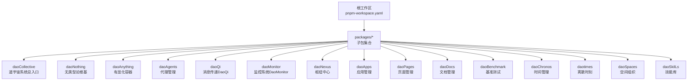
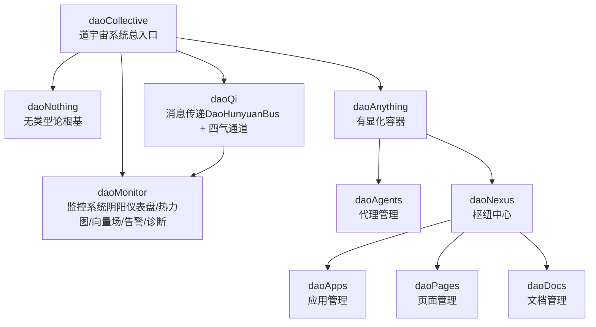
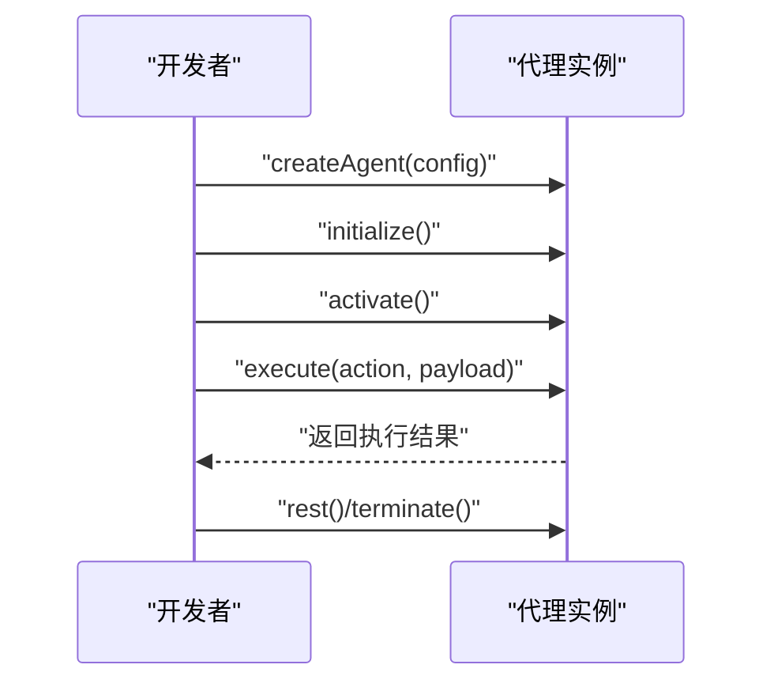
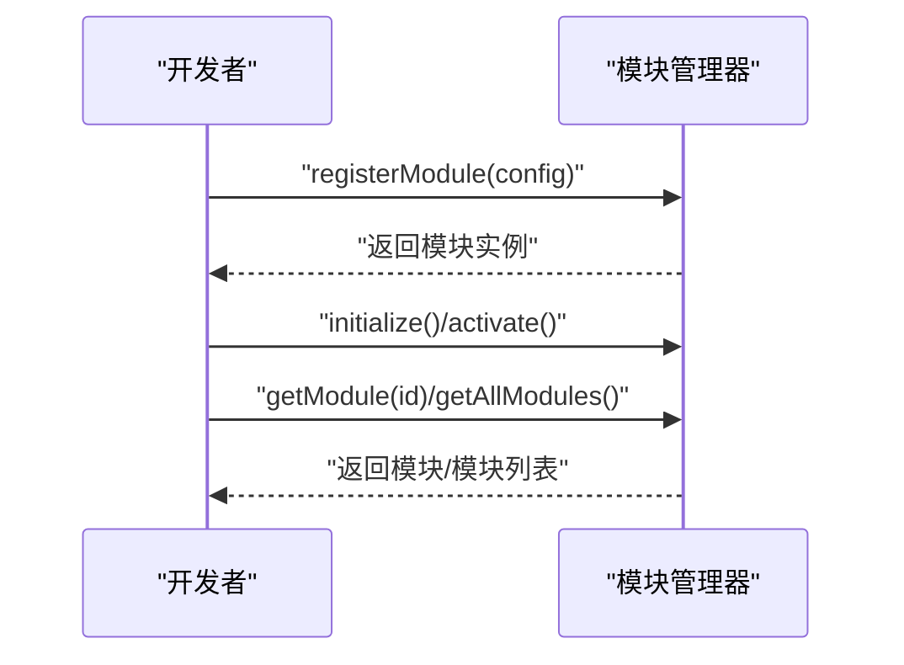
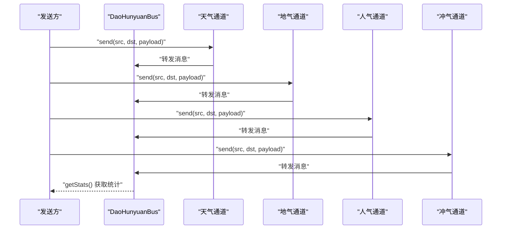
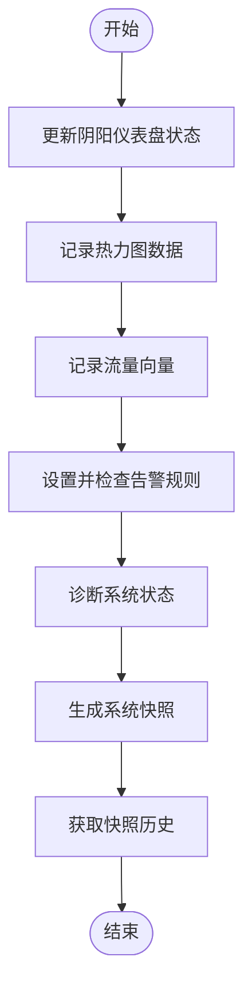
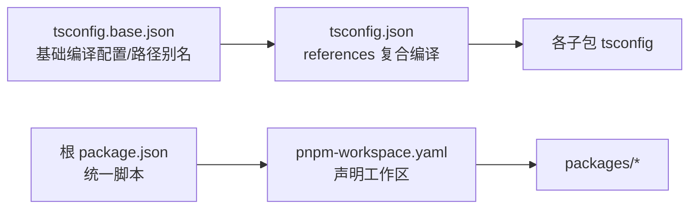

# DaoMind应用开发框架

<cite>
**本文引用的文件**
- [apps/DaoMind/README.md](file://apps/DaoMind/README.md)
- [apps/DaoMind/pnpm-workspace.yaml](file://apps/DaoMind/pnpm-workspace.yaml)
- [apps/DaoMind/tsconfig.base.json](file://apps/DaoMind/tsconfig.base.json)
- [apps/DaoMind/tsconfig.json](file://apps/DaoMind/tsconfig.json)
- [apps/DaoMind/package.json](file://apps/DaoMind/package.json)
- [apps/config-center/src/App.tsx](file://apps/config-center/src/App.tsx)
- [apps/config-center/src/main.tsx](file://apps/config-center/src/main.tsx)
</cite>

## 目录
1. [引言](#引言)
2. [项目结构](#项目结构)
3. [核心组件](#核心组件)
4. [架构总览](#架构总览)
5. [详细组件分析](#详细组件分析)
6. [依赖分析](#依赖分析)
7. [性能考虑](#性能考虑)
8. [故障排查指南](#故障排查指南)
9. [结论](#结论)
10. [附录](#附录)

## 引言
DaoMind 是一个以道家哲学为思想内核的现代化系统框架，采用 monorepo 架构组织，强调“自然无为”的去中心化协调与“反者道之动”的反馈闭环。框架通过“道宇宙”（daoCollective）作为总入口，结合“无”（daoNothing）“有”（daoAnything）“气”（Qi）等概念，构建出一套可演进、可扩展、可监控的系统架构。核心能力包括：
- 代理与模块管理：支持代理的创建、初始化、激活与管理；模块的注册、初始化、激活与管理。
- 消息传递系统（DaoQi）：基于四气通道（天、地、人、冲）的消息总线，提供统一的数据流与路由。
- 监控系统（DaoMonitor）：包含阴阳仪表盘、热力图、向量场、告警引擎与诊断引擎，形成“气道图”监控体系。
- 组件库（Modulux）：提供标准化、高质量的模块化组件，加速开发与保证一致性。

## 项目结构
DaoMind 采用 pnpm workspaces 的 monorepo 结构，核心包通过 tsconfig 的 references 进行编译时关联，形成强类型、可演化的多包协作生态。根目录的 package.json 提供统一的构建、测试、代码质量检查脚本；tsconfig.base.json 定义了全仓通用的编译选项与路径别名，便于跨包引用。

图表来源
- [apps/DaoMind/pnpm-workspace.yaml:1-3](file://apps/DaoMind/pnpm-workspace.yaml#L1-L3)
- [apps/DaoMind/tsconfig.json:1](file://apps/DaoMind/tsconfig.json#L1)

章节来源
- [apps/DaoMind/README.md:323-360](file://apps/DaoMind/README.md#L323-L360)
- [apps/DaoMind/pnpm-workspace.yaml:1-3](file://apps/DaoMind/pnpm-workspace.yaml#L1-L3)
- [apps/DaoMind/tsconfig.base.json:1](file://apps/DaoMind/tsconfig.base.json#L1)
- [apps/DaoMind/tsconfig.json:1](file://apps/DaoMind/tsconfig.json#L1)

## 核心组件
- 代理管理（daoAgents）：提供代理的生命周期管理与执行接口，支持初始化、激活、执行动作与终止。
- 模块管理（daoAnything）：提供模块注册、初始化、激活与检索能力，支撑系统功能的动态装配。
- 消息传递（daoQi）：以 DaoHunyuanBus 为核心，配合四气通道（天、地、人、冲），实现跨节点的统一消息总线与路由。
- 监控系统（daoMonitor）：包含阴阳仪表盘、热力图、向量场、告警引擎与诊断引擎，形成系统健康度的可视化与自动化诊断。
- 组件库（Modulux）：提供标准化 UI 组件，加速前端开发与界面一致性。
- 道宇宙（daoCollective）：系统总入口，协调全局资源与生命周期。
- 无（daoNothing）：类型论根基，零运行时开销，提供潜在性空间。
- 有（daoAnything）：显化容器，承载实例化空间与通用容器能力。
- 枢纽中心（daoNexus）：服务协调与应用层枢纽。
- 应用管理（daoApps）：应用层的注册与管理。
- 页面管理（daoPages）：页面层的组织与路由。
- 文档管理（daoDocs）：文档层的索引与发布。
- 基准测试（daoBenchmark）：性能基准与回归测试。
- 时间管理（daoChronos）与离散时刻（daotimes）：时间维度的抽象与调度。
- 空间组织（daoSpaces）：空间维度的组织与拓扑。
- 技能库（daoSkilLs）：技能的封装与复用。

章节来源
- [apps/DaoMind/README.md:7-26](file://apps/DaoMind/README.md#L7-L26)
- [apps/DaoMind/README.md:482-521](file://apps/DaoMind/README.md#L482-L521)

## 架构总览
DaoMind 的架构以“道宇宙”为顶层入口，向下分为“无”“有”两大空间，再由“气”（消息总线）贯穿系统，形成“感知—聚合—冲和—归元”的反馈闭环。监控系统（DaoMonitor）对系统进行实时观测与诊断，形成“气道图”监控体系，支撑系统的自适应与去中心化协调。

图表来源
- [apps/DaoMind/README.md:496-511](file://apps/DaoMind/README.md#L496-L511)
- [apps/DaoMind/README.md:513-521](file://apps/DaoMind/README.md#L513-L521)

## 详细组件分析

### 代理管理（daoAgents）
- 设计理念：以“自然无为”为指导，代理按需激活、按需执行，减少不必要的资源消耗。
- 生命周期：创建 → 初始化 → 激活 → 执行动作 → 休眠/终止。
- 接口要点：提供 createAgent、initialize、activate、execute、rest、terminate 等标准方法，支持异步执行与状态管理。
- 最佳实践：在执行动作前确保代理处于激活态；在长时间空闲时调用 rest 释放资源；在不再需要时调用 terminate 清理。

图表来源
- [apps/DaoMind/README.md:109-136](file://apps/DaoMind/README.md#L109-L136)

章节来源
- [apps/DaoMind/README.md:109-136](file://apps/DaoMind/README.md#L109-L136)

### 模块管理（daoAnything）
- 设计理念：模块化装配，按需加载，支持动态注册与检索。
- 生命周期：registerModule → initialize → activate → getModule/getAllModules。
- 接口要点：registerModule 提供模块注册与配置；getModule 支持按 ID 获取；getAllModules 返回全部模块列表。
- 最佳实践：在系统启动阶段完成关键模块的注册与初始化；避免在运行期频繁注册/注销模块。

图表来源
- [apps/DaoMind/README.md:138-163](file://apps/DaoMind/README.md#L138-L163)

章节来源
- [apps/DaoMind/README.md:138-163](file://apps/DaoMind/README.md#L138-L163)

### 消息传递系统（DaoQi）
- 设计理念：四气通道（天、地、人、冲）对应不同方向与语义的消息通道，统一由 DaoHunyuanBus 协调。
- 通道职责：天气通道（下行）、地气通道（上行）、人气通道（横向）、冲气通道（调和）。
- 接口要点：DaoHunyuanBus 提供 on/off/emit 等事件总线能力；四气通道提供 send 方法；支持统计查询与可观测性。
- 最佳实践：根据消息语义选择合适通道；在高并发场景下关注通道负载与背压处理；利用统计信息进行性能调优。

图表来源
- [apps/DaoMind/README.md:165-199](file://apps/DaoMind/README.md#L165-L199)

章节来源
- [apps/DaoMind/README.md:165-199](file://apps/DaoMind/README.md#L165-L199)

### 监控系统（DaoMonitor）
- 设计理念：以“阴阳平衡”为核心，通过仪表盘、热力图、向量场、告警与诊断形成闭环监控。
- 组件要点：阴阳仪表盘引擎、热力图引擎、向量场、告警引擎、诊断引擎、快照聚合器。
- 最佳实践：为关键指标设置合理的告警阈值；定期生成系统快照进行趋势分析；结合向量场定位系统热点与瓶颈。

图表来源
- [apps/DaoMind/README.md:201-293](file://apps/DaoMind/README.md#L201-L293)

章节来源
- [apps/DaoMind/README.md:201-293](file://apps/DaoMind/README.md#L201-L293)

### 道宇宙架构哲学映射
- 道（Dao）→ daoCollective：系统总入口，协调全局。
- 无（Wu）→ daoNothing：潜在性空间，类型论根基。
- 有（You）→ daoAnything：显化容器，实例化空间。
- 反者道之动：反馈回归四阶段生命周期（感知 → 聚合 → 冲和 → 归元）。
- 气（Qi）：消息总线/数据流，四通道系统（天/地/人/冲）。
- 阴阳平衡：冲气调节机制，五组阴阳对偶矩阵。
- 自然无为：自适应策略，去中心化协调。

章节来源
- [apps/DaoMind/README.md:482-521](file://apps/DaoMind/README.md#L482-L521)

## 依赖分析
- 工作区与包管理：pnpm-workspace.yaml 声明 packages/* 为工作区；根 package.json 提供统一脚本（构建、测试、代码质量）。
- 类型系统：tsconfig.base.json 定义严格类型检查、声明文件生成、路径映射；tsconfig.json 通过 references 将各子包纳入复合编译。
- 路径别名：通过 paths 将 @daomind/* 与 @modulux/qi 映射到具体包源码，便于跨包引用与开发体验。

图表来源
- [apps/DaoMind/pnpm-workspace.yaml:1-3](file://apps/DaoMind/pnpm-workspace.yaml#L1-L3)
- [apps/DaoMind/tsconfig.base.json:1](file://apps/DaoMind/tsconfig.base.json#L1)
- [apps/DaoMind/tsconfig.json:1](file://apps/DaoMind/tsconfig.json#L1)
- [apps/DaoMind/package.json:1](file://apps/DaoMind/package.json#L1)

章节来源
- [apps/DaoMind/pnpm-workspace.yaml:1-3](file://apps/DaoMind/pnpm-workspace.yaml#L1-L3)
- [apps/DaoMind/tsconfig.base.json:1](file://apps/DaoMind/tsconfig.base.json#L1)
- [apps/DaoMind/tsconfig.json:1](file://apps/DaoMind/tsconfig.json#L1)
- [apps/DaoMind/package.json:1](file://apps/DaoMind/package.json#L1)

## 性能考虑
- 启动时间：小于 2 秒；内存占用：小于 50MB；消息吞吐量：大于 10,000 msg/s；反馈回路延迟（P99）：小于 500ms；冲气收敛时间：小于 30 秒。
- 建议：在高并发场景下优先使用冲气通道进行调和与收敛；结合向量场与热力图定位热点；利用快照聚合器进行趋势分析与回归对比。

章节来源
- [apps/DaoMind/README.md:528-534](file://apps/DaoMind/README.md#L528-L534)

## 故障排查指南
- 安装依赖失败：确认 pnpm 版本满足要求，检查网络连接，必要时清理缓存。
- 构建失败：先运行类型检查，确保无 TS 错误；检查依赖安装与语法错误。
- 测试失败：检查测试代码与环境配置，查看详细错误信息。
- 子包导入失败：确保已构建项目；检查导入路径与 tsconfig 的路径映射。
- 性能问题：运行基准测试，定位瓶颈；参考监控工具进行分析。

章节来源
- [apps/DaoMind/README.md:398-444](file://apps/DaoMind/README.md#L398-L444)

## 结论
DaoMind 将道家哲学思想与现代软件工程相结合，通过“道宇宙—无—有—气—反者道之动—阴阳平衡—自然无为”的架构闭环，提供了可演进、可扩展、可监控的系统框架。依托 DaoQi 的消息总线与 DaoMonitor 的监控体系，开发者可以快速构建 DAO 应用，并在运行期持续优化系统健康度与性能表现。

## 附录

### 如何使用 DaoMind 构建 DAO 应用（实践指引）
- 组件开发规范
  - 使用 Modulux 组件库提供的标准化组件，确保界面一致性与可维护性。
  - 在组件中遵循最小职责原则，通过 props 与事件解耦。
- 状态管理模式
  - 对于简单状态，使用 React/Vue 的本地状态；对于跨组件共享的状态，采用集中式状态管理（如 Zustand/Redux）。
  - 在代理与模块之间建立清晰的边界，避免状态污染。
- 路由配置
  - 使用 React Router 进行页面级路由；在受保护页面使用鉴权守卫（如 ProtectedRoute）。
  - 在应用启动时预加载必要的模块与代理，确保首屏体验。
- 权限控制
  - 基于角色与资源的访问控制（RBAC），在路由层与页面层双重校验。
  - 对敏感操作增加二次确认与审计日志。
- 与 AgentPit 平台的集成
  - 通过代理管理模块（daoAgents）与 AgentPit 的交互接口对接，实现代理的创建、初始化与执行。
  - 利用消息传递系统（DaoQi）在应用与 AgentPit 之间建立稳定的数据流。
- 与配置中心的协作机制
  - 使用配置中心提供的 API 进行配置的拉取、订阅与变更通知。
  - 在应用启动时完成配置的初始化与校验，确保运行期一致性。
- 实际示例（示例路径）
  - 代理管理示例：[apps/DaoMind/README.md:109-136](file://apps/DaoMind/README.md#L109-L136)
  - 模块管理示例：[apps/DaoMind/README.md:138-163](file://apps/DaoMind/README.md#L138-L163)
  - 消息传递系统示例：[apps/DaoMind/README.md:165-199](file://apps/DaoMind/README.md#L165-L199)
  - 监控系统示例：[apps/DaoMind/README.md:201-293](file://apps/DaoMind/README.md#L201-L293)
  - 配置中心路由与页面示例：[apps/config-center/src/App.tsx:1-39](file://apps/config-center/src/App.tsx#L1-L39)
  - 配置中心入口渲染示例：[apps/config-center/src/main.tsx:1-11](file://apps/config-center/src/main.tsx#L1-L11)

章节来源
- [apps/DaoMind/README.md:109-136](file://apps/DaoMind/README.md#L109-L136)
- [apps/DaoMind/README.md:138-163](file://apps/DaoMind/README.md#L138-L163)
- [apps/DaoMind/README.md:165-199](file://apps/DaoMind/README.md#L165-L199)
- [apps/DaoMind/README.md:201-293](file://apps/DaoMind/README.md#L201-L293)
- [apps/config-center/src/App.tsx:1-39](file://apps/config-center/src/App.tsx#L1-L39)
- [apps/config-center/src/main.tsx:1-11](file://apps/config-center/src/main.tsx#L1-L11)