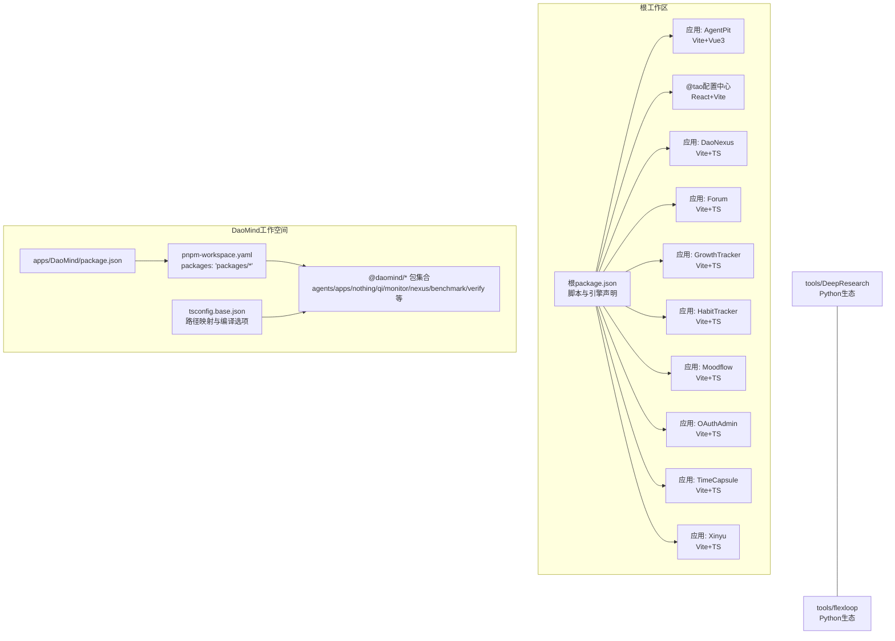
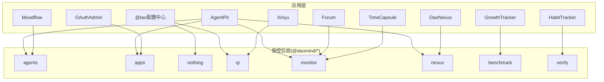
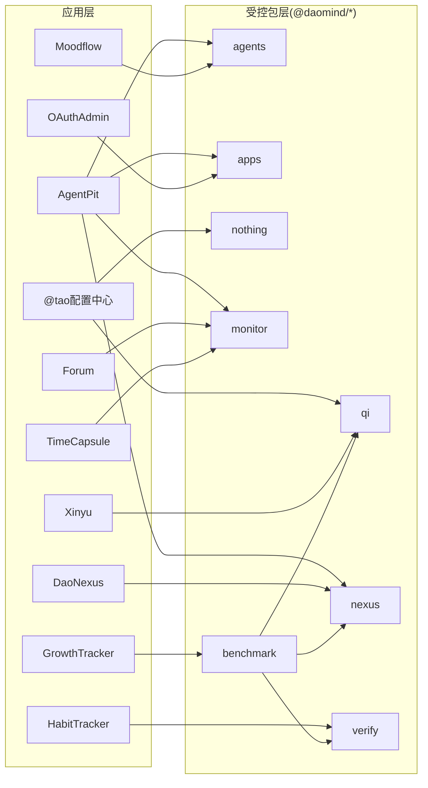

# 工作空间管理

<cite>
**本文引用的文件**
- [apps/DaoMind/package.json](file://apps/DaoMind/package.json)
- [apps/DaoMind/pnpm-workspace.yaml](file://apps/DaoMind/pnpm-workspace.yaml)
- [apps/DaoMind/tsconfig.base.json](file://apps/DaoMind/tsconfig.base.json)
- [apps/DaoMind/packages/daoAgents/package.json](file://apps/DaoMind/packages/daoAgents/package.json)
- [apps/DaoMind/packages/daoApps/package.json](file://apps/DaoMind/packages/daoApps/package.json)
- [apps/DaoMind/packages/daoNothing/package.json](file://apps/DaoMind/packages/daoNothing/package.json)
- [apps/DaoMind/packages/daoQi/package.json](file://apps/DaoMind/packages/daoQi/package.json)
- [apps/DaoMind/packages/daoMonitor/package.json](file://apps/DaoMind/packages/daoMonitor/package.json)
- [apps/DaoMind/packages/daoNexus/package.json](file://apps/DaoMind/packages/daoNexus/package.json)
- [apps/DaoMind/packages/daoBenchmark/package.json](file://apps/DaoMind/packages/daoBenchmark/package.json)
- [apps/DaoMind/packages/daoVerify/package.json](file://apps/DaoMind/packages/daoVerify/package.json)
- [apps/AgentPit/package.json](file://apps/AgentPit/package.json)
- [apps/config-center/package.json](file://apps/config-center/package.json)
</cite>

## 目录
1. [简介](#简介)
2. [项目结构](#项目结构)
3. [核心组件](#核心组件)
4. [架构总览](#架构总览)
5. [详细组件分析](#详细组件分析)
6. [依赖分析](#依赖分析)
7. [性能考虑](#性能考虑)
8. [故障排查指南](#故障排查指南)
9. [结论](#结论)
10. [附录](#附录)

## 简介
本文件面向DaoMind工作空间管理系统，系统性阐述基于pnpm monorepo的工作空间配置、包管理策略、依赖解析机制，并结合仓库中的实际包与配置，给出多包项目的开发流程、版本管理、发布策略、构建优化、组织结构、包间依赖、共享配置与开发工具链的最佳实践。同时提供CI/CD集成建议、Git版本控制集成方式以及新增包与配置共享的实操指引。

## 项目结构
该仓库采用“根级monorepo + 多应用”的混合结构：
- 根目录包含多个独立应用（如AgentPit、config-center、daoNexus、forum等），每个应用自成package.json与构建配置。
- 同时存在一个以“DaoMind”命名的应用，内部定义了完整的pnpm工作空间与TypeScript基础配置，包含packages目录下的多个受控包（如@daomind/agents、@daomind/apps等）。
- 另有tools目录下包含Python生态的工具链与测试套件，可作为CI/CD或质量保障的补充。

图表来源
- [apps/DaoMind/pnpm-workspace.yaml:1-3](file://apps/DaoMind/pnpm-workspace.yaml#L1-L3)
- [apps/DaoMind/tsconfig.base.json:1-1](file://apps/DaoMind/tsconfig.base.json#L1-L1)
- [apps/DaoMind/packages/daoAgents/package.json:1-1](file://apps/DaoMind/packages/daoAgents/package.json#L1-L1)
- [apps/DaoMind/packages/daoApps/package.json:1-1](file://apps/DaoMind/packages/daoApps/package.json#L1-L1)
- [apps/DaoMind/packages/daoMonitor/package.json:1-1](file://apps/DaoMind/packages/daoMonitor/package.json#L1-L1)
- [apps/DaoMind/packages/daoNexus/package.json:1-1](file://apps/DaoMind/packages/daoNexus/package.json#L1-L1)
- [apps/DaoMind/packages/daoBenchmark/package.json:1-1](file://apps/DaoMind/packages/daoBenchmark/package.json#L1-L1)
- [apps/DaoMind/packages/daoVerify/package.json:1-1](file://apps/DaoMind/packages/daoVerify/package.json#L1-L1)

章节来源
- [apps/DaoMind/pnpm-workspace.yaml:1-3](file://apps/DaoMind/pnpm-workspace.yaml#L1-L3)
- [apps/DaoMind/tsconfig.base.json:1-1](file://apps/DaoMind/tsconfig.base.json#L1-L1)
- [apps/DaoMind/package.json:1-1](file://apps/DaoMind/package.json#L1-L1)

## 核心组件
- pnpm工作空间配置：通过packages模式声明受控包范围，统一依赖提升与链接策略，减少磁盘占用并加速安装。
- TypeScript基础配置：集中定义编译目标、模块解析策略、严格模式、路径映射（paths）与全局类型，确保跨包一致的编译行为。
- 受控包集合：以@daomind前缀命名的一组核心包，覆盖Agent、应用层、Nothing（潜在性空间）、Qi（消息总线）、Monitor（监控）、Nexus（枢纽）、Benchmark（基准）、Verify（验证）等模块域。
- 应用层：AgentPit、config-center、daoNexus等应用各自维护独立的package.json与构建配置，遵循统一的脚本与工具链约定。

章节来源
- [apps/DaoMind/pnpm-workspace.yaml:1-3](file://apps/DaoMind/pnpm-workspace.yaml#L1-L3)
- [apps/DaoMind/tsconfig.base.json:1-1](file://apps/DaoMind/tsconfig.base.json#L1-L1)
- [apps/DaoMind/packages/daoAgents/package.json:1-1](file://apps/DaoMind/packages/daoAgents/package.json#L1-L1)
- [apps/DaoMind/packages/daoApps/package.json:1-1](file://apps/DaoMind/packages/daoApps/package.json#L1-L1)
- [apps/DaoMind/packages/daoMonitor/package.json:1-1](file://apps/DaoMind/packages/daoMonitor/package.json#L1-L1)
- [apps/DaoMind/packages/daoNexus/package.json:1-1](file://apps/DaoMind/packages/daoNexus/package.json#L1-L1)
- [apps/DaoMind/packages/daoBenchmark/package.json:1-1](file://apps/DaoMind/packages/daoBenchmark/package.json#L1-L1)
- [apps/DaoMind/packages/daoVerify/package.json:1-1](file://apps/DaoMind/packages/daoVerify/package.json#L1-L1)
- [apps/AgentPit/package.json:1-74](file://apps/AgentPit/package.json#L1-L74)
- [apps/config-center/package.json:1-41](file://apps/config-center/package.json#L1-L41)

## 架构总览
工作空间采用“应用层 + 受控包层”的分层架构：
- 应用层负责业务页面与交互，使用Vite/React/Vue等技术栈，统一脚本与工具链。
- 受控包层提供可复用的领域能力与基础设施，通过workspace:*进行本地共享，避免重复打包与版本漂移。
- 路径映射与模块解析策略保证跨包导入的一致性与可预测性。

图表来源
- [apps/DaoMind/tsconfig.base.json:1-1](file://apps/DaoMind/tsconfig.base.json#L1-L1)
- [apps/DaoMind/packages/daoAgents/package.json:1-1](file://apps/DaoMind/packages/daoAgents/package.json#L1-L1)
- [apps/DaoMind/packages/daoApps/package.json:1-1](file://apps/DaoMind/packages/daoApps/package.json#L1-L1)
- [apps/DaoMind/packages/daoMonitor/package.json:1-1](file://apps/DaoMind/packages/daoMonitor/package.json#L1-L1)
- [apps/DaoMind/packages/daoNexus/package.json:1-1](file://apps/DaoMind/packages/daoNexus/package.json#L1-L1)
- [apps/DaoMind/packages/daoBenchmark/package.json:1-1](file://apps/DaoMind/packages/daoBenchmark/package.json#L1-L1)
- [apps/DaoMind/packages/daoVerify/package.json:1-1](file://apps/DaoMind/packages/daoVerify/package.json#L1-L1)

## 详细组件分析

### pnpm工作空间与包管理策略
- 工作空间声明：通过packages字段限定受控包范围，便于统一安装、构建与测试。
- 依赖解析：workspace:*语义将依赖指向本地包，避免远程下载；pnpm会自动建立符号链接，减少重复依赖。
- 版本策略：受控包采用统一版本号（当前均为1.0.0），便于发布与回滚；应用层版本由各应用自行管理。
- 脚本协同：根级脚本可批量执行构建、测试、lint等任务，提高多包开发效率。

章节来源
- [apps/DaoMind/pnpm-workspace.yaml:1-3](file://apps/DaoMind/pnpm-workspace.yaml#L1-L3)
- [apps/DaoMind/packages/daoBenchmark/package.json:1-1](file://apps/DaoMind/packages/daoBenchmark/package.json#L1-L1)

### TypeScript共享配置与路径映射
- 编译目标与模块解析：ES2022/ESNext与bundler解析器，确保现代浏览器与打包器兼容。
- 严格模式：启用严格检查与索引访问保护，降低运行时风险。
- 路径映射：通过paths将@daomind/*映射到对应包的src目录，简化导入路径，提升可读性与可维护性。
- 全局类型：内置node与jest类型，支持测试与Node环境开发。

章节来源
- [apps/DaoMind/tsconfig.base.json:1-1](file://apps/DaoMind/tsconfig.base.json#L1-L1)

### 受控包集合与职责边界
- @daomind/agents：自主行动实体相关能力。
- @daomind/apps：应用层业务实现。
- @daomind/nothing：潜在性空间抽象。
- @modulux/qi：模块间数据流与消息总线传输层（注意命名空间混用）。
- @daomind/monitor：系统监控与可视化引擎。
- @daomind/nexus：连接与协调核心。
- @daomind/benchmark：性能基准测试与优化工具。
- @daomind/verify：哲学一致性检验自动化工具。

章节来源
- [apps/DaoMind/packages/daoAgents/package.json:1-1](file://apps/DaoMind/packages/daoAgents/package.json#L1-L1)
- [apps/DaoMind/packages/daoApps/package.json:1-1](file://apps/DaoMind/packages/daoApps/package.json#L1-L1)
- [apps/DaoMind/packages/daoNothing/package.json:1-1](file://apps/DaoMind/packages/daoNothing/package.json#L1-L1)
- [apps/DaoMind/packages/daoQi/package.json:1-1](file://apps/DaoMind/packages/daoQi/package.json#L1-L1)
- [apps/DaoMind/packages/daoMonitor/package.json:1-1](file://apps/DaoMind/packages/daoMonitor/package.json#L1-L1)
- [apps/DaoMind/packages/daoNexus/package.json:1-1](file://apps/DaoMind/packages/daoNexus/package.json#L1-L1)
- [apps/DaoMind/packages/daoBenchmark/package.json:1-1](file://apps/DaoMind/packages/daoBenchmark/package.json#L1-L1)
- [apps/DaoMind/packages/daoVerify/package.json:1-1](file://apps/DaoMind/packages/daoVerify/package.json#L1-L1)

### 应用层组件与工具链
- AgentPit：Vue3 + Vite + TypeScript，包含lint、format、test、build等脚本，配合husky与lint-staged实现提交前校验。
- @tao配置中心：React + Vite + TypeScript，依赖workspace:*共享包，便于前后端一体化治理。
- 其他应用（daoNexus、forum、growth-tracker等）均采用Vite+TS的统一脚本与配置风格，便于标准化与复用。

章节来源
- [apps/AgentPit/package.json:1-74](file://apps/AgentPit/package.json#L1-L74)
- [apps/config-center/package.json:1-41](file://apps/config-center/package.json#L1-L41)

## 依赖分析
工作空间内的依赖关系呈现“应用层消费受控包”的单向依赖，部分受控包之间存在内聚依赖（如benchmark依赖nexus、feedback、qi）。

图表来源
- [apps/DaoMind/packages/daoBenchmark/package.json:1-1](file://apps/DaoMind/packages/daoBenchmark/package.json#L1-L1)
- [apps/DaoMind/packages/daoMonitor/package.json:1-1](file://apps/DaoMind/packages/daoMonitor/package.json#L1-L1)
- [apps/DaoMind/packages/daoNexus/package.json:1-1](file://apps/DaoMind/packages/daoNexus/package.json#L1-L1)
- [apps/DaoMind/packages/daoQi/package.json:1-1](file://apps/DaoMind/packages/daoQi/package.json#L1-L1)
- [apps/DaoMind/packages/daoVerify/package.json:1-1](file://apps/DaoMind/packages/daoVerify/package.json#L1-L1)

章节来源
- [apps/DaoMind/packages/daoBenchmark/package.json:1-1](file://apps/DaoMind/packages/daoBenchmark/package.json#L1-L1)

## 性能考虑
- 依赖去重与链接：pnpm的workspace:*解析与符号链接显著减少磁盘占用与安装时间，建议保持统一的依赖版本策略。
- 构建缓存：Vite的快速冷启动与按需编译适合多应用并行开发；建议在CI中开启构建缓存。
- 类型检查：TypeScript基础配置启用严格模式，可在早期发现潜在问题；对大型包可拆分模块与接口，降低增量编译成本。
- 测试隔离：各应用独立的测试配置与脚本，建议在CI中并行执行，缩短反馈周期。

## 故障排查指南
- 依赖解析失败：确认workspace:*是否正确指向本地包，且受控包已纳入pnpm-workspace.yaml的packages范围。
- 路径映射不生效：检查tsconfig.base.json中的paths映射与包名是否一致，确保模块解析策略为bundler。
- 构建冲突：当多个应用共享同一受控包时，确保包的导出入口与类型声明一致，避免重复打包。
- 版本漂移：受控包采用统一版本号，若出现版本不一致，优先升级至最新版本并同步更新应用层依赖。

## 结论
该工作空间通过pnpm monorepo实现了多应用与多包的统一治理，借助workspace:*与共享tsconfig，既保证了开发体验的一致性，又提升了构建与发布效率。建议在后续实践中进一步完善CI/CD流水线、版本发布策略与团队协作规范，持续优化包间依赖与工具链配置。

## 附录

### 开发流程与最佳实践
- 新增受控包
  - 在apps/DaoMind/packages目录下创建新包目录与package.json，设置name、version、main、types与exports。
  - 将新包路径加入apps/DaoMind/pnpm-workspace.yaml的packages数组。
  - 在apps/DaoMind/tsconfig.base.json中为新包添加paths映射，确保IDE与编译器识别。
  - 在需要消费该包的应用或包中使用workspace:*进行依赖声明。
- 配置共享
  - 将通用的TypeScript配置、ESLint规则、Prettier配置放入共享文件，供所有包复用。
  - 对于Vite应用，统一使用相同的插件组合与别名配置，减少差异化。
- 包间通信
  - 使用@daomind/*命名空间划分功能域，明确职责边界；通过paths映射与模块解析策略保证导入稳定。
  - 对跨包公共逻辑抽取为独立包，避免循环依赖与紧耦合。
- 版本管理与发布
  - 受控包采用统一版本号，发布前进行全量类型检查与单元测试；应用层版本由各应用独立管理。
  - 在CI中执行lint、test、build三步验证，通过后再进行发布。
- CI/CD集成
  - 使用并行任务加速多包构建与测试；缓存node_modules与pnpm-store以提升速度。
  - 在PR中强制执行lint与格式化检查，结合覆盖率阈值与性能回归检测。
- Git版本控制集成
  - 使用分支策略区分功能开发、集成与发布；通过标签标记受控包版本，配合CHANGELOG记录变更。
  - 在合并前执行全量构建与测试，确保工作空间整体健康。