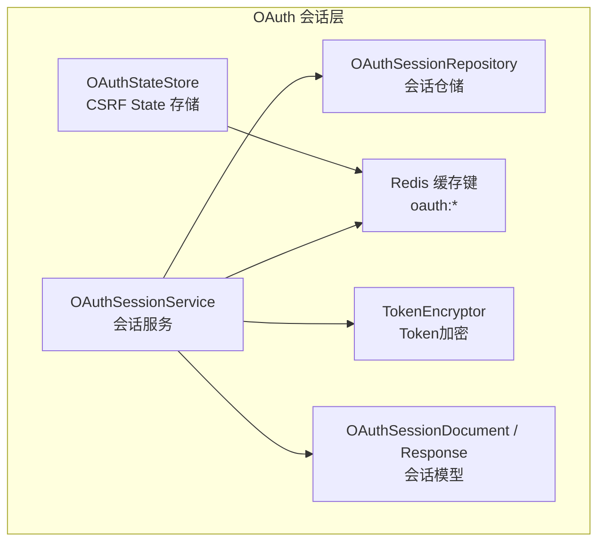
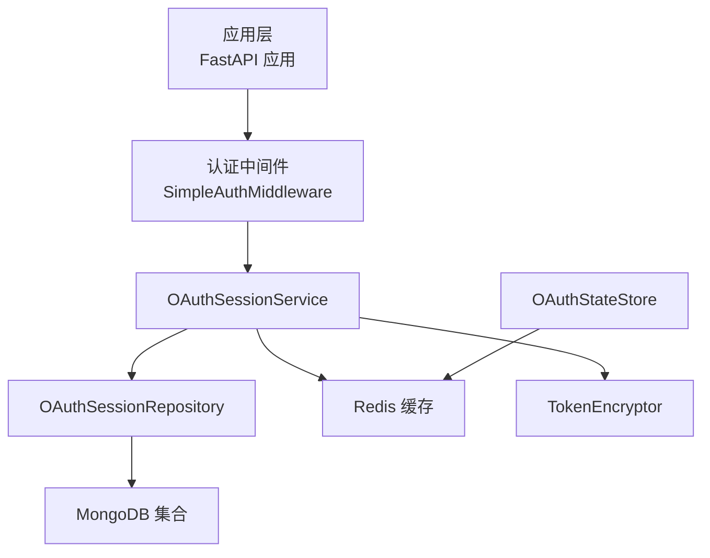
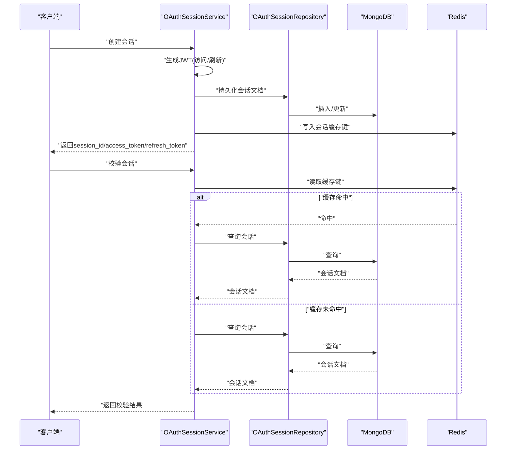
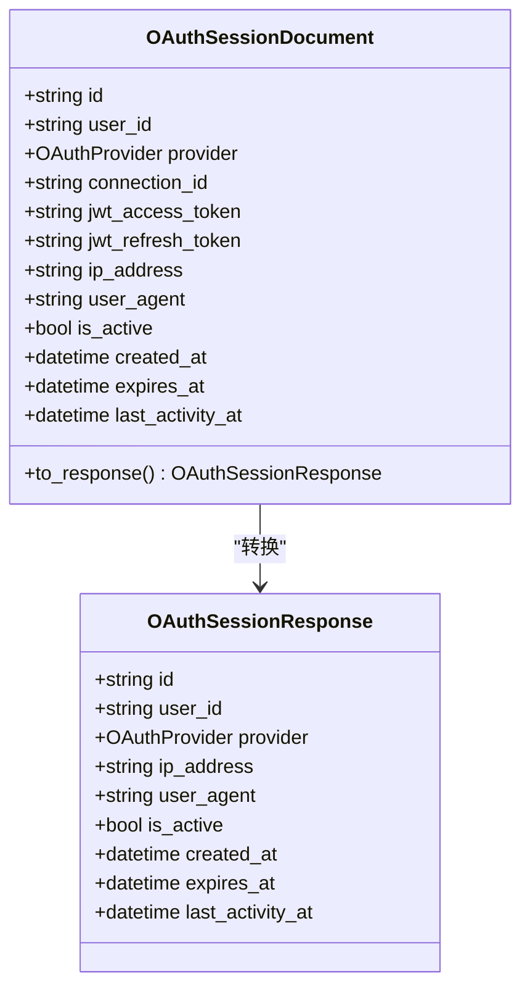
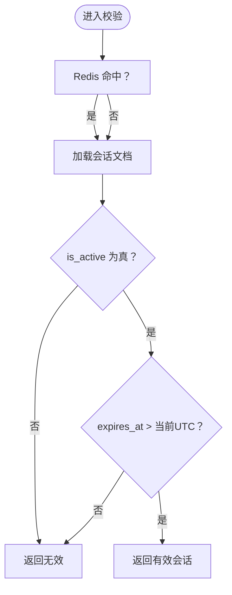
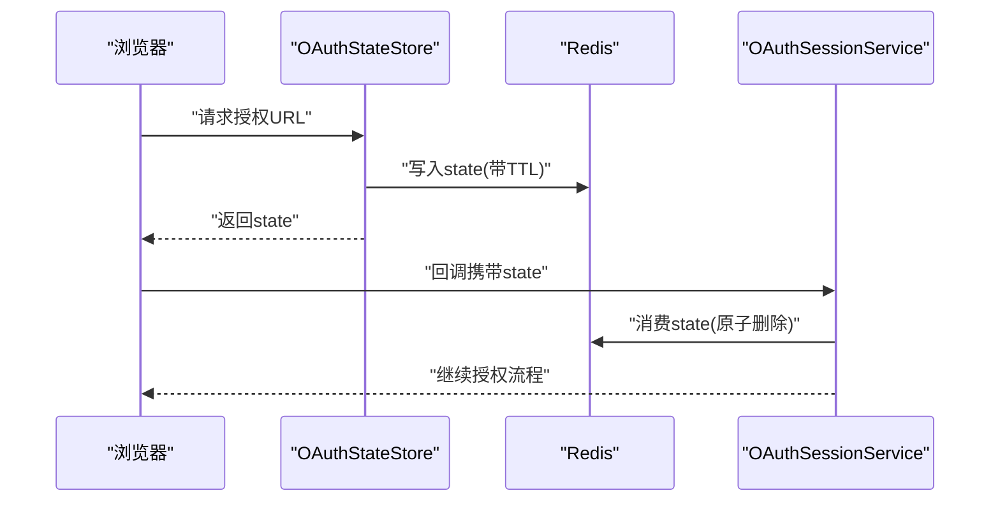
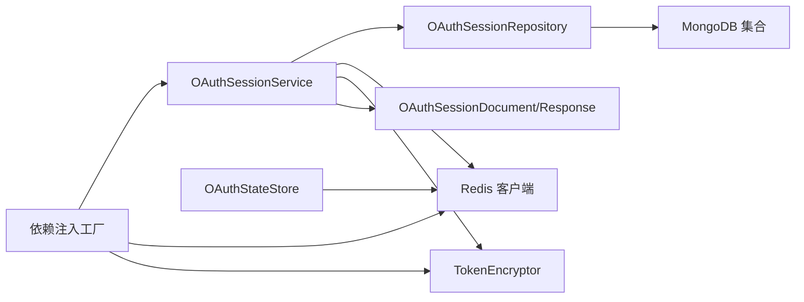

# 会话管理

<cite>
**本文引用的文件**
- [session_service.py](file://tools/flexloop/src/taolib/testing/oauth/services/session_service.py)
- [session.py](file://tools/flexloop/src/taolib/testing/oauth/models/session.py)
- [session_repo.py](file://tools/flexloop/src/taolib/testing/oauth/repository/session_repo.py)
- [keys.py](file://tools/flexloop/src/taolib/testing/oauth/cache/keys.py)
- [token_encryption.py](file://tools/flexloop/src/taolib/testing/oauth/crypto/token_encryption.py)
- [state_store.py](file://tools/flexloop/src/taolib/testing/oauth/cache/state_store.py)
- [dependencies.py](file://tools/flexloop/src/taolib/testing/oauth/server/dependencies.py)
- [test_services.py](file://tools/flexloop/tests/testing/test_oauth/test_services/test_services.py)
- [test_repos.py](file://tools/flexloop/tests/testing/test_oauth/test_repository/test_repos.py)
- [test_models.py](file://tools/flexloop/tests/testing/test_oauth/test_models.py)
- [test_tokens.py](file://tools/flexloop/tests/testing/test_auth/test_tokens.py)
- [middleware.py](file://tools/flexloop/src/taolib/testing/auth/fastapi/middleware.py)
- [examples-v2.md](file://skills/daoSkilLs/skills/task-execution-summary/references/examples-v2.md)
</cite>

## 目录
1. [简介](#简介)
2. [项目结构](#项目结构)
3. [核心组件](#核心组件)
4. [架构总览](#架构总览)
5. [组件详解](#组件详解)
6. [依赖关系分析](#依赖关系分析)
7. [性能考量](#性能考量)
8. [故障排查指南](#故障排查指南)
9. [结论](#结论)
10. [附录](#附录)

## 简介
本文件面向DaoMind会话管理系统，系统性阐述会话生命周期管理、会话存储策略、会话过期处理机制，以及会话创建、维护、销毁流程；同时覆盖会话状态同步、跨请求状态保持、安全机制（CSRF防护、会话劫持与固定攻击防范）、配置选项、性能优化与清理机制，并提供可直接定位到源码的示例路径，帮助开发者快速集成与落地。

## 项目结构
围绕OAuth会话管理的关键代码位于flexloop工具包的testing子模块中，采用“服务-仓储-模型-缓存-加密-依赖注入”的分层设计，结合Redis与MongoDB实现高性能、可扩展的会话管理能力。

图表来源
- [session_service.py:15-238](file://tools/flexloop/src/taolib/testing/oauth/services/session_service.py#L15-L238)
- [session_repo.py:13-92](file://tools/flexloop/src/taolib/testing/oauth/repository/session_repo.py#L13-L92)
- [session.py:14-67](file://tools/flexloop/src/taolib/testing/oauth/models/session.py#L14-L67)
- [keys.py:7-43](file://tools/flexloop/src/taolib/testing/oauth/cache/keys.py#L7-L43)
- [token_encryption.py:20-86](file://tools/flexloop/src/taolib/testing/oauth/crypto/token_encryption.py#L20-L86)
- [state_store.py:13-47](file://tools/flexloop/src/taolib/testing/oauth/cache/state_store.py#L13-L47)

章节来源
- [session_service.py:15-238](file://tools/flexloop/src/taolib/testing/oauth/services/session_service.py#L15-L238)
- [session_repo.py:13-92](file://tools/flexloop/src/taolib/testing/oauth/repository/session_repo.py#L13-L92)
- [session.py:14-67](file://tools/flexloop/src/taolib/testing/oauth/models/session.py#L14-L67)
- [keys.py:7-43](file://tools/flexloop/src/taolib/testing/oauth/cache/keys.py#L7-L43)
- [token_encryption.py:20-86](file://tools/flexloop/src/taolib/testing/oauth/crypto/token_encryption.py#L20-L86)
- [state_store.py:13-47](file://tools/flexloop/src/taolib/testing/oauth/cache/state_store.py#L13-L47)

## 核心组件
- 会话服务（OAuthSessionService）：负责会话创建、校验、刷新、撤销、列举活跃会话等核心业务逻辑，集成JWT签发与Redis缓存。
- 会话仓储（OAuthSessionRepository）：封装MongoDB访问，提供会话查询、停用、批量停用、touch活跃时间、索引创建等。
- 会话模型（OAuthSessionDocument / OAuthSessionResponse）：定义会话文档与对外响应模型，确保敏感字段不泄露。
- 缓存键（oauth:*）：统一命名空间管理CSRF state与会话缓存，便于清理与监控。
- Token加密（TokenEncryptor）：基于Fernet对第三方Token进行对称加密存储，支持密钥轮换。
- CSRF State存储（OAuthStateStore）：基于Redis的一次性state参数管理，防止CSRF攻击。
- 依赖注入（dependencies.py）：集中提供Redis、会话仓储、加密器等依赖，便于FastAPI应用装配。

章节来源
- [session_service.py:15-238](file://tools/flexloop/src/taolib/testing/oauth/services/session_service.py#L15-L238)
- [session_repo.py:13-92](file://tools/flexloop/src/taolib/testing/oauth/repository/session_repo.py#L13-L92)
- [session.py:14-67](file://tools/flexloop/src/taolib/testing/oauth/models/session.py#L14-L67)
- [keys.py:7-43](file://tools/flexloop/src/taolib/testing/oauth/cache/keys.py#L7-L43)
- [token_encryption.py:20-86](file://tools/flexloop/src/taolib/testing/oauth/crypto/token_encryption.py#L20-L86)
- [state_store.py:13-47](file://tools/flexloop/src/taolib/testing/oauth/cache/state_store.py#L13-L47)
- [dependencies.py:87-125](file://tools/flexloop/src/taolib/testing/oauth/server/dependencies.py#L87-L125)

## 架构总览
下图展示了会话管理在系统中的交互关系：服务层协调仓储、缓存与加密模块，完成会话全生命周期管理；同时通过依赖注入在应用侧装配。

图表来源
- [session_service.py:29-44](file://tools/flexloop/src/taolib/testing/oauth/services/session_service.py#L29-L44)
- [session_repo.py:16-22](file://tools/flexloop/src/taolib/testing/oauth/repository/session_repo.py#L16-L22)
- [dependencies.py:115-125](file://tools/flexloop/src/taolib/testing/oauth/server/dependencies.py#L115-L125)
- [middleware.py:71-80](file://tools/flexloop/src/taolib/testing/auth/fastapi/middleware.py#L71-L80)

## 组件详解

### 会话生命周期管理
- 创建会话：服务生成UUID会话ID，签发Access/Refresh JWT，构造会话文档并持久化，同时写入Redis缓存键，设置TTL。
- 校验会话：优先从Redis命中校验，再回退到MongoDB查询，综合is_active与expires_at判断有效性。
- 刷新会话：在有效期内签发新的Access Token，并更新last_activity_at。
- 撤销会话：停用指定会话并删除Redis缓存键；支持按用户批量撤销。
- 列举活跃会话：查询用户所有未过期且活跃的会话，返回不含敏感字段的响应模型。

图表来源
- [session_service.py:72-164](file://tools/flexloop/src/taolib/testing/oauth/services/session_service.py#L72-L164)
- [session_repo.py:24-42](file://tools/flexloop/src/taolib/testing/oauth/repository/session_repo.py#L24-L42)

章节来源
- [session_service.py:72-235](file://tools/flexloop/src/taolib/testing/oauth/services/session_service.py#L72-L235)
- [session_repo.py:24-92](file://tools/flexloop/src/taolib/testing/oauth/repository/session_repo.py#L24-L92)
- [test_services.py:188-248](file://tools/flexloop/tests/testing/test_oauth/test_services/test_services.py#L188-L248)

### 会话存储策略
- MongoDB持久化：会话文档包含用户ID、提供商、连接ID、JWT、IP/User-Agent、活跃状态、创建/过期/最后活跃时间等字段。
- Redis缓存：使用统一命名空间oauth:*，缓存会话ID到用户ID映射，用于快速校验与降低数据库压力。
- Token加密：第三方Token采用Fernet对称加密存储，支持密钥轮换，避免明文泄露风险。

图表来源
- [session.py:30-67](file://tools/flexloop/src/taolib/testing/oauth/models/session.py#L30-L67)

章节来源
- [session.py:14-67](file://tools/flexloop/src/taolib/testing/oauth/models/session.py#L14-L67)
- [session_repo.py:13-92](file://tools/flexloop/src/taolib/testing/oauth/repository/session_repo.py#L13-L92)
- [token_encryption.py:20-86](file://tools/flexloop/src/taolib/testing/oauth/crypto/token_encryption.py#L20-L86)

### 会话过期处理机制
- 会话过期：校验时比较expires_at与当前UTC时间，过期则视为无效。
- MongoDB TTL索引：通过expireAfterSeconds=0的expires_at索引实现自动过期清理。
- Redis TTL：创建会话时设置与会话TTL一致的过期时间，保证缓存与持久化一致性。

图表来源
- [session_service.py:140-164](file://tools/flexloop/src/taolib/testing/oauth/services/session_service.py#L140-L164)
- [session_repo.py:34-36](file://tools/flexloop/src/taolib/testing/oauth/repository/session_repo.py#L34-L36)

章节来源
- [session_service.py:140-164](file://tools/flexloop/src/taolib/testing/oauth/services/session_service.py#L140-L164)
- [session_repo.py:85-89](file://tools/flexloop/src/taolib/testing/oauth/repository/session_repo.py#L85-L89)

### 会话状态同步与跨请求保持
- 状态同步：每次刷新会话时调用touch_session更新last_activity_at，确保活跃度统计与续期生效。
- 跨请求保持：通过Redis缓存键快速识别会话归属用户，避免重复查询数据库；同时JWT承载用户身份与角色，便于中间件解析。

章节来源
- [session_service.py:166-193](file://tools/flexloop/src/taolib/testing/oauth/services/session_service.py#L166-L193)
- [session_repo.py:74-83](file://tools/flexloop/src/taolib/testing/oauth/repository/session_repo.py#L74-L83)

### 安全机制
- CSRF防护：OAuthStateStore在Redis中一次性state参数，配合SameSite策略与服务端校验，抵御CSRF攻击。
- 会话劫持与固定攻击防护：通过Redis缓存键绑定会话ID与用户ID，校验时双重确认；JWT签名与算法配置由服务端统一管理。
- 会话固定攻击防护：服务端生成全新会话ID与JWT，不复用旧会话令牌。
- 敏感信息保护：响应模型不包含JWT字段；第三方Token采用对称加密存储。

图表来源
- [state_store.py:33-47](file://tools/flexloop/src/taolib/testing/oauth/cache/state_store.py#L33-L47)
- [keys.py:7-28](file://tools/flexloop/src/taolib/testing/oauth/cache/keys.py#L7-L28)

章节来源
- [state_store.py:13-47](file://tools/flexloop/src/taolib/testing/oauth/cache/state_store.py#L13-L47)
- [keys.py:7-28](file://tools/flexloop/src/taolib/testing/oauth/cache/keys.py#L7-L28)
- [session_service.py:195-223](file://tools/flexloop/src/taolib/testing/oauth/services/session_service.py#L195-L223)
- [test_tokens.py:172-206](file://tools/flexloop/tests/testing/test_auth/test_tokens.py#L172-L206)

### 配置选项与最佳实践
- 会话TTL：创建会话时可指定session_ttl_hours，默认24小时。
- JWT配置：Access Token过期分钟数与Refresh Token过期天数可配置；算法与密钥需与鉴权服务一致。
- 缓存策略：Redis键命名规范与TTL设置需与会话TTL保持一致。
- 安全建议：生产环境启用HTTPS、SameSite=Lax|Strict、HttpOnly；定期轮换JWT密钥与Token加密密钥。

章节来源
- [session_service.py:29-44](file://tools/flexloop/src/taolib/testing/oauth/services/session_service.py#L29-L44)
- [session_service.py:72-138](file://tools/flexloop/src/taolib/testing/oauth/services/session_service.py#L72-L138)
- [examples-v2.md:96-144](file://skills/daoSkilLs/skills/task-execution-summary/references/examples-v2.md#L96-L144)

### 性能优化策略
- 读路径优化：Redis缓存优先，减少MongoDB查询次数；批量查询活跃会话时限制返回条数。
- 写路径优化：会话创建与撤销均更新Redis与MongoDB，确保一致性；批量撤销时先清理缓存再批量更新。
- 索引优化：为user_id、expires_at、(is_active,user_id)建立复合索引，加速查询与自动过期。
- 缓存清理：利用MongoDB TTL索引自动清理过期文档；Redis侧通过TTL与显式删除保障一致性。

章节来源
- [session_repo.py:85-89](file://tools/flexloop/src/taolib/testing/oauth/repository/session_repo.py#L85-L89)
- [session_service.py:129-130](file://tools/flexloop/src/taolib/testing/oauth/services/session_service.py#L129-L130)
- [session_service.py:209-223](file://tools/flexloop/src/taolib/testing/oauth/services/session_service.py#L209-L223)

### 会话清理机制
- 自动清理：MongoDB通过expires_at索引实现TTL自动删除。
- 手动清理：撤销会话时删除Redis缓存键；批量撤销用户会话时遍历删除对应缓存键。

章节来源
- [session_repo.py:85-89](file://tools/flexloop/src/taolib/testing/oauth/repository/session_repo.py#L85-L89)
- [session_service.py:195-223](file://tools/flexloop/src/taolib/testing/oauth/services/session_service.py#L195-L223)

### 中间件集成与会话状态维护
- 中间件：SimpleAuthMiddleware从Authorization头提取Bearer Token，交由JWTService与黑名单校验，将用户信息注入request.state。
- 会话状态：服务层通过Redis键快速识别会话归属用户，结合JWT负载实现跨请求状态保持。

章节来源
- [middleware.py:71-80](file://tools/flexloop/src/taolib/testing/auth/fastapi/middleware.py#L71-L80)
- [session_service.py:140-164](file://tools/flexloop/src/taolib/testing/oauth/services/session_service.py#L140-L164)

## 依赖关系分析

图表来源
- [session_service.py:29-44](file://tools/flexloop/src/taolib/testing/oauth/services/session_service.py#L29-L44)
- [session_repo.py:16-22](file://tools/flexloop/src/taolib/testing/oauth/repository/session_repo.py#L16-L22)
- [dependencies.py:115-125](file://tools/flexloop/src/taolib/testing/oauth/server/dependencies.py#L115-L125)

章节来源
- [dependencies.py:87-125](file://tools/flexloop/src/taolib/testing/oauth/server/dependencies.py#L87-L125)

## 性能考量
- 读放大控制：通过Redis缓存键实现O(1)会话校验，避免频繁查询MongoDB。
- 写路径幂等：会话创建与撤销均具备幂等语义，避免重复写入导致的性能损耗。
- 索引与TTL：合理索引与TTL配置降低查询成本与存储占用。
- 批量操作：批量撤销用户会话时先清理缓存键，再批量更新数据库，减少锁竞争。

## 故障排查指南
- 会话无效或过期：检查expires_at与当前UTC时间；确认Redis缓存键是否存在且未过期。
- 无法撤销会话：确认MongoDB is_active字段更新成功，Redis缓存键已被删除。
- CSRF校验失败：确认state参数在Redis中存在且仅一次有效；检查回调URL与state匹配。
- JWT校验异常：确认JWT密钥与算法配置一致；检查令牌是否过期或被加入黑名单。
- Token解密失败：确认加密密钥正确且未轮换；若已轮换，使用rotate_key进行迁移。

章节来源
- [session_service.py:140-223](file://tools/flexloop/src/taolib/testing/oauth/services/session_service.py#L140-L223)
- [state_store.py:33-47](file://tools/flexloop/src/taolib/testing/oauth/cache/state_store.py#L33-L47)
- [token_encryption.py:60-83](file://tools/flexloop/src/taolib/testing/oauth/crypto/token_encryption.py#L60-L83)
- [test_tokens.py:172-206](file://tools/flexloop/tests/testing/test_auth/test_tokens.py#L172-L206)

## 结论
DaoMind会话管理系统通过“服务-仓储-模型-缓存-加密-依赖注入”的分层设计，实现了高可用、可扩展、安全可控的会话管理能力。借助Redis与MongoDB的协同、JWT与对称加密的安全策略、完善的CSRF防护与会话生命周期管理，系统能够在保证安全性的同时满足高性能与可运维性要求。建议在生产环境中严格遵循Cookie安全三要素、定期轮换密钥、监控缓存命中率与数据库索引效率，并结合中间件统一接入鉴权流程。

## 附录
- 示例路径参考
  - 会话创建与校验：[session_service.py:72-164](file://tools/flexloop/src/taolib/testing/oauth/services/session_service.py#L72-L164)
  - 会话仓储与索引：[session_repo.py:24-92](file://tools/flexloop/src/taolib/testing/oauth/repository/session_repo.py#L24-L92)
  - 会话模型与响应：[session.py:14-67](file://tools/flexloop/src/taolib/testing/oauth/models/session.py#L14-L67)
  - 缓存键命名与CSRF：[keys.py:7-43](file://tools/flexloop/src/taolib/testing/oauth/cache/keys.py#L7-L43)、[state_store.py:33-47](file://tools/flexloop/src/taolib/testing/oauth/cache/state_store.py#L33-L47)
  - Token加密与轮换：[token_encryption.py:20-86](file://tools/flexloop/src/taolib/testing/oauth/crypto/token_encryption.py#L20-L86)
  - 依赖注入装配：[dependencies.py:87-125](file://tools/flexloop/src/taolib/testing/oauth/server/dependencies.py#L87-L125)
  - 中间件鉴权接入：[middleware.py:71-80](file://tools/flexloop/src/taolib/testing/auth/fastapi/middleware.py#L71-L80)
  - 测试用例参考：[test_services.py:188-248](file://tools/flexloop/tests/testing/test_oauth/test_services/test_services.py#L188-L248)、[test_repos.py:150-220](file://tools/flexloop/tests/testing/test_oauth/test_repository/test_repos.py#L150-L220)、[test_models.py:133-176](file://tools/flexloop/tests/testing/test_oauth/test_models.py#L133-L176)、[test_tokens.py:172-224](file://tools/flexloop/tests/testing/test_auth/test_tokens.py#L172-L224)
  - 前端/通用实践参考：[examples-v2.md:96-144](file://skills/daoSkilLs/skills/task-execution-summary/references/examples-v2.md#L96-L144)