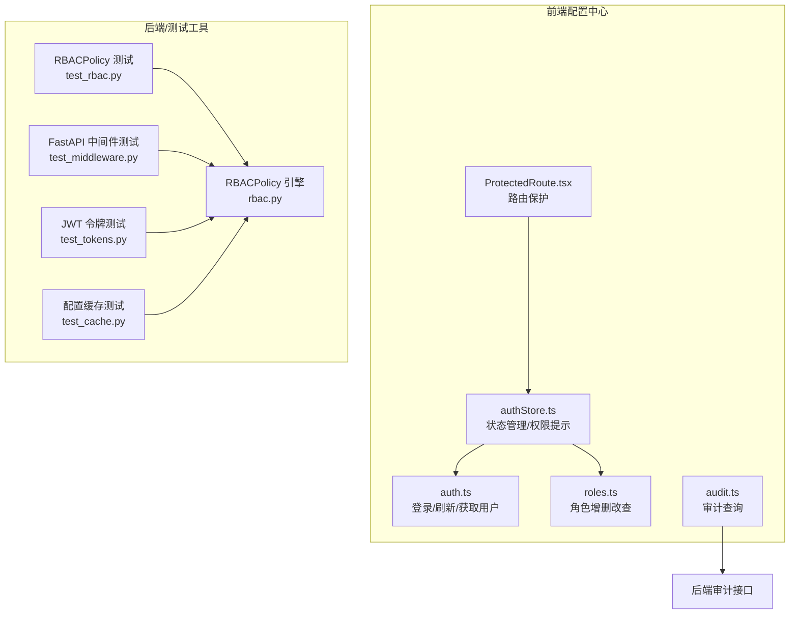
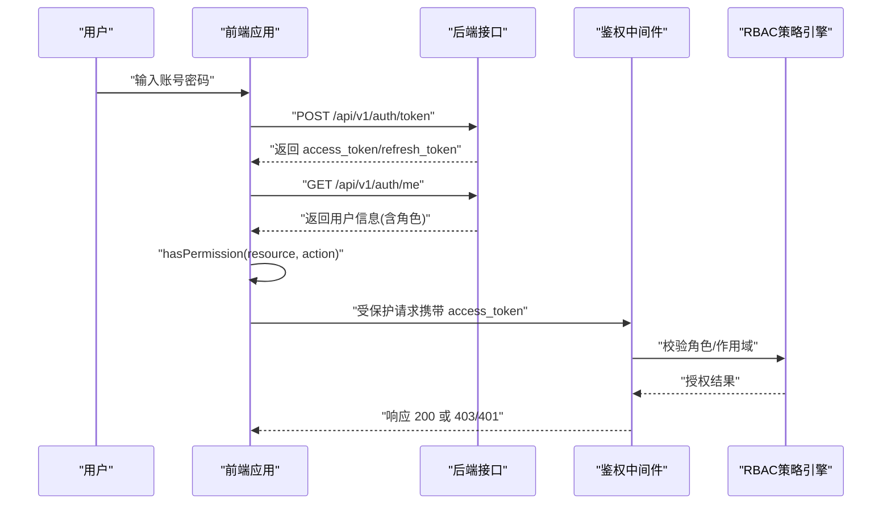
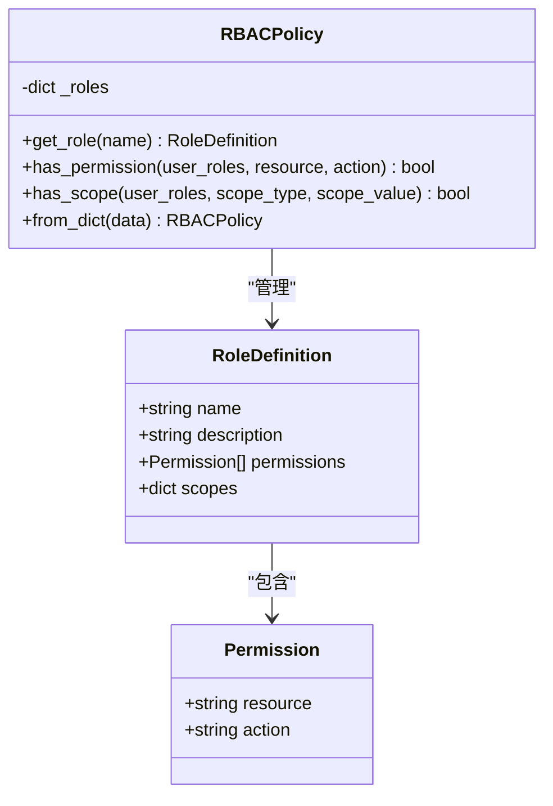
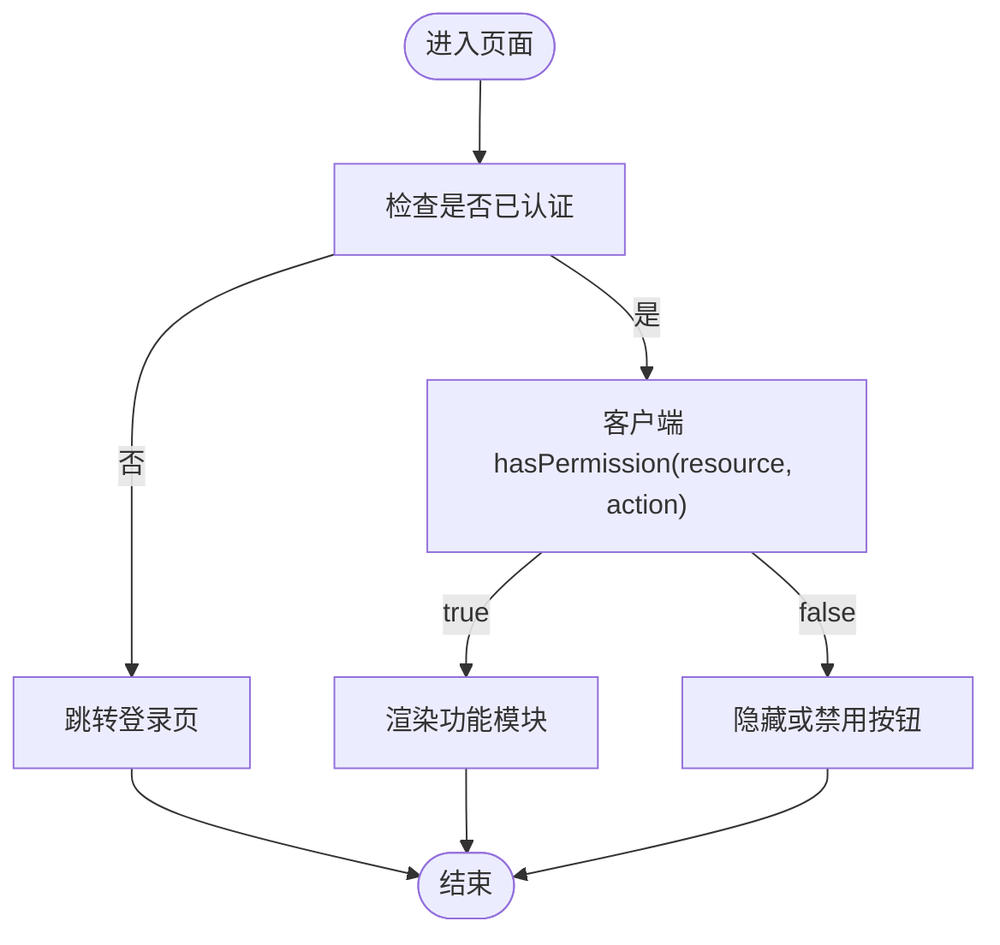
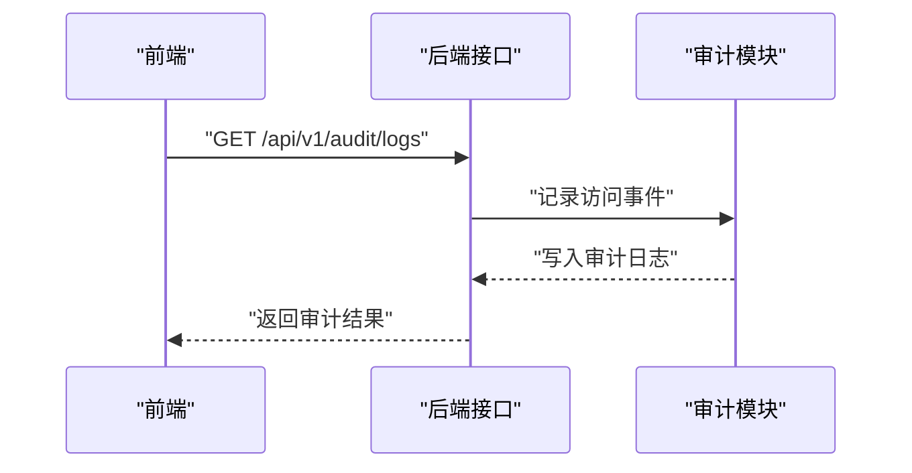
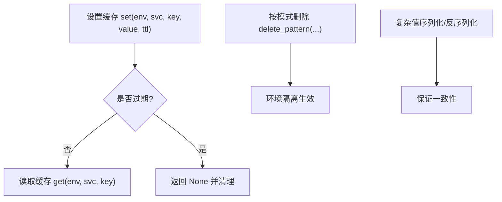
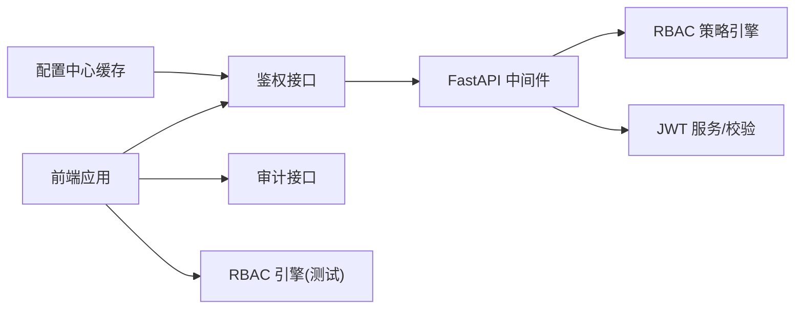

# 授权系统

<cite>
**本文引用的文件**
- [apps/config-center/src/api/auth.ts](file://apps/config-center/src/api/auth.ts)
- [apps/config-center/src/api/roles.ts](file://apps/config-center/src/api/roles.ts)
- [apps/config-center/src/store/authStore.ts](file://apps/config-center/src/store/authStore.ts)
- [apps/config-center/src/components/ProtectedRoute.tsx](file://apps/config-center/src/components/ProtectedRoute.tsx)
- [apps/config-center/src/api/audit.ts](file://apps/config-center/src/api/audit.ts)
- [tools/flexloop/tests/testing/test_auth/test_rbac.py](file://tools/flexloop/tests/testing/test_auth/test_rbac.py)
- [tools/flexloop/src/taolib/testing/auth/rbac.py](file://tools/flexloop/src/taolib/testing/auth/rbac.py)
- [tools/flexloop/tests/testing/test_auth/test_fastapi/test_middleware.py](file://tools/flexloop/tests/testing/test_auth/test_fastapi/test_middleware.py)
- [tools/flexloop/tests/testing/test_auth/test_tokens.py](file://tools/flexloop/tests/testing/test_auth/test_tokens.py)
- [tools/flexloop/tests/testing/test_config_center/test_cache.py](file://tools/flexloop/tests/testing/test_config_center/test_cache.py)
</cite>

## 目录
1. [简介](#简介)
2. [项目结构](#项目结构)
3. [核心组件](#核心组件)
4. [架构总览](#架构总览)
5. [详细组件分析](#详细组件分析)
6. [依赖关系分析](#依赖关系分析)
7. [性能考虑](#性能考虑)
8. [故障排查指南](#故障排查指南)
9. [结论](#结论)
10. [附录](#附录)

## 简介
本文件为 DaoMind 授权系统的技术文档，聚焦于 RBAC 权限模型实现、角色与权限映射、访问控制列表管理、用户角色分配与继承、动态权限调整与失效处理、权限检查算法与组合规则、权限缓存策略、配置管理、权限审计与安全监控等主题。文档同时给出前端路由保护、后端中间件鉴权、RBAC 策略引擎与令牌校验等关键流程的可视化图示，并提供可定位到具体源码位置的示例路径，便于开发者快速理解与落地。

## 项目结构
授权系统相关代码主要分布在以下区域：
- 前端配置中心（Config Center）：负责登录、令牌刷新、用户信息获取、角色管理接口调用、路由保护与权限提示。
- 测试与工具（flexloop）：提供 RBAC 策略引擎、FastAPI 中间件鉴权、JWT 令牌服务与校验、配置中心缓存与过期策略等能力。

图表来源
- [apps/config-center/src/api/auth.ts:1-15](file://apps/config-center/src/api/auth.ts#L1-L15)
- [apps/config-center/src/api/roles.ts:1-26](file://apps/config-center/src/api/roles.ts#L1-L26)
- [apps/config-center/src/store/authStore.ts:1-108](file://apps/config-center/src/store/authStore.ts#L1-L108)
- [apps/config-center/src/components/ProtectedRoute.tsx:1-14](file://apps/config-center/src/components/ProtectedRoute.tsx#L1-L14)
- [apps/config-center/src/api/audit.ts:1-18](file://apps/config-center/src/api/audit.ts#L1-L18)
- [tools/flexloop/tests/testing/test_auth/test_rbac.py:1-194](file://tools/flexloop/tests/testing/test_auth/test_rbac.py#L1-L194)
- [tools/flexloop/src/taolib/testing/auth/rbac.py:1-159](file://tools/flexloop/src/taolib/testing/auth/rbac.py#L1-L159)
- [tools/flexloop/tests/testing/test_auth/test_fastapi/test_middleware.py:43-263](file://tools/flexloop/tests/testing/test_auth/test_fastapi/test_middleware.py#L43-L263)
- [tools/flexloop/tests/testing/test_auth/test_tokens.py:76-224](file://tools/flexloop/tests/testing/test_auth/test_tokens.py#L76-L224)
- [tools/flexloop/tests/testing/test_config_center/test_cache.py:128-189](file://tools/flexloop/tests/testing/test_config_center/test_cache.py#L128-L189)

章节来源
- [apps/config-center/src/api/auth.ts:1-15](file://apps/config-center/src/api/auth.ts#L1-L15)
- [apps/config-center/src/api/roles.ts:1-26](file://apps/config-center/src/api/roles.ts#L1-L26)
- [apps/config-center/src/store/authStore.ts:1-108](file://apps/config-center/src/store/authStore.ts#L1-L108)
- [apps/config-center/src/components/ProtectedRoute.tsx:1-14](file://apps/config-center/src/components/ProtectedRoute.tsx#L1-L14)
- [apps/config-center/src/api/audit.ts:1-18](file://apps/config-center/src/api/audit.ts#L1-L18)
- [tools/flexloop/tests/testing/test_auth/test_rbac.py:1-194](file://tools/flexloop/tests/testing/test_auth/test_rbac.py#L1-L194)
- [tools/flexloop/src/taolib/testing/auth/rbac.py:1-159](file://tools/flexloop/src/taolib/testing/auth/rbac.py#L1-L159)
- [tools/flexloop/tests/testing/test_auth/test_fastapi/test_middleware.py:43-263](file://tools/flexloop/tests/testing/test_auth/test_fastapi/test_middleware.py#L43-L263)
- [tools/flexloop/tests/testing/test_auth/test_tokens.py:76-224](file://tools/flexloop/tests/testing/test_auth/test_tokens.py#L76-L224)
- [tools/flexloop/tests/testing/test_config_center/test_cache.py:128-189](file://tools/flexloop/tests/testing/test_config_center/test_cache.py#L128-L189)

## 核心组件
- RBAC 策略引擎：提供角色定义、权限集合、作用域约束与权限/作用域检查能力，支持从字典构建策略，兼容多种作用域类型。
- 前端鉴权与状态：登录/刷新/获取用户、持久化存储、客户端侧权限提示、路由保护。
- 审计与监控：审计日志查询接口，结合后端中间件记录访问行为。
- 配置缓存：配置中心缓存实现，支持 TTL 过期、通配删除、序列化与环境隔离。

章节来源
- [tools/flexloop/src/taolib/testing/auth/rbac.py:1-159](file://tools/flexloop/src/taolib/testing/auth/rbac.py#L1-L159)
- [apps/config-center/src/store/authStore.ts:1-108](file://apps/config-center/src/store/authStore.ts#L1-L108)
- [apps/config-center/src/components/ProtectedRoute.tsx:1-14](file://apps/config-center/src/components/ProtectedRoute.tsx#L1-L14)
- [apps/config-center/src/api/audit.ts:1-18](file://apps/config-center/src/api/audit.ts#L1-L18)
- [tools/flexloop/tests/testing/test_config_center/test_cache.py:128-189](file://tools/flexloop/tests/testing/test_config_center/test_cache.py#L128-L189)

## 架构总览
授权系统采用“前端状态+后端策略”的协作模式：
- 前端负责用户会话生命周期管理、UI 权限提示与路由保护；
- 后端负责强安全边界内的权限校验与作用域验证；
- RBAC 引擎作为通用策略库，既用于单元测试，也可作为服务内部策略参考；
- 审计模块贯穿前后端，记录关键操作与异常事件。

图表来源
- [apps/config-center/src/api/auth.ts:1-15](file://apps/config-center/src/api/auth.ts#L1-L15)
- [apps/config-center/src/store/authStore.ts:1-108](file://apps/config-center/src/store/authStore.ts#L1-L108)
- [tools/flexloop/tests/testing/test_auth/test_fastapi/test_middleware.py:43-263](file://tools/flexloop/tests/testing/test_auth/test_fastapi/test_middleware.py#L43-L263)
- [tools/flexloop/src/taolib/testing/auth/rbac.py:1-159](file://tools/flexloop/src/taolib/testing/auth/rbac.py#L1-L159)

## 详细组件分析

### RBAC 策略引擎与权限检查
RBAC 引擎提供角色定义、权限集合与作用域约束，并支持多角色权限合并与作用域交集/并集逻辑。测试覆盖了管理员全权限、编辑者受限权限、查看者只读、多角色合并、作用域限制与字典构建等场景。

图表来源
- [tools/flexloop/src/taolib/testing/auth/rbac.py:1-159](file://tools/flexloop/src/taolib/testing/auth/rbac.py#L1-L159)

章节来源
- [tools/flexloop/src/taolib/testing/auth/rbac.py:1-159](file://tools/flexloop/src/taolib/testing/auth/rbac.py#L1-L159)
- [tools/flexloop/tests/testing/test_auth/test_rbac.py:1-194](file://tools/flexloop/tests/testing/test_auth/test_rbac.py#L1-L194)

### 前端鉴权与路由保护
前端使用状态管理进行登录、刷新、获取用户信息；客户端侧提供 hasPermission 用于 UI 展示提示；ProtectedRoute 对未认证用户进行重定向。

图表来源
- [apps/config-center/src/store/authStore.ts:1-108](file://apps/config-center/src/store/authStore.ts#L1-L108)
- [apps/config-center/src/components/ProtectedRoute.tsx:1-14](file://apps/config-center/src/components/ProtectedRoute.tsx#L1-L14)

章节来源
- [apps/config-center/src/store/authStore.ts:1-108](file://apps/config-center/src/store/authStore.ts#L1-L108)
- [apps/config-center/src/components/ProtectedRoute.tsx:1-14](file://apps/config-center/src/components/ProtectedRoute.tsx#L1-L14)

### 审计与安全监控
前端提供审计日志查询接口，后端中间件测试覆盖了 JWT 与 API Key 的认证流程、黑名单与过期处理、健康检查等场景，形成“可观测、可追溯”的安全闭环。

图表来源
- [apps/config-center/src/api/audit.ts:1-18](file://apps/config-center/src/api/audit.ts#L1-L18)
- [tools/flexloop/tests/testing/test_auth/test_fastapi/test_middleware.py:43-263](file://tools/flexloop/tests/testing/test_auth/test_fastapi/test_middleware.py#L43-L263)

章节来源
- [apps/config-center/src/api/audit.ts:1-18](file://apps/config-center/src/api/audit.ts#L1-L18)
- [tools/flexloop/tests/testing/test_auth/test_fastapi/test_middleware.py:43-263](file://tools/flexloop/tests/testing/test_auth/test_fastapi/test_middleware.py#L43-L263)

### 配置中心缓存策略
配置中心缓存支持按环境隔离、TTL 过期、通配删除、复杂值序列化等特性，保障高并发下的读取性能与一致性。

图表来源
- [tools/flexloop/tests/testing/test_config_center/test_cache.py:128-189](file://tools/flexloop/tests/testing/test_config_center/test_cache.py#L128-L189)

章节来源
- [tools/flexloop/tests/testing/test_config_center/test_cache.py:128-189](file://tools/flexloop/tests/testing/test_config_center/test_cache.py#L128-L189)

## 依赖关系分析
- 前端依赖后端提供的鉴权接口与审计接口，同时依赖 RBAC 引擎的策略能力进行客户端侧提示。
- 后端中间件依赖 JWT 服务与黑名单机制，确保令牌有效性与安全性。
- 测试模块覆盖 RBAC 引擎、中间件、令牌服务与缓存策略，形成完整的授权闭环验证。

图表来源
- [apps/config-center/src/api/auth.ts:1-15](file://apps/config-center/src/api/auth.ts#L1-L15)
- [apps/config-center/src/api/audit.ts:1-18](file://apps/config-center/src/api/audit.ts#L1-L18)
- [tools/flexloop/tests/testing/test_auth/test_fastapi/test_middleware.py:43-263](file://tools/flexloop/tests/testing/test_auth/test_fastapi/test_middleware.py#L43-L263)
- [tools/flexloop/src/taolib/testing/auth/rbac.py:1-159](file://tools/flexloop/src/taolib/testing/auth/rbac.py#L1-L159)
- [tools/flexloop/tests/testing/test_auth/test_tokens.py:76-224](file://tools/flexloop/tests/testing/test_auth/test_tokens.py#L76-L224)
- [tools/flexloop/tests/testing/test_config_center/test_cache.py:128-189](file://tools/flexloop/tests/testing/test_config_center/test_cache.py#L128-L189)

章节来源
- [apps/config-center/src/api/auth.ts:1-15](file://apps/config-center/src/api/auth.ts#L1-L15)
- [apps/config-center/src/api/audit.ts:1-18](file://apps/config-center/src/api/audit.ts#L1-L18)
- [tools/flexloop/tests/testing/test_auth/test_fastapi/test_middleware.py:43-263](file://tools/flexloop/tests/testing/test_auth/test_fastapi/test_middleware.py#L43-L263)
- [tools/flexloop/src/taolib/testing/auth/rbac.py:1-159](file://tools/flexloop/src/taolib/testing/auth/rbac.py#L1-L159)
- [tools/flexloop/tests/testing/test_auth/test_tokens.py:76-224](file://tools/flexloop/tests/testing/test_auth/test_tokens.py#L76-L224)
- [tools/flexloop/tests/testing/test_config_center/test_cache.py:128-189](file://tools/flexloop/tests/testing/test_config_center/test_cache.py#L128-L189)

## 性能考虑
- 前端权限提示采用客户端侧快速判断，避免频繁网络请求；对于超级管理员直接放行，其余用户默认提示可用以提升交互体验。
- 配置中心缓存支持 LRU 与 TTL，降低后端压力并保证热点数据命中率。
- JWT 令牌短时间有效，配合刷新令牌与黑名单机制，平衡安全与性能。

## 故障排查指南
- 登录失败：检查登录接口返回与错误信息，确认用户名密码正确性与网络连通性。
- 刷新令牌异常：确认 refresh_token 存在且未过期，若失败则触发登出清理状态。
- 无权限访问：确认用户角色与目标资源/动作是否匹配，检查 RBAC 策略中权限与作用域配置。
- 审计日志缺失：确认后端中间件是否正常记录，以及前端审计接口参数是否正确。
- 令牌过期或无效：核对 JWT 密钥、算法与过期时间配置，确保服务端与客户端一致。

章节来源
- [apps/config-center/src/store/authStore.ts:1-108](file://apps/config-center/src/store/authStore.ts#L1-L108)
- [apps/config-center/src/api/audit.ts:1-18](file://apps/config-center/src/api/audit.ts#L1-L18)
- [tools/flexloop/tests/testing/test_auth/test_tokens.py:76-224](file://tools/flexloop/tests/testing/test_auth/test_tokens.py#L76-L224)

## 结论
DaoMind 授权系统通过“前端状态+后端策略”的协同设计，实现了清晰的 RBAC 权限模型与完善的鉴权流程。RBAC 引擎、JWT 中间件、审计与缓存策略共同构成安全、可观测、可扩展的授权体系。建议在生产环境中强化服务端强制校验、完善审计策略与告警机制，并持续优化权限模型与缓存命中率。

## 附录
- 实际代码示例路径（仅提供路径，不展示具体代码内容）：
  - 角色管理接口调用示例：[apps/config-center/src/api/roles.ts:1-26](file://apps/config-center/src/api/roles.ts#L1-L26)
  - 登录/刷新/获取用户接口调用示例：[apps/config-center/src/api/auth.ts:1-15](file://apps/config-center/src/api/auth.ts#L1-L15)
  - 前端路由保护组件示例：[apps/config-center/src/components/ProtectedRoute.tsx:1-14](file://apps/config-center/src/components/ProtectedRoute.tsx#L1-L14)
  - 审计日志查询接口示例：[apps/config-center/src/api/audit.ts:1-18](file://apps/config-center/src/api/audit.ts#L1-L18)
  - RBAC 策略引擎与测试示例：[tools/flexloop/src/taolib/testing/auth/rbac.py:1-159](file://tools/flexloop/src/taolib/testing/auth/rbac.py#L1-L159)、[tools/flexloop/tests/testing/test_auth/test_rbac.py:1-194](file://tools/flexloop/tests/testing/test_auth/test_rbac.py#L1-L194)
  - FastAPI 中间件与 JWT 令牌测试示例：[tools/flexloop/tests/testing/test_auth/test_fastapi/test_middleware.py:43-263](file://tools/flexloop/tests/testing/test_auth/test_fastapi/test_middleware.py#L43-L263)、[tools/flexloop/tests/testing/test_auth/test_tokens.py:76-224](file://tools/flexloop/tests/testing/test_auth/test_tokens.py#L76-L224)
  - 配置中心缓存策略测试示例：[tools/flexloop/tests/testing/test_config_center/test_cache.py:128-189](file://tools/flexloop/tests/testing/test_config_center/test_cache.py#L128-L189)