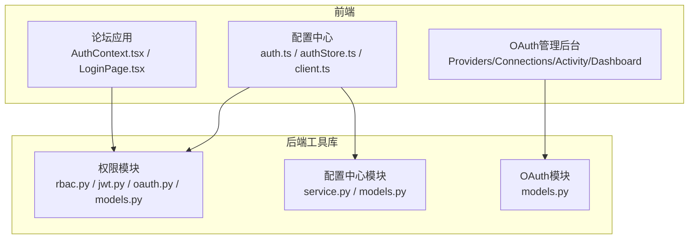
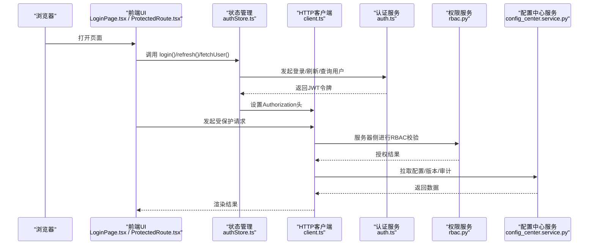
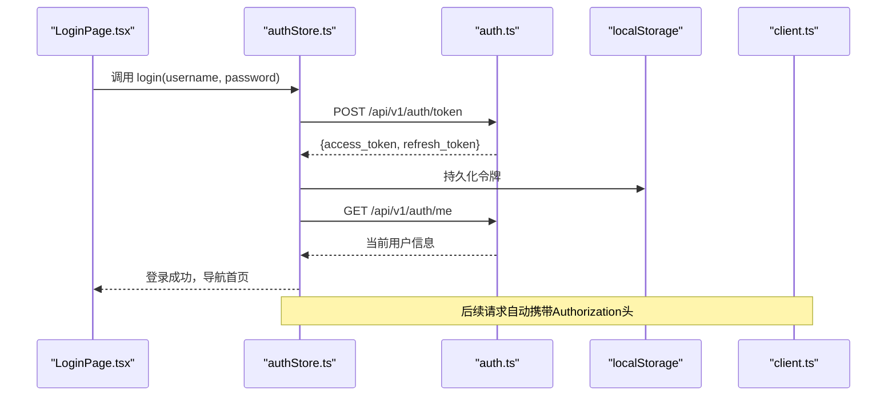
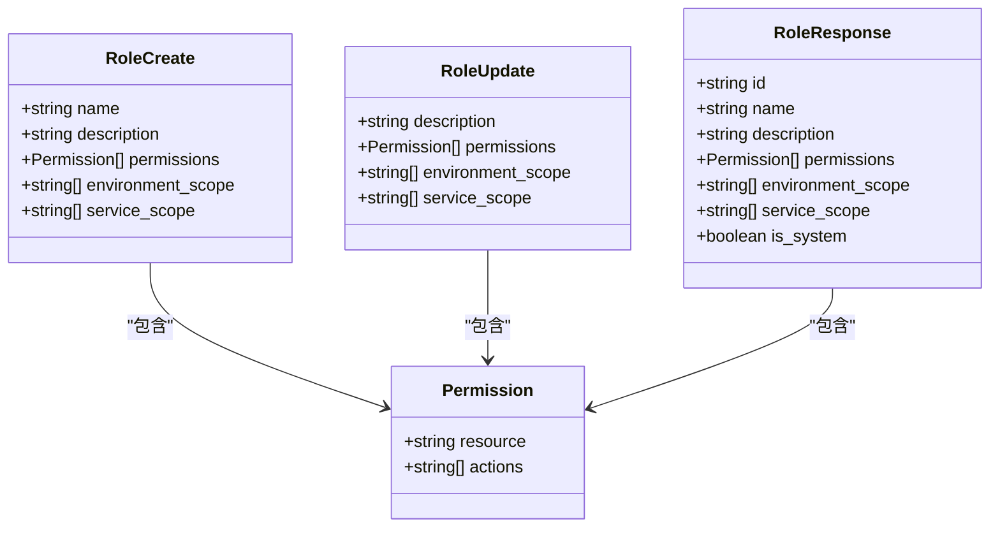
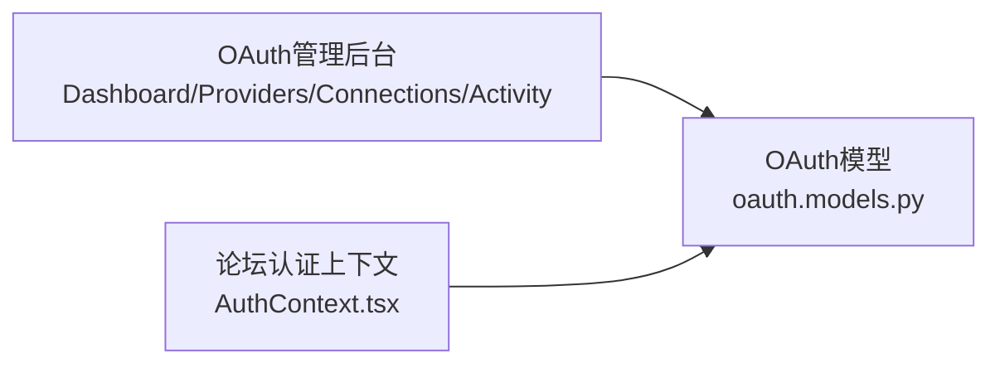
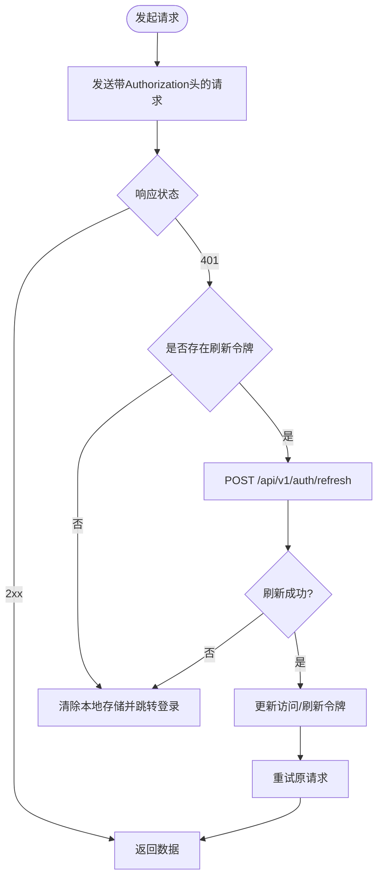
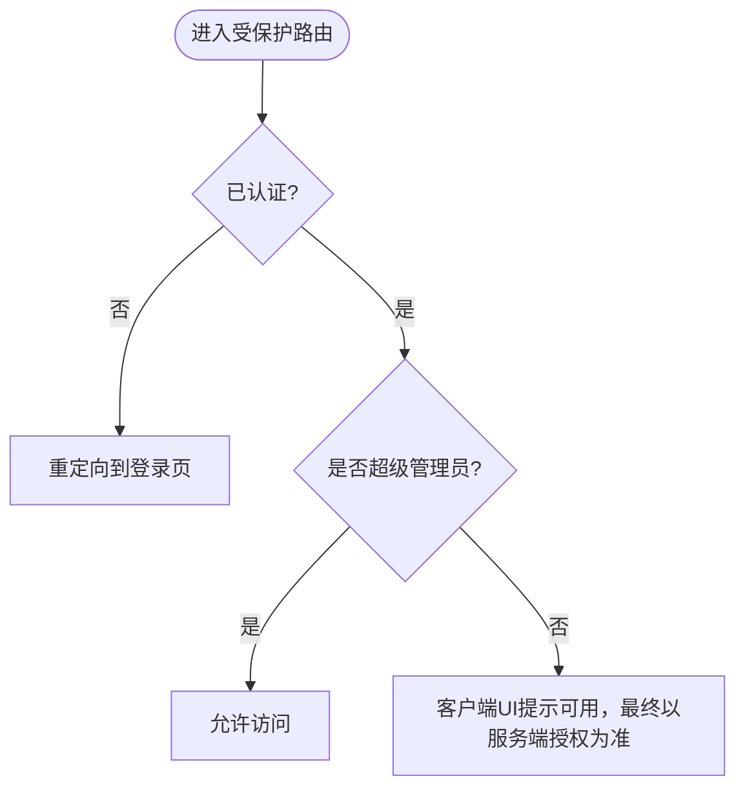
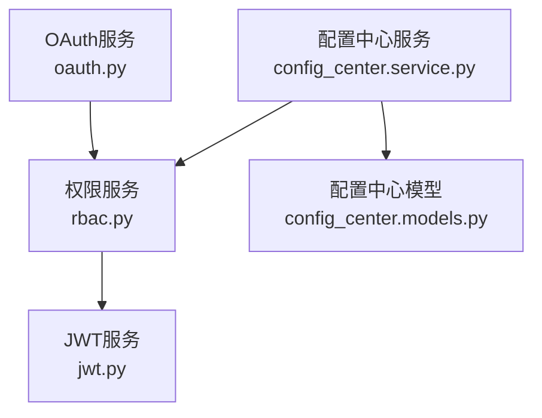
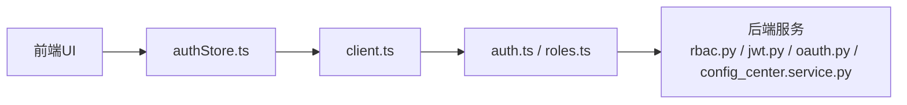

# 权限访问控制

<cite>
**本文引用的文件**
- [apps/config-center/src/api/auth.ts](file://apps/config-center/src/api/auth.ts)
- [apps/config-center/src/api/roles.ts](file://apps/config-center/src/api/roles.ts)
- [apps/config-center/src/store/authStore.ts](file://apps/config-center/src/store/authStore.ts)
- [apps/config-center/src/pages/LoginPage.tsx](file://apps/config-center/src/pages/LoginPage.tsx)
- [apps/config-center/src/components/ProtectedRoute.tsx](file://apps/config-center/src/components/ProtectedRoute.tsx)
- [apps/config-center/src/api/client.ts](file://apps/config-center/src/api/client.ts)
- [apps/config-center/src/types/index.ts](file://apps/config-center/src/types/index.ts)
- [apps/oauth-admin/src/pages/DashboardPage.tsx](file://apps/oauth-admin/src/pages/DashboardPage.tsx)
- [apps/oauth-admin/src/pages/ProvidersPage.tsx](file://apps/oauth-admin/src/pages/ProvidersPage.tsx)
- [apps/oauth-admin/src/pages/ConnectionsPage.tsx](file://apps/oauth-admin/src/pages/ConnectionsPage.tsx)
- [apps/oauth-admin/src/pages/ActivityPage.tsx](file://apps/oauth-admin/src/pages/ActivityPage.tsx)
- [apps/oauth-admin/src/components/layout/Sidebar.tsx](file://apps/oauth-admin/src/components/layout/Sidebar.tsx)
- [apps/forum/src/context/AuthContext.tsx](file://apps/forum/src/context/AuthContext.tsx)
- [apps/forum/src/pages/LoginPage.tsx](file://apps/forum/src/pages/LoginPage.tsx)
- [apps/forum/src/pages/RegisterPage.tsx](file://apps/forum/src/pages/RegisterPage.tsx)
- [apps/forum/src/pages/SettingsPage.tsx](file://apps/forum/src/pages/SettingsPage.tsx)
- [apps/forum/src/pages/AdminPage.tsx](file://apps/forum/src/pages/AdminPage.tsx)
- [apps/forum/src/components/layout/Header.tsx](file://apps/forum/src/components/layout/Header.tsx)
- [apps/forum/src/components/layout/Footer.tsx](file://apps/forum/src/components/layout/Footer.tsx)
- [apps/forum/src/data/store.ts](file://apps/forum/src/data/store.ts)
- [apps/forum/src/types/index.ts](file://apps/forum/src/types/index.ts)
- [tools/flexloop/src/taolib/auth/__init__.py](file://tools/flexloop/src/taolib/auth/__init__.py)
- [tools/flexloop/src/taolib/auth/models.py](file://tools/flexloop/src/taolib/auth/models.py)
- [tools/flexloop/src/taolib/auth/rbac.py](file://tools/flexloop/src/taolib/auth/rbac.py)
- [tools/flexloop/src/taolib/auth/jwt.py](file://tools/flexloop/src/taolib/auth/jwt.py)
- [tools/flexloop/src/taolib/auth/oauth.py](file://tools/flexloop/src/taolib/auth/oauth.py)
- [tools/flexloop/src/taolib/config_center/__init__.py](file://tools/flexloop/src/taolib/config_center/__init__.py)
- [tools/flexloop/src/taolib/config_center/models.py](file://tools/flexloop/src/taolib/config_center/models.py)
- [tools/flexloop/src/taolib/config_center/service.py](file://tools/flexloop/src/taolib/config_center/service.py)
- [tools/flexloop/src/taolib/oauth/__init__.py](file://tools/flexloop/src/taolib/oauth/__init__.py)
- [tools/flexloop/src/taolib/oauth/models.py](file://tools/flexloop/src/taolib/oauth/models.py)
- [tools/flexloop/tests/test_auth/test_rbac.py](file://tools/flexloop/tests/test_auth/test_rbac.py)
- [tools/flexloop/tests/test_auth/test_tokens.py](file://tools/flexloop/tests/test_auth/test_tokens.py)
- [tools/flexloop/tests/test_auth/test_models.py](file://tools/flexloop/tests/test_auth/test_models.py)
- [tools/flexloop/tests/test_config_center/test_auth.py](file://tools/flexloop/tests/test_config_center/test_auth.py)
- [tools/flexloop/tests/test_config_center/test_models_config.py](file://tools/flexloop/tests/test_config_center/test_models_config.py)
- [tools/flexloop/tests/test_oauth/test_models.py](file://tools/flexloop/tests/test_oauth/test_models.py)
- [tools/flexloop/tests/test_oauth/test_providers.py](file://tools/flexloop/tests/test_oauth/test_providers.py)
</cite>

## 目录
1. [简介](#简介)
2. [项目结构](#项目结构)
3. [核心组件](#核心组件)
4. [架构总览](#架构总览)
5. [详细组件分析](#详细组件分析)
6. [依赖关系分析](#依赖关系分析)
7. [性能考量](#性能考量)
8. [故障排查指南](#故障排查指南)
9. [结论](#结论)
10. [附录](#附录)

## 简介
本技术文档面向DaoMind权限访问控制系统，围绕RBAC权限模型、OAuth 2.0认证机制与JWT令牌管理展开，系统性阐述用户角色定义、权限分配、访问控制列表、会话管理、第三方认证集成、单点登录、权限继承与动态权限调整等主题，并提供最佳实践、安全考虑与合规建议。文档同时给出前端权限控制（配置中心）与后端权限/配置中心服务的实现要点与集成路径。

## 项目结构
权限系统由三部分组成：
- 前端应用：配置中心（RBAC与会话管理）、论坛（基础认证上下文）、OAuth管理后台（第三方提供商与连接管理）
- 后端工具库：权限（RBAC、JWT、OAuth）、配置中心（配置与版本审计）、OAuth（第三方集成）
- 测试：覆盖RBAC、令牌、配置中心、OAuth等模块

图表来源
- [apps/config-center/src/api/auth.ts:1-15](file://apps/config-center/src/api/auth.ts#L1-L15)
- [apps/config-center/src/store/authStore.ts:1-108](file://apps/config-center/src/store/authStore.ts#L1-L108)
- [apps/config-center/src/api/client.ts:1-172](file://apps/config-center/src/api/client.ts#L1-L172)
- [apps/forum/src/context/AuthContext.tsx](file://apps/forum/src/context/AuthContext.tsx)
- [apps/forum/src/pages/LoginPage.tsx](file://apps/forum/src/pages/LoginPage.tsx)
- [apps/oauth-admin/src/pages/ProvidersPage.tsx](file://apps/oauth-admin/src/pages/ProvidersPage.tsx)
- [apps/oauth-admin/src/pages/ConnectionsPage.tsx](file://apps/oauth-admin/src/pages/ConnectionsPage.tsx)
- [apps/oauth-admin/src/pages/ActivityPage.tsx](file://apps/oauth-admin/src/pages/ActivityPage.tsx)
- [apps/oauth-admin/src/pages/DashboardPage.tsx](file://apps/oauth-admin/src/pages/DashboardPage.tsx)
- [tools/flexloop/src/taolib/auth/rbac.py](file://tools/flexloop/src/taolib/auth/rbac.py)
- [tools/flexloop/src/taolib/auth/jwt.py](file://tools/flexloop/src/taolib/auth/jwt.py)
- [tools/flexloop/src/taolib/auth/oauth.py](file://tools/flexloop/src/taolib/auth/oauth.py)
- [tools/flexloop/src/taolib/config_center/service.py](file://tools/flexloop/src/taolib/config_center/service.py)
- [tools/flexloop/src/taolib/oauth/models.py](file://tools/flexloop/src/taolib/oauth/models.py)

章节来源
- [apps/config-center/src/api/auth.ts:1-15](file://apps/config-center/src/api/auth.ts#L1-L15)
- [apps/config-center/src/store/authStore.ts:1-108](file://apps/config-center/src/store/authStore.ts#L1-L108)
- [apps/config-center/src/api/client.ts:1-172](file://apps/config-center/src/api/client.ts#L1-L172)
- [apps/forum/src/context/AuthContext.tsx](file://apps/forum/src/context/AuthContext.tsx)
- [apps/forum/src/pages/LoginPage.tsx](file://apps/forum/src/pages/LoginPage.tsx)
- [apps/oauth-admin/src/pages/ProvidersPage.tsx](file://apps/oauth-admin/src/pages/ProvidersPage.tsx)
- [apps/oauth-admin/src/pages/ConnectionsPage.tsx](file://apps/oauth-admin/src/pages/ConnectionsPage.tsx)
- [apps/oauth-admin/src/pages/ActivityPage.tsx](file://apps/oauth-admin/src/pages/ActivityPage.tsx)
- [apps/oauth-admin/src/pages/DashboardPage.tsx](file://apps/oauth-admin/src/pages/DashboardPage.tsx)
- [tools/flexloop/src/taolib/auth/rbac.py](file://tools/flexloop/src/taolib/auth/rbac.py)
- [tools/flexloop/src/taolib/auth/jwt.py](file://tools/flexloop/src/taolib/auth/jwt.py)
- [tools/flexloop/src/taolib/auth/oauth.py](file://tools/flexloop/src/taolib/auth/oauth.py)
- [tools/flexloop/src/taolib/config_center/service.py](file://tools/flexloop/src/taolib/config_center/service.py)
- [tools/flexloop/src/taolib/oauth/models.py](file://tools/flexloop/src/taolib/oauth/models.py)

## 核心组件
- 认证API层：登录、刷新令牌、获取当前用户信息
- 会话状态管理：Zustand持久化存储，含令牌与用户信息
- 请求客户端：统一处理Authorization头、自动刷新令牌、错误处理
- 角色与权限：角色定义、权限集合、环境/服务作用域
- 路由保护：受保护路由组件
- 类型定义：用户、角色、权限、审计、配置等数据模型

章节来源
- [apps/config-center/src/api/auth.ts:1-15](file://apps/config-center/src/api/auth.ts#L1-L15)
- [apps/config-center/src/store/authStore.ts:1-108](file://apps/config-center/src/store/authStore.ts#L1-L108)
- [apps/config-center/src/api/client.ts:1-172](file://apps/config-center/src/api/client.ts#L1-L172)
- [apps/config-center/src/api/roles.ts:1-26](file://apps/config-center/src/api/roles.ts#L1-L26)
- [apps/config-center/src/components/ProtectedRoute.tsx:1-14](file://apps/config-center/src/components/ProtectedRoute.tsx#L1-L14)
- [apps/config-center/src/types/index.ts:1-163](file://apps/config-center/src/types/index.ts#L1-L163)

## 架构总览
下图展示了从浏览器到后端服务的典型请求链路，包括认证、权限校验与配置中心交互：

图表来源
- [apps/config-center/src/pages/LoginPage.tsx:1-77](file://apps/config-center/src/pages/LoginPage.tsx#L1-L77)
- [apps/config-center/src/components/ProtectedRoute.tsx:1-14](file://apps/config-center/src/components/ProtectedRoute.tsx#L1-L14)
- [apps/config-center/src/store/authStore.ts:1-108](file://apps/config-center/src/store/authStore.ts#L1-L108)
- [apps/config-center/src/api/client.ts:1-172](file://apps/config-center/src/api/client.ts#L1-L172)
- [apps/config-center/src/api/auth.ts:1-15](file://apps/config-center/src/api/auth.ts#L1-L15)
- [tools/flexloop/src/taolib/auth/rbac.py](file://tools/flexloop/src/taolib/auth/rbac.py)
- [tools/flexloop/src/taolib/config_center/service.py](file://tools/flexloop/src/taolib/config_center/service.py)

## 详细组件分析

### 组件A：认证与会话管理（配置中心）
- 登录流程：表单提交用户名/密码，调用登录接口获取JWT，保存访问与刷新令牌，拉取当前用户信息
- 刷新令牌：在本地存储中存在刷新令牌时，自动刷新访问令牌；失败则登出
- 获取当前用户：用于初始化用户信息与UI渲染
- 客户端中间件：统一设置Authorization头，拦截401并触发刷新或跳转登录
- 路由保护：未认证用户重定向至登录页

图表来源
- [apps/config-center/src/pages/LoginPage.tsx:1-77](file://apps/config-center/src/pages/LoginPage.tsx#L1-L77)
- [apps/config-center/src/store/authStore.ts:1-108](file://apps/config-center/src/store/authStore.ts#L1-L108)
- [apps/config-center/src/api/auth.ts:1-15](file://apps/config-center/src/api/auth.ts#L1-L15)
- [apps/config-center/src/api/client.ts:1-172](file://apps/config-center/src/api/client.ts#L1-L172)

章节来源
- [apps/config-center/src/pages/LoginPage.tsx:1-77](file://apps/config-center/src/pages/LoginPage.tsx#L1-L77)
- [apps/config-center/src/store/authStore.ts:1-108](file://apps/config-center/src/store/authStore.ts#L1-L108)
- [apps/config-center/src/api/auth.ts:1-15](file://apps/config-center/src/api/auth.ts#L1-L15)
- [apps/config-center/src/api/client.ts:1-172](file://apps/config-center/src/api/client.ts#L1-L172)
- [apps/config-center/src/components/ProtectedRoute.tsx:1-14](file://apps/config-center/src/components/ProtectedRoute.tsx#L1-L14)

### 组件B：RBAC权限模型与角色管理
- 角色定义：名称、描述、权限集合（资源+动作数组）、环境/服务作用域、是否系统内置
- 权限结构：资源字符串与动作数组，支持细粒度控制
- 角色API：分页列表、详情、创建、更新、删除
- 客户端权限提示：超级管理员拥有全部权限；普通用户仅作UI提示，最终授权以服务端为准

图表来源
- [apps/config-center/src/api/roles.ts:1-26](file://apps/config-center/src/api/roles.ts#L1-L26)
- [apps/config-center/src/types/index.ts:122-154](file://apps/config-center/src/types/index.ts#L122-L154)

章节来源
- [apps/config-center/src/api/roles.ts:1-26](file://apps/config-center/src/api/roles.ts#L1-L26)
- [apps/config-center/src/types/index.ts:122-154](file://apps/config-center/src/types/index.ts#L122-L154)

### 组件C：OAuth 2.0与第三方认证集成
- OAuth管理后台：提供仪表盘、提供商配置、用户连接管理、活动日志
- 认证上下文：论坛应用提供认证上下文与登录/注册/设置/管理页面
- OAuth模型：抽象第三方提供商与连接实体，支持扩展

图表来源
- [apps/oauth-admin/src/pages/DashboardPage.tsx](file://apps/oauth-admin/src/pages/DashboardPage.tsx)
- [apps/oauth-admin/src/pages/ProvidersPage.tsx](file://apps/oauth-admin/src/pages/ProvidersPage.tsx)
- [apps/oauth-admin/src/pages/ConnectionsPage.tsx](file://apps/oauth-admin/src/pages/ConnectionsPage.tsx)
- [apps/oauth-admin/src/pages/ActivityPage.tsx](file://apps/oauth-admin/src/pages/ActivityPage.tsx)
- [apps/forum/src/context/AuthContext.tsx](file://apps/forum/src/context/AuthContext.tsx)
- [tools/flexloop/src/taolib/oauth/models.py](file://tools/flexloop/src/taolib/oauth/models.py)

章节来源
- [apps/oauth-admin/src/pages/DashboardPage.tsx](file://apps/oauth-admin/src/pages/DashboardPage.tsx)
- [apps/oauth-admin/src/pages/ProvidersPage.tsx](file://apps/oauth-admin/src/pages/ProvidersPage.tsx)
- [apps/oauth-admin/src/pages/ConnectionsPage.tsx](file://apps/oauth-admin/src/pages/ConnectionsPage.tsx)
- [apps/oauth-admin/src/pages/ActivityPage.tsx](file://apps/oauth-admin/src/pages/ActivityPage.tsx)
- [apps/forum/src/context/AuthContext.tsx](file://apps/forum/src/context/AuthContext.tsx)
- [apps/forum/src/pages/LoginPage.tsx](file://apps/forum/src/pages/LoginPage.tsx)
- [apps/forum/src/pages/RegisterPage.tsx](file://apps/forum/src/pages/RegisterPage.tsx)
- [apps/forum/src/pages/SettingsPage.tsx](file://apps/forum/src/pages/SettingsPage.tsx)
- [apps/forum/src/pages/AdminPage.tsx](file://apps/forum/src/pages/AdminPage.tsx)
- [apps/forum/src/components/layout/Header.tsx](file://apps/forum/src/components/layout/Header.tsx)
- [apps/forum/src/components/layout/Footer.tsx](file://apps/forum/src/components/layout/Footer.tsx)
- [apps/forum/src/data/store.ts](file://apps/forum/src/data/store.ts)
- [apps/forum/src/types/index.ts](file://apps/forum/src/types/index.ts)
- [tools/flexloop/src/taolib/oauth/models.py](file://tools/flexloop/src/taolib/oauth/models.py)

### 组件D：JWT令牌管理与刷新机制
- 令牌结构：访问令牌、刷新令牌、令牌类型
- 自动刷新：首次401时触发刷新，更新本地存储中的访问与刷新令牌
- 错误处理：刷新失败或无效时清理本地存储并跳转登录

图表来源
- [apps/config-center/src/api/client.ts:1-172](file://apps/config-center/src/api/client.ts#L1-L172)
- [apps/config-center/src/store/authStore.ts:1-108](file://apps/config-center/src/store/authStore.ts#L1-L108)
- [apps/config-center/src/api/auth.ts:1-15](file://apps/config-center/src/api/auth.ts#L1-L15)

章节来源
- [apps/config-center/src/api/client.ts:1-172](file://apps/config-center/src/api/client.ts#L1-L172)
- [apps/config-center/src/store/authStore.ts:1-108](file://apps/config-center/src/store/authStore.ts#L1-L108)
- [apps/config-center/src/api/auth.ts:1-15](file://apps/config-center/src/api/auth.ts#L1-L15)

### 组件E：权限验证与访问控制（客户端提示）
- hasPermission：超级管理员直接放行；非超级管理员默认返回true（客户端UI提示），最终授权以服务端为准
- 受保护路由：未认证用户跳转登录页

图表来源
- [apps/config-center/src/components/ProtectedRoute.tsx:1-14](file://apps/config-center/src/components/ProtectedRoute.tsx#L1-L14)
- [apps/config-center/src/store/authStore.ts:84-95](file://apps/config-center/src/store/authStore.ts#L84-L95)

章节来源
- [apps/config-center/src/components/ProtectedRoute.tsx:1-14](file://apps/config-center/src/components/ProtectedRoute.tsx#L1-L14)
- [apps/config-center/src/store/authStore.ts:84-95](file://apps/config-center/src/store/authStore.ts#L84-L95)

### 组件F：后端权限与配置中心服务
- RBAC：基于资源与动作的权限矩阵，支持作用域过滤
- JWT：令牌签发、解析与校验
- OAuth：第三方提供商注册、用户连接、授权流程
- 配置中心：配置项的增删改查、版本管理、差异对比、审计日志

图表来源
- [tools/flexloop/src/taolib/auth/rbac.py](file://tools/flexloop/src/taolib/auth/rbac.py)
- [tools/flexloop/src/taolib/auth/jwt.py](file://tools/flexloop/src/taolib/auth/jwt.py)
- [tools/flexloop/src/taolib/auth/oauth.py](file://tools/flexloop/src/taolib/auth/oauth.py)
- [tools/flexloop/src/taolib/config_center/service.py](file://tools/flexloop/src/taolib/config_center/service.py)
- [tools/flexloop/src/taolib/config_center/models.py](file://tools/flexloop/src/taolib/config_center/models.py)

章节来源
- [tools/flexloop/src/taolib/auth/rbac.py](file://tools/flexloop/src/taolib/auth/rbac.py)
- [tools/flexloop/src/taolib/auth/jwt.py](file://tools/flexloop/src/taolib/auth/jwt.py)
- [tools/flexloop/src/taolib/auth/oauth.py](file://tools/flexloop/src/taolib/auth/oauth.py)
- [tools/flexloop/src/taolib/config_center/service.py](file://tools/flexloop/src/taolib/config_center/service.py)
- [tools/flexloop/src/taolib/config_center/models.py](file://tools/flexloop/src/taolib/config_center/models.py)

## 依赖关系分析
- 前端依赖：Zustand持久化、React Router、自定义HTTP客户端
- 后端依赖：Python工具库（权限、OAuth、配置中心），测试覆盖全面
- 外部集成：OAuth提供商、配置中心API

图表来源
- [apps/config-center/src/store/authStore.ts:1-108](file://apps/config-center/src/store/authStore.ts#L1-L108)
- [apps/config-center/src/api/client.ts:1-172](file://apps/config-center/src/api/client.ts#L1-L172)
- [apps/config-center/src/api/auth.ts:1-15](file://apps/config-center/src/api/auth.ts#L1-L15)
- [apps/config-center/src/api/roles.ts:1-26](file://apps/config-center/src/api/roles.ts#L1-L26)
- [tools/flexloop/src/taolib/auth/rbac.py](file://tools/flexloop/src/taolib/auth/rbac.py)
- [tools/flexloop/src/taolib/auth/jwt.py](file://tools/flexloop/src/taolib/auth/jwt.py)
- [tools/flexloop/src/taolib/auth/oauth.py](file://tools/flexloop/src/taolib/auth/oauth.py)
- [tools/flexloop/src/taolib/config_center/service.py](file://tools/flexloop/src/taolib/config_center/service.py)

章节来源
- [apps/config-center/src/store/authStore.ts:1-108](file://apps/config-center/src/store/authStore.ts#L1-L108)
- [apps/config-center/src/api/client.ts:1-172](file://apps/config-center/src/api/client.ts#L1-L172)
- [apps/config-center/src/api/auth.ts:1-15](file://apps/config-center/src/api/auth.ts#L1-L15)
- [apps/config-center/src/api/roles.ts:1-26](file://apps/config-center/src/api/roles.ts#L1-L26)
- [tools/flexloop/src/taolib/auth/rbac.py](file://tools/flexloop/src/taolib/auth/rbac.py)
- [tools/flexloop/src/taolib/auth/jwt.py](file://tools/flexloop/src/taolib/auth/jwt.py)
- [tools/flexloop/src/taolib/auth/oauth.py](file://tools/flexloop/src/taolib/auth/oauth.py)
- [tools/flexloop/src/taolib/config_center/service.py](file://tools/flexloop/src/taolib/config_center/service.py)

## 性能考量
- 令牌缓存：本地持久化访问与刷新令牌，减少重复登录
- 并发刷新：使用共享Promise避免并发刷新导致的重复请求
- 请求去抖：对频繁切换路由时的鉴权检查进行节流
- 服务端校验：客户端仅作UI提示，避免过度阻断用户体验
- 配置中心：分页查询、条件筛选、版本对比按需加载

## 故障排查指南
- 登录失败：检查用户名/密码、网络连通性、后端认证服务状态
- 401未授权：确认刷新令牌是否有效，检查刷新流程是否成功
- 刷新失败：清理本地存储的令牌信息，重新登录
- 权限异常：确认角色权限集合与作用域配置，核对服务端RBAC策略
- OAuth连接问题：检查提供商配置、回调地址、用户授权状态

章节来源
- [apps/config-center/src/api/client.ts:1-172](file://apps/config-center/src/api/client.ts#L1-L172)
- [apps/config-center/src/store/authStore.ts:1-108](file://apps/config-center/src/store/authStore.ts#L1-L108)
- [apps/config-center/src/api/auth.ts:1-15](file://apps/config-center/src/api/auth.ts#L1-L15)
- [apps/config-center/src/types/index.ts:122-154](file://apps/config-center/src/types/index.ts#L122-L154)

## 结论
DaoMind权限系统通过RBAC模型与JWT令牌管理实现了灵活可控的访问控制，结合OAuth第三方集成与配置中心，满足多环境、多服务场景下的权限治理需求。前端采用受保护路由与客户端权限提示，后端以服务端校验为核心边界，确保安全与可用性的平衡。建议在生产环境中强化令牌安全、完善审计日志与合规检查，并持续优化权限模型与配置中心的可运维性。

## 附录
- 最佳实践
  - 使用短有效期访问令牌与长有效期刷新令牌
  - 严格限制角色权限范围，遵循最小权限原则
  - 对敏感操作增加二次确认与审计记录
  - 定期轮换密钥与令牌，启用HTTPS与CORS白名单
- 安全考虑
  - 防止令牌泄露：避免在URL中传递令牌，限制控制台输出
  - CSRF防护：配合SameSite Cookie与CSRF Token
  - 输入校验：对所有外部输入进行严格校验与清洗
- 合规要求
  - 审计日志保留与可追溯性
  - 数据最小化与用户同意机制
  - 定期安全评估与渗透测试