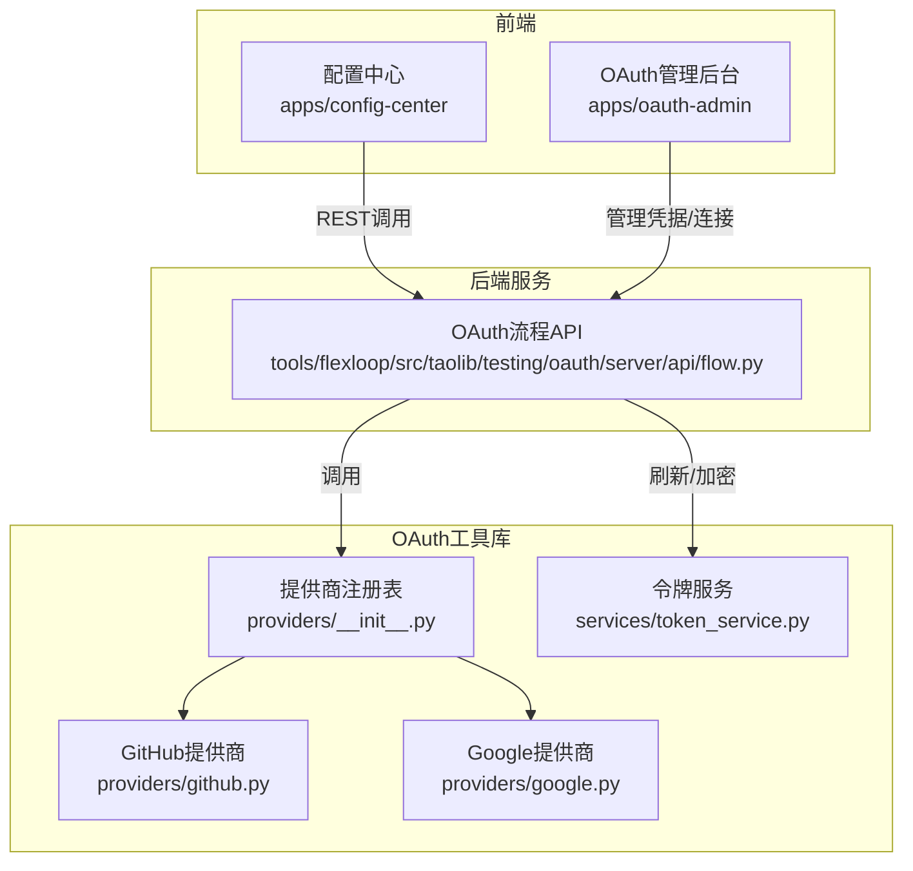
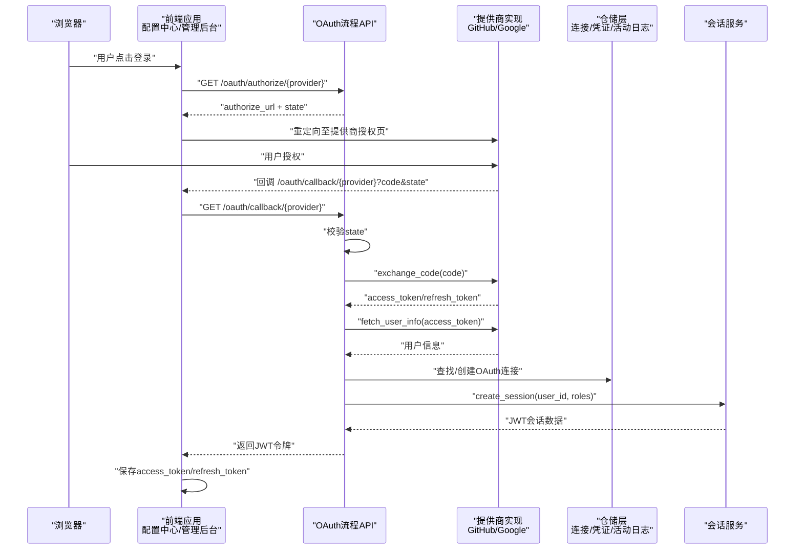
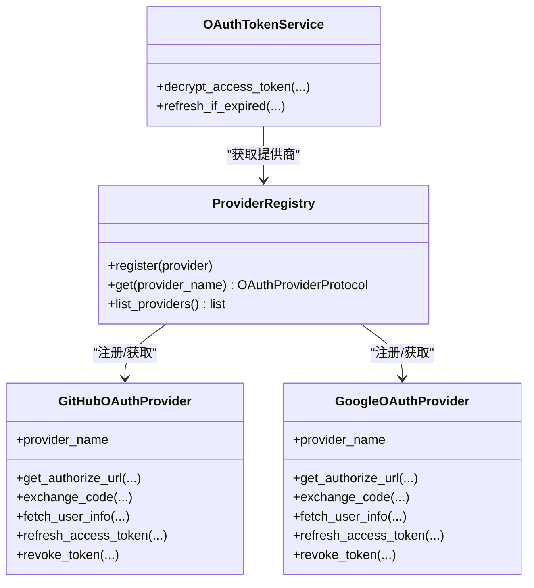
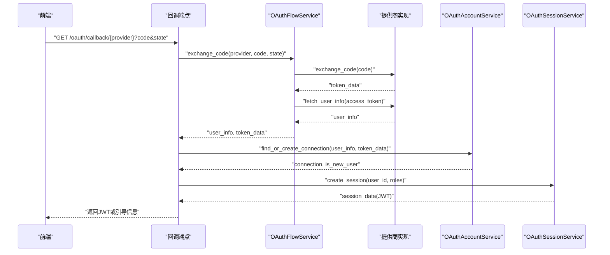
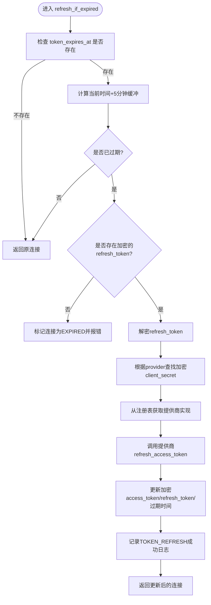
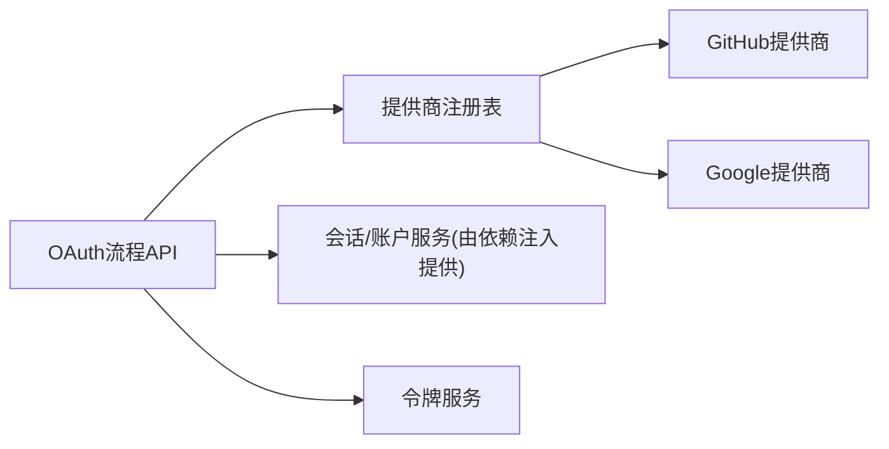

# 认证系统

<cite>
**本文引用的文件**
- [apps/oauth-admin/src/pages/ProvidersPage.tsx](file://apps/oauth-admin/src/pages/ProvidersPage.tsx)
- [apps/config-center/src/api/auth.ts](file://apps/config-center/src/api/auth.ts)
- [apps/config-center/src/store/authStore.ts](file://apps/config-center/src/store/authStore.ts)
- [tools/flexloop/src/taolib/testing/oauth/server/api/flow.py](file://tools/flexloop/src/taolib/testing/oauth/server/api/flow.py)
- [tools/flexloop/src/taolib/testing/oauth/providers/__init__.py](file://tools/flexloop/src/taolib/testing/oauth/providers/__init__.py)
- [tools/flexloop/src/taolib/testing/oauth/providers/github.py](file://tools/flexloop/src/taolib/testing/oauth/providers/github.py)
- [tools/flexloop/src/taolib/testing/oauth/providers/google.py](file://tools/flexloop/src/taolib/testing/oauth/providers/google.py)
- [tools/flexloop/src/taolib/testing/oauth/services/token_service.py](file://tools/flexloop/src/taolib/testing/oauth/services/token_service.py)
- [tools/flexloop/tests/testing/test_oauth/test_providers/test_providers.py](file://tools/flexloop/tests/testing/test_oauth/test_providers/test_providers.py)
- [tools/flexloop/tests/testing/test_oauth/test_repository/test_repos.py](file://tools/flexloop/tests/testing/test_oauth/test_repository/test_repos.py)
- [tools/flexloop/tests/testing/test_oauth/test_models.py](file://tools/flexloop/tests/testing/test_oauth/test_models.py)
</cite>

## 目录
1. [简介](#简介)
2. [项目结构](#项目结构)
3. [核心组件](#核心组件)
4. [架构总览](#架构总览)
5. [详细组件分析](#详细组件分析)
6. [依赖关系分析](#依赖关系分析)
7. [性能考量](#性能考量)
8. [故障排查指南](#故障排查指南)
9. [结论](#结论)
10. [附录](#附录)

## 简介
本文件面向DaoMind认证系统，围绕OAuth 2.0授权码流程、第三方提供商（GitHub、Google）集成、JWT会话令牌生成与验证、用户身份认证与会话管理、令牌刷新策略、以及认证中间件实现进行系统化技术说明。文档同时给出流程图、类图与序列图，帮助读者快速理解前后端协作方式，并提供配置项、安全最佳实践与错误处理策略，便于在实际工程中落地。

## 项目结构
DaoMind认证系统由三部分组成：
- 前端应用（配置中心与OAuth管理后台）：负责用户交互、令牌管理与状态持久化。
- 后端服务（FastAPI）：提供OAuth授权码流程、回调处理、会话创建与活动日志记录。
- OAuth工具库（Python）：封装GitHub与Google提供商协议、令牌刷新、加密存储与错误处理。

图表来源
- [apps/config-center/src/api/auth.ts:1-15](file://apps/config-center/src/api/auth.ts#L1-L15)
- [apps/oauth-admin/src/pages/ProvidersPage.tsx:1-293](file://apps/oauth-admin/src/pages/ProvidersPage.tsx#L1-L293)
- [tools/flexloop/src/taolib/testing/oauth/server/api/flow.py:1-305](file://tools/flexloop/src/taolib/testing/oauth/server/api/flow.py#L1-L305)
- [tools/flexloop/src/taolib/testing/oauth/providers/__init__.py:1-56](file://tools/flexloop/src/taolib/testing/oauth/providers/__init__.py#L1-L56)
- [tools/flexloop/src/taolib/testing/oauth/providers/github.py:1-205](file://tools/flexloop/src/taolib/testing/oauth/providers/github.py#L1-L205)
- [tools/flexloop/src/taolib/testing/oauth/providers/google.py:1-186](file://tools/flexloop/src/taolib/testing/oauth/providers/google.py#L1-L186)
- [tools/flexloop/src/taolib/testing/oauth/services/token_service.py:1-157](file://tools/flexloop/src/taolib/testing/oauth/services/token_service.py#L1-L157)

章节来源
- [apps/config-center/src/api/auth.ts:1-15](file://apps/config-center/src/api/auth.ts#L1-L15)
- [apps/oauth-admin/src/pages/ProvidersPage.tsx:1-293](file://apps/oauth-admin/src/pages/ProvidersPage.tsx#L1-L293)
- [tools/flexloop/src/taolib/testing/oauth/server/api/flow.py:1-305](file://tools/flexloop/src/taolib/testing/oauth/server/api/flow.py#L1-L305)
- [tools/flexloop/src/taolib/testing/oauth/providers/__init__.py:1-56](file://tools/flexloop/src/taolib/testing/oauth/providers/__init__.py#L1-L56)

## 核心组件
- OAuth流程API：提供生成授权URL、处理回调、创建会话等端点。
- 提供商注册表与具体提供商：封装GitHub与Google的授权URL生成、授权码交换、用户信息获取、令牌刷新与撤销。
- 令牌服务：负责令牌加密存储、到期检测与自动刷新、活动日志记录。
- 前端认证API与状态管理：负责登录、刷新令牌、拉取用户信息与本地状态持久化。

章节来源
- [tools/flexloop/src/taolib/testing/oauth/server/api/flow.py:1-305](file://tools/flexloop/src/taolib/testing/oauth/server/api/flow.py#L1-L305)
- [tools/flexloop/src/taolib/testing/oauth/providers/__init__.py:1-56](file://tools/flexloop/src/taolib/testing/oauth/providers/__init__.py#L1-L56)
- [tools/flexloop/src/taolib/testing/oauth/providers/github.py:1-205](file://tools/flexloop/src/taolib/testing/oauth/providers/github.py#L1-L205)
- [tools/flexloop/src/taolib/testing/oauth/providers/google.py:1-186](file://tools/flexloop/src/taolib/testing/oauth/providers/google.py#L1-L186)
- [tools/flexloop/src/taolib/testing/oauth/services/token_service.py:1-157](file://tools/flexloop/src/taolib/testing/oauth/services/token_service.py#L1-L157)
- [apps/config-center/src/api/auth.ts:1-15](file://apps/config-center/src/api/auth.ts#L1-L15)
- [apps/config-center/src/store/authStore.ts:1-108](file://apps/config-center/src/store/authStore.ts#L1-L108)

## 架构总览
下图展示了从浏览器到后端服务再到第三方OAuth提供商的整体流程，包括授权码交换、用户信息获取、连接建立与会话创建。

图表来源
- [tools/flexloop/src/taolib/testing/oauth/server/api/flow.py:51-305](file://tools/flexloop/src/taolib/testing/oauth/server/api/flow.py#L51-L305)
- [tools/flexloop/src/taolib/testing/oauth/providers/github.py:59-101](file://tools/flexloop/src/taolib/testing/oauth/providers/github.py#L59-L101)
- [tools/flexloop/src/taolib/testing/oauth/providers/google.py:58-95](file://tools/flexloop/src/taolib/testing/oauth/providers/google.py#L58-L95)
- [apps/config-center/src/api/auth.ts:1-15](file://apps/config-center/src/api/auth.ts#L1-L15)
- [apps/config-center/src/store/authStore.ts:1-108](file://apps/config-center/src/store/authStore.ts#L1-L108)

## 详细组件分析

### OAuth流程API（FastAPI）
- 功能职责
  - 生成授权URL并重定向或直接返回URL+state。
  - 处理回调，校验state，交换授权码，获取用户信息，建立或关联OAuth连接，创建会话并返回JWT。
- 关键端点
  - GET /oauth/authorize/{provider}：重定向到提供商授权页。
  - GET /oauth/authorize-url/{provider}：返回授权URL与state（用于SPA自行跳转）。
  - GET /oauth/callback/{provider}：处理回调，完成认证与会话创建。
- 安全要点
  - 必须校验state参数以防止CSRF攻击。
  - 对未配置提供商与OAuth错误进行明确的HTTP状态码反馈。

章节来源
- [tools/flexloop/src/taolib/testing/oauth/server/api/flow.py:51-305](file://tools/flexloop/src/taolib/testing/oauth/server/api/flow.py#L51-L305)

### 提供商注册表与实现
- 注册表
  - 维护提供商映射，支持动态注册与查询。
- GitHub提供商
  - 生成授权URL、交换授权码、获取用户信息、撤销令牌；不支持刷新。
- Google提供商
  - 生成授权URL（含offline access与consent prompt）、交换授权码、获取用户信息、刷新令牌、撤销令牌。
- 单元测试覆盖
  - 注册表查询、Google/ GitHub授权URL构造、错误路径断言。

章节来源
- [tools/flexloop/src/taolib/testing/oauth/providers/__init__.py:1-56](file://tools/flexloop/src/taolib/testing/oauth/providers/__init__.py#L1-L56)
- [tools/flexloop/src/taolib/testing/oauth/providers/github.py:1-205](file://tools/flexloop/src/taolib/testing/oauth/providers/github.py#L1-L205)
- [tools/flexloop/src/taolib/testing/oauth/providers/google.py:1-186](file://tools/flexloop/src/taolib/testing/oauth/providers/google.py#L1-L186)
- [tools/flexloop/tests/testing/test_oauth/test_providers/test_providers.py:1-96](file://tools/flexloop/tests/testing/test_oauth/test_providers/test_providers.py#L1-L96)

### 令牌服务与刷新策略
- 加密存储
  - Access/Refresh Token在仓储中以加密形式保存。
- 到期检测与刷新
  - 在Access Token到期前5分钟触发刷新；若无Refresh Token则标记为过期。
  - 刷新成功后更新加密令牌与过期时间，并记录活动日志。
- 错误处理
  - 不支持刷新的提供商、刷新失败、未知错误均记录日志并抛出统一异常类型。

章节来源
- [tools/flexloop/src/taolib/testing/oauth/services/token_service.py:1-157](file://tools/flexloop/src/taolib/testing/oauth/services/token_service.py#L1-L157)

### 前端认证API与状态管理
- 认证API
  - 登录、刷新令牌、获取当前用户信息。
- 状态管理（Zustand + 持久化）
  - 维护accessToken/refreshToken/isAuthenticated/user等状态。
  - 登录成功后拉取用户信息；刷新失败或无refreshToken时登出。
  - 仅持久化必要字段，避免敏感信息泄露。

章节来源
- [apps/config-center/src/api/auth.ts:1-15](file://apps/config-center/src/api/auth.ts#L1-L15)
- [apps/config-center/src/store/authStore.ts:1-108](file://apps/config-center/src/store/authStore.ts#L1-L108)

### OAuth管理后台（凭据管理）
- 功能
  - 列表展示、启用/禁用、删除、新增GitHub/Google凭据。
  - 支持设置显示名、Client ID/Secret、回调URI、允许的scopes。
- 安全建议
  - Client Secret需保密存储；回调URI需与后端配置一致；限制scopes最小化授权。

章节来源
- [apps/oauth-admin/src/pages/ProvidersPage.tsx:1-293](file://apps/oauth-admin/src/pages/ProvidersPage.tsx#L1-L293)

### 类关系图（代码级）

图表来源
- [tools/flexloop/src/taolib/testing/oauth/providers/__init__.py:15-56](file://tools/flexloop/src/taolib/testing/oauth/providers/__init__.py#L15-L56)
- [tools/flexloop/src/taolib/testing/oauth/providers/github.py:27-205](file://tools/flexloop/src/taolib/testing/oauth/providers/github.py#L27-L205)
- [tools/flexloop/src/taolib/testing/oauth/providers/google.py:23-186](file://tools/flexloop/src/taolib/testing/oauth/providers/google.py#L23-L186)
- [tools/flexloop/src/taolib/testing/oauth/services/token_service.py:25-157](file://tools/flexloop/src/taolib/testing/oauth/services/token_service.py#L25-L157)

### 回调处理序列图（代码级）

图表来源
- [tools/flexloop/src/taolib/testing/oauth/server/api/flow.py:236-287](file://tools/flexloop/src/taolib/testing/oauth/server/api/flow.py#L236-L287)
- [tools/flexloop/src/taolib/testing/oauth/providers/github.py:59-101](file://tools/flexloop/src/taolib/testing/oauth/providers/github.py#L59-L101)
- [tools/flexloop/src/taolib/testing/oauth/providers/google.py:58-95](file://tools/flexloop/src/taolib/testing/oauth/providers/google.py#L58-L95)

### 刷新令牌流程图（代码级）

图表来源
- [tools/flexloop/src/taolib/testing/oauth/services/token_service.py:63-157](file://tools/flexloop/src/taolib/testing/oauth/services/token_service.py#L63-L157)

## 依赖关系分析
- 组件耦合
  - OAuth流程API依赖提供商注册表与服务层；提供商实现彼此独立，通过统一协议对接。
  - 令牌服务依赖加密器、仓储与提供商注册表，职责清晰。
- 外部依赖
  - HTTP客户端用于与第三方提供商API通信。
  - FastAPI用于路由与依赖注入。
- 潜在循环依赖
  - 当前结构通过依赖注入避免循环导入；注册表集中管理提供商，降低耦合。

图表来源
- [tools/flexloop/src/taolib/testing/oauth/server/api/flow.py:1-305](file://tools/flexloop/src/taolib/testing/oauth/server/api/flow.py#L1-L305)
- [tools/flexloop/src/taolib/testing/oauth/providers/__init__.py:1-56](file://tools/flexloop/src/taolib/testing/oauth/providers/__init__.py#L1-L56)
- [tools/flexloop/src/taolib/testing/oauth/providers/github.py:1-205](file://tools/flexloop/src/taolib/testing/oauth/providers/github.py#L1-L205)
- [tools/flexloop/src/taolib/testing/oauth/providers/google.py:1-186](file://tools/flexloop/src/taolib/testing/oauth/providers/google.py#L1-L186)
- [tools/flexloop/src/taolib/testing/oauth/services/token_service.py:1-157](file://tools/flexloop/src/taolib/testing/oauth/services/token_service.py#L1-L157)

章节来源
- [tools/flexloop/src/taolib/testing/oauth/server/api/flow.py:1-305](file://tools/flexloop/src/taolib/testing/oauth/server/api/flow.py#L1-L305)
- [tools/flexloop/src/taolib/testing/oauth/providers/__init__.py:1-56](file://tools/flexloop/src/taolib/testing/oauth/providers/__init__.py#L1-L56)
- [tools/flexloop/src/taolib/testing/oauth/providers/github.py:1-205](file://tools/flexloop/src/taolib/testing/oauth/providers/github.py#L1-L205)
- [tools/flexloop/src/taolib/testing/oauth/providers/google.py:1-186](file://tools/flexloop/src/taolib/testing/oauth/providers/google.py#L1-L186)
- [tools/flexloop/src/taolib/testing/oauth/services/token_service.py:1-157](file://tools/flexloop/src/taolib/testing/oauth/services/token_service.py#L1-L157)

## 性能考量
- 异步HTTP请求：提供商交换与用户信息获取采用异步客户端，减少阻塞。
- 刷新缓冲：提前5分钟刷新，降低频繁刷新带来的抖动与第三方限流风险。
- 最小化日志与仓储写入：仅在关键节点记录活动日志，避免冗余IO。
- 前端状态持久化：仅持久化必要字段，缩短初始化耗时。

## 故障排查指南
- 常见错误与处理
  - State校验失败：检查前端state与后端state一致性，确保回调URL正确。
  - 凭证缺失：确认OAuth管理后台已配置对应提供商的Client ID/Secret与回调URI。
  - 刷新失败：检查Refresh Token是否可用、提供商是否支持刷新、网络连通性。
  - 第三方提供商错误：查看提供商返回的错误描述，必要时调整scopes或授权策略。
- 日志与监控
  - 活动日志记录包含动作、状态、提供商、用户ID、连接ID与错误详情，便于定位问题。
- 单元测试参考
  - 提供商URL构造与错误路径的测试用例可作为行为基线。

章节来源
- [tools/flexloop/src/taolib/testing/oauth/server/api/flow.py:288-302](file://tools/flexloop/src/taolib/testing/oauth/server/api/flow.py#L288-L302)
- [tools/flexloop/src/taolib/testing/oauth/services/token_service.py:146-154](file://tools/flexloop/src/taolib/testing/oauth/services/token_service.py#L146-L154)
- [tools/flexloop/tests/testing/test_oauth/test_providers/test_providers.py:1-96](file://tools/flexloop/tests/testing/test_oauth/test_providers/test_providers.py#L1-L96)
- [tools/flexloop/tests/testing/test_oauth/test_repository/test_repos.py:35-73](file://tools/flexloop/tests/testing/test_oauth/test_repository/test_repos.py#L35-L73)
- [tools/flexloop/tests/testing/test_oauth/test_models.py:144-176](file://tools/flexloop/tests/testing/test_oauth/test_models.py#L144-L176)

## 结论
DaoMind认证系统基于标准OAuth 2.0授权码流程，结合GitHub与Google两大主流提供商，实现了从授权、回调、用户信息获取到会话创建与令牌管理的完整闭环。通过提供商注册表与统一协议抽象，系统具备良好的扩展性；借助令牌服务的加密存储与自动刷新机制，提升了安全性与可用性。前端通过Zustand实现轻量状态管理，配合OAuth管理后台完成凭据与连接治理，整体架构清晰、职责分明、易于维护与演进。

## 附录

### OAuth授权码流程与PKCE说明
- 授权码流程
  - 前端向后端申请授权URL与state，重定向至提供商授权页。
  - 用户授权后回调至后端，后端校验state并交换授权码为令牌。
  - 获取用户信息，建立或关联OAuth连接，创建会话并返回JWT。
- PKCE增强
  - 若需要更强的安全性，可在生成授权URL时加入code_challenge与code_verifier，并在交换授权码时携带code_verifier。该模式已在GitHub/Google提供商实现中预留参数位置，可根据需要启用。

章节来源
- [tools/flexloop/src/taolib/testing/oauth/server/api/flow.py:29-48](file://tools/flexloop/src/taolib/testing/oauth/server/api/flow.py#L29-L48)
- [tools/flexloop/src/taolib/testing/oauth/providers/github.py:32-57](file://tools/flexloop/src/taolib/testing/oauth/providers/github.py#L32-L57)
- [tools/flexloop/src/taolib/testing/oauth/providers/google.py:28-56](file://tools/flexloop/src/taolib/testing/oauth/providers/google.py#L28-L56)

### JWT令牌生成与验证机制
- 生成
  - 会话服务在成功建立OAuth连接后创建会话，返回包含JWT的会话数据。
- 验证
  - 前端在后续请求中携带JWT；后端通过中间件解析与校验（中间件实现位于会话服务相关依赖中）。
- 刷新
  - 前端使用refresh_token调用刷新接口，后端在令牌服务中执行刷新逻辑并返回新的JWT。

章节来源
- [tools/flexloop/src/taolib/testing/oauth/server/api/flow.py:273-286](file://tools/flexloop/src/taolib/testing/oauth/server/api/flow.py#L273-L286)
- [apps/config-center/src/api/auth.ts:8-10](file://apps/config-center/src/api/auth.ts#L8-L10)
- [apps/config-center/src/store/authStore.ts:57-73](file://apps/config-center/src/store/authStore.ts#L57-L73)

### 认证中间件实现
- 中间件职责
  - 解析请求中的JWT，校验有效性与有效期；为受保护路由注入用户上下文。
- 集成方式
  - 在FastAPI应用中注册中间件，对特定路由或全局生效；与会话服务协同工作。
- 注意事项
  - 保持中间件与会话服务的一致性，确保令牌格式与签发方匹配。

（本节为概念性说明，未直接分析具体文件）

### 配置选项与最佳实践
- 配置项
  - OAuth管理后台：提供商类型、Client ID/Secret、回调URI、允许的scopes、启用状态。
  - 会话：TTL小时数、刷新缓冲时间、加密算法与密钥管理。
- 安全最佳实践
  - 使用HTTPS与安全Cookie；严格校验state；最小化授权scopes；定期轮换Client Secret；限制回调URI白名单。
  - 对敏感操作增加二次验证；审计日志保留足够信息以便追溯。

章节来源
- [apps/oauth-admin/src/pages/ProvidersPage.tsx:216-287](file://apps/oauth-admin/src/pages/ProvidersPage.tsx#L216-L287)
- [tools/flexloop/src/taolib/testing/oauth/server/api/flow.py:28-48](file://tools/flexloop/src/taolib/testing/oauth/server/api/flow.py#L28-L48)
- [tools/flexloop/src/taolib/testing/oauth/services/token_service.py:22-22](file://tools/flexloop/src/taolib/testing/oauth/services/token_service.py#L22-L22)

### 实际代码示例（路径指引）
- 前端登录与刷新
  - 登录：[apps/config-center/src/api/auth.ts:4-6](file://apps/config-center/src/api/auth.ts#L4-L6)
  - 刷新：[apps/config-center/src/api/auth.ts:8-10](file://apps/config-center/src/api/auth.ts#L8-L10)
  - 状态管理：[apps/config-center/src/store/authStore.ts:29-73](file://apps/config-center/src/store/authStore.ts#L29-L73)
- 后端授权与回调
  - 授权URL：[tools/flexloop/src/taolib/testing/oauth/server/api/flow.py:157-168](file://tools/flexloop/src/taolib/testing/oauth/server/api/flow.py#L157-L168)
  - 回调处理：[tools/flexloop/src/taolib/testing/oauth/server/api/flow.py:236-287](file://tools/flexloop/src/taolib/testing/oauth/server/api/flow.py#L236-L287)
- 提供商实现
  - GitHub授权URL与交换：[tools/flexloop/src/taolib/testing/oauth/providers/github.py:32-101](file://tools/flexloop/src/taolib/testing/oauth/providers/github.py#L32-L101)
  - Google授权URL与交换：[tools/flexloop/src/taolib/testing/oauth/providers/google.py:28-95](file://tools/flexloop/src/taolib/testing/oauth/providers/google.py#L28-L95)
- 令牌刷新
  - 刷新策略与日志：[tools/flexloop/src/taolib/testing/oauth/services/token_service.py:63-157](file://tools/flexloop/src/taolib/testing/oauth/services/token_service.py#L63-L157)