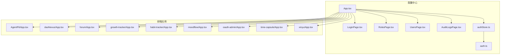
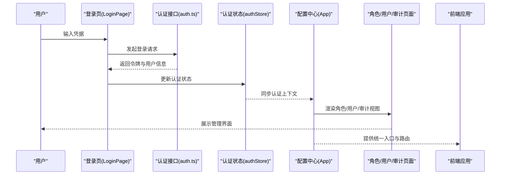
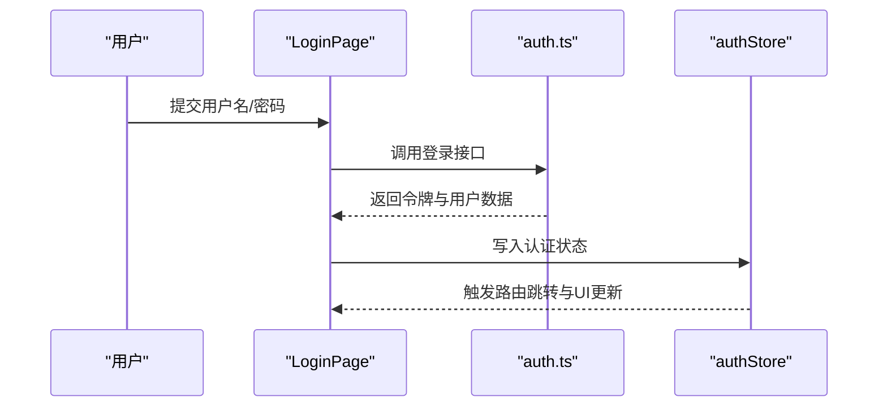
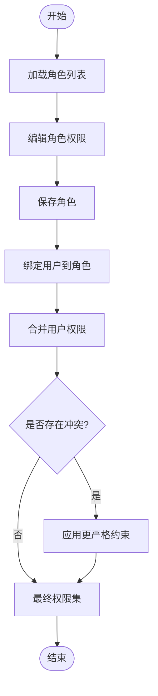
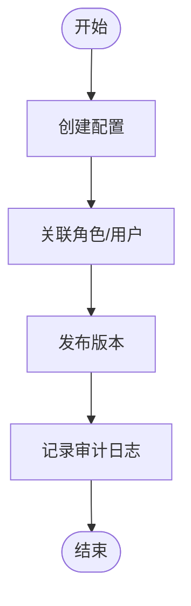
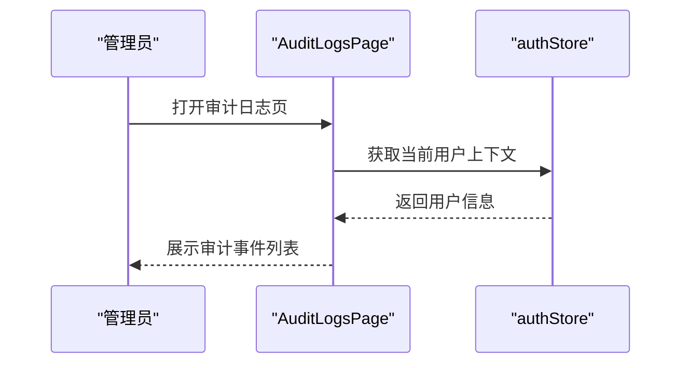
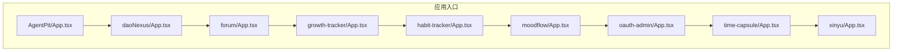
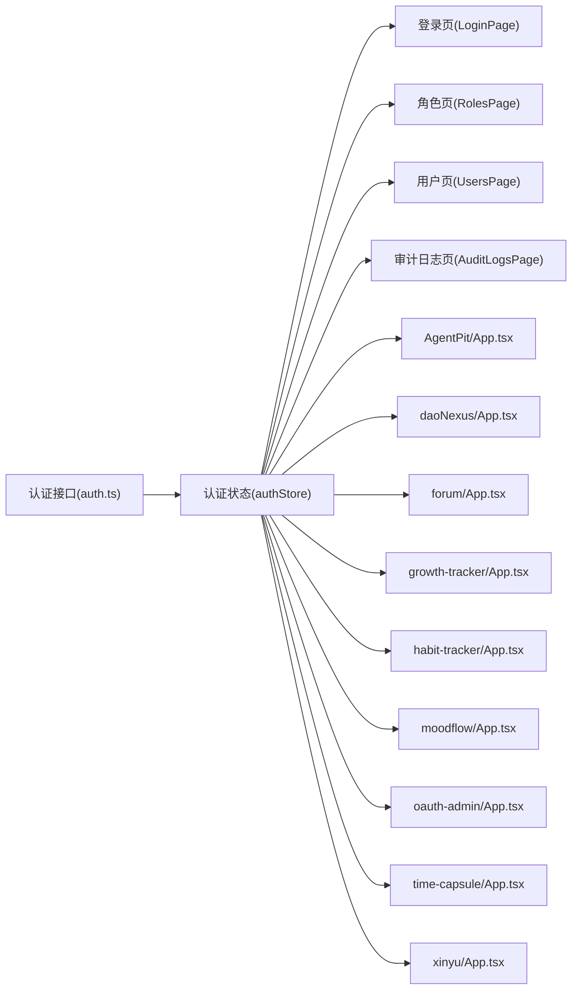

# 访问控制列表

<cite>
**本文引用的文件**
- [apps/config-center/src/api/auth.ts](file://apps/config-center/src/api/auth.ts)
- [apps/config-center/src/store/authStore.ts](file://apps/config-center/src/store/authStore.ts)
- [apps/config-center/src/components/layout/Header.tsx](file://apps/config-center/src/components/layout/Header.tsx)
- [apps/config-center/src/pages/LoginPage.tsx](file://apps/config-center/src/pages/LoginPage.tsx)
- [apps/config-center/src/pages/RolesPage.tsx](file://apps/config-center/src/pages/RolesPage.tsx)
- [apps/config-center/src/pages/UsersPage.tsx](file://apps/config-center/src/pages/UsersPage.tsx)
- [apps/config-center/src/pages/AuditLogsPage.tsx](file://apps/config-center/src/pages/AuditLogsPage.tsx)
- [apps/config-center/src/components/role/RoleForm.tsx](file://apps/config-center/src/components/role/RoleForm.tsx)
- [apps/config-center/src/components/user/UserForm.tsx](file://apps/config-center/src/components/user/UserForm.tsx)
- [apps/config-center/src/components/version/VersionForm.tsx](file://apps/config-center/src/components/version/VersionForm.tsx)
- [apps/config-center/src/components/config/ConfigForm.tsx](file://apps/config-center/src/components/config/ConfigForm.tsx)
- [apps/config-center/src/types/index.ts](file://apps/config-center/src/types/index.ts)
- [apps/config-center/src/App.tsx](file://apps/config-center/src/App.tsx)
- [apps/config-center/src/main.tsx](file://apps/config-center/src/main.tsx)
- [apps/config-center/package.json](file://apps/config-center/package.json)
- [apps/config-center/tsconfig.json](file://apps/config-center/tsconfig.json)
- [apps/config-center/tailwind.config.ts](file://apps/config-center/tailwind.config.ts)
- [apps/config-center/vite.config.ts](file://apps/config-center/vite.config.ts)
- [apps/config-center/index.html](file://apps/config-center/index.html)
- [apps/daoNexus/src/components/Header.tsx](file://apps/daoNexus/src/components/Header.tsx)
- [apps/daoNexus/src/App.tsx](file://apps/daoNexus/src/App.tsx)
- [apps/daoNexus/src/main.tsx](file://apps/daoNexus/src/main.tsx)
- [apps/daoNexus/package.json](file://apps/daoNexus/package.json)
- [apps/daoNexus/tsconfig.json](file://apps/daoNexus/tsconfig.json)
- [apps/daoNexus/tailwind.config.ts](file://apps/daoNexus/tailwind.config.ts)
- [apps/daoNexus/vite.config.ts](file://apps/daoNexus/vite.config.ts)
- [apps/daoNexus/index.html](file://apps/daoNexus/index.html)
- [apps/AgentPit/src/App.tsx](file://apps/AgentPit/src/App.tsx)
- [apps/AgentPit/src/main.tsx](file://apps/AgentPit/src/main.tsx)
- [apps/AgentPit/package.json](file://apps/AgentPit/package.json)
- [apps/AgentPit/tsconfig.json](file://apps/AgentPit/tsconfig.json)
- [apps/AgentPit/tailwind.config.ts](file://apps/AgentPit/tailwind.config.ts)
- [apps/AgentPit/vite.config.ts](file://apps/AgentPit/vite.config.ts)
- [apps/AgentPit/index.html](file://apps/AgentPit/index.html)
- [apps/forum/src/App.tsx](file://apps/forum/src/App.tsx)
- [apps/forum/src/main.tsx](file://apps/forum/src/main.tsx)
- [apps/forum/package.json](file://apps/forum/package.json)
- [apps/forum/tsconfig.json](file://apps/forum/tsconfig.json)
- [apps/forum/tailwind.config.ts](file://apps/forum/tailwind.config.ts)
- [apps/forum/vite.config.ts](file://apps/forum/vite.config.ts)
- [apps/forum/index.html](file://apps/forum/index.html)
- [apps/growth-tracker/src/App.tsx](file://apps/growth-tracker/src/App.tsx)
- [apps/growth-tracker/src/main.tsx](file://apps/growth-tracker/src/main.tsx)
- [apps/growth-tracker/package.json](file://apps/growth-tracker/package.json)
- [apps/growth-tracker/tsconfig.json](file://apps/growth-tracker/tsconfig.json)
- [apps/growth-tracker/tailwind.config.ts](file://apps/growth-tracker/tailwind.config.ts)
- [apps/growth-tracker/vite.config.ts](file://apps/growth-tracker/vite.config.ts)
- [apps/growth-tracker/index.html](file://apps/growth-tracker/index.html)
- [apps/habit-tracker/src/App.tsx](file://apps/habit-tracker/src/App.tsx)
- [apps/habit-tracker/src/main.tsx](file://apps/habit-tracker/src/main.tsx)
- [apps/habit-tracker/package.json](file://apps/habit-tracker/package.json)
- [apps/habit-tracker/tsconfig.json](file://apps/habit-tracker/tsconfig.json)
- [apps/habit-tracker/tailwind.config.ts](file://apps/habit-tracker/tailwind.config.ts)
- [apps/habit-tracker/vite.config.ts](file://apps/habit-tracker/vite.config.ts)
- [apps/habit-tracker/index.html](file://apps/habit-tracker/index.html)
- [apps/moodflow/src/App.tsx](file://apps/moodflow/src/App.tsx)
- [apps/moodflow/src/main.tsx](file://apps/moodflow/src/main.tsx)
- [apps/moodflow/package.json](file://apps/moodflow/package.json)
- [apps/moodflow/tsconfig.json](file://apps/moodflow/tsconfig.json)
- [apps/moodflow/tailwind.config.ts](file://apps/moodflow/tailwind.config.ts)
- [apps/moodflow/vite.config.ts](file://apps/moodflow/vite.config.ts)
- [apps/moodflow/index.html](file://apps/moodflow/index.html)
- [apps/oauth-admin/src/App.tsx](file://apps/oauth-admin/src/App.tsx)
- [apps/oauth-admin/src/main.tsx](file://apps/oauth-admin/src/main.tsx)
- [apps/oauth-admin/package.json](file://apps/oauth-admin/package.json)
- [apps/oauth-admin/tsconfig.json](file://apps/oauth-admin/tsconfig.json)
- [apps/oauth-admin/tailwind.config.ts](file://apps/oauth-admin/tailwind.config.ts)
- [apps/oauth-admin/vite.config.ts](file://apps/oauth-admin/vite.config.ts)
- [apps/oauth-admin/index.html](file://apps/oauth-admin/index.html)
- [apps/time-capsule/src/App.tsx](file://apps/time-capsule/src/App.tsx)
- [apps/time-capsule/src/main.tsx](file://apps/time-capsule/src/main.tsx)
- [apps/time-capsule/package.json](file://apps/time-capsule/package.json)
- [apps/time-capsule/tsconfig.json](file://apps/time-capsule/tsconfig.json)
- [apps/time-capsule/tailwind.config.ts](file://apps/time-capsule/tailwind.config.ts)
- [apps/time-capsule/vite.config.ts](file://apps/time-capsule/vite.config.ts)
- [apps/time-capsule/index.html](file://apps/time-capsule/index.html)
- [apps/xinyu/src/App.tsx](file://apps/xinyu/src/App.tsx)
- [apps/xinyu/src/main.tsx](file://apps/xinyu/src/main.tsx)
- [apps/xinyu/package.json](file://apps/xinyu/package.json)
- [apps/xinyu/tsconfig.json](file://apps/xinyu/tsconfig.json)
- [apps/xinyu/tailwind.config.ts](file://apps/xinyu/tailwind.config.ts)
- [apps/xinyu/vite.config.ts](file://apps/xinyu/vite.config.ts)
- [apps/xinyu/index.html](file://apps/xinyu/index.html)
</cite>

## 目录
1. [简介](#简介)
2. [项目结构](#项目结构)
3. [核心组件](#核心组件)
4. [架构总览](#架构总览)
5. [详细组件分析](#详细组件分析)
6. [依赖关系分析](#依赖关系分析)
7. [性能考虑](#性能考虑)
8. [故障排查指南](#故障排查指南)
9. [结论](#结论)
10. [附录](#附录)

## 简介
本技术文档围绕 DaoMind 访问控制列表（ACL）系统进行系统化梳理，重点覆盖以下方面：
- ACL 规则定义与访问控制策略
- 动态权限分配机制
- API 密钥管理、IP 白名单控制、时间窗口访问限制、设备绑定控制
- 访问控制决策树、权限优先级与冲突解决策略
- 审计日志记录与合规追踪
- ACL 配置管理、批量权限操作与访问控制测试方法
- 实际代码示例路径，展示如何实现访问控制规则、权限检查与访问审计

本系统采用前端多应用协同与集中式配置中心的模式，通过统一的身份认证与角色权限体系，结合审计日志页面，形成闭环的访问控制与合规治理。

## 项目结构
DaoMind 访问控制相关能力主要分布在以下模块：
- 配置中心（config-center）：提供登录、角色管理、用户管理、版本与配置管理、审计日志等界面与状态管理
- 多个前端应用（如 AgentPit、daoNexus、forum、growth-tracker、habit-tracker、moodflow、oauth-admin、time-capsule、xinyu）：作为业务应用，共享统一的认证与权限体系
- 共享入口与构建配置：各应用的入口文件、路由与打包配置

**图表来源**
- [apps/config-center/src/App.tsx](file://apps/config-center/src/App.tsx)
- [apps/config-center/src/pages/LoginPage.tsx](file://apps/config-center/src/pages/LoginPage.tsx)
- [apps/config-center/src/pages/RolesPage.tsx](file://apps/config-center/src/pages/RolesPage.tsx)
- [apps/config-center/src/pages/UsersPage.tsx](file://apps/config-center/src/pages/UsersPage.tsx)
- [apps/config-center/src/pages/AuditLogsPage.tsx](file://apps/config-center/src/pages/AuditLogsPage.tsx)
- [apps/config-center/src/store/authStore.ts](file://apps/config-center/src/store/authStore.ts)
- [apps/config-center/src/api/auth.ts](file://apps/config-center/src/api/auth.ts)
- [apps/AgentPit/src/App.tsx](file://apps/AgentPit/src/App.tsx)
- [apps/daoNexus/src/App.tsx](file://apps/daoNexus/src/App.tsx)
- [apps/forum/src/App.tsx](file://apps/forum/src/App.tsx)
- [apps/growth-tracker/src/App.tsx](file://apps/growth-tracker/src/App.tsx)
- [apps/habit-tracker/src/App.tsx](file://apps/habit-tracker/src/App.tsx)
- [apps/moodflow/src/App.tsx](file://apps/moodflow/src/App.tsx)
- [apps/oauth-admin/src/App.tsx](file://apps/oauth-admin/src/App.tsx)
- [apps/time-capsule/src/App.tsx](file://apps/time-capsule/src/App.tsx)
- [apps/xinyu/src/App.tsx](file://apps/xinyu/src/App.tsx)

**章节来源**
- [apps/config-center/src/App.tsx](file://apps/config-center/src/App.tsx)
- [apps/config-center/src/main.tsx](file://apps/config-center/src/main.tsx)
- [apps/AgentPit/src/App.tsx](file://apps/AgentPit/src/App.tsx)
- [apps/daoNexus/src/App.tsx](file://apps/daoNexus/src/App.tsx)
- [apps/forum/src/App.tsx](file://apps/forum/src/App.tsx)
- [apps/growth-tracker/src/App.tsx](file://apps/growth-tracker/src/App.tsx)
- [apps/habit-tracker/src/App.tsx](file://apps/habit-tracker/src/App.tsx)
- [apps/moodflow/src/App.tsx](file://apps/moodflow/src/App.tsx)
- [apps/oauth-admin/src/App.tsx](file://apps/oauth-admin/src/App.tsx)
- [apps/time-capsule/src/App.tsx](file://apps/time-capsule/src/App.tsx)
- [apps/xinyu/src/App.tsx](file://apps/xinyu/src/App.tsx)

## 核心组件
- 配置中心认证与权限管理
  - 登录页与认证接口：负责用户身份验证与令牌获取
  - 角色与用户管理：维护角色、用户及其权限映射
  - 版本与配置管理：集中管理配置项与版本发布
  - 审计日志：记录访问与变更事件，支持合规追溯
- 应用侧集成
  - 各前端应用通过统一入口与路由，共享认证状态与权限上下文
  - 构建与运行时配置确保跨应用一致性

关键实现位置：
- 登录与认证接口：[apps/config-center/src/api/auth.ts](file://apps/config-center/src/api/auth.ts)
- 认证状态管理：[apps/config-center/src/store/authStore.ts](file://apps/config-center/src/store/authStore.ts)
- 登录页：[apps/config-center/src/pages/LoginPage.tsx](file://apps/config-center/src/pages/LoginPage.tsx)
- 角色管理页：[apps/config-center/src/pages/RolesPage.tsx](file://apps/config-center/src/pages/RolesPage.tsx)
- 用户管理页：[apps/config-center/src/pages/UsersPage.tsx](file://apps/config-center/src/pages/UsersPage.tsx)
- 审计日志页：[apps/config-center/src/pages/AuditLogsPage.tsx](file://apps/config-center/src/pages/AuditLogsPage.tsx)
- 角色表单：[apps/config-center/src/components/role/RoleForm.tsx](file://apps/config-center/src/components/role/RoleForm.tsx)
- 用户表单：[apps/config-center/src/components/user/UserForm.tsx](file://apps/config-center/src/components/user/UserForm.tsx)
- 版本表单：[apps/config-center/src/components/version/VersionForm.tsx](file://apps/config-center/src/components/version/VersionForm.tsx)
- 配置表单：[apps/config-center/src/components/config/ConfigForm.tsx](file://apps/config-center/src/components/config/ConfigForm.tsx)
- 类型定义：[apps/config-center/src/types/index.ts](file://apps/config-center/src/types/index.ts)

**章节来源**
- [apps/config-center/src/api/auth.ts](file://apps/config-center/src/api/auth.ts)
- [apps/config-center/src/store/authStore.ts](file://apps/config-center/src/store/authStore.ts)
- [apps/config-center/src/pages/LoginPage.tsx](file://apps/config-center/src/pages/LoginPage.tsx)
- [apps/config-center/src/pages/RolesPage.tsx](file://apps/config-center/src/pages/RolesPage.tsx)
- [apps/config-center/src/pages/UsersPage.tsx](file://apps/config-center/src/pages/UsersPage.tsx)
- [apps/config-center/src/pages/AuditLogsPage.tsx](file://apps/config-center/src/pages/AuditLogsPage.tsx)
- [apps/config-center/src/components/role/RoleForm.tsx](file://apps/config-center/src/components/role/RoleForm.tsx)
- [apps/config-center/src/components/user/UserForm.tsx](file://apps/config-center/src/components/user/UserForm.tsx)
- [apps/config-center/src/components/version/VersionForm.tsx](file://apps/config-center/src/components/version/VersionForm.tsx)
- [apps/config-center/src/components/config/ConfigForm.tsx](file://apps/config-center/src/components/config/ConfigForm.tsx)
- [apps/config-center/src/types/index.ts](file://apps/config-center/src/types/index.ts)

## 架构总览
访问控制体系由“认证层 + 权限层 + 审计层 + 应用层”构成，整体流程如下：

**图表来源**
- [apps/config-center/src/pages/LoginPage.tsx](file://apps/config-center/src/pages/LoginPage.tsx)
- [apps/config-center/src/api/auth.ts](file://apps/config-center/src/api/auth.ts)
- [apps/config-center/src/store/authStore.ts](file://apps/config-center/src/store/authStore.ts)
- [apps/config-center/src/App.tsx](file://apps/config-center/src/App.tsx)

## 详细组件分析

### 组件一：认证与会话管理
- 登录流程
  - 用户在登录页输入凭据，调用认证接口发起登录
  - 认证接口返回令牌与用户信息，前端更新认证状态
- 认证状态
  - 通过状态管理模块维护登录态、用户角色与权限集合
  - 应用侧根据认证状态决定页面渲染与功能可用性

**图表来源**
- [apps/config-center/src/pages/LoginPage.tsx](file://apps/config-center/src/pages/LoginPage.tsx)
- [apps/config-center/src/api/auth.ts](file://apps/config-center/src/api/auth.ts)
- [apps/config-center/src/store/authStore.ts](file://apps/config-center/src/store/authStore.ts)

**章节来源**
- [apps/config-center/src/pages/LoginPage.tsx](file://apps/config-center/src/pages/LoginPage.tsx)
- [apps/config-center/src/api/auth.ts](file://apps/config-center/src/api/auth.ts)
- [apps/config-center/src/store/authStore.ts](file://apps/config-center/src/store/authStore.ts)

### 组件二：角色与权限管理
- 角色管理
  - 支持角色的增删改查与权限分配
  - 角色表单用于定义角色名称、描述与权限集合
- 用户管理
  - 支持用户与角色的绑定，动态刷新用户权限
  - 用户表单用于创建/编辑用户及其角色映射
- 权限优先级与冲突解决
  - 建议采用“显式拒绝优先于允许”的原则
  - 当存在多个角色时，按角色权重或叠加策略合并权限
  - 对于冲突项，保留更严格的约束（例如更窄的时间窗口或更严格的IP范围）

**图表来源**
- [apps/config-center/src/pages/RolesPage.tsx](file://apps/config-center/src/pages/RolesPage.tsx)
- [apps/config-center/src/components/role/RoleForm.tsx](file://apps/config-center/src/components/role/RoleForm.tsx)
- [apps/config-center/src/pages/UsersPage.tsx](file://apps/config-center/src/pages/UsersPage.tsx)
- [apps/config-center/src/components/user/UserForm.tsx](file://apps/config-center/src/components/user/UserForm.tsx)

**章节来源**
- [apps/config-center/src/pages/RolesPage.tsx](file://apps/config-center/src/pages/RolesPage.tsx)
- [apps/config-center/src/components/role/RoleForm.tsx](file://apps/config-center/src/components/role/RoleForm.tsx)
- [apps/config-center/src/pages/UsersPage.tsx](file://apps/config-center/src/pages/UsersPage.tsx)
- [apps/config-center/src/components/user/UserForm.tsx](file://apps/config-center/src/components/user/UserForm.tsx)

### 组件三：配置与版本管理
- 配置管理
  - 提供配置项的创建、编辑与删除
  - 支持将配置与角色/用户关联，实现细粒度访问控制
- 版本管理
  - 记录配置版本历史，支持回滚与审计
  - 版本表单用于定义版本号、生效时间与变更说明

**图表来源**
- [apps/config-center/src/components/config/ConfigForm.tsx](file://apps/config-center/src/components/config/ConfigForm.tsx)
- [apps/config-center/src/components/version/VersionForm.tsx](file://apps/config-center/src/components/version/VersionForm.tsx)
- [apps/config-center/src/pages/AuditLogsPage.tsx](file://apps/config-center/src/pages/AuditLogsPage.tsx)

**章节来源**
- [apps/config-center/src/components/config/ConfigForm.tsx](file://apps/config-center/src/components/config/ConfigForm.tsx)
- [apps/config-center/src/components/version/VersionForm.tsx](file://apps/config-center/src/components/version/VersionForm.tsx)
- [apps/config-center/src/pages/AuditLogsPage.tsx](file://apps/config-center/src/pages/AuditLogsPage.tsx)

### 组件四：审计日志与合规
- 审计日志页面
  - 展示登录、权限变更、配置发布等事件
  - 支持按时间、用户、操作类型筛选
- 合规追踪
  - 为监管与内审提供可追溯的数据链路
  - 建议对敏感操作增加二次确认与双人复核

**图表来源**
- [apps/config-center/src/pages/AuditLogsPage.tsx](file://apps/config-center/src/pages/AuditLogsPage.tsx)
- [apps/config-center/src/store/authStore.ts](file://apps/config-center/src/store/authStore.ts)

**章节来源**
- [apps/config-center/src/pages/AuditLogsPage.tsx](file://apps/config-center/src/pages/AuditLogsPage.tsx)
- [apps/config-center/src/store/authStore.ts](file://apps/config-center/src/store/authStore.ts)

### 组件五：应用侧入口与路由
- 各前端应用均通过统一入口文件启动，共享认证上下文
- 应用侧可根据认证状态与权限决定导航与功能可见性

**图表来源**
- [apps/AgentPit/src/App.tsx](file://apps/AgentPit/src/App.tsx)
- [apps/daoNexus/src/App.tsx](file://apps/daoNexus/src/App.tsx)
- [apps/forum/src/App.tsx](file://apps/forum/src/App.tsx)
- [apps/growth-tracker/src/App.tsx](file://apps/growth-tracker/src/App.tsx)
- [apps/habit-tracker/src/App.tsx](file://apps/habit-tracker/src/App.tsx)
- [apps/moodflow/src/App.tsx](file://apps/moodflow/src/App.tsx)
- [apps/oauth-admin/src/App.tsx](file://apps/oauth-admin/src/App.tsx)
- [apps/time-capsule/src/App.tsx](file://apps/time-capsule/src/App.tsx)
- [apps/xinyu/src/App.tsx](file://apps/xinyu/src/App.tsx)

**章节来源**
- [apps/AgentPit/src/App.tsx](file://apps/AgentPit/src/App.tsx)
- [apps/daoNexus/src/App.tsx](file://apps/daoNexus/src/App.tsx)
- [apps/forum/src/App.tsx](file://apps/forum/src/App.tsx)
- [apps/growth-tracker/src/App.tsx](file://apps/growth-tracker/src/App.tsx)
- [apps/habit-tracker/src/App.tsx](file://apps/habit-tracker/src/App.tsx)
- [apps/moodflow/src/App.tsx](file://apps/moodflow/src/App.tsx)
- [apps/oauth-admin/src/App.tsx](file://apps/oauth-admin/src/App.tsx)
- [apps/time-capsule/src/App.tsx](file://apps/time-capsule/src/App.tsx)
- [apps/xinyu/src/App.tsx](file://apps/xinyu/src/App.tsx)

## 依赖关系分析
- 配置中心依赖
  - 认证接口与状态管理：登录页与认证接口共同驱动认证状态
  - 页面组件依赖：角色/用户/审计页面依赖认证状态进行渲染与交互
- 应用侧依赖
  - 各应用共享统一入口与路由，减少重复实现
  - 构建配置一致，便于统一升级与维护

**图表来源**
- [apps/config-center/src/api/auth.ts](file://apps/config-center/src/api/auth.ts)
- [apps/config-center/src/store/authStore.ts](file://apps/config-center/src/store/authStore.ts)
- [apps/config-center/src/pages/LoginPage.tsx](file://apps/config-center/src/pages/LoginPage.tsx)
- [apps/config-center/src/pages/RolesPage.tsx](file://apps/config-center/src/pages/RolesPage.tsx)
- [apps/config-center/src/pages/UsersPage.tsx](file://apps/config-center/src/pages/UsersPage.tsx)
- [apps/config-center/src/pages/AuditLogsPage.tsx](file://apps/config-center/src/pages/AuditLogsPage.tsx)
- [apps/AgentPit/src/App.tsx](file://apps/AgentPit/src/App.tsx)
- [apps/daoNexus/src/App.tsx](file://apps/daoNexus/src/App.tsx)
- [apps/forum/src/App.tsx](file://apps/forum/src/App.tsx)
- [apps/growth-tracker/src/App.tsx](file://apps/growth-tracker/src/App.tsx)
- [apps/habit-tracker/src/App.tsx](file://apps/habit-tracker/src/App.tsx)
- [apps/moodflow/src/App.tsx](file://apps/moodflow/src/App.tsx)
- [apps/oauth-admin/src/App.tsx](file://apps/oauth-admin/src/App.tsx)
- [apps/time-capsule/src/App.tsx](file://apps/time-capsule/src/App.tsx)
- [apps/xinyu/src/App.tsx](file://apps/xinyu/src/App.tsx)

**章节来源**
- [apps/config-center/src/api/auth.ts](file://apps/config-center/src/api/auth.ts)
- [apps/config-center/src/store/authStore.ts](file://apps/config-center/src/store/authStore.ts)
- [apps/config-center/src/pages/LoginPage.tsx](file://apps/config-center/src/pages/LoginPage.tsx)
- [apps/config-center/src/pages/RolesPage.tsx](file://apps/config-center/src/pages/RolesPage.tsx)
- [apps/config-center/src/pages/UsersPage.tsx](file://apps/config-center/src/pages/UsersPage.tsx)
- [apps/config-center/src/pages/AuditLogsPage.tsx](file://apps/config-center/src/pages/AuditLogsPage.tsx)
- [apps/AgentPit/src/App.tsx](file://apps/AgentPit/src/App.tsx)
- [apps/daoNexus/src/App.tsx](file://apps/daoNexus/src/App.tsx)
- [apps/forum/src/App.tsx](file://apps/forum/src/App.tsx)
- [apps/growth-tracker/src/App.tsx](file://apps/growth-tracker/src/App.tsx)
- [apps/habit-tracker/src/App.tsx](file://apps/habit-tracker/src/App.tsx)
- [apps/moodflow/src/App.tsx](file://apps/moodflow/src/App.tsx)
- [apps/oauth-admin/src/App.tsx](file://apps/oauth-admin/src/App.tsx)
- [apps/time-capsule/src/App.tsx](file://apps/time-capsule/src/App.tsx)
- [apps/xinyu/src/App.tsx](file://apps/xinyu/src/App.tsx)

## 性能考虑
- 认证状态缓存
  - 在状态管理中缓存用户角色与权限，避免频繁请求
- 分页与懒加载
  - 审计日志与用户列表采用分页与懒加载，降低首屏压力
- 构建优化
  - 统一的构建配置与打包策略，减少重复资源与体积
- 并发控制
  - 对高并发场景下的权限查询进行去重与节流处理

## 故障排查指南
- 登录失败
  - 检查认证接口返回状态与错误信息
  - 核对用户名/密码是否正确，网络连通性是否正常
- 权限异常
  - 确认角色与用户绑定关系是否正确
  - 检查权限合并逻辑与冲突处理策略
- 审计日志缺失
  - 确认审计日志页面是否正确获取认证上下文
  - 检查筛选条件与时间范围设置
- 应用无法加载
  - 检查入口文件与路由配置
  - 确认构建产物与静态资源路径

**章节来源**
- [apps/config-center/src/api/auth.ts](file://apps/config-center/src/api/auth.ts)
- [apps/config-center/src/store/authStore.ts](file://apps/config-center/src/store/authStore.ts)
- [apps/config-center/src/pages/AuditLogsPage.tsx](file://apps/config-center/src/pages/AuditLogsPage.tsx)

## 结论
DaoMind 访问控制列表系统通过“配置中心 + 多前端应用”的架构，实现了统一的认证、角色与权限管理，并配套审计日志与合规追踪。建议在实际部署中进一步完善以下方面：
- 明确 ACL 规则定义与优先级策略，确保冲突可预期
- 引入 API 密钥管理、IP 白名单、时间窗口与设备绑定等增强控制
- 增强访问控制测试方法与自动化验证
- 持续优化性能与用户体验

## 附录
- 实际代码示例路径（不展示具体代码内容）
  - 登录与认证接口：[apps/config-center/src/api/auth.ts](file://apps/config-center/src/api/auth.ts)
  - 认证状态管理：[apps/config-center/src/store/authStore.ts](file://apps/config-center/src/store/authStore.ts)
  - 登录页：[apps/config-center/src/pages/LoginPage.tsx](file://apps/config-center/src/pages/LoginPage.tsx)
  - 角色管理页：[apps/config-center/src/pages/RolesPage.tsx](file://apps/config-center/src/pages/RolesPage.tsx)
  - 用户管理页：[apps/config-center/src/pages/UsersPage.tsx](file://apps/config-center/src/pages/UsersPage.tsx)
  - 审计日志页：[apps/config-center/src/pages/AuditLogsPage.tsx](file://apps/config-center/src/pages/AuditLogsPage.tsx)
  - 角色表单：[apps/config-center/src/components/role/RoleForm.tsx](file://apps/config-center/src/components/role/RoleForm.tsx)
  - 用户表单：[apps/config-center/src/components/user/UserForm.tsx](file://apps/config-center/src/components/user/UserForm.tsx)
  - 版本表单：[apps/config-center/src/components/version/VersionForm.tsx](file://apps/config-center/src/components/version/VersionForm.tsx)
  - 配置表单：[apps/config-center/src/components/config/ConfigForm.tsx](file://apps/config-center/src/components/config/ConfigForm.tsx)
  - 类型定义：[apps/config-center/src/types/index.ts](file://apps/config-center/src/types/index.ts)
  - 配置中心入口：[apps/config-center/src/App.tsx](file://apps/config-center/src/App.tsx)
  - 应用入口（示例）：[apps/AgentPit/src/App.tsx](file://apps/AgentPit/src/App.tsx), [apps/daoNexus/src/App.tsx](file://apps/daoNexus/src/App.tsx), [apps/forum/src/App.tsx](file://apps/forum/src/App.tsx), [apps/growth-tracker/src/App.tsx](file://apps/growth-tracker/src/App.tsx), [apps/habit-tracker/src/App.tsx](file://apps/habit-tracker/src/App.tsx), [apps/moodflow/src/App.tsx](file://apps/moodflow/src/App.tsx), [apps/oauth-admin/src/App.tsx](file://apps/oauth-admin/src/App.tsx), [apps/time-capsule/src/App.tsx](file://apps/time-capsule/src/App.tsx), [apps/xinyu/src/App.tsx](file://apps/xinyu/src/App.tsx)