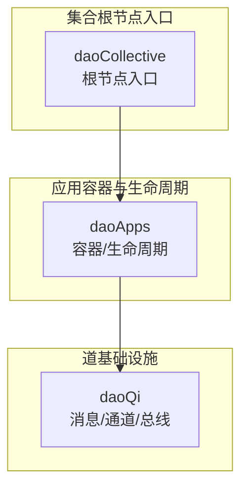
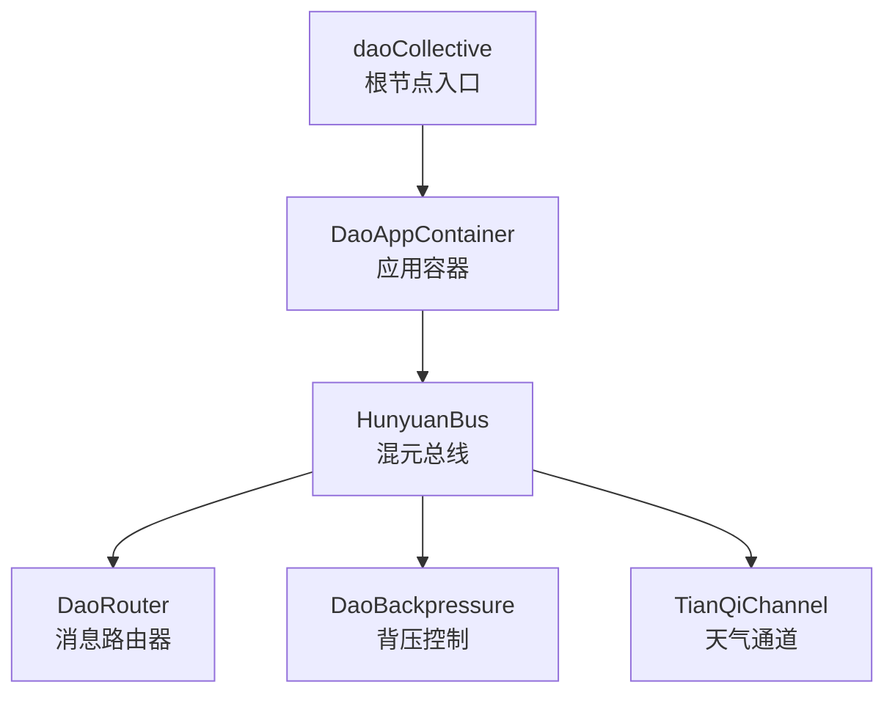
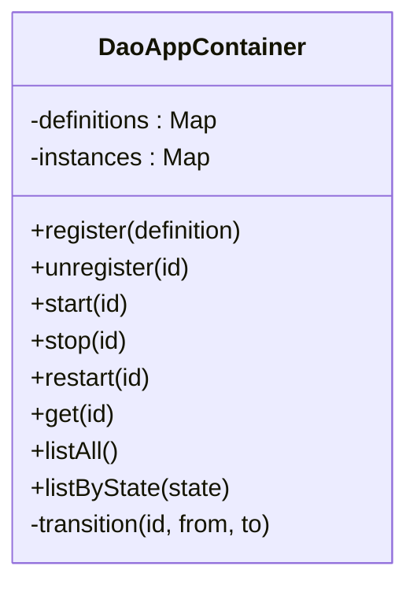
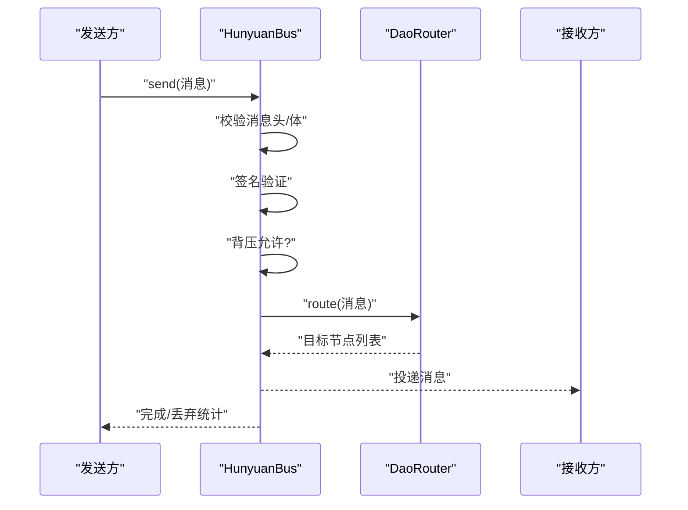
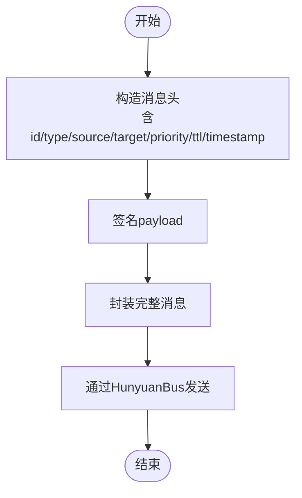
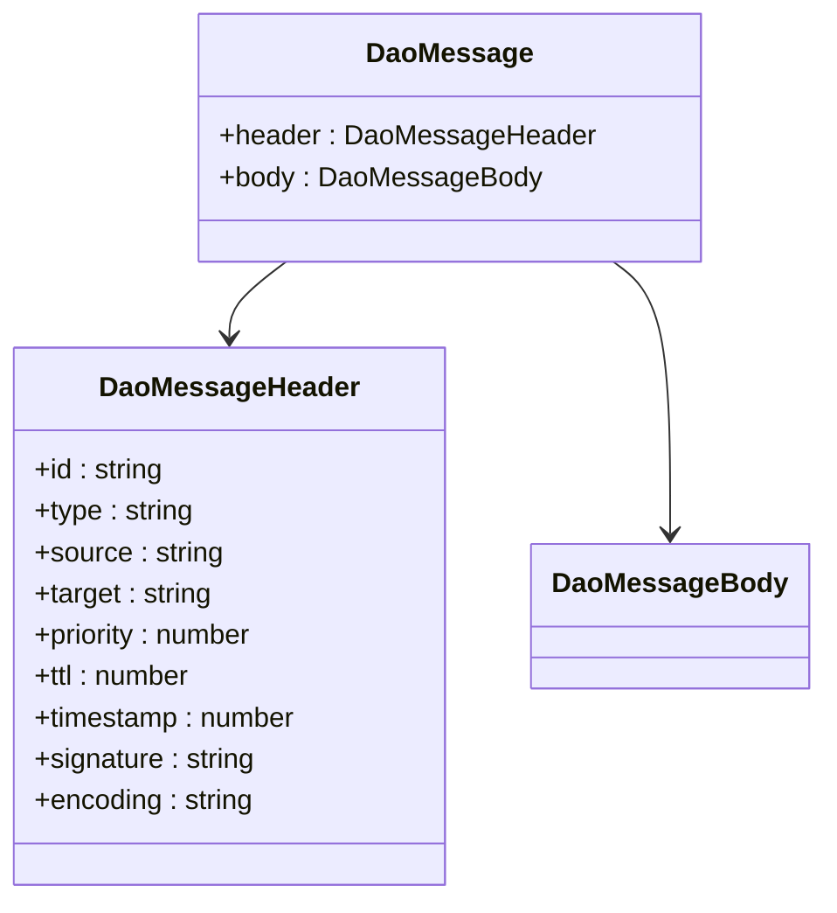
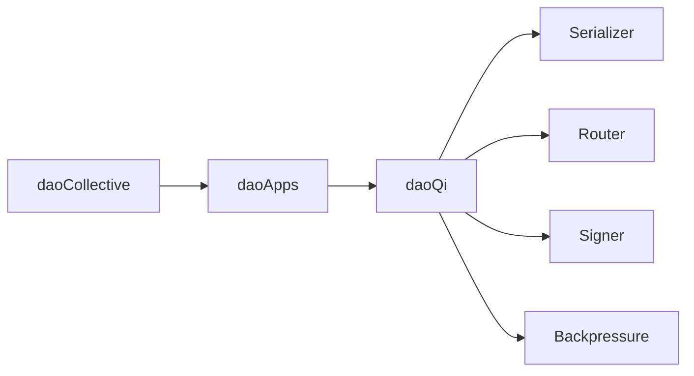

# 框架核心概念

<cite>
**本文引用的文件**
- [apps/DaoMind/packages/daoCollective/src/index.ts](file://apps/DaoMind/packages/daoCollective/src/index.ts)
- [apps/DaoMind/packages/daoApps/src/index.ts](file://apps/DaoMind/packages/daoApps/src/index.ts)
- [apps/DaoMind/packages/daoApps/src/container.ts](file://apps/DaoMind/packages/daoApps/src/container.ts)
- [apps/DaoMind/packages/daoQi/src/index.ts](file://apps/DaoMind/packages/daoQi/src/index.ts)
- [apps/DaoMind/packages/daoQi/src/types/message.ts](file://apps/DaoMind/packages/daoQi/src/types/message.ts)
- [apps/DaoMind/packages/daoQi/src/hunyuan.ts](file://apps/DaoMind/packages/daoQi/src/hunyuan.ts)
- [apps/DaoMind/packages/daoQi/src/router.ts](file://apps/DaoMind/packages/daoQi/src/router.ts)
- [apps/DaoMind/packages/daoQi/src/backpressure.ts](file://apps/DaoMind/packages/daoQi/src/backpressure.ts)
- [apps/DaoMind/packages/daoQi/src/channels/tian-qi.ts](file://apps/DaoMind/packages/daoQi/src/channels/tian-qi.ts)
</cite>

## 目录
1. [引言](#引言)
2. [项目结构](#项目结构)
3. [核心组件](#核心组件)
4. [架构总览](#架构总览)
5. [详细组件分析](#详细组件分析)
6. [依赖关系分析](#依赖关系分析)
7. [性能考量](#性能考量)
8. [故障排查指南](#故障排查指南)
9. [结论](#结论)
10. [附录](#附录)

## 引言
本文件面向DaoMind框架的核心概念与架构设计，系统阐释“道家哲学思想”在现代软件架构中的体现，围绕DAO（去中心化自治组织）理念、模块化与组件化设计、Monorepo管理方式，以及消息驱动的“气”通道体系展开。文档旨在帮助开发者理解框架的价值主张与设计思想，并通过具体代码路径指引实际开发实践。

## 项目结构
DaoMind采用Monorepo组织方式，以“道宇宙”为根节点，分层抽象出“道（基础设施）—应用（容器与生命周期）—集合（根节点入口）”三层架构。核心模块包括：
- 道（daoQi）：统一消息协议、通道与总线，实现“气”的流动与平衡
- 应用（daoApps）：应用注册、生命周期管理与状态机
- 集合（daoCollective）：根节点入口与系统元信息

图表来源
- [apps/DaoMind/packages/daoCollective/src/index.ts:1-5](file://apps/DaoMind/packages/daoCollective/src/index.ts#L1-L5)
- [apps/DaoMind/packages/daoApps/src/index.ts:1-9](file://apps/DaoMind/packages/daoApps/src/index.ts#L1-L9)
- [apps/DaoMind/packages/daoQi/src/index.ts:1-28](file://apps/DaoMind/packages/daoQi/src/index.ts#L1-L28)

章节来源
- [apps/DaoMind/packages/daoCollective/src/index.ts:1-5](file://apps/DaoMind/packages/daoCollective/src/index.ts#L1-L5)
- [apps/DaoMind/packages/daoApps/src/index.ts:1-9](file://apps/DaoMind/packages/daoApps/src/index.ts#L1-L9)
- [apps/DaoMind/packages/daoQi/src/index.ts:1-28](file://apps/DaoMind/packages/daoQi/src/index.ts#L1-L28)

## 核心组件
- 道（daoQi）
  - 统一消息协议与通道：定义消息头、消息体、通道类型与优先级，支撑跨节点通信
  - 混元总线（HunyuanBus）：序列化、签名验证、路由转发、背压控制与统计
  - 路由器（DaoRouter）：基于目标节点的订阅关系进行消息投递
  - 背压控制（DaoBackpressure）：按节点限速与滑动窗口控制流量
  - 天气通道（TianQiChannel）：下行通道，广播全局指令或定向下发到节点
- 应用（daoApps）
  - 应用容器（DaoAppContainer）：注册、启动、停止、重启与状态查询
  - 生命周期管理：严格的状态机与依赖检查，确保有序启停
- 集合（daoCollective）
  - 根节点入口：系统整体的命名与描述信息，作为架构入口

章节来源
- [apps/DaoMind/packages/daoQi/src/types/message.ts:1-40](file://apps/DaoMind/packages/daoQi/src/types/message.ts#L1-L40)
- [apps/DaoMind/packages/daoQi/src/hunyuan.ts:1-125](file://apps/DaoMind/packages/daoQi/src/hunyuan.ts#L1-L125)
- [apps/DaoMind/packages/daoQi/src/router.ts:1-48](file://apps/DaoMind/packages/daoQi/src/router.ts#L1-L48)
- [apps/DaoMind/packages/daoQi/src/backpressure.ts:1-69](file://apps/DaoMind/packages/daoQi/src/backpressure.ts#L1-L69)
- [apps/DaoMind/packages/daoQi/src/channels/tian-qi.ts:1-105](file://apps/DaoMind/packages/daoQi/src/channels/tian-qi.ts#L1-L105)
- [apps/DaoMind/packages/daoApps/src/container.ts:1-108](file://apps/DaoMind/packages/daoApps/src/container.ts#L1-L108)
- [apps/DaoMind/packages/daoCollective/src/index.ts:1-5](file://apps/DaoMind/packages/daoCollective/src/index.ts#L1-L5)

## 架构总览
DaoMind以“道家哲学”为隐喻，构建“气”的流动体系：
- “道”为基础设施层，提供统一的消息协议与通道能力
- “应用”为功能层，负责应用生命周期与状态管理
- “集合”为根节点，作为系统入口与元信息中心
- “天气通道”承担自上而下的全局指令与配置下发，体现“天之气下降，滋养万物”

图表来源
- [apps/DaoMind/packages/daoCollective/src/index.ts:1-5](file://apps/DaoMind/packages/daoCollective/src/index.ts#L1-L5)
- [apps/DaoMind/packages/daoApps/src/container.ts:1-108](file://apps/DaoMind/packages/daoApps/src/container.ts#L1-L108)
- [apps/DaoMind/packages/daoQi/src/hunyuan.ts:1-125](file://apps/DaoMind/packages/daoQi/src/hunyuan.ts#L1-L125)
- [apps/DaoMind/packages/daoQi/src/router.ts:1-48](file://apps/DaoMind/packages/daoQi/src/router.ts#L1-L48)
- [apps/DaoMind/packages/daoQi/src/backpressure.ts:1-69](file://apps/DaoMind/packages/daoQi/src/backpressure.ts#L1-L69)
- [apps/DaoMind/packages/daoQi/src/channels/tian-qi.ts:1-105](file://apps/DaoMind/packages/daoQi/src/channels/tian-qi.ts#L1-L105)

## 详细组件分析

### 组件A：应用容器与生命周期（DaoAppContainer）
- 设计要点
  - 应用注册与实例化：维护注册表与实例表，记录状态与时间戳
  - 状态机：受控状态转换，禁止对运行中应用直接卸载
  - 启停流程：启动前校验依赖，停止时保证原子性状态变更
  - 查询接口：支持按状态筛选与全量列举
- 关键路径
  - 注册与卸载：[apps/DaoMind/packages/daoApps/src/container.ts:16-36](file://apps/DaoMind/packages/daoApps/src/container.ts#L16-L36)
  - 启动与依赖检查：[apps/DaoMind/packages/daoApps/src/container.ts:38-61](file://apps/DaoMind/packages/daoApps/src/container.ts#L38-L61)
  - 停止与重启：[apps/DaoMind/packages/daoApps/src/container.ts:63-78](file://apps/DaoMind/packages/daoApps/src/container.ts#L63-L78)
  - 状态查询：[apps/DaoMind/packages/daoApps/src/container.ts:80-94](file://apps/DaoMind/packages/daoApps/src/container.ts#L80-L94)

图表来源
- [apps/DaoMind/packages/daoApps/src/container.ts:12-104](file://apps/DaoMind/packages/daoApps/src/container.ts#L12-L104)

章节来源
- [apps/DaoMind/packages/daoApps/src/container.ts:1-108](file://apps/DaoMind/packages/daoApps/src/container.ts#L1-L108)

### 组件B：混元总线与消息处理（HunyuanBus）
- 设计要点
  - 消息校验：头部完整性、签名验证、路由存在性
  - 背压控制：按节点限速与降采样策略
  - 序列化与路由：统一序列化后按目标节点投递
  - 统计与可观测：消息发出/丢弃计数与通道类型统计
- 关键路径
  - 发送流程与校验：[apps/DaoMind/packages/daoQi/src/hunyuan.ts:45-92](file://apps/DaoMind/packages/daoQi/src/hunyuan.ts#L45-L92)
  - 订阅与解耦：[apps/DaoMind/packages/daoQi/src/hunyuan.ts:94-98](file://apps/DaoMind/packages/daoQi/src/hunyuan.ts#L94-L98)
  - 统计与探针：[apps/DaoMind/packages/daoQi/src/hunyuan.ts:109-123](file://apps/DaoMind/packages/daoQi/src/hunyuan.ts#L109-L123)

图表来源
- [apps/DaoMind/packages/daoQi/src/hunyuan.ts:45-92](file://apps/DaoMind/packages/daoQi/src/hunyuan.ts#L45-L92)
- [apps/DaoMind/packages/daoQi/src/router.ts:28-42](file://apps/DaoMind/packages/daoQi/src/router.ts#L28-L42)

章节来源
- [apps/DaoMind/packages/daoQi/src/hunyuan.ts:1-125](file://apps/DaoMind/packages/daoQi/src/hunyuan.ts#L1-L125)
- [apps/DaoMind/packages/daoQi/src/router.ts:1-48](file://apps/DaoMind/packages/daoQi/src/router.ts#L1-L48)

### 组件C：天气通道与下行广播（TianQiChannel）
- 设计要点
  - 广播与定向发送：统一消息头构造与签名，支持全局广播与节点定向
  - 去重与TTL：使用UUID去重，维护默认TTL并统计已发消息数
  - 与总线协作：通过HunyuanBus发送消息
- 关键路径
  - 广播消息：[apps/DaoMind/packages/daoQi/src/channels/tian-qi.ts:30-62](file://apps/DaoMind/packages/daoQi/src/channels/tian-qi.ts#L30-L62)
  - 定向发送：[apps/DaoMind/packages/daoQi/src/channels/tian-qi.ts:64-95](file://apps/DaoMind/packages/daoQi/src/channels/tian-qi.ts#L64-L95)
  - TTL设置与统计：[apps/DaoMind/packages/daoQi/src/channels/tian-qi.ts:97-103](file://apps/DaoMind/packages/daoQi/src/channels/tian-qi.ts#L97-L103)

图表来源
- [apps/DaoMind/packages/daoQi/src/channels/tian-qi.ts:30-62](file://apps/DaoMind/packages/daoQi/src/channels/tian-qi.ts#L30-L62)
- [apps/DaoMind/packages/daoQi/src/hunyuan.ts:45-92](file://apps/DaoMind/packages/daoQi/src/hunyuan.ts#L45-L92)

章节来源
- [apps/DaoMind/packages/daoQi/src/channels/tian-qi.ts:1-105](file://apps/DaoMind/packages/daoQi/src/channels/tian-qi.ts#L1-L105)

### 组件D：消息协议与通道类型（消息/通道/总线）
- 设计要点
  - 消息协议：统一头字段（id、type、source、target、priority、ttl、timestamp、signature、encoding），体支持JSON与二进制
  - 通道类型：天（tian）、地（di）、人（ren）、冲（chong）等，分别承载不同方向与职责的消息
  - 总线职责：序列化、签名、路由、背压、统计与事件派发
- 关键路径
  - 消息类型定义：[apps/DaoMind/packages/daoQi/src/types/message.ts:7-39](file://apps/DaoMind/packages/daoQi/src/types/message.ts#L7-L39)
  - 总线导出与聚合：[apps/DaoMind/packages/daoQi/src/index.ts:7-27](file://apps/DaoMind/packages/daoQi/src/index.ts#L7-L27)

图表来源
- [apps/DaoMind/packages/daoQi/src/types/message.ts:17-39](file://apps/DaoMind/packages/daoQi/src/types/message.ts#L17-L39)

章节来源
- [apps/DaoMind/packages/daoQi/src/types/message.ts:1-40](file://apps/DaoMind/packages/daoQi/src/types/message.ts#L1-L40)
- [apps/DaoMind/packages/daoQi/src/index.ts:1-28](file://apps/DaoMind/packages/daoQi/src/index.ts#L1-L28)

## 依赖关系分析
- daoCollective 作为根节点入口，被 daoApps 依赖
- daoApps 通过容器与生命周期管理应用，依赖 daoQi 的消息通道能力
- daoQi 内部组件通过组合关系协作：HunyuanBus 依赖 Serializer、Router、Signer、Backpressure

图表来源
- [apps/DaoMind/packages/daoCollective/src/index.ts:1-5](file://apps/DaoMind/packages/daoCollective/src/index.ts#L1-L5)
- [apps/DaoMind/packages/daoApps/src/index.ts:1-9](file://apps/DaoMind/packages/daoApps/src/index.ts#L1-L9)
- [apps/DaoMind/packages/daoQi/src/hunyuan.ts:15-43](file://apps/DaoMind/packages/daoQi/src/hunyuan.ts#L15-L43)

章节来源
- [apps/DaoMind/packages/daoCollective/src/index.ts:1-5](file://apps/DaoMind/packages/daoCollective/src/index.ts#L1-L5)
- [apps/DaoMind/packages/daoApps/src/index.ts:1-9](file://apps/DaoMind/packages/daoApps/src/index.ts#L1-L9)
- [apps/DaoMind/packages/daoQi/src/hunyuan.ts:1-125](file://apps/DaoMind/packages/daoQi/src/hunyuan.ts#L1-L125)

## 性能考量
- 背压策略
  - 按节点限速与滑动窗口：在高并发场景下抑制热点节点过载
  - 降采样：在限速状态下降低吞吐以维持系统稳定
- 路由效率
  - 订阅映射与广播合并：减少重复投递，提升广播效率
- 序列化与签名
  - 统一序列化与轻量签名验证，降低开销
- 统计与可观测
  - 总发出/丢弃计数与通道类型分布，便于容量规划与问题定位

章节来源
- [apps/DaoMind/packages/daoQi/src/backpressure.ts:32-59](file://apps/DaoMind/packages/daoQi/src/backpressure.ts#L32-L59)
- [apps/DaoMind/packages/daoQi/src/router.ts:28-42](file://apps/DaoMind/packages/daoQi/src/router.ts#L28-L42)
- [apps/DaoMind/packages/daoQi/src/hunyuan.ts:109-123](file://apps/DaoMind/packages/daoQi/src/hunyuan.ts#L109-L123)

## 故障排查指南
- 应用状态异常
  - 症状：启动失败或卸载报错
  - 排查：确认应用状态是否为 running 或 starting；检查依赖是否已运行
  - 参考路径：[apps/DaoMind/packages/daoApps/src/container.ts:38-78](file://apps/DaoMind/packages/daoApps/src/container.ts#L38-L78)
- 消息未达或被丢弃
  - 症状：接收端未收到消息
  - 排查：检查TTL是否耗尽、目标是否存在订阅者、签名是否有效、是否触发背压
  - 参考路径：[apps/DaoMind/packages/daoQi/src/hunyuan.ts:45-92](file://apps/DaoMind/packages/daoQi/src/hunyuan.ts#L45-L92)
- 通道统计异常
  - 症状：某类通道消息数异常
  - 排查：查看通道统计分布与总发出/丢弃计数
  - 参考路径：[apps/DaoMind/packages/daoQi/src/hunyuan.ts:109-123](file://apps/DaoMind/packages/daoQi/src/hunyuan.ts#L109-L123)

章节来源
- [apps/DaoMind/packages/daoApps/src/container.ts:38-78](file://apps/DaoMind/packages/daoApps/src/container.ts#L38-L78)
- [apps/DaoMind/packages/daoQi/src/hunyuan.ts:45-92](file://apps/DaoMind/packages/daoQi/src/hunyuan.ts#L45-L92)
- [apps/DaoMind/packages/daoQi/src/hunyuan.ts:109-123](file://apps/DaoMind/packages/daoQi/src/hunyuan.ts#L109-L123)

## 结论
DaoMind以“道家哲学”为内核，构建了“气”的流动体系：通过统一消息协议与通道，结合背压与路由控制，实现高内聚、低耦合、可扩展的分布式系统骨架；应用容器与生命周期管理确保系统可控、可观测、可治理。该架构在Monorepo与模块化设计下，既保持了概念一致性，又提供了清晰的边界与演进空间。

## 附录
- 术语
  - 道（daoQi）：基础设施层，提供消息、通道与总线能力
  - 应用（daoApps）：功能层，负责应用注册、生命周期与状态管理
  - 集合（daoCollective）：根节点入口，系统元信息与整体架构入口
  - 天气通道（TianQiChannel）：下行通道，承载全局指令与配置
- 开发建议
  - 使用天气通道进行全局配置下发与指令广播
  - 在应用启动前完成依赖检查，避免运行期阻塞
  - 通过背压参数调优系统吞吐与稳定性
  - 借助总线统计与日志定位消息链路问题