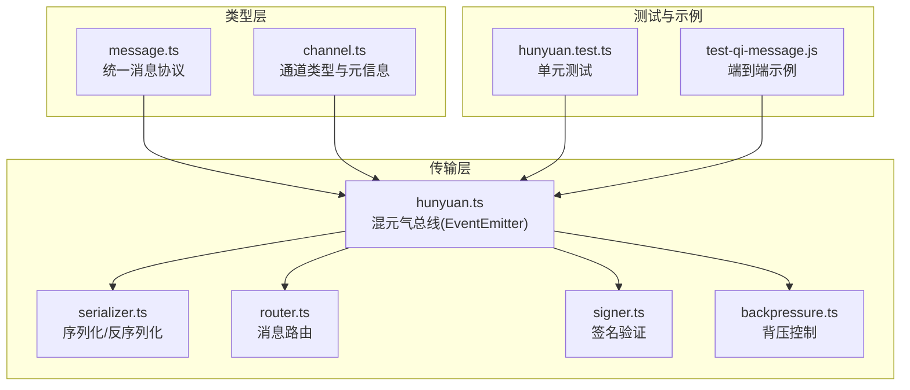
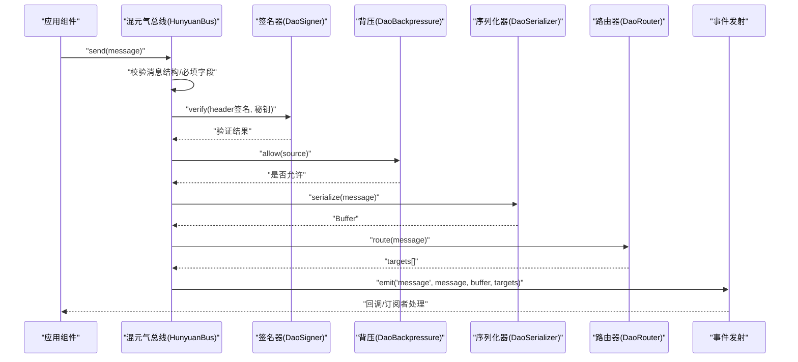
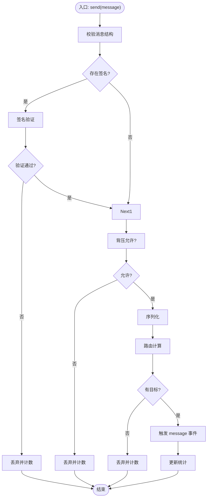
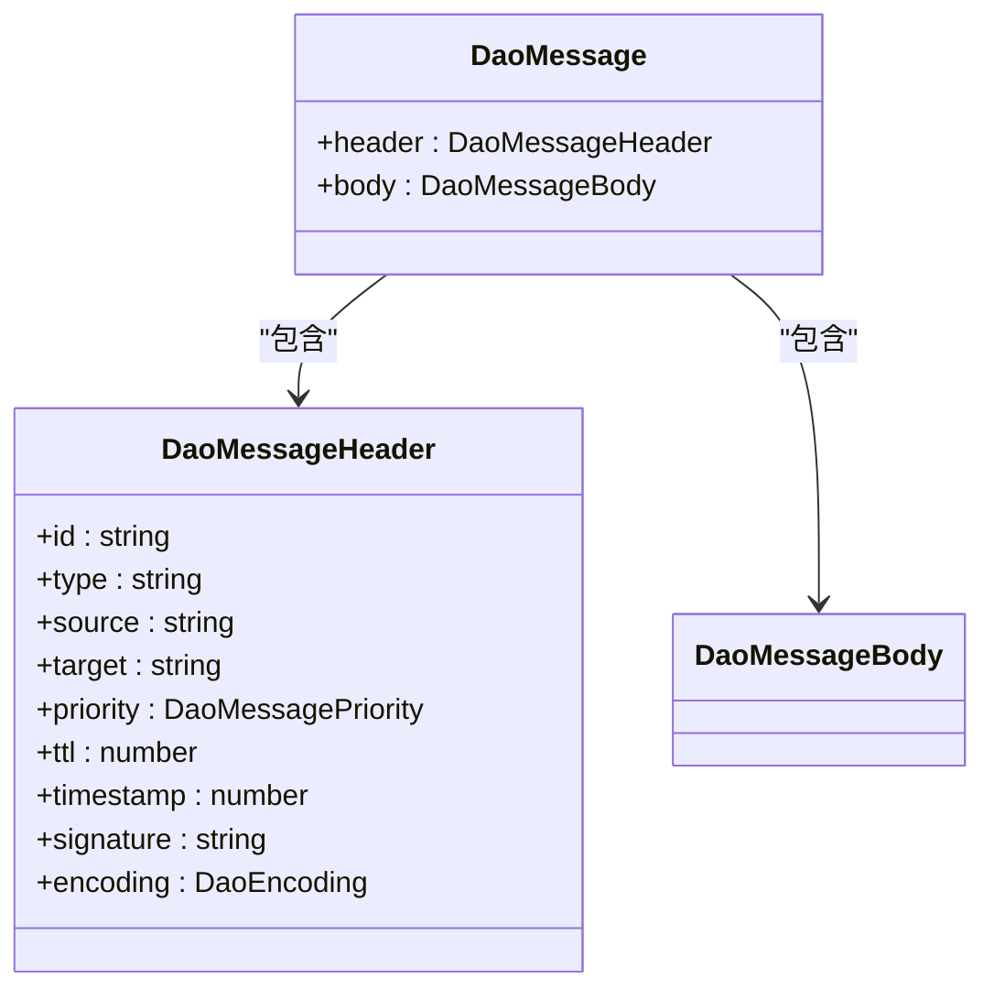
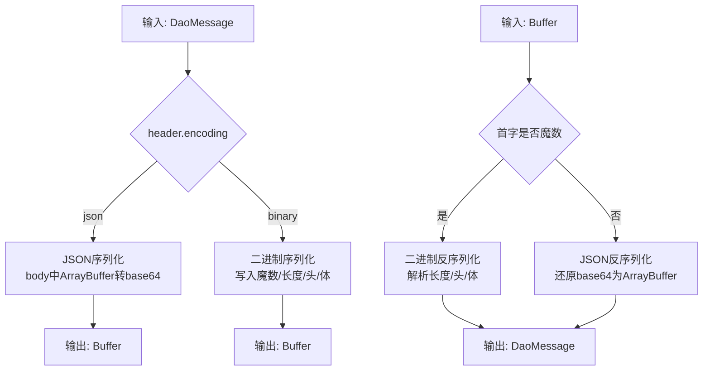
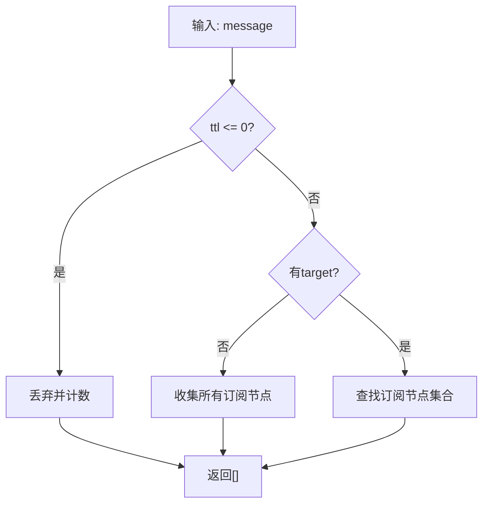
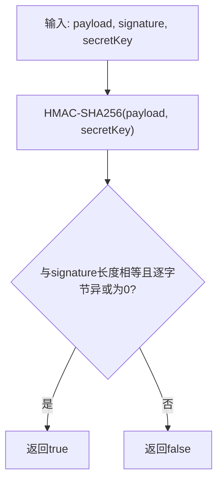
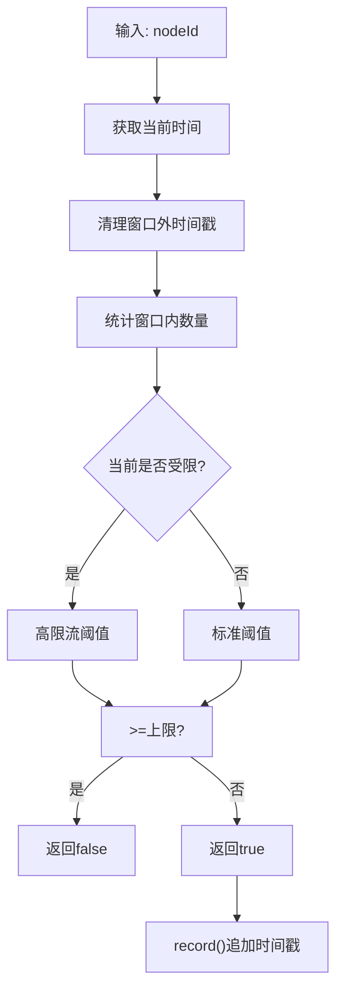
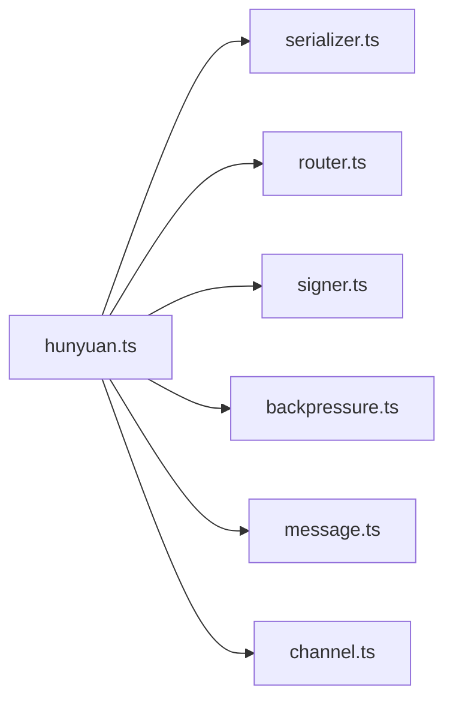

# 消息传递系统

<cite>
**本文引用的文件**
- [message.ts](file://apps/DaoMind/packages/daoQi/src/types/message.ts)
- [hunyuan.ts](file://apps/DaoMind/packages/daoQi/src/hunyuan.ts)
- [serializer.ts](file://apps/DaoMind/packages/daoQi/src/codec/serializer.ts)
- [router.ts](file://apps/DaoMind/packages/daoQi/src/router.ts)
- [signer.ts](file://apps/DaoMind/packages/daoQi/src/signer.ts)
- [backpressure.ts](file://apps/DaoMind/packages/daoQi/src/backpressure.ts)
- [channel.ts](file://apps/DaoMind/packages/daoQi/src/types/channel.ts)
- [hunyuan.test.ts](file://apps/DaoMind/packages/daoQi/src/__tests__/hunyuan.test.ts)
- [test-qi-message.js](file://apps/DaoMind/tests/test-qi-message.js)
</cite>

## 目录
1. [简介](#简介)
2. [项目结构](#项目结构)
3. [核心组件](#核心组件)
4. [架构总览](#架构总览)
5. [组件详解](#组件详解)
6. [依赖关系分析](#依赖关系分析)
7. [性能考量](#性能考量)
8. [故障排查指南](#故障排查指南)
9. [结论](#结论)
10. [附录](#附录)

## 简介
本文件为 DaoMind 消息传递系统的技术文档，围绕“混元气总线”及其配套组件，系统阐述消息协议、事件总线模式、数据流管理、序列化/反序列化、路由与背压控制、错误处理与可观测性等主题。文档同时给出与微服务架构的集成思路与最佳实践，并通过图示与路径指引帮助读者快速定位实现细节。

## 项目结构
DaoQi 消息子系统位于 apps/DaoMind/packages/daoQi 下，采用模块化设计：
- 类型层：统一消息协议与通道类型定义
- 传输层：混元气总线（事件总线）、序列化器、路由器、签名器、背压控制器
- 测试与示例：单元测试与端到端示例脚本

图表来源
- [hunyuan.ts:1-125](file://apps/DaoMind/packages/daoQi/src/hunyuan.ts#L1-L125)
- [serializer.ts:1-75](file://apps/DaoMind/packages/daoQi/src/codec/serializer.ts#L1-L75)
- [router.ts:1-48](file://apps/DaoMind/packages/daoQi/src/router.ts#L1-L48)
- [signer.ts:1-40](file://apps/DaoMind/packages/daoQi/src/signer.ts#L1-L40)
- [backpressure.ts:1-69](file://apps/DaoMind/packages/daoQi/src/backpressure.ts#L1-L69)
- [message.ts:1-40](file://apps/DaoMind/packages/daoQi/src/types/message.ts#L1-L40)
- [channel.ts:1-23](file://apps/DaoMind/packages/daoQi/src/types/channel.ts#L1-L23)
- [hunyuan.test.ts:1-269](file://apps/DaoMind/packages/daoQi/src/__tests__/hunyuan.test.ts#L1-L269)
- [test-qi-message.js:1-90](file://apps/DaoMind/tests/test-qi-message.js#L1-L90)

章节来源
- [hunyuan.ts:1-125](file://apps/DaoMind/packages/daoQi/src/hunyuan.ts#L1-L125)
- [serializer.ts:1-75](file://apps/DaoMind/packages/daoQi/src/codec/serializer.ts#L1-L75)
- [router.ts:1-48](file://apps/DaoMind/packages/daoQi/src/router.ts#L1-L48)
- [signer.ts:1-40](file://apps/DaoMind/packages/daoQi/src/signer.ts#L1-L40)
- [backpressure.ts:1-69](file://apps/DaoMind/packages/daoQi/src/backpressure.ts#L1-L69)
- [message.ts:1-40](file://apps/DaoMind/packages/daoQi/src/types/message.ts#L1-L40)
- [channel.ts:1-23](file://apps/DaoMind/packages/daoQi/src/types/channel.ts#L1-L23)
- [hunyuan.test.ts:1-269](file://apps/DaoMind/packages/daoQi/src/__tests__/hunyuan.test.ts#L1-L269)
- [test-qi-message.js:1-90](file://apps/DaoMind/tests/test-qi-message.js#L1-L90)

## 核心组件
- 统一消息协议：定义消息头与消息体的结构、优先级、编码、签名等字段，确保跨节点一致性
- 混元气总线：基于 EventEmitter 的事件总线，负责消息校验、签名验证、背压控制、序列化、路由分发与统计
- 序列化器：支持 JSON 与二进制两种编码，保证传输效率与兼容性
- 路由器：维护目标到订阅节点的映射，支持广播与点对点路由，具备 TTL 与丢弃计数
- 签名器：基于 HMAC-SHA256 的签名与校验，提供时序安全比较
- 背压控制器：按节点维度进行速率限制与降采样，避免过载

章节来源
- [message.ts:1-40](file://apps/DaoMind/packages/daoQi/src/types/message.ts#L1-L40)
- [hunyuan.ts:15-125](file://apps/DaoMind/packages/daoQi/src/hunyuan.ts#L15-L125)
- [serializer.ts:11-75](file://apps/DaoMind/packages/daoQi/src/codec/serializer.ts#L11-L75)
- [router.ts:9-48](file://apps/DaoMind/packages/daoQi/src/router.ts#L9-L48)
- [signer.ts:9-40](file://apps/DaoMind/packages/daoQi/src/signer.ts#L9-L40)
- [backpressure.ts:24-69](file://apps/DaoMind/packages/daoQi/src/backpressure.ts#L24-L69)

## 架构总览
混元气总线作为系统中枢，接收应用层消息，经过校验与签名验证后进入背压控制，随后序列化并交由路由器计算目标节点集合，最后通过事件总线分发至对应通道处理器。通道类型包括天、地、人、冲气四种，分别承担不同方向与职责的流量。

图表来源
- [hunyuan.ts:45-92](file://apps/DaoMind/packages/daoQi/src/hunyuan.ts#L45-L92)
- [serializer.ts:12-25](file://apps/DaoMind/packages/daoQi/src/codec/serializer.ts#L12-L25)
- [router.ts:28-42](file://apps/DaoMind/packages/daoQi/src/router.ts#L28-L42)
- [signer.ts:14-17](file://apps/DaoMind/packages/daoQi/src/signer.ts#L14-L17)
- [backpressure.ts:32-52](file://apps/DaoMind/packages/daoQi/src/backpressure.ts#L32-L52)

## 组件详解

### 混元气总线（HunyuanBus）
- 角色与职责：事件总线核心，聚合校验、签名、背压、序列化、路由与统计
- 关键流程：
  - 结构校验：缺失头/体、必填字段、body.type 约束
  - 签名验证：可选签名，失败则丢弃
  - 背压控制：按源节点限流，记录速率
  - 序列化：根据编码选择 JSON 或二进制
  - 路由：TTL<=0 丢弃；无目标则广播；否则点对点
  - 分发：触发 message 事件，携带 message、buffer、targets
  - 统计：发出计数、丢弃计数（含路由器）、通道分布
- 订阅接口：subscribe(channelType, handler)，返回取消订阅函数
- 探测接口：probe(target) 返回近似延迟

图表来源
- [hunyuan.ts:45-124](file://apps/DaoMind/packages/daoQi/src/hunyuan.ts#L45-L124)

章节来源
- [hunyuan.ts:15-125](file://apps/DaoMind/packages/daoQi/src/hunyuan.ts#L15-L125)
- [hunyuan.test.ts:27-63](file://apps/DaoMind/packages/daoQi/src/__tests__/hunyuan.test.ts#L27-L63)
- [hunyuan.test.ts:65-93](file://apps/DaoMind/packages/daoQi/src/__tests__/hunyuan.test.ts#L65-L93)
- [hunyuan.test.ts:95-122](file://apps/DaoMind/packages/daoQi/src/__tests__/hunyuan.test.ts#L95-L122)
- [hunyuan.test.ts:124-157](file://apps/DaoMind/packages/daoQi/src/__tests__/hunyuan.test.ts#L124-L157)

### 统一消息协议（DaoMessage）
- 消息头（DaoMessageHeader）：id、type、source、target、priority、ttl、timestamp、signature、encoding
- 消息体（DaoMessageBody）：对象或 ArrayBuffer
- 编码（DaoEncoding）：json、binary
- 优先级（DaoMessagePriority）：0 最高，3 最低

图表来源
- [message.ts:17-39](file://apps/DaoMind/packages/daoQi/src/types/message.ts#L17-L39)

章节来源
- [message.ts:1-40](file://apps/DaoMind/packages/daoQi/src/types/message.ts#L1-L40)

### 序列化与反序列化（DaoSerializer）
- 支持两种编码：
  - JSON：将 body 中的 ArrayBuffer 转为 base64 字段，便于文本传输
  - Binary：在头部写入魔数与长度，紧接 header 与 body
- 反序列化自动识别编码格式并还原

图表来源
- [serializer.ts:12-75](file://apps/DaoMind/packages/daoQi/src/codec/serializer.ts#L12-L75)

章节来源
- [serializer.ts:1-75](file://apps/DaoMind/packages/daoQi/src/codec/serializer.ts#L1-L75)

### 路由器（DaoRouter）
- 维护 target → 节点集合 的映射
- 路由规则：
  - TTL<=0：丢弃并计数
  - 无目标：广播给所有订阅节点
  - 有目标：返回订阅该 target 的节点列表
- 提供查询订阅者与丢弃计数接口

图表来源
- [router.ts:28-47](file://apps/DaoMind/packages/daoQi/src/router.ts#L28-L47)

章节来源
- [router.ts:1-48](file://apps/DaoMind/packages/daoQi/src/router.ts#L1-L48)

### 签名验证（DaoSigner）
- 签名：使用 HMAC-SHA256 对 header 的字符串化进行签名
- 验证：使用时序安全比较，防止时序攻击
- 密钥：支持生成密钥对（演示用途）

图表来源
- [signer.ts:10-39](file://apps/DaoMind/packages/daoQi/src/signer.ts#L10-L39)

章节来源
- [signer.ts:1-40](file://apps/DaoMind/packages/daoQi/src/signer.ts#L1-L40)

### 背压控制（DaoBackpressure）
- 按节点维护时间戳窗口内的请求数
- 动态限流：超过阈值进入降采样模式，低于阈值恢复
- 提供 allow(record)/getStats 接口

图表来源
- [backpressure.ts:32-67](file://apps/DaoMind/packages/daoQi/src/backpressure.ts#L32-L67)

章节来源
- [backpressure.ts:1-69](file://apps/DaoMind/packages/daoQi/src/backpressure.ts#L1-L69)

### 通道类型与方向（QiChannelType/QiDirection）
- 通道类型：tian（天）、di（地）、ren（人）、chong（冲气）
- 方向：downstream、upstream、lateral、balancing
- 元信息：包含类型、方向、起止节点

章节来源
- [channel.ts:1-23](file://apps/DaoMind/packages/daoQi/src/types/channel.ts#L1-L23)

## 依赖关系分析
混元气总线依赖序列化器、路由器、签名器与背压控制器，形成“校验-限流-序列化-路由-分发”的闭环；通道类型定义为事件分发提供语义化标签。

图表来源
- [hunyuan.ts:10-13](file://apps/DaoMind/packages/daoQi/src/hunyuan.ts#L10-L13)
- [hunyuan.ts:17-28](file://apps/DaoMind/packages/daoQi/src/hunyuan.ts#L17-L28)

章节来源
- [hunyuan.ts:1-125](file://apps/DaoMind/packages/daoQi/src/hunyuan.ts#L1-L125)

## 性能考量
- 编码选择
  - JSON：易调试、兼容性好，适合小消息与文本数据
  - Binary：紧凑高效，适合大体积或二进制数据
- 路由与广播
  - 广播会放大带宽与 CPU，应谨慎使用；尽量明确 target
- 背压参数
  - maxRatePerNode、sampleRate、windowSize 需结合业务峰值与资源容量调优
- 序列化成本
  - 大对象序列化/反序列化开销较高，建议拆分消息或压缩
- 统计与可观测性
  - 利用 getStats 输出发出/丢弃计数与通道分布，辅助容量规划与异常定位

## 故障排查指南
- 发送失败与抛错
  - 结构不完整：检查 header/body 必填字段与 body.type
  - 签名失败：确认签名生成与验证使用的 secretKey 一致
  - 背压拒绝：查看节点速率与窗口配置，必要时放宽限流
  - 无目标：确认路由表是否正确添加订阅
- 单元测试参考
  - 发送成功、签名失败、背压拒绝、无目标、空消息、不完整头/体、订阅与探测等场景均有覆盖
- 端到端示例
  - 展示总线创建、监听、通道创建与消息发送流程

章节来源
- [hunyuan.test.ts:184-251](file://apps/DaoMind/packages/daoQi/src/__tests__/hunyuan.test.ts#L184-L251)
- [hunyuan.test.ts:253-267](file://apps/DaoMind/packages/daoQi/src/__tests__/hunyuan.test.ts#L253-L267)
- [test-qi-message.js:1-90](file://apps/DaoMind/tests/test-qi-message.js#L1-L90)

## 结论
DaoQi 消息子系统以“混元气总线”为核心，结合签名、背压、路由与多编码序列化，构建了高可靠、可扩展、可观测的消息基础设施。通过事件总线与通道模型，系统既满足单体应用内部通信，也便于与微服务架构对接。建议在生产环境中结合业务特征调优背压参数、合理选择编码，并完善监控与告警体系。

## 附录

### 实现要点与最佳实践
- 消息建模
  - 明确消息头字段用途，统一 id、type、priority、ttl、timestamp、encoding
  - 业务消息体建议显式声明 type，便于路由与订阅过滤
- 安全机制
  - 启用签名验证，严格管理 secretKey；避免在日志中打印敏感信息
  - 使用时序安全比较，降低侧信道风险
- 传输优化
  - 大体积数据优先使用 binary 编码；必要时配合外部存储与引用
  - 控制广播范围，减少不必要的下游压力
- 错误处理
  - 对空消息、不完整头/体、签名失败、背压拒绝、无目标等情况进行显式处理
  - 记录统计指标，定期巡检丢弃率与通道分布
- 微服务集成
  - 将每个服务节点视为“订阅者”，通过 target 进行精确路由
  - 在网关或代理层统一接入混元气总线，屏蔽具体编码与路由细节
  - 通过 TTL 与广播实现服务发现与配置下发

### 示例路径（用于定位实现）
- 混元气总线发送流程与统计
  - [hunyuan.ts:send/getStats:45-119](file://apps/DaoMind/packages/daoQi/src/hunyuan.ts#L45-L119)
- 序列化/反序列化实现
  - [serializer.ts:serialize/deserialize:12-25](file://apps/DaoMind/packages/daoQi/src/codec/serializer.ts#L12-L25)
- 路由与广播逻辑
  - [router.ts:route:28-42](file://apps/DaoMind/packages/daoQi/src/router.ts#L28-L42)
- 签名验证与密钥生成
  - [signer.ts:sign/verify/generateKeyPair:10-26](file://apps/DaoMind/packages/daoQi/src/signer.ts#L10-L26)
- 背压算法与统计
  - [backpressure.ts:allow/record/getStats:32-67](file://apps/DaoMind/packages/daoQi/src/backpressure.ts#L32-L67)
- 通道类型与方向
  - [channel.ts:QiChannelType/QiDirection/QiChannelMeta:8-22](file://apps/DaoMind/packages/daoQi/src/types/channel.ts#L8-L22)
- 单元测试覆盖场景
  - [hunyuan.test.ts:测试集:1-269](file://apps/DaoMind/packages/daoQi/src/__tests__/hunyuan.test.ts#L1-L269)
- 端到端示例脚本
  - [test-qi-message.js:示例流程:1-90](file://apps/DaoMind/tests/test-qi-message.js#L1-L90)