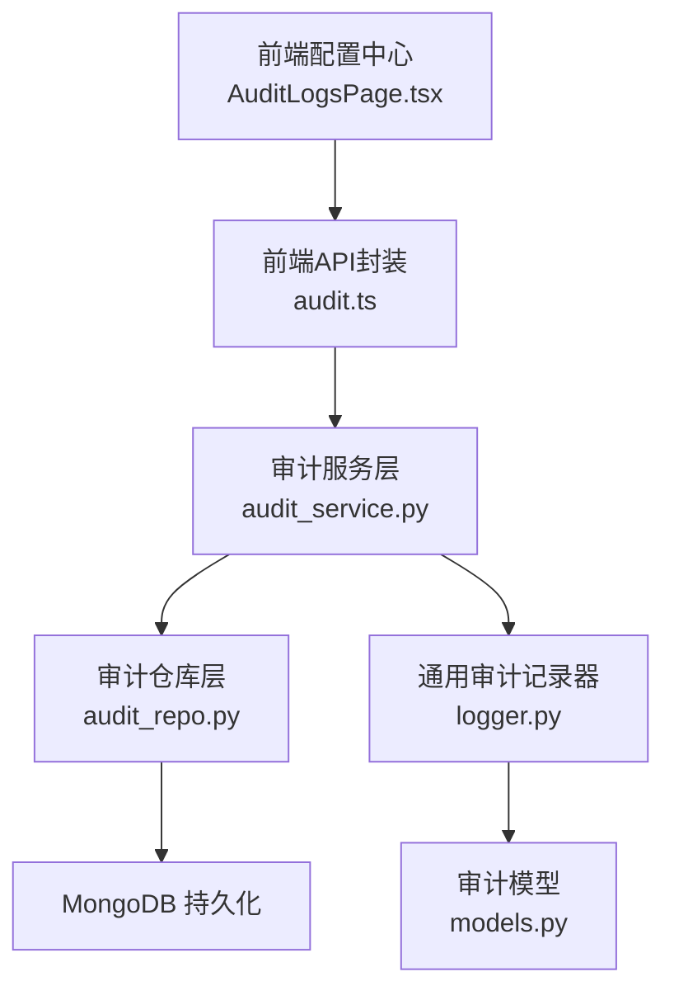
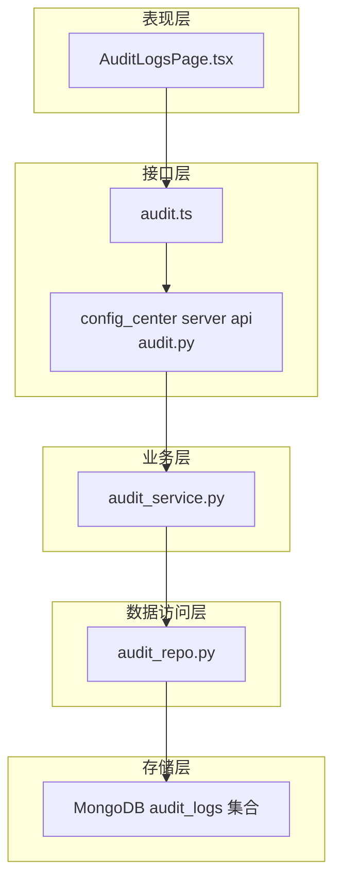
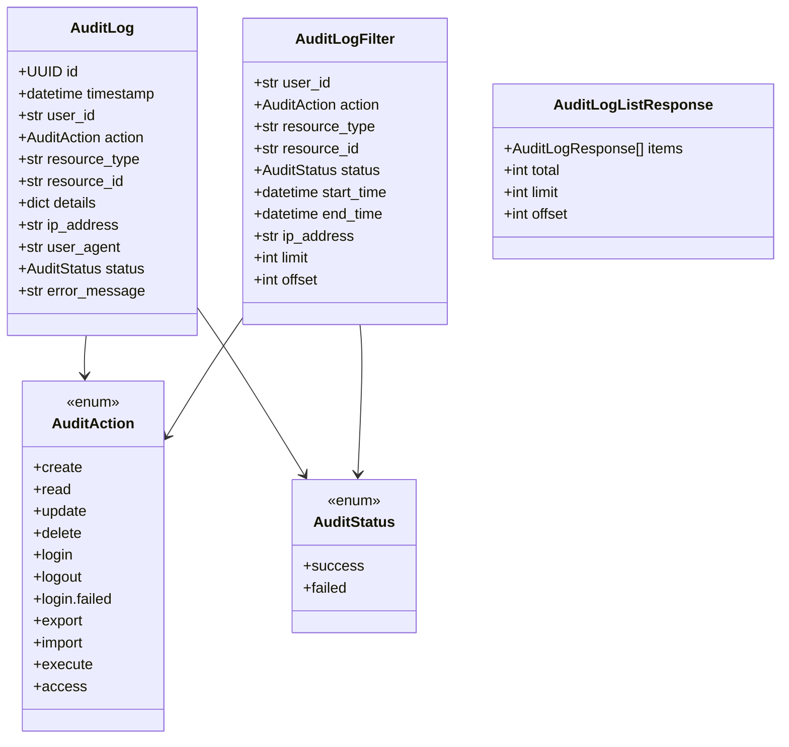
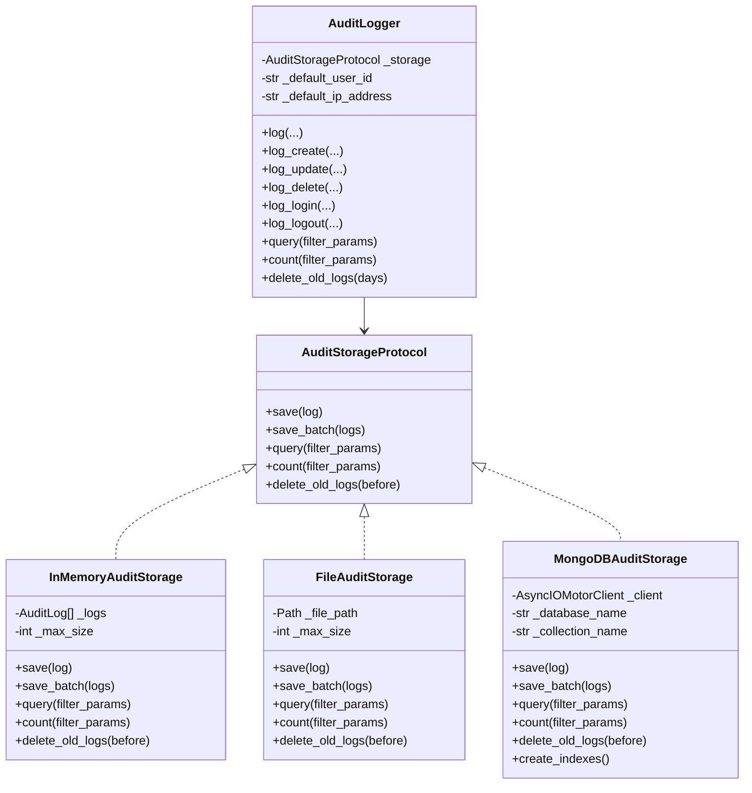
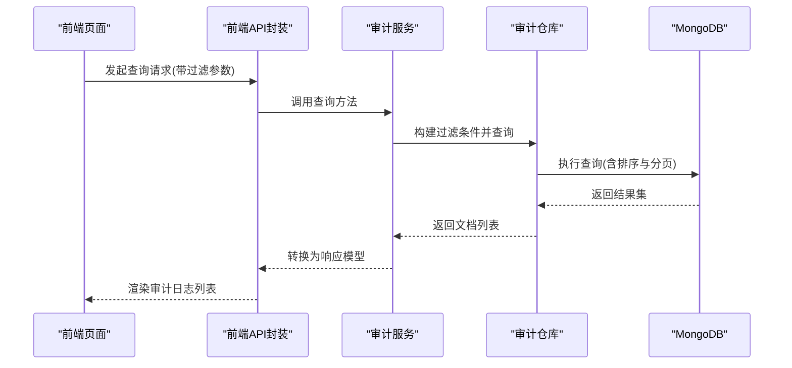
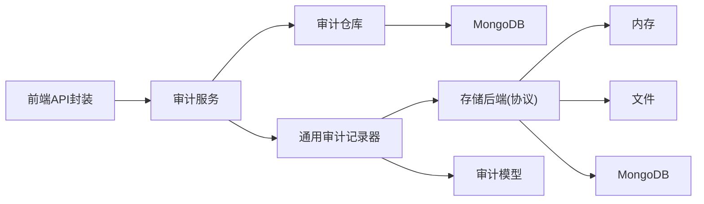

# 审计日志系统

<cite>
**本文引用的文件**
- [audit.ts](file://apps/config-center/src/api/audit.ts)
- [models.py](file://tools/flexloop/src/taolib/testing/audit/models.py)
- [logger.py](file://tools/flexloop/src/taolib/testing/audit/logger.py)
- [audit_service.py](file://tools/flexloop/src/taolib/testing/config_center/services/audit_service.py)
- [audit_repo.py](file://tools/flexloop/src/taolib/testing/config_center/repository/audit_repo.py)
- [audit.py](file://tools/flexloop/src/taolib/testing/config_center/server/api/audit.py)
- [audit.tsx](file://apps/config-center/src/pages/AuditLogsPage.tsx)
- [authStore.ts](file://apps/config-center/src/store/authStore.ts)
- [ProtectedRoute.tsx](file://apps/config-center/src/components/layout/ProtectedRoute.tsx)
</cite>

## 目录
1. [简介](#简介)
2. [项目结构](#项目结构)
3. [核心组件](#核心组件)
4. [架构总览](#架构总览)
5. [详细组件分析](#详细组件分析)
6. [依赖关系分析](#依赖关系分析)
7. [性能考虑](#性能考虑)
8. [故障排查指南](#故障排查指南)
9. [结论](#结论)
10. [附录](#附录)

## 简介
本技术文档面向DaoMind审计日志系统，系统目标是提供统一的安全审计能力，覆盖操作记录、访问日志与变更追踪，支持审计事件的捕获、过滤、存储与检索，并提供合规性报告能力。系统采用前后端分离设计，前端通过API接口调用后端服务，后端提供异步写入、MongoDB持久化、索引优化与定时清理等能力。

## 项目结构
审计系统主要分布在以下位置：
- 前端配置中心应用：提供审计日志查询界面与API调用封装
- 后端工具库：提供通用审计模型、记录器与多存储后端
- 配置中心服务层：针对配置中心场景的审计日志服务与仓库实现
- 配置中心API路由：对外暴露审计查询接口

图表来源
- [audit.ts:1-18](file://apps/config-center/src/api/audit.ts#L1-L18)
- [audit_service.py:1-112](file://tools/flexloop/src/taolib/testing/config_center/services/audit_service.py#L1-L112)
- [audit_repo.py:1-103](file://tools/flexloop/src/taolib/testing/config_center/repository/audit_repo.py#L1-L103)
- [logger.py:1-747](file://tools/flexloop/src/taolib/testing/audit/logger.py#L1-L747)
- [models.py:1-199](file://tools/flexloop/src/taolib/testing/audit/models.py#L1-L199)

章节来源
- [audit.ts:1-18](file://apps/config-center/src/api/audit.ts#L1-L18)
- [audit_service.py:1-112](file://tools/flexloop/src/taolib/testing/config_center/services/audit_service.py#L1-L112)
- [audit_repo.py:1-103](file://tools/flexloop/src/taolib/testing/config_center/repository/audit_repo.py#L1-L103)
- [logger.py:1-747](file://tools/flexloop/src/taolib/testing/audit/logger.py#L1-L747)
- [models.py:1-199](file://tools/flexloop/src/taolib/testing/audit/models.py#L1-L199)

## 核心组件
- 审计模型与枚举：定义审计动作、状态、日志实体、查询过滤器与响应模型
- 审计记录器：提供统一的记录入口，支持多种存储后端（内存、文件、MongoDB）
- 审计服务：封装业务层日志记录与查询逻辑
- 审计仓库：基于MongoDB的文档持久化与索引管理
- 前端API与页面：提供审计日志查询UI与API调用

章节来源
- [models.py:14-199](file://tools/flexloop/src/taolib/testing/audit/models.py#L14-L199)
- [logger.py:470-747](file://tools/flexloop/src/taolib/testing/audit/logger.py#L470-L747)
- [audit_service.py:13-112](file://tools/flexloop/src/taolib/testing/config_center/services/audit_service.py#L13-L112)
- [audit_repo.py:15-103](file://tools/flexloop/src/taolib/testing/config_center/repository/audit_repo.py#L15-L103)
- [audit.ts:1-18](file://apps/config-center/src/api/audit.ts#L1-L18)

## 架构总览
系统采用分层架构：
- 表现层：前端页面负责展示与交互
- 接口层：前端API封装与后端REST接口
- 业务层：审计服务处理业务规则与聚合
- 数据访问层：仓库层封装MongoDB操作
- 存储层：MongoDB集合存储审计日志，支持索引与TTL

图表来源
- [audit.tsx](file://apps/config-center/src/pages/AuditLogsPage.tsx)
- [audit.ts:1-18](file://apps/config-center/src/api/audit.ts#L1-L18)
- [audit.py](file://tools/flexloop/src/taolib/testing/config_center/server/api/audit.py)
- [audit_service.py:1-112](file://tools/flexloop/src/taolib/testing/config_center/services/audit_service.py#L1-L112)
- [audit_repo.py:1-103](file://tools/flexloop/src/taolib/testing/config_center/repository/audit_repo.py#L1-L103)

## 详细组件分析

### 审计数据模型与字段定义
- 审计动作枚举：create、read、update、delete、login、logout、login.failed、export、import、execute、access
- 审计状态枚举：success、failed
- 审计日志实体：包含唯一ID、时间戳、用户ID、动作、资源类型、资源ID、详情、IP地址、User-Agent、状态、错误信息
- 查询过滤器：支持按用户ID、动作、资源类型、资源ID、状态、IP、起止时间、分页参数过滤
- 列表响应：包含条目、总数、分页参数

图表来源
- [models.py:14-199](file://tools/flexloop/src/taolib/testing/audit/models.py#L14-L199)

章节来源
- [models.py:14-199](file://tools/flexloop/src/taolib/testing/audit/models.py#L14-L199)

### 审计记录器与存储后端
- 协议接口：定义save、save_batch、query、count、delete_old_logs等操作
- 内存存储：适用于开发/测试，支持上限截断
- 文件存储：将日志序列化为JSON并落盘，支持上限截断
- MongoDB存储：异步插入、批量插入、查询、计数、删除旧日志、索引创建
- 统一记录器：提供log及便捷方法（创建/更新/删除/登录/登出），自动类型转换与默认值处理

图表来源
- [logger.py:22-747](file://tools/flexloop/src/taolib/testing/audit/logger.py#L22-L747)

章节来源
- [logger.py:22-747](file://tools/flexloop/src/taolib/testing/audit/logger.py#L22-L747)

### 配置中心审计服务与仓库
- 服务层：接收业务参数（如资源键、操作人、新旧值、元数据），组装文档并调用仓库创建与查询
- 仓库层：在MongoDB中创建索引（复合索引与TTL），支持按资源类型/ID、操作人、动作、时间范围查询

图表来源
- [audit.ts:4-17](file://apps/config-center/src/api/audit.ts#L4-L17)
- [audit_service.py:73-111](file://tools/flexloop/src/taolib/testing/config_center/services/audit_service.py#L73-L111)
- [audit_repo.py:39-87](file://tools/flexloop/src/taolib/testing/config_center/repository/audit_repo.py#L39-L87)

章节来源
- [audit_service.py:13-112](file://tools/flexloop/src/taolib/testing/config_center/services/audit_service.py#L13-L112)
- [audit_repo.py:15-103](file://tools/flexloop/src/taolib/testing/config_center/repository/audit_repo.py#L15-L103)

### 前端审计日志页面与权限控制
- 页面组件：提供审计日志查询UI，支持筛选与分页
- 权限控制：通过受保护路由组件与鉴权状态管理，确保只有授权用户可访问

章节来源
- [audit.tsx](file://apps/config-center/src/pages/AuditLogsPage.tsx)
- [authStore.ts](file://apps/config-center/src/store/authStore.ts)
- [ProtectedRoute.tsx](file://apps/config-center/src/components/layout/ProtectedRoute.tsx)

## 依赖关系分析
- 前端API依赖后端服务接口，后端服务依赖仓库层，仓库层依赖MongoDB
- 通用审计记录器与存储后端解耦，便于扩展其他存储
- 模型定义独立于具体实现，保证跨模块一致性

图表来源
- [audit.ts:1-18](file://apps/config-center/src/api/audit.ts#L1-L18)
- [audit_service.py:1-112](file://tools/flexloop/src/taolib/testing/config_center/services/audit_service.py#L1-L112)
- [audit_repo.py:1-103](file://tools/flexloop/src/taolib/testing/config_center/repository/audit_repo.py#L1-L103)
- [logger.py:1-747](file://tools/flexloop/src/taolib/testing/audit/logger.py#L1-L747)
- [models.py:1-199](file://tools/flexloop/src/taolib/testing/audit/models.py#L1-L199)

章节来源
- [audit.ts:1-18](file://apps/config-center/src/api/audit.ts#L1-L18)
- [audit_service.py:1-112](file://tools/flexloop/src/taolib/testing/config_center/services/audit_service.py#L1-L112)
- [audit_repo.py:1-103](file://tools/flexloop/src/taolib/testing/config_center/repository/audit_repo.py#L1-L103)
- [logger.py:1-747](file://tools/flexloop/src/taolib/testing/audit/logger.py#L1-L747)
- [models.py:1-199](file://tools/flexloop/src/taolib/testing/audit/models.py#L1-L199)

## 性能考虑
- 存储后端选择
  - 开发/测试：内存存储具备低延迟特性，但容量有限
  - 生产：MongoDB适合高并发写入与复杂查询，需合理设置索引
- 索引策略
  - 时间倒序索引、用户ID+时间、资源类型+资源ID+时间、动作等
  - TTL索引：自动清理历史数据，降低存储压力
- 查询优化
  - 使用过滤器精确限定条件，避免全表扫描
  - 分页参数限制单次返回量，防止超大数据集传输
- 写入优化
  - 批量写入减少IO次数
  - 异步写入避免阻塞主线程

## 故障排查指南
- 常见问题
  - MongoDB连接异常：检查连接字符串、网络连通性与认证配置
  - 查询无结果：确认过滤条件是否正确，索引是否存在
  - 写入失败：查看存储后端异常日志，确认磁盘空间与权限
- 排查步骤
  - 检查前端API调用是否正确传递参数
  - 在服务层打印过滤条件与返回条数
  - 在仓库层验证查询语句与索引使用情况
  - 查看通用记录器日志输出，定位异常点
- 建议
  - 对外暴露的查询接口增加参数校验与默认值处理
  - 在生产环境启用TTL索引并定期清理过期数据

章节来源
- [audit_repo.py:89-101](file://tools/flexloop/src/taolib/testing/config_center/repository/audit_repo.py#L89-L101)
- [logger.py:354-429](file://tools/flexloop/src/taolib/testing/audit/logger.py#L354-L429)
- [audit.ts:4-17](file://apps/config-center/src/api/audit.ts#L4-L17)

## 结论
DaoMind审计日志系统通过清晰的分层设计与可插拔的存储后端，实现了对操作、访问与变更的全面追踪。系统具备良好的扩展性与性能潜力，结合MongoDB索引与TTL策略，可在保证查询效率的同时维持长期运行的稳定性。建议在生产环境中优先采用MongoDB存储，并完善权限控制与合规性报告能力。

## 附录

### 审计配置指南
- 存储后端配置
  - 内存存储：适用于本地开发与单元测试
  - 文件存储：适用于小规模部署或离线分析
  - MongoDB存储：推荐用于生产环境，需配置连接参数与索引
- 索引与清理
  - 建议创建时间、用户ID、动作、资源组合索引
  - 启用TTL索引以自动清理历史数据
- 前端查询参数
  - 支持按资源类型、资源ID、操作人、动作、状态、IP、时间范围与分页参数过滤

章节来源
- [logger.py:325-467](file://tools/flexloop/src/taolib/testing/audit/logger.py#L325-L467)
- [audit_repo.py:89-101](file://tools/flexloop/src/taolib/testing/config_center/repository/audit_repo.py#L89-L101)
- [audit.ts:4-17](file://apps/config-center/src/api/audit.ts#L4-L17)

### 日志查询方法
- 前端查询流程
  - 在审计日志页面选择筛选条件
  - 前端API封装调用后端服务
  - 服务层构建过滤条件并调用仓库查询
  - 仓库执行MongoDB查询并返回结果
- 后端查询流程
  - 解析请求参数，构造查询条件
  - 应用排序与分页
  - 返回标准化响应模型

章节来源
- [audit.tsx](file://apps/config-center/src/pages/AuditLogsPage.tsx)
- [audit.ts:4-17](file://apps/config-center/src/api/audit.ts#L4-L17)
- [audit_service.py:73-111](file://tools/flexloop/src/taolib/testing/config_center/services/audit_service.py#L73-L111)
- [audit_repo.py:39-87](file://tools/flexloop/src/taolib/testing/config_center/repository/audit_repo.py#L39-L87)

### 合规性报告生成
- 报告维度
  - 时间范围内的操作统计与趋势
  - 关键资源的变更轨迹
  - 登录/登出与失败登录的监控
- 输出格式
  - 结构化JSON或CSV，便于导入审计平台
- 自动化
  - 定时任务定期导出报告并归档

[本节为概念性内容，无需文件引用]

### 安全最佳实践
- 最小权限原则：仅授予必要的审计查询与管理权限
- 数据脱敏：对敏感字段进行脱敏处理后再输出
- 审计日志不可抵赖：确保日志完整性与溯源能力
- 定期备份：对审计数据进行周期性备份

[本节为概念性内容，无需文件引用]