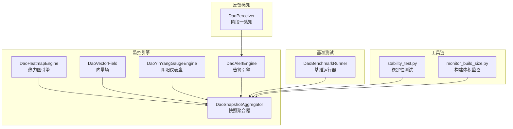
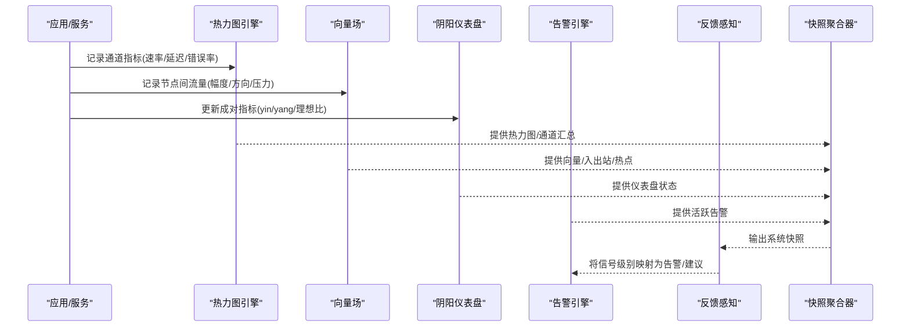
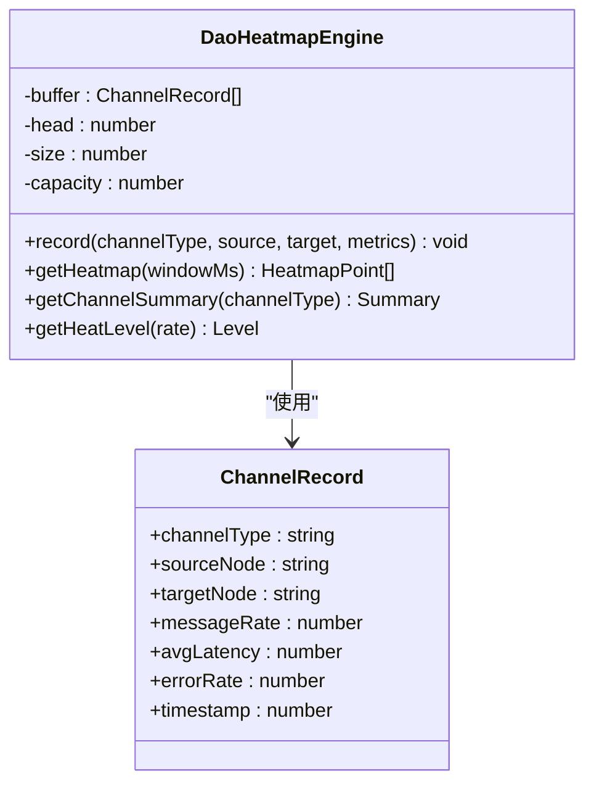
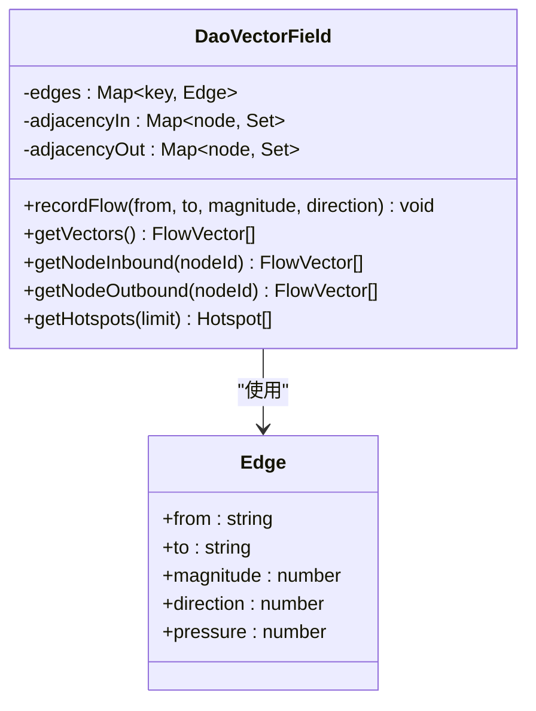
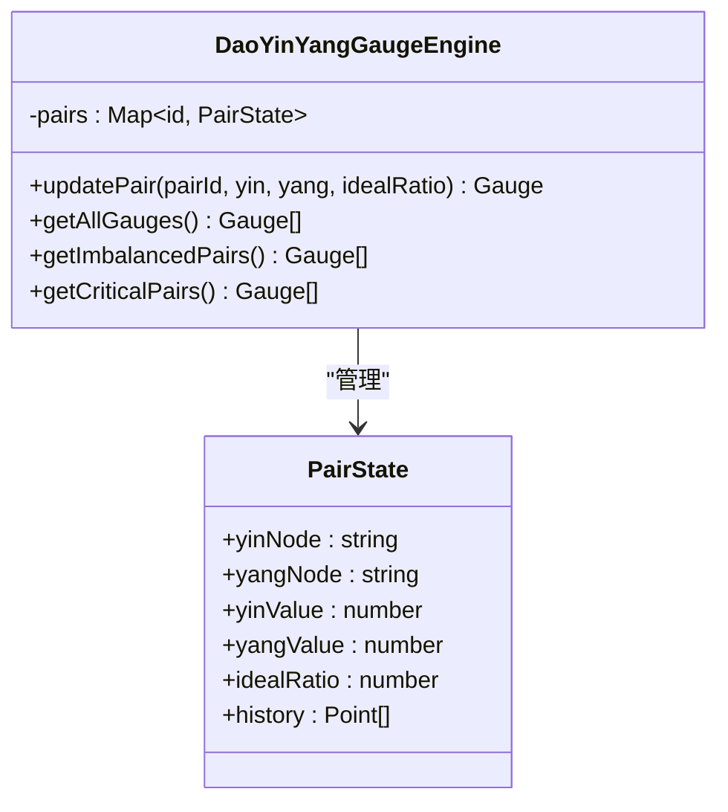
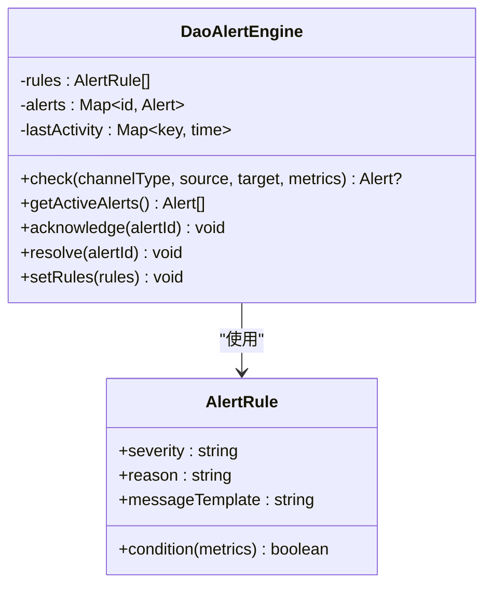
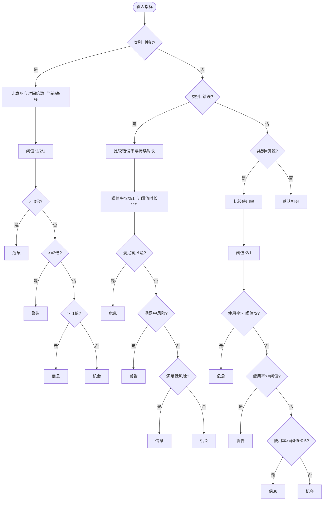
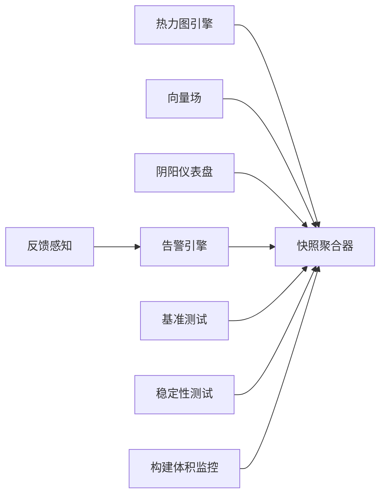

# 性能监控系统

<cite>
**本文引用的文件**
- [apps/DaoMind/tests/test-monitor-system.test.ts](file://apps/DaoMind/tests/test-monitor-system.test.ts)
- [apps/DaoMind/packages/daoMonitor/src/index.ts](file://apps/DaoMind/packages/daoMonitor/src/index.ts)
- [apps/DaoMind/packages/daoMonitor/src/heatmap.ts](file://apps/DaoMind/packages/daoMonitor/src/heatmap.ts)
- [apps/DaoMind/packages/daoMonitor/src/vector-field.ts](file://apps/DaoMind/packages/daoMonitor/src/vector-field.ts)
- [apps/DaoMind/packages/daoMonitor/src/gauge.ts](file://apps/DaoMind/packages/daoMonitor/src/gauge.ts)
- [apps/DaoMind/packages/daoMonitor/src/alerts.ts](file://apps/DaoMind/packages/daoMonitor/src/alerts.ts)
- [apps/DaoMind/packages/daoMonitor/src/__tests__/heatmap.test.ts](file://apps/DaoMind/packages/daoMonitor/src/__tests__/heatmap.test.ts)
- [apps/DaoMind/packages/daoFeedback/src/stage1-perceive.ts](file://apps/DaoMind/packages/daoFeedback/src/stage1-perceive.ts)
- [apps/DaoMind/packages/daoFeedback/src/__tests__/stage1-perceive.test.ts](file://apps/DaoMind/packages/daoFeedback/src/__tests__/stage1-perceive.test.ts)
- [apps/DaoMind/packages/daoBenchmark/src/index.ts](file://apps/DaoMind/packages/daoBenchmark/src/index.ts)
- [tools/DeepResearch/tests/performance/stability_test.py](file://tools/DeepResearch/tests/performance/stability_test.py)
- [tools/flexloop/doc/scripts/monitor_build_size.py](file://tools/flexloop/doc/scripts/monitor_build_size.py)
</cite>

## 目录
1. [简介](#简介)
2. [项目结构](#项目结构)
3. [核心组件](#核心组件)
4. [架构总览](#架构总览)
5. [组件详解](#组件详解)
6. [依赖关系分析](#依赖关系分析)
7. [性能考量](#性能考量)
8. [故障排查指南](#故障排查指南)
9. [结论](#结论)
10. [附录](#附录)

## 简介
本文件面向DaoMind性能监控系统，系统性阐述性能指标采集、存储与分析机制，覆盖应用响应时间、吞吐量、资源利用率等关键指标；梳理数据流架构、事件处理管道与存储策略；给出监控点配置、阈值告警设置、性能基准测试的实施方法，并提供可直接参考的代码示例路径与最佳实践、故障排查建议。

## 项目结构
DaoMind性能监控体系由“监控引擎”“反馈感知”“基准测试”“稳定性测试”等模块组成，核心位于packages/daoMonitor，配套在packages/daoFeedback提供信号评估，在packages/daoBenchmark提供基准测试能力；同时工具链中包含稳定性测试与构建体积监控脚本以支撑全链路性能保障。

图表来源
- [apps/DaoMind/packages/daoMonitor/src/index.ts:1-17](file://apps/DaoMind/packages/daoMonitor/src/index.ts#L1-L17)
- [apps/DaoMind/packages/daoMonitor/src/heatmap.ts:1-100](file://apps/DaoMind/packages/daoMonitor/src/heatmap.ts#L1-L100)
- [apps/DaoMind/packages/daoMonitor/src/vector-field.ts:1-80](file://apps/DaoMind/packages/daoMonitor/src/vector-field.ts#L1-L80)
- [apps/DaoMind/packages/daoMonitor/src/gauge.ts:1-104](file://apps/DaoMind/packages/daoMonitor/src/gauge.ts#L1-L104)
- [apps/DaoMind/packages/daoMonitor/src/alerts.ts:1-122](file://apps/DaoMind/packages/daoMonitor/src/alerts.ts#L1-L122)
- [apps/DaoMind/packages/daoFeedback/src/stage1-perceive.ts:55-83](file://apps/DaoMind/packages/daoFeedback/src/stage1-perceive.ts#L55-L83)
- [apps/DaoMind/packages/daoBenchmark/src/index.ts:1-16](file://apps/DaoMind/packages/daoBenchmark/src/index.ts#L1-L16)
- [tools/DeepResearch/tests/performance/stability_test.py:154-201](file://tools/DeepResearch/tests/performance/stability_test.py#L154-L201)
- [tools/flexloop/doc/scripts/monitor_build_size.py](file://tools/flexloop/doc/scripts/monitor_build_size.py)

章节来源
- [apps/DaoMind/packages/daoMonitor/src/index.ts:1-17](file://apps/DaoMind/packages/daoMonitor/src/index.ts#L1-L17)

## 核心组件
- 热力图引擎：记录通道级吞吐、延迟、错误率，支持时间窗口筛选与通道汇总统计。
- 向量场：记录节点间流量向量，计算入/出站流量与热点节点。
- 阴阳仪表盘：按成对指标动态评估平衡状态，输出状态与偏差。
- 告警引擎：基于规则条件触发告警，支持活跃告警查询与告警生命周期管理。
- 快照聚合器：统一采集各引擎状态，形成系统快照并维护历史。
- 反馈感知：根据阈值规则将性能/错误/资源等指标映射为信号级别。
- 基准测试：提供启动时延、内存基线、吞吐、反馈延迟、收敛时间、包体大小等测量套件。

章节来源
- [apps/DaoMind/packages/daoMonitor/src/heatmap.ts:1-100](file://apps/DaoMind/packages/daoMonitor/src/heatmap.ts#L1-L100)
- [apps/DaoMind/packages/daoMonitor/src/vector-field.ts:1-80](file://apps/DaoMind/packages/daoMonitor/src/vector-field.ts#L1-L80)
- [apps/DaoMind/packages/daoMonitor/src/gauge.ts:1-104](file://apps/DaoMind/packages/daoMonitor/src/gauge.ts#L1-L104)
- [apps/DaoMind/packages/daoMonitor/src/alerts.ts:1-122](file://apps/DaoMind/packages/daoMonitor/src/alerts.ts#L1-L122)
- [apps/DaoMind/packages/daoMonitor/src/index.ts:1-17](file://apps/DaoMind/packages/daoMonitor/src/index.ts#L1-L17)
- [apps/DaoMind/packages/daoFeedback/src/stage1-perceive.ts:55-83](file://apps/DaoMind/packages/daoFeedback/src/stage1-perceive.ts#L55-L83)
- [apps/DaoMind/packages/daoBenchmark/src/index.ts:1-16](file://apps/DaoMind/packages/daoBenchmark/src/index.ts#L1-L16)

## 架构总览
下图展示从数据采集到告警与诊断的端到端流程，以及与反馈感知、基准测试、稳定性测试的协同关系。

图表来源
- [apps/DaoMind/packages/daoMonitor/src/heatmap.ts:24-63](file://apps/DaoMind/packages/daoMonitor/src/heatmap.ts#L24-L63)
- [apps/DaoMind/packages/daoMonitor/src/vector-field.ts:20-78](file://apps/DaoMind/packages/daoMonitor/src/vector-field.ts#L20-L78)
- [apps/DaoMind/packages/daoMonitor/src/gauge.ts:17-62](file://apps/DaoMind/packages/daoMonitor/src/gauge.ts#L17-L62)
- [apps/DaoMind/packages/daoMonitor/src/alerts.ts:66-98](file://apps/DaoMind/packages/daoMonitor/src/alerts.ts#L66-L98)
- [apps/DaoMind/packages/daoMonitor/src/index.ts:11-16](file://apps/DaoMind/packages/daoMonitor/src/index.ts#L11-L16)
- [apps/DaoMind/packages/daoFeedback/src/stage1-perceive.ts:55-83](file://apps/DaoMind/packages/daoFeedback/src/stage1-perceive.ts#L55-L83)

## 组件详解

### 热力图引擎（DaoHeatmapEngine）
- 存储策略：环形缓冲区，固定容量，支持时间窗口过滤与通道汇总。
- 关键能力：
  - 记录通道指标：速率、延迟、错误率。
  - 时间窗口查询：按毫秒窗口返回最近数据。
  - 通道汇总：计算通道总速率、平均延迟、平均错误率与活动流数。
  - 热度等级：依据速率划分冷/温/热/炽热等级。
- 复杂度与性能：
  - 记录O(1)，时间窗口查询O(n)，通道汇总O(n)。

图表来源
- [apps/DaoMind/packages/daoMonitor/src/heatmap.ts:15-99](file://apps/DaoMind/packages/daoMonitor/src/heatmap.ts#L15-L99)

章节来源
- [apps/DaoMind/packages/daoMonitor/src/heatmap.ts:1-100](file://apps/DaoMind/packages/daoMonitor/src/heatmap.ts#L1-L100)
- [apps/DaoMind/packages/daoMonitor/src/__tests__/heatmap.test.ts:1-134](file://apps/DaoMind/packages/daoMonitor/src/__tests__/heatmap.test.ts#L1-L134)

### 向量场（DaoVectorField）
- 存储策略：邻接表+边集合，支持入/出站查询与热点识别。
- 关键能力：
  - 记录流量：幅度、方向、压力。
  - 查询接口：获取所有向量、节点入/出站向量。
  - 热点识别：按总吞吐排序的热点节点列表。
- 复杂度与性能：
  - 记录O(1)，查询O(deg)或O(E)，热点排序O(V log V)。

图表来源
- [apps/DaoMind/packages/daoMonitor/src/vector-field.ts:11-79](file://apps/DaoMind/packages/daoMonitor/src/vector-field.ts#L11-L79)

章节来源
- [apps/DaoMind/packages/daoMonitor/src/vector-field.ts:1-80](file://apps/DaoMind/packages/daoMonitor/src/vector-field.ts#L1-L80)

### 阴阳仪表盘（DaoYinYangGaugeEngine）
- 动态评估：基于yin/yang值与理想比计算偏差，判定平衡/盈阴/盈阳/危急状态。
- 历史追踪：维护固定长度的历史队列，便于趋势分析。
- 输出：仪表盘对象包含比率、偏差、状态与时间戳。

图表来源
- [apps/DaoMind/packages/daoMonitor/src/gauge.ts:14-103](file://apps/DaoMind/packages/daoMonitor/src/gauge.ts#L14-L103)

章节来源
- [apps/DaoMind/packages/daoMonitor/src/gauge.ts:1-104](file://apps/DaoMind/packages/daoMonitor/src/gauge.ts#L1-L104)

### 告警引擎（DaoAlertEngine）
- 规则驱动：内置默认规则（拥塞、断连、延迟尖峰、错误激增），支持自定义规则。
- 生命周期：检测到触发后生成告警，支持确认与解决。
- 查询接口：获取活跃告警集合。

图表来源
- [apps/DaoMind/packages/daoMonitor/src/alerts.ts:61-121](file://apps/DaoMind/packages/daoMonitor/src/alerts.ts#L61-L121)

章节来源
- [apps/DaoMind/packages/daoMonitor/src/alerts.ts:1-122](file://apps/DaoMind/packages/daoMonitor/src/alerts.ts#L1-L122)

### 快照聚合器（DaoSnapshotAggregator）
- 职责：统一采集各引擎状态，生成系统快照并维护历史。
- 使用方式：在测试中作为组合器注入各引擎实例进行集成验证。

章节来源
- [apps/DaoMind/tests/test-monitor-system.test.ts:44-53](file://apps/DaoMind/tests/test-monitor-system.test.ts#L44-L53)

### 反馈感知（DaoPerceiver）
- 能力：将性能/错误/资源等指标映射为信号级别（机会/信息/警告/危急）。
- 配置：支持阈值参数化，便于按场景调整敏感度。

图表来源
- [apps/DaoMind/packages/daoFeedback/src/stage1-perceive.ts:55-83](file://apps/DaoMind/packages/daoFeedback/src/stage1-perceive.ts#L55-L83)

章节来源
- [apps/DaoMind/packages/daoFeedback/src/stage1-perceive.ts:55-83](file://apps/DaoMind/packages/daoFeedback/src/stage1-perceive.ts#L55-L83)
- [apps/DaoMind/packages/daoFeedback/src/__tests__/stage1-perceive.test.ts:1-209](file://apps/DaoMind/packages/daoFeedback/src/__tests__/stage1-perceive.test.ts#L1-L209)

### 基准测试（DaoBenchmarkRunner）
- 能力：提供启动时延、内存基线、吞吐、反馈延迟、收敛时间、包体大小等测量套件。
- 使用：通过导出的测量函数在目标环境中执行基准采集与报告生成。

章节来源
- [apps/DaoMind/packages/daoBenchmark/src/index.ts:1-16](file://apps/DaoMind/packages/daoBenchmark/src/index.ts#L1-L16)

### 稳定性测试与构建监控
- 稳定性测试：采集CPU/内存/响应时间等指标，统计成功率、均值/最大/最小/标准差，检测内存泄漏趋势。
- 构建体积监控：脚本用于监控构建产物尺寸变化，辅助性能回归。

章节来源
- [tools/DeepResearch/tests/performance/stability_test.py:154-201](file://tools/DeepResearch/tests/performance/stability_test.py#L154-L201)
- [tools/flexloop/doc/scripts/monitor_build_size.py](file://tools/flexloop/doc/scripts/monitor_build_size.py)

## 依赖关系分析
- 模块内聚：监控引擎内部各组件职责清晰，数据结构简单，耦合度低。
- 外部依赖：告警引擎依赖规则配置；反馈感知依赖阈值配置；基准测试与稳定性测试独立于监控引擎但共同参与系统性能闭环。
- 循环依赖：未见循环依赖迹象。

图表来源
- [apps/DaoMind/packages/daoMonitor/src/index.ts:1-17](file://apps/DaoMind/packages/daoMonitor/src/index.ts#L1-L17)
- [apps/DaoMind/packages/daoFeedback/src/stage1-perceive.ts:55-83](file://apps/DaoMind/packages/daoFeedback/src/stage1-perceive.ts#L55-L83)
- [apps/DaoMind/packages/daoBenchmark/src/index.ts:1-16](file://apps/DaoMind/packages/daoBenchmark/src/index.ts#L1-L16)
- [tools/DeepResearch/tests/performance/stability_test.py:154-201](file://tools/DeepResearch/tests/performance/stability_test.py#L154-L201)
- [tools/flexloop/doc/scripts/monitor_build_size.py](file://tools/flexloop/doc/scripts/monitor_build_size.py)

## 性能考量
- 数据结构选择
  - 环形缓冲区适合高频写入的热力图数据，避免频繁扩容与GC。
  - 邻接表适合稀疏图的向量场，查询入/出站向量高效。
- 复杂度权衡
  - 通道汇总与热力图排序在数据量大时可能成为瓶颈，建议结合时间窗口限制与采样策略。
  - 向量场热点排序在节点规模较大时需关注排序成本，可考虑分桶聚合。
- 内存与CPU
  - 告警引擎使用Map存储告警与活动时间，注意清理过期告警以控制内存增长。
  - 反馈感知阈值参数化，避免硬编码阈值导致误报/漏报。
- I/O与持久化
  - 当前引擎为内存态，若需长期存储，建议在快照聚合器处接入持久化层（如序列化快照、写入时序数据库）。

## 故障排查指南
- 热力图无数据
  - 检查是否正确记录通道指标；确认时间窗口参数是否过短导致空集。
  - 参考：[热力图测试用例:121-124](file://apps/DaoMind/packages/daoMonitor/src/__tests__/heatmap.test.ts#L121-L124)
- 向量场热点异常
  - 检查节点入/出站记录是否完整；确认magnitude累加逻辑。
  - 参考：[向量场热点计算:60-78](file://apps/DaoMind/packages/daoMonitor/src/vector-field.ts#L60-L78)
- 仪表盘状态不更新
  - 确认updatePair调用频率与理想比设置；检查历史队列长度是否被截断。
  - 参考：[仪表盘状态判定:41-48](file://apps/DaoMind/packages/daoMonitor/src/gauge.ts#L41-L48)
- 告警未触发
  - 校验规则条件与阈值；确认check传入的metrics字段齐全。
  - 参考：[默认规则:14-57](file://apps/DaoMind/packages/daoMonitor/src/alerts.ts#L14-L57)
- 反馈感知级别异常
  - 检查阈值配置与指标归一化（如响应时间/基线）。
  - 参考：[信号级别评估:55-83](file://apps/DaoMind/packages/daoFeedback/src/stage1-perceive.ts#L55-L83)
- 稳定性测试内存泄漏
  - 关注RSS趋势与阈值；必要时缩小样本窗口或降低并发。
  - 参考：[稳定性测试统计:154-201](file://tools/DeepResearch/tests/performance/stability_test.py#L154-L201)

章节来源
- [apps/DaoMind/packages/daoMonitor/src/__tests__/heatmap.test.ts:1-134](file://apps/DaoMind/packages/daoMonitor/src/__tests__/heatmap.test.ts#L1-L134)
- [apps/DaoMind/packages/daoMonitor/src/vector-field.ts:60-78](file://apps/DaoMind/packages/daoMonitor/src/vector-field.ts#L60-L78)
- [apps/DaoMind/packages/daoMonitor/src/gauge.ts:41-48](file://apps/DaoMind/packages/daoMonitor/src/gauge.ts#L41-L48)
- [apps/DaoMind/packages/daoMonitor/src/alerts.ts:14-57](file://apps/DaoMind/packages/daoMonitor/src/alerts.ts#L14-L57)
- [apps/DaoMind/packages/daoFeedback/src/stage1-perceive.ts:55-83](file://apps/DaoMind/packages/daoFeedback/src/stage1-perceive.ts#L55-L83)
- [tools/DeepResearch/tests/performance/stability_test.py:154-201](file://tools/DeepResearch/tests/performance/stability_test.py#L154-L201)

## 结论
DaoMind性能监控系统以轻量内存态引擎为核心，围绕通道级热力图、节点间向量场、成对指标仪表盘与规则驱动告警构成完整的可观测闭环，并通过反馈感知将指标转化为可操作的信号级别。配合基准测试与稳定性测试，形成从采集、评估、告警到回归验证的全链路性能保障体系。建议在生产环境引入持久化与采样策略，持续优化热点计算与排序成本，确保系统在高并发下的稳定与高效。

## 附录

### 配置与使用示例（代码路径）
- 快照聚合器集成与使用
  - [快照聚合器构造与使用:44-53](file://apps/DaoMind/tests/test-monitor-system.test.ts#L44-L53)
  - [热力图引擎记录与查询:78-101](file://apps/DaoMind/tests/test-monitor-system.test.ts#L78-L101)
  - [向量场记录与热点查询:102-131](file://apps/DaoMind/tests/test-monitor-system.test.ts#L102-L131)
  - [告警引擎规则设置与检查:133-174](file://apps/DaoMind/tests/test-monitor-system.test.ts#L133-L174)
  - [阴阳仪表盘更新与查询:55-77](file://apps/DaoMind/tests/test-monitor-system.test.ts#L55-L77)
- 反馈感知阈值配置与信号评估
  - [阈值配置与评估逻辑:55-83](file://apps/DaoMind/packages/daoFeedback/src/stage1-perceive.ts#L55-L83)
  - [单元测试用例:14-28](file://apps/DaoMind/packages/daoFeedback/src/__tests__/stage1-perceive.test.ts#L14-L28)
- 基准测试套件
  - [导出的测量函数:9-15](file://apps/DaoMind/packages/daoBenchmark/src/index.ts#L9-L15)

### 查询优化与最佳实践
- 查询优化
  - 热力图：优先使用时间窗口参数缩小扫描范围；避免对全量数据排序，必要时分页或采样。
  - 向量场：热点排序仅在需要时触发；对大规模网络可先做节点维度聚合。
  - 仪表盘：历史队列长度固定，避免无限增长；定期清理过期状态。
  - 告警：规则合并与去重，减少重复匹配开销；活跃告警集合按需刷新。
- 最佳实践
  - 指标命名与单位标准化，确保跨组件一致性。
  - 阈值参数化与灰度发布，逐步收敛至最优阈值。
  - 将快照聚合器输出接入日志/时序数据库，保留审计轨迹。
  - 在CI中集成基准测试与稳定性测试，建立性能回归基线。