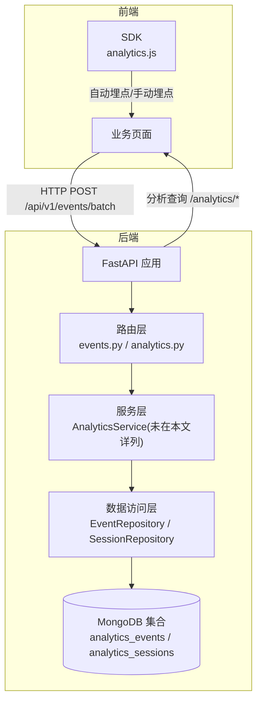
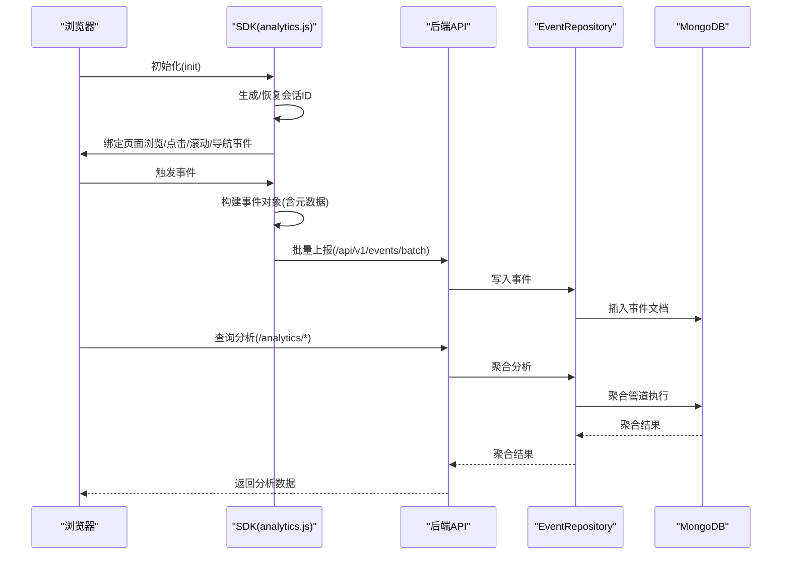
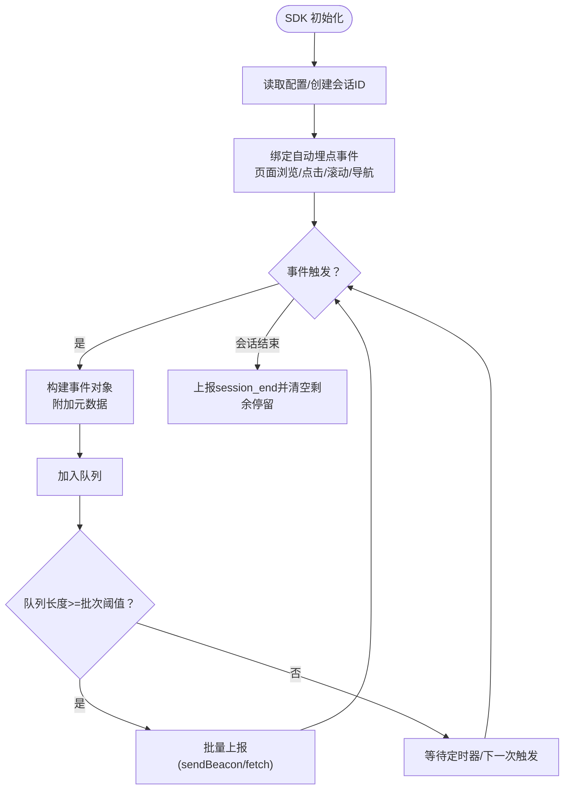
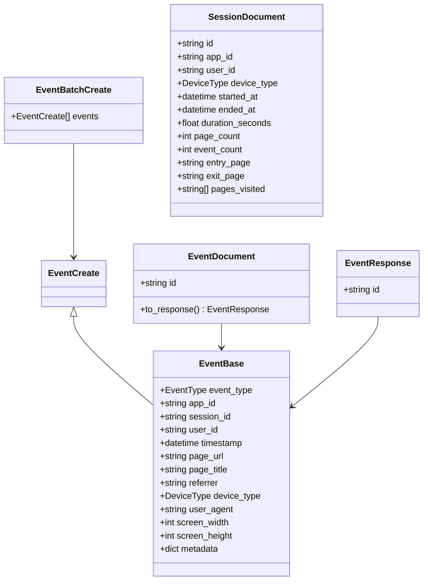
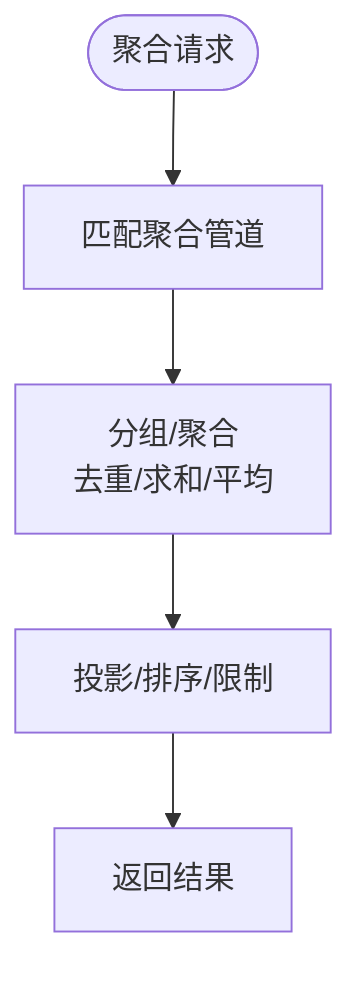
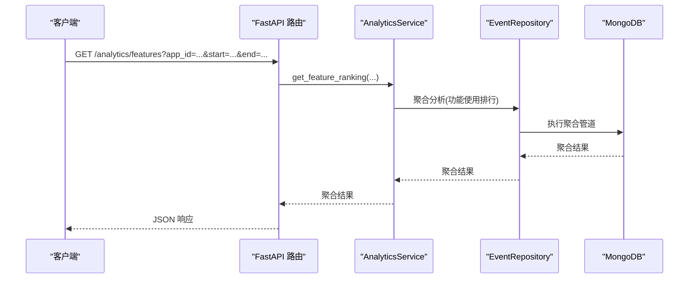
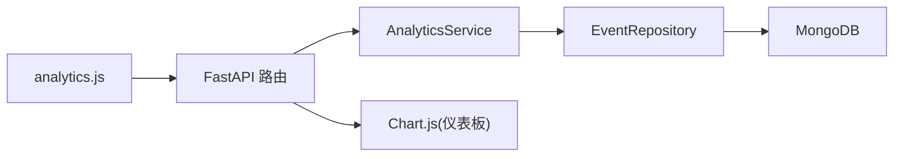

# 用户行为分析

<cite>
**本文引用的文件**
- [analytics.js](file://tools/flexloop/src/taolib/testing/analytics/sdk/analytics.js)
- [event.py](file://tools/flexloop/src/taolib/testing/analytics/models/event.py)
- [enums.py](file://tools/flexloop/src/taolib/testing/analytics/models/enums.py)
- [event_repo.py](file://tools/flexloop/src/taolib/testing/analytics/repository/event_repo.py)
- [analytics.py](file://tools/flexloop/src/taolib/testing/analytics/server/api/analytics.py)
- [events.py](file://tools/flexloop/src/taolib/testing/analytics/server/api/events.py)
- [config.py](file://tools/flexloop/src/taolib/testing/analytics/server/config.py)
- [app.py](file://tools/flexloop/src/taolib/testing/analytics/server/app.py)
- [main.py](file://tools/flexloop/src/taolib/testing/analytics/server/main.py)
- [AgentAnalytics.tsx](file://apps/AgentPit/src-react-backup-20260410/components/customize/AgentAnalytics.tsx)
</cite>

## 目录
1. [简介](#简介)
2. [项目结构](#项目结构)
3. [核心组件](#核心组件)
4. [架构总览](#架构总览)
5. [详细组件分析](#详细组件分析)
6. [依赖关系分析](#依赖关系分析)
7. [性能考量](#性能考量)
8. [故障排查指南](#故障排查指南)
9. [结论](#结论)
10. [附录](#附录)

## 简介
本技术文档面向DaoMind用户行为分析系统，围绕事件采集、分类、存储与分析全流程进行系统化说明。重点覆盖：
- 事件采集：浏览器端SDK自动采集页面浏览、点击、功能使用、会话时长、区域停留、导航路径等事件。
- 会话管理：基于本地存储的会话生命周期管理与超时控制。
- 用户画像：通过事件聚合与会话维度统计，形成用户行为画像与趋势分析。
- 分析能力：提供概览统计、转化漏斗、功能使用排行、用户路径、区域停留、流失分析等高级分析功能。
- 可视化展示：内置仪表板与图表渲染，支持实时刷新与交互。
- SDK集成：提供最小化SDK接入方案与埋点配置建议。

## 项目结构
DaoMind用户行为分析系统由“前端SDK + 后端API + 数据存储”三层构成：
- 前端SDK：负责事件采集、会话管理、自动埋点与批量上报。
- 后端API：提供事件摄入接口与分析查询接口，内置仪表板。
- 数据存储：MongoDB集合存储事件与会话，并建立相应索引以支撑聚合分析。

图示来源
- [analytics.js:176-367](file://tools/flexloop/src/taolib/testing/analytics/sdk/analytics.js#L176-L367)
- [events.py:38-61](file://tools/flexloop/src/taolib/testing/analytics/server/api/events.py#L38-L61)
- [analytics.py:54-341](file://tools/flexloop/src/taolib/testing/analytics/server/api/analytics.py#L54-L341)
- [app.py:65-95](file://tools/flexloop/src/taolib/testing/analytics/server/app.py#L65-L95)

章节来源
- [app.py:1-243](file://tools/flexloop/src/taolib/testing/analytics/server/app.py#L1-L243)
- [main.py:1-48](file://tools/flexloop/src/taolib/testing/analytics/server/main.py#L1-L48)

## 核心组件
- SDK（analytics.js）
  - 会话管理：生成并持久化会话ID，支持超时续期与会话结束事件。
  - 自动埋点：页面浏览、点击、区域停留、导航路径、会话生命周期事件。
  - 手动埋点：track、trackFeature、identify、flush等API。
  - 上报策略：队列缓存、批量发送、sendBeacon优先、定时flush。
- 数据模型（event.py / enums.py）
  - 事件模型：统一事件字段与响应模型；会话聚合模型。
  - 枚举类型：事件类型、设备类型。
- 数据访问（event_repo.py）
  - 事件入库、按会话/应用/时间查询。
  - 聚合分析：漏斗、功能使用排行、导航路径、区域停留、流失分析、概览统计。
  - 索引设计：加速查询与聚合。
- API路由（events.py / analytics.py）
  - 事件摄入：单条/批量上报，API Key校验。
  - 分析查询：概览、漏斗、功能排行、路径、停留、流失。
- 配置与启动（config.py / app.py / main.py）
  - 配置项：MongoDB连接、CORS、API Key、TTL、批量大小。
  - 应用生命周期：数据库连接、索引创建、SDK文件提供、仪表板页面。

章节来源
- [analytics.js:1-451](file://tools/flexloop/src/taolib/testing/analytics/sdk/analytics.js#L1-L451)
- [event.py:1-105](file://tools/flexloop/src/taolib/testing/analytics/models/event.py#L1-L105)
- [enums.py:1-31](file://tools/flexloop/src/taolib/testing/analytics/models/enums.py#L1-L31)
- [event_repo.py:1-469](file://tools/flexloop/src/taolib/testing/analytics/repository/event_repo.py#L1-L469)
- [events.py:1-63](file://tools/flexloop/src/taolib/testing/analytics/server/api/events.py#L1-L63)
- [analytics.py:1-343](file://tools/flexloop/src/taolib/testing/analytics/server/api/analytics.py#L1-L343)
- [config.py:1-51](file://tools/flexloop/src/taolib/testing/analytics/server/config.py#L1-L51)
- [app.py:1-243](file://tools/flexloop/src/taolib/testing/analytics/server/app.py#L1-L243)
- [main.py:1-48](file://tools/flexloop/src/taolib/testing/analytics/server/main.py#L1-L48)

## 架构总览
系统采用前后端分离架构，前端通过SDK自动/手动采集事件，后端提供REST API与分析查询，数据持久化于MongoDB。整体流程如下：

图示来源
- [analytics.js:176-367](file://tools/flexloop/src/taolib/testing/analytics/sdk/analytics.js#L176-L367)
- [events.py:38-61](file://tools/flexloop/src/taolib/testing/analytics/server/api/events.py#L38-L61)
- [event_repo.py:23-91](file://tools/flexloop/src/taolib/testing/analytics/repository/event_repo.py#L23-L91)
- [analytics.py:54-341](file://tools/flexloop/src/taolib/testing/analytics/server/api/analytics.py#L54-L341)

## 详细组件分析

### SDK（analytics.js）组件分析
SDK提供轻量级事件采集与上报能力，具备以下特性：
- 会话管理：本地存储会话ID与最后活跃时间，超时（默认30分钟）后重新生成。
- 自动埋点：
  - 页面浏览：history API拦截与popstate事件触发。
  - 点击事件：向上遍历DOM查找data-track-feature/data-track-category，自动上报功能使用事件。
  - 区域停留：IntersectionObserver检测可见性变化，计算停留时长。
  - 导航路径：记录from_page与to_page。
  - 会话生命周期：session_start/session_end。
- 手动埋点：track、trackFeature、identify、flush。
- 上报策略：队列缓存（默认20条），定时flush（默认5秒），sendBeacon优先，失败回退fetch。

图示来源
- [analytics.js:84-174](file://tools/flexloop/src/taolib/testing/analytics/sdk/analytics.js#L84-L174)
- [analytics.js:176-367](file://tools/flexloop/src/taolib/testing/analytics/sdk/analytics.js#L176-L367)

章节来源
- [analytics.js:1-451](file://tools/flexloop/src/taolib/testing/analytics/sdk/analytics.js#L1-L451)

### 数据模型与枚举（event.py / enums.py）
- 事件模型：包含事件类型、应用ID、会话ID、用户ID、时间戳、页面信息、设备信息、屏幕尺寸、扩展元数据等。
- 会话聚合模型：用于会话维度的统计与画像。
- 枚举类型：事件类型（页面浏览、点击、功能使用、会话开始/结束、导航、区域停留、自定义）、设备类型（桌面、移动、平板、未知）。

图示来源
- [event.py:17-105](file://tools/flexloop/src/taolib/testing/analytics/models/event.py#L17-L105)
- [enums.py:9-31](file://tools/flexloop/src/taolib/testing/analytics/models/enums.py#L9-L31)

章节来源
- [event.py:1-105](file://tools/flexloop/src/taolib/testing/analytics/models/event.py#L1-L105)
- [enums.py:1-31](file://tools/flexloop/src/taolib/testing/analytics/models/enums.py#L1-L31)

### 数据访问层（event_repo.py）
- 事件入库：批量插入事件。
- 查询接口：按会话、按应用+时间范围查询。
- 聚合分析：
  - 转化漏斗：按步骤统计去重会话数。
  - 功能使用排行：按功能名与类别统计使用次数与去重会话数。
  - 导航路径：按会话序列提取相邻页面对，统计出现频次。
  - 区域停留：按section_id统计平均停留时长与总访问次数。
  - 流失分析：按流程步骤统计进入/完成/流失率。
  - 概览统计：总事件数、去重会话数、去重用户数、热门页面、事件类型分布。
- 索引设计：加速应用+时间、应用+事件类型、会话+时间、功能使用聚合、TTL自动清理。

图示来源
- [event_repo.py:93-134](file://tools/flexloop/src/taolib/testing/analytics/repository/event_repo.py#L93-L134)
- [event_repo.py:136-185](file://tools/flexloop/src/taolib/testing/analytics/repository/event_repo.py#L136-L185)
- [event_repo.py:187-254](file://tools/flexloop/src/taolib/testing/analytics/repository/event_repo.py#L187-L254)
- [event_repo.py:256-298](file://tools/flexloop/src/taolib/testing/analytics/repository/event_repo.py#L256-L298)
- [event_repo.py:300-359](file://tools/flexloop/src/taolib/testing/analytics/repository/event_repo.py#L300-L359)
- [event_repo.py:361-441](file://tools/flexloop/src/taolib/testing/analytics/repository/event_repo.py#L361-L441)

章节来源
- [event_repo.py:1-469](file://tools/flexloop/src/taolib/testing/analytics/repository/event_repo.py#L1-L469)

### API路由与服务（events.py / analytics.py）
- 事件摄入：
  - 单条事件：/api/v1/events
  - 批量事件：/api/v1/events/batch（支持API Key校验与批量大小限制）
- 分析查询：
  - 概览统计：/analytics/overview
  - 转化漏斗：/analytics/funnel
  - 功能使用排行：/analytics/features
  - 导航路径：/analytics/paths
  - 停留分析：/analytics/retention
  - 流失分析：/analytics/drop-off
- 时间范围：均支持start/end参数（ISO 8601），默认最近7天。

图示来源
- [analytics.py:54-341](file://tools/flexloop/src/taolib/testing/analytics/server/api/analytics.py#L54-L341)
- [events.py:38-61](file://tools/flexloop/src/taolib/testing/analytics/server/api/events.py#L38-L61)
- [event_repo.py:136-185](file://tools/flexloop/src/taolib/testing/analytics/repository/event_repo.py#L136-L185)

章节来源
- [analytics.py:1-343](file://tools/flexloop/src/taolib/testing/analytics/server/api/analytics.py#L1-L343)
- [events.py:1-63](file://tools/flexloop/src/taolib/testing/analytics/server/api/events.py#L1-L63)

### 配置与启动（config.py / app.py / main.py）
- 配置项：
  - MongoDB连接、数据库名、监听地址/端口、CORS、API Key、事件/TTL、批量大小限制。
- 应用生命周期：
  - 启动时连接MongoDB，创建事件/会话集合索引与TTL。
  - 提供SDK文件下载与分析仪表板页面。
- CLI启动：支持host/port/reload/log-level参数。

章节来源
- [config.py:1-51](file://tools/flexloop/src/taolib/testing/analytics/server/config.py#L1-L51)
- [app.py:19-95](file://tools/flexloop/src/taolib/testing/analytics/server/app.py#L19-L95)
- [main.py:14-42](file://tools/flexloop/src/taolib/testing/analytics/server/main.py#L14-L42)

### 可视化与前端集成示例
- 内置仪表板：提供概览、漏斗、功能排行、路径、停留、流失、热门页面、事件分布等图表。
- 前端集成示例：AgentPit应用中的智能体数据分析组件，展示了折线图、柱状图、饼图等可视化组件的使用方式，可用于扩展到用户行为分析的前端展示。

章节来源
- [app.py:98-243](file://tools/flexloop/src/taolib/testing/analytics/server/app.py#L98-L243)
- [AgentAnalytics.tsx:1-46](file://apps/AgentPit/src-react-backup-20260410/components/customize/AgentAnalytics.tsx#L1-L46)

## 依赖关系分析
- 组件耦合：
  - SDK仅依赖浏览器环境与localStorage，低耦合。
  - API路由依赖服务层，服务层依赖数据访问层。
  - 数据访问层依赖MongoDB驱动与聚合管道。
- 外部依赖：
  - FastAPI、Motor(MongoDB异步驱动)、Chart.js（前端可视化）。
- 潜在风险：
  - 前端localStorage不可用时会话ID生成与持久化受影响。
  - sendBeacon失败时回退fetch可能受网络影响。
  - 聚合查询复杂度随数据量增长，需合理设置索引与TTL。

图示来源
- [analytics.js:1-451](file://tools/flexloop/src/taolib/testing/analytics/sdk/analytics.js#L1-L451)
- [events.py:27-35](file://tools/flexloop/src/taolib/testing/analytics/server/api/events.py#L27-L35)
- [analytics.py:43-51](file://tools/flexloop/src/taolib/testing/analytics/server/api/analytics.py#L43-L51)
- [event_repo.py:1-469](file://tools/flexloop/src/taolib/testing/analytics/repository/event_repo.py#L1-L469)
- [app.py:90-95](file://tools/flexloop/src/taolib/testing/analytics/server/app.py#L90-L95)

## 性能考量
- 上报策略：
  - 批量阈值与定时flush可平衡实时性与网络开销。
  - sendBeacon优先减少请求丢失概率。
- 存储与索引：
  - 事件集合按(app_id, timestamp)、(app_id, event_type)、(session_id, timestamp)建立复合索引，提升查询与聚合效率。
  - TTL自动清理降低历史数据膨胀。
- 聚合优化：
  - 使用$group/$addToSet/$size/$avg等聚合原语，避免内存中二次处理。
  - 对高频查询设置合理limit，避免大结果集传输。
- 前端体验：
  - IntersectionObserver与MutationObserver动态观测区域停留，避免频繁轮询。
  - 图表渲染采用延迟销毁与复用，减少重复初始化开销。

## 故障排查指南
- SDK未初始化：
  - 现象：调用track/trackFeature/flush时报“未初始化”警告。
  - 排查：确认已正确传入apiUrl与appId，且init在页面加载早期执行。
- 事件未上报：
  - 现象：后台无新增事件。
  - 排查：检查sendBeacon是否被拦截；确认网络连通性；查看浏览器开发者工具Network面板；核对API Key配置。
- 分析数据为空：
  - 现象：/analytics/*接口返回空数据。
  - 排查：确认app_id与时间范围有效；检查MongoDB索引是否创建成功；确认事件已写入analytics_events集合。
- 会话异常：
  - 现象：会话ID频繁变化或无法续期。
  - 排查：检查localStorage可用性；确认SESSION_TIMEOUT与FLUSH_INTERVAL配置；查看visibilitychange/beforeunload事件绑定。
- 性能问题：
  - 现象：聚合查询响应慢。
  - 排查：检查聚合管道执行计划；确认索引命中；适当增加limit；考虑分页或缓存热点数据。

章节来源
- [analytics.js:376-402](file://tools/flexloop/src/taolib/testing/analytics/sdk/analytics.js#L376-L402)
- [events.py:11-25](file://tools/flexloop/src/taolib/testing/analytics/server/api/events.py#L11-L25)
- [app.py:19-56](file://tools/flexloop/src/taolib/testing/analytics/server/app.py#L19-L56)

## 结论
DaoMind用户行为分析系统以轻量SDK为核心，结合后端FastAPI与MongoDB聚合分析，实现了从事件采集到可视化呈现的完整闭环。通过自动埋点与灵活的手动埋点API，能够覆盖页面浏览、功能使用、用户路径、区域停留、会话生命周期等关键行为维度；借助完善的聚合分析与仪表板，可快速定位产品优化方向与用户流失环节。建议在生产环境中关注上报可靠性、索引与TTL配置、以及前端可视化组件的性能优化。

## 附录

### SDK集成指南
- 引入SDK：
  - 在业务页面引入SDK文件，或通过CDN加载。
- 初始化：
  - 调用init(options)，传入apiUrl、appId、apiKey（可选）、flushInterval、batchSize（可选）。
- 手动埋点：
  - track(eventType, metadata)：自定义事件。
  - trackFeature(featureName, category)：功能使用事件。
  - identify(userId)：绑定用户ID。
  - flush()：强制上报队列。
- 自动埋点：
  - 页面浏览、点击、区域停留、导航路径、会话生命周期事件自动采集。

章节来源
- [analytics.js:376-445](file://tools/flexloop/src/taolib/testing/analytics/sdk/analytics.js#L376-L445)

### 事件埋点配置
- 页面浏览：无需额外配置，自动采集。
- 功能使用：在元素上添加data-track-feature与data-track-category属性，SDK自动上报feature_use事件。
- 区域停留：在目标区域添加data-track-section属性，SDK自动上报time_on_section事件。
- 导航路径：自动记录from_page与to_page。
- 会话生命周期：自动上报session_start与session_end。

章节来源
- [analytics.js:204-300](file://tools/flexloop/src/taolib/testing/analytics/sdk/analytics.js#L204-L300)
- [analytics.js:337-367](file://tools/flexloop/src/taolib/testing/analytics/sdk/analytics.js#L337-L367)

### 数据分析查询方法
- 概览统计：GET /analytics/overview?app_id=...&start=...&end=...
- 转化漏斗：GET /analytics/funnel?app_id=...&steps=step1,step2,...&start=...&end=...
- 功能使用排行：GET /analytics/features?app_id=...&start=...&end=...&limit=...
- 导航路径：GET /analytics/paths?app_id=...&start=...&end=...&limit=...
- 停留分析：GET /analytics/retention?app_id=...&start=...&end=...
- 流失分析：GET /analytics/drop-off?app_id=...&steps=step1,step2,...&start=...&end=...

章节来源
- [analytics.py:54-341](file://tools/flexloop/src/taolib/testing/analytics/server/api/analytics.py#L54-L341)

### 可视化展示与高级分析
- 内置仪表板：提供概览、漏斗、功能排行、路径、停留、流失、热门页面、事件分布等图表。
- 高级分析：
  - 趋势分析：基于时间序列聚合，结合前端图表组件展示。
  - 漏斗分析：按步骤统计转化率与总体转化率。
  - 用户画像：结合会话维度统计与功能使用排行，形成用户偏好画像。
- 前端集成示例：参考AgentAnalytics组件，使用recharts等库进行可视化展示。

章节来源
- [app.py:98-243](file://tools/flexloop/src/taolib/testing/analytics/server/app.py#L98-L243)
- [AgentAnalytics.tsx:1-46](file://apps/AgentPit/src-react-backup-20260410/components/customize/AgentAnalytics.tsx#L1-L46)