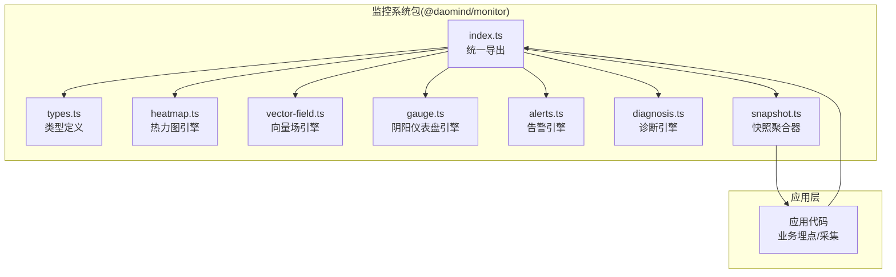
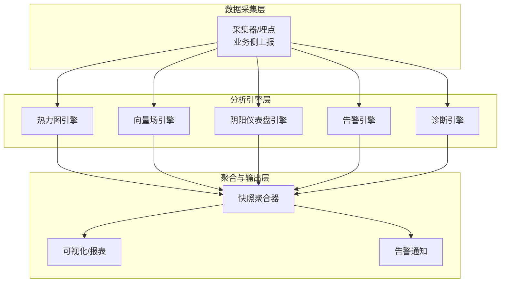
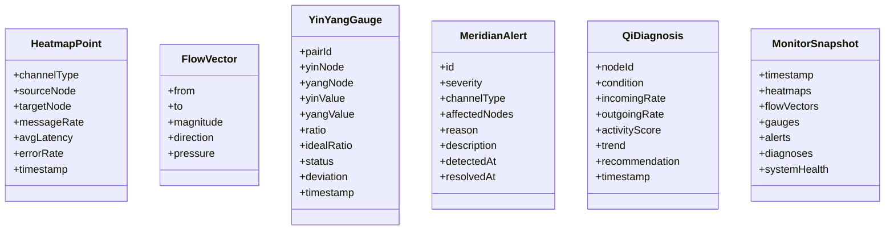
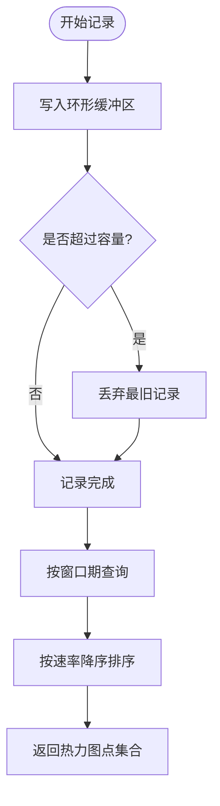
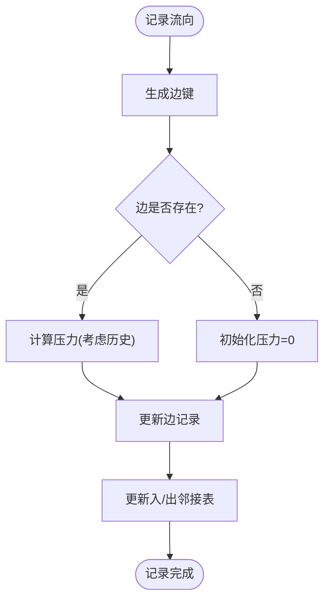
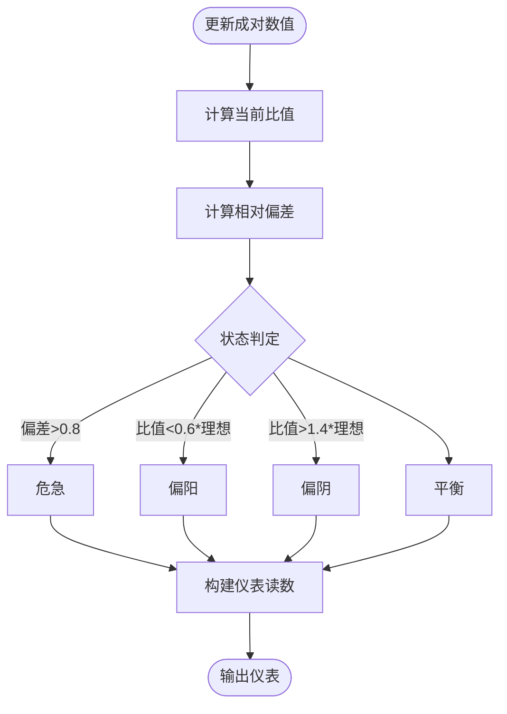
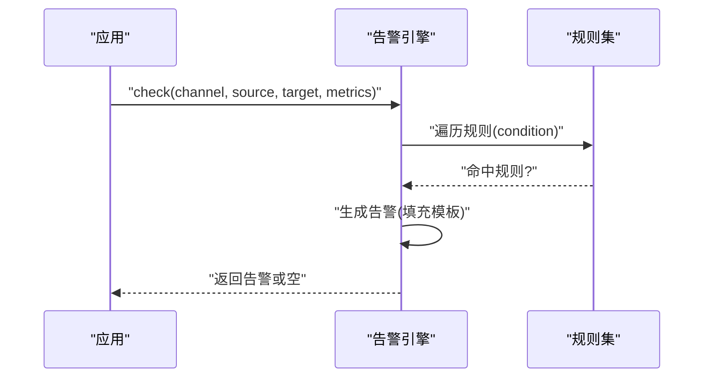
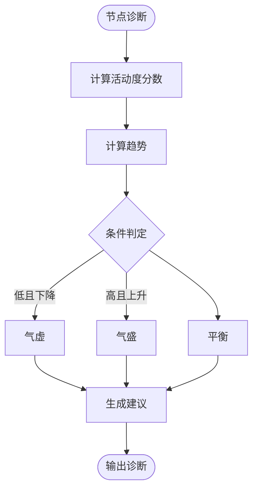
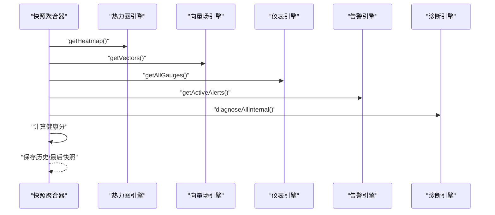
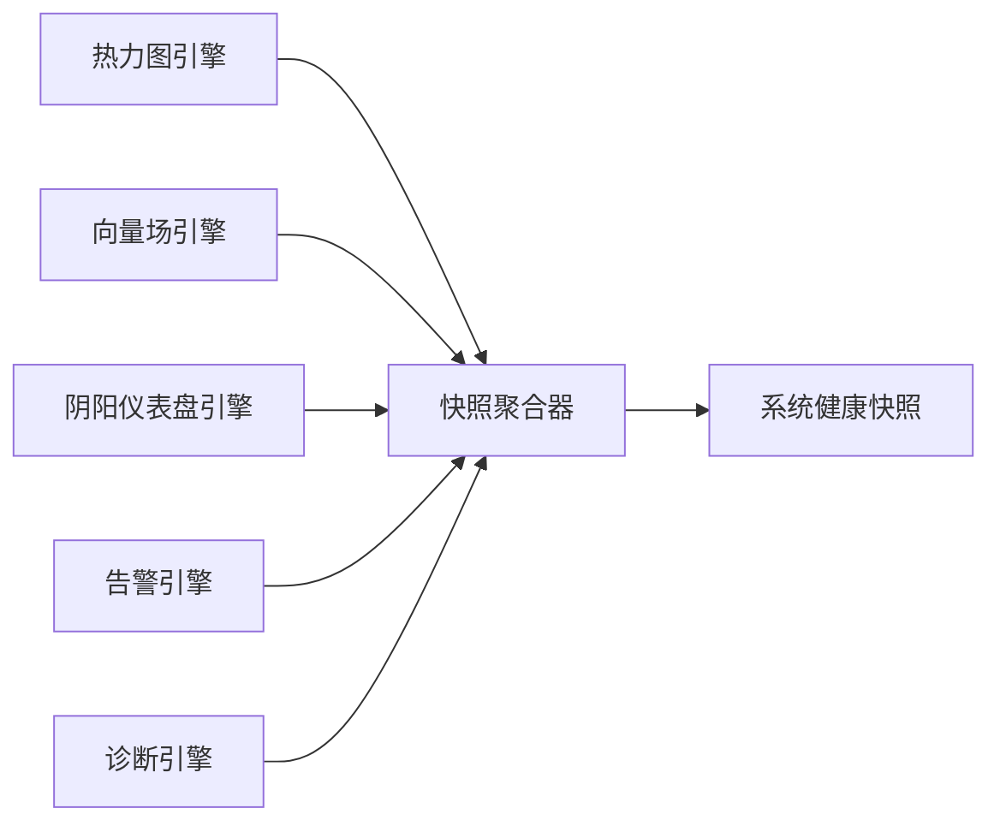

# 监控集成系统

<cite>
**本文引用的文件**
- [apps/DaoMind/README.md](file://apps/DaoMind/README.md)
- [apps/DaoMind/tests/test-monitor-system.test.ts](file://apps/DaoMind/tests/test-monitor-system.test.ts)
- [apps/DaoMind/packages/daoMonitor/src/index.ts](file://apps/DaoMind/packages/daoMonitor/src/index.ts)
- [apps/DaoMind/packages/daoMonitor/src/types.ts](file://apps/DaoMind/packages/daoMonitor/src/types.ts)
- [apps/DaoMind/packages/daoMonitor/src/heatmap.ts](file://apps/DaoMind/packages/daoMonitor/src/heatmap.ts)
- [apps/DaoMind/packages/daoMonitor/src/vector-field.ts](file://apps/DaoMind/packages/daoMonitor/src/vector-field.ts)
- [apps/DaoMind/packages/daoMonitor/src/gauge.ts](file://apps/DaoMind/packages/daoMonitor/src/gauge.ts)
- [apps/DaoMind/packages/daoMonitor/src/alerts.ts](file://apps/DaoMind/packages/daoMonitor/src/alerts.ts)
- [apps/DaoMind/packages/daoMonitor/src/diagnosis.ts](file://apps/DaoMind/packages/daoMonitor/src/diagnosis.ts)
- [apps/DaoMind/packages/daoMonitor/src/snapshot.ts](file://apps/DaoMind/packages/daoMonitor/src/snapshot.ts)
- [tools/DeepResearch/tests/performance/stability_test.py](file://tools/DeepResearch/tests/performance/stability_test.py)
</cite>

## 目录
1. [简介](#简介)
2. [项目结构](#项目结构)
3. [核心组件](#核心组件)
4. [架构总览](#架构总览)
5. [详细组件分析](#详细组件分析)
6. [依赖关系分析](#依赖关系分析)
7. [性能考量](#性能考量)
8. [故障排查指南](#故障排查指南)
9. [结论](#结论)
10. [附录](#附录)

## 简介
本技术文档面向DaoMind监控集成系统，系统以“中医经络”哲学为设计思想，通过热力图、向量场、阴阳仪表盘、告警引擎与诊断引擎等模块，构建一套可视化、可扩展、可演进的系统监控与健康度评估体系。文档覆盖架构设计、指标采集、数据分析、可视化展示、性能监控、用户行为分析、系统健康检查、异常检测机制、数据采集策略、存储方案、查询优化、报表生成、最佳实践、告警配置与故障排查，并给出与日志系统的协同机制说明。

## 项目结构
DaoMind监控系统位于应用工程内的独立包中，对外提供统一入口导出，内部由多个子引擎组成，配合快照聚合器形成完整的监控闭环。测试文件展示了各组件的典型用法与组合方式。

图表来源
- [apps/DaoMind/packages/daoMonitor/src/index.ts:1-17](file://apps/DaoMind/packages/daoMonitor/src/index.ts#L1-L17)
- [apps/DaoMind/packages/daoMonitor/src/types.ts:1-72](file://apps/DaoMind/packages/daoMonitor/src/types.ts#L1-L72)
- [apps/DaoMind/packages/daoMonitor/src/heatmap.ts:1-100](file://apps/DaoMind/packages/daoMonitor/src/heatmap.ts#L1-L100)
- [apps/DaoMind/packages/daoMonitor/src/vector-field.ts:1-80](file://apps/DaoMind/packages/daoMonitor/src/vector-field.ts#L1-L80)
- [apps/DaoMind/packages/daoMonitor/src/gauge.ts:1-104](file://apps/DaoMind/packages/daoMonitor/src/gauge.ts#L1-L104)
- [apps/DaoMind/packages/daoMonitor/src/alerts.ts:1-122](file://apps/DaoMind/packages/daoMonitor/src/alerts.ts#L1-L122)
- [apps/DaoMind/packages/daoMonitor/src/diagnosis.ts:1-75](file://apps/DaoMind/packages/daoMonitor/src/diagnosis.ts#L1-L75)
- [apps/DaoMind/packages/daoMonitor/src/snapshot.ts:1-75](file://apps/DaoMind/packages/daoMonitor/src/snapshot.ts#L1-L75)

章节来源
- [apps/DaoMind/packages/daoMonitor/src/index.ts:1-17](file://apps/DaoMind/packages/daoMonitor/src/index.ts#L1-L17)
- [apps/DaoMind/README.md:201-293](file://apps/DaoMind/README.md#L201-L293)

## 核心组件
- 类型系统(types.ts)：定义气通道类型、热力图点、向量场、阴阳仪表读数、经络告警、气虚/气盛诊断、监控快照等核心数据模型。
- 热力图引擎(heatmap.ts)：记录并聚合通道级流量与质量指标，支持按窗口期筛选与通道汇总统计。
- 向量场引擎(vector-field.ts)：记录节点间流向与压力，支持热点节点识别与邻接关系查询。
- 阴阳仪表盘引擎(gauge.ts)：维护成对的阴阳数值，计算偏差与状态，输出平衡度评估。
- 告警引擎(alerts.ts)：内置默认规则与可扩展规则集，基于指标触发不同严重级别的告警。
- 诊断引擎(diagnosis.ts)：对节点进行气血状态诊断，输出虚实与趋势判断及建议。
- 快照聚合器(snapshot.ts)：整合上述引擎输出，生成系统健康快照，并维护历史与最后快照。

章节来源
- [apps/DaoMind/packages/daoMonitor/src/types.ts:1-72](file://apps/DaoMind/packages/daoMonitor/src/types.ts#L1-L72)
- [apps/DaoMind/packages/daoMonitor/src/heatmap.ts:1-100](file://apps/DaoMind/packages/daoMonitor/src/heatmap.ts#L1-L100)
- [apps/DaoMind/packages/daoMonitor/src/vector-field.ts:1-80](file://apps/DaoMind/packages/daoMonitor/src/vector-field.ts#L1-L80)
- [apps/DaoMind/packages/daoMonitor/src/gauge.ts:1-104](file://apps/DaoMind/packages/daoMonitor/src/gauge.ts#L1-L104)
- [apps/DaoMind/packages/daoMonitor/src/alerts.ts:1-122](file://apps/DaoMind/packages/daoMonitor/src/alerts.ts#L1-L122)
- [apps/DaoMind/packages/daoMonitor/src/diagnosis.ts:1-75](file://apps/DaoMind/packages/daoMonitor/src/diagnosis.ts#L1-L75)
- [apps/DaoMind/packages/daoMonitor/src/snapshot.ts:1-75](file://apps/DaoMind/packages/daoMonitor/src/snapshot.ts#L1-L75)

## 架构总览
系统采用“多引擎+快照聚合”的分层架构：上层业务通过埋点与采集接口向引擎注入数据；引擎各自负责局部领域的建模与分析；快照聚合器统一收敛，形成系统健康画像，供可视化与告警联动使用。

图表来源
- [apps/DaoMind/packages/daoMonitor/src/heatmap.ts:24-42](file://apps/DaoMind/packages/daoMonitor/src/heatmap.ts#L24-L42)
- [apps/DaoMind/packages/daoMonitor/src/vector-field.ts:20-36](file://apps/DaoMind/packages/daoMonitor/src/vector-field.ts#L20-L36)
- [apps/DaoMind/packages/daoMonitor/src/gauge.ts:17-62](file://apps/DaoMind/packages/daoMonitor/src/gauge.ts#L17-L62)
- [apps/DaoMind/packages/daoMonitor/src/alerts.ts:66-98](file://apps/DaoMind/packages/daoMonitor/src/alerts.ts#L66-L98)
- [apps/DaoMind/packages/daoMonitor/src/diagnosis.ts:10-55](file://apps/DaoMind/packages/daoMonitor/src/diagnosis.ts#L10-L55)
- [apps/DaoMind/packages/daoMonitor/src/snapshot.ts:22-59](file://apps/DaoMind/packages/daoMonitor/src/snapshot.ts#L22-L59)

## 详细组件分析

### 类型与数据模型
- 气通道类型：对应经络系统的四大主干，用于区分不同通道的流量与质量特征。
- 热力图点：记录通道源节点到目标节点的消息速率、平均延迟、错误率与时间戳。
- 向量场：描述节点间流向、方向、压力与强度，支撑热点识别与拓扑分析。
- 阴阳仪表：成对节点的阴阳值、理想比例、偏差与状态，用于平衡度评估。
- 经络告警：按通道与节点范围触发，包含严重级别、原因、描述与时间戳。
- 气虚/气盛诊断：节点活动度、趋势与建议，辅助定位虚实问题。
- 监控快照：某一时刻的全量健康视图，包含热力图、向量场、仪表、告警与诊断，并综合得出系统健康评分。

图表来源
- [apps/DaoMind/packages/daoMonitor/src/types.ts:4-71](file://apps/DaoMind/packages/daoMonitor/src/types.ts#L4-L71)

章节来源
- [apps/DaoMind/packages/daoMonitor/src/types.ts:1-72](file://apps/DaoMind/packages/daoMonitor/src/types.ts#L1-L72)

### 热力图引擎（流量与质量建模）
- 记录能力：支持以环形缓冲区记录通道级指标，具备容量上限与时间切片能力。
- 查询能力：支持按时间窗口过滤、按消息速率排序、按通道类型汇总统计。
- 等级划分：根据消息速率划分冷/温/热/烈等级，便于快速识别异常通道。

图表来源
- [apps/DaoMind/packages/daoMonitor/src/heatmap.ts:24-63](file://apps/DaoMind/packages/daoMonitor/src/heatmap.ts#L24-L63)

章节来源
- [apps/DaoMind/packages/daoMonitor/src/heatmap.ts:1-100](file://apps/DaoMind/packages/daoMonitor/src/heatmap.ts#L1-L100)

### 向量场引擎（流向与压力建模）
- 边记录：以键值映射记录边的流向、方向与压力，同时维护入/出邻接关系。
- 查询能力：支持获取所有向量、某节点的入边/出边集合、按吞吐量排序的热点节点列表。
- 压力计算：基于新旧流量叠加计算压力，避免重复记录导致的压力失真。

图表来源
- [apps/DaoMind/packages/daoMonitor/src/vector-field.ts:20-36](file://apps/DaoMind/packages/daoMonitor/src/vector-field.ts#L20-L36)

章节来源
- [apps/DaoMind/packages/daoMonitor/src/vector-field.ts:1-80](file://apps/DaoMind/packages/daoMonitor/src/vector-field.ts#L1-L80)

### 阴阳仪表盘引擎（平衡度评估）
- 成对建模：以pairId管理一对阴阳节点，记录历史值序列，限制最大历史长度。
- 状态判定：基于当前比值与理想比值的偏差，判定平衡/偏阴/偏阳/危急状态。
- 输出：提供全部仪表、不平衡对、危急对的查询接口。

图表来源
- [apps/DaoMind/packages/daoMonitor/src/gauge.ts:17-62](file://apps/DaoMind/packages/daoMonitor/src/gauge.ts#L17-L62)

章节来源
- [apps/DaoMind/packages/daoMonitor/src/gauge.ts:1-104](file://apps/DaoMind/packages/daoMonitor/src/gauge.ts#L1-L104)

### 告警引擎（异常检测与通知）
- 规则体系：内置默认规则（拥塞、断连、延迟尖峰、错误率激增），支持动态替换与扩展。
- 触发流程：根据通道与节点维度的指标匹配规则，生成带占位符描述的告警，记录检测时间。
- 生命周期：支持确认与解决操作，维护活动时间以便后续断连检测。

图表来源
- [apps/DaoMind/packages/daoMonitor/src/alerts.ts:66-98](file://apps/DaoMind/packages/daoMonitor/src/alerts.ts#L66-L98)

章节来源
- [apps/DaoMind/packages/daoMonitor/src/alerts.ts:1-122](file://apps/DaoMind/packages/daoMonitor/src/alerts.ts#L1-L122)

### 诊断引擎（节点健康诊断）
- 指标融合：综合入流、出流与历史趋势，计算活动度分数与趋势。
- 条件判定：依据活动度与趋势判断气虚/气盛/平衡，并给出建议。
- 批量诊断：支持对多个节点批量诊断并分类查询。

图表来源
- [apps/DaoMind/packages/daoMonitor/src/diagnosis.ts:10-55](file://apps/DaoMind/packages/daoMonitor/src/diagnosis.ts#L10-L55)

章节来源
- [apps/DaoMind/packages/daoMonitor/src/diagnosis.ts:1-75](file://apps/DaoMind/packages/daoMonitor/src/diagnosis.ts#L1-L75)

### 快照聚合器（系统健康画像）
- 数据整合：从热力图、向量场、仪表盘、告警与诊断引擎收集当前状态。
- 健康评分：综合告警严重性、仪表失衡与诊断异常，扣减健康分，下限为0。
- 历史管理：维护固定长度的历史快照队列，支持获取最后快照与最近N条历史。

图表来源
- [apps/DaoMind/packages/daoMonitor/src/snapshot.ts:22-59](file://apps/DaoMind/packages/daoMonitor/src/snapshot.ts#L22-L59)

章节来源
- [apps/DaoMind/packages/daoMonitor/src/snapshot.ts:1-75](file://apps/DaoMind/packages/daoMonitor/src/snapshot.ts#L1-L75)

## 依赖关系分析
- 组件内聚：各引擎职责单一，围绕特定领域建模，内聚度高。
- 组件耦合：快照聚合器作为门面，聚合多引擎输出；告警与诊断可独立使用。
- 外部依赖：无第三方监控SDK依赖，核心逻辑纯TS实现，便于移植与二次开发。
- 循环依赖：未发现循环导入，导出入口集中于index.ts，清晰明确。

图表来源
- [apps/DaoMind/packages/daoMonitor/src/index.ts:1-17](file://apps/DaoMind/packages/daoMonitor/src/index.ts#L1-L17)
- [apps/DaoMind/packages/daoMonitor/src/snapshot.ts:14-20](file://apps/DaoMind/packages/daoMonitor/src/snapshot.ts#L14-L20)

章节来源
- [apps/DaoMind/packages/daoMonitor/src/index.ts:1-17](file://apps/DaoMind/packages/daoMonitor/src/index.ts#L1-L17)
- [apps/DaoMind/packages/daoMonitor/src/snapshot.ts:1-75](file://apps/DaoMind/packages/daoMonitor/src/snapshot.ts#L1-L75)

## 性能考量
- 时间复杂度
  - 热力图查询：O(N)扫描缓冲区并排序，N为有效记录数；窗口过滤后可降低常数因子。
  - 向量场热点：O(E)遍历边并聚合节点吞吐，E为边数；排序O(VlogV)，V为节点数。
  - 仪表盘状态：O(P)遍历成对状态并判定，P为配对数。
  - 告警检查：O(R)遍历规则集，R为规则数（默认有限）。
- 存储与内存
  - 环形缓冲区：固定容量，避免扩容与GC压力；头部推进，尾部覆盖。
  - 映射与邻接：Map/Set结构，均摊插入/查询O(1)~O(logN)。
- 可扩展性
  - 规则可插拔：通过setRules替换默认规则，满足不同场景阈值需求。
  - 窗口期可配置：热力图与诊断历史窗口均可按需调整。
- 与日志系统协同
  - 告警与诊断结果可作为日志事件的关键字段，便于检索与关联分析。
  - 快照可作为周期性日志输出，形成系统健康报告。

章节来源
- [apps/DaoMind/packages/daoMonitor/src/heatmap.ts:44-63](file://apps/DaoMind/packages/daoMonitor/src/heatmap.ts#L44-L63)
- [apps/DaoMind/packages/daoMonitor/src/vector-field.ts:60-78](file://apps/DaoMind/packages/daoMonitor/src/vector-field.ts#L60-L78)
- [apps/DaoMind/packages/daoMonitor/src/gauge.ts:64-74](file://apps/DaoMind/packages/daoMonitor/src/gauge.ts#L64-L74)
- [apps/DaoMind/packages/daoMonitor/src/alerts.ts:118-120](file://apps/DaoMind/packages/daoMonitor/src/alerts.ts#L118-L120)
- [apps/DaoMind/packages/daoMonitor/src/diagnosis.ts:57-61](file://apps/DaoMind/packages/daoMonitor/src/diagnosis.ts#L57-L61)

## 故障排查指南
- 告警不触发
  - 检查规则阈值是否合理，必要时通过setRules注入自定义规则。
  - 确认check调用传入的指标是否符合预期格式。
- 健康评分异常
  - 检查告警严重性与仪表状态是否被正确纳入健康分计算。
  - 查看最近快照中的告警与诊断列表，定位异常来源。
- 热力图为空或过旧
  - 确认record调用是否成功，检查缓冲区容量与时间窗口设置。
- 向量场热点不准确
  - 检查边记录的方向与压力计算逻辑，确保同一边多次记录时压力不会被误放大。
- 诊断建议不符预期
  - 检查入/出流与历史趋势输入，确认活动度分数与趋势计算逻辑。

章节来源
- [apps/DaoMind/packages/daoMonitor/src/alerts.ts:118-120](file://apps/DaoMind/packages/daoMonitor/src/alerts.ts#L118-L120)
- [apps/DaoMind/packages/daoMonitor/src/snapshot.ts:31-42](file://apps/DaoMind/packages/daoMonitor/src/snapshot.ts#L31-L42)
- [apps/DaoMind/packages/daoMonitor/src/heatmap.ts:44-63](file://apps/DaoMind/packages/daoMonitor/src/heatmap.ts#L44-L63)
- [apps/DaoMind/packages/daoMonitor/src/vector-field.ts:20-36](file://apps/DaoMind/packages/daoMonitor/src/vector-field.ts#L20-L36)
- [apps/DaoMind/packages/daoMonitor/src/diagnosis.ts:10-55](file://apps/DaoMind/packages/daoMonitor/src/diagnosis.ts#L10-L55)

## 结论
DaoMind监控系统以“经络”哲学为抽象，将复杂的系统状态转化为直观的热力图、向量场与仪表读数，并通过告警与诊断引擎实现异常检测与健康评估。快照聚合器将多维信息融合为统一的系统健康视图，既适合实时观测，也便于生成周期性报表。系统具备良好的可扩展性与可维护性，适合作为多应用平台的统一监控底座。

## 附录

### 监控集成最佳实践
- 指标采集
  - 在关键服务边界与内部模块间埋点，记录通道级的速率、延迟与错误率。
  - 对热点节点与上下游依赖建立向量场记录，持续追踪压力变化。
- 告警配置
  - 基于业务SLA设定阈值，结合历史基线动态调整。
  - 将告警与工单系统对接，实现自动派单与升级。
- 报表生成
  - 周期性抓取快照，生成系统健康趋势图与异常事件汇总。
- 日志协同
  - 将告警与诊断结果作为日志事件的关键字段，便于跨系统关联分析。

章节来源
- [apps/DaoMind/README.md:201-293](file://apps/DaoMind/README.md#L201-L293)

### 代码示例路径
- 添加监控点（热力图/向量场/仪表/告警/诊断）
  - 热力图记录与查询：[apps/DaoMind/packages/daoMonitor/src/heatmap.ts:24-63](file://apps/DaoMind/packages/daoMonitor/src/heatmap.ts#L24-L63)
  - 向量场记录与热点：[apps/DaoMind/packages/daoMonitor/src/vector-field.ts:20-78](file://apps/DaoMind/packages/daoMonitor/src/vector-field.ts#L20-L78)
  - 阴阳仪表更新与查询：[apps/DaoMind/packages/daoMonitor/src/gauge.ts:17-74](file://apps/DaoMind/packages/daoMonitor/src/gauge.ts#L17-L74)
  - 告警规则与触发：[apps/DaoMind/packages/daoMonitor/src/alerts.ts:66-120](file://apps/DaoMind/packages/daoMonitor/src/alerts.ts#L66-L120)
  - 诊断节点状态：[apps/DaoMind/packages/daoMonitor/src/diagnosis.ts:10-55](file://apps/DaoMind/packages/daoMonitor/src/diagnosis.ts#L10-L55)
- 快照聚合与历史管理
  - 快照生成与历史：[apps/DaoMind/packages/daoMonitor/src/snapshot.ts:22-68](file://apps/DaoMind/packages/daoMonitor/src/snapshot.ts#L22-L68)
- 完整测试用例参考
  - 系统集成测试（含诊断与快照）：[apps/DaoMind/tests/test-monitor-system.test.ts:1-224](file://apps/DaoMind/tests/test-monitor-system.test.ts#L1-L224)

### 性能监控与系统健康检查
- 性能监控
  - Python端稳定性测试脚本展示了对响应时间、CPU/内存使用率等指标的采集与统计，可用于对比监控系统输出的一致性与准确性。
  - 参考路径：[tools/DeepResearch/tests/performance/stability_test.py:88-152](file://tools/DeepResearch/tests/performance/stability_test.py#L88-L152)
- 系统健康检查
  - 通过快照聚合器的系统健康评分与活跃告警/诊断列表，形成健康度报告与根因分析线索。

章节来源
- [tools/DeepResearch/tests/performance/stability_test.py:88-152](file://tools/DeepResearch/tests/performance/stability_test.py#L88-L152)
- [apps/DaoMind/packages/daoMonitor/src/snapshot.ts:31-59](file://apps/DaoMind/packages/daoMonitor/src/snapshot.ts#L31-L59)