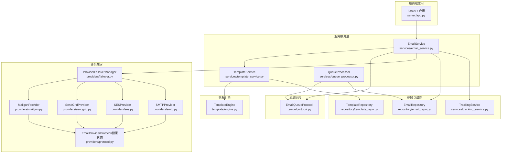
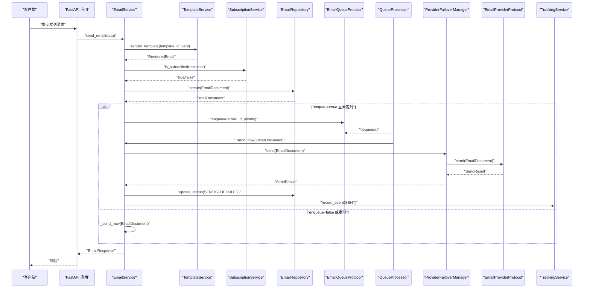
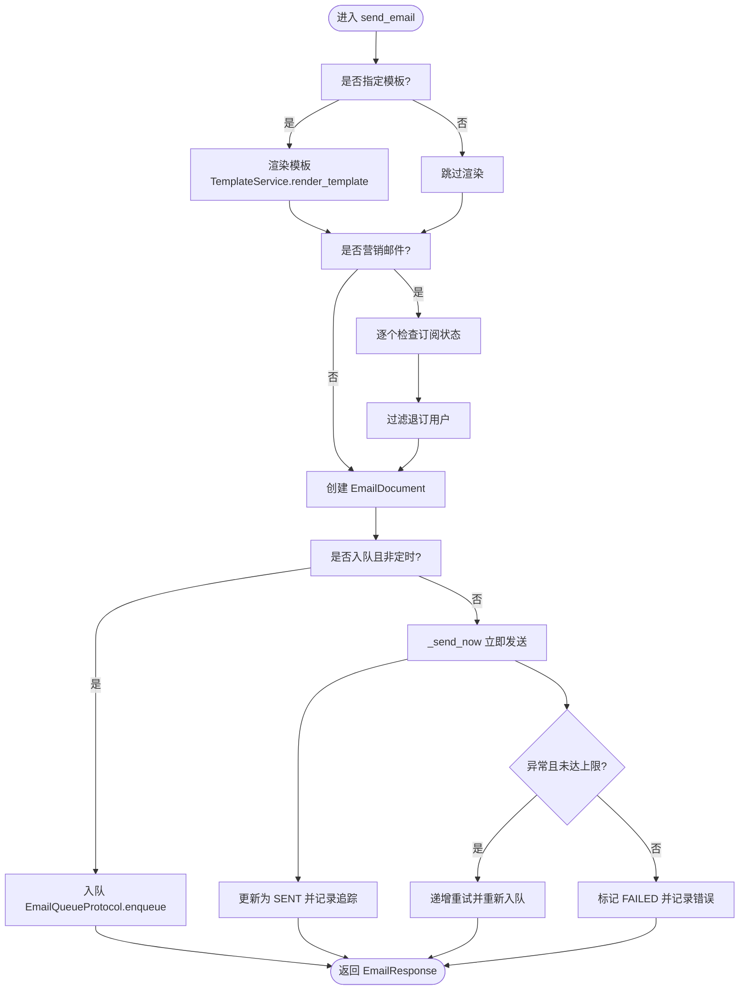
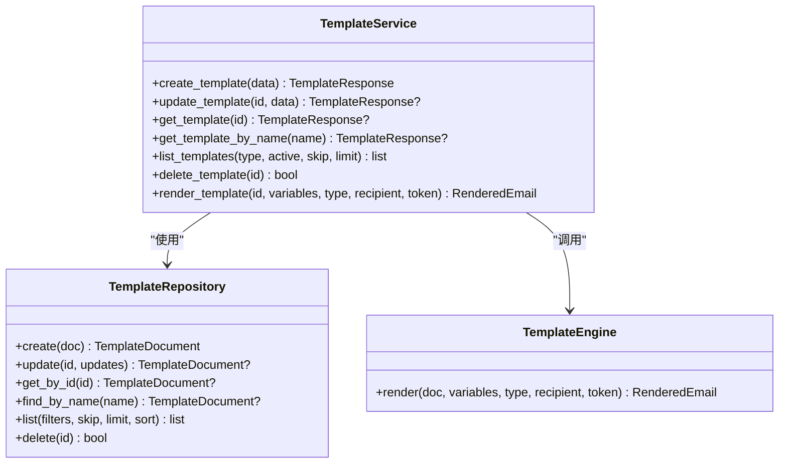
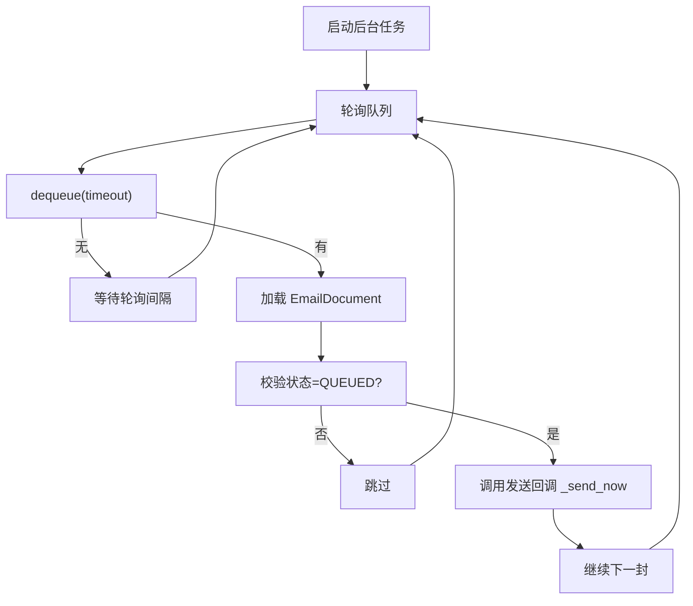
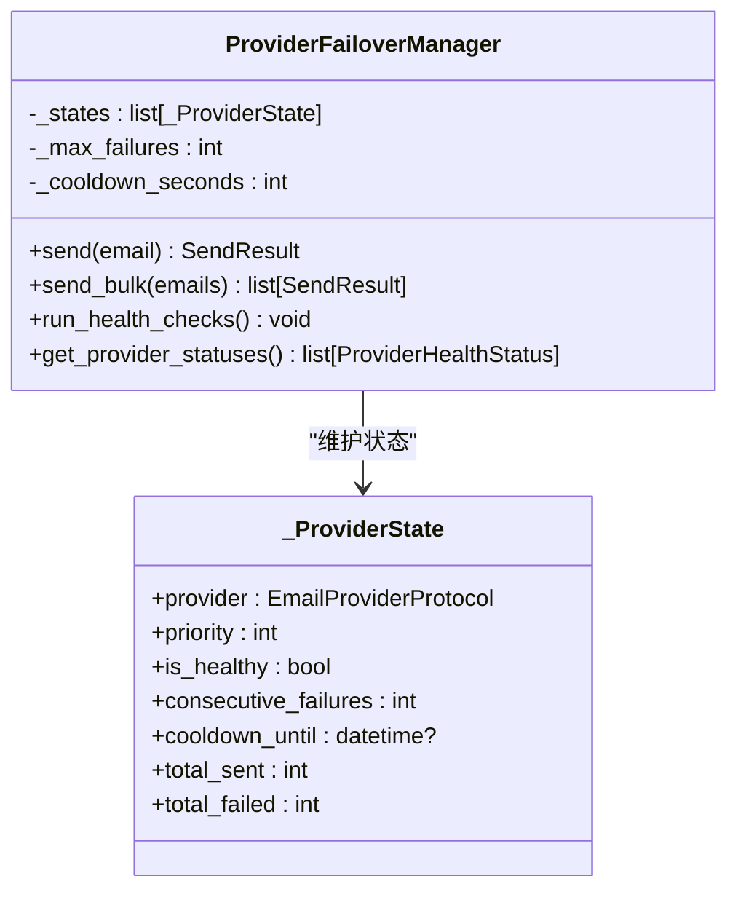
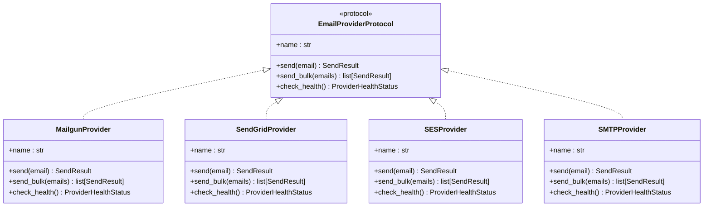
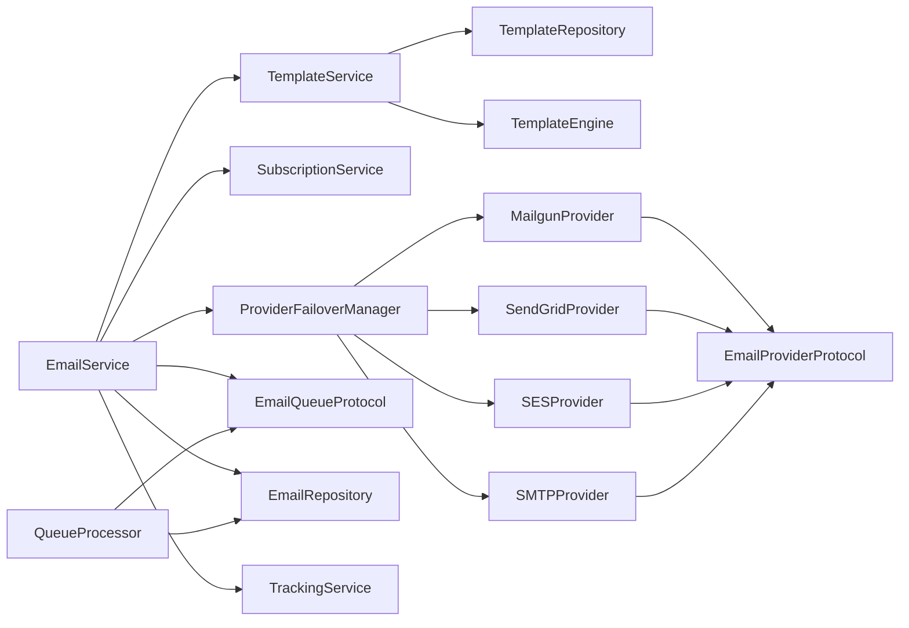

# 邮件通知系统

<cite>
**本文引用的文件**
- [email_service.py](file://tools/flexloop/src/taolib/testing/email_service/services/email_service.py)
- [template_service.py](file://tools/flexloop/src/taolib/testing/email_service/services/template_service.py)
- [queue_processor.py](file://tools/flexloop/src/taolib/testing/email_service/services/queue_processor.py)
- [failover.py](file://tools/flexloop/src/taolib/testing/email_service/providers/failover.py)
- [mailgun.py](file://tools/flexloop/src/taolib/testing/email_service/providers/mailgun.py)
- [sendgrid.py](file://tools/flexloop/src/taolib/testing/email_service/providers/sendgrid.py)
- [ses.py](file://tools/flexloop/src/taolib/testing/email_service/providers/ses.py)
- [smtp.py](file://tools/flexloop/src/taolib/testing/email_service/providers/smtp.py)
- [protocol.py（提供商协议）](file://tools/flexloop/src/taolib/testing/email_service/providers/protocol.py)
- [protocol.py（队列协议）](file://tools/flexloop/src/taolib/testing/email_service/queue/protocol.py)
- [template.py（模型）](file://tools/flexloop/src/taolib/testing/email_service/models/template.py)
- [app.py（服务端应用）](file://tools/flexloop/src/taolib/testing/email_service/server/app.py)
</cite>

## 目录
1. [简介](#简介)
2. [项目结构](#项目结构)
3. [核心组件](#核心组件)
4. [架构总览](#架构总览)
5. [详细组件分析](#详细组件分析)
6. [依赖关系分析](#依赖关系分析)
7. [性能考虑](#性能考虑)
8. [故障排查指南](#故障排查指南)
9. [结论](#结论)
10. [附录](#附录)

## 简介
本文件为 DaoMind 邮件通知系统的全面技术文档，覆盖邮件发送服务的架构设计、消息队列、模板引擎、配置与提供商管理、发送策略、错误处理与重试、性能优化与监控告警等关键主题。系统采用模块化设计，支持多种邮件提供商（Mailgun、SendGrid、Amazon SES、SMTP），具备故障转移、健康检查、退订处理、追踪统计与仪表盘等功能。

## 项目结构
邮件服务位于工具链工程 tools/flexloop 下，核心代码集中在 taolib/testing/email_service 子目录中，包含服务层、提供商实现、队列协议、模型与模板引擎等模块。服务端应用通过 FastAPI 启动，内置仪表盘用于查看提供商状态、队列状态与最近邮件。

图表来源
- [app.py:138-170](file://tools/flexloop/src/taolib/testing/email_service/server/app.py#L138-L170)
- [email_service.py:28-63](file://tools/flexloop/src/taolib/testing/email_service/services/email_service.py#L28-L63)
- [template_service.py:20-36](file://tools/flexloop/src/taolib/testing/email_service/services/template_service.py#L20-L36)
- [queue_processor.py:16-47](file://tools/flexloop/src/taolib/testing/email_service/services/queue_processor.py#L16-L47)
- [failover.py:32-58](file://tools/flexloop/src/taolib/testing/email_service/providers/failover.py#L32-L58)
- [protocol.py（队列协议）:11-61](file://tools/flexloop/src/taolib/testing/email_service/queue/protocol.py#L11-L61)
- [protocol.py（提供商协议）:35-57](file://tools/flexloop/src/taolib/testing/email_service/providers/protocol.py#L35-L57)

章节来源
- [app.py:138-170](file://tools/flexloop/src/taolib/testing/email_service/server/app.py#L138-L170)

## 核心组件
- 邮件服务编排器：负责模板渲染、订阅检查、邮件创建、入队或直发、发送结果记录与失败重试。
- 模板服务：提供模板的增删改查、版本控制与渲染。
- 队列处理器：后台任务持续从队列取邮件并调用发送回调，支持批处理与轮询。
- 故障转移管理器：按优先级选择可用提供商，失败后冷却与恢复，健康检查自动恢复。
- 多提供商实现：Mailgun、SendGrid、Amazon SES、SMTP，统一协议抽象。
- 模型与协议：EmailDocument、TemplateDocument、枚举、队列与提供商协议。
- 仪表盘：展示提供商健康、队列状态、邮件统计与最近邮件。

章节来源
- [email_service.py:28-63](file://tools/flexloop/src/taolib/testing/email_service/services/email_service.py#L28-L63)
- [template_service.py:20-36](file://tools/flexloop/src/taolib/testing/email_service/services/template_service.py#L20-L36)
- [queue_processor.py:16-47](file://tools/flexloop/src/taolib/testing/email_service/services/queue_processor.py#L16-L47)
- [failover.py:32-58](file://tools/flexloop/src/taolib/testing/email_service/providers/failover.py#L32-L58)
- [protocol.py（提供商协议）:35-57](file://tools/flexloop/src/taolib/testing/email_service/providers/protocol.py#L35-L57)
- [protocol.py（队列协议）:11-61](file://tools/flexloop/src/taolib/testing/email_service/queue/protocol.py#L11-L61)
- [template.py（模型）:10-93](file://tools/flexloop/src/taolib/testing/email_service/models/template.py#L10-L93)

## 架构总览
系统采用“服务编排 + 模板引擎 + 队列 + 多提供商 + 健康检查”的分层架构。EmailService 作为编排中心，协调 TemplateService、QueueProcessor、ProviderFailoverManager 与 TrackingService；队列解耦生产与消费，支持异步发送与批处理；Provider 层通过统一协议屏蔽差异，实现故障转移与健康检查。

图表来源
- [email_service.py:64-147](file://tools/flexloop/src/taolib/testing/email_service/services/email_service.py#L64-L147)
- [queue_processor.py:75-101](file://tools/flexloop/src/taolib/testing/email_service/services/queue_processor.py#L75-L101)
- [failover.py:59-113](file://tools/flexloop/src/taolib/testing/email_service/providers/failover.py#L59-L113)
- [protocol.py（提供商协议）:35-57](file://tools/flexloop/src/taolib/testing/email_service/providers/protocol.py#L35-L57)

## 详细组件分析

### 组件一：邮件服务编排器（EmailService）
职责
- 模板渲染：根据模板 ID 与变量渲染 HTML/文本内容，并注入退订令牌（营销邮件）。
- 订阅检查：对营销邮件过滤已退订用户。
- 邮件创建：构造 EmailDocument 并持久化。
- 入队/直发：支持异步入队与同步直发；定时邮件延迟入队。
- 发送执行：立即发送时更新状态为发送中，调用提供商管理器发送，记录追踪事件。
- 失败重试：异常时递增重试计数，未达上限则重新入队（由队列处理器按批与轮询处理）。

图表来源
- [email_service.py:64-213](file://tools/flexloop/src/taolib/testing/email_service/services/email_service.py#L64-L213)

章节来源
- [email_service.py:28-243](file://tools/flexloop/src/taolib/testing/email_service/services/email_service.py#L28-L243)

### 组件二：模板服务（TemplateService）
职责
- 模板 CRUD：创建、更新（自动递增版本）、查询、删除。
- 渲染：读取模板文档，调用模板引擎渲染，支持变量替换与退订令牌注入。
- 版本控制：更新模板时自增版本号，便于审计与回滚。

图表来源
- [template_service.py:20-139](file://tools/flexloop/src/taolib/testing/email_service/services/template_service.py#L20-L139)
- [template.py（模型）:10-93](file://tools/flexloop/src/taolib/testing/email_service/models/template.py#L10-L93)

章节来源
- [template_service.py:20-139](file://tools/flexloop/src/taolib/testing/email_service/services/template_service.py#L20-L139)
- [template.py（模型）:10-93](file://tools/flexloop/src/taolib/testing/email_service/models/template.py#L10-L93)

### 组件三：队列处理器（QueueProcessor）
职责
- 后台任务：周期性轮询队列，按批处理邮件。
- 单封处理：取出邮件 ID，加载文档，校验状态，调用发送回调。
- 定时处理：扫描到期的计划邮件，重新入队。
- 弹性与可观测：异常捕获、日志记录、可停止的生命周期。

图表来源
- [queue_processor.py:66-101](file://tools/flexloop/src/taolib/testing/email_service/services/queue_processor.py#L66-L101)

章节来源
- [queue_processor.py:16-110](file://tools/flexloop/src/taolib/testing/email_service/services/queue_processor.py#L16-L110)

### 组件四：故障转移管理器（ProviderFailoverManager）
职责
- 多提供商：按优先级排序，依次尝试发送。
- 健康状态：独立跟踪每个提供商的连续失败次数、冷却截止时间、总发送/失败数。
- 冷却与恢复：失败超过阈值进入冷却，冷却期后进行健康检查恢复。
- 统一接口：对外暴露 send/send_bulk，内部封装故障转移逻辑。

图表来源
- [failover.py:32-175](file://tools/flexloop/src/taolib/testing/email_service/providers/failover.py#L32-L175)

章节来源
- [failover.py:32-175](file://tools/flexloop/src/taolib/testing/email_service/providers/failover.py#L32-L175)

### 组件五：提供商实现（Mailgun、SendGrid、SES、SMTP）
共同点
- 实现统一协议：name 属性、send/send_bulk 方法、check_health 健康检查。
- 返回 SendResult：包含成功标志、提供商名称、提供商消息 ID、错误信息与耗时。
- 健康检查：通过提供商官方 API 检查可用性。

差异点
- Mailgun：基于 HTTP API，支持 CC/BCC、标签等扩展字段。
- SendGrid：基于 v3 Mail Send API，支持个人化与分类标签。
- SES：基于 Amazon SES v2 HTTP API，需配置区域与凭证。
- SMTP：基于标准 SMTP 协议，适合自建 SMTP 或兼容服务。

图表来源
- [protocol.py（提供商协议）:35-57](file://tools/flexloop/src/taolib/testing/email_service/providers/protocol.py#L35-L57)
- [mailgun.py:15-123](file://tools/flexloop/src/taolib/testing/email_service/providers/mailgun.py#L15-L123)
- [sendgrid.py:15-144](file://tools/flexloop/src/taolib/testing/email_service/providers/sendgrid.py#L15-L144)
- [ses.py:15-140](file://tools/flexloop/src/taolib/testing/email_service/providers/ses.py#L15-L140)
- [smtp.py:15-133](file://tools/flexloop/src/taolib/testing/email_service/providers/smtp.py#L15-L133)

章节来源
- [protocol.py（提供商协议）:35-57](file://tools/flexloop/src/taolib/testing/email_service/providers/protocol.py#L35-L57)
- [mailgun.py:15-123](file://tools/flexloop/src/taolib/testing/email_service/providers/mailgun.py#L15-L123)
- [sendgrid.py:15-144](file://tools/flexloop/src/taolib/testing/email_service/providers/sendgrid.py#L15-L144)
- [ses.py:15-140](file://tools/flexloop/src/taolib/testing/email_service/providers/ses.py#L15-L140)
- [smtp.py:15-133](file://tools/flexloop/src/taolib/testing/email_service/providers/smtp.py#L15-L133)

### 组件六：模板引擎与变量替换
- 模板模型：包含名称、描述、主题模板、HTML 模板、可选文本模板、类型、变量 Schema、标签等。
- 渲染流程：TemplateService 读取模板文档，调用 TemplateEngine.render，传入变量、邮件类型、收件人邮箱与退订令牌，输出 HTML/文本组合。
- 多语言支持：模板变量可包含语言相关键，渲染时按上下文替换；若未提供文本模板，可回退纯文本占位。

章节来源
- [template.py（模型）:10-93](file://tools/flexloop/src/taolib/testing/email_service/models/template.py#L10-L93)
- [template_service.py:103-136](file://tools/flexloop/src/taolib/testing/email_service/services/template_service.py#L103-L136)

### 组件七：仪表盘与监控
- 仪表盘页面：展示提供商健康状态、队列统计、最近邮件列表。
- 数据刷新：前端定时拉取健康、邮件与分析数据，实时更新。
- 日志与异常：服务端记录发送与处理过程的关键事件，便于问题定位。

章节来源
- [app.py:138-170](file://tools/flexloop/src/taolib/testing/email_service/server/app.py#L138-L170)
- [app.py:232-256](file://tools/flexloop/src/taolib/testing/email_service/server/app.py#L232-L256)

## 依赖关系分析
- EmailService 依赖 TemplateService、SubscriptionService、ProviderFailoverManager、EmailQueueProtocol、EmailRepository、TrackingService。
- TemplateService 依赖 TemplateRepository 与 TemplateEngine。
- QueueProcessor 依赖 EmailQueueProtocol 与 EmailRepository。
- ProviderFailoverManager 依赖多个 EmailProviderProtocol 实现。
- 各 Provider 实现依赖统一协议与健康检查接口。

图表来源
- [email_service.py:28-63](file://tools/flexloop/src/taolib/testing/email_service/services/email_service.py#L28-L63)
- [template_service.py:20-36](file://tools/flexloop/src/taolib/testing/email_service/services/template_service.py#L20-L36)
- [queue_processor.py:16-47](file://tools/flexloop/src/taolib/testing/email_service/services/queue_processor.py#L16-L47)
- [failover.py:32-58](file://tools/flexloop/src/taolib/testing/email_service/providers/failover.py#L32-L58)
- [protocol.py（提供商协议）:35-57](file://tools/flexloop/src/taolib/testing/email_service/providers/protocol.py#L35-L57)

章节来源
- [email_service.py:28-63](file://tools/flexloop/src/taolib/testing/email_service/services/email_service.py#L28-L63)
- [failover.py:32-58](file://tools/flexloop/src/taolib/testing/email_service/providers/failover.py#L32-L58)

## 性能考虑
- 异步与并发
  - 提供商发送与健康检查使用异步 HTTP 客户端，降低阻塞。
  - 队列处理器按批处理，避免频繁 IO；轮询间隔可调，平衡吞吐与延迟。
- 失败重试与退避
  - 邮件发送异常时递增重试计数，重新入队；具体指数退避由队列处理器的批处理与轮询实现，避免瞬时拥塞。
- 资源隔离
  - 多提供商并行尝试，失败冷却减少对下游的压力。
- 模板渲染
  - 模板变量与渲染逻辑解耦，避免重复计算；文本模板可选，减少冗余内容。
- 监控与可观测
  - 提供商耗时与错误记录在 SendResult 中，便于统计与告警。

## 故障排查指南
常见问题与处理
- 所有提供商均失败
  - 现象：ProviderFailoverManager 抛出“所有提供商失败”错误。
  - 排查：检查各提供商健康检查接口、凭据与网络连通性；确认冷却时间是否已过。
  - 处理：修复后等待健康检查恢复或手动触发恢复。
- 发送异常但未入队
  - 现象：enqueue=false 或定时邮件不会入队。
  - 排查：确认调用参数与 schedule_at 字段；检查 EmailRepository 状态更新。
- 退订用户仍收到营销邮件
  - 现象：订阅检查未生效。
  - 排查：确认 SubscriptionService 的 is_subscribed 实现与缓存；检查模板渲染时是否注入退订令牌。
- 模板渲染失败
  - 现象：TemplateNotFoundError 或渲染异常。
  - 排查：确认模板存在、变量 Schema 与实际变量一致；检查模板引擎配置。
- 队列积压
  - 现象：队列长度增长。
  - 排查：检查队列处理器批大小、轮询间隔与提供商吞吐；观察提供商健康状态与冷却情况。

章节来源
- [failover.py:74-113](file://tools/flexloop/src/taolib/testing/email_service/providers/failover.py#L74-L113)
- [email_service.py:193-212](file://tools/flexloop/src/taolib/testing/email_service/services/email_service.py#L193-L212)
- [template_service.py:126-128](file://tools/flexloop/src/taolib/testing/email_service/services/template_service.py#L126-L128)
- [queue_processor.py:75-101](file://tools/flexloop/src/taolib/testing/email_service/services/queue_processor.py#L75-L101)

## 结论
DaoMind 邮件通知系统通过清晰的分层与协议抽象，实现了高可用、可扩展的邮件发送能力。模板引擎与多提供商支持满足多样化场景，队列与故障转移保障了稳定性与性能。结合仪表盘与日志，系统具备良好的可观测性与运维体验。

## 附录
- 集成指南
  - 服务启动：通过 FastAPI 应用启动，初始化 EmailService、QueueProcessor、ProviderFailoverManager 与各 Repository/Service。
  - 提供商配置：按提供商要求配置凭据与参数（API Key、域名、区域、SMTP 凭证等），注册到 ProviderFailoverManager 并设置优先级。
  - 模板管理：创建模板并定义变量 Schema，发送前通过 TemplateService 渲染。
  - 发送策略：默认异步入队，支持直发与定时发送；营销邮件自动订阅检查。
  - 监控告警：利用仪表盘查看提供商健康与队列状态；结合日志与追踪事件建立告警规则。
- 发送限制管理
  - 提供商限流：依据各提供商 API 速率限制调整队列批大小与轮询间隔。
  - 冷却策略：故障转移管理器内置冷却与恢复逻辑，避免雪崩效应。
  - 退订处理：营销邮件自动过滤退订用户，减少无效发送。