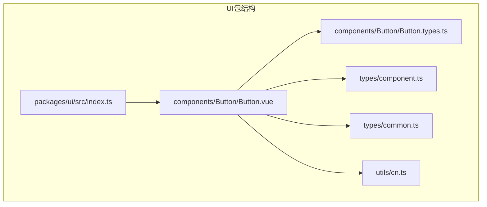
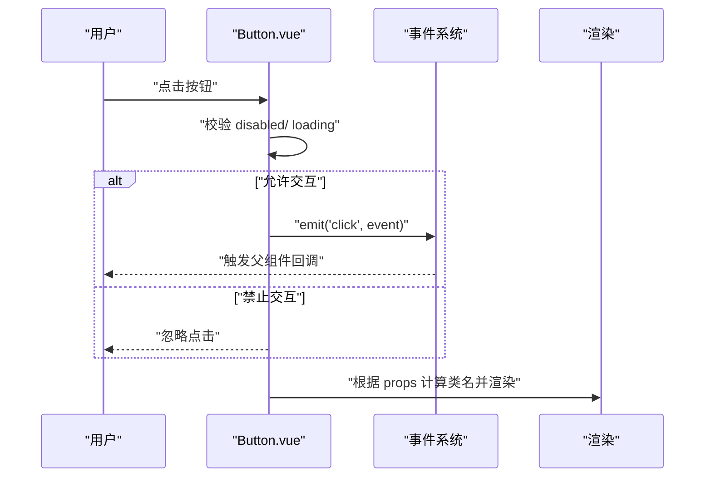
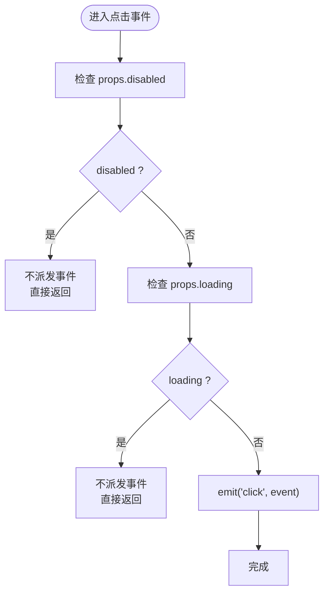
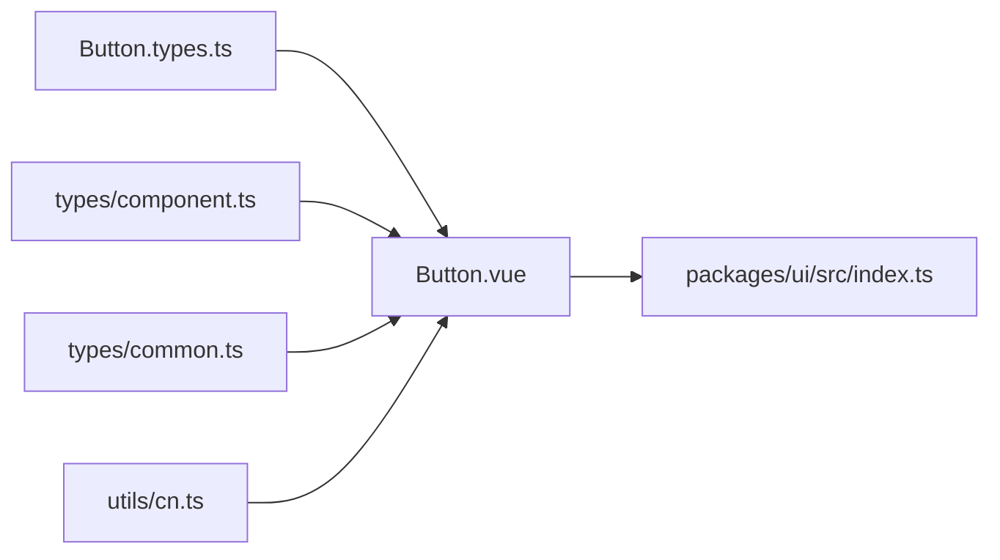

# 基础UI组件

<cite>
**本文引用的文件**
- [Button.vue](file://apps/AgentPit/packages/ui/src/components/Button/Button.vue)
- [Button.types.ts](file://apps/AgentPit/packages/ui/src/components/Button/Button.types.ts)
- [component.ts](file://apps/AgentPit/packages/ui/src/types/component.ts)
- [common.ts](file://apps/AgentPit/packages/ui/src/types/common.ts)
- [cn.ts](file://apps/AgentPit/packages/ui/src/utils/cn.ts)
- [index.ts](file://apps/AgentPit/packages/ui/src/index.ts)
</cite>

## 目录
1. [简介](#简介)
2. [项目结构](#项目结构)
3. [核心组件](#核心组件)
4. [架构总览](#架构总览)
5. [详细组件分析](#详细组件分析)
6. [依赖关系分析](#依赖关系分析)
7. [性能考量](#性能考量)
8. [故障排查指南](#故障排查指南)
9. [结论](#结论)
10. [附录](#附录)

## 简介
本文件为基础UI组件中的Button（按钮）组件提供系统化技术文档。内容涵盖组件实现细节、属性定义、事件处理、样式定制与类名体系、可访问性支持、键盘导航与焦点管理、与其他UI元素的组合使用模式与最佳实践，并通过图示与路径引用帮助读者快速定位源码位置。

## 项目结构
Button组件位于 AgentPit 应用的共享UI包中，采用Vue 3 Composition API风格实现，结合 class-variance-authority（cva）与 tailwind-merge 进行变体与类名合并，确保样式可维护与可扩展。

**图表来源**
- [index.ts:1-6](file://apps/AgentPit/packages/ui/src/index.ts#L1-L6)
- [Button.vue:1-80](file://apps/AgentPit/packages/ui/src/components/Button/Button.vue#L1-L80)
- [Button.types.ts:1-16](file://apps/AgentPit/packages/ui/src/components/Button/Button.types.ts#L1-L16)
- [component.ts:1-30](file://apps/AgentPit/packages/ui/src/types/component.ts#L1-L30)
- [common.ts:1-18](file://apps/AgentPit/packages/ui/src/types/common.ts#L1-L18)
- [cn.ts:1-7](file://apps/AgentPit/packages/ui/src/utils/cn.ts#L1-L7)

**章节来源**
- [index.ts:1-6](file://apps/AgentPit/packages/ui/src/index.ts#L1-L6)
- [Button.vue:1-80](file://apps/AgentPit/packages/ui/src/components/Button/Button.vue#L1-L80)

## 核心组件
- 组件名称：Button
- 技术栈：Vue 3 + TypeScript + class-variance-authority + Tailwind CSS
- 主要职责：
  - 渲染可变主题与尺寸的按钮
  - 支持加载态、禁用态、块级显示
  - 支持左侧/右侧图标与默认插槽文本
  - 派发点击事件并进行交互状态控制

**章节来源**
- [Button.vue:1-80](file://apps/AgentPit/packages/ui/src/components/Button/Button.vue#L1-L80)
- [Button.types.ts:1-16](file://apps/AgentPit/packages/ui/src/components/Button/Button.types.ts#L1-L16)

## 架构总览
Button组件通过 cVA（class-variance-authority）生成变体类名，使用 cn 工具函数合并多个类值，最终渲染到原生button元素。其核心流程如下：

**图表来源**
- [Button.vue:56-60](file://apps/AgentPit/packages/ui/src/components/Button/Button.vue#L56-L60)
- [Button.vue:63-80](file://apps/AgentPit/packages/ui/src/components/Button/Button.vue#L63-L80)

## 详细组件分析

### Props 接口与默认值
- 来源：ButtonProps 接口与默认参数
- 关键字段与含义：
  - variant：按钮主题变体（primary、secondary、success、warning、danger、outline、ghost、default）
  - size：按钮尺寸（xs、sm、md、lg、xl）
  - type：原生button type（button、submit、reset）
  - loading：加载态（true时显示旋转指示器并禁用交互）
  - block：块级按钮（true时宽度为100%）
  - icon：图标内容（字符串形式）
  - iconPosition：图标位置（left、right）
  - disabled：禁用态（true时禁用交互）
  - class/style/id：透传自 BaseComponentProps
- 默认值策略：通过 withDefaults 设置，避免在模板中重复声明

**章节来源**
- [Button.types.ts:7-15](file://apps/AgentPit/packages/ui/src/components/Button/Button.types.ts#L7-L15)
- [component.ts:10-15](file://apps/AgentPit/packages/ui/src/types/component.ts#L10-L15)
- [common.ts:1-5](file://apps/AgentPit/packages/ui/src/types/common.ts#L1-L5)
- [Button.vue:7-15](file://apps/AgentPit/packages/ui/src/components/Button/Button.vue#L7-L15)

### Emits 事件
- click：鼠标点击事件，携带原生 MouseEvent 参数
- 触发条件：仅当组件未被禁用且非加载态时派发

**章节来源**
- [Button.vue:17-19](file://apps/AgentPit/packages/ui/src/components/Button/Button.vue#L17-L19)
- [Button.vue:56-60](file://apps/AgentPit/packages/ui/src/components/Button/Button.vue#L56-L60)

### Slots 插槽
- 默认插槽：用于放置按钮文本或复杂内容
- 图标插槽：通过 icon 与 iconPosition 控制左右两侧图标显示
- 加载态插槽：内部以旋转指示器替代默认插槽内容

**章节来源**
- [Button.vue:63-80](file://apps/AgentPit/packages/ui/src/components/Button/Button.vue#L63-L80)

### 样式与类名体系
- 类名生成：
  - 使用 cva 定义变体与尺寸映射，统一过渡与焦点环样式
  - 使用 cn 合并变体类、block、以及外部传入的 class
- 可访问性与焦点：
  - 内置 focus:outline-none 与 focus:ring-* 系列，确保键盘可达与视觉焦点反馈
  - disabled 时自动设置 opacity 与 cursor，阻止交互
- 类名来源与合并逻辑：
  - buttonVariants 提供变体/尺寸基类
  - cn 负责合并多个 ClassValue 并去重

**章节来源**
- [Button.vue:21-48](file://apps/AgentPit/packages/ui/src/components/Button/Button.vue#L21-L48)
- [Button.vue:50-54](file://apps/AgentPit/packages/ui/src/components/Button/Button.vue#L50-L54)
- [cn.ts:4-6](file://apps/AgentPit/packages/ui/src/utils/cn.ts#L4-L6)

### 事件处理与交互逻辑
- 点击拦截：在 handleClick 中判断 disabled 与 loading，决定是否派发 click
- 禁用与加载：同时受 disabled 与 loading 影响；两者任一为真则禁用
- 类名动态计算：基于 props 动态生成最终类名

**图表来源**
- [Button.vue:56-60](file://apps/AgentPit/packages/ui/src/components/Button/Button.vue#L56-L60)

### 可访问性、键盘导航与焦点管理
- 键盘可用性：原生button元素天然支持空格/回车激活
- 焦点管理：组件内置 focus-ring 样式，保证键盘导航可见性
- 禁用态：禁用与加载态均阻止交互并改变指针样式
- 建议：在表单中优先使用 submit/reset 类型；在复杂交互中为按钮添加 aria-label 或 aria-describedby

**章节来源**
- [Button.vue:21-22](file://apps/AgentPit/packages/ui/src/components/Button/Button.vue#L21-L22)
- [Button.vue:67-68](file://apps/AgentPit/packages/ui/src/components/Button/Button.vue#L67-L68)

### 组合使用模式与最佳实践
- 与表单组合：使用 type="submit" 与表单提交联动；配合 loading 展示异步提交状态
- 与图标组合：iconPosition 控制图标位置；建议使用语义化图标库（如未在当前仓库中出现，可在应用层引入）
- 与布局组合：block=true 适配栅格或弹性布局下的占满容器
- 与状态组合：loading 与 disabled 可叠加使用，避免并发操作
- 最佳实践：
  - 为关键操作按钮选择 primary/secondary 等高对比度变体
  - 在移动端优先使用较大尺寸（lg/xl）提升触达性
  - 避免在同一页面大量使用相同颜色变体，保持视觉层次

**章节来源**
- [Button.types.ts:3-5](file://apps/AgentPit/packages/ui/src/components/Button/Button.types.ts#L3-L5)
- [Button.types.ts:7-15](file://apps/AgentPit/packages/ui/src/components/Button/Button.types.ts#L7-L15)
- [Button.vue:50-54](file://apps/AgentPit/packages/ui/src/components/Button/Button.vue#L50-L54)

### 代码示例（路径引用）
以下为常见使用场景的代码片段路径（请在对应文件中查看完整实现）：
- 基础按钮：[Button.vue:63-80](file://apps/AgentPit/packages/ui/src/components/Button/Button.vue#L63-L80)
- 图标按钮（左侧/右侧）：[Button.vue:76-78](file://apps/AgentPit/packages/ui/src/components/Button/Button.vue#L76-L78)
- 禁用状态：[Button.vue:67-68](file://apps/AgentPit/packages/ui/src/components/Button/Button.vue#L67-L68)
- 加载状态：[Button.vue:70-75](file://apps/AgentPit/packages/ui/src/components/Button/Button.vue#L70-L75)
- 不同变体与尺寸：[Button.vue:24-42](file://apps/AgentPit/packages/ui/src/components/Button/Button.vue#L24-L42)
- 事件监听（父组件）：[Button.vue:17-19](file://apps/AgentPit/packages/ui/src/components/Button/Button.vue#L17-L19)

**章节来源**
- [Button.vue:63-80](file://apps/AgentPit/packages/ui/src/components/Button/Button.vue#L63-L80)

## 依赖关系分析
- 组件依赖：
  - Button.vue 依赖 ButtonProps 类型定义与基础组件类型
  - cn 工具负责类名合并与冲突修复
  - cva 提供变体与尺寸的样式映射
- 导出入口：
  - packages/ui/src/index.ts 统一导出组件、类型、工具与样式

**图表来源**
- [Button.vue:1-80](file://apps/AgentPit/packages/ui/src/components/Button/Button.vue#L1-L80)
- [Button.types.ts:1-16](file://apps/AgentPit/packages/ui/src/components/Button/Button.types.ts#L1-L16)
- [component.ts:1-30](file://apps/AgentPit/packages/ui/src/types/component.ts#L1-L30)
- [common.ts:1-18](file://apps/AgentPit/packages/ui/src/types/common.ts#L1-L18)
- [cn.ts:1-7](file://apps/AgentPit/packages/ui/src/utils/cn.ts#L1-L7)
- [index.ts:1-6](file://apps/AgentPit/packages/ui/src/index.ts#L1-L6)

**章节来源**
- [index.ts:1-6](file://apps/AgentPit/packages/ui/src/index.ts#L1-L6)

## 性能考量
- 渲染优化：
  - 使用 computed 缓存类名计算结果，减少重复合并
  - 按需渲染图标与加载指示器，避免不必要的DOM节点
- 样式优化：
  - 通过 cva 与 Tailwind 原子类减少CSS体积
  - 使用 twMerge 合并类名，避免重复与冲突
- 交互优化：
  - 在 loading/disabled 时提前返回，避免无效事件处理

**章节来源**
- [Button.vue:50-54](file://apps/AgentPit/packages/ui/src/components/Button/Button.vue#L50-L54)
- [cn.ts:4-6](file://apps/AgentPit/packages/ui/src/utils/cn.ts#L4-L6)

## 故障排查指南
- 问题：按钮无响应
  - 检查 props.disabled 与 props.loading 是否为 true
  - 确认父组件是否正确监听 click 事件
- 问题：样式异常或类名冲突
  - 检查传入的 class 是否与变体类名冲突
  - 使用 cn 工具合并类名，避免重复定义
- 问题：焦点环不可见或键盘不可用
  - 确保未覆盖 focus 样式
  - 使用默认 focus:ring-* 类，保证键盘可达性

**章节来源**
- [Button.vue:56-60](file://apps/AgentPit/packages/ui/src/components/Button/Button.vue#L56-L60)
- [Button.vue:21-22](file://apps/AgentPit/packages/ui/src/components/Button/Button.vue#L21-L22)
- [cn.ts:4-6](file://apps/AgentPit/packages/ui/src/utils/cn.ts#L4-L6)

## 结论
Button 组件通过清晰的类型定义、灵活的变体系统与简洁的交互逻辑，提供了高可维护性的基础UI能力。结合 cva 与 Tailwind 原子类，既保证了样式的可扩展性，也提升了开发效率。建议在实际项目中遵循可访问性与焦点管理规范，并通过合理的组合模式提升用户体验。

## 附录

### Props 字段速览
- variant：主题变体（primary/secondary/success/warning/danger/outline/ghost/default）
- size：尺寸（xs/sm/md/lg/xl）
- type：原生button类型（button/submit/reset）
- loading：加载态
- block：块级显示
- icon：图标内容
- iconPosition：图标位置（left/right）
- disabled：禁用态
- class/style/id：透传属性

**章节来源**
- [Button.types.ts:7-15](file://apps/AgentPit/packages/ui/src/components/Button/Button.types.ts#L7-L15)
- [component.ts:10-15](file://apps/AgentPit/packages/ui/src/types/component.ts#L10-L15)
- [common.ts:1-5](file://apps/AgentPit/packages/ui/src/types/common.ts#L1-L5)