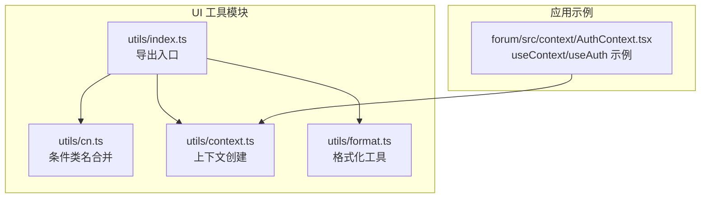
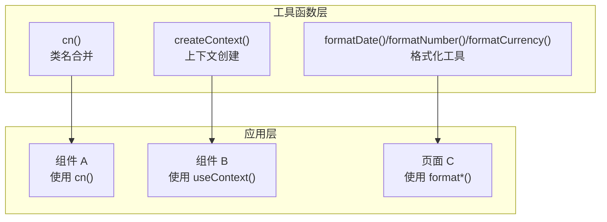
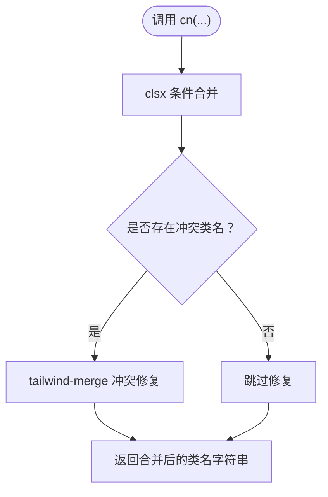
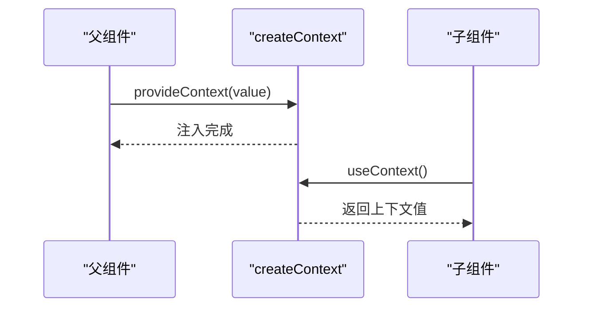
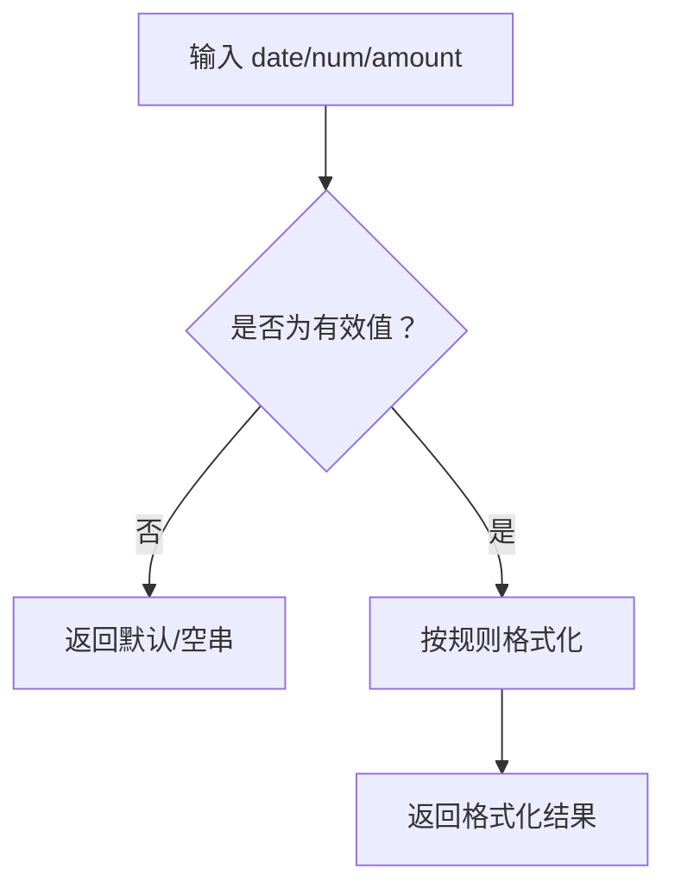
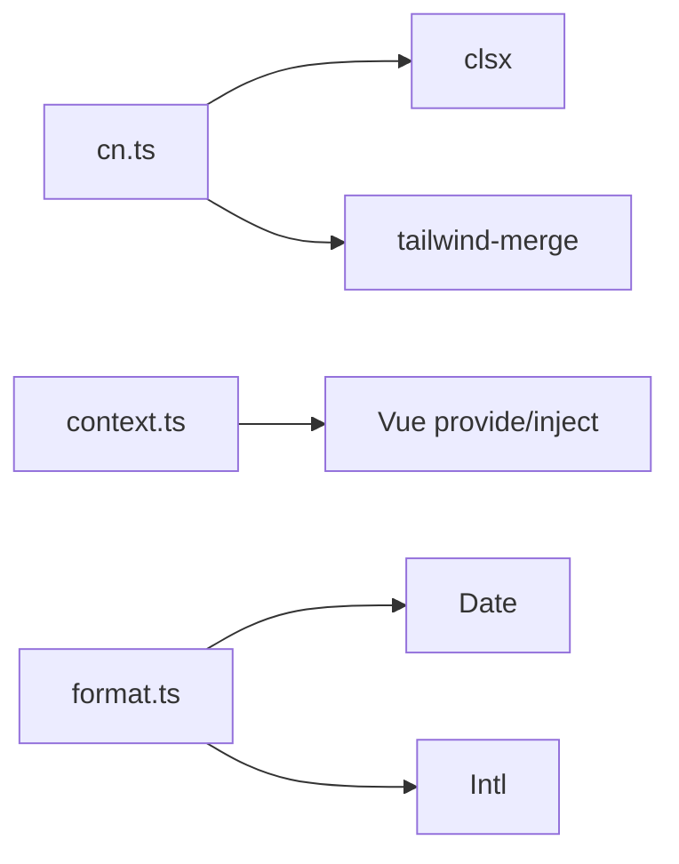

# 工具函数库

<cite>
**本文引用的文件**
- [cn 条件类名合并](file://apps/AgentPit/packages/ui/src/utils/cn.ts)
- [上下文工具 createContext](file://apps/AgentPit/packages/ui/src/utils/context.ts)
- [格式化工具 formatDate/formatNumber/formatCurrency](file://apps/AgentPit/packages/ui/src/utils/format.ts)
- [UI 工具导出入口](file://apps/AgentPit/packages/ui/src/utils/index.ts)
- [Vue 论坛认证上下文 AuthContext](file://apps/forum/src/context/AuthContext.tsx)
</cite>

## 目录
1. [引言](#引言)
2. [项目结构](#项目结构)
3. [核心组件](#核心组件)
4. [架构总览](#架构总览)
5. [详细组件分析](#详细组件分析)
6. [依赖分析](#依赖分析)
7. [性能考虑](#性能考虑)
8. [故障排查指南](#故障排查指南)
9. [结论](#结论)
10. [附录](#附录)

## 引言
本文件系统性梳理并文档化工具函数库，重点覆盖以下能力：
- cn 条件类名合并：基于 clsx 和 tailwind-merge 的类名合并与冲突修复
- 上下文工具 createContext：Vue 依赖注入上下文的统一创建与严格校验
- 格式化工具：日期、数字、货币的本地化格式化输出

文档将从设计原则、参数与返回值、使用场景、性能与兼容性、错误边界与类型安全等方面进行说明，并提供可直接定位到源码的路径指引，便于在实际开发中快速查阅与复用。

## 项目结构
工具函数库位于前端应用工程内，采用按功能域划分的组织方式：
- 工具函数集中于 packages/ui/src/utils 下，提供 cn、context、format 等工具
- 组件层通过 utils/index.ts 导出统一入口，便于按需引入
- 应用侧（如论坛）提供真实上下文使用示例（useContext/useAuth）

图表来源
- [UI 工具导出入口:1-1](file://apps/AgentPit/packages/ui/src/utils/index.ts#L1-L1)
- [cn 条件类名合并:1-7](file://apps/AgentPit/packages/ui/src/utils/cn.ts#L1-L7)
- [上下文工具 createContext:1-30](file://apps/AgentPit/packages/ui/src/utils/context.ts#L1-L30)
- [格式化工具 formatDate/formatNumber/formatCurrency:1-34](file://apps/AgentPit/packages/ui/src/utils/format.ts#L1-L34)
- [Vue 论坛认证上下文 AuthContext:76-92](file://apps/forum/src/context/AuthContext.tsx#L76-L92)

章节来源
- [UI 工具导出入口:1-1](file://apps/AgentPit/packages/ui/src/utils/index.ts#L1-L1)
- [cn 条件类名合并:1-7](file://apps/AgentPit/packages/ui/src/utils/cn.ts#L1-L7)
- [上下文工具 createContext:1-30](file://apps/AgentPit/packages/ui/src/utils/context.ts#L1-L30)
- [格式化工具 formatDate/formatNumber/formatCurrency:1-34](file://apps/AgentPit/packages/ui/src/utils/format.ts#L1-L34)
- [Vue 论坛认证上下文 AuthContext:76-92](file://apps/forum/src/context/AuthContext.tsx#L76-L92)

## 核心组件
本节对三大工具进行逐项解析，涵盖功能特性、参数类型、返回值、典型使用场景与注意事项。

- cn 条件类名合并
  - 功能：支持传入任意数量的类名输入，内部使用 clsx 进行条件合并，再用 tailwind-merge 解决冲突，最终返回合并后的字符串
  - 参数：可变参数，元素类型为 ClassValue（字符串、对象、数组、条件表达式等）
  - 返回值：string（合并后的类名字符串）
  - 使用场景：组件样式动态拼接、根据状态切换样式、避免 Tailwind 冲突
  - 设计原则：最小依赖、零运行时开销、类型安全
  - 性能：O(n) 合并复杂度，tailwind-merge 在冲突时做轻量级重排
  - 兼容性：适用于 React/Vue/Taro 等框架，需配合 Tailwind CSS 使用
  - 错误边界：无显式异常抛出；非法输入将被 clsx/tailwind-merge 安全处理
  - 类型安全：通过 ClassValue 类型约束，确保传参合法

- 上下文工具 createContext
  - 功能：封装 Vue provide/inject，生成带符号键名的上下文，支持默认值与严格模式校验
  - 参数：CreateContextOptions（name、defaultValue、strict）
  - 返回值：{ provideContext, useContext }（分别用于提供与消费上下文）
  - 使用场景：跨层级组件通信、主题/语言/用户态等全局状态共享
  - 设计原则：强约束（strict 模式）、类型推断、默认值兜底
  - 性能：轻量封装，无额外渲染开销
  - 兼容性：Vue 3 Composition API
  - 错误边界：strict=true 时，未包裹 Provider 将抛出明确错误
  - 类型安全：泛型 T 提供完整类型推断

- 格式化工具
  - formatDate
    - 功能：将日期对象/字符串/时间戳按指定模板格式化为字符串
    - 参数：date（Date | string | number），format（模板，默认 'YYYY-MM-DD'）
    - 返回值：string（格式化结果，非法日期返回空串）
    - 使用场景：列表展示、报表导出、日志记录
    - 设计原则：模板驱动、本地化无关、健壮性优先
    - 性能：常数时间，字符串替换
    - 兼容性：浏览器原生 Date
    - 错误边界：非法日期返回空串，不抛异常
    - 类型安全：入参与返回值类型明确

  - formatNumber
    - 功能：按小数位数格式化数字
    - 参数：num（number），decimals（number，默认 2）
    - 返回值：string（格式化结果）
    - 使用场景：统计面板、评分展示
    - 设计原则：固定精度、国际化支持
    - 性能：常数时间
    - 兼容性：Intl.NumberFormat
    - 错误边界：NaN/Infinity 安全处理
    - 类型安全：入参与返回值类型明确

  - formatCurrency
    - 功能：按区域与币种格式化货币
    - 参数：amount（number），currency（string，默认 'USD'），locale（string，默认 'en-US'）
    - 返回值：string（格式化结果）
    - 使用场景：价格展示、财务报表
    - 设计原则：区域化、样式化
    - 性能：常数时间
    - 兼容性：Intl.NumberFormat
    - 错误边界：NaN/Infinity 安全处理
    - 类型安全：入参与返回值类型明确

章节来源
- [cn 条件类名合并:1-7](file://apps/AgentPit/packages/ui/src/utils/cn.ts#L1-L7)
- [上下文工具 createContext:1-30](file://apps/AgentPit/packages/ui/src/utils/context.ts#L1-L30)
- [格式化工具 formatDate/formatNumber/formatCurrency:1-34](file://apps/AgentPit/packages/ui/src/utils/format.ts#L1-L34)

## 架构总览
工具函数库以“单一职责、低耦合”为核心设计思想，通过统一导出入口对外暴露，避免重复引入与命名冲突。应用侧通过 useContext/useAuth 等示例展示上下文的实际使用。

图表来源
- [cn 条件类名合并:1-7](file://apps/AgentPit/packages/ui/src/utils/cn.ts#L1-L7)
- [上下文工具 createContext:1-30](file://apps/AgentPit/packages/ui/src/utils/context.ts#L1-L30)
- [格式化工具 formatDate/formatNumber/formatCurrency:1-34](file://apps/AgentPit/packages/ui/src/utils/format.ts#L1-L34)

## 详细组件分析

### cn 条件类名合并
- 实现要点
  - 输入：可变参数 ClassValue[]
  - 处理：clsx 条件合并 + tailwind-merge 冲突修复
  - 输出：string
- 典型用法
  - 动态类名拼接：根据 props 或状态选择性添加类
  - 组合式样式：多个条件组合，避免重复与冲突
- 性能与兼容性
  - O(n) 时间复杂度，tailwind-merge 仅在冲突时处理
  - 需要 Tailwind CSS 支持，建议与原子化样式结合
- 错误边界与类型安全
  - 无显式异常；非法输入会被安全忽略或合并
  - 通过 ClassValue 类型约束，TS 友好

图表来源
- [cn 条件类名合并:1-7](file://apps/AgentPit/packages/ui/src/utils/cn.ts#L1-L7)

章节来源
- [cn 条件类名合并:1-7](file://apps/AgentPit/packages/ui/src/utils/cn.ts#L1-L7)

### 上下文工具 createContext
- 实现要点
  - 生成唯一 Symbol 注入键，避免命名冲突
  - provideContext：将响应式值注入上下文
  - useContext：消费上下文，strict 模式下未包裹抛错
  - 默认值兜底：可选 defaultValue
- 典型用法
  - 主题/语言/用户态等全局状态
  - 跨层级组件通信（Provider 包裹 + inject 消费）
- 性能与兼容性
  - 无额外渲染开销；Vue 3 Composition API
- 错误边界与类型安全
  - strict=true 时，未包裹 Provider 明确报错
  - 泛型 T 提供完整类型推断

图表来源
- [上下文工具 createContext:1-30](file://apps/AgentPit/packages/ui/src/utils/context.ts#L1-L30)

章节来源
- [上下文工具 createContext:1-30](file://apps/AgentPit/packages/ui/src/utils/context.ts#L1-L30)
- [Vue 论坛认证上下文 AuthContext:76-92](file://apps/forum/src/context/AuthContext.tsx#L76-L92)

### 格式化工具
- 实现要点
  - formatDate：模板替换（YYYY、MM、DD、HH、mm、ss）
  - formatNumber：固定小数位数
  - formatCurrency：区域化货币格式
- 典型用法
  - 列表页日期显示、统计面板数值、商品价格展示
- 性能与兼容性
  - 常数时间复杂度；依赖浏览器 Intl 能力
- 错误边界与类型安全
  - 非法日期返回空串；数字格式化安全处理
  - 明确的入参与返回值类型

图表来源
- [格式化工具 formatDate/formatNumber/formatCurrency:1-34](file://apps/AgentPit/packages/ui/src/utils/format.ts#L1-L34)

章节来源
- [格式化工具 formatDate/formatNumber/formatCurrency:1-34](file://apps/AgentPit/packages/ui/src/utils/format.ts#L1-L34)

## 依赖分析
- cn 条件类名合并
  - 依赖：clsx、tailwind-merge
  - 用途：类名条件合并与冲突修复
- 上下文工具 createContext
  - 依赖：Vue provide/inject/reactive
  - 用途：依赖注入上下文的创建与消费
- 格式化工具
  - 依赖：浏览器原生 Date、Intl
  - 用途：日期、数字、货币的本地化格式化

图表来源
- [cn 条件类名合并:1-7](file://apps/AgentPit/packages/ui/src/utils/cn.ts#L1-L7)
- [上下文工具 createContext:1-30](file://apps/AgentPit/packages/ui/src/utils/context.ts#L1-L30)
- [格式化工具 formatDate/formatNumber/formatCurrency:1-34](file://apps/AgentPit/packages/ui/src/utils/format.ts#L1-L34)

章节来源
- [cn 条件类名合并:1-7](file://apps/AgentPit/packages/ui/src/utils/cn.ts#L1-L7)
- [上下文工具 createContext:1-30](file://apps/AgentPit/packages/ui/src/utils/context.ts#L1-L30)
- [格式化工具 formatDate/formatNumber/formatCurrency:1-34](file://apps/AgentPit/packages/ui/src/utils/format.ts#L1-L34)

## 性能考虑
- cn 条件类名合并
  - 合并复杂度 O(n)，n 为传入类名数量；tailwind-merge 在冲突时做轻量修复
  - 建议：避免在高频渲染路径中传入大量动态类名；可缓存稳定类名
- 上下文工具 createContext
  - 无额外渲染开销；严格模式仅在消费阶段校验
  - 建议：合理拆分上下文，避免单个上下文承载过多状态
- 格式化工具
  - formatDate：字符串替换 O(k)（k 为模板占位符数量）
  - formatNumber/formatCurrency：依赖 Intl，浏览器差异较小
  - 建议：批量格式化时考虑缓存 Intl 实例或模板

## 故障排查指南
- cn 条件类名合并
  - 症状：样式未生效或冲突
  - 排查：确认 Tailwind CSS 是否正确编译；检查传入类名是否为合法字符串/对象/数组
  - 参考：[cn 条件类名合并:1-7](file://apps/AgentPit/packages/ui/src/utils/cn.ts#L1-L7)
- 上下文工具 createContext
  - 症状：消费时报错“必须在 Provider 内使用”
  - 排查：确认组件树是否包裹了对应 Provider；strict=false 时可设置 defaultValue
  - 参考：[上下文工具 createContext:1-30](file://apps/AgentPit/packages/ui/src/utils/context.ts#L1-L30)
- 格式化工具
  - 症状：日期为空串、数字/货币格式异常
  - 排查：确认输入为有效日期/数字；浏览器是否支持 Intl；locale/currency 是否正确
  - 参考：[格式化工具 formatDate/formatNumber/formatCurrency:1-34](file://apps/AgentPit/packages/ui/src/utils/format.ts#L1-L34)

章节来源
- [cn 条件类名合并:1-7](file://apps/AgentPit/packages/ui/src/utils/cn.ts#L1-L7)
- [上下文工具 createContext:1-30](file://apps/AgentPit/packages/ui/src/utils/context.ts#L1-L30)
- [格式化工具 formatDate/formatNumber/formatCurrency:1-34](file://apps/AgentPit/packages/ui/src/utils/format.ts#L1-L34)

## 结论
工具函数库以简洁、类型安全、性能友好为目标，覆盖类名合并、上下文创建与数据格式化三大常用场景。通过统一导出入口与严格的类型约束，降低使用成本并提升可维护性。建议在实际项目中：
- 使用 cn 合并类名，配合原子化样式与 Tailwind
- 使用 createContext 管理跨层级状态，合理拆分上下文
- 使用 format* 工具进行本地化展示，注意输入合法性与浏览器兼容

## 附录
- 使用示例定位
  - cn 条件类名合并：[cn 条件类名合并:1-7](file://apps/AgentPit/packages/ui/src/utils/cn.ts#L1-L7)
  - 上下文工具 createContext：[上下文工具 createContext:1-30](file://apps/AgentPit/packages/ui/src/utils/context.ts#L1-L30)
  - 格式化工具：[格式化工具 formatDate/formatNumber/formatCurrency:1-34](file://apps/AgentPit/packages/ui/src/utils/format.ts#L1-L34)
- 应用示例定位
  - Vue 论坛认证上下文：[Vue 论坛认证上下文 AuthContext:76-92](file://apps/forum/src/context/AuthContext.tsx#L76-L92)