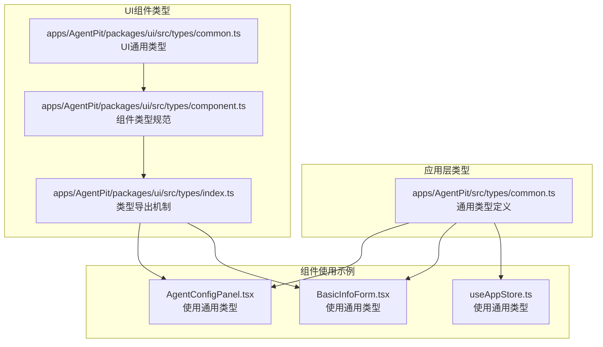
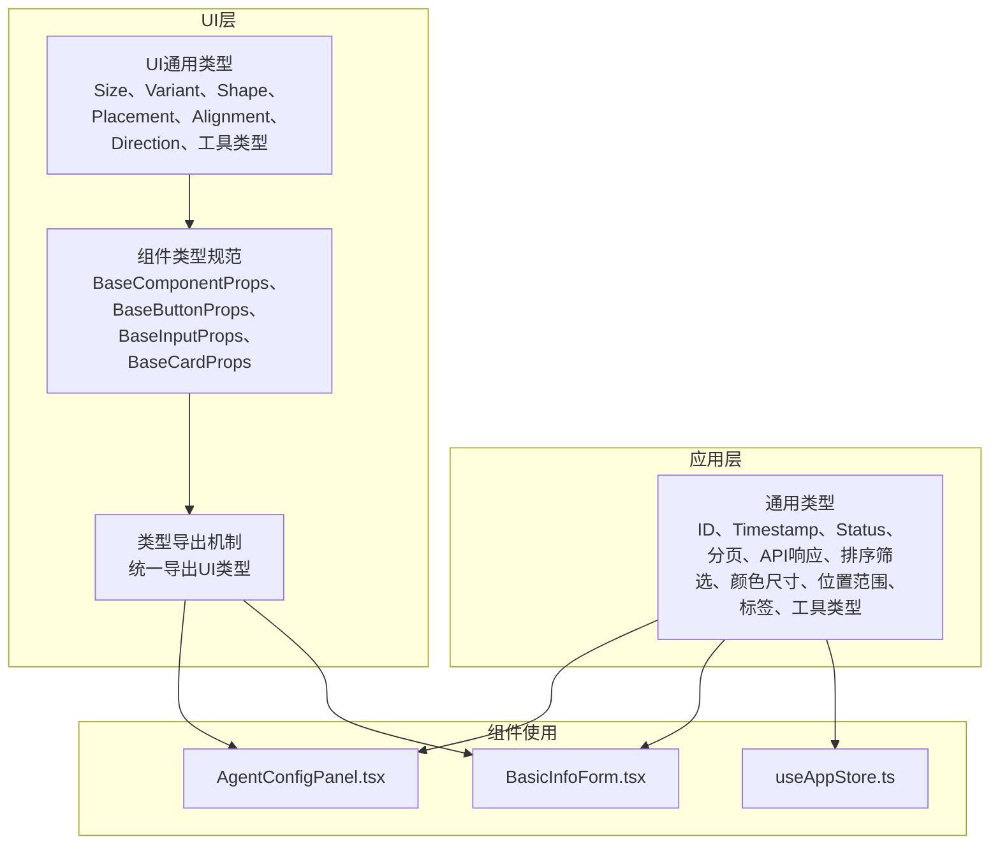
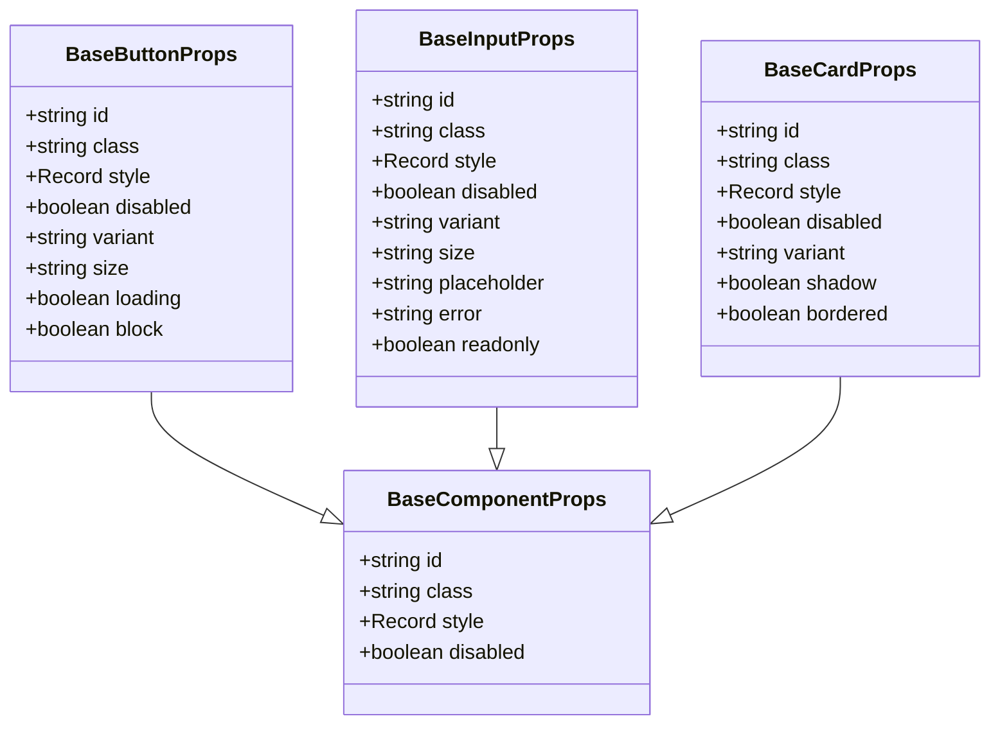
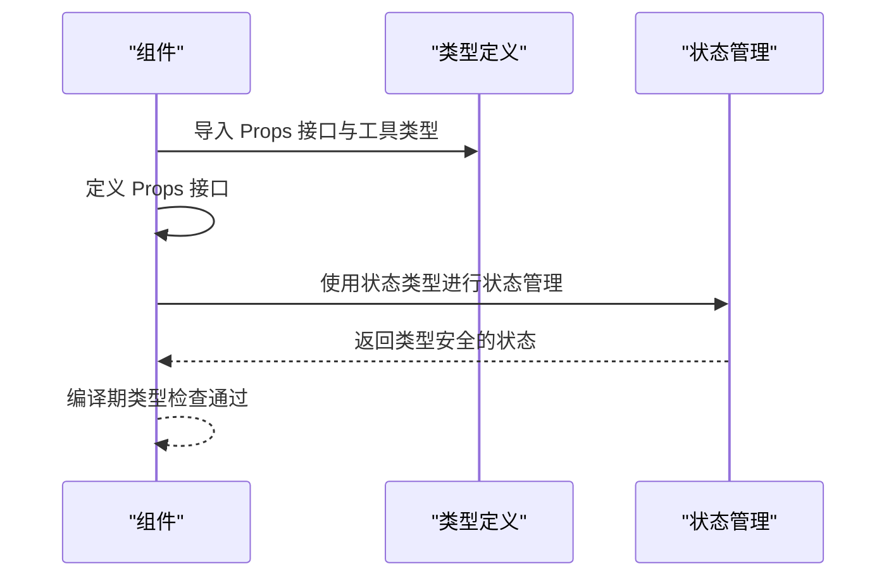
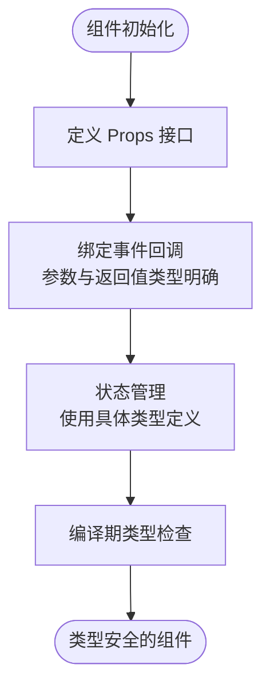
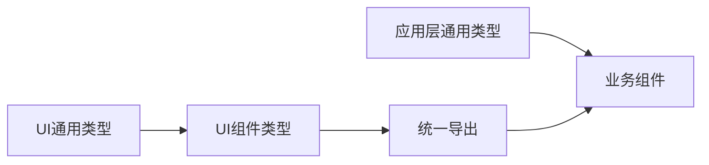

# 类型定义系统

<cite>
**本文档引用的文件**
- [common.ts](file://apps/AgentPit/src/types/common.ts)
- [component.ts](file://apps/AgentPit/packages/ui/src/types/component.ts)
- [common.ts](file://apps/AgentPit/packages/ui/src/types/common.ts)
- [index.ts](file://apps/AgentPit/packages/ui/src/types/index.ts)
- [AgentConfigPanel.tsx](file://apps/AgentPit/src-react-backup-20260410/components/collaboration/AgentConfigPanel.tsx)
- [BasicInfoForm.tsx](file://apps/AgentPit/src-react-backup-20260410/components/customize/BasicInfoForm.tsx)
- [useAppStore.ts](file://apps/AgentPit/src/stores/useAppStore.ts)
- [chatTypes.ts](file://apps/AgentPit/src-react-backup-20260410/types/chatTypes.ts)
</cite>

## 目录
1. [引言](#引言)
2. [项目结构](#项目结构)
3. [核心组件](#核心组件)
4. [架构概览](#架构概览)
5. [详细组件分析](#详细组件分析)
6. [依赖分析](#依赖分析)
7. [性能考虑](#性能考虑)
8. [故障排除指南](#故障排除指南)
9. [结论](#结论)

## 引言

本文件为 DAOApps 项目中类型定义系统的详细技术文档。重点解析以下三个核心文件的类型体系设计与实现：

- apps/AgentPit/src/types/common.ts：通用类型定义，涵盖基础标识符、时间戳、状态枚举、分页参数、API 响应结构、排序与筛选器、颜色与尺寸配置、位置坐标、范围区间、日期范围、选项与标签等
- apps/AgentPit/packages/ui/src/types/component.ts：组件类型规范，定义基础组件属性与按钮、输入框、卡片等组件的 Props 接口
- apps/AgentPit/packages/ui/src/types/common.ts：UI 组件通用类型，定义尺寸、变体、形状、放置位置、对齐方式、方向等通用枚举类型
- apps/AgentPit/packages/ui/src/types/index.ts：类型导出机制，统一导出 UI 类型模块的所有公共类型

同时，文档将结合实际组件使用示例，说明类型在 Props 接口、事件回调、状态管理中的应用，并阐述该类型系统的模块化设计、可扩展性与向后兼容性策略。

## 项目结构

类型定义系统主要分布在两个层次：

- 应用层通用类型：位于 apps/AgentPit/src/types/common.ts，提供跨模块使用的通用类型与工具类型
- UI 组件类型：位于 apps/AgentPit/packages/ui/src/types/，包含组件通用类型与组件类型规范，并通过 index.ts 统一导出

**图表来源**
- [common.ts:1-157](file://apps/AgentPit/src/types/common.ts#L1-L157)
- [common.ts:1-18](file://apps/AgentPit/packages/ui/src/types/common.ts#L1-L18)
- [component.ts:1-31](file://apps/AgentPit/packages/ui/src/types/component.ts#L1-L31)
- [index.ts:1-3](file://apps/AgentPit/packages/ui/src/types/index.ts#L1-L3)

**章节来源**
- [common.ts:1-157](file://apps/AgentPit/src/types/common.ts#L1-L157)
- [common.ts:1-18](file://apps/AgentPit/packages/ui/src/types/common.ts#L1-L18)
- [component.ts:1-31](file://apps/AgentPit/packages/ui/src/types/component.ts#L1-L31)
- [index.ts:1-3](file://apps/AgentPit/packages/ui/src/types/index.ts#L1-L3)

## 核心组件

### 通用类型定义（apps/AgentPit/src/types/common.ts）

该文件提供了项目中最基础且广泛使用的类型与工具类型，包括：

- 基础标识符与时间戳：ID、Timestamp
- 状态枚举与类型：Status 对象常量与 Status 联合类型
- 时间戳接口：Timestamps（createdAt、updatedAt）
- 分页参数与响应：PaginationParams、PaginationResponse<T>
- API 响应结构：ApiResponse<T>
- 排序方向与参数：SortDirection、SortParams
- 筛选器与选项：FilterOption、Option<T>
- 颜色与尺寸配置：ColorConfig、SizeConfig
- 位置与范围：Position、Range<T>、DateRange
- 标签与工具类型：Tag、Nullable<T>、Optional<T,K>、RequiredFields<T,K>

这些类型为业务组件与数据模型提供了统一的类型约束，确保跨模块的数据一致性与类型安全。

**章节来源**
- [common.ts:6-157](file://apps/AgentPit/src/types/common.ts#L6-L157)

### UI 组件通用类型（apps/AgentPit/packages/ui/src/types/common.ts）

该文件定义了 UI 组件常用的通用枚举与工具类型：

- 尺寸：Size（'xs' | 'sm' | 'md' | 'lg' | 'xl'）
- 变体：Variant（'default' | 'primary' | 'secondary' | 'success' | 'warning' | 'danger' | 'outline' | 'ghost'）
- 形状：Shape（'square' | 'rounded' | 'pill' | 'circle'）
- 放置位置：Placement（如 'top'、'bottom-start' 等 12 种方向）
- 对齐方式：Alignment（'left' | 'center' | 'right'）
- 方向：Direction（'horizontal' | 'vertical'）
- 工具类型：Nullable<T>、Optional<T,K>、RequiredFields<T,K>

这些类型为 UI 组件的 Props 提供了严格的类型约束，保证组件在不同主题、尺寸、状态下的表现一致。

**章节来源**
- [common.ts:1-18](file://apps/AgentPit/packages/ui/src/types/common.ts#L1-L18)

### 组件类型规范（apps/AgentPit/packages/ui/src/types/component.ts）

该文件基于 UI 通用类型，定义了基础组件属性与具体组件的 Props 接口：

- BaseComponentProps：基础组件属性（id、class、style、disabled）
- BaseButtonProps：按钮组件属性（继承基础属性，新增 variant、size、loading、block）
- BaseInputProps：输入组件属性（继承基础属性，新增 placeholder、error、readonly）
- BaseCardProps：卡片组件属性（继承基础属性，新增 variant、shadow、bordered）

通过继承与组合的方式，组件类型规范实现了高内聚、低耦合的类型设计，便于扩展新的组件类型。

**章节来源**
- [component.ts:3-31](file://apps/AgentPit/packages/ui/src/types/component.ts#L3-L31)

### 类型导出机制（apps/AgentPit/packages/ui/src/types/index.ts）

该文件通过统一导出，将 UI 类型模块的所有公共类型暴露给外部使用：

- 导出 common.ts 中的 UI 通用类型
- 导出 component.ts 中的组件类型规范

这种导出机制简化了外部模块的导入流程，提升了开发效率与一致性。

**章节来源**
- [index.ts:1-3](file://apps/AgentPit/packages/ui/src/types/index.ts#L1-L3)

## 架构概览

类型定义系统的架构遵循“应用层通用类型 + UI 组件类型”的分层设计，通过统一导出机制实现模块间的解耦与复用。

**图表来源**
- [common.ts:1-157](file://apps/AgentPit/src/types/common.ts#L1-L157)
- [common.ts:1-18](file://apps/AgentPit/packages/ui/src/types/common.ts#L1-L18)
- [component.ts:1-31](file://apps/AgentPit/packages/ui/src/types/component.ts#L1-L31)
- [index.ts:1-3](file://apps/AgentPit/packages/ui/src/types/index.ts#L1-L3)

## 详细组件分析

### 通用类型体系分析

通用类型体系涵盖了数据建模、API 交互、UI 表现等多个维度，具有以下特点：

- **强约束性**：通过联合类型与对象常量，确保状态、排序方向、筛选选项等值域的正确性
- **泛型支持**：分页响应、选项、范围等类型采用泛型，提升复用性与类型安全性
- **工具类型**：Nullable、Optional、RequiredFields 等工具类型提供灵活的类型组合能力
- **接口化设计**：时间戳、颜色配置、尺寸配置、位置坐标等采用接口定义，便于扩展字段

```mermaid
classDiagram
class ID {
+string|number
}
class Timestamp {
+number|string|Date
}
class Status {
+ACTIVE
+INACTIVE
+PENDING
+COMPLETED
+IN_PROGRESS
+FAILED
+CANCELLED
}
class Timestamps {
+string createdAt
+string updatedAt
}
class PaginationParams {
+number page
+number pageSize
}
class PaginationResponse_T_ {
+T[] list
+number total
+number page
+number pageSize
+number totalPages
}
class ApiResponse_T_ {
+boolean success
+T data
+string message
+string code
}
class SortDirection {
+"asc"|"desc"
}
class SortParams {
+string field
+SortDirection direction
}
class FilterOption {
+string label
+string|number value
+string icon
}
class Option_T_ {
+string label
+T value
+boolean disabled
+string icon
+string description
}
class ColorConfig {
+string primary
+string secondary
+string accent
+string background
+string text
}
class SizeConfig {
+number|string width
+number|string height
+number|string maxWidth
+number|string maxHeight
}
class Position {
+number x
+number y
}
class Range_T_ {
+T min
+T max
}
class DateRange {
+string start
+string end
}
class Tag {
+string id
+string name
+string color
+string icon
}
class Nullable_T_ {
+T|null
}
class Optional_T_K_ {
+Omit<T,K>&Partial<Pick<T,K>>
}
class RequiredFields_T_K_ {
+T&Required<Pick<T,K>>
}
```

**图表来源**
- [common.ts:6-157](file://apps/AgentPit/src/types/common.ts#L6-L157)

**章节来源**
- [common.ts:6-157](file://apps/AgentPit/src/types/common.ts#L6-L157)

### UI 组件类型体系分析

UI 组件类型体系通过继承与组合实现高度复用：

- BaseComponentProps 作为所有组件的基础属性
- BaseButtonProps、BaseInputProps、BaseCardProps 在此基础上扩展特定功能
- 通过引入 UI 通用类型（Size、Variant、Shape），确保组件外观与行为的一致性

**图表来源**
- [component.ts:3-31](file://apps/AgentPit/packages/ui/src/types/component.ts#L3-L31)

**章节来源**
- [component.ts:3-31](file://apps/AgentPit/packages/ui/src/types/component.ts#L3-L31)

### 类型使用示例与最佳实践

#### 组件 Props 接口使用

在组件中，通过 Props 接口明确声明组件的输入参数，确保类型安全与 IDE 智能提示：

- AgentConfigPanel.tsx 使用了 Partial<Agent> 作为保存配置的状态类型，体现了 Optional 工具类型的灵活性
- BasicInfoForm.tsx 使用了 Record<string, string> 作为表单错误信息的存储类型，便于动态键值管理

**图表来源**
- [AgentConfigPanel.tsx:4-8](file://apps/AgentPit/src-react-backup-20260410/components/collaboration/AgentConfigPanel.tsx#L4-L8)
- [BasicInfoForm.tsx:4-14](file://apps/AgentPit/src-react-backup-20260410/components/customize/BasicInfoForm.tsx#L4-L14)
- [useAppStore.ts:3-9](file://apps/AgentPit/src/stores/useAppStore.ts#L3-L9)

**章节来源**
- [AgentConfigPanel.tsx:4-8](file://apps/AgentPit/src-react-backup-20260410/components/collaboration/AgentConfigPanel.tsx#L4-L8)
- [BasicInfoForm.tsx:4-14](file://apps/AgentPit/src-react-backup-20260410/components/customize/BasicInfoForm.tsx#L4-L14)
- [useAppStore.ts:3-9](file://apps/AgentPit/src/stores/useAppStore.ts#L3-L9)

#### 事件与状态类型使用

- 事件回调函数通过明确的参数类型与返回值类型，确保事件处理逻辑的类型安全
- 状态管理中使用具体的类型定义，避免使用 any 或 unknown，提升代码可维护性

[此图为概念性流程图，不直接映射到具体源文件，因此无需图表来源]

## 依赖分析

类型定义系统内部的依赖关系清晰，遵循从通用到专用的层级结构：

- 应用层通用类型被所有业务组件使用
- UI 通用类型被 UI 组件类型依赖
- 组件类型通过统一导出机制对外提供

**图表来源**
- [common.ts:1-157](file://apps/AgentPit/src/types/common.ts#L1-L157)
- [common.ts:1-18](file://apps/AgentPit/packages/ui/src/types/common.ts#L1-L18)
- [component.ts:1-31](file://apps/AgentPit/packages/ui/src/types/component.ts#L1-L31)
- [index.ts:1-3](file://apps/AgentPit/packages/ui/src/types/index.ts#L1-L3)

**章节来源**
- [common.ts:1-157](file://apps/AgentPit/src/types/common.ts#L1-L157)
- [common.ts:1-18](file://apps/AgentPit/packages/ui/src/types/common.ts#L1-L18)
- [component.ts:1-31](file://apps/AgentPit/packages/ui/src/types/component.ts#L1-L31)
- [index.ts:1-3](file://apps/AgentPit/packages/ui/src/types/index.ts#L1-L3)

## 性能考虑

- 类型检查在编译阶段完成，不会影响运行时性能
- 泛型与工具类型在编译后会被擦除，不产生额外的运行时开销
- 合理使用只读接口与不可变数据结构，有助于减少不必要的状态更新

[本节为通用指导，不直接分析具体文件，因此无需章节来源]

## 故障排除指南

- 类型不匹配：当出现类型不匹配错误时，检查相关接口的字段定义与实际传入值是否一致
- 泛型推断问题：在复杂泛型场景中，显式指定泛型参数可避免推断错误
- 工具类型误用：确保 Optional 与 RequiredFields 的使用场景正确，避免过度约束或约束不足

[本节为通用指导，不直接分析具体文件，因此无需章节来源]

## 结论

DAOApps 项目的类型定义系统通过“应用层通用类型 + UI 组件类型”的分层设计，实现了高内聚、低耦合的类型体系。该系统不仅提供了强类型的约束与丰富的工具类型，还通过统一导出机制提升了模块间的复用性与一致性。结合实际组件的使用示例，可以看出该类型系统在保证类型安全的同时，也兼顾了开发效率与可维护性。建议在后续迭代中继续完善类型注释与文档，进一步提升团队协作效率与代码质量。