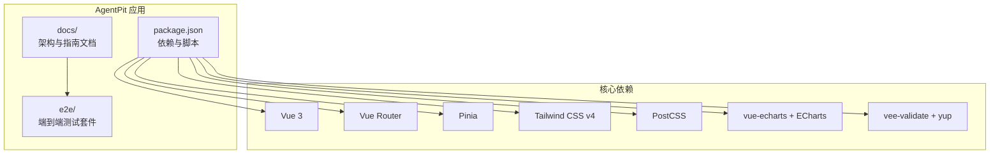
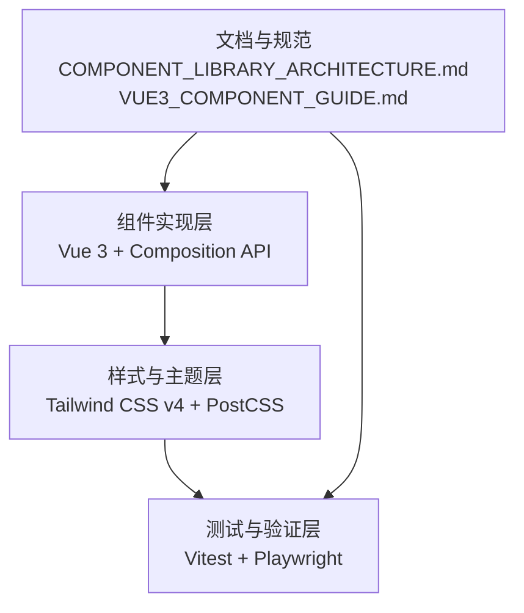
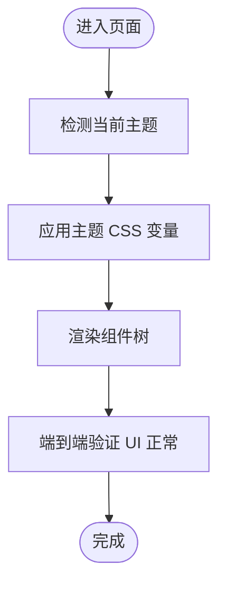
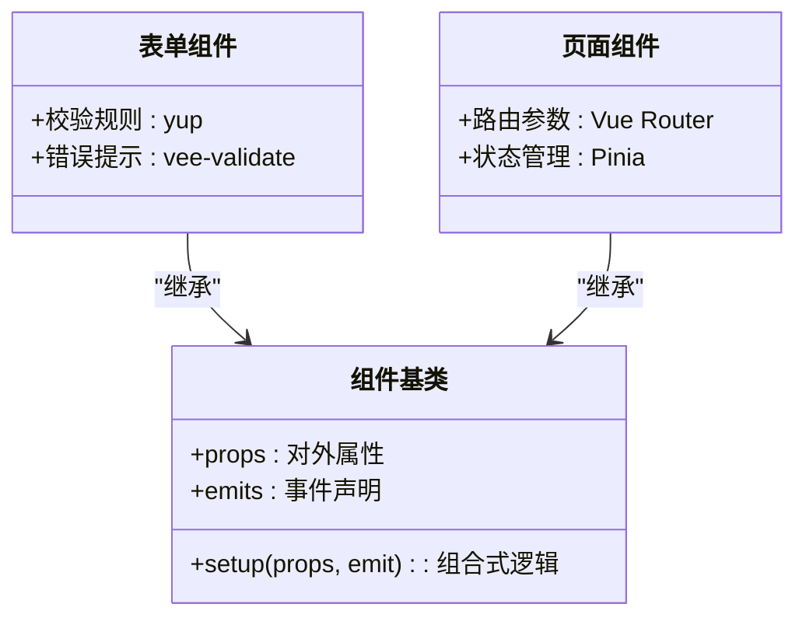
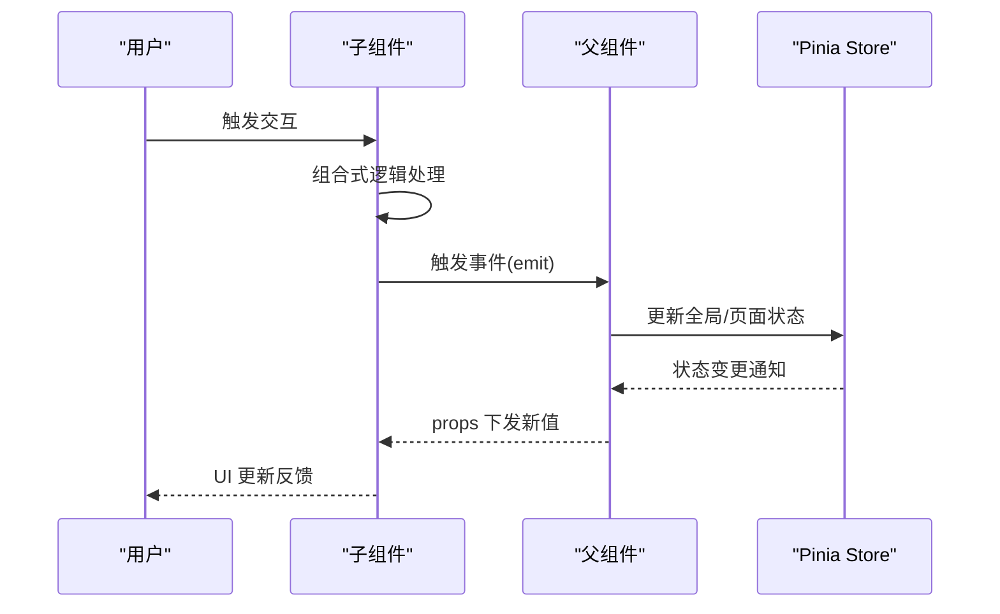
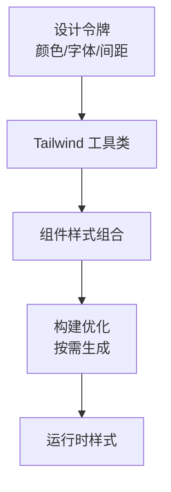
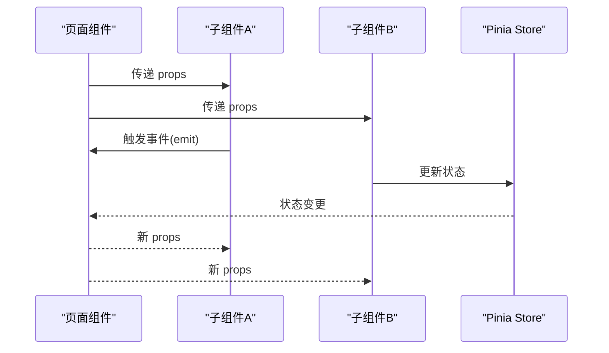
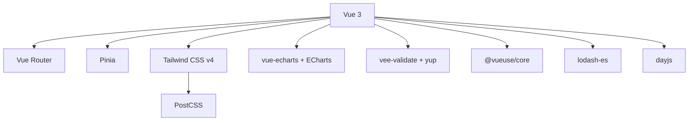

# 组件库系统

<cite>
**本文引用的文件**
- [apps/AgentPit/package.json](file://apps/AgentPit/package.json)
- [apps/AgentPit/docs/COMPONENT_LIBRARY_ARCHITECTURE.md](file://apps/AgentPit/docs/COMPONENT_LIBRARY_ARCHITECTURE.md)
- [apps/AgentPit/docs/VUE3_COMPONENT_GUIDE.md](file://apps/AgentPit/docs/VUE3_COMPONENT_GUIDE.md)
- [apps/AgentPit/docs/MIGRATION_MAPPING.md](file://apps/AgentPit/docs/MIGRATION_MAPPING.md)
- [apps/AgentPit/docs/AI智能体出海生态黑客松综述.md](file://apps/AgentPit/docs/AI智能体出海生态黑客松综述.md)
- [apps/AgentPit/e2e/theme-switching.spec.ts](file://apps/AgentPit/e2e/theme-switching.spec.ts)
- [apps/AgentPit/e2e/responsive-layout.spec.ts](file://apps/AgentPit/e2e/responsive-layout.spec.ts)
- [apps/AgentPit/e2e/chat-flow.spec.ts](file://apps/AgentPit/e2e/chat-flow.spec.ts)
- [apps/AgentPit/e2e/homepage.spec.ts](file://apps/AgentPit/e2e/homepage.spec.ts)
- [apps/AgentPit/e2e/shopping-journey.spec.ts](file://apps/AgentPit/e2e/shopping-journey.spec.ts)
- [apps/AgentPit/e2e/social-interaction.spec.ts](file://apps/AgentPit/e2e/social-interaction.spec.ts)
- [apps/AgentPit/e2e/wallet-operations.spec.ts](file://apps/AgentPit/e2e/wallet-operations.spec.ts)
</cite>

## 目录
1. [引言](#引言)
2. [项目结构](#项目结构)
3. [核心组件](#核心组件)
4. [架构总览](#架构总览)
5. [详细组件分析](#详细组件分析)
6. [依赖分析](#依赖分析)
7. [性能考虑](#性能考虑)
8. [故障排查指南](#故障排查指南)
9. [结论](#结论)
10. [附录](#附录)

## 引言
本技术文档围绕 DaoMind 组件库系统展开，基于仓库中已提供的架构文档与端到端测试用例，系统阐述组件库的整体架构、设计系统、主题定制机制、UI 组件开发规范、命名约定、属性与事件模型、组合模式、状态管理、样式系统与响应式设计，并给出最佳实践、性能优化建议与可访问性支持策略。同时，文档将结合 Vue 3 Composition API 的使用方式，帮助读者在实际项目中高效构建与扩展组件库。

## 项目结构
仓库采用多应用与多包并存的组织方式，其中与组件库直接相关的信息主要集中在 AgentPit 应用及其文档中。AgentPit 是一个基于 Vue 3 的前端应用，内部包含组件库文档与端到端测试，用于验证组件库的可用性、主题切换与响应式布局等关键能力。

- 核心依赖与工具链
  - 框架与运行时：Vue 3、Vue Router、Pinia（状态管理）
  - 样式与主题：Tailwind CSS v4、PostCSS、@tailwindcss/vite
  - 工具库：@vueuse/core、lodash-es、dayjs、vee-validate、yup
  - 可视化：vue-echarts、echarts
  - 测试：Vitest、Playwright（端到端）

- 文档与规范
  - COMPONENT_LIBRARY_ARCHITECTURE.md：组件库整体架构与模块划分
  - VUE3_COMPONENT_GUIDE.md：Vue 3 组件开发规范与 Composition API 使用指南
  - MIGRATION_MAPPING.md：迁移映射与版本演进参考

- 端到端测试
  - 主题切换、响应式布局、聊天流程、首页导航、购物旅程、社交交互、钱包操作等场景覆盖组件库的关键行为与视觉一致性。

**图表来源**
- [apps/AgentPit/package.json:1-73](file://apps/AgentPit/package.json#L1-L73)
- [apps/AgentPit/docs/COMPONENT_LIBRARY_ARCHITECTURE.md](file://apps/AgentPit/docs/COMPONENT_LIBRARY_ARCHITECTURE.md)
- [apps/AgentPit/docs/VUE3_COMPONENT_GUIDE.md](file://apps/AgentPit/docs/VUE3_COMPONENT_GUIDE.md)

**章节来源**
- [apps/AgentPit/package.json:1-73](file://apps/AgentPit/package.json#L1-L73)
- [apps/AgentPit/docs/COMPONENT_LIBRARY_ARCHITECTURE.md](file://apps/AgentPit/docs/COMPONENT_LIBRARY_ARCHITECTURE.md)
- [apps/AgentPit/docs/VUE3_COMPONENT_GUIDE.md](file://apps/AgentPit/docs/VUE3_COMPONENT_GUIDE.md)
- [apps/AgentPit/docs/MIGRATION_MAPPING.md](file://apps/AgentPit/docs/MIGRATION_MAPPING.md)

## 核心组件
根据组件库架构文档与端到端测试场景，组件库的核心能力可归纳为以下方面：

- 设计系统与主题定制
  - 基于 Tailwind CSS v4 的原子化样式体系，通过 @tailwindcss/vite 集成，支持主题变量与暗色模式切换。
  - 端到端测试覆盖“主题切换”场景，确保组件在不同主题下的一致性与可读性。

- 组件开发规范与命名约定
  - Vue 3 组件遵循 Composition API 规范，统一使用 TypeScript 类型声明与 props/emits 定义。
  - 组件命名采用语义化前缀与层级结构，便于维护与检索。

- 属性定义与事件处理
  - 所有对外暴露的属性以 props 形式定义，事件通过 emits 明确声明，避免隐式耦合。
  - 表单类组件结合 vee-validate 与 yup 进行校验与错误提示。

- 组合模式与状态管理
  - 使用 Pinia 进行全局状态管理，组件通过 Composables 封装共享逻辑，降低重复代码。
  - 复杂业务流程（如聊天、购物）通过页面级 Store 与局部状态协同完成。

- 样式系统与响应式设计
  - Tailwind 提供断点与工具类，结合 @apply 与自定义插件实现响应式布局。
  - 端到端测试覆盖“响应式布局”，验证在不同屏幕尺寸下的显示效果。

- 可访问性支持
  - 通过语义化标签、ARIA 属性与键盘导航保证可访问性。
  - 表单控件具备清晰的标签与错误提示，提升用户体验。

**章节来源**
- [apps/AgentPit/docs/COMPONENT_LIBRARY_ARCHITECTURE.md](file://apps/AgentPit/docs/COMPONENT_LIBRARY_ARCHITECTURE.md)
- [apps/AgentPit/docs/VUE3_COMPONENT_GUIDE.md](file://apps/AgentPit/docs/VUE3_COMPONENT_GUIDE.md)
- [apps/AgentPit/e2e/theme-switching.spec.ts](file://apps/AgentPit/e2e/theme-switching.spec.ts)
- [apps/AgentPit/e2e/responsive-layout.spec.ts](file://apps/AgentPit/e2e/responsive-layout.spec.ts)

## 架构总览
组件库的总体架构由“文档与规范层”、“组件实现层”、“样式与主题层”、“测试与验证层”构成。文档与规范层提供统一的设计语言与开发标准；组件实现层基于 Vue 3 Composition API 实现；样式与主题层通过 Tailwind CSS v4 与 PostCSS 提供一致的视觉体验；测试与验证层通过 Vitest 与 Playwright 确保质量与一致性。

**图表来源**
- [apps/AgentPit/docs/COMPONENT_LIBRARY_ARCHITECTURE.md](file://apps/AgentPit/docs/COMPONENT_LIBRARY_ARCHITECTURE.md)
- [apps/AgentPit/docs/VUE3_COMPONENT_GUIDE.md](file://apps/AgentPit/docs/VUE3_COMPONENT_GUIDE.md)
- [apps/AgentPit/package.json:1-73](file://apps/AgentPit/package.json#L1-L73)

## 详细组件分析

### 设计系统与主题定制
- 设计令牌与主题变量
  - 使用 Tailwind CSS v4 的原子化类名与自定义变量，统一颜色、字体、间距与阴影等设计令牌。
  - @tailwindcss/vite 插件负责在构建阶段生成所需样式，减少运行时开销。
- 主题切换机制
  - 通过全局状态或 CSS 变量控制明/暗主题，端到端测试覆盖主题切换后的视觉一致性。
  - 组件内部不直接硬编码颜色，而是依赖设计令牌，确保主题切换时的自动适配。

**图表来源**
- [apps/AgentPit/e2e/theme-switching.spec.ts](file://apps/AgentPit/e2e/theme-switching.spec.ts)

**章节来源**
- [apps/AgentPit/package.json:1-73](file://apps/AgentPit/package.json#L1-L73)
- [apps/AgentPit/e2e/theme-switching.spec.ts](file://apps/AgentPit/e2e/theme-switching.spec.ts)

### 组件开发规范与命名约定
- 文件与目录结构
  - 组件按功能域分层存放，例如 collaboration、customize、layout、marketplace 等，便于团队协作与维护。
- 命名约定
  - 组件文件采用 PascalCase，导出名称与文件名一致；类型与枚举使用明确的后缀区分。
- Props 与 Emits
  - 所有对外属性以 props 显式定义，事件以 emits 明确声明，避免隐式依赖。
- 类型安全
  - 使用 TypeScript 严格模式，结合 vee-validate 与 yup 提供表单校验类型推断。

**图表来源**
- [apps/AgentPit/docs/VUE3_COMPONENT_GUIDE.md](file://apps/AgentPit/docs/VUE3_COMPONENT_GUIDE.md)

**章节来源**
- [apps/AgentPit/docs/VUE3_COMPONENT_GUIDE.md](file://apps/AgentPit/docs/VUE3_COMPONENT_GUIDE.md)

### 组合模式与状态管理
- 组合式函数（Composables）
  - 将跨组件共享的逻辑封装为 Composables，减少重复代码，提升可测试性。
- 全局状态与页面状态
  - 使用 Pinia 管理全局状态（如用户信息、主题偏好），页面级 Store 负责局部业务数据。
- 事件驱动与数据流
  - 通过 emits 向父组件传递事件，父组件更新状态，子组件响应变化，形成单向数据流。

**图表来源**
- [apps/AgentPit/docs/VUE3_COMPONENT_GUIDE.md](file://apps/AgentPit/docs/VUE3_COMPONENT_GUIDE.md)

**章节来源**
- [apps/AgentPit/docs/VUE3_COMPONENT_GUIDE.md](file://apps/AgentPit/docs/VUE3_COMPONENT_GUIDE.md)

### 样式系统与响应式设计
- 原子化样式与工具类
  - Tailwind CSS v4 提供丰富的工具类，组件通过组合类名实现布局与风格，减少自定义 CSS。
- 断点与响应式
  - 通过断点前缀控制在不同屏幕尺寸下的表现，端到端测试覆盖响应式布局场景。
- 自定义插件与构建优化
  - PostCSS 与 @tailwindcss/vite 协同，按需生成样式，提升构建效率与运行时性能。

**图表来源**
- [apps/AgentPit/package.json:1-73](file://apps/AgentPit/package.json#L1-L73)
- [apps/AgentPit/e2e/responsive-layout.spec.ts](file://apps/AgentPit/e2e/responsive-layout.spec.ts)

**章节来源**
- [apps/AgentPit/package.json:1-73](file://apps/AgentPit/package.json#L1-L73)
- [apps/AgentPit/e2e/responsive-layout.spec.ts](file://apps/AgentPit/e2e/responsive-layout.spec.ts)

### 可访问性支持
- 语义化与键盘导航
  - 使用语义化 HTML 标签，确保屏幕阅读器可正确识别内容；提供键盘可达的交互路径。
- 错误提示与焦点管理
  - 表单错误通过 vee-validate 与 yup 提示，组件在失焦或提交时聚焦到首个错误项。
- 对比度与可读性
  - 主题切换后保持足够的对比度，确保文本在不同背景下均清晰可读。

**章节来源**
- [apps/AgentPit/docs/VUE3_COMPONENT_GUIDE.md](file://apps/AgentPit/docs/VUE3_COMPONENT_GUIDE.md)

### 组件间通信与集成
- 事件总线与组合式通信
  - 通过 emits 与父组件通信，复杂场景使用 Pinia Store 或上下文（Context）进行跨层级通信。
- 第三方库集成
  - vue-echarts 与 echarts 用于可视化；vee-validate 与 yup 用于表单校验；@vueuse/core 提供通用工具函数。
- 页面级流程编排
  - 聊天、购物、社交等流程通过页面组件协调多个子组件与 Store，形成完整的业务闭环。

**图表来源**
- [apps/AgentPit/docs/VUE3_COMPONENT_GUIDE.md](file://apps/AgentPit/docs/VUE3_COMPONENT_GUIDE.md)

**章节来源**
- [apps/AgentPit/docs/VUE3_COMPONENT_GUIDE.md](file://apps/AgentPit/docs/VUE3_COMPONENT_GUIDE.md)

## 依赖分析
组件库的依赖关系围绕 Vue 3 生态与 Tailwind CSS v4 展开，核心依赖包括框架、路由、状态管理、样式与可视化等模块。这些依赖共同支撑组件库的开发、构建与运行。

**图表来源**
- [apps/AgentPit/package.json:1-73](file://apps/AgentPit/package.json#L1-L73)

**章节来源**
- [apps/AgentPit/package.json:1-73](file://apps/AgentPit/package.json#L1-L73)

## 性能考虑
- 构建与打包优化
  - 使用 @tailwindcss/vite 在构建阶段生成样式，减少运行时计算；按需引入第三方库，避免全量打包。
- 组件渲染优化
  - 使用 Vue 3 的组合式 API 与响应式系统，避免不必要的重渲染；对长列表使用虚拟滚动与懒加载。
- 样式与资源优化
  - Tailwind 工具类按需使用，避免生成冗余样式；图片与图标采用 WebP/SVG 等现代格式。
- 可访问性与性能平衡
  - 在保证可访问性的前提下，尽量减少 DOM 结构与嵌套层级，提升首屏渲染速度。

[本节为通用指导，无需特定文件来源]

## 故障排查指南
- 主题切换异常
  - 检查主题变量是否正确应用，确认 @tailwindcss/vite 插件配置与构建产物。
  - 使用端到端测试“theme-switching.spec.ts”验证切换后的 UI 行为。
- 响应式布局错乱
  - 核对断点前缀与容器宽度设置，使用“responsive-layout.spec.ts”验证不同尺寸下的表现。
- 表单校验失败
  - 检查 vee-validate 与 yup 的规则配置，确保错误提示与焦点管理正常。
- 聊天/购物/社交流程异常
  - 使用对应端到端测试（chat-flow、shopping-journey、social-interaction、wallet-operations）定位问题环节。

**章节来源**
- [apps/AgentPit/e2e/theme-switching.spec.ts](file://apps/AgentPit/e2e/theme-switching.spec.ts)
- [apps/AgentPit/e2e/responsive-layout.spec.ts](file://apps/AgentPit/e2e/responsive-layout.spec.ts)
- [apps/AgentPit/e2e/chat-flow.spec.ts](file://apps/AgentPit/e2e/chat-flow.spec.ts)
- [apps/AgentPit/e2e/shopping-journey.spec.ts](file://apps/AgentPit/e2e/shopping-journey.spec.ts)
- [apps/AgentPit/e2e/social-interaction.spec.ts](file://apps/AgentPit/e2e/social-interaction.spec.ts)
- [apps/AgentPit/e2e/wallet-operations.spec.ts](file://apps/AgentPit/e2e/wallet-operations.spec.ts)

## 结论
DaoMind 组件库系统以 Vue 3 为核心，结合 Tailwind CSS v4、Pinia、vee-validate、yup 等生态工具，形成了统一的设计语言、开发规范与质量保障体系。通过文档与端到端测试的双重约束，组件库在主题定制、响应式设计、可访问性与性能方面均具备良好的工程化实践。建议在后续迭代中持续完善组件文档、补充单元测试覆盖率，并探索自动化可访问性检测工具，进一步提升组件库的稳定性与可维护性。

[本节为总结性内容，无需特定文件来源]

## 附录
- 版本迁移与演进参考：MIGRATION_MAPPING.md
- 项目背景与综述：AI智能体出海生态黑客松综述.md

**章节来源**
- [apps/AgentPit/docs/MIGRATION_MAPPING.md](file://apps/AgentPit/docs/MIGRATION_MAPPING.md)
- [apps/AgentPit/docs/AI智能体出海生态黑客松综述.md](file://apps/AgentPit/docs/AI智能体出海生态黑客松综述.md)