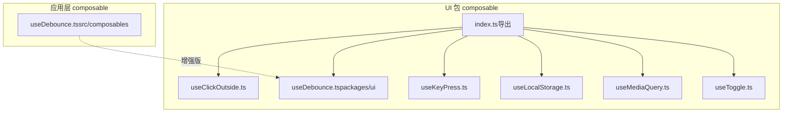
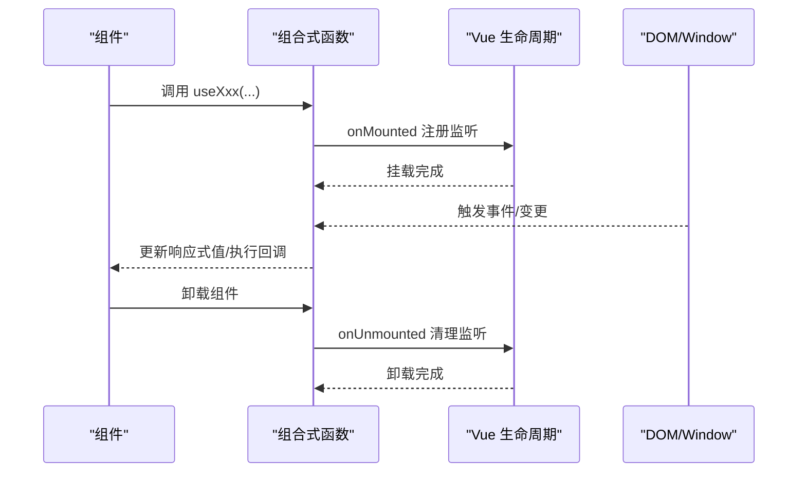
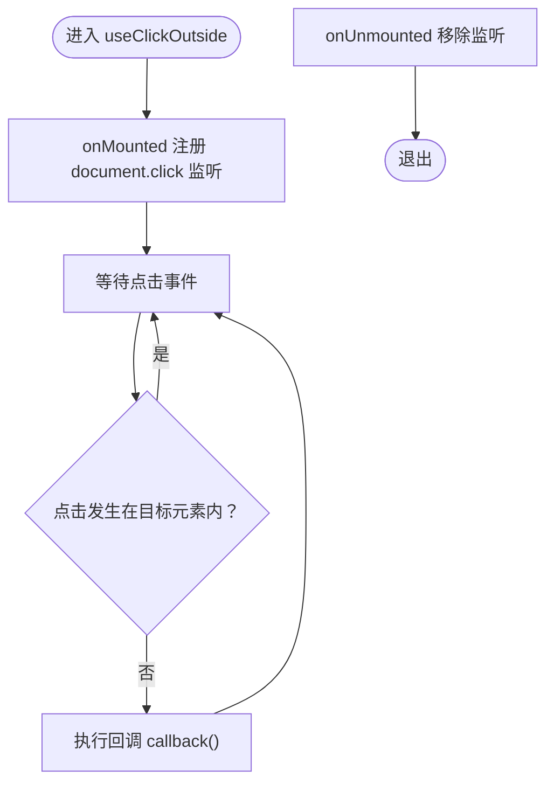
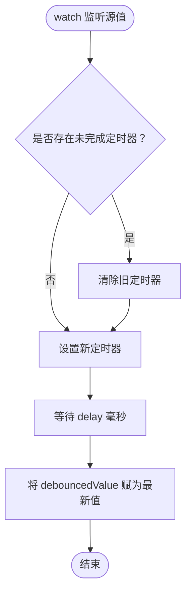
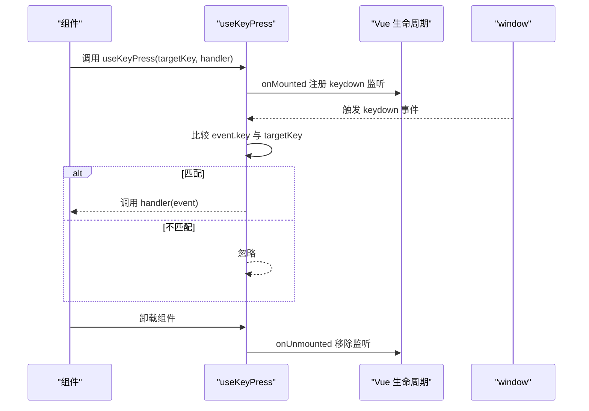
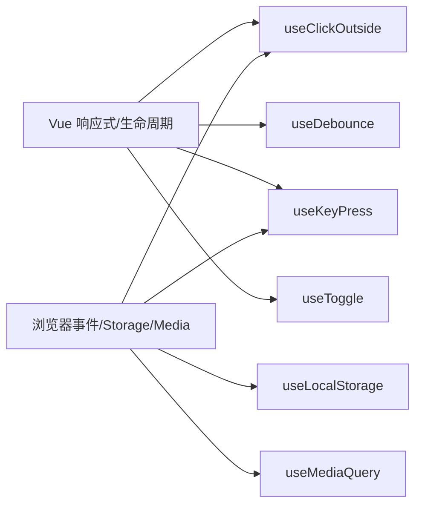

# 组合式函数系统

<cite>
**本文引用的文件**
- [useClickOutside.ts](file://apps/AgentPit/packages/ui/src/composables/useClickOutside.ts)
- [useDebounce.ts（packages/ui）](file://apps/AgentPit/packages/ui/src/composables/useDebounce.ts)
- [useKeyPress.ts](file://apps/AgentPit/packages/ui/src/composables/useKeyPress.ts)
- [useLocalStorage.ts](file://apps/AgentPit/packages/ui/src/composables/useLocalStorage.ts)
- [useMediaQuery.ts](file://apps/AgentPit/packages/ui/src/composables/useMediaQuery.ts)
- [useToggle.ts](file://apps/AgentPit/packages/ui/src/composables/useToggle.ts)
- [index.ts（composables 导出）](file://apps/AgentPit/packages/ui/src/composables/index.ts)
- [useDebounce.ts（src/composables）](file://apps/AgentPit/src/composables/useDebounce.ts)
- [useDebounce.spec.ts](file://apps/AgentPit/src/__tests__/composables/useDebounce.spec.ts)
</cite>

## 目录
1. [简介](#简介)
2. [项目结构](#项目结构)
3. [核心组件](#核心组件)
4. [架构总览](#架构总览)
5. [详细组件分析](#详细组件分析)
6. [依赖关系分析](#依赖关系分析)
7. [性能考量](#性能考量)
8. [故障排查指南](#故障排查指南)
9. [结论](#结论)
10. [附录](#附录)

## 简介
本文件系统性介绍组合式函数（Composables）体系，重点覆盖以下通用能力：useClickOutside（点击外部区域检测）、useDebounce（防抖）、useKeyPress（键盘按键监听）。文档从实现原理、参数与返回值、副作用与生命周期管理、内存泄漏防护、性能优化、错误处理到测试方法进行完整说明，并给出在 Vue 3 Composition API 中的集成方式与典型使用场景。

## 项目结构
组合式函数集中于 AgentPit 应用的 UI 包与应用层两个位置：
- packages/ui/src/composables：通用 UI 能力，导出入口位于 index.ts
- apps/AgentPit/src/composables：应用层扩展与增强版本（如更灵活的 useDebounce）

图表来源
- [index.ts（composables 导出）:1-6](file://apps/AgentPit/packages/ui/src/composables/index.ts#L1-L6)
- [useClickOutside.ts:1-17](file://apps/AgentPit/packages/ui/src/composables/useClickOutside.ts#L1-L17)
- [useDebounce.ts（packages/ui）:1-17](file://apps/AgentPit/packages/ui/src/composables/useDebounce.ts#L1-L17)
- [useKeyPress.ts:1-17](file://apps/AgentPit/packages/ui/src/composables/useKeyPress.ts#L1-L17)
- [useLocalStorage.ts:1-14](file://apps/AgentPit/packages/ui/src/composables/useLocalStorage.ts#L1-L14)
- [useMediaQuery.ts:1-27](file://apps/AgentPit/packages/ui/src/composables/useMediaQuery.ts#L1-L27)
- [useToggle.ts:1-24](file://apps/AgentPit/packages/ui/src/composables/useToggle.ts#L1-L24)
- [useDebounce.ts（src/composables）:1-20](file://apps/AgentPit/src/composables/useDebounce.ts#L1-L20)

章节来源
- [index.ts（composables 导出）:1-6](file://apps/AgentPit/packages/ui/src/composables/index.ts#L1-L6)

## 核心组件
- useClickOutside：监听全局点击事件，当点击目标不在指定元素内时触发回调，自动在挂载/卸载阶段注册/移除事件监听器。
- useDebounce：对输入值进行防抖，支持 Ref 或函数形式的源值，返回一个延迟更新的新 Ref；提供默认延迟时间与可配置延迟。
- useKeyPress：监听窗口级键盘事件，匹配指定键名后调用处理器，生命周期内自动注册/移除监听。

章节来源
- [useClickOutside.ts:1-17](file://apps/AgentPit/packages/ui/src/composables/useClickOutside.ts#L1-L17)
- [useDebounce.ts（packages/ui）:1-17](file://apps/AgentPit/packages/ui/src/composables/useDebounce.ts#L1-L17)
- [useKeyPress.ts:1-17](file://apps/AgentPit/packages/ui/src/composables/useKeyPress.ts#L1-L17)
- [useDebounce.ts（src/composables）:1-20](file://apps/AgentPit/src/composables/useDebounce.ts#L1-L20)

## 架构总览
组合式函数遵循 Composition API 的响应式与生命周期模式：
- 使用 ref/watch 管理状态与变更
- 使用 onMounted/onUnmounted 管理副作用的安装与清理
- 返回纯函数或可响应式对象，便于在组件中直接消费

## 详细组件分析

### useClickOutside 分析
- 功能：检测“点击外部区域”并触发回调
- 参数
  - element: Ref<HTMLElement | null>，目标元素引用
  - callback: () => void，点击外部时的回调
- 返回值：无（仅副作用）
- 副作用与生命周期
  - 在 onMounted 时向 document 添加 click 监听
  - 在 onUnmounted 时移除监听，防止内存泄漏
- 处理逻辑要点
  - 通过 element.value.contains 判断点击是否发生在目标元素内部
  - 若不在内部则执行回调
- 典型使用场景
  - 下拉菜单/弹窗关闭
  - 模态框外点击关闭
  - 面包屑/导航栏外点击收起

图表来源
- [useClickOutside.ts:1-17](file://apps/AgentPit/packages/ui/src/composables/useClickOutside.ts#L1-L17)

章节来源
- [useClickOutside.ts:1-17](file://apps/AgentPit/packages/ui/src/composables/useClickOutside.ts#L1-L17)

### useDebounce 分析
- 功能：对输入值进行防抖，延迟输出最新值
- 参数
  - value: Ref<T> 或 (() => T)，源值或计算源值的函数
  - delay: number，默认 300ms
- 返回值：Ref<T>，延迟后的最新值
- 副作用与生命周期
  - 内部使用 watch 监听源值变化
  - 每次变更前清除上一次定时器，设置新的定时器
  - 该函数本身不直接绑定生命周期，但通常在组件中配合 onMounted/onUnmounted 使用（见测试与使用建议）
- 处理逻辑要点
  - 支持函数式源值，便于从复杂计算中取值
  - 默认延迟 300ms，可自定义
  - 多次快速更新时，仅保留最后一次变更
- 典型使用场景
  - 搜索输入防抖
  - 表单输入节流
  - 窗口尺寸变化监听的节流

图表来源
- [useDebounce.ts（packages/ui）:1-17](file://apps/AgentPit/packages/ui/src/composables/useDebounce.ts#L1-L17)
- [useDebounce.ts（src/composables）:1-20](file://apps/AgentPit/src/composables/useDebounce.ts#L1-L20)

章节来源
- [useDebounce.ts（packages/ui）:1-17](file://apps/AgentPit/packages/ui/src/composables/useDebounce.ts#L1-L17)
- [useDebounce.ts（src/composables）:1-20](file://apps/AgentPit/src/composables/useDebounce.ts#L1-L20)
- [useDebounce.spec.ts:1-203](file://apps/AgentPit/src/__tests__/composables/useDebounce.spec.ts#L1-L203)

### useKeyPress 分析
- 功能：监听窗口级键盘事件，匹配指定键名后调用处理器
- 参数
  - targetKey: string，目标键名（如 Enter、Escape 等）
  - handler: (event: KeyboardEvent) => void，按键匹配时的回调
- 返回值：无（仅副作用）
- 副作用与生命周期
  - onMounted 注册 window.keydown 监听
  - onUnmounted 移除监听，避免内存泄漏
- 典型使用场景
  - 快捷键触发
  - 弹窗确认/取消
  - 表单提交快捷键

图表来源
- [useKeyPress.ts:1-17](file://apps/AgentPit/packages/ui/src/composables/useKeyPress.ts#L1-L17)

章节来源
- [useKeyPress.ts:1-17](file://apps/AgentPit/packages/ui/src/composables/useKeyPress.ts#L1-L17)

### 其他常用组合式函数（补充）
- useLocalStorage：基于 localStorage 的持久化存储，深监听变更并写回
- useMediaQuery：媒体查询监听，返回 matches 状态并在变更时更新
- useToggle：布尔切换工具，提供 value、toggle、setTrue、setFalse

章节来源
- [useLocalStorage.ts:1-14](file://apps/AgentPit/packages/ui/src/composables/useLocalStorage.ts#L1-L14)
- [useMediaQuery.ts:1-27](file://apps/AgentPit/packages/ui/src/composables/useMediaQuery.ts#L1-L27)
- [useToggle.ts:1-24](file://apps/AgentPit/packages/ui/src/composables/useToggle.ts#L1-L24)

## 依赖关系分析
- 组合式函数统一依赖 Vue 的响应式与生命周期 API
- useClickOutside/useKeyPress 依赖浏览器事件模型
- useDebounce 依赖定时器机制
- useLocalStorage 依赖浏览器本地存储
- useMediaQuery 依赖 window.matchMedia

图表来源
- [useClickOutside.ts:1-17](file://apps/AgentPit/packages/ui/src/composables/useClickOutside.ts#L1-L17)
- [useDebounce.ts（packages/ui）:1-17](file://apps/AgentPit/packages/ui/src/composables/useDebounce.ts#L1-L17)
- [useKeyPress.ts:1-17](file://apps/AgentPit/packages/ui/src/composables/useKeyPress.ts#L1-L17)
- [useLocalStorage.ts:1-14](file://apps/AgentPit/packages/ui/src/composables/useLocalStorage.ts#L1-L14)
- [useMediaQuery.ts:1-27](file://apps/AgentPit/packages/ui/src/composables/useMediaQuery.ts#L1-L27)
- [useToggle.ts:1-24](file://apps/AgentPit/packages/ui/src/composables/useToggle.ts#L1-L24)

## 性能考量
- 防抖与节流
  - useDebounce 通过定时器合并高频变更，减少下游渲染与网络请求压力
  - 合理设置 delay，避免过短导致抖动频繁，或过长导致交互迟滞
- 事件监听清理
  - 所有基于 window/document 的监听必须在 onUnmounted 中移除，防止内存泄漏
- 深度监听
  - useLocalStorage 对 value 进行深监听，注意对象/数组过大时的性能开销
- 媒体查询
  - useMediaQuery 仅在变更时更新，避免轮询带来的性能损耗

## 故障排查指南
- 现象：点击外部无法触发回调
  - 排查：确保传入的 element.ref 已正确绑定到目标 DOM；检查事件冒泡与捕获链
- 现象：键盘事件未被触发
  - 排查：确认 targetKey 与实际按键一致；确保组件处于可接收焦点状态（如需要）
- 现象：防抖无效或立即更新
  - 排查：确认传入的是 Ref 值而非字面量；检查 delay 设置是否合理；在测试中使用假时钟验证
- 现象：内存泄漏或重复监听
  - 排查：确认在 onUnmounted 中移除了监听；避免在组件外重复注册同一监听

章节来源
- [useDebounce.spec.ts:1-203](file://apps/AgentPit/src/__tests__/composables/useDebounce.spec.ts#L1-L203)

## 结论
本组合式函数体系以最小副作用、清晰生命周期管理为核心设计原则，覆盖了常见的 UI 交互与数据处理需求。通过统一的导出入口与一致的参数/返回约定，开发者可以快速在组件中集成并复用这些能力，同时保持良好的性能与可维护性。

## 附录

### 在组件中的使用建议
- useClickOutside
  - 将目标元素的 ref 作为第一个参数传入
  - 回调中执行关闭/隐藏逻辑
- useDebounce
  - 将输入框/搜索字段的值作为源 Ref
  - 将防抖后的值用于查询或渲染
  - 在组件卸载时确保监听已清理（若自行注册监听）
- useKeyPress
  - 将目标键名与处理函数传入
  - 在回调中执行快捷操作

### 测试方法
- 使用假时钟推进定时器，验证延迟行为与多次更新重置逻辑
- 验证初始值、空值、undefined、对象等边界情况
- 验证默认延迟与自定义延迟的行为差异

章节来源
- [useDebounce.spec.ts:1-203](file://apps/AgentPit/src/__tests__/composables/useDebounce.spec.ts#L1-L203)