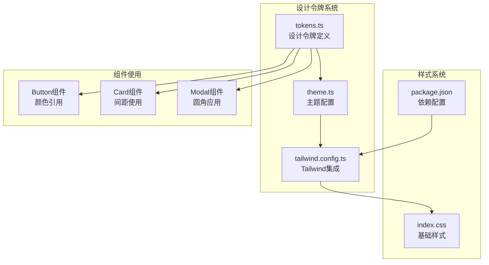
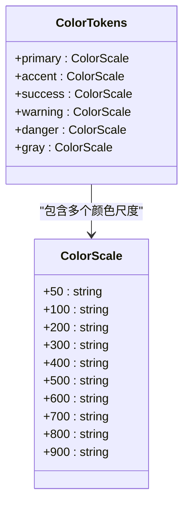
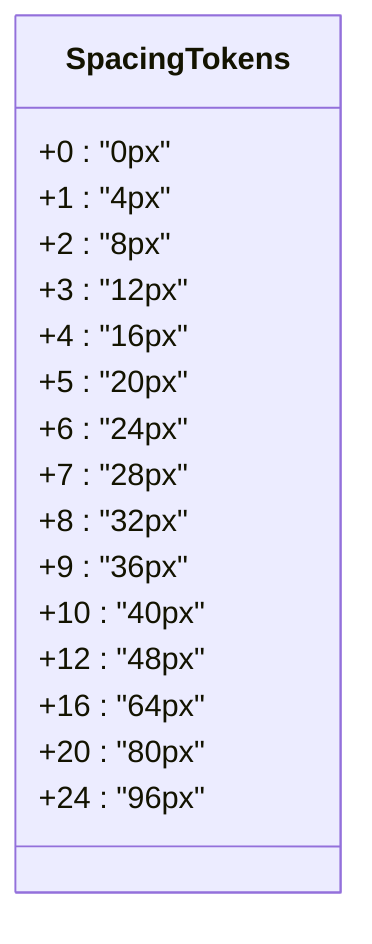
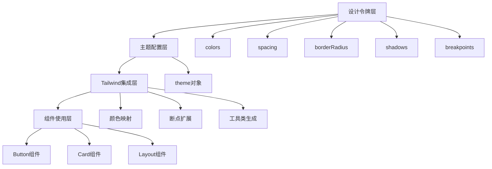
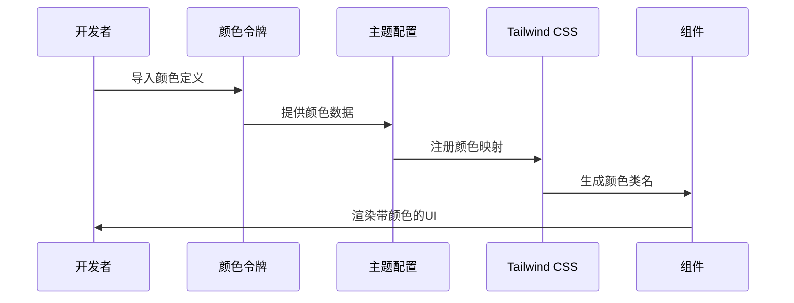
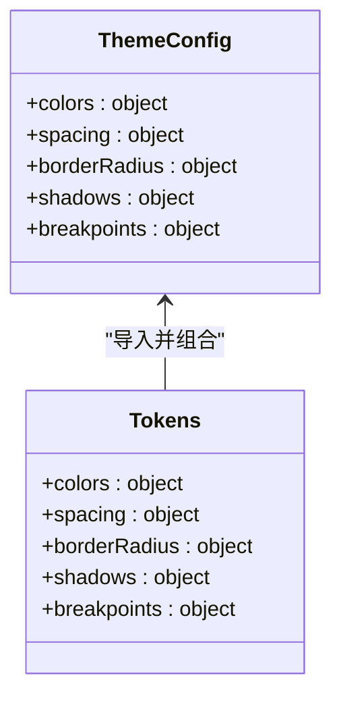
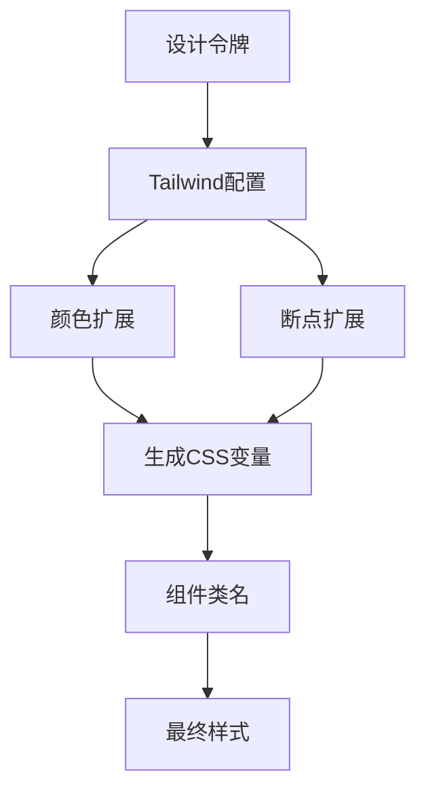
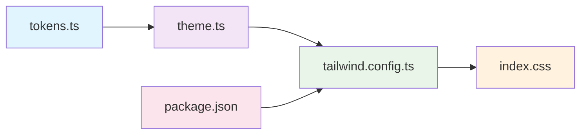

# 设计令牌系统

<cite>
**本文档引用的文件**
- [tokens.ts](file://apps/AgentPit/packages/ui/src/styles/tokens.ts)
- [theme.ts](file://apps/AgentPit/packages/ui/src/styles/theme.ts)
- [tailwind.config.ts](file://apps/AgentPit/tailwind.config.ts)
- [index.css](file://apps/AgentPit/src-react-backup-20260410/index.css)
- [package.json](file://apps/AgentPit/packages/ui/package.json)
</cite>

## 目录
1. [简介](#简介)
2. [项目结构](#项目结构)
3. [核心组件](#核心组件)
4. [架构概览](#架构概览)
5. [详细组件分析](#详细组件分析)
6. [依赖分析](#依赖分析)
7. [性能考虑](#性能考虑)
8. [故障排除指南](#故障排除指南)
9. [结论](#结论)
10. [附录](#附录)

## 简介

设计令牌系统是现代前端开发中的重要基础设施，它通过统一的设计变量来确保界面元素在不同组件和页面间保持视觉一致性。本系统采用模块化设计，将颜色、间距、圆角半径、阴影和断点等设计属性抽象为可重用的令牌，为整个应用提供一致的视觉语言。

该系统的核心价值在于：
- **一致性保证**：通过集中管理设计变量，确保所有组件遵循统一的设计规范
- **可维护性**：单一事实来源，便于全局修改和版本控制
- **团队协作**：标准化的设计词汇表，降低沟通成本
- **扩展性**：灵活的模块化架构，支持新组件和新主题的快速集成

## 项目结构

设计令牌系统主要分布在以下位置：

**图表来源**
- [tokens.ts:1-121](file://apps/AgentPit/packages/ui/src/styles/tokens.ts#L1-L121)
- [theme.ts:1-12](file://apps/AgentPit/packages/ui/src/styles/theme.ts#L1-L12)
- [tailwind.config.ts:1-27](file://apps/AgentPit/tailwind.config.ts#L1-L27)

**章节来源**
- [tokens.ts:1-121](file://apps/AgentPit/packages/ui/src/styles/tokens.ts#L1-L121)
- [theme.ts:1-12](file://apps/AgentPit/packages/ui/src/styles/theme.ts#L1-L12)
- [tailwind.config.ts:1-27](file://apps/AgentPit/tailwind.config.ts#L1-L27)

## 核心组件

### 颜色系统设计

颜色系统采用层次化的命名约定，支持从50到900的渐变级别，确保在不同背景下的可访问性和对比度要求。

**图表来源**
- [tokens.ts:1-74](file://apps/AgentPit/packages/ui/src/styles/tokens.ts#L1-L74)

### 间距系统设计

间距系统采用基于4px的增量体系，提供从0到96px的完整覆盖范围，支持响应式布局需求。

**图表来源**
- [tokens.ts:76-92](file://apps/AgentPit/packages/ui/src/styles/tokens.ts#L76-L92)

**章节来源**
- [tokens.ts:1-121](file://apps/AgentPit/packages/ui/src/styles/tokens.ts#L1-L121)

## 架构概览

设计令牌系统采用分层架构，确保各层职责清晰分离：

**图表来源**
- [tokens.ts:1-121](file://apps/AgentPit/packages/ui/src/styles/tokens.ts#L1-L121)
- [theme.ts:1-12](file://apps/AgentPit/packages/ui/src/styles/theme.ts#L1-L12)
- [tailwind.config.ts:1-27](file://apps/AgentPit/tailwind.config.ts#L1-L27)

## 详细组件分析

### 颜色令牌实现

颜色系统采用HSL色彩空间，确保颜色在不同设备和显示条件下的一致性表现。

**图表来源**
- [tokens.ts:1-74](file://apps/AgentPit/packages/ui/src/styles/tokens.ts#L1-L74)
- [theme.ts:1-12](file://apps/AgentPit/packages/ui/src/styles/theme.ts#L1-L12)
- [tailwind.config.ts:9-22](file://apps/AgentPit/tailwind.config.ts#L9-L22)

### 主题配置机制

主题配置层负责将设计令牌转换为主题可用的数据结构：

**图表来源**
- [theme.ts:3-9](file://apps/AgentPit/packages/ui/src/styles/theme.ts#L3-L9)

### Tailwind CSS集成

Tailwind CSS通过配置文件扩展原生设计令牌：

**图表来源**
- [tailwind.config.ts:7-24](file://apps/AgentPit/tailwind.config.ts#L7-L24)

**章节来源**
- [theme.ts:1-12](file://apps/AgentPit/packages/ui/src/styles/theme.ts#L1-L12)
- [tailwind.config.ts:1-27](file://apps/AgentPit/tailwind.config.ts#L1-L27)

## 依赖分析

设计令牌系统的依赖关系呈现清晰的单向流动：

**图表来源**
- [tokens.ts:1-121](file://apps/AgentPit/packages/ui/src/styles/tokens.ts#L1-L121)
- [theme.ts:1-12](file://apps/AgentPit/packages/ui/src/styles/theme.ts#L1-L12)
- [tailwind.config.ts:1-27](file://apps/AgentPit/tailwind.config.ts#L1-L27)
- [package.json:1-58](file://apps/AgentPit/packages/ui/package.json#L1-L58)

**章节来源**
- [package.json:1-58](file://apps/AgentPit/packages/ui/package.json#L1-L58)

## 性能考虑

设计令牌系统在性能方面的优化策略：

### 构建时优化
- **预计算颜色值**：在构建时确定所有颜色变体，减少运行时计算
- **CSS变量缓存**：利用浏览器缓存机制，避免重复计算
- **按需加载**：仅生成实际使用的颜色和间距变体

### 运行时优化
- **最小化DOM操作**：通过类名切换而非内联样式
- **高效的样式更新**：使用原子化CSS减少样式冲突
- **内存优化**：避免创建不必要的JavaScript对象

## 故障排除指南

### 常见问题及解决方案

**问题1：颜色不生效**
- 检查Tailwind配置中的颜色扩展是否正确
- 确认CSS文件是否正确引入
- 验证颜色名称是否符合Tailwind命名规范

**问题2：间距不一致**
- 检查spacing令牌的数值定义
- 确认组件中使用的间距单位
- 验证父容器的盒模型设置

**问题3：主题切换失效**
- 检查CSS变量的动态更新机制
- 确认主题状态管理逻辑
- 验证样式优先级设置

**章节来源**
- [tailwind.config.ts:1-27](file://apps/AgentPit/tailwind.config.ts#L1-L27)
- [index.css:1-18](file://apps/AgentPit/src-react-backup-20260410/index.css#L1-L18)

## 结论

设计令牌系统通过模块化、层次化的架构设计，为整个应用提供了统一、可维护的设计语言。其核心优势包括：

- **一致性保障**：通过集中管理设计变量，确保跨组件的一致性
- **可扩展性**：模块化设计支持新功能的快速集成
- **团队协作友好**：标准化的设计词汇表降低沟通成本
- **性能优化**：构建时优化和运行时效率的双重保障

该系统为后续的功能扩展和维护奠定了坚实的基础，建议在团队开发中严格遵守既定的设计规范和使用流程。

## 附录

### 使用示例路径

以下是一些关键的使用示例位置：

- **颜色引用示例**：[tokens.ts:1-74](file://apps/AgentPit/packages/ui/src/styles/tokens.ts#L1-L74)
- **间距使用示例**：[tokens.ts:76-92](file://apps/AgentPit/packages/ui/src/styles/tokens.ts#L76-L92)
- **主题配置示例**：[theme.ts:1-12](file://apps/AgentPit/packages/ui/src/styles/theme.ts#L1-L12)
- **Tailwind集成示例**：[tailwind.config.ts:1-27](file://apps/AgentPit/tailwind.config.ts#L1-L27)

### 最佳实践建议

1. **命名规范**：保持一致的颜色和间距命名约定
2. **版本控制**：定期审查和更新设计令牌
3. **文档维护**：及时更新设计系统的使用文档
4. **测试验证**：建立设计令牌变更的测试流程
5. **团队培训**：确保所有开发者熟悉设计系统规范