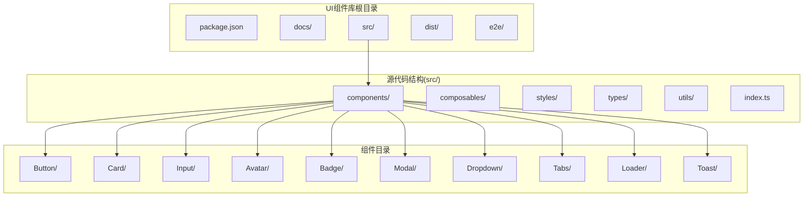
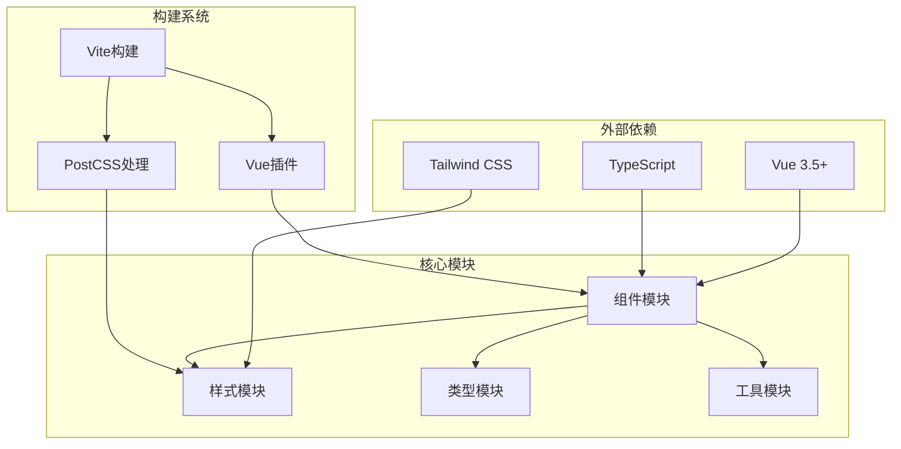

# UI组件系统

<cite>
**本文引用的文件**
- [README.md](file://apps/AgentPit/packages/ui/README.md)
- [package.json](file://apps/AgentPit/packages/ui/package.json)
- [tailwind.config.ts](file://apps/AgentPit/packages/ui/tailwind.config.ts)
- [vite.config.ts](file://apps/AgentPit/packages/ui/vite.config.ts)
- [docs/index.md](file://apps/AgentPit/packages/ui/docs/index.md)
- [src/index.ts](file://apps/AgentPit/packages/ui/src/index.ts)
- [src/components/index.ts](file://apps/AgentPit/packages/ui/src/components/index.ts)
- [src/components/Button/Button.vue](file://apps/AgentPit/packages/ui/src/components/Button/Button.vue)
- [src/components/Button/Button.types.ts](file://apps/AgentPit/packages/ui/src/components/Button/Button.types.ts)
- [src/types/component.ts](file://apps/AgentPit/packages/ui/src/types/component.ts)
- [src/styles/tokens.ts](file://apps/AgentPit/packages/ui/src/styles/tokens.ts)
- [apps/AgentPit/e2e/theme-switching.spec.ts](file://apps/AgentPit/e2e/theme-switching.spec.ts)
- [apps/AgentPit/e2e/responsive-layout.spec.ts](file://apps/AgentPit/e2e/responsive-layout.spec.ts)
</cite>

## 目录
1. [简介](#简介)
2. [项目结构](#项目结构)
3. [核心组件](#核心组件)
4. [架构总览](#架构总览)
5. [详细组件分析](#详细组件分析)
6. [依赖关系分析](#依赖关系分析)
7. [性能考虑](#性能考虑)
8. [故障排除指南](#故障排除指南)
9. [结论](#结论)
10. [附录](#附录)

## 简介
DAOApps UI组件系统是基于Vue 3与Tailwind CSS构建的现代化组件库，专为AgentPit项目设计。该组件库采用模块化架构，提供高度可定制的设计系统，支持TypeScript与Composition API，并通过VitePress提供完整的文档与示例。

组件库的核心特性包括：
- 基于Tailwind CSS的设计系统，提供一致的视觉语言
- Vue 3 Composition API驱动的组件实现
- TypeScript类型安全支持
- 高度可定制的主题与样式系统
- 完整的文档与示例页面

## 项目结构
UI组件库采用清晰的分层组织结构，主要包含以下核心目录：



**图表来源**
- [src/index.ts:1-6](file://apps/AgentPit/packages/ui/src/index.ts#L1-L6)
- [src/components/index.ts:1-20](file://apps/AgentPit/packages/ui/src/components/index.ts#L1-L20)

**章节来源**
- [package.json:1-58](file://apps/AgentPit/packages/ui/package.json#L1-L58)
- [src/index.ts:1-6](file://apps/AgentPit/packages/ui/src/index.ts#L1-L6)

## 核心组件
根据组件库文档，核心组件包括以下九个基础UI组件：

### 组件清单
- **Button** - 按钮组件：支持多种变体和尺寸，提供基础交互功能
- **Card** - 卡片组件：用于内容分组和展示
- **Input** - 输入框组件：处理用户输入数据
- **Avatar** - 头像组件：显示用户头像或占位符
- **Badge** - 徽章组件：用于标记状态或数量
- **Modal** - 模态框组件：提供弹窗式对话框
- **Dropdown** - 下拉菜单组件：实现下拉选择功能
- **Tabs** - 标签页组件：管理多面板内容切换
- **Loader** - 加载组件：显示加载状态
- **Toast** - 提示组件：提供非侵入式消息提示

### 设计原则
组件库遵循统一的设计原则：
- **一致性**：所有组件共享相同的设计语言和交互模式
- **可访问性**：内置ARIA属性和键盘导航支持
- **响应式**：适配不同屏幕尺寸和设备
- **可定制性**：通过Tailwind类名和CSS变量实现深度定制
- **性能**：按需加载和优化渲染

**章节来源**
- [docs/index.md:34-46](file://apps/AgentPit/packages/ui/docs/index.md#L34-L46)

## 架构总览
UI组件库采用模块化架构，通过清晰的依赖关系实现松耦合设计：



**图表来源**
- [package.json:31-47](file://apps/AgentPit/packages/ui/package.json#L31-L47)
- [vite.config.ts:1-30](file://apps/AgentPit/packages/ui/vite.config.ts#L1-L30)

### 构建配置
组件库使用Vite进行构建，支持ES和CJS两种格式输出，确保在不同环境下的兼容性。

**章节来源**
- [vite.config.ts:7-23](file://apps/AgentPit/packages/ui/vite.config.ts#L7-L23)
- [tailwind.config.ts:4-19](file://apps/AgentPit/packages/ui/tailwind.config.ts#L4-L19)

## 详细组件分析

### Button组件分析
Button组件是UI库的核心交互组件，提供了丰富的变体和尺寸选项。

#### 类型定义
```mermaid
classDiagram
class BaseButtonProps {
+boolean disabled
+boolean loading
+string ariaLabel
+string className
+string style
}
class ButtonVariant {
<<enumeration>>
"default"
"primary"
"secondary"
"success"
"warning"
"danger"
"outline"
"ghost"
}
class ButtonSize {
<<enumeration>>
"xs"
"sm"
"md"
"lg"
"xl"
}
class ButtonProps {
+ButtonVariant variant
+ButtonSize size
+boolean block
+boolean iconOnly
+string leftIcon
+string rightIcon
}
BaseButtonProps <|-- ButtonProps
ButtonVariant --> ButtonProps : uses
ButtonSize --> ButtonProps : uses
```

**图表来源**
- [src/components/Button/Button.types.ts:1-8](file://apps/AgentPit/packages/ui/src/components/Button/Button.types.ts#L1-L8)
- [src/types/component.ts:9-20](file://apps/AgentPit/packages/ui/src/types/component.ts#L9-L20)

#### 组件属性详解
Button组件支持以下核心属性：

| 属性名 | 类型 | 默认值 | 描述 |
|--------|------|--------|------|
| variant | ButtonVariant | 'default' | 按钮外观变体 |
| size | ButtonSize | 'md' | 按钮尺寸规格 |
| disabled | boolean | false | 是否禁用按钮 |
| loading | boolean | false | 是否显示加载状态 |
| block | boolean | false | 是否占据整行宽度 |
| iconOnly | boolean | false | 是否仅显示图标 |
| leftIcon | string | null | 左侧图标名称 |
| rightIcon | string | null | 右侧图标名称 |
| ariaLabel | string | null | 无障碍标签文本 |

#### 交互事件
Button组件提供标准的点击事件处理，支持键盘交互和无障碍访问。

#### 使用示例路径
- 基础按钮使用：[Button.vue:1-20](file://apps/AgentPit/packages/ui/src/components/Button/Button.vue#L1-L20)
- 变体样式应用：[Button.types.ts:1-8](file://apps/AgentPit/packages/ui/src/components/Button/Button.types.ts#L1-L8)

**章节来源**
- [src/components/Button/Button.vue:1-20](file://apps/AgentPit/packages/ui/src/components/Button/Button.vue#L1-L20)
- [src/components/Button/Button.types.ts:1-8](file://apps/AgentPit/packages/ui/src/components/Button/Button.types.ts#L1-L8)
- [src/types/component.ts:9-20](file://apps/AgentPit/packages/ui/src/types/component.ts#L9-L20)

### Card组件分析
Card组件用于内容分组和信息展示，支持多种变体配置。

#### 组件特性
- 支持标题、描述、操作区域
- 可配置阴影和圆角
- 支持图片和媒体内容
- 响应式布局适配

#### 使用场景
- 用户信息卡片
- 功能入口卡片
- 内容预览卡片
- 设置项卡片

### Input组件分析
Input组件提供表单输入功能，支持多种输入类型和验证状态。

#### 输入类型支持
- 文本输入
- 数字输入
- 密码输入
- 邮箱输入
- 电话号码输入

#### 验证状态
- 成功状态
- 错误状态
- 警告状态
- 加载状态

## 依赖关系分析
UI组件库的依赖关系体现了清晰的分层架构：

```mermaid
graph LR
subgraph "运行时依赖"
Vue[Vue 3.5.0]
TailwindCSS[Tailwind CSS]
CVa[Class Variance Authority]
CLSX[CLSX]
TWMerge[Tailwind Merge]
end
subgraph "开发依赖"
Vite[Vite]
VueTS[Vite Plugin Vue]
TS[TypeScript]
VP[VitePress]
end
subgraph "组件库"
APUI[@agentpit/ui]
Styles[样式系统]
Tokens[设计令牌]
Types[类型定义]
end
Vue --> APUI
TailwindCSS --> APUI
CVa --> APUI
CLSX --> APUI
TWMerge --> APUI
Vite --> APUI
VueTS --> APUI
TS --> APUI
VP --> APUI
APUI --> Styles
Styles --> Tokens
APUI --> Types
```

**图表来源**
- [package.json:31-47](file://apps/AgentPit/packages/ui/package.json#L31-L47)

### 外部依赖分析
- **Vue 3.5.0+**: 组件库的核心运行时框架
- **Tailwind CSS**: 原子化CSS框架，提供样式系统
- **Class Variance Authority**: 组件变体系统
- **CLSX**: 条件类名合并工具
- **Tailwind Merge**: Tailwind类名冲突解决

**章节来源**
- [package.json:31-47](file://apps/AgentPit/packages/ui/package.json#L31-L47)

## 性能考虑
UI组件库在性能方面采用了多项优化策略：

### 按需加载
- 组件库支持Tree Shaking，仅打包使用的组件
- 样式系统通过原子化CSS减少CSS体积
- 类名动态生成避免重复样式定义

### 渲染优化
- 使用Vue 3的Composition API提升渲染性能
- 组件状态管理优化，减少不必要的重渲染
- 图标和媒体资源懒加载

### 样式优化
- Tailwind CSS的原子化特性减少CSS文件大小
- 设计令牌集中管理，避免样式重复定义
- CSS变量支持主题切换的高效实现

## 故障排除指南
针对UI组件库可能遇到的问题提供解决方案：

### 常见问题
1. **组件样式不生效**
   - 确保已导入组件样式：`import '@agentpit/ui/styles'`
   - 检查Tailwind CSS配置是否正确
   - 验证CSS类名拼写

2. **TypeScript类型错误**
   - 确保安装了正确的Vue版本
   - 检查组件属性类型定义
   - 验证TypeScript配置

3. **构建错误**
   - 检查Vite配置文件
   - 确认依赖版本兼容性
   - 清理node_modules重新安装

### 主题切换测试
组件库提供了完整的主题切换测试用例，确保深色模式和浅色模式的正确性。

**章节来源**
- [apps/AgentPit/e2e/theme-switching.spec.ts:1-50](file://apps/AgentPit/e2e/theme-switching.spec.ts#L1-L50)

## 结论
DAOApps UI组件系统是一个设计精良、功能完备的Vue 3组件库。其模块化架构、TypeScript支持和Tailwind CSS集成使其成为构建现代Web应用的理想选择。组件库不仅提供了丰富的UI组件，还具备良好的可扩展性和可维护性。

通过统一的设计语言、完善的类型系统和优化的性能表现，该组件库能够满足从简单页面到复杂应用的各种UI需求。同时，完整的文档和示例为开发者提供了良好的使用体验。

## 附录

### 安装与使用
```bash
# 安装组件库
npm install @agentpit/ui

# 在Vue应用中使用
<script setup>
import { Button } from '@agentpit/ui'
import '@agentpit/ui/styles'
</script>

<template>
  <Button variant="primary">点击我</Button>
</template>
```

### 开发指南
- 使用Vite进行本地开发
- 通过VitePress构建文档
- 支持TypeScript类型检查
- 集成ESLint代码规范

### 测试覆盖
- E2E测试确保跨浏览器兼容性
- 响应式布局测试
- 主题切换功能测试
- 无障碍访问测试

**章节来源**
- [README.md:1-31](file://apps/AgentPit/packages/ui/README.md#L1-L31)
- [docs/index.md:13-64](file://apps/AgentPit/packages/ui/docs/index.md#L13-L64)