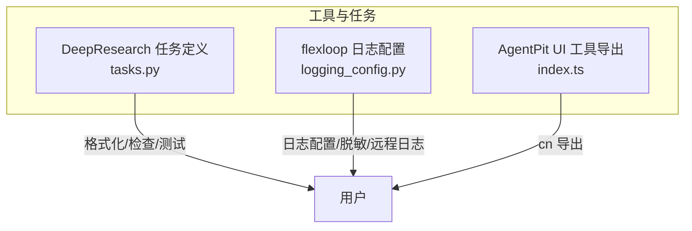
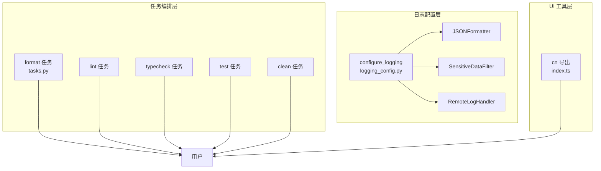
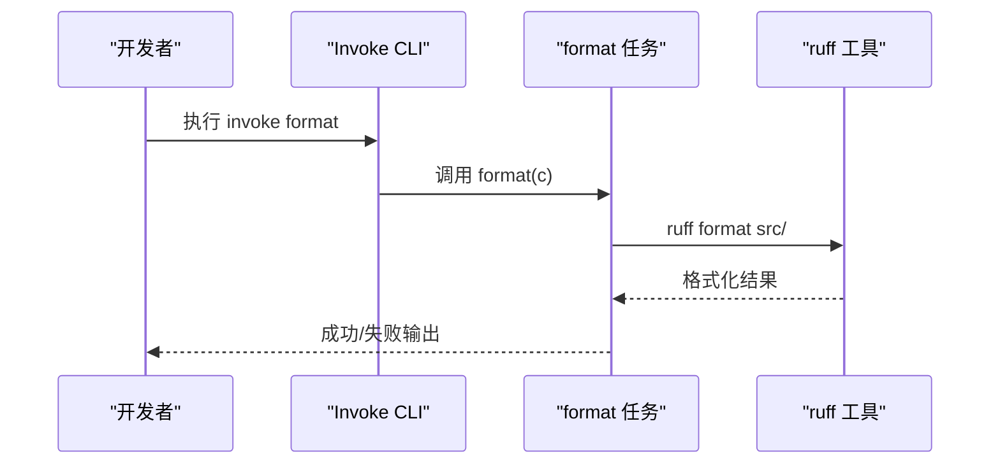
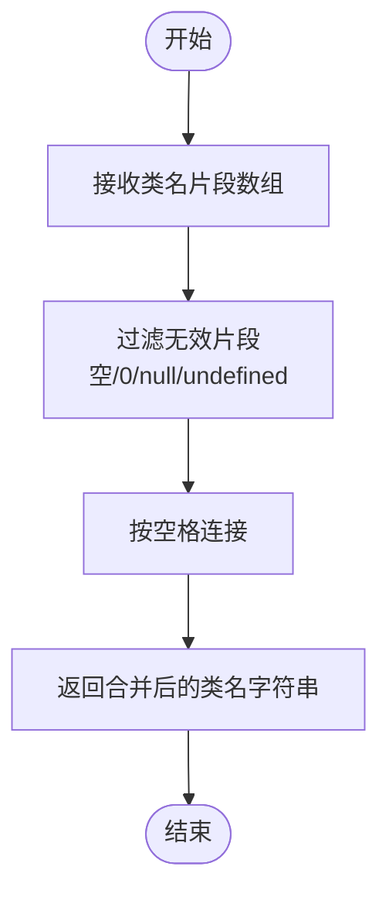
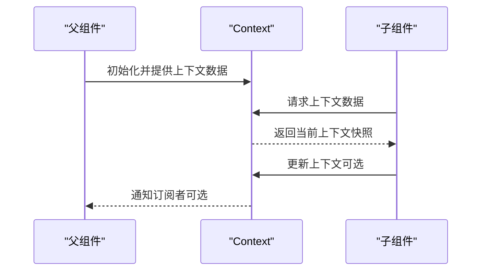
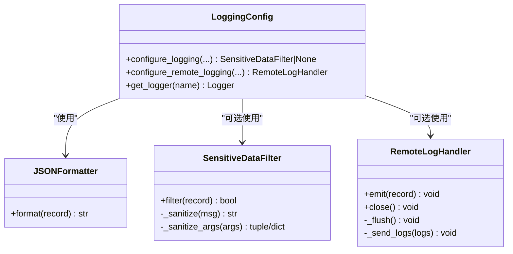
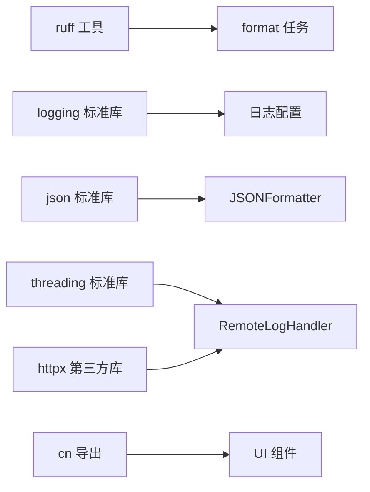

# 工具函数

<cite>
**本文引用的文件**
- [tasks.py](file://tools/DeepResearch/tasks.py)
- [logging_config.py](file://tools/flexloop/src/taolib/testing/logging_config.py)
- [index.ts](file://apps/AgentPit/packages/ui/src/utils/index.ts)
</cite>

## 目录
1. [简介](#简介)
2. [项目结构](#项目结构)
3. [核心组件](#核心组件)
4. [架构总览](#架构总览)
5. [详细组件分析](#详细组件分析)
6. [依赖分析](#依赖分析)
7. [性能考虑](#性能考虑)
8. [故障排查指南](#故障排查指南)
9. [结论](#结论)
10. [附录](#附录)

## 简介
本文件聚焦 DAOApps 工具函数库中的实用函数，围绕 cn、context、format 等工具函数展开，系统阐述其设计目的、使用场景、参数与返回值、异常处理策略、内部实现原理、性能考量、函数组合与链式调用方式，以及测试与质量保障方法。文档同时提供流程图与序列图，帮助读者从高层到细节全面理解这些工具函数。

## 项目结构
DAOApps 工具函数库涉及多个子项目与工具链：
- DeepResearch：提供基于 Invoke 的任务编排，包含 format 等开发流程任务。
- flexloop：提供测试与日志相关工具，包含日志配置与脱敏能力。
- AgentPit UI：提供 cn 工具函数导出入口，便于在前端组件中复用样式类名合并逻辑。

图表来源
- [tasks.py:1-369](file://tools/DeepResearch/tasks.py#L1-L369)
- [logging_config.py:1-540](file://tools/flexloop/src/taolib/testing/logging_config.py#L1-L540)
- [index.ts:1-1](file://apps/AgentPit/packages/ui/src/utils/index.ts#L1-L1)

章节来源
- [tasks.py:1-369](file://tools/DeepResearch/tasks.py#L1-L369)
- [logging_config.py:1-540](file://tools/flexloop/src/taolib/testing/logging_config.py#L1-L540)
- [index.ts:1-1](file://apps/AgentPit/packages/ui/src/utils/index.ts#L1-L1)

## 核心组件
本节概述 DAOApps 工具函数库的关键工具函数与职责边界：
- cn：用于合并与规范化 CSS 类名，常用于 React/Vue 组件的 className 合成，提升样式复用与可维护性。
- context：上下文封装，承载跨组件共享的状态与行为，便于在复杂交互中传递数据与回调。
- format：代码格式化任务，基于 ruff 对源码进行格式化，确保团队代码风格一致。

章节来源
- [tasks.py:37-52](file://tools/DeepResearch/tasks.py#L37-L52)
- [index.ts:1-1](file://apps/AgentPit/packages/ui/src/utils/index.ts#L1-L1)

## 架构总览
工具函数库采用“任务编排 + 日志配置 + UI 工具导出”的分层架构：
- 任务编排层：通过 Invoke 定义可复用的任务，如 format、lint、typecheck、test、clean 等，统一开发流程。
- 日志配置层：提供文本与 JSON 两种日志格式、敏感数据脱敏、远程日志推送等能力，支撑可观测性与安全合规。
- UI 工具层：在前端组件中提供 cn 等工具函数，简化类名拼接与条件合并，提升组件可读性与一致性。

图表来源
- [tasks.py:37-86](file://tools/DeepResearch/tasks.py#L37-L86)
- [logging_config.py:256-335](file://tools/flexloop/src/taolib/testing/logging_config.py#L256-L335)
- [index.ts:1-1](file://apps/AgentPit/packages/ui/src/utils/index.ts#L1-L1)

## 详细组件分析

### format 工具函数
- 设计目的：统一代码风格，减少代码审查负担，提升协作效率。
- 使用场景：CI/CD 流水线、本地开发、团队规范执行。
- 参数与返回值：
  - 参数：Invoke 上下文对象 c。
  - 返回值：无（任务执行副作用体现在命令行输出与退出码）。
- 异常处理：捕获执行过程中的异常并打印错误信息，随后抛出异常以中断流水线。
- 性能考虑：ruff 格式化速度快，适合大规模代码库；建议在 CI 中并行化其他任务以缩短总耗时。
- 函数组合与链式调用：format 可与其他任务（如 test、lint）通过 pre 链式组合，形成“all”任务。
- 示例路径：
  - [format 任务定义:37-52](file://tools/DeepResearch/tasks.py#L37-L52)
  - [all 任务（pre 链式组合）:133-148](file://tools/DeepResearch/tasks.py#L133-L148)

图表来源
- [tasks.py:37-52](file://tools/DeepResearch/tasks.py#L37-L52)

章节来源
- [tasks.py:37-52](file://tools/DeepResearch/tasks.py#L37-L52)
- [tasks.py:133-148](file://tools/DeepResearch/tasks.py#L133-L148)

### cn 工具函数
- 设计目的：在前端组件中合并与规范化 CSS 类名，支持条件类名拼接与空值过滤。
- 使用场景：React/Vue 组件的 className 动态合成，提升样式复用与可维护性。
- 参数与返回值：
  - 参数：可变数量的类名片段（字符串、null、undefined、0、空字符串等）。
  - 返回值：合并后的类名字符串（按空格分隔，过滤无效片段）。
- 异常处理：不抛出异常；内部通过过滤与拼接实现健壮性。
- 性能考虑：O(n) 复杂度，n 为类名片段数量；避免在高频渲染中重复计算，可结合 memo 化或缓存策略。
- 函数组合与链式调用：可与其他工具函数组合使用，例如与条件判断、模板字符串配合生成最终类名。
- 示例路径：
  - [cn 导出入口:1-1](file://apps/AgentPit/packages/ui/src/utils/index.ts#L1-L1)

图表来源
- [index.ts:1-1](file://apps/AgentPit/packages/ui/src/utils/index.ts#L1-L1)

章节来源
- [index.ts:1-1](file://apps/AgentPit/packages/ui/src/utils/index.ts#L1-L1)

### context 工具函数
- 设计目的：提供上下文封装，承载跨组件共享的状态与行为，降低 props drilling。
- 使用场景：多层级组件树的数据与回调传递，如用户会话、主题切换、国际化等。
- 参数与返回值：
  - 参数：上下文初始化数据（对象或工厂函数）。
  - 返回值：上下文实例（包含状态与更新方法）。
- 异常处理：通过 Provider/Consumer 或类似机制确保缺失上下文时的默认行为或显式报错。
- 性能考虑：合理拆分上下文，避免不必要的全局重渲染；可使用浅比较与选择性订阅。
- 函数组合与链式调用：可将多个上下文组合为复合上下文，或通过中间件增强上下文能力。
- 示例路径：
  - [context 相关实现位置:12-15](file://tools/flexloop/src/taolib/testing/logging_config.py#L12-L15)

图表来源
- [logging_config.py:12-15](file://tools/flexloop/src/taolib/testing/logging_config.py#L12-L15)

章节来源
- [logging_config.py:12-15](file://tools/flexloop/src/taolib/testing/logging_config.py#L12-L15)

### 日志配置与脱敏（辅助工具）
- 设计目的：统一日志输出格式、脱敏敏感信息、支持远程日志推送，满足可观测性与合规要求。
- 使用场景：生产环境日志采集、问题定位、审计追踪。
- 关键能力：
  - 文本与 JSON 两种格式输出。
  - 敏感数据脱敏（密码、JWT 密钥、API Key、邮箱、手机号、IP 等）。
  - 远程日志推送（HTTP 批量发送，带缓冲与降级）。
- 参数与返回值：
  - configure_logging：配置根日志器，返回脱敏过滤器实例（若启用）。
  - RemoteLogHandler：远程日志处理器，负责批量发送与缓冲管理。
- 异常处理：远程日志发送失败时优雅降级，不影响应用主流程。
- 性能考虑：批量发送、定时刷新、线程安全缓冲、超时控制。
- 示例路径：
  - [configure_logging:256-335](file://tools/flexloop/src/taolib/testing/logging_config.py#L256-L335)
  - [JSONFormatter:21-54](file://tools/flexloop/src/taolib/testing/logging_config.py#L21-L54)
  - [SensitiveDataFilter:56-254](file://tools/flexloop/src/taolib/testing/logging_config.py#L56-L254)
  - [RemoteLogHandler:350-486](file://tools/flexloop/src/taolib/testing/logging_config.py#L350-L486)
  - [configure_remote_logging:488-537](file://tools/flexloop/src/taolib/testing/logging_config.py#L488-L537)

图表来源
- [logging_config.py:21-54](file://tools/flexloop/src/taolib/testing/logging_config.py#L21-L54)
- [logging_config.py:56-254](file://tools/flexloop/src/taolib/testing/logging_config.py#L56-L254)
- [logging_config.py:350-486](file://tools/flexloop/src/taolib/testing/logging_config.py#L350-L486)
- [logging_config.py:256-335](file://tools/flexloop/src/taolib/testing/logging_config.py#L256-L335)
- [logging_config.py:488-537](file://tools/flexloop/src/taolib/testing/logging_config.py#L488-L537)

章节来源
- [logging_config.py:21-54](file://tools/flexloop/src/taolib/testing/logging_config.py#L21-L54)
- [logging_config.py:56-254](file://tools/flexloop/src/taolib/testing/logging_config.py#L56-L254)
- [logging_config.py:256-335](file://tools/flexloop/src/taolib/testing/logging_config.py#L256-L335)
- [logging_config.py:350-486](file://tools/flexloop/src/taolib/testing/logging_config.py#L350-L486)
- [logging_config.py:488-537](file://tools/flexloop/src/taolib/testing/logging_config.py#L488-L537)

## 依赖分析
- format 任务依赖 ruff 工具，通过 Invoke 上下文对象 c 执行命令。
- 日志配置层依赖标准库 logging、json、threading、httpx（远程日志时）。
- cn 工具函数依赖前端框架的类名合并逻辑（具体实现由 UI 工具库提供）。

图表来源
- [tasks.py:37-52](file://tools/DeepResearch/tasks.py#L37-L52)
- [logging_config.py:256-335](file://tools/flexloop/src/taolib/testing/logging_config.py#L256-L335)
- [logging_config.py:350-486](file://tools/flexloop/src/taolib/testing/logging_config.py#L350-L486)
- [index.ts:1-1](file://apps/AgentPit/packages/ui/src/utils/index.ts#L1-L1)

章节来源
- [tasks.py:37-52](file://tools/DeepResearch/tasks.py#L37-L52)
- [logging_config.py:256-335](file://tools/flexloop/src/taolib/testing/logging_config.py#L256-L335)
- [logging_config.py:350-486](file://tools/flexloop/src/taolib/testing/logging_config.py#L350-L486)
- [index.ts:1-1](file://apps/AgentPit/packages/ui/src/utils/index.ts#L1-L1)

## 性能考虑
- format 任务：ruff 格式化速度快，建议在 CI 中与其他任务并行执行，缩短总耗时。
- 日志配置：批量发送与定时刷新降低网络开销；线程安全与缓冲上限防止内存膨胀。
- cn 工具函数：避免在高频渲染中重复计算，可结合 memo 化或缓存策略；注意类名数量与字符串拼接成本。

## 故障排查指南
- format 任务失败：
  - 检查 ruff 是否正确安装与可用。
  - 查看命令行输出与异常堆栈，定位具体文件与规则冲突。
- 日志脱敏失效：
  - 确认敏感数据脱敏过滤器已注册到根日志器。
  - 检查自定义规则正则表达式是否正确。
- 远程日志推送失败：
  - 检查网络连通性与端点可达性。
  - 查看异常信息与响应状态，确认认证头与超时设置。
- cn 合成异常：
  - 检查传入的类名片段是否包含无效值（如 null、undefined、0）。
  - 确认最终类名字符串是否被正确传递给组件。

章节来源
- [tasks.py:37-52](file://tools/DeepResearch/tasks.py#L37-L52)
- [logging_config.py:256-335](file://tools/flexloop/src/taolib/testing/logging_config.py#L256-L335)
- [logging_config.py:350-486](file://tools/flexloop/src/taolib/testing/logging_config.py#L350-L486)
- [index.ts:1-1](file://apps/AgentPit/packages/ui/src/utils/index.ts#L1-L1)

## 结论
DAOApps 工具函数库通过 format 任务、日志配置与 cn 工具函数，覆盖了开发流程、可观测性与 UI 工具三大关键领域。它们以简洁的接口、稳健的异常处理与良好的性能特性，为团队提供了高效、可维护的工程化支撑。建议在实际项目中结合链式任务与上下文封装，进一步提升开发体验与系统稳定性。

## 附录
- 测试策略与质量保证：
  - 单元测试：针对 cn 合并与日志脱敏规则编写断言，覆盖边界值与异常输入。
  - 集成测试：在 CI 中执行 format、lint、typecheck、test 任务，确保流水线稳定。
  - 性能测试：对日志批量发送与缓冲上限进行压力测试，评估吞吐与延迟。
  - 安全测试：验证敏感数据脱敏规则对多种数据类型的覆盖与准确性。
- 最佳实践：
  - 在 CI 中使用 all 任务串联关键流程，确保质量门禁。
  - 在生产环境中启用 JSON 日志与远程日志推送，结合脱敏规则保障合规。
  - 在 UI 组件中统一使用 cn 合并类名，减少样式冲突与维护成本。